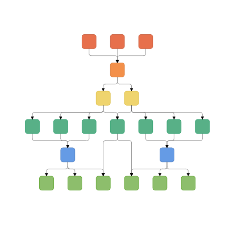

# Hierarchical layout in Blazor Diagram Component

The hierarchical tree layout arranges nodes in a tree-like structure, where the nodes in the hierarchical layout may have multiple parents. There is no need to specify the layout root. To arrange the nodes in a hierarchical structure, specify the layout [`Type`](https://help.syncfusion.com/cr/blazor/Syncfusion.Blazor.Diagrams.DiagramLayout.html#Syncfusion_Blazor_Diagrams_DiagramLayout_Type) as `HierarchicalTree`. The following example shows how to arrange the nodes in a hierarchical structure.

```cshtml
@using Syncfusion.Blazor.Diagrams
@using System.Collections.ObjectModel

<SfDiagram ID="diagram" Height="600px" Nodes="@NodeCollection" Connectors="@ConnectorCollection" NodeDefaults="@NodeDefaults" ConnectorDefaults="@ConnectorDefaults" Layout="@LayoutValue">
</SfDiagram>

@code {
    ObservableCollection<DiagramNode> NodeCollection;
    ObservableCollection<DiagramConnector> ConnectorCollection;
    //Uses layout to auto-arrange nodes on the diagram page
    DiagramLayout LayoutValue = new DiagramLayout()
    {
        //Sets layout type as HierarchicalTree...
        Type = LayoutType.HierarchicalTree,
        VerticalSpacing = 40, HorizontalSpacing = 40,
    };
    //Sets the default properties for nodes
    DiagramNode NodeDefaults = new DiagramNode()
    {
        Height = 40,
        Width = 100,
        //Initializing the default node's shape style
        Style = new NodeShapeStyle() { Fill = "darkcyan", StrokeWidth = 3, StrokeColor = "Black" },
        Annotations = new ObservableCollection<DiagramNodeAnnotation>()
        {
            new DiagramNodeAnnotation() { Style = new AnnotationStyle() { Color = "white", Bold = true }, }
        }
    };
    //Sets the default properties for the connectors
    DiagramConnector ConnectorDefaults = new DiagramConnector()
    {
        Type = Syncfusion.Blazor.Diagrams.Segments.Orthogonal,
    };

    protected override void OnInitialized()
    {
        //Initializing node and connectors
        NodeCollection = new ObservableCollection<DiagramNode>()
        {
            new DiagramNode(){Id="node1",Annotations = new ObservableCollection<DiagramNodeAnnotation>(){new DiagramNodeAnnotation(){Content="Steve-Ceo"}}},
            new DiagramNode(){Id="node2",Annotations = new ObservableCollection<DiagramNodeAnnotation>(){new DiagramNodeAnnotation(){Content="Kevin-Manager"}}},
            new DiagramNode(){Id="node3",Annotations = new ObservableCollection<DiagramNodeAnnotation>(){new DiagramNodeAnnotation(){Content="Peter-Manager"}}},
            new DiagramNode(){Id="node4",Annotations = new ObservableCollection<DiagramNodeAnnotation>(){new DiagramNodeAnnotation(){Content="Jim-CSE"}}},
            new DiagramNode(){Id="node5",Annotations = new ObservableCollection<DiagramNodeAnnotation>(){new DiagramNodeAnnotation(){Content="Martin-CSE"}}},
            new DiagramNode(){Id="node6",Annotations = new ObservableCollection<DiagramNodeAnnotation>(){new DiagramNodeAnnotation(){Content="John-Manager"}}},
            new DiagramNode(){Id="node7",Annotations = new ObservableCollection<DiagramNodeAnnotation>(){new DiagramNodeAnnotation(){Content="Mary-CSE"}}},
        };
        ConnectorCollection = new ObservableCollection<DiagramConnector>()
        {
            new DiagramConnector(){Id="connector1",SourceID="node1",TargetID="node2"},
            new DiagramConnector(){Id="connector2",SourceID="node1",TargetID="node3"},
            new DiagramConnector(){Id="connector3",SourceID="node2",TargetID="node4"},
            new DiagramConnector(){Id="connector4",SourceID="node2",TargetID="node5"},
            new DiagramConnector(){Id="connector5",SourceID="node3",TargetID="node6"},
            new DiagramConnector(){Id="connector6",SourceID="node3",TargetID="node7"},
        };
    }
}

```


## Customizing the properties

### Orientation

You can change the orientation at runtime. The following code is used to how to change the layout.

```csharp

// Change the orientation at runtime
public void UpdateOrientation()
{
    Diagram.Layout.Orientation = LayoutOrientation.BottomToTop;
}

```

### Spacing

You can change the horizontal and vertical spacing for the diagram layout.

```csharp
// Update the spacing
public void UpdateSpacing()
{
    Diagram.BeginUpdate();
    Diagram.Layout.HorizontalSpacing += 10;
    Diagram.Layout.VerticalSpacing += 10;
    Diagram.EndUpdate();
}
```

### Margin

You can change the margin values for the diagram layout.

```csharp
// Update the margin values
public void UpdateMargin()
{
    Diagram.BeginUpdate();
    Diagram.Layout.Margin.Left += 10;
    Diagram.Layout.Margin.Top += 10;
    Diagram.EndUpdate();
}
```

### Expand and collapse the layout

Diagram allows to expand or collapse the subtrees of a layout. The node’s isExpanded property allows you to expand or collapse its children. The following code example shows how to expand or collapse the children of a node.

```cshtml
@using Syncfusion.Blazor.Diagrams
@using System.Collections.ObjectModel

<SfDiagram ID="diagram" Height="600px" Layout="@LayoutValue" ConnectorDefaults="@ConnectorDefault" NodeDefaults="@NodeDefaults" SelectedItems="@selectedItems">
    <DiagramDataSource Id="Name" ParentId="Category" DataSource="@DataSource">
        <DiagramDataMapSettings>
            <DiagramDataMapSetting Property="Shape.TextContent" Field="Name"></DiagramDataMapSetting>
            <DiagramDataMapSetting Property="Style.StrokeColor" Field="FillColor"></DiagramDataMapSetting>
            <DiagramDataMapSetting Property="Style.Fill" Field="FillColor"></DiagramDataMapSetting>
        </DiagramDataMapSettings>
    </DiagramDataSource>
    <DiagramPageSettings>
        <DiagramFitOptions CanFit="@CanFit" Mode="@Mode"></DiagramFitOptions>
    </DiagramPageSettings>
</SfDiagram>

@code{

    DiagramSelectedItems selectedItems = new DiagramSelectedItems()
    {
        Constraints = SelectorConstraints.All & ~SelectorConstraints.ResizeAll & ~SelectorConstraints.Rotate
    };

    bool CanFit = true;
    FitModes Mode = FitModes.Width;
    TreeInfo LayoutInfo = new TreeInfo()
    {
        CanEnableSubTree = true,
        Orientation = SubTreeOrientation.Horizontal
    };
    DiagramLayout LayoutValue = new DiagramLayout() { };
    DiagramConnector ConnectorDefault = new DiagramConnector()
    {
        TargetDecorator = new ConnectorTargetDecorator() { Shape = DecoratorShapes.None },
        Type = Segments.Orthogonal,
        Style = new ConnectorShapeStyle() { StrokeColor = "#6d6d6d" },
        Constraints = 0,
        CornerRadius = 5
    };
    DiagramNode NodeDefaults = new DiagramNode
    {
        Style = new NodeShapeStyle() { Fill = "#659be5", StrokeColor = "none", Color = "white", StrokeWidth = 2, },
        BackgroundColor = "#659be5",
        Shape = new DiagramShape() { Type = Syncfusion.Blazor.Diagrams.Shapes.Text, Margin = new BasicShapeMargin() { Left = 10, Right = 10, Bottom = 10, Top = 10 } },
        ExpandIcon = new NodeExpandIcon()
        {
            Height = 10,
            Width = 10,
            Shape = IconShapes.Minus,
            Fill = "lightgray",
            Offset = new IconOffset() { X = 0.5, Y = 1 },
            VerticalAlignment = VerticalAlignment.Auto,
            Margin = new ExpandIconMargin() { Bottom = 0, Left = 0, Right = 0, Top = 0 }
        },
        CollapseIcon = new NodeCollapseIcon()
        {
            Offset = new IconOffset() { X = 0.5, Y = 1 },
            VerticalAlignment = VerticalAlignment.Auto,
            Height = 10,
            Width = 10,
            Shape = IconShapes.Plus,
            Fill = "lightgray",
            Padding = new IconPadding() { Top = 5 }
        }
    };

    public class HierarchicalDetails
    {
        public string Name { get; set; }
        public string FillColor { get; set; }
        public string Category { get; set; }
    }
    public List<object> DataSource = new List<object>()
    {
        new HierarchicalDetails(){ Name ="Diagram", Category="",FillColor="#659be5"},
        new HierarchicalDetails(){ Name ="Layout", Category="Diagram",FillColor="#659be5"},
        new HierarchicalDetails(){ Name ="Tree layout", Category="Layout",FillColor="#659be5"},
        new HierarchicalDetails(){ Name ="Organizational chart", Category="Layout",FillColor="#659be5"},
        new HierarchicalDetails(){ Name ="Hierarchical tree", Category="Tree layout",FillColor="#659be5"},
        new HierarchicalDetails(){ Name ="Radial tree", Category="Tree layout",FillColor="#659be5"},
        new HierarchicalDetails(){ Name ="Mind map", Category="Hierarchical tree",FillColor="#659be5"},
        new HierarchicalDetails(){ Name ="Family tree", Category="Hierarchical tree",FillColor="#659be5"},
        new HierarchicalDetails(){ Name ="Management", Category="Organizational chart",FillColor="#659be5"},
        new HierarchicalDetails(){ Name ="Human resources", Category="Management",FillColor="#659be5"},
        new HierarchicalDetails(){ Name ="University", Category="Management",FillColor="#659be5"},
        new HierarchicalDetails(){ Name ="Business", Category="#Management",FillColor="#659be5"}
    };
    protected override void OnInitialized()
    {
        LayoutValue = new DiagramLayout()
        {
            Type = LayoutType.HierarchicalTree,
            VerticalSpacing = 30,
            HorizontalSpacing = 30,
            EnableAnimation = true,
            LayoutInfo = this.LayoutInfo
        };
    }
}
```


> You can use the `EnableAnimation` property to enables or disables animation option when a node is expanded or collapsed.

## Complex hierarchical tree

Complex hierarchical tree layout is the extended version of the hierarchical tree layout. The child had been two or more parents. To create a complex hierarchical tree, the [`Type`](https://help.syncfusion.com/cr/blazor/Syncfusion.Blazor.Diagrams.DiagramLayout.html#Syncfusion_Blazor_Diagrams_DiagramLayout_Type) of layout should be set as `ComplexHierarchicalTree`.

The following code example shows how to create a complex hierarchical tree.

```cshtml
@using Syncfusion.Blazor.Diagrams
@using System.Collections.ObjectModel

    <SfDiagram @ref="@diagram" id="diagram" Height="600px" tool="@DiagramTools.ZoomPan" NodeDefaults="@NodeDefaults" ConnectorDefaults="@ConnectorDefault" Layout="@LayoutValue">
        <DiagramDataSource Id="Name" ParentId="ReportingPerson" DataMapSettings="@datamap" DataSource="@dataSource"></DiagramDataSource>
    </SfDiagram>

@code {
    SfDiagram diagram;
    List<DiagramDataMapSetting> datamap = new List<DiagramDataMapSetting>() {
        new DiagramDataMapSetting() { Property = "Style.fill", Field = "fillColor" },
        new DiagramDataMapSetting() { Property = "Style.strokeColor", Field = "border" }
    };

    DiagramLayout LayoutValue = new DiagramLayout()
    {
        Type = LayoutType.ComplexHierarchicalTree,
        HorizontalSpacing = 40,
        VerticalSpacing = 40,
        Orientation = LayoutOrientation.TopToBottom,
        Margin = new LayoutMargin() { Left = 20, Top = 20 },
    };

    DiagramNode NodeDefaults = new DiagramNode
    {
        Height = 40,
        Width = 40,
        Shape = new DiagramShape() { BasicShape = BasicShapes.Rectangle, Type = Syncfusion.Blazor.Diagrams.Shapes.Basic, CornerRadius = 7 },
    };

    DiagramConnector ConnectorDefault = new DiagramConnector
    {
        Type = Syncfusion.Blazor.Diagrams.Segments.Orthogonal,
        CornerRadius = 7,
        TargetDecorator = new ConnectorTargetDecorator() { Width = 7, Height = 7 },
        Style = new ConnectorShapeStyle() { StrokeColor = "#6d6d6d" }

    };
    public class DataModel
    {
        public string Name;
        public string fillColor;
        public string border;
        public string[] ReportingPerson;
    }
    public object dataSource = new List<object>()
    {
        new DataModel { Name = "node11", fillColor = "#e7704c", border = "#c15433" },
        new DataModel {  Name = "node12", ReportingPerson = new string[]{ "node114" }, fillColor = "#efd46e", border = "#d6b123" },
        new DataModel {  Name = "node13", ReportingPerson = new string[] { "node12" }, fillColor = "#58b087", border = "#16955e" },
        new DataModel {  Name = "node14", ReportingPerson = new string[] { "node12" }, fillColor = "#58b087", border = "#16955e" },
        new DataModel {  Name = "node15", ReportingPerson = new string[] { "node12" }, fillColor = "#58b087", border = "#16955e" },
        new DataModel {  Name = "node16", ReportingPerson = new string[] {}, fillColor = "#14ad85" },
        new DataModel {  Name = "node17", ReportingPerson = new string[] { "node13", "node14", "node15" }, fillColor = "#659be5", border = "#3a6eb5" },
        new DataModel {  Name = "node18", ReportingPerson = new string[] {}, fillColor = "#14ad85" },
        new DataModel {  Name = "node19", ReportingPerson = new string[] { "node16", "node17", "node18" }, fillColor = "#8dbe6c", border = "#489911" },
        new DataModel {  Name = "node110", ReportingPerson = new string[] { "node16", "node17", "node18" }, fillColor = "#8dbe6c", border = "#489911" },
        new DataModel {  Name = "node111", ReportingPerson = new string[] { "node16", "node17", "node18", "node116" }, fillColor = "#8dbe6c", border = "#489911" },
        new DataModel {  Name = "node21", fillColor = "#e7704c", border = "#c15433" },
        new DataModel {  Name = "node22", ReportingPerson = new string[] { "node114" }, fillColor = "#efd46e", border = "#d6b123" },
        new DataModel {  Name = "node23", ReportingPerson = new string[] { "node22" }, fillColor = "#58b087", border = "#16955e" },
        new DataModel {  Name = "node24", ReportingPerson = new string[] { "node22" }, fillColor = "#58b087", border = "#16955e" },
        new DataModel {  Name = "node25", ReportingPerson = new string[] { "node22" }, fillColor = "#58b087", border = "#16955e" },
        new DataModel {  Name = "node26", ReportingPerson = new string[] {}, fillColor = "#14ad85" },
        new DataModel {  Name = "node27", ReportingPerson = new string[] { "node23", "node24", "node25" }, fillColor = "#659be5", border = "#3a6eb5" },
        new DataModel {  Name = "node28", ReportingPerson = new string[] {}, fillColor = "#14ad85" },
        new DataModel {  Name = "node29", ReportingPerson = new string[] { "node26", "node27", "node28", "node116" }, fillColor = "#8dbe6c", border = "#489911" },
        new DataModel {  Name = "node210", ReportingPerson = new string[] { "node26", "node27", "node28" }, fillColor = "#8dbe6c", border = "#489911" },
        new DataModel {  Name = "node211", ReportingPerson = new string[] { "node26", "node27", "node28" }, fillColor = "#8dbe6c", border = "#489911" },
        new DataModel {  Name = "node31", fillColor = "#e7704c", border = "#c15433" },
        new DataModel {  Name = "node114", ReportingPerson = new string[] { "node11", "node21", "node31" }, fillColor = "#f3904a", border = "#d3722e" },
        new DataModel {  Name = "node116", ReportingPerson = new string[] { "node12", "node22" }, fillColor = "#58b087", border = "#16955e" }
    };
}
```



## See also

* [`How to create a node`](../nodes/nodes)

* [`How to create a connector`](../connectors/connectors)