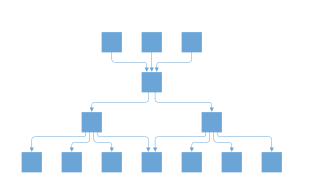

# Line Distribution

Line distribution is used to arrange the connectors without overlapping in automatic layout. In some cases, the automatic layout connectors connecting to the nodes will be overlapped with one another. So user can decide whether the segment of each connector from a single parent node should be same point or different point. The [`ConnectionPointOrigin`](https://help.syncfusion.com/cr/blazor/Syncfusion.Blazor.Diagrams.DiagramLayout.html#Syncfusion_Blazor_Diagrams_DiagramLayout_ConnectionPointOrigin) property of layout is used to enable or disable the line distribution in layout. By default ConnectionPointOrigin will be `SamePoint`.

The following code example illustrates how to create a complex hierarchical tree with line distribution.

```cshtml
@using Syncfusion.Blazor.Diagrams
@using System.Collections.ObjectModel

<SfDiagram ID="diagram" Height="600px" NodeDefaults="@NodeDefaults" ConnectorDefaults="@ConnectorDefaults" Layout="@LayoutValue">
    <DiagramDataSource Id="Name" ParentId="ReportingPerson" DataSource="@DataSource"></DiagramDataSource>
        <DiagramPageSettings>
            <DiagramFitOptions CanFit="true" Mode="FitModes.Width"></DiagramFitOptions>
        </DiagramPageSettings>
            <DiagramSnapSettings Constraints="SnapConstraints.None"></DiagramSnapSettings>
</SfDiagram>
        @code{

            DiagramLayout LayoutValue = new DiagramLayout() { };
            DiagramConnector ConnectorDefaults = new DiagramConnector()
            {
                Type = Segments.Orthogonal,
                CornerRadius = 7,
                TargetDecorator = new ConnectorTargetDecorator() { Width = 7, Height = 7, Style = new DecoratorShapeStyle() { Fill = "#6BA5D7", StrokeColor = "#6BA5D7" } },
                Style = new ConnectorShapeStyle() { StrokeColor = "#6BA5D7", StrokeWidth = 1 }
            };
            DiagramNode NodeDefaults = new DiagramNode
            {
                Height = 40,
                Width = 40,
                Style = new NodeShapeStyle() { StrokeWidth = 2, Fill = "#6BA5D7", StrokeColor = "None" },
                Shape = new DiagramShape() { BasicShape = BasicShapes.Rectangle, Type = Syncfusion.Blazor.Diagrams.Shapes.Basic },
                BackgroundColor = "#6BA5D7"
            };

            public class DataModel
            {
                public string Name;
                public string FillColor;
                public string[] ReportingPerson;
            }
            public object DataSource = new List<object>()
        {
        new DataModel { Name = "node11", FillColor = "#6BA5D7" },
        new DataModel {  Name = "node12", ReportingPerson = new string[]{ "node114" }, FillColor = "#6BA5D7" },
        new DataModel {  Name = "node13", ReportingPerson = new string[] { "node12" }, FillColor = "#6BA5D7" },
        new DataModel {  Name = "node14", ReportingPerson = new string[] { "node12" }, FillColor = "#6BA5D7" },
        new DataModel {  Name = "node15", ReportingPerson = new string[] { "node12" }, FillColor = "#6BA5D7" },
        new DataModel {  Name = "node18", ReportingPerson = new string[] {}, FillColor = "#6BA5D7" },
        new DataModel {  Name = "node21", FillColor = "#6BA5D7" },
        new DataModel {  Name = "node22", ReportingPerson = new string[] { "node114" }, FillColor = "#6BA5D7" },
        new DataModel {  Name = "node23", ReportingPerson = new string[] { "node22" }, FillColor = "#6BA5D7" },
        new DataModel {  Name = "node24", ReportingPerson = new string[] { "node22" }, FillColor = "#6BA5D7" },
        new DataModel {  Name = "node25", ReportingPerson = new string[] { "node22" }, FillColor = "#6BA5D7" },
        new DataModel {  Name = "node26", ReportingPerson = new string[] {}, FillColor = "#6BA5D7" },
        new DataModel {  Name = "node28", ReportingPerson = new string[] {}, FillColor = "#14ad85" },
        new DataModel {  Name = "node31", FillColor = "#6BA5D7" },
        new DataModel {  Name = "node114", ReportingPerson = new string[] { "node11", "node21", "node31" }, FillColor = "#6BA5D7" }


    };
            protected override void OnInitialized()
            {
                LayoutValue = new DiagramLayout()
                {
                    Type = LayoutType.ComplexHierarchicalTree,
                    VerticalAlignment = VerticalAlignment.Top,
                    HorizontalAlignment = HorizontalAlignment.Left,
                    HorizontalSpacing = 40,
                    VerticalSpacing = 40,
                    Orientation = LayoutOrientation.TopToBottom,
                    Margin = new LayoutMargin() { Left = 0, Top = 0, Bottom = 0, Right = 0 },
                    ConnectionPointOrigin = ConnectionPointOrigin.SamePoint
                };
            }
        }

```



## Prevent connectors overlay

The below constraints prevents the connector segments overlapping nodes with a complex hierarchical layout.

The following code illustrates how to prevents the connector segments overlapping in diagram layout.

```csharp
  
    protected override void OnInitialized()
        {
            LayoutValue = new DiagramLayout()
                {
                    //this prevents connector segments overlapping
                    enableRouting: true,
                };
            }
        }

```

## See also

* [`How to create a node`](../nodes/nodes)

* [`How to create a connector`](../connectors/connectors)
