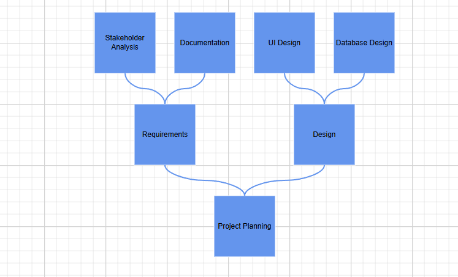

# Mind Map Layout in Blazor Diagram Component

A mind map is a diagram that displays the nodes as a spider diagram organizes information around a central concept. To create a mind map, set the layout [Type](https://help.syncfusion.com/cr/blazor/Syncfusion.Blazor.Diagram.Layout.html#Syncfusion_Blazor_Diagram_Layout_Type) to [MindMap](https://help.syncfusion.com/cr/blazor/Syncfusion.Blazor.Diagram.LayoutType.html#Syncfusion_Blazor_Diagram_LayoutType_MindMap).

To see a quick walkthrough of creating a mind map layout, watch the following video:



The following code example illustrates how to create a mind map layout using a data source.

```csharp
@using Syncfusion.Blazor.Diagram

<SfDiagramComponent Height="600px" NodeCreating="@OnNodeCreating" ConnectorCreating="@OnConnectorCreating">
    <DataSourceSettings ID="Id" ParentID="ParentId" DataSource="@DataSource"></DataSourceSettings>
    <Layout Type="LayoutType.MindMap">
        <LayoutMargin Top="20" Left="20"></LayoutMargin>
    </Layout>
</SfDiagramComponent>

@code 
{    
    //Creates nodes with some default values.
    private void OnNodeCreating(IDiagramObject obj)
    {
        Node node = obj as Node;
        node.Height = 25;
        node.Width = 25;
        node.BackgroundColor = "#6BA5D7";
        node.Style = new ShapeStyle() { Fill = "#6495ED", StrokeWidth = 1, StrokeColor = "white" };
        node.Shape = new BasicShape() { Type = NodeShapes.Basic }; ;
    }
    
    //Creates connectors with some default values.
    private void OnConnectorCreating(IDiagramObject connector)
    {
        Connector connectors = connector as Connector;
        connectors.Type = ConnectorSegmentType.Bezier;
        connectors.Style = new ShapeStyle() { StrokeColor = "#6495ED", StrokeWidth = 2 };
        connectors.TargetDecorator = new DecoratorSettings
        {
            Shape = DecoratorShape.None,
        };
    }

    public class MindMapDetails
    {
        public string Id { get; set; }
        public string Label { get; set; }
        public string ParentId { get; set; }
        public string Branch { get; set; }
        public string Fill { get; set; }
    }

    public object DataSource = new List<object>()
    {
        new MindMapDetails() { Id= "1",Label="Creativity", ParentId ="", Branch = "Root"},
        new MindMapDetails() { Id= "2",  Label="Brainstorming", ParentId ="1", Branch = "Right" },
        new MindMapDetails() { Id= "3",  Label="Complementing", ParentId ="1", Branch = "Left" },
        new MindMapDetails() { Id= "4",  Label="Sessions", ParentId ="2", Branch = "subRight" },
        new MindMapDetails() { Id= "5",  Label="Complementing", ParentId ="2", Branch = "subRight" },
        new MindMapDetails() { Id= "6", Label= "Local", ParentId ="3", Branch = "subRight"  },
        new MindMapDetails() { Id= "7", Label= "Remote", ParentId ="3", Branch = "subRight"  },
        new MindMapDetails() { Id= "8", Label= "Individual", ParentId ="3", Branch = "subRight" },
        new MindMapDetails() { Id= "9", Label= "Teams", ParentId ="3", Branch = "subRight" },
        new MindMapDetails() { Id= "10", Label= "Ideas", ParentId ="5", Branch = "subRight" },
        new MindMapDetails() { Id= "11", Label= "Engagement", ParentId ="5", Branch = "subRight" },
    };
}
```
A complete working sample can be downloaded from [GitHub](https://github.com/SyncfusionExamples/Blazor-Diagram-Examples/tree/master/UG-Samples/Layout/MindmapSample1)


You can also control the branch for a mind map using the [GetBranch](https://help.syncfusion.com/cr/blazor/Syncfusion.Blazor.Diagram.Layout.html#Syncfusion_Blazor_Diagram_Layout_GetBranch) method. The following example demonstrates how to configure all branches to appear on the right side using this method.

```csharp
@using Syncfusion.Blazor.Diagram

<SfDiagramComponent Height="600px" NodeCreating="@OnNodeCreating" ConnectorCreating="@OnConnectorCreating">
    <DataSourceSettings ID="Id" ParentID="ParentId" DataSource="@DataSource"></DataSourceSettings>
    <Layout Type="LayoutType.MindMap" GetBranch="@GetBranch">
        <LayoutMargin Top="20" Left="20"></LayoutMargin>
    </Layout>
</SfDiagramComponent>

@code 
{
    //Set all branches on the right side for mind map layout.
    private BranchType GetBranch(IDiagramObject obj)
    {
        if ((obj as Node).ID == "1")
        {
            return BranchType.Root;
        }
        return BranchType.Right;
    }
    
    //Creates connectors with some default values.
    private void OnNodeCreating(IDiagramObject obj)
    {
        Node node = obj as Node;
        node.Height = 50;
        node.Width = 100;
        node.Style = new ShapeStyle() { Fill = "#6495ED", StrokeWidth = 1, StrokeColor = "white" };
        node.Shape = new BasicShape() { Type = NodeShapes.Basic, Shape = NodeBasicShapes.Ellipse };
        MindMapDetails mindMapData = node.Data as MindMapDetails;
        node.Annotations = new DiagramObjectCollection<ShapeAnnotation>()
        {
            new ShapeAnnotation()
            {
                Content = mindMapData.Label
            }
        };
    }
    
    //Creates node with some default values.
    private void OnConnectorCreating(IDiagramObject connector)
    {
        Connector connectors = connector as Connector;
        connectors.Type = ConnectorSegmentType.Bezier;
        connectors.Style = new TextStyle() { StrokeColor = "#6495ED", StrokeWidth = 2 };
        connectors.TargetDecorator = new DecoratorSettings
        {
            Shape = DecoratorShape.None,
        };
    }

    public class MindMapDetails
    {
        public string Id { get; set; }
        public string Label { get; set; }
        public string ParentId { get; set; }
        public string Branch { get; set; }
        public string Fill { get; set; }
    }

    public object DataSource = new List<object>()
    {
        new MindMapDetails() { Id= "1",Label="Creativity", ParentId =""},
        new MindMapDetails() { Id= "2",  Label="Brainstorming", ParentId ="1"},
        new MindMapDetails() { Id= "3",  Label="Complementing", ParentId ="1"},
        new MindMapDetails() { Id= "4",  Label="Sessions", ParentId ="2"},
        new MindMapDetails() { Id= "5",  Label="Complementing", ParentId ="2"},
        new MindMapDetails() { Id= "6", Label= "Local", ParentId ="3"},
        new MindMapDetails() { Id= "7", Label= "Remote", ParentId ="3"},
        new MindMapDetails() { Id= "8", Label= "Individual", ParentId ="3"},
        new MindMapDetails() { Id= "9", Label= "Teams", ParentId ="3"},
        new MindMapDetails() { Id= "10", Label= "Ideas", ParentId ="5"},
        new MindMapDetails() { Id= "11", Label= "Engagement", ParentId ="5"},
    };
}
```
A complete working sample can be downloaded from [GitHub](https://github.com/SyncfusionExamples/Blazor-Diagram-Examples/tree/master/UG-Samples/Layout/MindmapSample2)


>**Note:** In DataSourceSettings, the ID and ParentID properties are string, and the provided DataSource should have a parent-child relationship. At least one node must have an empty ParentID to act as the root.

Also, you can render a mind map layout without using a Datasource. The following code demonstrates how to render a mind map layout without using DataSource.

```csharp
@using Syncfusion.Blazor.Diagram

<SfDiagramComponent Height="600px" Nodes="@nodes" Connectors="@connectors" NodeCreating="@OnNodeCreating" ConnectorCreating="@OnConnectorCreating">
    <Layout Type="LayoutType.MindMap" Root="@root">
        <LayoutMargin Top="20" Left="20"></LayoutMargin>
    </Layout>
</SfDiagramComponent>

@code
{
    //Initialize the diagram's nodes collection
    DiagramObjectCollection<Node> nodes = new DiagramObjectCollection<Node>();
    //Initialize the diagram's connectors collection
    DiagramObjectCollection<Connector> connectors = new DiagramObjectCollection<Connector>();
    string root = "node4";
    //Creates connectors with some default values.
    private void OnNodeCreating(IDiagramObject obj)
    {
        Node node = obj as Node;
        node.Height = 50;
        node.Width = 100;
        node.Style = new ShapeStyle() { Fill = "#6495ED", StrokeWidth = 1, StrokeColor = "white" };
        node.Shape = new BasicShape() { Type = NodeShapes.Basic, Shape = NodeBasicShapes.Ellipse };
    }

    //Creates node with some default values.
    private void OnConnectorCreating(IDiagramObject connector)
    {
        Connector connectors = connector as Connector;
        connectors.Type = ConnectorSegmentType.Bezier;
        connectors.Style = new TextStyle() { StrokeColor = "#6495ED", StrokeWidth = 2 };
        connectors.TargetDecorator = new DecoratorSettings
            {
                Shape = DecoratorShape.None,
            };
    }

    protected override void OnInitialized()
    {
        Node node1 = new Node()
            {
                ID = "node1",
                Width = 70,
                Height = 70,
                Ports = new DiagramObjectCollection<PointPort>()
{
                new PointPort()
                {
                    ID="left",
                    Offset = new DiagramPoint() { X = 1, Y = 0.5},
                },new PointPort()
                {
                    ID="right",
                    Offset = new DiagramPoint() { X = 0, Y = 0.5},
                }
            },
            };
        nodes.Add(node1);
        Node node2 = new Node()
            {
                ID = "node2",
                Width = 70,
                Ports = new DiagramObjectCollection<PointPort>()
{
                new PointPort()
                {
                    ID="left",
                    Offset = new DiagramPoint() { X = 0, Y = 0.5},
                }
            },
                Height = 70
            };
        nodes.Add(node2);
        Node node3 = new Node()
            {
                ID = "node3",
                Width = 70,
                Ports = new DiagramObjectCollection<PointPort>()
{
                new PointPort()
                {
                    ID="right",
                    Offset = new DiagramPoint() { X = 1, Y = 0.5},
                }
            },
                Height = 70
            };
        nodes.Add(node3);
        Node node4 = new Node()
            {
                ID = "node4",
                Width = 70,
                Height = 70
            };
        nodes.Add(node4);
        Node node5 = new Node()
            {
                ID = "node5",
                Width = 70,
                Height = 70
            };
        nodes.Add(node5);
        Node node6 = new Node()
            {
                ID = "node6",
                Width = 70,
                Height = 70
            };
        nodes.Add(node6);
        Node node7 = new Node()
            {
                ID = "node7",
                Width = 70,
                Height = 70
            };
        nodes.Add(node7);
        Node node8 = new Node()
            {
                ID = "node8",
                Width = 70,
                Height = 70
            };
        nodes.Add(node8);
        Node node9 = new Node()
            {
                ID = "node9",
                Width = 70,
                Height = 70
            };
        nodes.Add(node9);
        Node node10 = new Node()
            {
                ID = "node10",
                Width = 70,
                Height = 70
            };
        nodes.Add(node10);
        Node node11 = new Node()
            {
                ID = "node11",
                Width = 70,
                Height = 70,
            };
        nodes.Add(node11);
        Node node12 = new Node()
            {
                ID = "node12",
                Width = 70,
                Height = 70
            };
        nodes.Add(node12);
        Node node13 = new Node()
            {
                ID = "node13",
                Width = 70,
                Height = 70
            };
        nodes.Add(node13);
        Node node14 = new Node()
            {
                ID = "node14",
                Width = 70,
                Height = 70
            };
        Node node15 = new Node()
            {
                ID = "node15",
                Width = 70,
                Height = 70
            };
        Node node16 = new Node()
            {
                ID = "node16",
                Width = 70,
                Height = 70
            };
        nodes.Add(node14);
        Node node17 = new Node()
            {
                ID = "node17",
                Ports = new DiagramObjectCollection<PointPort>()
{
                new PointPort()
                {
                    ID="right",
                    Offset = new DiagramPoint() { X = 1, Y = 0.5},
                }
            },
                Width = 70,
                Height = 70,
            };
        nodes.Add(node15);
        nodes.Add(node16);
        nodes.Add(node17);

        Connector connector1 = new Connector() { ID = "connector1", SourceID = "node1", SourcePortID = "left", TargetID = "node2", TargetPortID = "left", Type = ConnectorSegmentType.Straight };
        connectors.Add(connector1);

        Connector connector2 = new Connector() { ID = "connector2", SourceID = "node1", SourcePortID = "right", TargetID = "node3", TargetPortID = "right", Type = ConnectorSegmentType.Straight };
        connectors.Add(connector2);

        Connector connector3 = new Connector() { ID = "connector3", SourceID = "node2", TargetID = "node4", Type = ConnectorSegmentType.Straight };
        connectors.Add(connector3);
        Connector connector4 = new Connector() { ID = "connector4", SourceID = "node2", TargetID = "node5", Type = ConnectorSegmentType.Straight };
        connectors.Add(connector4);
        Connector connector5 = new Connector() { ID = "connector5", SourceID = "node3", TargetID = "node6", Type = ConnectorSegmentType.Straight };
        connectors.Add(connector5);
        Connector connector6 = new Connector() { ID = "connector6", SourceID = "node3", TargetID = "node7", Type = ConnectorSegmentType.Straight };
        connectors.Add(connector6);
        Connector connector7 = new Connector() { ID = "connector7", SourceID = "node4", TargetID = "node8", Type = ConnectorSegmentType.Straight };
        connectors.Add(connector7);
        Connector connector8 = new Connector() { ID = "connector8", SourceID = "node4", TargetID = "node9", Type = ConnectorSegmentType.Straight };
        connectors.Add(connector8);
        Connector connector9 = new Connector() { ID = "connector9", SourceID = "node5", TargetID = "node10", Type = ConnectorSegmentType.Straight };
        connectors.Add(connector9);
        Connector connector10 = new Connector() { ID = "connector10", SourceID = "node5", TargetID = "node11", Type = ConnectorSegmentType.Straight };
        connectors.Add(connector10);
        Connector connector11 = new Connector() { ID = "connector11", SourceID = "node6", TargetID = "node12", Type = ConnectorSegmentType.Straight };
        connectors.Add(connector11);
        Connector connector12 = new Connector() { ID = "connector12", SourceID = "node6", TargetID = "node13", Type = ConnectorSegmentType.Straight };
        connectors.Add(connector12);
        Connector connector13 = new Connector() { ID = "connector13", SourceID = "node7", TargetID = "node14", Type = ConnectorSegmentType.Straight };
        connectors.Add(connector13);
        Connector connector14 = new Connector() { ID = "connector14", SourceID = "node7", TargetID = "node15", Type = ConnectorSegmentType.Straight };
        connectors.Add(connector14);
        Connector connector15 = new Connector() { ID = "connector15", SourceID = "node8", TargetID = "node16", Type = ConnectorSegmentType.Straight };
        connectors.Add(connector15);
        Connector connector16 = new Connector() { ID = "connector16", SourceID = "node8", TargetID = "node17", Type = ConnectorSegmentType.Straight };
        connectors.Add(connector16);

    }
}
```

A complete working sample can be downloaded from [GitHub](https://github.com/SyncfusionExamples/Blazor-Diagram-Examples/tree/master/UG-Samples/Layout/MindMapWithoutDataSource)

## How to Change the Mind Map Orientation

The [Orientation](https://help.syncfusion.com/cr/blazor/Syncfusion.Blazor.Diagram.Layout.html#Syncfusion_Blazor_Diagram_Layout_Orientation) property controls the direction in which the mind map expands. By default, the layout is set to **Horizontal**, which means nodes are arranged from left to right. To change the layout to vertical, set the `Orientation` property to **Vertical**.

The following example demonstrates configuring the mind map layout with a vertical orientation during component initialization.

```cshtml
@using Syncfusion.Blazor.Diagram

<SfDiagramComponent @ref="diagram" Height="600px" NodeCreating="OnNodeCreating" ConnectorCreating="OnConnectorCreating">
    <RulerSettings>
        <HorizontalRuler></HorizontalRuler>
        <VerticalRuler></VerticalRuler>
    </RulerSettings>
    <DataSourceSettings ID="Id" ParentID="ParentId" DataSource="DataSource">
    </DataSourceSettings>
    <Layout Type="LayoutType.MindMap" @bind-Orientation="SelectedOrientation" GetBranch="GetBranch" HorizontalSpacing="50">
        <LayoutMargin Top="20" Left="20"></LayoutMargin>
    </Layout>
</SfDiagramComponent>

@code {
    private SfDiagramComponent? diagram;
    public LayoutOrientation SelectedOrientation { get; set; } = LayoutOrientation.Vertical;
    public List<OrientationItem> LayoutOrientationOptions { get; set; } = new()
    {
        new OrientationItem { Text = "Vertical", Value = LayoutOrientation.Vertical },
        new OrientationItem { Text = "Horizontal", Value = LayoutOrientation.Horizontal },
        new OrientationItem { Text = "Left to Right", Value = LayoutOrientation.LeftToRight },
        new OrientationItem { Text = "Right to Left", Value = LayoutOrientation.RightToLeft }
    };

    public List<MindMapDetails> DataSource { get; set; } = new()
    {
        new MindMapDetails { Id = "1", Label = "Project Planning", ParentId = "", Branch = "Root" },
        new MindMapDetails { Id = "2", Label = "Requirements", ParentId = "1", Branch = "Right" },
        new MindMapDetails { Id = "3", Label = "Design", ParentId = "1", Branch = "Right" },
        new MindMapDetails { Id = "5", Label = "Stakeholder Analysis", ParentId = "2", Branch = "SubRight" },
        new MindMapDetails { Id = "6", Label = "Documentation", ParentId = "2", Branch = "SubRight" },
        new MindMapDetails { Id = "7", Label = "UI Design", ParentId = "3", Branch = "SubRight" },
        new MindMapDetails { Id = "8", Label = "Database Design", ParentId = "3", Branch = "SubRight" }
    };

    private BranchType GetBranch(IDiagramObject obj)
    {
        if (obj is not Node node)
            return BranchType.Left;
        if (node.Data is not MindMapDetails mindMapData || string.IsNullOrWhiteSpace(mindMapData.Branch))
            return BranchType.Left;
        return Enum.TryParse(mindMapData.Branch, out BranchType branchType) 
            ? branchType 
            : BranchType.SubLeft;
    }

    // Method triggered by button click at runtime to set diagram orientation to vertical.
    private void ChangeLayoutOrientation()
    {
       diagram.Layout.Orientation = LayoutOrientation.Vertical;
    }

    private void OnNodeCreating(IDiagramObject obj)
    {
        if (obj is not Node node) 
            return;
        // Apply default node styling.
        node.Height = 100;
        node.Width = 100;
        node.BackgroundColor = "#6BA5D7";
        node.Style = new ShapeStyle 
        { 
            Fill = "#6495ED", 
            StrokeWidth = 1, 
            StrokeColor = "white" 
        };
        node.Shape = new BasicShape { Type = NodeShapes.Basic };
        // Add annotation with label from data.
        if (node.Data is MindMapDetails mindMapData && !string.IsNullOrWhiteSpace(mindMapData.Label))
        {
            node.Annotations = new DiagramObjectCollection<ShapeAnnotation>
            {
                new ShapeAnnotation { Content = mindMapData.Label }
            };
        }
    }

    private void OnConnectorCreating(IDiagramObject obj)
    {
        if (obj is not Connector connector) 
            return;
        connector.Type = ConnectorSegmentType.Bezier;
        connector.Style = new ShapeStyle 
        { 
            StrokeColor = "#6495ED", 
            StrokeWidth = 2 
        };
        connector.TargetDecorator = new DecoratorSettings
        {
            Shape = DecoratorShape.None
        };
    }

    public class OrientationItem
    {
        public string Text { get; set; } = string.Empty;
        public LayoutOrientation Value { get; set; }
    }

    public class MindMapDetails
    {
        public string Id { get; set; } = string.Empty;
        public string Label { get; set; } = string.Empty;
        public string ParentId { get; set; } = string.Empty;
        public string Branch { get; set; } = string.Empty;
        public string Fill { get; set; } = string.Empty;
    }
}
```

A complete working sample can be downloaded from [GitHub](https://github.com/SyncfusionExamples/Blazor-Diagram-Examples/tree/master/UG-Samples/Layout/MindmapOrientation).



The following example demonstrates how to update the layout orientation dynamically at runtime using both data binding and direct method calls.

```cshtml
@using Syncfusion.Blazor.Diagram
@using Syncfusion.Blazor.DropDowns

<div style="display:grid;gap:20px;">
    <SfDiagramComponent @ref="diagram" Height="600px" NodeCreating="OnNodeCreating" ConnectorCreating="OnConnectorCreating">
        <RulerSettings>
            <HorizontalRuler></HorizontalRuler>
            <VerticalRuler></VerticalRuler>
        </RulerSettings>
        <DataSourceSettings ID="Id" ParentID="ParentId" DataSource="DataSource">
        </DataSourceSettings>
        <Layout Type="LayoutType.MindMap" @bind-Orientation="SelectedOrientation" GetBranch="GetBranch"
                HorizontalSpacing="50">
            <LayoutMargin Top="20" Left="20"></LayoutMargin>
        </Layout>
    </SfDiagramComponent>
    <div style="display:flex;gap:20px;">
        <SfDropDownList TValue="LayoutOrientation" TItem="OrientationItem" DataSource="LayoutOrientationOptions"
                        @bind-Value="SelectedOrientation" Placeholder="Select Orientation" Width="300px">
            <DropDownListFieldSettings Text="Text" Value="Value"></DropDownListFieldSettings>
        </SfDropDownList>
        <SfButton Content="Set to Vertical" IsPrimary="true" IconCss="e-icons e-refresh" OnClick="ChangeLayoutOrientation">
        </SfButton>
    </div>
</div>

@code {
    private SfDiagramComponent? diagram;
    
    // Property bound to dropdown and diagram layout, updated at runtime by user interaction.
    public LayoutOrientation SelectedOrientation { get; set; } = LayoutOrientation.Vertical;
    
    public List<OrientationItem> LayoutOrientationOptions { get; set; } = new()
    {
        new OrientationItem { Text = "Vertical", Value = LayoutOrientation.Vertical },
        new OrientationItem { Text = "Horizontal", Value = LayoutOrientation.Horizontal },
        new OrientationItem { Text = "Left to Right", Value = LayoutOrientation.LeftToRight },
        new OrientationItem { Text = "Right to Left", Value = LayoutOrientation.RightToLeft }
    };

    public List<MindMapDetails> DataSource { get; set; } = new()
    {
        new MindMapDetails { Id = "1", Label = "Project Planning", ParentId = "", Branch = "Root" },
        new MindMapDetails { Id = "2", Label = "Requirements", ParentId = "1", Branch = "Right" },
        new MindMapDetails { Id = "3", Label = "Design", ParentId = "1", Branch = "Right" },
        new MindMapDetails { Id = "5", Label = "Stakeholder Analysis", ParentId = "2", Branch = "SubRight" },
        new MindMapDetails { Id = "6", Label = "Documentation", ParentId = "2", Branch = "SubRight" },
        new MindMapDetails { Id = "7", Label = "UI Design", ParentId = "3", Branch = "SubRight" },
        new MindMapDetails { Id = "8", Label = "Database Design", ParentId = "3", Branch = "SubRight" }
    };

    private BranchType GetBranch(IDiagramObject obj)
    {
        if (obj is not Node node)
            return BranchType.Left;
        if (node.Data is not MindMapDetails mindMapData || string.IsNullOrWhiteSpace(mindMapData.Branch))
            return BranchType.Left;
        return Enum.TryParse(mindMapData.Branch, out BranchType branchType) 
            ? branchType 
            : BranchType.SubLeft;
    }

    // Method triggered by button click at runtime to set diagram orientation to vertical.
    private void ChangeLayoutOrientation()
    {
       diagram.Layout.Orientation = LayoutOrientation.Vertical;
    }

    private void OnNodeCreating(IDiagramObject obj)
    {
        if (obj is not Node node) 
            return;
        // Apply default node styling.
        node.Height = 100;
        node.Width = 100;
        node.BackgroundColor = "#6BA5D7";
        node.Style = new ShapeStyle 
        { 
            Fill = "#6495ED", 
            StrokeWidth = 1, 
            StrokeColor = "white" 
        };
        node.Shape = new BasicShape { Type = NodeShapes.Basic };
        // Add annotation with label from data.
        if (node.Data is MindMapDetails mindMapData && !string.IsNullOrWhiteSpace(mindMapData.Label))
        {
            node.Annotations = new DiagramObjectCollection<ShapeAnnotation>
            {
                new ShapeAnnotation { Content = mindMapData.Label }
            };
        }
    }

    private void OnConnectorCreating(IDiagramObject obj)
    {
        if (obj is not Connector connector) 
            return;
        connector.Type = ConnectorSegmentType.Bezier;
        connector.Style = new ShapeStyle 
        { 
            StrokeColor = "#6495ED", 
            StrokeWidth = 2 
        };
        connector.TargetDecorator = new DecoratorSettings
        {
            Shape = DecoratorShape.None
        };
    }

    public class OrientationItem
    {
        public string Text { get; set; } = string.Empty;
        public LayoutOrientation Value { get; set; }
    }

    public class MindMapDetails
    {
        public string Id { get; set; } = string.Empty;
        public string Label { get; set; } = string.Empty;
        public string ParentId { get; set; } = string.Empty;
        public string Branch { get; set; } = string.Empty;
        public string Fill { get; set; } = string.Empty;
    }
}
```
You can download a complete working sample from [GitHub](https://github.com/SyncfusionExamples/Blazor-Diagram-Examples/tree/master/UG-Samples/Layout/MindmapOrientationRuntime).

The following table outlines the various orientation types available:

| Orientation Type | Description |
|---|---|
| [`Horizontal`](https://help.syncfusion.com/cr/blazor/Syncfusion.Blazor.Diagram.LayoutOrientation.html#Syncfusion_Blazor_Diagram_LayoutOrientation_Horizontal) | Aligns the tree layout from left to right |
| [`Vertical`](https://help.syncfusion.com/cr/blazor/Syncfusion.Blazor.Diagram.LayoutOrientation.html#Syncfusion_Blazor_Diagram_LayoutOrientation_Vertical) | Aligns the tree layout from top to bottom |

## See also

* [How to create a node](../nodes/nodes)

* [How to create a connector](../connectors/connectors)
