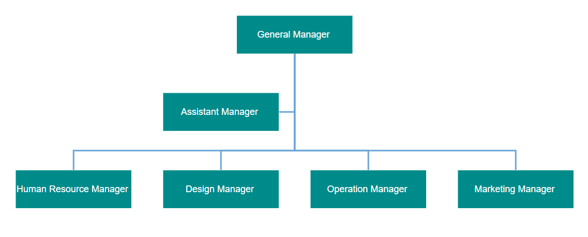
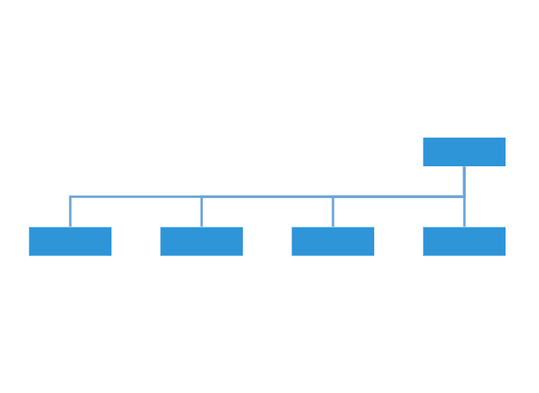
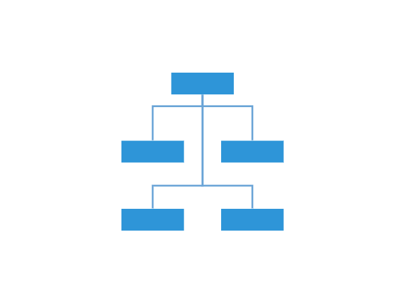
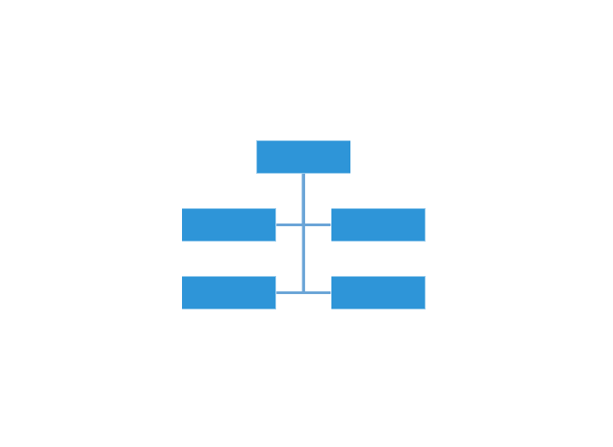

# Organizational Chart in Blazor Diagram Component

An organizational chart is a diagram that displays the structure of an organization and relationships. To create an organizational chart, the [Type](https://help.syncfusion.com/cr/blazor/Syncfusion.Blazor.Diagrams.DiagramLayout.html#Syncfusion_Blazor_Diagrams_DiagramLayout_Type) of layout should be set as an `OrganizationalChart`.

> A new blazor diagram component which provides better performance than this diagram control in Blazor WebAssembly App. It is available in preview mode. Refer the [Link](https://blazor.syncfusion.com/documentation/diagram/getting-started)

The following code example illustrates how to create an organizational chart.

```cshtml
@using Syncfusion.Blazor.Diagrams
@using System.Collections.ObjectModel

<SfDiagram ID="diagram" Height="600px" Nodes="@NodeCollection" Connectors="@ConnectorCollection" NodeDefaults="@NodeDefaults" ConnectorDefaults="@ConnectorDefaults" Layout="@LayoutValue">
</SfDiagram>

@code {
    ObservableCollection<DiagramNode> NodeCollection;
    ObservableCollection<DiagramConnector> ConnectorCollection;
    //Initializing layout
    DiagramLayout LayoutValue = new DiagramLayout()
    {
        //Sets layout type as OrganizationalChart...
        Type = LayoutType.OrganizationalChart,
        VerticalSpacing = 40,
        HorizontalSpacing = 40,
    };
    //Initializing node defaults
    DiagramNode NodeDefaults = new DiagramNode()
    {
        Height = 40,
        Width = 100,
        //sets the node shape style
        Style = new NodeShapeStyle() { Fill = "darkcyan", StrokeWidth = 3, StrokeColor = "Black" },
        Annotations = new ObservableCollection<DiagramNodeAnnotation>()
        {
            new DiagramNodeAnnotation() 
            { 
                Style= new AnnotationStyle()
                {
                    Color="white",
                    Bold=true
                }
            }
        }
    };
    //Initializing connector defaults
    DiagramConnector ConnectorDefaults = new DiagramConnector()
    {
        Type = Syncfusion.Blazor.Diagrams.Segments.Orthogonal,
    };

    protected override void OnInitialized()
    {
        //Initializing node and connectors
        NodeCollection = new ObservableCollection<DiagramNode>()
        {
            new DiagramNode(){Id="node1",Annotations = new ObservableCollection<DiagramNodeAnnotation>(){new DiagramNodeAnnotation(){Content="Project Management"}}},
            new DiagramNode(){Id="node2",Annotations = new ObservableCollection<DiagramNodeAnnotation>(){new DiagramNodeAnnotation(){Content="R&D Team"}}},
            new DiagramNode(){Id="node3",Annotations = new ObservableCollection<DiagramNodeAnnotation>(){new DiagramNodeAnnotation(){Content="Philosophy"}}},
            new DiagramNode(){Id="node4",Annotations = new ObservableCollection<DiagramNodeAnnotation>(){new DiagramNodeAnnotation(){Content="Organization"}}},
            new DiagramNode(){Id="node5",Annotations = new ObservableCollection<DiagramNodeAnnotation>(){new DiagramNodeAnnotation(){Content="Technology"}}},
            new DiagramNode(){Id="node6",Annotations = new ObservableCollection<DiagramNodeAnnotation>(){new DiagramNodeAnnotation(){Content="Funding"}}},
            new DiagramNode(){Id="node7",Annotations = new ObservableCollection<DiagramNodeAnnotation>(){new DiagramNodeAnnotation(){Content="Resource-Allocation"}}},
            new DiagramNode(){Id="node8",Annotations = new ObservableCollection<DiagramNodeAnnotation>(){new DiagramNodeAnnotation(){Content="Targeting"}}},
            new DiagramNode(){Id="node9",Annotations = new ObservableCollection<DiagramNodeAnnotation>(){new DiagramNodeAnnotation(){Content="Evaluation"}}},
            new DiagramNode(){Id="node10",Annotations = new ObservableCollection<DiagramNodeAnnotation>(){new DiagramNodeAnnotation(){Content="HR-Team"}}},
            new DiagramNode(){Id="node11",Annotations = new ObservableCollection<DiagramNodeAnnotation>(){new DiagramNodeAnnotation(){Content="Recruiment"}}},
            new DiagramNode(){Id="node12",Annotations = new ObservableCollection<DiagramNodeAnnotation>(){new DiagramNodeAnnotation(){Content="Employee-Relation"}}},
            new DiagramNode(){Id="node13",Annotations = new ObservableCollection<DiagramNodeAnnotation>(){new DiagramNodeAnnotation(){Content="Production & Sales Team"}}},
            new DiagramNode(){Id="node14",Annotations = new ObservableCollection<DiagramNodeAnnotation>(){new DiagramNodeAnnotation(){Content="Design"}}},
            new DiagramNode(){Id="node15",Annotations = new ObservableCollection<DiagramNodeAnnotation>(){new DiagramNodeAnnotation(){Content="Operation"}}},
            new DiagramNode(){Id="node16",Annotations = new ObservableCollection<DiagramNodeAnnotation>(){new DiagramNodeAnnotation(){Content="Support"}}},
            new DiagramNode(){Id="node17",Annotations = new ObservableCollection<DiagramNodeAnnotation>(){new DiagramNodeAnnotation(){Content="Quality Assurance"}}},
            new DiagramNode(){Id="node18",Annotations = new ObservableCollection<DiagramNodeAnnotation>(){new DiagramNodeAnnotation(){Content="Customer Interaction"}}},
            new DiagramNode(){Id="node19",Annotations = new ObservableCollection<DiagramNodeAnnotation>(){new DiagramNodeAnnotation(){Content="Support and Maintenance"}}},
            new DiagramNode(){Id="node20",Annotations = new ObservableCollection<DiagramNodeAnnotation>(){new DiagramNodeAnnotation(){Content="Task Coordination"}}},
        };
        ConnectorCollection = new ObservableCollection<DiagramConnector>()
        {
            new DiagramConnector(){Id="connector1",SourceID="node1",TargetID="node2"},
            new DiagramConnector(){Id="connector2",SourceID="node1",TargetID="node10"},
            new DiagramConnector(){Id="connector3",SourceID="node1",TargetID="node13"},
            new DiagramConnector(){Id="connector4",SourceID="node2",TargetID="node3"},
            new DiagramConnector(){Id="connector5",SourceID="node2",TargetID="node4"},
            new DiagramConnector(){Id="connector6",SourceID="node2",TargetID="node5"},
            new DiagramConnector(){Id="connector7",SourceID="node2",TargetID="node6"},
            new DiagramConnector(){Id="connector8",SourceID="node2",TargetID="node7"},
            new DiagramConnector(){Id="connector9",SourceID="node2",TargetID="node8"},
            new DiagramConnector(){Id="connector10",SourceID="node2",TargetID="node9"},
            new DiagramConnector(){Id="connector11",SourceID="node2",TargetID="node11"},
            new DiagramConnector(){Id="connector12",SourceID="node10",TargetID="node12"},
            new DiagramConnector(){Id="connector13",SourceID="node10",TargetID="node14"},
            new DiagramConnector(){Id="connector14",SourceID="node13",TargetID="node15"},
            new DiagramConnector(){Id="connector15",SourceID="node13",TargetID="node16"},
            new DiagramConnector(){Id="connector16",SourceID="node13",TargetID="node17"},
            new DiagramConnector(){Id="connector17",SourceID="node13",TargetID="node18"},
            new DiagramConnector(){Id="connector18",SourceID="node13",TargetID="node19"},
            new DiagramConnector(){Id="connector19",SourceID="node13",TargetID="node20"},
        };
    }
}
```


Organizational chart layout starts parsing from root and iterate through all its child elements. The [LayoutInfo](https://help.syncfusion.com/cr/blazor/Syncfusion.Blazor.Diagrams.DiagramLayout.html#Syncfusion_Blazor_Diagrams_DiagramLayout_LayoutInfo) property provides necessary information of a node’s children and the way to arrange (direction, orientation, offsets, etc.)them. The arrangements can be customized by overriding this function as explained.

Node **LayoutInfo** property to set chart orientations, chart types, and offset to be left between parent and child nodes. The [LayoutInfo](https://help.syncfusion.com/cr/blazor/Syncfusion.Blazor.Diagrams.DiagramLayout.html#Syncfusion_Blazor_Diagrams_DiagramLayout_LayoutInfo) property is called to configure every subtree of the organizational chart. It takes the following arguments.

1. **Node**: Parent node to that options are to be customized.
2. **Options**: Object to set the customizable properties.

## Assistant

Assistants are child item that have a different relationship with the parent node. They are laid out in a dedicated part of the tree. A node can be specified as an assistant of its parent by adding it to the assistants property of the argument `Assistants`.

In the `Root` property, define the node that is set to be the parent of the assistant node. In the `Assistant` property, define the node that  is set to be assistant for the parent node. Both properties should be defined in the "LayoutInfo" property.

The following code example illustrates how to add assistants to layout.

```cshtml
@using Syncfusion.Blazor.Diagrams
@using System.Collections.ObjectModel

<SfDiagram Height="600px" NodeDefaults="@NodeDefaults" ConnectorDefaults="@ConnectorDefaults" Layout="@LayoutValue">
    <DiagramDataSource Id="Id" ParentId="Team" DataSource="@DataSource" DataMapSettings="@DataMap"></DiagramDataSource>
</SfDiagram>

@code {
    //Initializing layout
    DiagramLayout LayoutValue;

    protected override void OnInitialized()
    {
        LayoutValue = new DiagramLayout()
        {
            //Sets layout type as OrganizationalChart...
            Type = LayoutType.OrganizationalChart,
            VerticalSpacing = 50,
            HorizontalSpacing = 40,
            //Initialize the layout info for the org chart layout
            LayoutInfo = new TreeInfo
            {
                Orientation = SubTreeOrientation.Vertical,
                Offset = -20,
                CanEnableSubTree = true,
                //provides an assitant details for the root node
                GetAssistantDetails = new AssistantsDetails()
                {
                    Root = "General Manager",
                    Assistants = new string[] { "Assistant Manager" }
                }
            }
        };
    }
    //Initializing DataMap Setting
    List<DiagramDataMapSetting> DataMap = new List<DiagramDataMapSetting>()
    {
        new DiagramDataMapSetting() { Property = "Annotations[0].Content",
        Field = "Role" },
    };

    //Initializing node defaults
    DiagramNode NodeDefaults = new DiagramNode()
    {
        Width = 150,
        Height = 50,
        Annotations = new ObservableCollection<DiagramNodeAnnotation>() { new DiagramNodeAnnotation() { Id = "label1", Style = new AnnotationStyle() { Color = "white" } }, },
        Style = new NodeShapeStyle { Fill = "darkcyan", StrokeColor = "white", }
    };

    //Initializing connector defaults
    DiagramConnector ConnectorDefaults = new DiagramConnector()
    {
        Type = Syncfusion.Blazor.Diagrams.Segments.Orthogonal,
        Style = new ConnectorShapeStyle() { StrokeColor = "#6BA5D7", StrokeWidth = 2 },
        TargetDecorator = new ConnectorTargetDecorator()
        {
            Shape = DecoratorShapes.None,
            Style = new DecoratorShapeStyle() { Fill = "#6BA5D7", StrokeColor = "#6BA5D7", },
        }
    };

    public class OrgChartDataModel
    {
        public string Id { get; set; }
        public string Team { get; set; }
        public string Role { get; set; }
    }

    public object DataSource = new List<object>()
    {
        new OrgChartDataModel() { Id= "1", Role= "General Manager" },
        new OrgChartDataModel() { Id= "2", Role= "Assistant Manager", Team= "1" },
        new OrgChartDataModel() { Id= "3", Role= "Human Resource Manager", Team= "1" },
        new OrgChartDataModel() { Id= "4", Role= "Design Manager", Team= "1" },
        new OrgChartDataModel() { Id= "5", Role= "Operation Manager", Team= "1" },
        new OrgChartDataModel() { Id= "6", Role= "Marketing Manager", Team= "1" }
    };
}
```



## Customize layout

Orientation, spacings, and position of the layout can be customized with a set of properties.

To explore layout properties, refer to [Layout Properties](https://help.syncfusion.com/cr/blazor/Syncfusion.Blazor.Diagrams.DiagramLayout.html).

### Layout bounds

Diagram provides support to align the layout within any custom rectangular area. For more information about bounds, refer to [Bounds](https://help.syncfusion.com/cr/blazor/Syncfusion.Blazor.Diagrams.DiagramLayout.html#Syncfusion_Blazor_Diagrams_DiagramLayout_Bounds).

### Layout alignment

The layout can be aligned anywhere over the layout bounds/viewport using the [HorizontalAlignment](https://help.syncfusion.com/cr/blazor/Syncfusion.Blazor.Diagrams.DiagramLayout.html#Syncfusion_Blazor_Diagrams_DiagramLayout_HorizontalAlignment) and [VerticalAlignment](https://help.syncfusion.com/cr/blazor/Syncfusion.Blazor.Diagrams.DiagramLayout.html#Syncfusion_Blazor_Diagrams_DiagramLayout_VerticalAlignment) properties of the layout.

The following code illustrates how to align the layout at the top-left of the layout bounds.

```csharp
//Initialize the layout with VerticalAlignment alignment as bottom in page
DiagramLayout LayoutValue = new DiagramLayout()
{
    Type = LayoutType.OrganizationalChart,
    VerticalSpacing = 40,
    HorizontalSpacing = 40,
    VerticalAlignment = VerticalAlignment.Bottom
};
```

The following table illustrates the different chart orientations and chart types.

|Orientation|Type|Description|Example|
| -------- | ----------- | ------------- |------|
|Horizontal|Left|Arranges the child nodes horizontally at the left side of the parent.||
||Right|Arranges the child nodes horizontally at the right side of the parent.||
||Center|Arranges the children like standard tree layout orientation.||
||Balanced|Arranges the leaf level child nodes in multiple rows.||
|Vertical|Left|Arranges the children vertically at the left side of the parent.||
||Right|Arranges the children vertically at the right side of the parent.||
||Alternate|Arranges the children vertically at both left and right sides of the parent.||

The following code example illustrates how to set the vertical right arrangement to the leaf level trees.

```cshtml
@using Syncfusion.Blazor.Diagrams
@using System.Collections.ObjectModel

<SfDiagram Height="600px" NodeDefaults="@NodeDefaults" ConnectorDefaults="@ConnectorDefaults" Layout="@LayoutValue">
    <DiagramDataSource Id="Id" ParentId="Team" DataSource="@DataSource" ></DiagramDataSource>  
</SfDiagram>

@code {
    //Initializing layout
    DiagramLayout LayoutValue;

    protected override void OnInitialized()
    {
        LayoutValue = new DiagramLayout()
        {
            //Sets layout type as OrganizationalChart...
            Type = LayoutType.OrganizationalChart,
            VerticalSpacing = 50,
            HorizontalSpacing = 40,
            //Initialize the layout info for the org chart layout
            LayoutInfo = new TreeInfo
            {
                Orientation = SubTreeOrientation.Vertical,
                CanEnableSubTree = true,
            }
        };
    }

    //Initializing node defaults
    DiagramNode NodeDefaults = new DiagramNode()
    {
        Width = 150,
        Height = 50,
        Annotations = new ObservableCollection<DiagramNodeAnnotation>() 
        { 
            new DiagramNodeAnnotation() 
            { 
                Id = "label1", 
                Style = new AnnotationStyle() 
                { 
                Color = "white" 
                }
            }, 
        },
        Style = new NodeShapeStyle 
        { 
            Fill = "#6BA5D7", 
            StrokeColor = "black",
        },
        LayoutInfo = new DiagramNodeLayoutInfo()
        {
            Orientation = Orientation.Vertical,
            Type = SubTreeAlignments.Right
        }
    };

    //Initializing connector defaults
    DiagramConnector ConnectorDefaults = new DiagramConnector()
    {
        Type = Syncfusion.Blazor.Diagrams.Segments.Orthogonal,
        Style = new ConnectorShapeStyle() 
        { 
            StrokeColor = "#6BA5D7",
            StrokeWidth = 1
        },
        TargetDecorator = new ConnectorTargetDecorator()
        {
            Shape = DecoratorShapes.None,
            Style = new DecoratorShapeStyle() 
            {
                Fill = "#6BA5D7",
                StrokeColor = "#6BA5D7",
            },
        }
    };

    public class OrgChartDataModel
    {
        public string Id { get; set; }
        public string Team { get; set; }
        public string Role { get; set; }
    }

    public object DataSource = new List<object>()
    {
        new OrgChartDataModel() { Id= "1", Role= "General Manager" },
        new OrgChartDataModel() { Id= "2", Role= "Human Resource Manager", Team= "1" },
        new OrgChartDataModel() { Id= "3", Role= "Design Manager", Team= "1" },
        new OrgChartDataModel() { Id= "4", Role= "Operation Manager", Team= "1" },
        new OrgChartDataModel() { Id= "5", Role= "Marketing Manager", Team= "1" }
    };
}
```


### Layout spacing

Layout provides support to add space horizontally and vertically between the nodes. The [HorizontalSpacing](https://help.syncfusion.com/cr/blazor/Syncfusion.Blazor.Diagrams.DiagramLayout.html#Syncfusion_Blazor_Diagrams_DiagramLayout_HorizontalSpacing) and [VerticalSpacing](https://help.syncfusion.com/cr/blazor/Syncfusion.Blazor.Diagrams.DiagramLayout.html#Syncfusion_Blazor_Diagrams_DiagramLayout_VerticalSpacing) properties of the layout allows you to set the space between the nodes horizontally and vertically.

### Layout margin

Layout provides support to add some blank space between the layout bounds/viewport and the layout. The [Margin](https://help.syncfusion.com/cr/blazor/Syncfusion.Blazor.Diagrams.DiagramLayout.html#Syncfusion_Blazor_Diagrams_DiagramLayout_Margin) property of the layout allows you to set the blank space.

```csharp
//Initialize the organizational chart layout with Margin
DiagramLayout LayoutValue = new DiagramLayout()
{
    Type = LayoutType.OrganizationalChart,
    HorizontalSpacing = 40,
    VerticalSpacing = 40,
    Orientation = LayoutOrientation.TopToBottom,
    Margin = new LayoutMargin() { Left = 20, Top = 20 },
};
```

### Layout orientation

Diagram provides support to customize the [Orientation](https://help.syncfusion.com/cr/blazor/Syncfusion.Blazor.Diagrams.DiagramLayout.html#Syncfusion_Blazor_Diagrams_DiagramLayout_Orientation) of layout. You can set the desired orientation using `Layout.Orientation`.

The following code illustrates how to arrange the nodes in a BottomToTop orientation.

```csharp
//Initialize the layout with layout orientation as BottomToTop in page
DiagramLayout LayoutValue = new DiagramLayout()
{
    Type = LayoutType.OrganizationalChart,
    HorizontalSpacing = 40,
    VerticalSpacing = 40,
    Orientation = LayoutOrientation.BottomToTop,
};
```

### Fixed node

Layout provides support to arrange the nodes with reference to the position of a fixed node and set it to the [FixedNode](https://help.syncfusion.com/cr/blazor/Syncfusion.Blazor.Diagrams.DiagramLayout.html#Syncfusion_Blazor_Diagrams_DiagramLayout_FixedNode) of the layout property. This is helpful when you try to expand/collapse a node. It might be expected that the position of the double-clicked node should not be changed.

```csharp
//Initialize the organizational chart layout with FixedNode
DiagramLayout LayoutValue = new DiagramLayout()
{
    Type = LayoutType.OrganizationalChart,
    FixedNode = "node1",
    HorizontalSpacing = 40,
    VerticalSpacing = 40,
};
```

### Expand and collapse

Diagram allows to expand/collapse the subtrees of a layout. The node’s isExpanded property allows you to expand/collapse its children. The following code example shows how to expand/collapse the children of a node.

```cshtml
@code{
    DiagramNode NodeDefaults = new DiagramNode()
    {
         //Initialize a expand icon for the node
        ExpandIcon = new NodeExpandIcon()
        {
            Height = 15,
            Width = 15,
            Shape = IconShapes.Plus,
            Fill = "lightgray",
            Offset = new IconOffset() { X = .5, Y = .85 },
        },
        //Initialize a collapse icon for the node
        CollapseIcon = new NodeCollapseIcon()
        {
            Height = 15,
            Width = 15,
            Shape = IconShapes.Minus,
            Offset = new IconOffset() { X = .5, Y = .85 },
        }
    }
}
```

In the previous example, while expanding/collapsing a node, it is set as fixed node in order to prevent it from repositioning.

## Refresh layout

Diagram allows to refresh the layout at runtime. Use the below code example to refresh the layout.

```csharp
//update the layout at runtime.
diagram.DoLayout();

//Here, diagram is instance of SfDiagram.
```

## See also

* [How to create a node](../nodes/nodes)

* [How to create a connector](../connectors/connectors)
