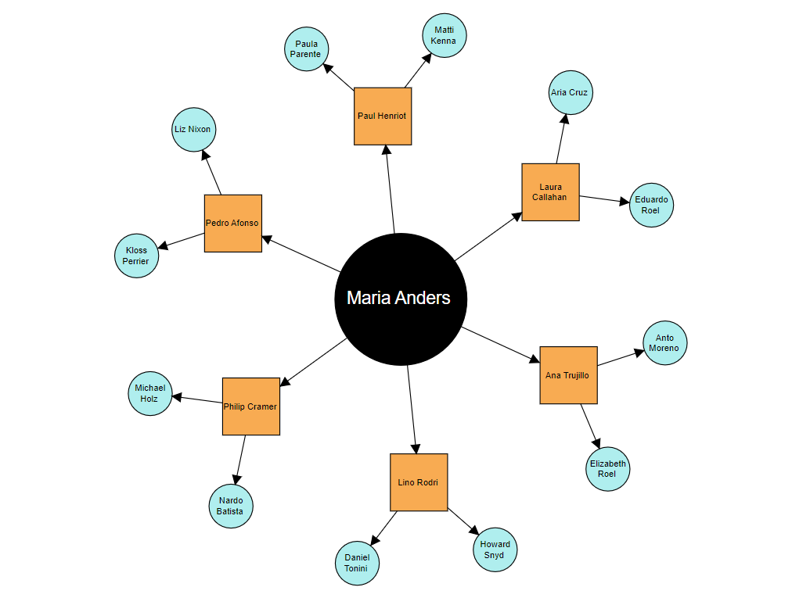

# Radial Tree Layout in Blazor Diagram Component

A [RadialTree](https://help.syncfusion.com/cr/blazor/Syncfusion.Blazor.Diagram.LayoutType.html#Syncfusion_Blazor_Diagram_LayoutType_RadialTree) layout is a diagram that presents information in a hierarchical structure, with a central node at the core of the diagram. The central node represents the main concept or topic, and branches extend outward in a radial fashion, creating a tree-like structure. The layout [Root](https://help.syncfusion.com/cr/blazor/Syncfusion.Blazor.Diagram.Layout.html#Syncfusion_Blazor_Diagram_Layout_Root) property can be used to define the root node of the layout. When no root node is set, the algorithm automatically considers the node without any incoming edges (InEdges connector count of 0) as the root node. To create radial tree, the [Type](https://help.syncfusion.com/cr/blazor/Syncfusion.Blazor.Diagram.Layout.html#Syncfusion_Blazor_Diagram_Layout_Type) of layout should be set as [RadialTree](https://help.syncfusion.com/cr/blazor/Syncfusion.Blazor.Diagram.LayoutType.html#Syncfusion_Blazor_Diagram_LayoutType_RadialTree).

The `RadialTree` layout provides support for adding space between the nodes. The [HorizontalSpacing](https://help.syncfusion.com/cr/blazor/Syncfusion.Blazor.Diagram.Layout.html#Syncfusion_Blazor_Diagram_Layout_HorizontalSpacing) and [VerticalSpacing](https://help.syncfusion.com/cr/blazor/Syncfusion.Blazor.Diagram.Layout.html#Syncfusion_Blazor_Diagram_Layout_VerticalSpacing) properties of the layout allow you to set the space between the nodes. The arrangement results in an ever-expanding concentric arrangement with radial proximity to the root node indicating the node level in the hierarchy.

>**Note:** The radial tree structure used in this context does not accommodate nodes with multiple parents. Each node within the tree is intended to have a single parent, maintaining a clear hierarchical relationship.

## How to Create a Radial Tree Using DataSource

You can create a radial tree layout with a DataSource. The following code example illustrates how to create a radial tree layout using a data source.

```csharp
@using Syncfusion.Blazor.Diagram

<SfDiagramComponent @ref="diagram" Width="100%" Height="800px" NodeCreating="OnNodeCreating" ConnectorCreating="OnConnectorCreating">
    <DataSourceSettings DataSource="RadialSource" ID="Id" ParentID="ReportingPerson"></DataSourceSettings>

    <Layout Type="LayoutType.RadialTree" HorizontalSpacing="30" VerticalSpacing="30"></Layout>

    <SnapSettings Constraints="@SnapConstraints.None"></SnapSettings>
</SfDiagramComponent>

@code 
{    
    SfDiagramComponent diagram;
    //Creates nodes with some default values.
    private void OnNodeCreating(IDiagramObject obj)
    {
        Node node = obj as Node;
        RadialTreeDetails radialData = node.Data as RadialTreeDetails;
        double size = 0;
        string color;
        if (radialData.Id == "parent")
        {
            size = 20;
            color="white";
        }
        else
        {
            size = 10;
            color = "black";
        }
        ShapeAnnotation annotation = new ShapeAnnotation() { Content = radialData.Name, Style = new TextStyle() { Color = color, FontSize=size } };
        node.Annotations = new DiagramObjectCollection<ShapeAnnotation>() { annotation };

        if (radialData.Designation == "Managing Director")
        {
            node.Shape = new BasicShape()
            {
                Type = NodeShapes.Basic,
                Shape = NodeBasicShapes.Ellipse,
                CornerRadius = 10
            };
            node.Width = 150;
            node.Height = 150;
            node.Style.Fill = "black";
        }
        else if (radialData.Designation == "Project Manager")
        {
            node.Width = 65;
            node.Height = 65;
            node.Style.Fill = "#f8ab52";
        }
        else
        {
            node.Shape = new BasicShape()
                {
                    Type = NodeShapes.Basic,
                    Shape = NodeBasicShapes.Ellipse,
                    CornerRadius = 10
                };
            node.Style.Fill = "#afeeee";
            node.Width = 50;
            node.Height = 50;
        }
    }
    
    //Creates connectors with some default values.
    private void OnConnectorCreating(IDiagramObject connector)
    {
        (connector as Connector).Type = ConnectorSegmentType.Straight;
    }

    public class RadialTreeDetails
    {
        public string Id { get; set; }
        public string Name { get; set; }
        public string Designation { get; set; }
        public string ReportingPerson { get; set; }
    }

    public List<RadialTreeDetails> RadialSource = new List<RadialTreeDetails>()
    {
        new RadialTreeDetails()   { Id = "parent", Name = "Maria Anders", Designation = "Managing Director" },
        new RadialTreeDetails()   { Id = "1", Name = "Ana Trujillo", Designation = "Project Manager",
            ReportingPerson = "parent" },
        new RadialTreeDetails()   { Id = "2", Name = "Lino Rodri", Designation = "Project Manager",
            ReportingPerson = "parent" },
        new RadialTreeDetails()   {  Id = "3", Name = "Philip Cramer", Designation = "Project Manager",
            ReportingPerson = "parent" },
        new RadialTreeDetails()   {  Id = "4", Name = "Pedro Afonso", Designation = "Project Manager",
            ReportingPerson = "parent" },
        new RadialTreeDetails()   { Id = "15", Name = "Paul Henriot", Designation = "Project Manager",
            ReportingPerson = "parent" },
        new RadialTreeDetails()   { Id = "18", Name = "Laura Callahan", Designation = "Project Manager",
            ReportingPerson = "parent" },
        new RadialTreeDetails()   { Id = "5", Name = "Anto Moreno", Designation = "Project Lead",
            ReportingPerson = "1" },
        new RadialTreeDetails()   { Id = "6", Name = "Elizabeth Roel", Designation = "Project Lead",
            ReportingPerson = "1" },
        new RadialTreeDetails()   { Id = "7", Name = "Aria Cruz", Designation = "Project Lead",
            ReportingPerson = "18" },
        new RadialTreeDetails()   { Id = "8", Name = "Eduardo Roel", Designation = "Project Lead",
            ReportingPerson = "18" },
        new RadialTreeDetails()   { Id = "9", Name = "Howard Snyd", Designation = "Project Lead",
            ReportingPerson = "2"  },
        new RadialTreeDetails()   { Id = "10", Name = "Daniel Tonini", Designation = "Project Lead",
            ReportingPerson = "2" },
        new RadialTreeDetails()   { Id = "11", Name = "Nardo Batista", Designation = "Project Lead",
            ReportingPerson = "3" },
        new RadialTreeDetails()   { Id = "12", Name = "Michael Holz", Designation = "Project Lead",
            ReportingPerson = "3" },
        new RadialTreeDetails()   { Id = "13", Name = "Kloss Perrier", Designation = "Project Lead",
            ReportingPerson = "4" },
        new RadialTreeDetails()   { Id = "14", Name = "Liz Nixon", Designation = "Project Lead",
            ReportingPerson = "4" },
        new RadialTreeDetails()   { Id = "16", Name = "Paula Parente", Designation = "Project Lead",
            ReportingPerson = "15" },
        new RadialTreeDetails()   { Id = "17", Name = "Matti Kenna", Designation = "Project Lead",
            ReportingPerson = "15" },
    };
}
```
You can download a complete working sample from [GitHub](https://github.com/SyncfusionExamples/Blazor-Diagram-Examples/tree/master/UG-Samples/Layout/RadialTreeWithDataSource).



>**Note:** In the DataSourceSettings, the type of the ID and ParentID properties is string. The provided DataSource should have a parent-child relationship. It is necessary for at least one node to have an empty ParentID.

## How to Create a Radial Tree With Nodes and Connectors

You can render a radial tree layout without using a Datasource. The following code demonstrates how to render a radial tree layout without using a DataSource.

```csharp
@using Syncfusion.Blazor.Diagram

<SfDiagramComponent @ref="diagram" Width="1200px" Height="800px" @bind-Nodes="@nodes" @bind-Connectors="@connectors" NodeCreating="OnNodeCreating" ConnectorCreating="OnConnectorCreating">
    <Layout Type="LayoutType.RadialTree" HorizontalSpacing="40" VerticalSpacing="40" Root="@root">
    </Layout>
</SfDiagramComponent>

@code
{
    SfDiagramComponent diagram;
    //Initialize the diagram's nodes collection.
    DiagramObjectCollection<Node> nodes = new DiagramObjectCollection<Node>();

    //Initialize the diagram's connectors collection.
    DiagramObjectCollection<Connector> connectors = new DiagramObjectCollection<Connector>();
    string root = "node1";

    //Creates nodes with some default values.
    private void OnNodeCreating(IDiagramObject obj)
    {
        Node node = obj as Node;
        node.Width = 60;
        node.Height = 60;
        ShapeAnnotation annotation = new ShapeAnnotation() { Content = node.ID, Style = new TextStyle() { Color = "black" } };
        node.Annotations = new DiagramObjectCollection<ShapeAnnotation>() { annotation };
    }

    //Creates connectors with some default values.
    private void OnConnectorCreating(IDiagramObject connector)
    {
        (connector as Connector).Type = ConnectorSegmentType.Straight;
        (connector as Connector).TargetDecorator=new DecoratorSettings
            {
            Shape = DecoratorShape.None,
        };
    }

    protected override void OnInitialized()
    {
        for(int i = 1;i < 18;i++)
        {
            Node node1 = new Node()
            {
                ID = "node"+i,
                Width = 70,
                Height = 70,
            };
            nodes.Add(node1);
        }

        Connector connector1 = new Connector() { ID = "connector1", SourceID = "node1", TargetID = "node2", };
        connectors.Add(connector1);

        Connector connector2 = new Connector() { ID = "connector2", SourceID = "node1", TargetID = "node3", };
        connectors.Add(connector2);

        Connector connector3 = new Connector() { ID = "connector3", SourceID = "node1", TargetID = "node4", };
        connectors.Add(connector3);

        Connector connector4 = new Connector() { ID = "connector4", SourceID = "node2", TargetID = "node5", };
        connectors.Add(connector4);

        Connector connector5 = new Connector() { ID = "connector5", SourceID = "node3", TargetID = "node6", };
        connectors.Add(connector5);

        Connector connector6 = new Connector() { ID = "connector6", SourceID = "node4", TargetID = "node7", };
        connectors.Add(connector6);

        Connector connector7 = new Connector() { ID = "connector7", SourceID = "node1", TargetID = "node8", };
        connectors.Add(connector7);

        Connector connector8 = new Connector() { ID = "connector8", SourceID = "node8", TargetID = "node9", };
        connectors.Add(connector8);
        Connector connector9 = new Connector() { ID = "connector9", SourceID = "node2", TargetID = "node10", };
        connectors.Add(connector9);
        Connector connector10 = new Connector() { ID = "connector10", SourceID = "node3", TargetID = "node11", };
        connectors.Add(connector10);
        Connector connector11 = new Connector() { ID = "connector11", SourceID = "node4", TargetID = "node12", };
        connectors.Add(connector11);
        Connector connector12 = new Connector() { ID = "connector12", SourceID = "node8", TargetID = "node13", };
        connectors.Add(connector12);
        Connector connector13 = new Connector() { ID = "connector13", SourceID = "node2", TargetID = "node14", };
        connectors.Add(connector13);
        Connector connector14 = new Connector() { ID = "connector14", SourceID = "node3", TargetID = "node15", };
        connectors.Add(connector14);
        Connector connector15 = new Connector() { ID = "connector15", SourceID = "node4", TargetID = "node16", };
        connectors.Add(connector15);
        Connector connector16 = new Connector() { ID = "connector16", SourceID = "node8", TargetID = "node17", };
        connectors.Add(connector16);

    }
}
```

You can download a complete working sample from [GitHub](https://github.com/SyncfusionExamples/Blazor-Diagram-Examples/tree/master/UG-Samples/Layout/RadialTreeWithNodes).

## See also

* [How to create a node](../nodes/nodes)

* [How to create a connector](../connectors/connectors)