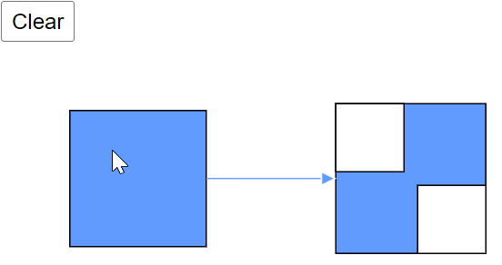
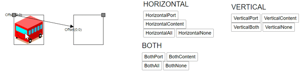

# Diagram Methods in Blazor Diagram Component

The diagram functionalities are performed using the following methods.

## Add nodes through Add method

To create a node, define the Node object and add it to the nodes collection of the diagram using the `Add()` method. The Add() method in the OnInitialized method will measure and render each diagram element individually before rendering the diagram. As a result, calling the Add() method outside of the OnInitialized() method is not feasible. The following code example shows how to add a node to the diagram.

```cshtml
@using Syncfusion.Blazor.Diagram

<SfDiagramComponent Height="600px" Nodes="@nodes" />

@code
{
    DiagramObjectCollection<Node> nodes;

    protected override void OnInitialized()
    {
        nodes = new DiagramObjectCollection<Node>();
        // A node is created and stored in the nodes collection.
        Node node = new Node()
        {
            ID = "node1",
            // Position of the node.
            OffsetX = 250,
            OffsetY = 250,
            // Size of the node.
            Width = 100,
            Height = 100,
            Style = new ShapeStyle() 
            { 
                Fill = "#6495ED", 
                StrokeColor = "white" 
            }
        };
        // Add node.
        nodes.Add(node);
    }
}
```

## Add nodes through AddDiagramElements

 Unlike the Add() method, the [AddDiagramElements](https://help.syncfusion.com/cr/blazor/Syncfusion.Blazor.Diagram.SfDiagramComponent.html#Syncfusion_Blazor_Diagram_SfDiagramComponent_AddDiagramElements_Syncfusion_Blazor_Diagram_DiagramObjectCollection_Syncfusion_Blazor_Diagram_NodeBase__) method will measure the passed elements before re-rendering the complete diagram component at once. When using the Add() method to add multiple nodes and connectors simultaneously, the connectors will be rendered before the nodes. As a result, connectors may be misplaced due to the synchronous behavior of the Add method. To overcome this, use the asynchronous AddDiagramElements() method.

* AddDiagramElements() method is a preferred way to add a collection of items to the diagram to get better performance compared to Add() method.

```cshtml
@using Syncfusion.Blazor.Diagram

<button @onclick="Test">Test</button>

<SfDiagramComponent @ref="Diagram" Width="1000px" Height="500px">
</SfDiagramComponent>

@code
{
    SfDiagramComponent Diagram;

    public async void Test()
    {
        Node node1 = new Node()
        {
            OffsetX = 100,
            OffsetY = 100,
            Height = 50,
            Ports = new DiagramObjectCollection<PointPort>()
                {
                    new PointPort()
                    {
                        ID="port1",
                        Visibility = PortVisibility.Visible,
                        Offset = new DiagramPoint() { X = 1, Y = 0.5},
                        Height = 10, Width = 10,
                        Style = new ShapeStyle(){Fill = "yellow", StrokeColor = "yellow"}
                    }
                },
            Width = 100,
            ID = "node1",
            Style = new ShapeStyle() { Fill = "#6495ED", StrokeColor = "#6495ED" },
            Shape = new BasicShape() { Type = NodeShapes.Basic, Shape = NodeBasicShapes.Rectangle }
        };
 
        Node node2 = new Node()
        {
            OffsetX = 300,
            OffsetY = 300,
            Height = 50,
            Width = 100,
            ID = "node2",
            Ports = new DiagramObjectCollection<PointPort>()
            {
                new PointPort()
                {
                    ID="port2",
                    Visibility = PortVisibility.Visible,
                    Offset = new DiagramPoint() { X = 0, Y = 0.5},
                    Height = 10, Width = 10,
                    Style = new ShapeStyle(){Fill = "yellow", StrokeColor = "yellow"}
               }
            },
            Style = new ShapeStyle() { Fill = "#6495ED", StrokeColor = "#6495ED" },
            Shape = new BasicShape() { Type = NodeShapes.Basic, Shape = NodeBasicShapes.Rectangle }
        };

        Connector Connector = new Connector()
        {
            ID = "connector1",
            //Source node id of the connector.
            SourceID = "node1",
            //source node port id.
            SourcePortID = "port1",
            //Target node id of the connector.
            TargetID = "node2",
            //Target node port id.
            TargetPortID = "port2",
            TargetDecorator = new DecoratorSettings()
            {
                Style = new ShapeStyle()
                {
                    Fill = "#6495ED",
                    StrokeColor = "#6495ED",
                }
            },
            Style = new ShapeStyle()
            {
                Fill = "#6495ED",
                StrokeColor = "#6495ED",
            },
            // Type of the connector
            Type = ConnectorSegmentType.Straight,
        };
        DiagramObjectCollection<NodeBase> NodeCollection = new DiagramObjectCollection<NodeBase>();
        NodeCollection.Add(node1);
        NodeCollection.Add(node2);
        NodeCollection.Add(Connector);
        await Diagram.AddDiagramElements(NodeCollection);
    }
}
```

### Clear

[Clear](https://help.syncfusion.com/cr/blazor/Syncfusion.Blazor.Diagram.SfDiagramComponent.html#Syncfusion_Blazor_Diagram_SfDiagramComponent_Clear) method is used to remove all the elements such as nodes, connectors and groups from the diagram.

```cshtml
@using Syncfusion.Blazor.Diagram

<input type="button" value="Clear" @onclick="Clear" />
<SfDiagramComponent @ref="diagram" Width="500px" Height="500px" @bind-Nodes="@Nodes" @bind-Connectors="@Connectors"></SfDiagramComponent>

@code
{
    SfDiagramComponent diagram;
    DiagramObjectCollection<Node> Nodes = new DiagramObjectCollection<Node>();
    DiagramObjectCollection<Connector> Connectors = new DiagramObjectCollection<Connector>();

    protected override void OnInitialized()
    {
        Nodes.Add(new Node()
        {
            ID = "node1",
            OffsetX = 100,
            OffsetY = 100,
            Width = 100,
            Height = 100,
            Style = new ShapeStyle() { Fill = "#6495ED", StrokeColor = "white" }
        });
        Nodes.Add(new Node()
        {
            ID = "node2",
            OffsetX = 270,
            OffsetY = 70,
            Width = 50,
            Height = 50,
        });
        Nodes.Add(new Node()
        {
            ID = "node3",
            OffsetX = 330,
            OffsetY = 130,
            Width = 50,
            Height = 50,
        });
        Nodes.Add(new NodeGroup()
        {
            ID = "group",
            Children = new string[] { "node2", "node3" },
            Style = new ShapeStyle() { Fill = "#6495ED", StrokeColor = "white" }
        });
        Connectors.Add(new Connector()
        {
            SourceID = "node1",
            TargetID = "group",
            Style = new ShapeStyle() { StrokeColor = "#6495ED" },
            TargetDecorator = new DecoratorSettings() { Style = new ShapeStyle() { Fill = "#6495ED", StrokeColor = "white" } }
        });
    }
    private void Clear()
    {
        diagram.Clear();
    }
}
```



### ResetZoom
  The [ResetZoom](https://help.syncfusion.com/cr/blazor/Syncfusion.Blazor.Diagram.SfDiagramComponent.html#Syncfusion_Blazor_Diagram_SfDiagramComponent_ResetZoom) method is used to reset the current zoom value of the diagram page to 100% when the diagram is either in a zoomed in or zoomed out state. The following code example shows how to reset the current zoom value of the diagram page.

```cshtml
@using Syncfusion.Blazor.Diagram

<style>
    #diagram-space {
        float: left;
    }

    #properties {
        float: right;
    }
</style>

<div id="diagram-space">
    <SfDiagramComponent @ref="diagram" Width="600px" Height="600px" Nodes="nodes" Connectors="connectors">
         
        <SnapSettings Constraints="@SnapConstraints.None"></SnapSettings>
    </SfDiagramComponent>
</div>

<div id="properties">
           <input type="button" value="ZoomIn" @onclick="ZoomIn" />
           <input type="button" value="ZoomOut" @onclick="ZoomOut" />
           <input type="button" value="Reset" @onclick="ResetZoom" />
   
</div>

@code {
    public SfDiagramComponent diagram;
    DiagramObjectCollection<Node> nodes = new DiagramObjectCollection<Node>();
     DiagramObjectCollection<Connector> connectors = new DiagramObjectCollection<Connector>();


    protected override void OnInitialized()
    {
        Node node = new Node()
        {
            ID = "node1",
            Width = 50,
            Height = 50,
            OffsetX = 350,
            OffsetY = 100,
            Style = new ShapeStyle() { Fill = "#6495ED", StrokeColor = "black" }
        };
        Node node2 = new Node()
        {
            ID = "node2",
            Width = 50,
            Height = 50,
            OffsetX = 450,
            OffsetY = 100,
             Style = new ShapeStyle() { Fill = "#6495ED", StrokeColor = "black" }
        };
           Connector Connector = new Connector()
        {
            ID = "connector1",
            SourceID = "node1",
            TargetDecorator = new DecoratorSettings()
            {
                Style = new ShapeStyle()
                {
                    Fill = "#6495ED",
                    StrokeColor = "#6495ED",
                }
            },
            TargetID = "node2",
            Style = new ShapeStyle()
            {
                Fill = "#6495ED",
                StrokeColor = "#6495ED",
            },
            Type = ConnectorSegmentType.Straight,
        };
        connectors.Add(Connector);
        nodes.Add(node);
        nodes.Add(node2);

    }
  
    public void ZoomIn()
    {
        diagram.Zoom(1.2, new DiagramPoint { X = 100, Y = 100 });
    }
     public void ZoomOut()
    {
        diagram.Zoom(1/1.2, new DiagramPoint {  X = 100, Y = 100 });
    }
    private void ResetZoom()
    {
        diagram.ResetZoom();
    }
}
```


## Flip
The Flip  is used to mirror the selected object’s content and port in the diagram page for horizontal,Vertical and Both direction.

###  FlipDirection:
| FlipDirection | Description | 
| -------- | -------- |
|Horizontal|It is used to flip the node or connector is mirrored across the horizontal axis.|
|Vertical|	It is used to flip the node or connector is mirrored across the vertical axis.|
|Both|		It is used to flip the node or port is mirrored across the both horizontal and vertical axis.|
|None|	It is used to disables all the flip behaviour.| 


### FlipMode:
The FlipMode is used to control the behaviour of the flip object.
| FlipMode | Description | 
| -------- | -------- |
|Content|It is used to enable or disables the flip for object’s content..|
|Port|	It is used to enable or disables the flip for object’s port.|
|All|	It is used to enable or disables the flip for both object’s content and port.|
|None|	It is used to disables all the flipmode behaviour.|

The following code example shows how to change the FlipDirection and FlipMode.

```cshtml
@using Syncfusion.Blazor.Diagram
@using ChangeEventArgs = Microsoft.AspNetCore.Components.ChangeEventArgs

<style>    
    #diagram {
        width: 70%;
        float: left;
    }
    #properties {
        width: 15%;
        float: right;
        margin-right:40px;
    }
</style>
<div id="properties">
    <h4>HORIZONTAL</h4>
    <input type="button" value="HorizontalPort" @onclick="@HorizontalPort" />
    <input type="button" value="HorizontalContent" @onclick="@HorizontalContent" />
    <input type="button" value="HorizontalAll" @onclick="@HorizontalAll" />
    <input type="button" value="HorizontalNone" @onclick="@HorizontalNone" /> 
      <h4>VERTICAL</h4>
    <input type="button" value="VerticalPort" @onclick="@VerticalPort" />
    <input type="button" value="VerticalContent" @onclick="@VerticalContent" />
    <input type="button" value="VerticalBoth" @onclick="@VerticalBoth" />
    <input type="button" value="VerticalNone" @onclick="@VerticalNone" />
     <h4>BOTH</h4>
    <input type="button" value="BothPort" @onclick="@BothPort" />
    <input type="button" value="BothContent" @onclick="@BothContent" />
    <input type="button" value="BothAll" @onclick="@BothAll" />
    <input type="button" value="BothNone" @onclick="@BothNone" />
 </div>

<div id="#diagram">
    <SfDiagramComponent @ref="diagram" Width="1000px" Height="1000px"  Nodes="@NodeCollection" Connectors="@connectors">
        <SnapSettings Constraints="@SnapConstraints.ShowLines"></SnapSettings>
    </SfDiagramComponent>
    </div>

@code
{
    DiagramObjectCollection<Connector> connectors = new DiagramObjectCollection<Connector>();
    public SfDiagramComponent diagram;
    DiagramObjectCollection<Node> NodeCollection;
    protected override void OnInitialized()
    {
        Node node1 = new Node()
        {
             ID = "node1",
             Width = 100,
             Height = 100,
             OffsetX = 700,
             OffsetY = 100,
             Flip=FlipDirection.Horizontal,
             Annotations = new DiagramObjectCollection<ShapeAnnotation>()
             {
                new ShapeAnnotation 
                {
                   ID="node1annotation",
                   Content = "Offset(0,0)", 
                   Offset = new DiagramPoint() { X = 0, Y = 0 } 
                }
             },
             Shape= new ImageShape()
             {
                 Type=NodeShapes.Image,
                 Source = "data:image/gif;base64,R0lGODlhPQBEAPeoAJosM//AwO/AwHVYZ/z595kzAP/s7P+goOXMv8+fhw/v739/f+8PD98fH/8mJl+fn/9ZWb8/PzWlwv///6wWGbImAPgTEMImIN9gUFCEm/gDALULDN8PAD6atYdCTX9gUNKlj8wZAKUsAOzZz+UMAOsJAP/Z2ccMDA8PD/95eX5NWvsJCOVNQPtfX/8zM8+QePLl38MGBr8JCP+zs9myn/8GBqwpAP/GxgwJCPny78lzYLgjAJ8vAP9fX/+MjMUcAN8zM/9wcM8ZGcATEL+QePdZWf/29uc/P9cmJu9MTDImIN+/r7+/vz8/P8VNQGNugV8AAF9fX8swMNgTAFlDOICAgPNSUnNWSMQ5MBAQEJE3QPIGAM9AQMqGcG9vb6MhJsEdGM8vLx8fH98AANIWAMuQeL8fABkTEPPQ0OM5OSYdGFl5jo+Pj/+pqcsTE78wMFNGQLYmID4dGPvd3UBAQJmTkP+8vH9QUK+vr8ZWSHpzcJMmILdwcLOGcHRQUHxwcK9PT9DQ0O/v70w5MLypoG8wKOuwsP/g4P/Q0IcwKEswKMl8aJ9fX2xjdOtGRs/Pz+Dg4GImIP8gIH0sKEAwKKmTiKZ8aB/f39Wsl+LFt8dgUE9PT5x5aHBwcP+AgP+WltdgYMyZfyywz78AAAAAAAD///8AAP9mZv///wAAAAAAAAAAAAAAAAAAAAAAAAAAAAAAAAAAAAAAAAAAAAAAAAAAAAAAAAAAAAAAAAAAAAAAAAAAAAAAAAAAAAAAAAAAAAAAAAAAAAAAAAAAAAAAAAAAAAAAAAAAAAAAAAAAAAAAAAAAAAAAAAAAAAAAAAAAAAAAAAAAAAAAAAAAAAAAAAAAAAAAAAAAAAAAAAAAAAAAAAAAAAAAAAAAAAAAAAAAAAAAAAAAAAAAAAAAAAAAAAAAAAAAAAAAAAAAAAAAAAAAAAAAAAAAAAAAAAAAAAAAAAAAAAAAAAAAAAAAAAAAAAAAAAAAAAAAAAAAAAAAAAAAAAAAAAAAAAAAAAAAAAAAACH5BAEAAKgALAAAAAA9AEQAAAj/AFEJHEiwoMGDCBMqXMiwocAbBww4nEhxoYkUpzJGrMixogkfGUNqlNixJEIDB0SqHGmyJSojM1bKZOmyop0gM3Oe2liTISKMOoPy7GnwY9CjIYcSRYm0aVKSLmE6nfq05QycVLPuhDrxBlCtYJUqNAq2bNWEBj6ZXRuyxZyDRtqwnXvkhACDV+euTeJm1Ki7A73qNWtFiF+/gA95Gly2CJLDhwEHMOUAAuOpLYDEgBxZ4GRTlC1fDnpkM+fOqD6DDj1aZpITp0dtGCDhr+fVuCu3zlg49ijaokTZTo27uG7Gjn2P+hI8+PDPERoUB318bWbfAJ5sUNFcuGRTYUqV/3ogfXp1rWlMc6awJjiAAd2fm4ogXjz56aypOoIde4OE5u/F9x199dlXnnGiHZWEYbGpsAEA3QXYnHwEFliKAgswgJ8LPeiUXGwedCAKABACCN+EA1pYIIYaFlcDhytd51sGAJbo3onOpajiihlO92KHGaUXGwWjUBChjSPiWJuOO/LYIm4v1tXfE6J4gCSJEZ7YgRYUNrkji9P55sF/ogxw5ZkSqIDaZBV6aSGYq/lGZplndkckZ98xoICbTcIJGQAZcNmdmUc210hs35nCyJ58fgmIKX5RQGOZowxaZwYA+JaoKQwswGijBV4C6SiTUmpphMspJx9unX4KaimjDv9aaXOEBteBqmuuxgEHoLX6Kqx+yXqqBANsgCtit4FWQAEkrNbpq7HSOmtwag5w57GrmlJBASEU18ADjUYb3ADTinIttsgSB1oJFfA63bduimuqKB1keqwUhoCSK374wbujvOSu4QG6UvxBRydcpKsav++Ca6G8A6Pr1x2kVMyHwsVxUALDq/krnrhPSOzXG1lUTIoffqGR7Goi2MAxbv6O2kEG56I7CSlRsEFKFVyovDJoIRTg7sugNRDGqCJzJgcKE0ywc0ELm6KBCCJo8DIPFeCWNGcyqNFE06ToAfV0HBRgxsvLThHn1oddQMrXj5DyAQgjEHSAJMWZwS3HPxT/QMbabI/iBCliMLEJKX2EEkomBAUCxRi42VDADxyTYDVogV+wSChqmKxEKCDAYFDFj4OmwbY7bDGdBhtrnTQYOigeChUmc1K3QTnAUfEgGFgAWt88hKA6aCRIXhxnQ1yg3BCayK44EWdkUQcBByEQChFXfCB776aQsG0BIlQgQgE8qO26X1h8cEUep8ngRBnOy74E9QgRgEAC8SvOfQkh7FDBDmS43PmGoIiKUUEGkMEC/PJHgxw0xH74yx/3XnaYRJgMB8obxQW6kL9QYEJ0FIFgByfIL7/IQAlvQwEpnAC7DtLNJCKUoO/w45c44GwCXiAFB/OXAATQryUxdN4LfFiwgjCNYg+kYMIEFkCKDs6PKAIJouyGWMS1FSKJOMRB/BoIxYJIUXFUxNwoIkEKPAgCBZSQHQ1A2EWDfDEUVLyADj5AChSIQW6gu10bE/JG2VnCZGfo4R4d0sdQoBAHhPjhIB94v/wRoRKQWGRHgrhGSQJxCS+0pCZbEhAAOw=="
             },
             Ports = new DiagramObjectCollection<PointPort>()
             {
                 new PointPort()
                 {
                     ID="ports",
                     Style = new ShapeStyle(){ Fill = "gray" },
                     Offset = new DiagramPoint() { X = 0, Y = 0 }, 
                     Visibility = PortVisibility.Visible,                  
                 }
             }
        };
        Node node2 = new Node()
        {
             ID = "node2",
             Width = 100,
             Height = 100,
             OffsetX = 900,
             OffsetY = 100,
             Flip=FlipDirection.Horizontal,
             FlipMode=FlipMode.Port,
             Annotations = new DiagramObjectCollection<ShapeAnnotation>()
             {
                 new ShapeAnnotation 
                 {
                    Content = "Offset(0,0)", 
                    Offset = new DiagramPoint() { X = 0, Y = 0.5 } 
                 }
             },
            Ports = new DiagramObjectCollection<PointPort>()
            {
               new PointPort()
               {  
                   Style = new ShapeStyle(){ Fill = "gray" },
                   Offset = new DiagramPoint() { X = 0, Y = 0 }, 
                   Visibility = PortVisibility.Visible
               }
            }
        };
        Connector Connector2 = new Connector()
        {
            ID = "connector2",
            Annotations = new DiagramObjectCollection<PathAnnotation>()
            {
                new PathAnnotation 
                { 
                    Content = "Offset as 0.5",
                    Offset = 0.5 
                },
            },         
            SourcePoint = new DiagramPoint() { X = 100, Y = 100 },
            TargetPoint = new DiagramPoint() { X = 200, Y = 200 },            
            Type = ConnectorSegmentType.Straight
        };
        connectors.Add(Connector2);        
        NodeCollection = new DiagramObjectCollection<Node>() {node1,node2};
    }
    
    public void HorizontalPort()
    {     
        if (diagram.SelectionSettings.Nodes.Count > 0)
        {
            for(int i = 0; i < diagram.SelectionSettings.Nodes.Count; i++)
            {
                diagram.SelectionSettings.Nodes[i].FlipMode = FlipMode.Port;
                if (diagram.SelectionSettings.Nodes[i].Flip.HasFlag(FlipDirection.Horizontal))
                {
                    diagram.SelectionSettings.Nodes[i].Flip &= ~FlipDirection.Horizontal;
                }
                else
                {
                    diagram.SelectionSettings.Nodes[i].Flip |= FlipDirection.Horizontal;
                }               
            }
        }
        if (diagram.SelectionSettings.Connectors.Count > 0)
        {
            for(int i = 0; i < diagram.SelectionSettings.Connectors.Count; i++)
            {
                diagram.SelectionSettings.Connectors[i].Flip = FlipDirection.Horizontal;
            }
        }       
    }
    public void HorizontalContent()
    {     
        if (diagram.SelectionSettings.Nodes.Count > 0)
        {
            for(int i = 0; i < diagram.SelectionSettings.Nodes.Count; i++)
            {
                diagram.SelectionSettings.Nodes[i].FlipMode = FlipMode.Content;
                if (diagram.SelectionSettings.Nodes[i].Flip.HasFlag(FlipDirection.Horizontal))
                {
                    diagram.SelectionSettings.Nodes[i].Flip &= ~FlipDirection.Horizontal;
                }
                else
                {
                    diagram.SelectionSettings.Nodes[i].Flip |= FlipDirection.Horizontal;
                }               
            }
        }
        if (diagram.SelectionSettings.Connectors.Count > 0)
        {
            for(int i = 0; i < diagram.SelectionSettings.Connectors.Count; i++)
            {
                diagram.SelectionSettings.Connectors[i].Flip = FlipDirection.Horizontal;
            }
        }       
    }
    public void HorizontalAll()
    {     
        if (diagram.SelectionSettings.Nodes.Count > 0)
        {
            for(int i = 0; i < diagram.SelectionSettings.Nodes.Count; i++)
            {
                diagram.SelectionSettings.Nodes[i].FlipMode = FlipMode.All;
                if (diagram.SelectionSettings.Nodes[i].Flip.HasFlag(FlipDirection.Horizontal))
                {
                    diagram.SelectionSettings.Nodes[i].Flip &= ~FlipDirection.Horizontal;
                }
                else
                {
                    diagram.SelectionSettings.Nodes[i].Flip |= FlipDirection.Horizontal;
                }              
            }
        }
        if (diagram.SelectionSettings.Connectors.Count > 0)
        {
            for(int i = 0; i < diagram.SelectionSettings.Connectors.Count; i++)
            {
                diagram.SelectionSettings.Connectors[i].Flip = FlipDirection.Horizontal;
            }
        }       
    }
    public void HorizontalNone()
    {     
        if (diagram.SelectionSettings.Nodes.Count > 0)
        {
            for(int i = 0; i < diagram.SelectionSettings.Nodes.Count; i++)
            {
                diagram.SelectionSettings.Nodes[i].FlipMode = FlipMode.None;
                if (diagram.SelectionSettings.Nodes[i].Flip.HasFlag(FlipDirection.Horizontal))
                {
                    diagram.SelectionSettings.Nodes[i].Flip &= ~FlipDirection.Horizontal;
                }
                else
                {
                    diagram.SelectionSettings.Nodes[i].Flip |= FlipDirection.Horizontal;
                }                               
            }
        }
        if (diagram.SelectionSettings.Connectors.Count > 0)
        {
            for(int i = 0; i < diagram.SelectionSettings.Connectors.Count; i++)
            {
                diagram.SelectionSettings.Connectors[i].Flip = FlipDirection.Horizontal;
            }
        }       
    }
   
    public void VerticalPort()
    {
        if (diagram.SelectionSettings.Nodes.Count > 0)
        {
            for(int i = 0; i < diagram.SelectionSettings.Nodes.Count; i++)
            {
                diagram.SelectionSettings.Nodes[i].FlipMode = FlipMode.Port;
                if (diagram.SelectionSettings.Nodes[i].Flip.HasFlag(FlipDirection.Vertical))
                {
                    diagram.SelectionSettings.Nodes[i].Flip &= ~FlipDirection.Vertical;
                }
                else
                {
                    diagram.SelectionSettings.Nodes[i].Flip |= FlipDirection.Vertical;
                }               
            }
        }
        if (diagram.SelectionSettings.Connectors.Count > 0)
        {
            for(int i = 0; i < diagram.SelectionSettings.Connectors.Count; i++)
            {
                diagram.SelectionSettings.Connectors[i].Flip = FlipDirection.Vertical;
            }
        }
    }
    public void VerticalContent()
    {
        if (diagram.SelectionSettings.Nodes.Count > 0)
        {
            for(int i = 0; i < diagram.SelectionSettings.Nodes.Count; i++)
            {
                diagram.SelectionSettings.Nodes[i].FlipMode = FlipMode.Content;
                if (diagram.SelectionSettings.Nodes[i].Flip.HasFlag(FlipDirection.Vertical))
                {
                    diagram.SelectionSettings.Nodes[i].Flip &= ~FlipDirection.Vertical;
                }
                else
                {
                    diagram.SelectionSettings.Nodes[i].Flip |= FlipDirection.Vertical;
                }                
            }
        }
        if (diagram.SelectionSettings.Connectors.Count > 0)
        {
            for(int i = 0; i < diagram.SelectionSettings.Connectors.Count; i++)
            {
                diagram.SelectionSettings.Connectors[i].Flip = FlipDirection.Vertical;
            }
        }
    }
    public void VerticalBoth()
    {
        if (diagram.SelectionSettings.Nodes.Count > 0)
        {
            for(int i = 0; i < diagram.SelectionSettings.Nodes.Count; i++)
            {
                diagram.SelectionSettings.Nodes[i].FlipMode = FlipMode.All;
                if (diagram.SelectionSettings.Nodes[i].Flip.HasFlag(FlipDirection.Vertical))
                {
                    diagram.SelectionSettings.Nodes[i].Flip &= ~FlipDirection.Vertical;
                }
                else
                {
                    diagram.SelectionSettings.Nodes[i].Flip |= FlipDirection.Vertical;
                }                
            }
        }
        if (diagram.SelectionSettings.Connectors.Count > 0)
        {
            for(int i = 0; i < diagram.SelectionSettings.Connectors.Count; i++)
            {
                diagram.SelectionSettings.Connectors[i].Flip = FlipDirection.Vertical;
            }
        }
    }

    public void VerticalNone()
    {
        if (diagram.SelectionSettings.Nodes.Count > 0)
        {
            for(int i = 0; i < diagram.SelectionSettings.Nodes.Count; i++)
            {
                diagram.SelectionSettings.Nodes[i].FlipMode = FlipMode.None;
                if (diagram.SelectionSettings.Nodes[i].Flip.HasFlag(FlipDirection.Vertical))
                {
                    diagram.SelectionSettings.Nodes[i].Flip &= ~FlipDirection.Vertical;
                }
                else
                {
                    diagram.SelectionSettings.Nodes[i].Flip |= FlipDirection.Vertical;
                }                              
            }
        }
        if (diagram.SelectionSettings.Connectors.Count > 0)
        {
            for(int i = 0; i < diagram.SelectionSettings.Connectors.Count; i++)
            {
                diagram.SelectionSettings.Connectors[i].Flip = FlipDirection.Vertical;
            }
        }
    }

    public void BothPort()
    {     
        if (diagram.SelectionSettings.Nodes.Count > 0)
        {
            for(int i = 0; i < diagram.SelectionSettings.Nodes.Count; i++)
            {
                diagram.SelectionSettings.Nodes[i].FlipMode = FlipMode.Port;
                if (diagram.SelectionSettings.Nodes[i].Flip.HasFlag(FlipDirection.Both))
                {
                    diagram.SelectionSettings.Nodes[i].Flip &= ~FlipDirection.Both;
                }
                else
                {
                    diagram.SelectionSettings.Nodes[i].Flip |= FlipDirection.Both;
                }               
            }
        }
        if (diagram.SelectionSettings.Connectors.Count > 0)
        {
            for(int i = 0; i < diagram.SelectionSettings.Connectors.Count; i++)
            {
                  diagram.SelectionSettings.Connectors[i].Flip = FlipDirection.Both;
            }
        }
    }

    public void BothContent()
    {     
        if (diagram.SelectionSettings.Nodes.Count > 0)
        {
            for(int i = 0; i < diagram.SelectionSettings.Nodes.Count; i++)
            {
                diagram.SelectionSettings.Nodes[i].FlipMode = FlipMode.Content;
                if (diagram.SelectionSettings.Nodes[i].Flip.HasFlag(FlipDirection.Both))
                {
                    diagram.SelectionSettings.Nodes[i].Flip &= ~FlipDirection.Both;
                }
                else
                {
                    diagram.SelectionSettings.Nodes[i].Flip |= FlipDirection.Both;
                }               
            }
        }
        if (diagram.SelectionSettings.Connectors.Count > 0)
        {
            for(int i = 0; i < diagram.SelectionSettings.Connectors.Count; i++)
            {
                  diagram.SelectionSettings.Connectors[i].Flip = FlipDirection.Both;
            }
        }
    }
     public void BothAll()
    {     
        if (diagram.SelectionSettings.Nodes.Count > 0)
        {
            for(int i = 0; i < diagram.SelectionSettings.Nodes.Count; i++)
            {
                diagram.SelectionSettings.Nodes[i].FlipMode = FlipMode.All;
                if (diagram.SelectionSettings.Nodes[i].Flip.HasFlag(FlipDirection.Both))
                {
                    diagram.SelectionSettings.Nodes[i].Flip &= ~FlipDirection.Both;
                }
                else
                {
                    diagram.SelectionSettings.Nodes[i].Flip |= FlipDirection.Both;
                }                
            }
        }
        if (diagram.SelectionSettings.Connectors.Count > 0)
        {
            for(int i = 0; i < diagram.SelectionSettings.Connectors.Count; i++)
            {
                  diagram.SelectionSettings.Connectors[i].Flip = FlipDirection.Both;
            }
        }
    }
    public void BothNone()
    {     
        if (diagram.SelectionSettings.Nodes.Count > 0)
        {
            for(int i = 0; i < diagram.SelectionSettings.Nodes.Count; i++)
            {
                diagram.SelectionSettings.Nodes[i].FlipMode = FlipMode.None;
                if (diagram.SelectionSettings.Nodes[i].Flip.HasFlag(FlipDirection.Both))
                {
                    diagram.SelectionSettings.Nodes[i].Flip &= ~FlipDirection.Both;
                }
                else
                {
                    diagram.SelectionSettings.Nodes[i].Flip |= FlipDirection.Both;
                }               
            }
        }
        if (diagram.SelectionSettings.Connectors.Count > 0)
        {
            for(int i = 0; i < diagram.SelectionSettings.Connectors.Count; i++)
            {
                  diagram.SelectionSettings.Connectors[i].Flip = FlipDirection.Both;
            }
        }
    }  
}
```
| FlipDirection | FlipMode | Output|
| -------- | -------- | -------- |
|Horizontal|Port| |
|Horizontal|Content||
|Horizontal|All||
|Horizontal|None||
|Vertical|Port||
|Vertical|Content||
|Vertical|All||
|Vertical|None||
|Both|Port||
|Both|Content||
|Both|All||
|Both|None||



