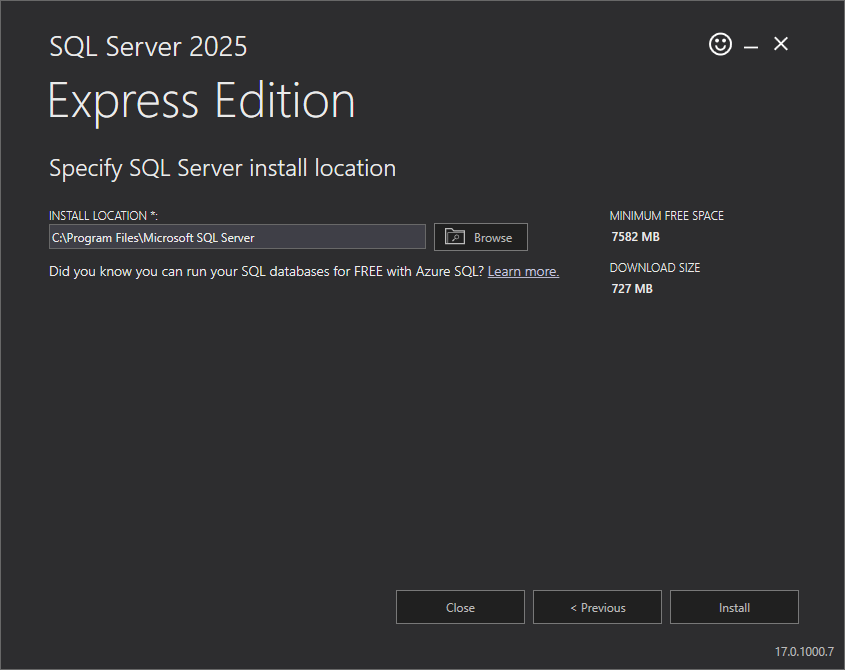
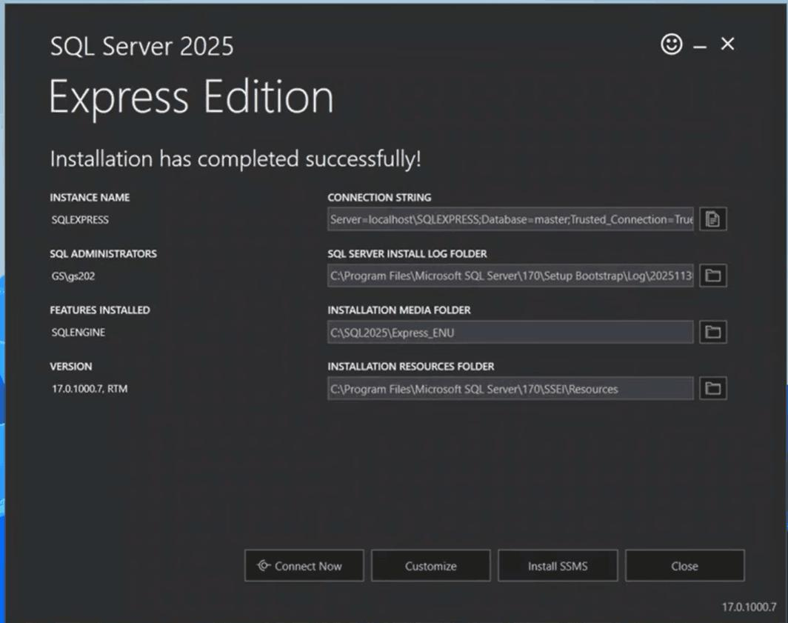
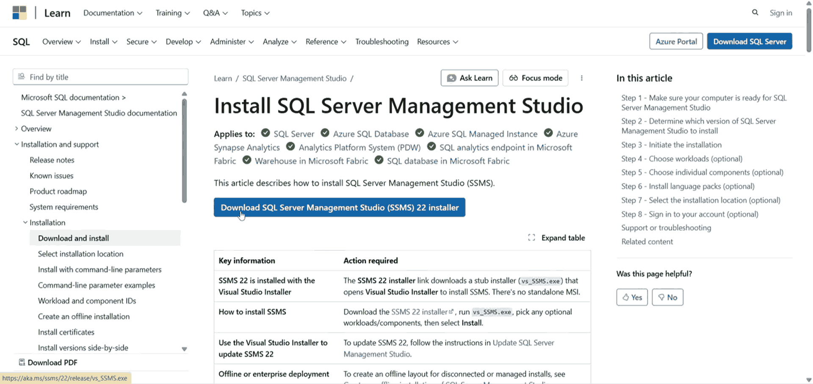
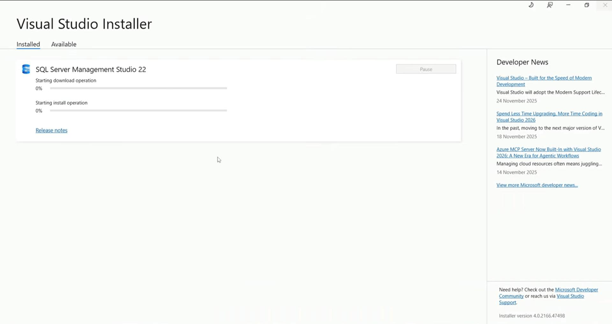
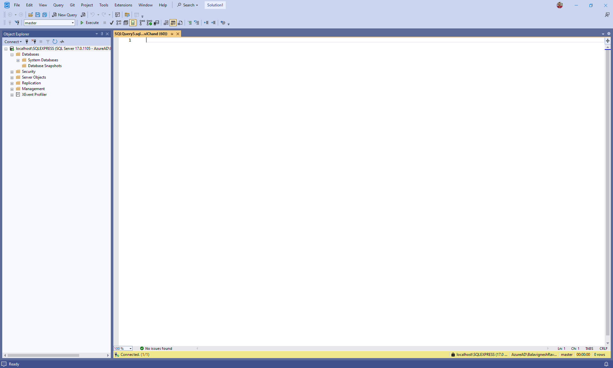
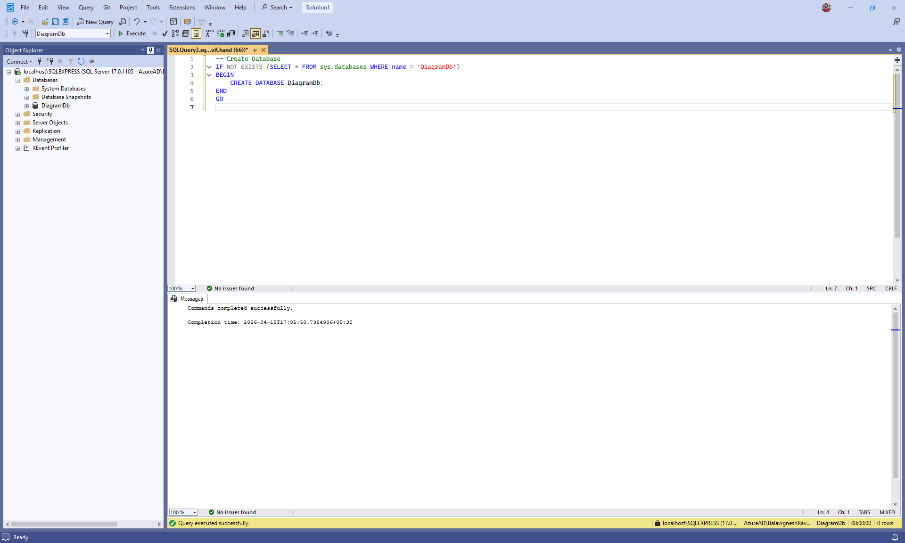
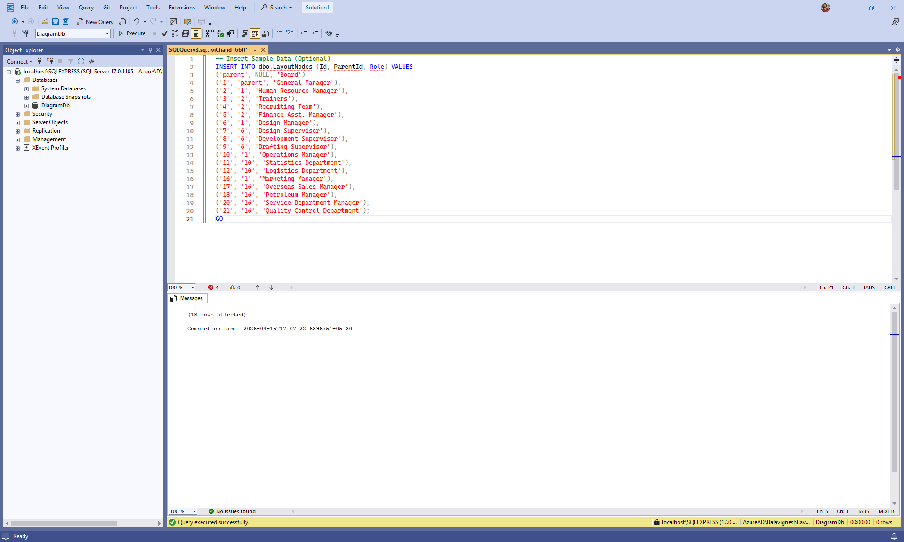

# Connecting SQL Server to Blazor Diagram

This guide explains how to load and visualize organizational chart data stored in a Microsoft SQL Server database using the Syncfusion® Blazor Diagram component. It demonstrates how to configure SQL Server, create the required database schema, and bind the data to a Blazor application to render an organizational chart diagram.

**What is Microsoft SqlClient?**

[Microsoft.Data.SqlClient](https://www.nuget.org/packages/Microsoft.Data.SqlClient) is the official .NET library used to connect ASP.NET Core applications to Microsoft SQL Server. It enables applications to execute SQL queries, call stored procedures, and read or write data securely using strongly supported APIs from Microsoft.

**Key benefits of SqlClient:**

- **Secure by Design**: Supports parameterized queries to help prevent SQL injection attacks.
- **High Performance**: Provides efficient, low‑level access to SQL Server with minimal overhead.
- **Asynchronous Support**: Supports async database operations for better scalability in web APIs.
- **Full SQL Control**: Allows precise control over SQL queries, stored procedures, and transactions.
- **Official Microsoft Provider**: Maintained and supported by Microsoft for long‑term compatibility with SQL Server.

## Prerequisites

Ensure the following software and packages are installed before proceeding:

| Software / Package | Version | Purpose |
|-------------------|---------|---------|
| Visual Studio / Code | Latest | Development IDE with .NET workloads |
| .NET SDK | 10.0 or later | Build & run projects |
| Microsoft SQL Server | 2019 or later | Relational database server |
| SQL Server Management Studio (SSMS) | Latest | Manage SQL Server databases and execute queries |
| Microsoft.Data.SqlClient (NuGet) | 7.0.0 or later | SQL Server connectivity for ASP.NET Core |
| Syncfusion.Blazor.Diagram | {{site.blazorversion}} | Diagram component |
| Syncfusion.Blazor.Themes | {{site.blazorversion}} | Styling for Syncfusion® Blazor components |


## Installing and configuring Microsoft SQL Server and SQL Server Management Studio (SSMS)

To store and manage diagram data, Microsoft SQL Server must be installed and configured before integrating it with the Blazor application. This section explains how to install SQL Server, install SQL Server Management Studio (SSMS), and preparing the environment for database creation. This setup is a one‑time process and only needs to be completed before configuring the backend.

### Installing Microsoft SQL Server

Microsoft SQL Server provides the relational database engine used to store organizational chart data required by the diagram component.

Follow these steps to install SQL Server:

1. Download the Microsoft SQL Server installer for the required edition from the official page: [https://www.microsoft.com/en-in/sql-server/sql-server-downloads] (https://www.microsoft.com/en-in/sql-server/sql-server-downloads). For this guide, **SQL Server Express** is selected. It is a free, lightweight edition suitable for development, testing, and sample applications.

2. Open the downloaded installer file to launch the setup wizard.

3. Choose the installation type (for example, **Basic** for quick setup or **Custom** for advanced configuration).


4. Select the installation location when prompted and proceed with the installation.



5. Wait for the setup process to complete. Once finished, a confirmation message indicates that SQL Server has been installed successfully.



At this stage, the SQL Server database engine is installed, but a management tool is required to interact with the server.


### Installing SQL Server Management Studio (SSMS)

SQL Server Management Studio (SSMS) is a graphical interface used to connect to SQL Server, manage databases, execute queries, and inspect data.

Follow these steps to install SSMS:

1. From the SQL Server installer completion screen, click the **Install SSMS** button. This action redirects you to the official Microsoft download page. 




2. Download the SSMS installer.

3. Open the downloaded installer file. This launches the Visual Studio Installer.

4. Select the required workloads (the default selections are sufficient for most users).


5. Click the **Install** button and wait for the installation to complete.



6. Once installation finishes, close the installer.


### Connecting to SQL Server using SQL Server Management Studio (SSMS)

After installing SQL Server Management Studio (SSMS), connect to the SQL Server instance to begin creating databases and tables.

1. Launch **SQL Server Management Studio** from the Windows Start menu or application launcher.


2. In the **Connect to Server** dialog, configure the connection properties:
   - **Server name**: Required (for example, **localhost** or **.\SQLEXPRESS**)
   - **Authentication**: Windows Authentication (recommended for local development)
   - Enable **Trust server certificate** if prompted


3. Click the **Connect** button to establish the connection.

4. After a successful connection, the **Object Explorer** displays the connected SQL Server instance and its available components such as databases, security settings, and server objects.


The SQL Server environment is now ready for database creation and data configuration.


## Creating the database and schema

After connecting to SQL Server using SSMS, the next step is to create the database and schema required to store organizational chart data. The schema represents parent–child relationships that are rendered as nodes and connectors in the Syncfusion® Blazor Diagram component.

### Creating the database

A dedicated database named **DiagramDb** is used to store organizational chart data. The database can be created using either the SSMS user interface or a SQL script.

#### Manual approach (using SSMS UI)

1. In **Object Explorer**, right‑click the **Databases** folder.


2. Select **New Database** from the context menu.
3. Enter **DiagramDb** as the database name.
4. Click the **OK** button to create the database.


#### Query‑Based approach

Alternatively, the database can be created using a SQL query.

- Click **New Query** button in the SSMS toolbar to open the query editor.

 

- Paste the following SQL script into the query editor and click **Execute** to run the query.

 ```sql
-- Create Database
IF NOT EXISTS (SELECT * FROM sys.databases WHERE name = 'DiagramDb')
BEGIN
    CREATE DATABASE DiagramDb;
END
GO
```



### Creating the table

Create a table named **LayoutNode** to store the data that defines the structure of the diagram.

- Each record represents a diagram node.
- The **Id** column uniquely identifies a node.
- The **ParentId** column establishes parent–child relationships.
- Root‑level nodes contain a **NULL** value for **ParentId**.

Run the following SQL script in the query editor to create the table in the **DiagramDb** database.

```sql
-- Create LayoutNode Table
IF NOT EXISTS (SELECT * FROM sys.tables WHERE name = 'LayoutNode')
BEGIN
    CREATE TABLE dbo.LayoutNode (
        Id VARCHAR(50) PRIMARY KEY,
        ParentId VARCHAR(50) NULL,
        Role VARCHAR(100) NOT NULL
    );
END
GO
```


### Inserting sample data

Sample records can be added to the **LayoutNode** table to populate the database with initial data.

Run the following SQL script in the query editor to insert sample records into the table.

```sql
-- Insert Sample Data (Optional)
INSERT INTO dbo.LayoutNode (Id, ParentId, Role) VALUES
('parent', NULL, 'Board'),
('1', 'parent', 'General Manager'),
('2', '1', 'Human Resource Manager'),
('3', '2', 'Trainers'),
('4', '2', 'Recruiting Team'),
('5', '2', 'Finance Asst. Manager'),
('6', '1', 'Design Manager'),
('7', '6', 'Design Supervisor'),
('8', '6', 'Development Supervisor'),
('9', '6', 'Drafting Supervisor'),
('10', '1', 'Operations Manager'),
('11', '10', 'Statistics Department'),
('12', '10', 'Logistics Department'),
('16', '1', 'Marketing Manager'),
('17', '16', 'Overseas Sales Manager'),
('18', '16', 'Petroleum Manager'),
('20', '16', 'Service Department Manager'),
('21', '16', 'Quality Control Department');
GO
```




### Verifying the inserted data

Verify that the records have been created successfully by querying the **LayoutNode** table. 

Run the following SQL query in the query editor to view the inserted data.

```sql
SELECT * FROM dbo.LayoutNode;
```


## Integrating SQL Server with Blazor application

In this section, a Blazor  project is created and configured to connect to SQL Server using **Microsoft.Data.SqlClient**.

### Step 1: Create the Blazor project
Before installing the necessary NuGet packages, a new Blazor web application must be created using the default template. For full step-by-step instructions on creating a Blazor project, see the getting-started guide: **[Getting Started](https://blazor.syncfusion.com/documentation/diagram/getting-started)**.

For this guide, a Blazor application named **BlazorServerStyle** has been created. Once the project is set up, the next step involves installing the required NuGet packages. This package enables Microsoft SQL Server integration.

> **Note**:
In Blazor Server, the UI, sqlclient all run in the same project.
In Blazor WebAssembly, the sqlclient must run in a Server host project, and the WASM client calls it over HTTP.

### Step 2: Installing required NuGet packages

After creating the Blazor project, install the following required NuGet packages.

- **Microsoft.Data.SqlClient** – Provides connectivity to Microsoft SQL Server.

The required NuGet packages can be installed using any one of the following methods.

#### Method 1: Using Package Manager Console (Visual Studio)

1. Open **Visual Studio**.
2. Navigate to **Tools → NuGet Package Manager → Package Manager Console**.
3. Run the following commands:

```powershell
Install-Package Microsoft.Data.SqlClient
```

#### Method 2: Using NuGet Package Manager UI (Visual Studio)

1. Open Visual Studio.
2. Navigate to Tools → NuGet Package Manager → Manage NuGet Packages for Solution.
3. Select the Browse tab.
4. Search for and install each package individually:
   - **Microsoft.Data.SqlClient**

#### Method 3: Using .NET CLI / Integrated Terminal (Visual Studio Code)

The required packages can also be installed using the .NET CLI. Ensure the commands are executed from the Blazor project directory.

```powershell
dotnet add package Microsoft.Data.SqlClient
```

### Step 3: Create the data model

A data model defines how data stored in a database table is represented within the blazor application. It maps database records to C# objects that can be used by the Syncfusion® Blazor Diagram component.

In this application, the data model maps directly to the **LayoutNode** table created in SQL Server.

> This model does not create or modify database tables. It only represents the existing SQL Server schema within the application.

**Instructions:**

1. Create a new folder named **Data** in the application project.
2. Inside the **Data** folder, create a new file named **LayoutNode.cs**.
3. Define the `LayoutNode` class with the following code:

```csharp
using System.ComponentModel.DataAnnotations;

namespace BlazorServerStyle.Data
{
    /// <summary>
    /// Represents a node in the layout hierarchy used by the diagram.
    /// </summary>
    public class LayoutNode
    {
        /// <summary>
        /// Gets or sets the unique identifier for the layout node.
        /// </summary>
        /// <remarks>
        /// This property serves as the primary key for the node.
        /// </remarks>
        [Key]
        public string Id { get; set; } = null!;

        /// <summary>
        /// Gets or sets the identifier of the parent node.
        /// </summary>
        /// <remarks>
        /// A null value indicates that this node is a root-level node.
        /// </remarks>
        public string? ParentId { get; set; }

        /// <summary>
        /// Gets or sets the role associated with the layout node.
        /// </summary>
        /// <remarks>
        /// This value determines the responsibility or classification of the node
        /// within the diagram.
        /// </remarks>
        public string Role { get; set; } = null!;
    }
}

```


### Step 4: Create the repository class

A repository class acts as a bridge between the Blazor application and the SQL Server database. It contains the logic required to read data from the database and return it.

Using a repository helps maintain a clear separation by isolating database access logic from controller logic.

**Instructions:**

1. Inside the **Data** folder, create a new file named **LayoutNodeRepository.cs**.
2. Define the `LayoutNodeRepository` class with the following code:

```csharp
using Microsoft.Data.SqlClient;

namespace BlazorServerStyle.Data
{
    public class LayoutNodeRepository
    {
        private readonly string _connectionString;

        /// <summary>
        /// Initializes the repository with a connection string from configuration.
        /// </summary>
        public LayoutNodeRepository(IConfiguration configuration)
        {
            _connectionString = configuration.GetConnectionString("DiagramDb")!;
        }

        /// <summary>
        /// Creates a new SQL connection using the configured connection string.
        /// </summary>
        private SqlConnection GetConnection() => new SqlConnection(_connectionString);

        /// <summary>
        /// Returns all layout nodes ordered by Id.
        /// </summary>
        public async Task<List<LayoutNode>> GetLayoutNodesAsync()
        {
            var list = new List<LayoutNode>();
            const string sql =
                @"SELECT Id, ParentId, Role FROM dbo.LayoutNodes";

            await using var conn = GetConnection();
            await conn.OpenAsync();
            await using var cmd = new SqlCommand(sql, conn);
            await using var reader = await cmd.ExecuteReaderAsync();

            while (await reader.ReadAsync())
            {
                list.Add(
                    new LayoutNode
                    {
                        Id = reader["Id"] as string ?? string.Empty,
                        ParentId = reader["ParentId"] as string,
                        Role = reader["Role"] as string ?? string.Empty
                    }
                );
            }
            return list;
        }
    }
}

```

**Explanation:**

- The repository reads the SQL Server connection string from application configuration.
- A helper method creates a new SqlConnection when needed.
- The `GetLayoutNodesAsync` method retrieves all layout nodes from the **LayoutNode** table and maps each record to a `LayoutNode` object.

### Step 5: Configure the connection string

A connection string contains the information needed to connect the application to the SQL Server database, including the server address, database name, and authentication credentials.

**Instructions:**

1. Open the **appsettings.json** file in the project root.
2. Add or update the `ConnectionStrings` section with the SQL Server connection details:

```json
{
  "ConnectionStrings": {
    "DiagramDb": "Data Source=localhost;Initial Catalog=DiagramDb;Integrated Security=True;Connect Timeout=30;Encrypt=False;Trust Server Certificate=False;Application Intent=ReadWrite;Multi Subnet Failover=False"
  },
  "Logging": {
    "LogLevel": {
      "Default": "Information",
      "Microsoft.AspNetCore": "Warning"
    }
  },
  "AllowedHosts": "*"
}
```

**Connection string components:**

| Component | Description |
| ----------- | ------------- |
| Data Source | The address of the SQL Server instance (server name, IP address, or localhost) |
| Initial Catalog | The database name (in this case, **DiagramDb**) |
| Integrated Security | Set to **True** for Windows Authentication; use **False** with Username/Password for SQL Authentication |
| Connect Timeout | Connection timeout in seconds (default is 15) |
| Encrypt | Enables encryption for the connection (set to **True** for production environments) |
| Trust Server Certificate | Whether to trust the server certificate (set to **False** for security) |
| Application Intent | Set to **ReadWrite** for normal operations or **ReadOnly** for read-only scenarios |
| Multi Subnet Failover | Used in failover clustering scenarios (typically **False**) |

### Step 6: Register services

The **Program.cs** file is where application services are registered and configured. This file must be updated to register services and the repository for dependency injection.

**Instructions:**

1. Open the **Program.cs** file at the project root.
2. Replace the existing content with the following configuration:

```csharp
using BlazorServerStyle.Components;
using Syncfusion.Blazor;
using BlazorServerStyle.Data;

var builder = WebApplication.CreateBuilder(args);

// Add services to the container.
builder.Services.AddRazorComponents()
    .AddInteractiveServerComponents();
builder.Services.AddSyncfusionBlazor();
builder.Services.AddControllers();
builder.Services.AddScoped<LayoutNodeRepository>();
var app = builder.Build();

// Configure the HTTP request pipeline.
if (!app.Environment.IsDevelopment())
{
    app.UseExceptionHandler("/Error", createScopeForErrors: true);
    // The default HSTS value is 30 days. You may want to change this for production scenarios, see https://aka.ms/aspnetcore-hsts.
    app.UseHsts();
}
app.UseStatusCodePagesWithReExecute("/not-found", createScopeForStatusCodePages: true);
app.UseHttpsRedirection();

app.UseAntiforgery();

app.UseAuthorization();

app.MapControllers();

app.MapStaticAssets();
app.MapRazorComponents<App>()
    .AddInteractiveServerRenderMode();

app.Run();

```
**Explanation**

* The `LayoutNodeRepository` is registered for dependency injection.

The backend setup is now complete. 

## Rendering the Blazor Diagram Component

### Step 1: Install and Configure Blazor Diagram Component

This section explains how to render an organizational chart using the Syncfusion® Blazor Diagram component by binding it to data loaded from the Microsoft SQL Server.

**Instructions:**

* The Syncfusion.Blazor.Diagram package was installed in **Step 2** of the previous section **Integrating SQL Server with Blazor application**[🔗](#integrating-sql-server-with-blazor-application).
* Import the required namespaces in the **Components/_Imports.razor** file:

```csharp
@using Syncfusion.Blazor
@using Syncfusion.Blazor.Diagram
```

* Before using Syncfusion® Blazor components, register your license key in **Program.cs**:

```csharp
Syncfusion.Licensing.SyncfusionLicenseProvider.RegisterLicense("YOUR LICENSE KEY");
```

* Add the Syncfusion® stylesheet and scripts to the host page **<head>** element to ensure that required assets load before the Blazor components are rendered. Use the appropriate host file based on your project type:

  - **Blazor Server (.NET 8+)**: Add the links to **Pages/App.razor** (inside the **<head>** element).
  - **Blazor WebAssembly**: Add the links to **wwwroot/index.html** (inside the **<head>** element).

```html
<!-- Syncfusion Blazor Stylesheet -->
<link href="_content/Syncfusion.Blazor.Themes/bootstrap5.css" rel="stylesheet" />

<!-- Syncfusion Blazor Scripts -->
<script src="_content/Syncfusion.Blazor.Core/scripts/syncfusion-blazor.min.js" type="text/javascript"></script>
```
For this project, the Bootstrap 5 theme is used. A different theme can be selected or the existing theme can be customized based on project requirements. Refer to the [Syncfusion Blazor Components Appearance](https://blazor.syncfusion.com/documentation/appearance/themes) documentation to learn more about theming and customization options.

For additional guidance, refer to the Diagram component [getting-started](https://blazor.syncfusion.com/documentation/diagram/getting-started-with-web-app) documentation.

### Step 2: Update the Blazor Diagram

In this step, an organizational chart layout is created using the Blazor Diagram component in the **Home.razor** file.

**Instructions:**

1. Open the file named **Home.razor** in the **Components/Pages** folder.
2. Add the following code to create a Diagram:

```cshtml
@page "/"
@using Syncfusion.Blazor.Diagram
@using Syncfusion.Blazor.Data
@using Syncfusion.Blazor.Inputs
@using BlazorServerStyle.Data
@inject LayoutNodeRepository LayoutNodeRepository

@if (loading)
{
    <p>Loading organizational chart...</p>
}
else if (!string.IsNullOrEmpty(errorMessage))
{
    <div style="color: red;">Error: @errorMessage</div>
}
else if (_dataSource == null || !_dataSource.Any())
{
    <p>No data available</p>
}
else
{
    <SfDiagramComponent ID="OrgChartDiagram" @ref="_diagram" Width="100%" Height="700px" NodeCreating="@OnNodeCreating" ConnectorCreating="@OnConnectorCreating">
        <DataSourceSettings ID="Id" ParentID="ParentId" DataSource="@_dataSource"></DataSourceSettings>
        <SnapSettings>
            <HorizontalGridLines LineColor="white" LineDashArray="2,2">
            </HorizontalGridLines>
            <VerticalGridLines LineColor="white" LineDashArray="2,2">
            </VerticalGridLines>
        </SnapSettings>
        <Layout Type="LayoutType.OrganizationalChart" @bind-HorizontalSpacing="@_horizontalSpacing" @bind-VerticalSpacing="@_verticalSpacing">
        </Layout>
    </SfDiagramComponent>
}
@code
{
  //Initializing layout.
  private int _horizontalSpacing = 40;
  private int _verticalSpacing = 50;

  //Creates node with some default values.
  private void OnNodeCreating(IDiagramObject obj)
  {
    Node node = obj as Node;
    node.Height = 50;
    node.Width = 150;
    LayoutNode Data = node.Data as LayoutNode;
    node.Annotations = new DiagramObjectCollection<ShapeAnnotation>(){
            new ShapeAnnotation(){
                Content = Data.Role,
            }
        };
    node.Style = new ShapeStyle() { Fill = "#6495ED", StrokeWidth = 1, StrokeColor = "Black" };
  }

  //Creates connectors with some default values.
  private void OnConnectorCreating(IDiagramObject connector)
  {
    Connector connectors = connector as Connector;
    connectors.Type = ConnectorSegmentType.Orthogonal;
    connectors.Style = new TextStyle() { StrokeColor = "#6495ED", StrokeWidth = 1 };
    connectors.TargetDecorator = new DecoratorSettings
        {
            Shape = DecoratorShape.None,
            Style = new ShapeStyle() { Fill = "#6495ED", StrokeColor = "#6495ED", }
        };
  }
  private List<LayoutNode>? _dataSource;
  private bool loading = true;
  private string? errorMessage;
  private SfDiagramComponent _diagram;

  protected override async Task OnInitializedAsync()
  {
    try
    {
      _dataSource = await LayoutNodeRepository.GetLayoutNodesAsync();
    }
    catch (Exception ex)
    {
      errorMessage = ex.Message;
    }
    finally
    {
      loading = false;
    }

    await base.OnInitializedAsync();
  }
}
```
---

## Run the Sample Locally

This section explains how to run the application locally.

**Run the Blazor Server host**

```powershell
cd src/BlazorServerStyle
dotnet run
```

**Run the Blazor WebAssembly host**

```powershell
cd src/BlazorWASMStyle/BlazorWASMStyle
dotnet run
```

## Complete sample repository

A complete, working sample implementation is available in the [GitHub repository](https://github.com/SyncfusionExamples/Blazor-Diagram-Examples/tree/master/Samples/OrganizationalChartMSSQL).

## Summary

| Step | Description | Reference |
|-----:|-------------|-----------|
| 1 | Install and configure Microsoft SQL Server and SQL Server Management Studio | [View](#installing-and-configuring-microsoft-sql-server-and-sql-server-management-studio-SSMS) |
| 2 | Create the database, schema, and insert organizational chart diagram data | [View](#creating-the-database-and-schema) |
| 3 | Create and configure the Blazor appliaton | [View](#integrating-sql-server-with-blazor-application) |
| 4 | Integrate and configure the Syncfusion® Blazor Diagram component | [View](#rendering-the-blazor-diagram-component) |
| 5 | Run and test the complete application | [View](#run-the-sample-locally) |

## See also

- [Data Binding](https://ej2.syncfusion.com/Blazor/documentation/diagram/data-binding)
- [Organizational Chart Layout](https://ej2.syncfusion.com/Blazor/documentation/diagram/org-chart)