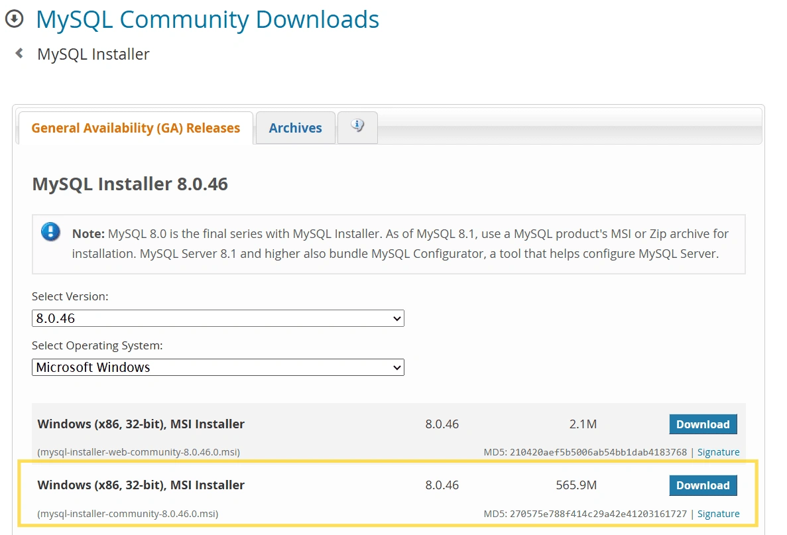
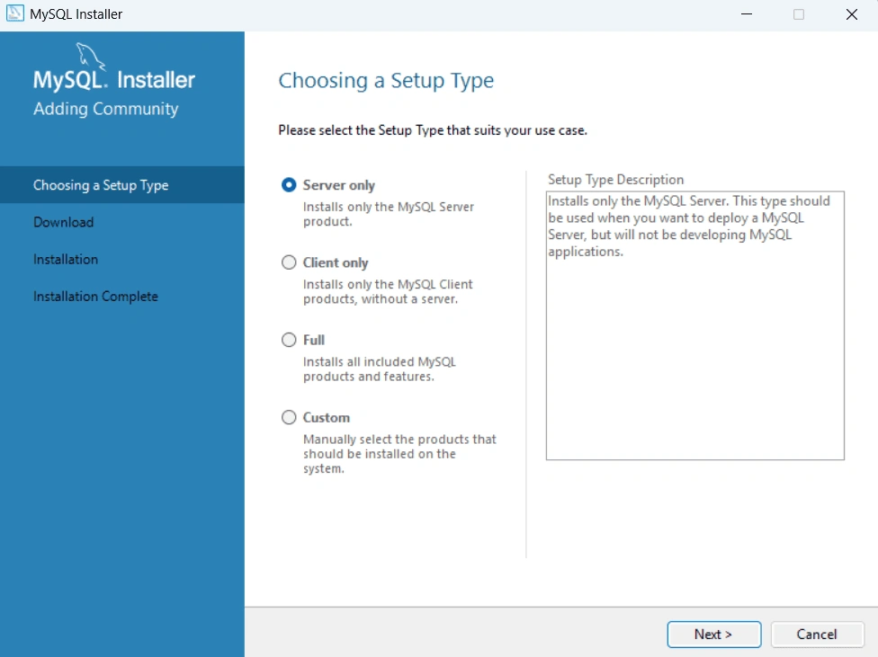
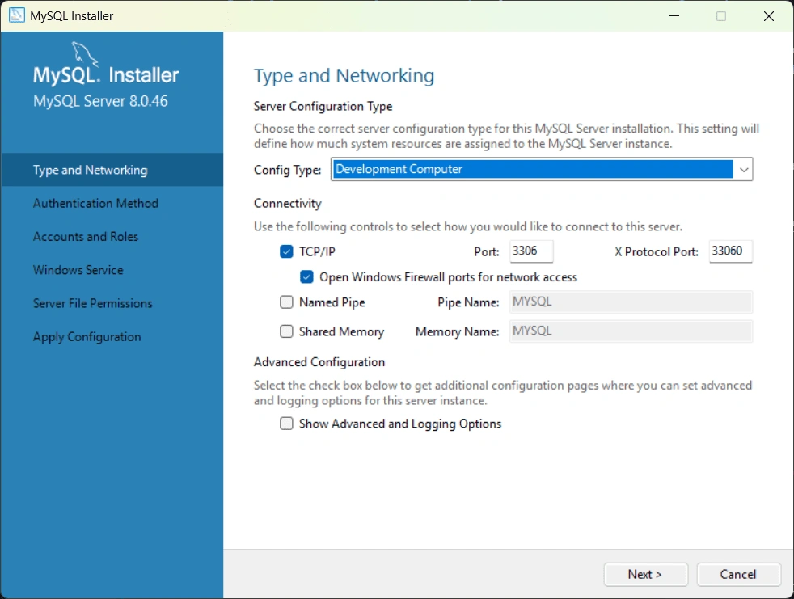
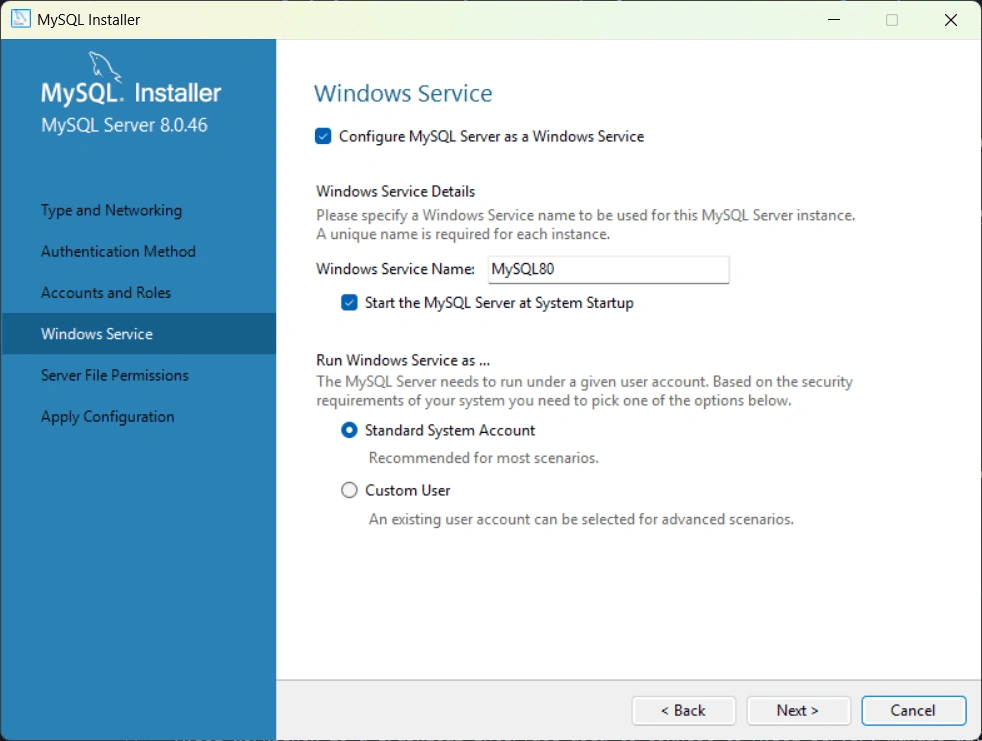
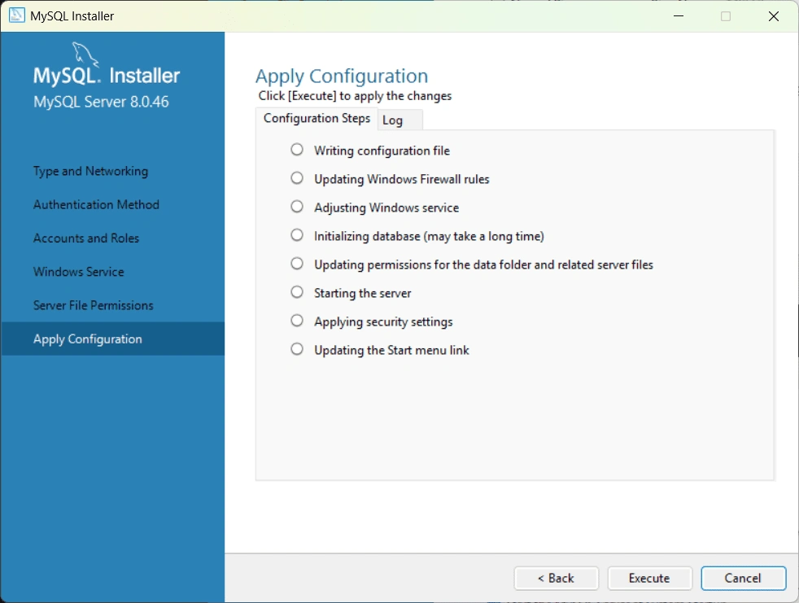
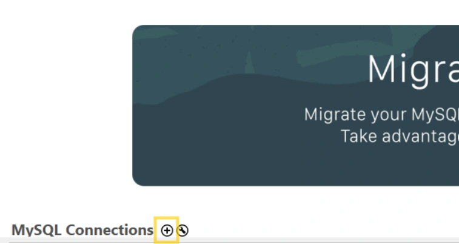
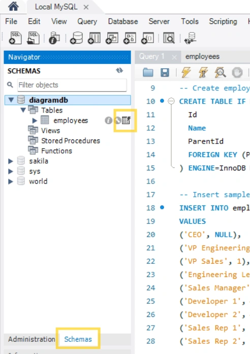
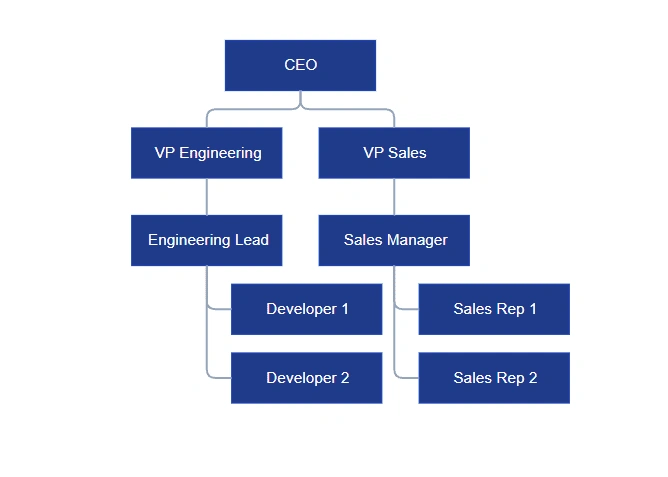

# Connecting MySQL to Syncfusion® Blazor Diagram using LINQ2DB

This guide explains how to load and visualize organizational chart data stored in a MySQL database using the Syncfusion® Blazor Diagram component. It demonstrates how to configure MySQL, create the required database schema, expose the data through an ASP.NET Core Web API, and bind the API response to a Blazor application to render an organizational chart.

**What is LINQ2DB?**

[LINQ2DB](https://linq2db.github.io) is a lightweight object-relational mapping (ORM) library for .NET that simplifies database access. It enables applications to query relational databases such as MySQL using LINQ syntax, providing a type-safe and efficient way to retrieve data without the overhead of larger ORM frameworks.

**Key benefits of LINQ2DB:**

- **Lightweight Performance:** Provides efficient database access with minimal runtime overhead.
- **LINQ Support:** Use familiar LINQ syntax for database queries instead of raw SQL strings.
- **Type Safety:** Strong typing reduces runtime errors and provides IntelliSense support.
- **Built-in Security:** Automatic parameterization prevents SQL injection attacks.
- **MySQL-Specific:** Supports modern MySQL versions, including MySQL 8.0, with proper handling of character encoding and collation.
- **Minimal Configuration:** Simple setup with straightforward connection string management.

## Prerequisites

Ensure the following software and packages are installed before proceeding:

| Software/Package | Version | Purpose |
|---|---|---|
| Visual Studio | 17.0 or later | Development IDE |
| .NET SDK | 8.0 or later | Runtime and build tools |
| MySQL Server | 8.0.46 | Database server |
| MySQL Workbench | Latest stable | GUI client for MySQL management |

## Installing and Configuring MySQL Server and Workbench

To store and manage diagram data, MySQL Server must be installed and configured before connecting it to the ASP.NET Core Web API. This section describes how to install MySQL Server and MySQL Workbench, and how to verify connectivity to the database server.

### Installing MySQL Server

MySQL Server provides the relational database engine used to store organizational chart data required by the diagram component.

1. Download MySQL Installer version 8.0.46 from [mysql.com](https://dev.mysql.com/downloads/windows/installer/8.0.html).

2. Run the installer and follow the setup wizard.
   - Choose setup type as **Server only**.
   
   - Next, Download and Install the MySQL Server 8.0.46.
3. Configure the MySQL Server after installation.
   - Choose server configuration type as **Development Computer**.
   
   - Choose Strong Password Encryption for Authentication and set your root account password.
   - Specify a Windows service name (e.g., **MySQL80**).
   
   - Start applying the configuration by clicking the **Execute** button.
   
4. Click **Finish** to complete the installation.

### Installing MySQL Workbench

MySQL Workbench is a graphical tool used to connect to MySQL Server, manage databases, execute SQL queries, and inspect data.

1. Download MySQL Workbench Installer version 8.0.47 from [mysql-workbench](https://dev.mysql.com/downloads/workbench)
2. Run the installer and follow the setup wizard.
   - Choose the setup type as **Complete**.
   - Click **Finish** after installing MySQL Workbench.

## Connecting to MySQL Server using MySQL Workbench

After installing MySQL Workbench, create a connection to the MySQL Server instance to begin creating databases and tables.

1. Launch **MySQL Workbench**.
2. Click **+** to create a new connection.

3. Configure the connection settings:
   - **Connection Name**: **Local MySQL**
   - **Hostname**: **localhost**
   - **Port**: **3306**
   - **Username**: **root**
   - **Password**: (your MySQL root password)
4. Click **Test Connection** to verify the connection.
5. Click OK to save the connection.

The MySQL Server instance is now connected and ready for database creation.

## Creating the Database and Table

The database required for the application can be created using one of the following methods:
1. Using MySQL Workbench
2. Using the MySQL Command Line Client

### Creating a Database using MySQL Workbench

Use MySQL Workbench to create the required database and table for storing organizational chart data.

1.  Open **MySQL Workbench**.
2.  On the home screen, click your **MySQL connection** (for example: **Local MySQL**).
3.  The **SQL Editor** opens. This editor is used to write and execute SQL statements for the selected connection.
4.  Paste the following SQL script into the SQL Editor:

```
-- Create database with UTF-8 support
CREATE DATABASE IF NOT EXISTS diagramdb
  CHARACTER SET utf8mb4
  COLLATE utf8mb4_general_ci;

-- Select the database
USE diagramdb;

-- Create employees table
CREATE TABLE IF NOT EXISTS employees (
  Id               INT NOT NULL AUTO_INCREMENT PRIMARY KEY,
  Name             VARCHAR(100) NOT NULL,
  ParentId         INT NULL,
  FOREIGN KEY (ParentId) REFERENCES employees(Id) ON DELETE SET NULL
) ENGINE=InnoDB DEFAULT CHARSET=utf8mb4 COLLATE=utf8mb4_general_ci;

-- Insert sample organizational hierarchy data
INSERT INTO employees (Name, ParentId)
VALUES
('CEO', NULL),
('VP Engineering', 1),
('VP Sales', 1),
('Engineering Lead', 2),
('Sales Manager', 3),
('Developer 1', 4),
('Developer 2', 4),
('Sales Rep 1', 5),
('Sales Rep 2', 5);
```

5.  Click the **Execute** button (or press **Ctrl + Shift + Enter**) to run the script.
6.  The Output window at the bottom displays status messages and any errors related to the SQL actions.

#### Verify the Database and Table

To confirm that the database and table were created successfully:

1.  In the **Navigator → SCHEMAS** panel on the left side, click the **Refresh icon**.
2.  **Expand**: diagramdb - Tables - employees.
3.  Click the **Output Grid** icon to view the table data in grid view.
  

### Creating a Database via MySQL Command Line Client

The database can also be created using the MySQL Command Line Client.

1.  Open **MySQL Command Line Client**.
2.  Enter your MySQL **root password** when prompted.
3.  Paste the same SQL script used in [MySQL Workbench](#creating-a-database-using-mysql-workbench) and press **Enter**.
4.  Run the query **SELECT * FROM employees;** to verify the inserted data.

**Expected output**:

| Id | Name | ParentId |
| --- | --- | --- |
| 1 | CEO | NULL |
| 2 | VP Engineering | 1 |
| 3 | VP Sales | 1 |
| 4 | Engineering Lead | 2 |
| 5 | Sales Manager | 3 |
| 6 | Developer 1 | 4 |
| 7 | Developer 2 | 4 |
| 8 | Sales Rep 1 | 5 |
| 9 | Sales Rep 2 | 5 |


## Integrating MySQL Server with ASP.NET Core Web API

This section explains how to create an ASP.NET Core Web API project that connects to MySQL and exposes data for use by the Syncfusion® Blazor Diagram component.

### Creating the Web API Project using Visual Studio

1. Open **Visual Studio**.
2. Click **Create a new project**.
3. Search for **"ASP.NET Core Web API"** and select it.
4. Click **Next**.
5. Configure project settings:
   - **Project name**: **Diagram_MySQL.Server**
   - **Location**: Choose a folder
   - **Solution name**: **Diagram_MySQL**
6. Click **Next**.
7. Additional information:
   - **Framework**: .NET 8.0 (or latest available)
   - **Authentication type**: None
   - **Uncheck**: "Configure for HTTPS"
8. Click **Create**.

Visual Studio creates a new ASP.NET Core Web API project with default files such as **Program.cs**, **Controllers**, and **appsettings.json**.

### Creating the Web API Project using Visual Studio Code

Alternatively, the project can be created using the .NET CLI, which is commonly used with Visual Studio Code.

1. Open a terminal or command prompt.
2. Navigate to the directory where the server application should be created.
3. Run the following commands:

```
dotnet new webapi -n Diagram_MySQL.Server
cd Diagram_MySQL.Server
```

### Installing NuGet Packages using Package Manager Console

The Web API requires additional NuGet packages for LINQ2DB, MySQL connectivity, and JSON serialization.

#### Method 1: Using Package Manager Console (Visual Studio)

1. In Visual Studio, go to **Tools → NuGet Package Manager → Package Manager Console**.
2. Run the following commands sequentially:

```
Install-Package linq2db -Version 6.1.0
```

```
Install-Package linq2db.MySql -Version 6.1.0
```

```
Install-Package linq2db.AspNet -Version 5.4.1.9
```

```
Install-Package MySqlConnector -Version 2.5.0
```

```
Install-Package Microsoft.AspNetCore.Mvc.NewtonsoftJson -Version 8.0.0
```

#### Method 2: Using .NET CLI / Integrated Terminal (Visual Studio Code)

Alternatively, the packages can be installed using the .NET CLI from the project directory.

```
dotnet add package linq2db --version 6.1.0
dotnet add package linq2db.MySql --version 6.1.0
dotnet add package linq2db.AspNet --version 5.4.1.9
dotnet add package MySqlConnector --version 2.5.0
dotnet add package Microsoft.AspNetCore.Mvc.NewtonsoftJson --version 8.0.0
```

### Create the Data Model

A data model represents a database table as a C# class and maps table columns to class properties.

**Instructions:**
1. Create a new folder named **Models** in the **Diagram_MySQL.Server** project.
2. Inside the **Models** folder, create a new file named **Employee.cs**.
3. Define the `Employee` class with the following code:

```cs
using LinqToDB.Mapping;

namespace Diagram_MySQL.Server.Models
{
    [Table("employees")]
    public class Employee
    {
        [PrimaryKey, Identity]
        [Column("Id")]
        public int Id { get; set; }

        [Column("Name")]
        [NotNull]
        public string Name { get; set; }

        [Column("ParentId")]
        public int? ParentId { get; set; }
    }
}
```

### Configuring the Connection String

The connection string defines how the application connects to the MySQL server.

**Instructions:**
1. Open **appsettings.json**.
2. Add or update the `ConnectionStrings` section with the MySQL connection details:

```
{
  "ConnectionStrings": {
    "MySqlConn": "Server=localhost;Port=3306;Database=diagramdb;User Id=root;Password=YOUR_PASSWORD_HERE;"
  },
  "Logging": {
    "LogLevel": {
      "Default": "Information",
      "Microsoft.AspNetCore": "Warning"
    }
  },
  "AllowedHosts": "*"
}
```

### Configuring the LINQ2DB Data Connection

A data connection class is required for **LINQ2DB** to communicate with MySQL.

**Instructions:**
1. Create a new folder named **Data** in the **Diagram_MySQL.Server** project.
2. Inside the **Data** folder, create a new file named **AppDataConnection.cs**.
3. Define the `AppDataConnection` class with the following code:


```cs
using Diagram_MySQL.Server.Models;
using LinqToDB;
using LinqToDB.Data;
using LinqToDB.DataProvider.MySql;

namespace Diagram_MySQL.Server.Data
{
    public sealed class AppDataConnection : DataConnection
    {
        public AppDataConnection(IConfiguration config)
            : base(new DataOptions().UseMySql(
                config.GetConnectionString("MySqlConn"),
                MySqlVersion.MySql80,
                MySqlProvider.MySqlConnector))
        {
            InlineParameters = true;
        }

        public ITable<Employee> Employees => this.GetTable<Employee>();
    }
}

```

### Creating the Diagram API Controller

The API controller retrieves employee records and exposes them as an HTTP endpoint.

**Instructions:**
1. Create a new folder named **Controllers** (if not exist) in the **Diagram_MySQL.Server** project.
2. Inside the **Controllers** folder, create a new file named **DiagramController.cs**.
3. Add the following code:

```cs
using Diagram_MySQL.Server.Data;
using Diagram_MySQL.Server.Models;
using LinqToDB;
using LinqToDB.Async;
using Microsoft.AspNetCore.Mvc;

namespace Diagram_MySQL.Server.Controllers
{
    [ApiController]
    [Route("api/[controller]")]
    public class DiagramController : ControllerBase
    {
        private readonly AppDataConnection _db;
        public DiagramController(AppDataConnection db) => _db = db;

        [HttpGet("items")]
        public async Task<IActionResult> GetItems()
        {
            var items = await _db.Employees.ToListAsync();
            return Ok(items);
        }
    }
}

```

### Registering Services in Program.cs

The **Program.cs** file is where we configure all backend services and middle ware.

**Instructions:**
1. Open **Program.cs** in the project root.
2. Add the following code.

```cs
using Diagram_MySQL.Server.Data;
using LinqToDB;
using LinqToDB.AspNet;
using LinqToDB.DataProvider.MySql;
using Newtonsoft.Json.Serialization;

var builder = WebApplication.CreateBuilder(args);

// Add services to the container.
builder.Services.AddControllers().AddNewtonsoftJson(o => o.SerializerSettings.ContractResolver = new DefaultContractResolver());

// Configure CORS (Cross-Origin Resource Sharing) for development
// IMPORTANT: This allows the Blazor frontend to make requests to this backend
// Without CORS, browsers block requests between different ports for security reasons
builder.Services.AddCors(options =>
{
    options.AddPolicy("cors", p => p
        .AllowAnyOrigin()      // Allow requests from any domain
        .AllowAnyHeader()      // Allow any HTTP headers
        .AllowAnyMethod()      // Allow GET, POST, PUT, DELETE, etc.
    );
});
// Register LINQ2DB with MySQL provider
builder.Services.AddLinqToDB(
    (sp, options) =>
        options.UseMySql(
            builder.Configuration.GetConnectionString("MySqlConn"),
            MySqlVersion.MySql80,
            MySqlProvider.MySqlConnector
        )
);

// Register AppDataConnection for dependency injection
builder.Services.AddScoped<AppDataConnection>();
var app = builder.Build();

// Apply CORS policy
app.UseCors("cors");

app.UseAuthorization();

app.MapControllers();

app.Run();
```

**Explanation:**
- `AddControllers()`: Registers MVC controllers for HTTP routing.
- `AddNewtonsoftJson()`: Enables JSON serialization with Newtonsoft.
- `AddCors()`: Configures CORS to allow Blazor frontend (different origin) to make requests.
- `AddLinqToDB()`: Registers LINQ2DB with MySQL configuration.
- `AddScoped<AppDataConnection>()`: Registers our connection class for dependency injection.
- `app.MapControllers()`: Routes incoming requests to controller methods.

The backend API is now configured.

## Integrating Syncfusion® Blazor Diagram

The following steps describe how to render the Diagram and connect it to the MySQL Server back-end.

### Step 1: Creating the Blazor Client Application

Create the Blazor client application using the following commands in a Visual Studio Code terminal or command prompt:

```
dotnet new blazorwasm -n BlazorApp
```
```
cd BlazorApp
```

This command scaffolds a new Blazor application.

### Step 2: Adding Syncfusion® Packages

Install the required Syncfusion® packages by running the following commands:

```
dotnet add package Syncfusion.Blazor.Diagram
dotnet add package Syncfusion.Blazor.Themes
```

### Step 3: Add Import Namespaces
After the packages are installed, open the **~/_Imports.razor** file and import the `Syncfusion.Blazor` and `Syncfusion.Blazor.Diagram` namespaces.




@using Syncfusion.Blazor;
@using Syncfusion.Blazor.Diagram;




### Step 4: Register Syncfusion® Blazor Services

Register the Syncfusion® Blazor service in the **Program.cs** file.




....
using Syncfusion.Blazor;
....
var builder = WebAssemblyHostBuilder.CreateDefault(args);
// ...existing code...
builder.Services.AddSyncfusionBlazor();
// ...existing code...
....




### Step 5: Add Stylesheet and Script Resources

After installation, add the required CSS and script references to **wwwroot/index.html** to apply styling to the Diagram component.

```
<head>
    ...
    <link href="_content/Syncfusion.Blazor.Themes/fluent2.css" rel="stylesheet" />
</head>
<body>
    ....
    <script src="_content/Syncfusion.Blazor.Core/scripts/syncfusion-blazor.min.js" type="text/javascript"></script>
</body>
```

For this project, the "Fluent2" theme is applied. Other themes can be selected, or the existing theme can be customized to meet specific project requirements. For detailed guidance on theming and customization, refer to the [Syncfusion® Blazor Components Appearance](https://blazor.syncfusion.com/documentation/appearance/theme-studio).

### Step 6: Add Syncfusion® Blazor Diagram

Add the following markup to **Pages/Home.razor** to include the diagram component and configure layout and snapping:

```razor
@page "/"
@using Syncfusion.Blazor.Diagram
@using Syncfusion.Blazor.Data

<SfDiagramComponent Width="100%" Height="600px">
    <SnapSettings Constraints="SnapConstraints.None"></SnapSettings>
    <Layout Type="LayoutType.OrganizationalChart"></Layout>
</SfDiagramComponent>
```

### Step 7: Configure Remote Data Binding

Remote data binding enables the diagram to fetch organizational chart data from the ASP.NET Core backend endpoint. The `SfDataManager` handles communication with the server, while `DataSourceSettings` maps database columns to diagram nodes.

Add the data binding configuration to the Diagram component:

```razor
<DataSourceSettings ID="Id" ParentID="ParentId">
    <SfDataManager Url="http://localhost:5180/api/diagram/items" Adaptor="Adaptors.WebApiAdaptor"></SfDataManager>
</DataSourceSettings>
```

### Complete Code

Here is the complete **Pages/Home.razor** file:

```razor
@page "/"
@using Syncfusion.Blazor.Diagram
@using Syncfusion.Blazor.Data

<SfDiagramComponent Width="100%" Height="600px" NodeCreating="OnNodeCreating" ConnectorCreating="OnConnectorCreating">
    <DataSourceSettings ID="Id" ParentID="ParentId">
        <SfDataManager Url="http://localhost:5180/api/diagram/items" Adaptor="Adaptors.WebApiAdaptor"></SfDataManager>
    </DataSourceSettings>

    <SnapSettings Constraints="SnapConstraints.None"></SnapSettings>

    <Layout Type="LayoutType.OrganizationalChart"></Layout>
</SfDiagramComponent>

@code {
    private void OnNodeCreating(IDiagramObject obj)
    {
        var node = obj as Node;
        node.Width = 120;
        node.Height = 40;
        node.Style = new ShapeStyle { Fill = "#1F3A8A", StrokeColor = "#1E40AF" };

        // Node.Data will typically be a Dictionary<string, object> for remote data
        if (node.Data is Dictionary<string, object> dict && dict.TryGetValue("Name", out var nameObj))
        {
            node.Annotations = new DiagramObjectCollection<ShapeAnnotation>
            {
                new ShapeAnnotation { Content = nameObj?.ToString(), Style = new TextStyle { Color = "white" } }
            };
        }
    }

    private void OnConnectorCreating(IDiagramObject obj)
    {
        var connector = obj as Connector;
        connector.Type = ConnectorSegmentType.Orthogonal;
        connector.CornerRadius = 7;
        connector.TargetDecorator = new DecoratorSettings { Shape = DecoratorShape.None };
        connector.Style = new ShapeStyle { StrokeColor = "#94A3B8", StrokeWidth = 1.5f };
    }
}
```

## Running the Complete Application

### Starting the ASP.NET Core Backend

Open a terminal and navigate to the backend project:

```
cd Diagram_MySQL.Server 
```

Start the backend server:

```
dotnet run
```

### Starting the Blazor Frontend

Open a **new terminal** and navigate to the frontend project:

```
cd BlazorApp
```

Start the development server:

```
dotnet run
```



## Troubleshooting

### Blank Page in Browser Tab

1. Verify services and processes
    - Verify the Windows service is running: press **Win+R**, run **services.msc**, and confirm **MySQL80** (or your service name) is running.
    - Ensure the ASP.NET backend is running. If not, run:
      ```
      dotnet run
      ```

2. Verify backend binding and endpoint
   - Verify the MySQL connection string in **appsettings.json**: `Server`, `Port`, `Database`, `User Id`, and `Password` must match your MySQL setup.
   - Check the backend ports in **Properties/launchSettings.json** (look for `applicationUrl`):
     ```
     "applicationUrl": "https://localhost:7177;http://localhost:5180"
     ```
     Use the HTTP port to test the endpoint in browser: **http://localhost:5180/api/diagram/items**

     Expected JSON response:
     ```
     [
        { "Id": 1, "Name": "CEO", "ParentId": null },
        { "Id": 2, "Name": "VP Engineering", "ParentId": 1 },
     ]
     ```
     The API must return a JSON array of objects containing the `Id`, `ParentId`, and `Name` fields (match casing used in `DataSourceSettings`).

3. Check frontend configuration
   - Confirm `DataSourceSettings` property mappings use `ID="Id"` and `ParentID="ParentId"`.
   - Confirm the `SfDataManager` URL in **Pages/Home.razor** uses the correct HTTP port, e.g.: **http://localhost:5180/api/diagram/items**

### Application Shows the Diagram twice
  - Stop the Blazor application (press **Ctrl+C** in the terminal where it's running) and then restart it:
    ```
    dotnet run
    ```

## Complete Sample Repository

A fully functional working sample of this project is available on [GitHub Repository](https://github.com/SyncfusionExamples/Blazor-Diagram-Examples/tree/master/Samples/OrganizationalChartMySQL/)

You can clone the sample repository, update the MySQL connection string, and run both projects to view the organizational chart locally.

## See Also

- [Syncfusion® Blazor Diagram Getting Started](https://blazor.syncfusion.com/documentation/diagram/getting-started-with-wasm-app)
- [Data Binding Documentation](https://blazor.syncfusion.com/documentation/diagram/data-binding)
- [Organizational Chart Layout](https://blazor.syncfusion.com/documentation/diagram/layout/organizational-chart)
