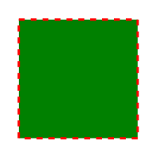
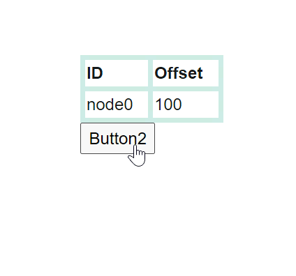
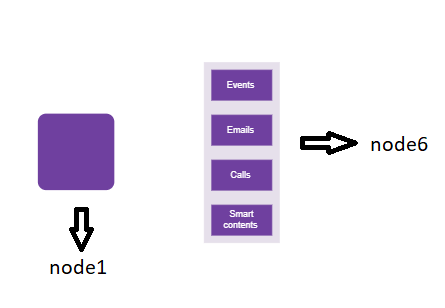
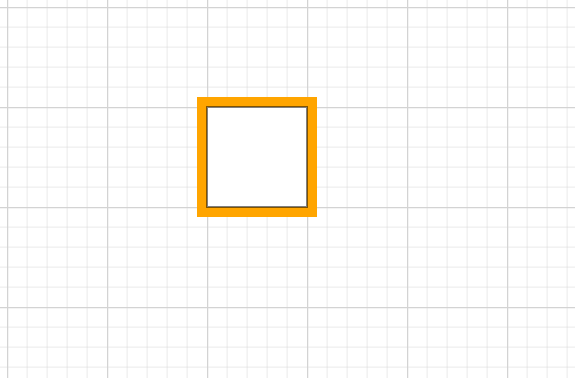
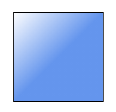
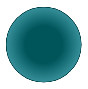

# Appearance of a Node in Blazor Diagram Component

The appearance of a node can be customized by changing its [Fill](https://help.syncfusion.com/cr/blazor/Syncfusion.Blazor.Diagram.ShapeStyle.html#Syncfusion_Blazor_Diagram_ShapeStyle_Fill), [StrokeDashArray](https://help.syncfusion.com/cr/blazor/Syncfusion.Blazor.Diagram.ShapeStyle.html#Syncfusion_Blazor_Diagram_ShapeStyle_StrokeDashArray), [StrokeColor](https://help.syncfusion.com/cr/blazor/Syncfusion.Blazor.Diagram.ShapeStyle.html#Syncfusion_Blazor_Diagram_ShapeStyle_StrokeColor), [StrokeWidth](https://help.syncfusion.com/cr/blazor/Syncfusion.Blazor.Diagram.ShapeStyle.html#Syncfusion_Blazor_Diagram_ShapeStyle_StrokeWidth), and [Shadow](https://help.syncfusion.com/cr/blazor/Syncfusion.Blazor.Diagram.Shadow.html) properties. The [IsVisible](https://help.syncfusion.com/cr/blazor/Syncfusion.Blazor.Diagram.NodeBase.html#Syncfusion_Blazor_Diagram_NodeBase_IsVisible) property of the node indicates whether the node is visible or not.

To learn more about customization of nodes, refer to the below video link,



The following code shows how to customize the appearance of the shape.

```cshtml
@using Syncfusion.Blazor.Diagram

<SfDiagramComponent Height="600px" Nodes="@nodes" />

@code
{
    //Define diagram's nodes collection
    DiagramObjectCollection<Node> nodes;

    protected override void OnInitialized()
    {
        nodes = new DiagramObjectCollection<Node>();
        // A node is created and stored in nodes array.
        Node node = new Node()
            {
                // Position of the node
                OffsetX = 250,
                OffsetY = 250,
                // Size of the node
                Width = 100,
                Height = 100,
                //Sets the style for the node
                Style = new ShapeStyle() { Fill = "Green", StrokeDashArray = "5,5", StrokeColor = "red", StrokeWidth = 2 },
            };
        // Add node
        nodes.Add(node);
    }
}
```
You can download a complete working sample from [GitHub](https://github.com/SyncfusionExamples/Blazor-Diagram-Examples/tree/master/UG-Samples/Nodes/Appearance/NodeAppearance)



N> [ID](https://help.syncfusion.com/cr/blazor/Syncfusion.Blazor.Diagram.NodeBase.html#Syncfusion_Blazor_Diagram_NodeBase_ID) for each node should be unique and so it is further used to find the node at runtime and do any customization.

## How to Update Common Node Properties Using the NodeCreating Event

Default values for all the Nodes can be set using the [NodeCreating](https://help.syncfusion.com/cr/blazor/Syncfusion.Blazor.Diagram.SfDiagramComponent.html#Syncfusion_Blazor_Diagram_SfDiagramComponent_NodeCreating) method. For example, if all nodes have the same type or property then such properties can be moved into NodeCreating method.

The following code shows how to customize the appearance of the shape.

```cshtml
@using Syncfusion.Blazor.Diagram

<SfDiagramComponent Height="600px" Nodes="@nodes" NodeCreating="@NodeCreating" />

@code
{
    //Reference the diagram
    SfDiagramComponent diagram;
    //Define diagram's nodes collection
    DiagramObjectCollection<Node> nodes;

    protected override void OnInitialized()
    {
        nodes = new DiagramObjectCollection<Node>();
        // A node is created and stored in nodes array.
        Node node1 = new Node()
            {
                // Position of the node
                OffsetX = 250,
                OffsetY = 250,
                // Shape of the Node
                Shape = new BasicShape() { Type = NodeShapes.Basic, Shape = NodeBasicShapes.Rectangle }
            };
        Node node2 = new Node()
            {
                // Position of the node
                OffsetX = 100,
                OffsetY = 100,
                // Shape of the Node
                Shape = new BasicShape() { Type = NodeShapes.Basic, Shape = NodeBasicShapes.Ellipse }
            };
        nodes.Add(node1);
        nodes.Add(node2);
    }
    //Method to define nodecreating event
    private void NodeCreating(IDiagramObject obj)
    {
        Node node = obj as Node;
        node.Style = new ShapeStyle() { Fill = "#6495ED" };
        // Size of the node
        node.Width = 100;
        node.Height = 100;
    }
}
```
You can download a complete working sample from [GitHub](https://github.com/SyncfusionExamples/Blazor-Diagram-Examples/tree/master/UG-Samples/Nodes/Appearance/NodeDefaultSample)

## How to Update Node Templates 

You can define node style using template in [NodeTemplate](https://help.syncfusion.com/cr/blazor/Syncfusion.Blazor.Diagram.DiagramTemplates.html#Syncfusion_Blazor_Diagram_DiagramTemplates_NodeTemplate) at tag level. If you want to define separate template for each node, differentiate the nodes by the ID property. The following code explains how to define template for a node.

```cshtml
@using Syncfusion.Blazor.Diagram

<SfDiagramComponent @ref="diagram" Width="1200px" Height="1000px" Nodes="@nodes">
    <DiagramTemplates>
        <NodeTemplate>
            @{
                <style>
                    th {
                        border: 5px solid #c1dad7
                    }

                    td {
                        border: 5px solid #c1dad7
                    }

                    .c1 {
                        background: transparent
                    }

                    .c2 {
                        background: transparent
                    }

                    .c3 {
                        background: transparent
                    }

                    .c4 {
                        background: transparent
                    }
                </style>
                <div id="node0_content_html_element" class="foreign-object" style="height: 164px; width: 137px; left: 0px; top: 0px; position: absolute; transform: scale(1, 1) rotate(0deg); pointer-events: all; visibility: visible; opacity: 1;">
                    <div style="height: 100%; width: 100%;">
                        <table style="width:100%;">
                            <tbody>
                                <tr><th class="c1">ID</th><th class="c2">Offset</th></tr>
                                <tr><td class="c1">node0</td><td class="c2">100</td></tr>
                            </tbody>
                        </table>
                        <input type="button" value="Button2" @onclick="@OnClick" />
                    </div>
                </div>
            }
        </NodeTemplate>
    </DiagramTemplates>
</SfDiagramComponent>

@code
{
    SfDiagramComponent diagram;
    DiagramObjectCollection<Node> nodes;

    protected override void OnInitialized()
    {
        nodes = new DiagramObjectCollection<Node>();
        Node node = new Node()
        {
            Width = 137,
            Height = 64,
            OffsetX = 300,
            OffsetY = 100,
            ID = "html1",
            Shape = new Shape() { Type = NodeShapes.HTML },
        };
        nodes.Add(node);
    }

    public void OnClick()
    {
        nodes[0].BackgroundColor = "cornflowerblue";
        StateHasChanged();
    }
}
```
You can download a complete working sample from [GitHub](https://github.com/SyncfusionExamples/Blazor-Diagram-Examples/tree/master/UG-Samples/Nodes/Appearance/NodeTemplate)

N> In the above example, node's background color is updated using the click event of the button defined in the template.



## How to Update Common Node Styles

The [SetNodeTemplate](https://help.syncfusion.com/cr/blazor/Syncfusion.Blazor.Diagram.SfDiagramComponent.html#Syncfusion_Blazor_Diagram_SfDiagramComponent_SetNodeTemplate) method of diagram allows you to define the style for the Node. The following code demonstrates how to set different styles for different nodes through the SetNodeTemplate method.

```cshtml
@using Syncfusion.Blazor.Diagram
@using System.Collections.ObjectModel

@* Initialize Diagram *@
<SfDiagramComponent Height="600px" Nodes="@nodes" SetNodeTemplate="@SetNodeTemplate" />

@code
{
    // Initialize node collection with node.
    DiagramObjectCollection<Node> nodes;

    protected override void OnInitialized()
    {
        nodes = new DiagramObjectCollection<Node>();
        Node node1 = new Node()
        {
            ID = "node1",
            // Size of the node.
            Height = 100,
            Width = 100,
            // Position of the node.
            OffsetX = 100,
            OffsetY = 100,
        };
        Node node2 = new Node()
        {
            ID = "node6",
            // Size of the node.
            Height = 510,
            Width = 202,
            // Position of the node.
            OffsetX = 300,
            OffsetY = 100,
        };
        nodes.Add(node1);
        nodes.Add(node2);
    }

    private CommonElement SetNodeTemplate(IDiagramObject node)
    {
        if ((node as Node).ID == "node6")
        {
            StackPanel table = new StackPanel();
            table.Style = new ShapeStyle() { Fill = "#e6e0eb", StrokeColor = "#e6e0eb" };
            table.Orientation = Orientation.Horizontal;
            StackPanel column1 = new StackPanel();
            column1.Style = new ShapeStyle() { Fill = "#6F409F", StrokeColor = "#6F409F" };
            column1.Margin = new DiagramThickness() { Bottom = 10, Left = 10, Right = 10, Top = 10 };
            column1.Padding = new DiagramThickness() { Bottom = 10, Left = 10, Right = 10, Top = 10 };
            column1.Children = new ObservableCollection<CommonElement>();
            column1.Children.Add(getTextElement("Events"));

            StackPanel column2 = new StackPanel();
            column2.Margin = new DiagramThickness() { Bottom = 10, Left = 10, Right = 10, Top = 10 };
            column2.Padding = new DiagramThickness() { Bottom = 10, Left = 10, Right = 10, Top = 10 };
            column2.Children = new ObservableCollection<CommonElement>();
            column2.Children.Add(getTextElement("Emails"));
            column2.Style = new ShapeStyle() { Fill = "#6F409F", StrokeColor = "#6F409F" };

            StackPanel column3 = new StackPanel();
            column3.Margin = new DiagramThickness() { Bottom = 10, Left = 10, Right = 10, Top = 10 };
            column3.Padding = new DiagramThickness() { Bottom = 10, Left = 10, Right = 10, Top = 10 };
            column3.Children = new ObservableCollection<CommonElement>();
            column3.Children.Add(getTextElement("Calls"));
            column3.Style = new ShapeStyle() { Fill = "#6F409F", StrokeColor = "#6F409F" };

            StackPanel column4 = new StackPanel();
            column4.Margin = new DiagramThickness() { Bottom = 10, Left = 10, Right = 10, Top = 10 };
            column4.Padding = new DiagramThickness() { Bottom = 10, Left = 10, Right = 10, Top = 10 };
            column4.Children = new ObservableCollection<CommonElement>();
            column4.Children.Add(getTextElement("Smart contents"));
            column4.Style = new ShapeStyle() { Fill = "#6F409F", StrokeColor = "#6F409F" };

            table.Orientation = Orientation.Vertical;
            table.Children = new ObservableCollection<CommonElement>() { column1, column2, column3, column4 };
            return table;
        }
        else
        {
            (node as Node).Style = new ShapeStyle() 
            { 
                Fill = "#6F409F", 
                StrokeColor = "#6F409F", 
                StrokeWidth = 2 
            };
            (node as Node).Shape = new BasicShape() 
            { 
                Type = NodeShapes.Basic, 
                Shape = NodeBasicShapes.Rectangle, 
                CornerRadius = 10 
            };
        }
        return null;
    }

    private TextElement getTextElement(string text)
    {
        TextElement textElement = new TextElement();
        textElement.Width = 60;
        textElement.Height = 20;
        textElement.Content = text;
        textElement.Style = new TextStyle() { Color = "white" };
        return textElement;
    }
}
```
You can download a complete working sample from [GitHub](https://github.com/SyncfusionExamples/Blazor-Diagram-Examples/tree/master/UG-Samples/Nodes/Appearance/SetTemplate)



## How to change the border color of a node

The diagram provides support to customize the border color of a node using the [BorderColor](https://help.syncfusion.com/cr/blazor/Syncfusion.Blazor.Diagram.Node.html#Syncfusion_Blazor_Diagram_Node_BorderColor) property. By default, the border color of a node is black.

```cshtml
@using Syncfusion.Blazor.Diagram
<SfDiagramComponent Height="600px" Nodes="@nodes" />
@code
{
    // Define diagram's nodes collection
    DiagramObjectCollection<Node> nodes;
    protected override void OnInitialized()
    {
        nodes = new DiagramObjectCollection<Node>();
        // A node is created and stored in nodes array.
        Node node = new Node()
        {
            ID = "node1",
            // Position of the node
            OffsetX = 100,
            OffsetY = 100,
            // Size of the node
            Width = 100,
            Height = 100,
            // Sets the border color of the node
            BorderColor = "Orange",
            // Sets the border width for better visibility
            BorderWidth = 20
        };
        nodes.Add(node);
    }
}
```
You can download a complete working sample from [GitHub](hhttps://github.com/SyncfusionExamples/Blazor-Diagram-Examples/tree/master/UG-Samples/Nodes/Appearance/BorderColor)



## How to change the border width of a node

The diagram allows you to customize the border width of a node using the [BorderWidth](https://help.syncfusion.com/cr/blazor/Syncfusion.Blazor.Diagram.Node.html#Syncfusion_Blazor_Diagram_Node_BorderWidth) property. By default, the border width is set to 1px. You can modify this value to increase or decrease the thickness of the node's border as needed.

```cshtml
@using Syncfusion.Blazor.Diagram
<SfDiagramComponent Height="600px" Nodes="@nodes" />
@code
{
    // Define diagram's nodes collection
    DiagramObjectCollection<Node> nodes;
    protected override void OnInitialized()
    {
        nodes = new DiagramObjectCollection<Node>();
        // A node is created and stored in nodes array.
        Node node = new Node()
        {
            ID = "node1",
            // Position of the node
            OffsetX = 100,
            OffsetY = 100,
            // Size of the node
            Width = 100,
            Height = 100,
            // Sets the border color of the node
            BorderColor = "red",
            // Sets the border width for better visibility
            BorderWidth = 20
        };
        nodes.Add(node);
    }
}
```
You can download a complete working sample from [GitHub](https://github.com/SyncfusionExamples/Blazor-Diagram-Examples/tree/master/UG-Samples/Nodes/Appearance/BorderWidth)

## How to Update Node Shadow

Diagram provides support to add [Shadow](https://help.syncfusion.com/cr/blazor/Syncfusion.Blazor.Diagram.Shadow.html) effect to a node that is disabled, by default. It can be enabled with the constraints property of the node. The following code shows how to draw shadow.

```cshtml
@using Syncfusion.Blazor.Diagram

<SfDiagramComponent Height="600px" Nodes="@nodes" />

@code
{
    //Define diagram's nodes collection
    DiagramObjectCollection<Node> nodes;

    protected override void OnInitialized()
    {
        nodes = new DiagramObjectCollection<Node>();
        // A node is created and stored in nodes array.
        Node node = new Node()
            {
                // Position of the node
                OffsetX = 250,
                OffsetY = 250,
                // Size of the node
                Width = 100,
                Height = 100,
                Style = new ShapeStyle() { Fill = "#6495ED", StrokeColor = "white" },
                Constraints = NodeConstraints.Default | NodeConstraints.Shadow,
                Shadow = new Shadow()
                {
                    Angle = 50,
                    Color = "gray",
                    Opacity = 0.8,
                    Distance = 10
                }
            };
        nodes.Add(node);
    }
}
```
You can download a complete working sample from [GitHub](https://github.com/SyncfusionExamples/Blazor-Diagram-Examples/tree/master/UG-Samples/Nodes/Appearance/NodeShadow)


### How to Customize Node Shadow

The [Angle](https://help.syncfusion.com/cr/blazor/Syncfusion.Blazor.Diagram.Shadow.html#Syncfusion_Blazor_Diagram_Shadow_Angle), [Distance](https://help.syncfusion.com/cr/blazor/Syncfusion.Blazor.Diagram.Shadow.html#Syncfusion_Blazor_Diagram_Shadow_Distance), and [Opacity](https://help.syncfusion.com/cr/blazor/Syncfusion.Blazor.Diagram.Shadow.html#Syncfusion_Blazor_Diagram_Shadow_Opacity) of the shadow can be customized with the shadow property of the node. The following code example illustrates how to customize shadow.

```cshtml
@using Syncfusion.Blazor.Diagram

<SfDiagramComponent Height="600px" Nodes="@nodes" />

@code
{
    DiagramObjectCollection<Node> nodes;

    protected override void OnInitialized()
    {
        nodes = new DiagramObjectCollection<Node>();
        // A node is created and stored in nodes array.
        Node node = new Node()
        {
            // Position of the node.
            OffsetX = 250,
            OffsetY = 250,
            // Size of the node.
            Width = 100,
            Height = 100,
            Style = new ShapeStyle() 
            { 
                Fill = "#6495ED", 
                StrokeColor = "white" 
            },
            Constraints = NodeConstraints.Default | NodeConstraints.Shadow,
            // Custom Shadow of the node.
            Shadow = new Shadow()
            {
                Angle = 50,
                Color = "Blue",
                Opacity = 0.8,
                Distance = 20
            }
        };
        nodes.Add(node);
    }
}
```
You can download a complete working sample from [GitHub](https://github.com/SyncfusionExamples/Blazor-Diagram-Examples/tree/master/UG-Samples/Nodes/Appearance/CustomShadow)


## How to Apply Gradient Style

The [Gradient](https://help.syncfusion.com/cr/blazor/Syncfusion.Blazor.Diagram.ShapeStyle.html#Syncfusion_Blazor_Diagram_ShapeStyle_Gradient) property of the node allows you to define and apply the gradient effect to the node. The gradient stops property defines the color and a position, where the previous color transition ends and a new color transition starts. The gradient stop’s opacity property defines the transparency level of the region.

There are two types of gradients as follows:

* LinearGradientBrush

* RadialGradientBrush

### How to Apply Linear Gradient Brush

[LinearGradientBrush](https://help.syncfusion.com/cr/blazor/Syncfusion.Blazor.Diagram.LinearGradientBrush.html) defines a smooth transition between a set of colors (so-called stops) in a line. A linear gradient’s X1, Y1, X2, Y2 properties are used to define the position (relative to the node) of the rectangular region that needs to be painted.

```cshtml
@using Syncfusion.Blazor.Diagram

<SfDiagramComponent Height="600px" Nodes="@nodes" />

@code
{
    DiagramObjectCollection<Node> nodes;

    protected override void OnInitialized()
    {
        nodes = new DiagramObjectCollection<Node>();
        // A node is created and stored in nodes array.
        Node node = new Node()
        {
            // Position of the node.
            OffsetX = 250,
            OffsetY = 250,
            // Size of the node.
            Width = 100,
            Height = 100,
            Style = new ShapeStyle()
            {
                Gradient = new LinearGradientBrush()
                {
                    // Start point of linear gradient.
                    X1 = 0,
                    Y1 = 0,
                    // End point of linear gradient.
                    X2 = 50,
                    Y2 = 50,
                    //Sets an array of stop objects
                    GradientStops = new DiagramObjectCollection<GradientStop>()
                    {
                        new GradientStop(){ Color = "white", Offset = 0},
                        new GradientStop(){ Color = "#6495ED", Offset = 100}
                    },                    
                }
            },
        };
        nodes.Add(node);
    }
}
```
You can download a complete working sample from [GitHub](https://github.com/SyncfusionExamples/Blazor-Diagram-Examples/tree/master/UG-Samples/Nodes/Appearance/LinearGradientStyle)



### How to Apply Radial Gradient Brush

[RadialGradientBrush](https://help.syncfusion.com/cr/blazor/Syncfusion.Blazor.Diagram.RadialGradientBrush.html) defines a smooth transition between stops on a circle. The radial gradient brush properties are used to define the position (relative to the node) of the outermost or the innermost circle of the radial gradient.

```cshtml
@using Syncfusion.Blazor.Diagram

<SfDiagramComponent Height="600px" Nodes="@nodes" />

@code
{
    DiagramObjectCollection<Node> nodes;

    protected override void OnInitialized()
    {
        nodes = new DiagramObjectCollection<Node>();
        Node node = new Node()
        {
            // Position of the node.
            OffsetX = 250,
            OffsetY = 250,
            // Size of the node.
            Width = 100,
            Height = 100,
            Shape = new BasicShape() 
            { 
                Type = NodeShapes.Basic, 
                Shape = NodeBasicShapes.Ellipse 
            },
            Style = new ShapeStyle()
            {
                Fill = "37909A#",
                StrokeColor = "#024249",
                Gradient = new RadialGradientBrush()
                {
                    // Center point of outer circle.
                    CX = 50,
                    CY = 50,
                    // Center point of inner circle.
                    FX = 50,
                    FY = 50,
                    GradientStops = new DiagramObjectCollection<GradientStop>()
                    {
                        new GradientStop() { Color = "#00555b", Offset = 45 },
                        new GradientStop() { Color= "#37909A", Offset= 90 }
                    },                    
                }
            },
        };
        // Add node.
        nodes.Add(node);
    }
}
```
You can download a complete working sample from [GitHub](https://github.com/SyncfusionExamples/Blazor-Diagram-Examples/tree/master/UG-Samples/Nodes/Appearance/RadientGradientStyle)



## How to Add Additional Information for a Node

The [AdditionalInfo](https://help.syncfusion.com/cr/blazor/Syncfusion.Blazor.Diagram.NodeBase.html#Syncfusion_Blazor_Diagram_NodeBase_AdditionalInfo) property of the node allows you to maintain additional information to the node.

The following code shows how to set the AdditionalInfo value.

```cshtml
@using Syncfusion.Blazor.Diagram

<SfDiagramComponent Height="600px" Nodes="@nodes" />

@code
{
    DiagramObjectCollection<Node> nodes;

    protected override void OnInitialized()
    {
        nodes = new DiagramObjectCollection<Node>();
        Dictionary<string, object> NodeInfo = new Dictionary<string, object>();
        NodeInfo.Add("nodeInfo", "Central Node");
        // A node is created and stored in nodes collection.
        Node node = new Node()
        {
            // Position of the node.
            OffsetX = 250,
            OffsetY = 250,
            // Size of the node.
            Width = 100,
            Height = 100,
            Style = new ShapeStyle() 
            { 
                Fill = "#6BA5D7", 
                StrokeColor = "white"
            },
            AdditionalInfo = NodeInfo
        };
        // Add node.
        nodes.Add(node);
    }
}
```
You can download a complete working sample from [GitHub](https://github.com/SyncfusionExamples/Blazor-Diagram-Examples/tree/master/UG-Samples/Nodes/Appearance/CustomProperty)

**Note:** You can set any type of value for the AdditionalInfo property.

## How to Set ZIndex Property for a Node

* The node's [ZIndex](https://help.syncfusion.com/cr/blazor/Syncfusion.Blazor.Diagram.NodeBase.html#Syncfusion_Blazor_Diagram_NodeBase_ZIndex) property specifies the stack order of the node. A node with a greater stack order is always in front of a node with a lower stack order. By default, the value is -1.


The following code illustrates how to render nodes based on the stack order.

```cshtml
@using Syncfusion.Blazor.Diagram
@using System.Collections.ObjectModel

<SfDiagramComponent Height="600px" @ref="@diagram" Nodes="@nodes" />

@code
{
    SfDiagramComponent diagram;
    DiagramObjectCollection<Node> nodes;

    protected override void OnInitialized()
    {
        nodes = new DiagramObjectCollection<Node>();
        // nodes are created and stored in nodes array.
        Node node1 = new Node()
            {
                ID = "node1",
                // Position of the node.
                OffsetX = 250,
                OffsetY = 250,
                // Size of the node.
                Width = 100,
                Height = 100,
                ZIndex = 2,
                Style = new ShapeStyle()
                {
                    Fill = "#6495ED",
                    StrokeColor = "white"
                },
            };
        nodes.Add(node1);

        Node node2 = new Node()
            {
                ID = "node2",
                // Position of the node.
                OffsetX = 300,
                OffsetY = 300,
                // Size of the node.
                Width = 100,
                Height = 100,
                ZIndex = 1,
                Style = new ShapeStyle()
                {
                    Fill = "#6495ED",
                    StrokeColor = "white"
                },
            };
        nodes.Add(node2);
    }
}
```
You can download a complete working sample from [GitHub](https://github.com/SyncfusionExamples/Blazor-Diagram-Examples/tree/master/UG-Samples/Nodes/Appearance/ZIndexProperty)

## How to Set Pivot Property for a Node

*  Node rotation angle will be based on [Pivot](https://help.syncfusion.com/cr/blazor/Syncfusion.Blazor.Diagram.Node.html#Syncfusion_Blazor_Diagram_Node_Pivot) values which range from 0 to 1 like offset values. By default, the Pivot values are set to X= 0.5 and Y=0.5.


The following code illustrates how to set the Pivot value.

```cshtml
@using Syncfusion.Blazor.Diagram
@using System.Collections.ObjectModel

<SfDiagramComponent Height="600px" @ref="@diagram" Nodes="@nodes" />

@code
{
    SfDiagramComponent diagram;
    DiagramObjectCollection<Node> nodes;

    protected override void OnInitialized()
    {
        nodes = new DiagramObjectCollection<Node>();
        // A node is created and stored in nodes array.
        Node node = new Node()
            {
                ID = "node",
                // Position of the node.
                OffsetX = 250,
                OffsetY = 250,
                // Size of the node.
                Width = 100,
                Height = 100,
                ZIndex = 2,
                Style = new ShapeStyle()
                {
                    Fill = "#6495ED",
                    StrokeColor = "white"
                },
                // Pivot of the node.
                Pivot = new DiagramPoint() { X = 0, Y = 0 }
            };
        nodes.Add(node);
    }
}
```
You can download a complete working sample from [GitHub](https://github.com/SyncfusionExamples/Blazor-Diagram-Examples/tree/master/UG-Samples/Nodes/Appearance/PivotProperty)

## How to Set Background Color for a Node

* The node's [BackgroundColor](https://help.syncfusion.com/cr/blazor/Syncfusion.Blazor.Diagram.Node.html#Syncfusion_Blazor_Diagram_Node_BackgroundColor) property is used to set the background color for node. By default, it is transparent.


The following code illustrates how to set the background color for the node.

```cshtml
@using Syncfusion.Blazor.Diagram
@using System.Collections.ObjectModel

<SfDiagramComponent Height="600px" @ref="@diagram" Nodes="@nodes" />

@code
{
    SfDiagramComponent diagram;
    DiagramObjectCollection<Node> nodes;

    protected override void OnInitialized()
    {
        nodes = new DiagramObjectCollection<Node>();
        // A node is created and stored in nodes array.
        Node node = new Node()
            {
                ID = "node",
                // Position of the node.
                OffsetX = 250,
                OffsetY = 250,
                // Size of the node.
                Width = 100,
                Height = 100,
                BackgroundColor = "red",
                Shape = new BasicShape(){Shape = NodeBasicShapes.Star}
            };
        nodes.Add(node);
    }
}
```
You can download a complete working sample from [GitHub](https://github.com/SyncfusionExamples/Blazor-Diagram-Examples/tree/master/UG-Samples/Nodes/Appearance/BackgroundColor)

## How to Check if a Node Is Automatically Positioned

* The node's [CanAutoLayout](https://help.syncfusion.com/cr/blazor/Syncfusion.Blazor.Diagram.NodeBase.html#Syncfusion_Blazor_Diagram_NodeBase_CanAutoLayout) value indicates whether the node should be automatically positioned or not. Applicable if the layout option is enabled.


The following code illustrates how to set the can auto layout property for the node.

```cshtml
@using Syncfusion.Blazor.Diagram

<SfDiagramComponent Height="600px"  Nodes="@nodes" Connectors="@connectors" NodeCreating="@OnNodeCreating" ConnectorCreating="@OnConnectorCreating">
    <Layout Type="LayoutType.HierarchicalTree" @bind-HorizontalSpacing="@HorizontalSpacing" @bind-VerticalSpacing="@VerticalSpacing">
    </Layout>
    <SnapSettings>
        <HorizontalGridLines LineColor="white" LineDashArray="2,2">
        </HorizontalGridLines>
        <VerticalGridLines LineColor="white" LineDashArray="2,2">
        </VerticalGridLines>
    </SnapSettings>
</SfDiagramComponent>

@code 
{
    int left = 40;
    int top = 50;
    DiagramObjectCollection<Node> nodes = new DiagramObjectCollection<Node>();
    DiagramObjectCollection<Connector> connectors = new DiagramObjectCollection<Connector>();
    int HorizontalSpacing = 40;
    int VerticalSpacing = 40;

    private void OnNodeCreating(IDiagramObject obj)
    {
        Node node = obj as Node;
        node.Height = 40;
        node.Width = 100;
        //Initialize the default node's shape style.
        node.Style = new ShapeStyle() { Fill = "darkcyan", StrokeWidth = 3, StrokeColor = "Black" };
        node.Annotations = new DiagramObjectCollection<ShapeAnnotation>()
        {
            new ShapeAnnotation 
            { 
                Content = node.Annotations[0].Content,
                Style = new TextStyle() { Color = "white", Bold = true }, 
            }
        };
    }
    private void OnConnectorCreating(IDiagramObject connector)
    {
        (connector as Connector).Type = ConnectorSegmentType.Orthogonal;
    }

    protected override void OnInitialized()
    {
        //Initialize the node and connectors.
        nodes = new DiagramObjectCollection<Node>()
        {
            new Node() { ID="node1", CanAutoLayout = true, Annotations = new DiagramObjectCollection<ShapeAnnotation>() { new ShapeAnnotation{Content="Steve-Ceo"} } },
            new Node() { ID="node2", CanAutoLayout = true, Annotations = new DiagramObjectCollection<ShapeAnnotation>() { new ShapeAnnotation{Content="Kevin-Manager"} } },
            new Node() { ID="node3", CanAutoLayout = true, Annotations = new DiagramObjectCollection<ShapeAnnotation>() { new ShapeAnnotation{Content="Peter-Manager"} } },
            new Node() { ID="node4", CanAutoLayout = true, Annotations = new DiagramObjectCollection<ShapeAnnotation>() { new ShapeAnnotation{Content="Jim-CSE"} } },
            new Node() { ID="node5", CanAutoLayout = true, Annotations = new DiagramObjectCollection<ShapeAnnotation>() { new ShapeAnnotation{Content="Martin-CSE"} } },
            new Node() { ID="node6", CanAutoLayout = true, Annotations = new DiagramObjectCollection<ShapeAnnotation>() { new ShapeAnnotation{Content="John-Manager"} } },
            new Node() { ID="node7", CanAutoLayout = false, Annotations = new DiagramObjectCollection<ShapeAnnotation>() { new ShapeAnnotation{Content="Mary-CSE"} } },
        };
        connectors = new DiagramObjectCollection<Connector>()
        {
            new Connector() { ID="connector1", SourceID="node1", TargetID="node2" },
            new Connector() { ID="connector2", SourceID="node1", TargetID="node3" },
            new Connector() { ID="connector3", SourceID="node2", TargetID="node4" },
            new Connector() { ID="connector4", SourceID="node2", TargetID="node5" },
            new Connector() { ID="connector5", SourceID="node3", TargetID="node6" },
            new Connector() { ID="connector6", SourceID="node3", TargetID="node7" },
        };
    }
}
```
You can download a complete working sample from [GitHub](https://github.com/SyncfusionExamples/Blazor-Diagram-Examples/tree/master/UG-Samples/Nodes/Appearance/CanAutoLayout)

### How to Get InEdges and OutEdges of a Node

[InEdges](https://help.syncfusion.com/cr/blazor/Syncfusion.Blazor.Diagram.Node.html#Syncfusion_Blazor_Diagram_Node_InEdges) is used to get the incoming connectors of the node. [OutEdges](https://help.syncfusion.com/cr/blazor/Syncfusion.Blazor.Diagram.Node.html#Syncfusion_Blazor_Diagram_Node_OutEdges) is used to get the outgoing connectors of the node.

```csharp
@using Syncfusion.Blazor.Diagram
@using Syncfusion.Blazor.Buttons

<SfButton Content="GetInEdges" OnClick="@GetInEdges" />
<SfDiagramComponent @ref="diagram" Height="600px" Nodes="@nodes" Connectors="@connectors" />

@code
{
    SfDiagramComponent diagram;
    DiagramObjectCollection<Node> nodes = new DiagramObjectCollection<Node>();
    DiagramObjectCollection<Connector> connectors = new DiagramObjectCollection<Connector>();

    protected override void OnInitialized()
    {
        Node node1 = new Node()
            {
                ID = "node1",
                Width = 100,
                Height = 100,
                OffsetX = 300,
                OffsetY = 300,

            };
        nodes.Add(node1);
        Node node2 = new Node()
            {
                ID = "node2",
                Width = 100,
                Height = 100,
                OffsetX = 300,
                OffsetY = 500,
            };
        nodes.Add(node2);
        Connector connector1 = new Connector()
            {
                ID = "connector1",
                SourceID = "node1",
                TargetID = "node2",
            };
        connectors.Add(connector1);
    }
    private void GetInEdges()
    {
        List<string> Inedges = new List<string>();
        foreach (string inedge in diagram.Nodes[1].InEdges)
        {
            Inedges.Add(inedge);
        }
    }
}
```
You can download a complete working sample from [GitHub](https://github.com/SyncfusionExamples/Blazor-Diagram-Examples/tree/master/UG-Samples/Nodes/Appearance/InedgesOutedges)

## How to Get Data Source Settings Details

* The node's [Data](https://help.syncfusion.com/cr/blazor/Syncfusion.Blazor.Diagram.Node.html#Syncfusion_Blazor_Diagram_Node_Data) property returns the record of the data source as data. Each record on the data source represents a node in an automatic layout.


The following code illustrates how to get data source settings details.

```cshtml
@using Syncfusion.Blazor.Diagram

<SfDiagramComponent Height="600px" Nodes="@nodes" Connectors="@connectors" NodeCreating="@OnNodeCreating" ConnectorCreating="@OnConnectorCreating">
  <DataSourceSettings ID="Id" ParentID="Manager" DataSource="DataSource"> </DataSourceSettings>
    <Layout Type="LayoutType.HierarchicalTree" HorizontalSpacing="@HorizontalSpacing" VerticalSpacing="@VerticalSpacing" >
    </Layout>
    <SnapSettings>
        <HorizontalGridLines LineColor="white" LineDashArray="2,2">
        </HorizontalGridLines>
        <VerticalGridLines LineColor="white" LineDashArray="2,2">
        </VerticalGridLines>
    </SnapSettings>
</SfDiagramComponent>

@code 
{
    int left = 40;
    int top = 50;
    DiagramObjectCollection<Node> nodes = new DiagramObjectCollection<Node>();
    DiagramObjectCollection<Connector> connectors = new DiagramObjectCollection<Connector>();
    int HorizontalSpacing = 40;
    int VerticalSpacing = 40;

    private void OnNodeCreating(IDiagramObject obj)
    {
        Node node = obj as Node;
        node.Height = 40;
        node.Width = 100;
        HierarchicalDetails Data = node.Data as HierarchicalDetails;
        node.Annotations = new DiagramObjectCollection<ShapeAnnotation>()
        {
            new ShapeAnnotation()
            {
                Content = Data.Role
            }
        };
        //Initializing the default node's shape style.
        node.Style = new ShapeStyle() { Fill = "darkcyan", StrokeWidth = 3, StrokeColor = "Black" };
    }

    private void OnConnectorCreating(IDiagramObject connector)
    {
        (connector as Connector).Type = ConnectorSegmentType.Orthogonal;
    }

    public class HierarchicalDetails
    {
        public string Id { get; set; }
        public string Role { get; set; }
        public string Manager { get; set; }
        public string ChartType { get; set; }
        public string Color { get; set; }
    }
    public List<HierarchicalDetails> DataSource = new List<HierarchicalDetails>()
    {
        new HierarchicalDetails()   { Id= "parent", Role= "Board", Color= "#71AF17" },
        new HierarchicalDetails()   { Id= "1", Role= "General Manager", Manager= "parent", ChartType= "right", Color= "#71AF17" },
        new HierarchicalDetails()   { Id= "11", Role= "Assistant Manager", Manager= "1", Color= "#71AF17" },
        new HierarchicalDetails()   { Id= "2", Role= "Human Resource Manager", Manager= "1", ChartType= "right", Color= "#1859B7" },
        new HierarchicalDetails()   { Id= "3", Role= "Trainers", Manager= "2", Color= "#2E95D8" },
        new HierarchicalDetails()   { Id= "4", Role= "Recruiting Team", Manager= "2", Color= "#2E95D8" },
        new HierarchicalDetails()   { Id= "5", Role= "Finance Asst. Manager", Manager= "2", Color= "#2E95D8" },
        new HierarchicalDetails()   { Id= "6", Role= "Design Manager", Manager= "1",ChartType= "right", Color= "#1859B7" },
        new HierarchicalDetails()   { Id= "7", Role= "Design Supervisor", Manager= "6", Color= "#2E95D8" },
        new HierarchicalDetails()   { Id= "8", Role= "Development Supervisor", Manager= "6", Color= "#2E95D8" },
        new HierarchicalDetails()   { Id= "9", Role= "Drafting Supervisor", Manager= "6", Color= "#2E95D8" },
        new HierarchicalDetails()   { Id= "10", Role= "Operation Manager", Manager= "1", ChartType= "right", Color= "#1859B7" },
        new HierarchicalDetails()   { Id= "11", Role= "Statistic Department", Manager= "10", Color= "#2E95D8" },
        new HierarchicalDetails()   { Id= "12", Role= "Logistic Department", Manager= "10", Color= "#2E95D8" },
        new HierarchicalDetails()   { Id= "16", Role= "Marketing Manager", Manager= "1", ChartType= "right", Color= "#1859B7" },
        new HierarchicalDetails()   { Id= "17", Role= "Oversea sales Manager", Manager= "16", Color= "#2E95D8" },
        new HierarchicalDetails()   { Id= "18", Role= "Petroleum Manager", Manager= "16", Color= "#2E95D8" },
        new HierarchicalDetails()   { Id= "20", Role= "Service Dept. Manager", Manager= "16", Color= "#2E95D8" },
        new HierarchicalDetails()   { Id= "21", Role= "Quality Department", Manager= "16", Color= "#2E95D8" }
    };
}
```
You can download a complete working sample from [GitHub](https://github.com/SyncfusionExamples/Blazor-Diagram-Examples/tree/master/UG-Samples/Nodes/Appearance/DataProperty)

## See also

* [How to get events when they interact with the node](./events)
