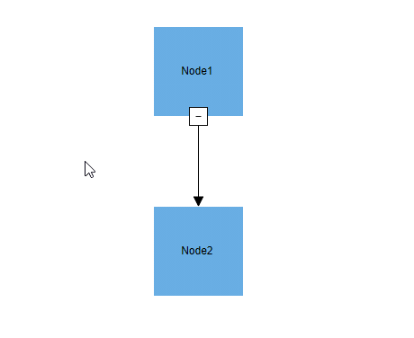
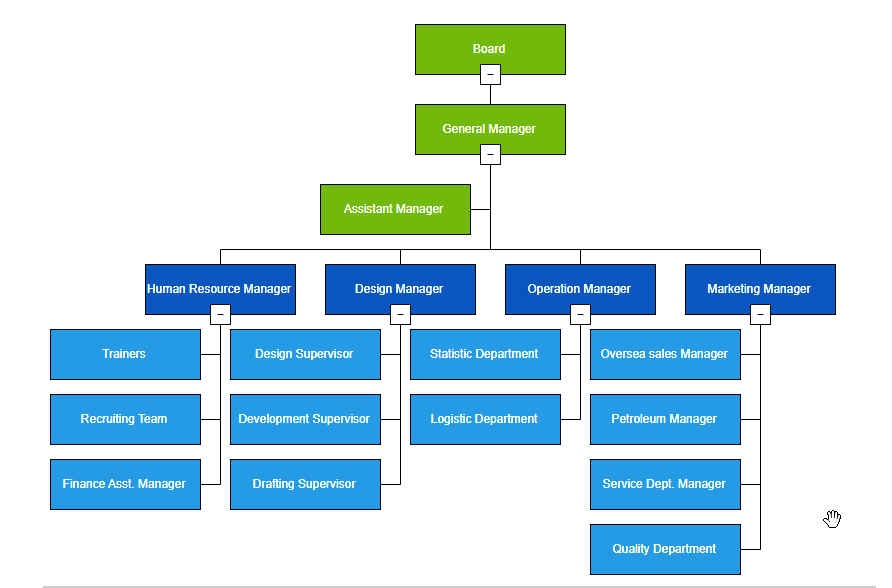
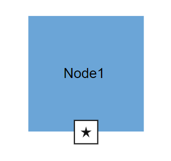
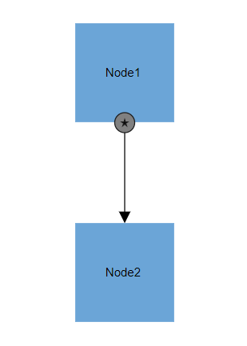
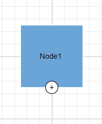
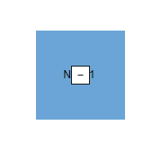
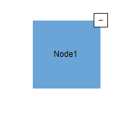
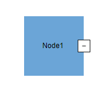
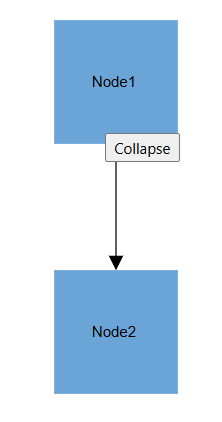

# Expand and Collapse Support for Nodes in Blazor Diagram Component

The Diagram component supports to describe the state of the node. i.e., whether the node is in an expanded or collapsed state. Use the IsExpanded property on a node to expand or collapse its children nodes. Expand and Collapse support is used to compress the hierarchy view so that only the roots of each elements are visible.

The following Node properties represent the state of the node and allows user to Expand and Collapse the desired Node :

* [ExpandIcon](https://help.syncfusion.com/cr/blazor/Syncfusion.Blazor.Diagram.Node.html#Syncfusion_Blazor_Diagram_Node_ExpandIcon)

* [CollapseIcon](https://help.syncfusion.com/cr/blazor/Syncfusion.Blazor.Diagram.Node.html#Syncfusion_Blazor_Diagram_Node_CollapseIcon)

The following code example illustrates how to create icons of various shapes on a simple node connection.

```csharp
@using Syncfusion.Blazor.Diagram

<SfDiagramComponent Height="600px" Nodes="@nodes" Connectors="@connectors" />

@code
{
    DiagramObjectCollection<Node> nodes= new DiagramObjectCollection<Node>();
    DiagramObjectCollection<Connector> connectors= new DiagramObjectCollection<Connector>();

    protected override void OnInitialized()
    {
        Node node1 = new Node()
        {
            ID = "node1",
            Width = 100,
            Height = 100,
            OffsetX = 300,
            OffsetY = 300,
            Style = new ShapeStyle()
            {
                Fill = "#6BA5D7",
                StrokeColor = "white"
            },
            Annotations = new DiagramObjectCollection<ShapeAnnotation>()
            {
                new ShapeAnnotation()
                {
                    Content="Node1"
                }
            },
            ExpandIcon = new DiagramExpandIcon()
            {
                Shape = DiagramExpandIcons.Minus,
                Height = 20,
                Width = 20,
            },
            CollapseIcon = new DiagramCollapseIcon()
            {
                Shape = DiagramCollapseIcons.Plus,
                Height = 20,
                Width = 20,
            },
        };
        nodes.Add(node1);
        Node node2 = new Node()
        {
            ID = "node2",
            Width = 100,
            Height = 100,
            OffsetX = 300,
            OffsetY = 500,
            Style = new ShapeStyle()
            {
                Fill = "#6BA5D7",
                StrokeColor = "white"
            },
             Annotations = new DiagramObjectCollection<ShapeAnnotation>()
            {
                new ShapeAnnotation()
                {
                    Content="Node2"
                }
            },
            ExpandIcon = new DiagramExpandIcon()
            {
                Shape = DiagramExpandIcons.Minus,
                Height = 20,
                Width = 20,
            },
            CollapseIcon = new DiagramCollapseIcon()
            {
                Shape = DiagramCollapseIcons.Plus,
                Height = 20,
                Width = 20,
            },
        };
        nodes.Add(node2);
        Connector connector1 = new Connector()
        {
            ID = "connector1",
            SourceID = "node1",
            TargetID = "node2",
        };
        connectors.Add(connector1);
    }
}
```
You can download a complete working sample from [GitHub](https://github.com/SyncfusionExamples/Blazor-Diagram-Examples/tree/master/UG-Samples/Nodes/ExpandAndCollapse/Icon)



The following code example illustrates how to create an icon of various shapes in a layout.
```csharp
@using Syncfusion.Blazor.Diagram
@using Syncfusion.Blazor.Diagram.Internal
@using System.Collections.ObjectModel

<SfDiagramComponent @ref="diagram" Width="1500px" Height="800px" NodeCreating="NodeCreating" ConnectorCreating="ConnectorCreating">
    <DataSourceSettings DataSource="DataSource" ID="Id" ParentID="Manager"></DataSourceSettings>
    <Layout @bind-Type="type" @bind-HorizontalSpacing="@HorizontalSpacing" @bind-FixedNode="@FixedNode" @bind-Orientation="@oreintation" @bind-VerticalSpacing="@VerticalSpacing" @bind-HorizontalAlignment="@horizontalAlignment" @bind-VerticalAlignment="@verticalAlignment" GetLayoutInfo="GetLayoutInfo">
        <LayoutMargin @bind-Top="@top" @bind-Bottom="@bottom" @bind-Right="@right" @bind-Left="@left"></LayoutMargin>
    </Layout>
    <SnapSettings Constraints="SnapConstraints.None"></SnapSettings>
</SfDiagramComponent>
@code {

    SfDiagramComponent diagram;
    double top = 50;
    double bottom = 50;
    double right = 50;
    double left = 50;
    LayoutType type = LayoutType.OrganizationalChart;
    LayoutOrientation oreintation = LayoutOrientation.TopToBottom;
    HorizontalAlignment horizontalAlignment = HorizontalAlignment.Auto;
    VerticalAlignment verticalAlignment = VerticalAlignment.Auto;
    int HorizontalSpacing = 30;
    int VerticalSpacing = 30;
    Orientation subTreeOrientation = Orientation.Vertical;
    SubTreeAlignmentType subTreeAlignment = SubTreeAlignmentType.Left;
    private string FixedNode = null;
    //private DiagramRect bounds = new Rect(200, 200, 500, 500);
    public class HierarchicalDetails
    {
        public string Id { get; set; }
        public string Role { get; set; }
        public string Manager { get; set; }
        public string ChartType { get; set; }
        public string Color { get; set; }
    }
    public List<HierarchicalDetails> DataSource = new List<HierarchicalDetails>()
    {
        new HierarchicalDetails()   { Id= "parent", Role= "Board", Color= "#71AF17" },
        new HierarchicalDetails()   { Id= "1", Role= "General Manager", Manager= "parent", ChartType= "right", Color= "#71AF17" },
        new HierarchicalDetails()   { Id= "11", Role= "Assistant Manager", Manager= "1", Color= "#71AF17" },
        new HierarchicalDetails()   { Id= "2", Role= "Human Resource Manager", Manager= "1", ChartType= "right", Color= "#1859B7" },
        new HierarchicalDetails()   { Id= "3", Role= "Trainers", Manager= "2", Color= "#2E95D8" },
        new HierarchicalDetails()   { Id= "4", Role= "Recruiting Team", Manager= "2", Color= "#2E95D8" },
        new HierarchicalDetails()   { Id= "5", Role= "Finance Asst. Manager", Manager= "2", Color= "#2E95D8" },
        new HierarchicalDetails()   { Id= "6", Role= "Design Manager", Manager= "1",ChartType= "right", Color= "#1859B7" },
        new HierarchicalDetails()   { Id= "7", Role= "Design Supervisor", Manager= "6", Color= "#2E95D8" },
        new HierarchicalDetails()   { Id= "8", Role= "Development Supervisor", Manager= "6", Color= "#2E95D8" },
        new HierarchicalDetails()   { Id= "9", Role= "Drafting Supervisor", Manager= "6", Color= "#2E95D8" },
        new HierarchicalDetails()   { Id= "10", Role= "Operation Manager", Manager= "1", ChartType= "right", Color= "#1859B7" },
        new HierarchicalDetails()   { Id= "11", Role= "Statistic Department", Manager= "10", Color= "#2E95D8" },
        new HierarchicalDetails()   { Id= "12", Role= "Logistic Department", Manager= "10", Color= "#2E95D8" },
        new HierarchicalDetails()   { Id= "16", Role= "Marketing Manager", Manager= "1", ChartType= "right", Color= "#1859B7" },
        new HierarchicalDetails()   { Id= "17", Role= "Oversea sales Manager", Manager= "16", Color= "#2E95D8" },
        new HierarchicalDetails()   { Id= "18", Role= "Petroleum Manager", Manager= "16", Color= "#2E95D8" },
        new HierarchicalDetails()   { Id= "20", Role= "Service Dept. Manager", Manager= "16", Color= "#2E95D8" },
        new HierarchicalDetails()   { Id= "21", Role= "Quality Department", Manager= "16", Color= "#2E95D8" }
    };
    private TreeInfo GetLayoutInfo(IDiagramObject obj, TreeInfo options)
    {
        if (rows == 0)
        {
            if (rows == 0 && options.Rows != null)
                options.Rows = null;
            Node node = obj as Node;
            if ((node.Data as HierarchicalDetails).Role == "General Manager")
            {
                if (options.Children.Count > 0)
                {
                    options.Assistants.Add(options.Children[0]);
                    options.Children.RemoveAt(0);
                }
            }
            if (!options.HasSubTree)
            {
                options.Orientation = subTreeOrientation;
                options.AlignmentType = subTreeAlignment;
            }
        }
        else
        {
            if (!options.HasSubTree)
            {
                options.AlignmentType = SubTreeAlignmentType.Balanced;
                options.Orientation = Orientation.Horizontal;
                options.Rows = rows;
            }
        }
        return options;
    }
    private int rows = 0;
    private void NodeCreating(IDiagramObject obj)
    {
        Node node = obj as Node;
        if (node.Data is System.Text.Json.JsonElement)
        {
            node.Data = System.Text.Json.JsonSerializer.Deserialize<HierarchicalDetails>(node.Data.ToString());
        }
        HierarchicalDetails hierarchicalData = node.Data as HierarchicalDetails;
        node.Width = 150;
        node.Height = 50;
        node.Style.Fill = hierarchicalData.Color;
        node.Annotations = new DiagramObjectCollection<ShapeAnnotation>()
        {
            new ShapeAnnotation()
            {
                Content = hierarchicalData.Role,
                Style =new TextStyle(){Color = "white"}
            }
        };
        node.ExpandIcon = new DiagramExpandIcon()
            {
                Shape = DiagramExpandIcons.Minus,
                Height = 20,
                Width = 20,
            };
        node.CollapseIcon = new DiagramCollapseIcon()
            {
                Shape = DiagramCollapseIcons.Plus,
                Height = 20,
                Width = 20,
            };
    }
    private void ConnectorCreating(IDiagramObject connector)
    {
        (connector as Connector).Type = ConnectorSegmentType.Orthogonal;
        (connector as Connector).TargetDecorator.Shape = DecoratorShape.None;
    }
}
```
A complete working sample can be downloaded from [GitHub](https://github.com/SyncfusionExamples/Blazor-Diagram-Examples/tree/master/UG-Samples/Nodes/ExpandAndCollapse/ExpandCollapsewithLayout)



## How to Customize Expand and Collapse Icon
Diagram allows customization of the node’s expand and collapse icons. For available properties, refer to [DiagramExpandIcon](https://help.syncfusion.com/cr/blazor/Syncfusion.Blazor.Diagram.DiagramExpandIcon.html) and [DiagramCollapseIcon](https://help.syncfusion.com/cr/blazor/Syncfusion.Blazor.Diagram.DiagramCollapseIcon.html).

### How to Update Expand and Collapse Icon Size
Change the icon size using the [Height](https://help.syncfusion.com/cr/blazor/Syncfusion.Blazor.Diagram.DiagramIcon.html#Syncfusion_Blazor_Diagram_DiagramIcon_Height) and [Width](https://help.syncfusion.com/cr/blazor/Syncfusion.Blazor.Diagram.DiagramIcon.html#Syncfusion_Blazor_Diagram_DiagramIcon_Width) properties.

### How to Customize Expand and Collapse Icon Shape

The shape of an [ExpandIcon](https://help.syncfusion.com/cr/blazor/Syncfusion.Blazor.Diagram.Node.html#Syncfusion_Blazor_Diagram_Node_ExpandIcon) and [CollapseIcon](https://help.syncfusion.com/cr/blazor/Syncfusion.Blazor.Diagram.Node.html#Syncfusion_Blazor_Diagram_Node_CollapseIcon) can be changed using the Shape property of [DiagramExpandIcon](https://help.syncfusion.com/cr/blazor/Syncfusion.Blazor.Diagram.DiagramExpandIcon.html) and [DiagramCollapseIcon](https://help.syncfusion.com/cr/blazor/Syncfusion.Blazor.Diagram.DiagramCollapseIcon.html) respectively. 
To explore the available expand icon shapes, refer to [DiagramExpandIcons](https://help.syncfusion.com/cr/blazor/Syncfusion.Blazor.Diagram.DiagramExpandIcons.html).
To explore the available collapse icon shapes, refer to [DiagramCollapseIcons](https://help.syncfusion.com/cr/blazor/Syncfusion.Blazor.Diagram.DiagramCollapseIcons.html).
If you need to render a custom shape, Set shape to [Path](https://help.syncfusion.com/cr/blazor/Syncfusion.Blazor.Diagram.DiagramExpandIcons.html#Syncfusion_Blazor_Diagram_DiagramExpandIcons_Path) and define the path using the [PathData](https://help.syncfusion.com/cr/blazor/Syncfusion.Blazor.Diagram.DiagramIcon.html#Syncfusion_Blazor_Diagram_DiagramIcon_PathData) property.

The following code explains how to initialize the icon with a path shape.

```csharp
@using Syncfusion.Blazor.Diagram

<SfDiagramComponent Height="600px" Nodes="@nodes" Connectors="@connectors" />

@code
{
    //Initialize the diagram's nodes collection
    DiagramObjectCollection<Node> nodes = new DiagramObjectCollection<Node>();
    //Initialize the diagram's connectors collection
    DiagramObjectCollection<Connector> connectors = new DiagramObjectCollection<Connector>();

    protected override void OnInitialized()
    {
        Node node1 = new Node()
        {
            ID = "node1",
            Width = 100,
            Height = 100,
            OffsetX = 300,
            OffsetY = 300,
            Style = new ShapeStyle()
            {
                Fill = "#6BA5D7",
                StrokeColor = "white"
            },
            Annotations = new DiagramObjectCollection<ShapeAnnotation>()
            {
                new ShapeAnnotation()
                {
                    Content="Node1"
                }
            },
            ExpandIcon = new DiagramExpandIcon()
            {
                Shape = DiagramExpandIcons.Path,
                Height = 20,
                Width = 20,
                PathData = "M540.3643,137.9336L546.7973,159.7016L570.3633,159.7296L550.7723,171.9366L558.9053,194.9966L540.3643,179.4996L521.8223,194.9966L529.9553,171.9366L510.3633,159.7296L533.9313,159.7016L540.3643,137.9336z"
            },
            CollapseIcon = new DiagramCollapseIcon()
            {
                Shape = DiagramCollapseIcons.Path,
                Height = 20,
                Width = 20,
                PathData = "M 355.31 12.07 C 352.11 5.95 345.35 -1.14 331.41 0.15 C 290.33 3.93 209.61 81.48 190.42 111.69 C 189.66 107.76 187.9 101.49 184.12 98.05 C 189.5 87.75 198.01 69.64 201.57 52.48 C 202.4 52.26 203.12 51.68 203.34 50.44 C 203.72 48.34 204 46.22 204.39 44.13 C 205.01 40.62 199.99 39.43 199.42 42.91 C 199.06 45.06 198.69 47.15 198.35 49.31 C 198.16 50.6 198.69 51.62 199.54 52.14 C 196.08 68.87 187.75 86.63 182.43 96.81 C 181.52 96.29 180.53 95.87 179.41 95.7 C 179.09 95.65 178.8 95.72 178.5 95.71 C 178.19 95.72 177.91 95.65 177.59 95.7 C 176.46 95.87 175.48 96.29 174.56 96.81 C 169.24 86.63 160.92 68.87 157.46 52.14 C 158.3 51.62 158.83 50.6 158.65 49.31 C 158.3 47.15 157.93 45.06 157.58 42.91 C 157.01 39.43 151.99 40.62 152.61 44.13 C 152.99 46.22 153.28 48.34 153.66 50.44 C 153.87 51.68 154.6 52.27 155.42 52.48 C 158.98 69.63 167.49 87.75 172.87 98.05 C 169.09 101.49 167.33 107.76 166.57 111.69 C 147.39 81.48 66.67 3.93 25.59 0.15 C 11.65 -1.14 4.89 5.95 1.69 12.07 C -2.05 19.07 0.84 33.48 6.24 58.46 C 8.66 69.55 11.16 80.96 12.94 92.2 C 13.89 98.36 14.79 104.49 15.64 110.36 C 19.39 136.89 22.52 158.97 32.64 166.04 C 35.41 167.98 38.65 168.78 42.61 168.24 C 52.26 165.95 63.79 164.03 75.99 162.67 C 64.03 171.47 49.08 185.81 44.17 204.84 C 40.38 219.72 43.37 234.86 53.01 250.05 C 64.37 267.81 76.02 279.48 86.91 287.09 C 108.68 302.31 127.52 301.24 135.48 300.78 C 136.3 300.77 136.94 300.71 137.56 300.69 C 143.62 300.61 147.76 291.39 156.6 270.51 C 160.94 260.34 167.39 245.19 172.83 237.47 C 173.97 240.31 177.22 242.31 178.92 242.87 C 178.78 242.94 178.62 243.07 178.49 243.12 C 178.65 243.08 178.83 242.97 179 242.91 C 179.1 242.94 179.25 243.02 179.34 243.04 C 179.26 243.01 179.13 242.93 179.04 242.89 C 180.83 242.24 183.05 240.25 184.16 237.48 C 189.6 245.19 196.05 260.34 200.39 270.52 C 209.23 291.4 213.38 300.61 219.43 300.7 C 220.05 300.72 220.69 300.77 221.51 300.78 C 229.47 301.25 248.31 302.31 270.08 287.1 C 280.97 279.49 292.62 267.81 303.98 250.05 C 313.62 234.86 316.6 219.72 312.82 204.84 C 307.91 185.82 292.96 171.48 281 162.67 C 293.2 164.03 304.73 165.95 314.38 168.24 C 318.34 168.78 321.58 167.98 324.35 166.04 C 334.47 158.97 337.6 136.89 341.35 110.37 C 342.19 104.49 343.1 98.37 344.05 92.2 C 345.83 80.96 348.33 69.55 350.75 58.46 C 356.16 33.48 359.05 19.07 355.31 12.07 z M 183.92 237.56 C 182.35 240.3 180.35 242.13 178.97 242.86 C 177.49 242.19 174.7 240.38 173.08 237.56 C 173.08 237.56 166.19 138.22 166.91 113.58 C 166.91 113.58 169.24 97.92 178.5 97.81 C 187.76 97.92 190.09 113.58 190.09 113.58 C 190.81 138.22 183.92 237.56 183.92 237.56 z"
            },
        };
        nodes.Add(node1);
        Node node2 = new Node()
        {
            ID = "node2",
            Width = 100,
            Height = 100,
            OffsetX = 300,
            OffsetY = 500,
            Style = new ShapeStyle()
            {
                Fill = "#6BA5D7",
                StrokeColor = "white"
            },
            Annotations = new DiagramObjectCollection<ShapeAnnotation>()
            {
                new ShapeAnnotation()
                {
                    Content="Node2"
                }
            },
        };
        nodes.Add(node2);
        Connector connector1 = new Connector()
            {
                ID = "connector1",
                SourceID = "node1",
                TargetID = "node2",
            };
        connectors.Add(connector1);
    }
}
```
A complete working sample can be downloaded from [GitHub](https://github.com/SyncfusionExamples/Blazor-Diagram-Examples/tree/master/UG-Samples/Nodes/ExpandAndCollapse/IconWithPathShape)



### How to Customize Expand and Collapse Icon Appearance 

Customize the icon appearance using [Fill](https://help.syncfusion.com/cr/blazor/Syncfusion.Blazor.Diagram.DiagramIcon.html#Syncfusion_Blazor_Diagram_DiagramIcon_Fill), [BorderColor](https://help.syncfusion.com/cr/blazor/Syncfusion.Blazor.Diagram.DiagramIcon.html#Syncfusion_Blazor_Diagram_DiagramIcon_BorderColor), [BorderWidth](https://help.syncfusion.com/cr/blazor/Syncfusion.Blazor.Diagram.DiagramIcon.html#Syncfusion_Blazor_Diagram_DiagramIcon_BorderWidth), and [CornerRadius](https://help.syncfusion.com/cr/blazor/Syncfusion.Blazor.Diagram.DiagramIcon.html#Syncfusion_Blazor_Diagram_DiagramIcon_CornerRadius) properties.

The following code explains how to change the appearance of the Icon using [Fill](https://help.syncfusion.com/cr/blazor/Syncfusion.Blazor.Diagram.DiagramIcon.html#Syncfusion_Blazor_Diagram_DiagramIcon_Fill), [BorderColor](https://help.syncfusion.com/cr/blazor/Syncfusion.Blazor.Diagram.DiagramIcon.html#Syncfusion_Blazor_Diagram_DiagramIcon_BorderColor), [BorderWidth](https://help.syncfusion.com/cr/blazor/Syncfusion.Blazor.Diagram.DiagramIcon.html#Syncfusion_Blazor_Diagram_DiagramIcon_BorderWidth) properties.

```csharp
@using Syncfusion.Blazor.Diagram

<SfDiagramComponent Height="600px" Nodes="@nodes" Connectors="@connectors" />

@code
{
    //Initialize the diagram's nodes collection
    DiagramObjectCollection<Node> nodes = new DiagramObjectCollection<Node>();
    //Initialize the diagram's connectors collection
    DiagramObjectCollection<Connector> connectors = new DiagramObjectCollection<Connector>();

    protected override void OnInitialized()
    {
        Node node1 = new Node()
        {
            ID = "node1",
            Width = 100,
            Height = 100,
            OffsetX = 300,
            OffsetY = 300,
            Style = new ShapeStyle()
            {
                Fill = "#6BA5D7",
                StrokeColor = "white"
            },
            Annotations = new DiagramObjectCollection<ShapeAnnotation>()
            {
                new ShapeAnnotation()
                {
                    Content="Node1"
                }
            },
            ExpandIcon = new DiagramExpandIcon()
            {
                Shape = DiagramExpandIcons.Path,
                Height = 20,
                Width = 20,
                PathData = "M540.3643,137.9336L546.7973,159.7016L570.3633,159.7296L550.7723,171.9366L558.9053,194.9966L540.3643,179.4996L521.8223,194.9966L529.9553,171.9366L510.3633,159.7296L533.9313,159.7016L540.3643,137.9336z",
                CornerRadius = 10,
                Fill = "Gray",             
            },
            CollapseIcon = new DiagramCollapseIcon()
            {
                Shape = DiagramCollapseIcons.Plus,
                Height = 20,
                Width = 20,
                Fill = "Gray",
                BorderColor = "Blue",
            },
        };
        nodes.Add(node1);
        Node node2 = new Node()
        {
            ID = "node2",
            Width = 100,
            Height = 100,
            OffsetX = 300,
            OffsetY = 500,
            Style = new ShapeStyle()
            {
                Fill = "#6BA5D7",
                StrokeColor = "white"
            },
            Annotations = new DiagramObjectCollection<ShapeAnnotation>()
            {
                new ShapeAnnotation()
                {
                    Content="Node2"
                }
            },
            ExpandIcon = new DiagramExpandIcon()
            {
                Shape = DiagramExpandIcons.Minus,
                Height = 20,
                Width = 20,
            },
            CollapseIcon = new DiagramCollapseIcon()
            {
                Shape = DiagramCollapseIcons.Plus,
                Height = 20,
                Width = 20,
            },
        };
        nodes.Add(node2);
        Connector connector1 = new Connector()
            {
                ID = "connector1",
                SourceID = "node1",
                TargetID = "node2",
            };
        connectors.Add(connector1);
    }
}
```
You can download a complete working sample from [GitHub](https://github.com/SyncfusionExamples/Blazor-Diagram-Examples/tree/master/UG-Samples/Nodes/ExpandAndCollapse/Appearance)



The following code explains how to change the icon appearance using the [CornerRadius](https://help.syncfusion.com/cr/blazor/Syncfusion.Blazor.Diagram.DiagramIcon.html#Syncfusion_Blazor_Diagram_DiagramIcon_CornerRadius) property.

```csharp
@using Syncfusion.Blazor.Diagram

<SfDiagramComponent Height="600px" Nodes="@nodes" Connectors="@connectors" />

@code
{
    DiagramObjectCollection<Node> nodes= new DiagramObjectCollection<Node>();
    DiagramObjectCollection<Connector> connectors= new DiagramObjectCollection<Connector>();
    protected override void OnInitialized()
    {
        Node node1 = new Node()
        {
            ID = "node1",
            Width = 100,
            Height = 100,
            OffsetX = 300,
            OffsetY = 300,
            Style = new ShapeStyle()
            {
                Fill = "#6BA5D7",
                StrokeColor = "white"
            },
            Annotations = new DiagramObjectCollection<ShapeAnnotation>()
            {
                new ShapeAnnotation()
                {
                    Content="Node1"
                }
            },
            ExpandIcon = new DiagramExpandIcon()
            {
                Shape = DiagramExpandIcons.Path,
                Height = 20,
                Width = 20,
                PathData = "M540.3643,137.9336L546.7973,159.7016L570.3633,159.7296L550.7723,171.9366L558.9053,194.9966L540.3643,179.4996L521.8223,194.9966L529.9553,171.9366L510.3633,159.7296L533.9313,159.7016L540.3643,137.9336z"
                CornerRadius = 10
            },
            CollapseIcon = new DiagramCollapseIcon()
            {
                Shape = DiagramCollapseIcons.Plus,
                Height = 20,
                Width = 20,
                CornerRadius = 10
            },
        };
        nodes.Add(node1);
        Node node2 = new Node()
        {
            ID = "node2",
            Width = 100,
            Height = 100,
            OffsetX = 300,
            OffsetY = 500,
            Style = new ShapeStyle()
            {
                Fill = "#6BA5D7",
                StrokeColor = "white"
            },
             Annotations = new DiagramObjectCollection<ShapeAnnotation>()
            {
                new ShapeAnnotation()
                {
                    Content="Node2"
                }
            },
            ExpandIcon = new DiagramExpandIcon()
            {
                Shape = DiagramExpandIcons.Minus,
                Height = 20,
                Width = 20,
            },
            CollapseIcon = new DiagramCollapseIcon()
            {
                Shape = DiagramCollapseIcons.Plus,
                Height = 20,
                Width = 20,
            },
        };
        nodes.Add(node2);
        Connector connector1 = new Connector()
        {
            ID = "connector1",
            SourceID = "node1",
            TargetID = "node2",
        };
        connectors.Add(connector1);
    }
}
```
A complete working sample can be downloaded from [GitHub](https://github.com/SyncfusionExamples/Blazor-Diagram-Examples/tree/master/UG-Samples/Nodes/ExpandAndCollapse/CornerRadius)



### How to Position and Align Expand and Collapse Icon

Diagram allows you to customize the position and alignment of the Icon efficiently. An Icon can be aligned in respect to the node boundaries. The following properties are used to position the Icon. 

* [OffsetX](https://help.syncfusion.com/cr/blazor/Syncfusion.Blazor.Diagram.DiagramIcon.html#Syncfusion_Blazor_Diagram_DiagramIcon_OffsetX)
* [OffsetY](https://help.syncfusion.com/cr/blazor/Syncfusion.Blazor.Diagram.DiagramIcon.html#Syncfusion_Blazor_Diagram_DiagramIcon_OffsetY)
* [HorizontalAlignment](https://help.syncfusion.com/cr/blazor/Syncfusion.Blazor.Diagram.DiagramIcon.html#Syncfusion_Blazor_Diagram_DiagramIcon_HorizontalAlignment)
* [VerticalAlignment](https://help.syncfusion.com/cr/blazor/Syncfusion.Blazor.Diagram.DiagramIcon.html#Syncfusion_Blazor_Diagram_DiagramIcon_VerticalAlignment)
* [Margin](https://help.syncfusion.com/cr/blazor/Syncfusion.Blazor.Diagram.DiagramIcon.html#Syncfusion_Blazor_Diagram_DiagramIcon_Margin)
* [Padding](https://help.syncfusion.com/cr/blazor/Syncfusion.Blazor.Diagram.DiagramIcon.html#Syncfusion_Blazor_Diagram_DiagramIcon_Padding)

The following table shows the relationship between the Icon position and Icon OffsetX and OffsetY values (fraction values).

| OffsetX,OffsetY values | Output |
|---|---|
| (0,0) |  |
| (0,0.5) |  |
| (0,1) |  |
| (0.5,0) |  |
| (0.5,0.5) |  |
| (0.5,1) |  |
| (1,0) |  |
| (1,0.5) |  |
| (1,1) |  |


### How to find node is in expanded or not 

[IsExpanded](https://help.syncfusion.com/cr/blazor/Syncfusion.Blazor.Diagram.Node.html#Syncfusion_Blazor_Diagram_Node_IsExpanded) is used to defines whether the node is expanded or not. The following example demonstrate node's isexpanded property. The default value of IsExpanded property is true.

```csharp
@using Syncfusion.Blazor.Diagram

<SfDiagramComponent Height="600px" Nodes="@nodes" Connectors="@connectors" />

@code
{
    //Initialize the diagram's nodes collection
    DiagramObjectCollection<Node> nodes = new DiagramObjectCollection<Node>();
    //Initialize the diagram's connectors collection
    DiagramObjectCollection<Connector> connectors = new DiagramObjectCollection<Connector>();
    protected override void OnInitialized()
    {
        Node node1 = new Node()
        {
            ID = "node1",
            Width = 100,
            Height = 100,
            OffsetX = 300,
            OffsetY = 300,
            IsExpanded = false,
            Style = new ShapeStyle()
            {
                Fill = "#6BA5D7",
                StrokeColor = "white"
            },
            Annotations = new DiagramObjectCollection<ShapeAnnotation>()
            {
                new ShapeAnnotation()
                {
                    Content="Node1"
                }
            },
            ExpandIcon = new DiagramExpandIcon()
            {
                Shape = DiagramExpandIcons.Minus,
                Height = 20,
                Width = 20,
                Fill = "Gray",
                BorderColor = "Blue",
                BorderWidth = 3,
            },
            CollapseIcon = new DiagramCollapseIcon()
            {
                Shape = DiagramCollapseIcons.Plus,
                Height = 20,
                Width = 20,
                Fill = "Gray",
                BorderColor = "Blue",
                BorderWidth = 3,
            },
        };
        nodes.Add(node1);
        Node node2 = new Node()
        {
            ID = "node2",
            Width = 100,
            Height = 100,
            OffsetX = 300,
            OffsetY = 500,
            Style = new ShapeStyle()
            {
                Fill = "#6BA5D7",
                StrokeColor = "white"
            },
            Annotations = new DiagramObjectCollection<ShapeAnnotation>()
            {
                new ShapeAnnotation()
                {
                    Content="Node2"
                }
            },
            ExpandIcon = new DiagramExpandIcon()
            {
                Shape = DiagramExpandIcons.Minus,
                Height = 20,
                Width = 20,
            },
            CollapseIcon = new DiagramCollapseIcon()
            {
                Shape = DiagramCollapseIcons.Plus,
                Height = 20,
                Width = 20,
            },
        };
        nodes.Add(node2);
        Connector connector1 = new Connector()
            {
                ID = "connector1",
                SourceID = "node1",
                TargetID = "node2",
            };
        connectors.Add(connector1);
    }
}
```
A complete working sample can be downloaded from [GitHub](https://github.com/SyncfusionExamples/Blazor-Diagram-Examples/tree/master/UG-Samples/Nodes/ExpandAndCollapse/IsExpandedProperty)

### How to Use Template Support for Expand and Collapse Icon

The Blazor Diagram component provides template support for customizing the expand and collapse icons of nodes. This feature allows you to create personalized visual representations for these interactive elements, enhancing the user experience and matching your application's design language.

To implement a custom template for expand and collapse icons, please refer to the following code example.

```csharp
@using Syncfusion.Blazor.Diagram

<SfDiagramComponent Height="600px" Nodes="@nodes" Connectors="@connectors">
    <DiagramTemplates>
            <DiagramExpandIconTemplate>
                    @{
                    <div style="height: 100%; width: 100%">
                        <input type="button" value="Collapse" />
                    </div>
                    } 
            </DiagramExpandIconTemplate>
            <DiagramCollapseIconTemplate>
                    @{
                    <div style="height: 100%; width: 100%">
                        <input type="button" value="Expand" />
                    </div>
                    } 
            </DiagramCollapseIconTemplate>
        </DiagramTemplates>
    </SfDiagramComponent>
        
    @code {
    DiagramObjectCollection<Node> nodes = new DiagramObjectCollection<Node>();
    DiagramObjectCollection<Connector> connectors = new DiagramObjectCollection<Connector>();

    protected override void OnInitialized()
    {
        nodes = new DiagramObjectCollection<Node>(){};
        Node node1 = new Node()
        {
            ID = "node1",
            Width = 100,
            Height = 100,
            OffsetX = 300,
            OffsetY = 100,
            Style = new ShapeStyle()
            {
                Fill = "#6BA5D7",
                StrokeColor = "white"
            },
            Annotations = new DiagramObjectCollection<ShapeAnnotation>()
            {
                new ShapeAnnotation()
                {
                    Content="Node1"
                }
            },
            ExpandIcon = new DiagramExpandIcon()
            {
                Shape = DiagramExpandIcons.Template,
                Height = 20,
                Width = 20,
            },
            CollapseIcon = new DiagramCollapseIcon()
            {
                Shape = DiagramCollapseIcons.Template,
                Height = 20,
                Width = 20,
            },
        };
        nodes.Add(node1);
        Node node2 = new Node()
        {
            ID = "node2",
            Width = 100,
            Height = 100,
            OffsetX = 300,
            OffsetY = 400,
            Style = new ShapeStyle()
            {
                Fill = "#6BA5D7",
                StrokeColor = "white"
            },
            Annotations = new DiagramObjectCollection<ShapeAnnotation>()
            {
                new ShapeAnnotation()
                {
                    Content="Node2"
                }
            },
            ExpandIcon = new DiagramExpandIcon()
            { 
                
                Shape = DiagramExpandIcons.Template,
                Height = 20,
                Width = 20,
            },
            CollapseIcon = new DiagramCollapseIcon()
            {
                Shape = DiagramCollapseIcons.Template,
                Height = 20,
                Width = 20,
            },
        };
        nodes.Add(node2);
        Connector connector1 = new Connector()
            {
                ID = "connector1",
                SourceID = "node1",
                TargetID = "node2",
            };
        connectors.Add(connector1);
    }
}
```



A complete working sample can be downloaded from [GitHub](https://github.com/SyncfusionExamples/Blazor-Diagram-Examples/tree/master/UG-Samples/Nodes/ExpandAndCollapse/ExpandCollapseIconTemplate)

### How to Set Padding for the Expand/Collapse Icon

The Blazor Diagram component features a [Padding](https://help.syncfusion.com/cr/blazor/Syncfusion.Blazor.Diagram.DiagramIcon.html#Syncfusion_Blazor_Diagram_DiagramIcon_Padding) property specifically designed for the expand and collapse icons of the nodes. This property allows you to customize the spacing around these icons, providing greater control over their positioning. By adjusting the Padding, you can define the space that the icon should maintain from its border.
The following code shows how to set the Padding property of expand/collapse icon.


```csharp
@using Syncfusion.Blazor.Diagram

<SfDiagramComponent Height="600px" Nodes="@nodes" Connectors="@connectors" />

@code
{
    //Initialize the diagram's nodes collection
    DiagramObjectCollection<Node> nodes = new DiagramObjectCollection<Node>();
    //Initialize the diagram's connectors collection
    DiagramObjectCollection<Connector> connectors = new DiagramObjectCollection<Connector>();
    protected override void OnInitialized()
    {
        Node node1 = new Node()
        {
            ID = "node1",
            Width = 100,
            Height = 100,
            OffsetX = 300,
            OffsetY = 300,
            IsExpanded = false,
            Style = new ShapeStyle()
            {
                Fill = "#6BA5D7",
                StrokeColor = "white"
            },
            Annotations = new DiagramObjectCollection<ShapeAnnotation>()
            {
                new ShapeAnnotation()
                {
                    Content="Node1"
                }
            },
            ExpandIcon = new DiagramExpandIcon()
            {
                Shape = DiagramExpandIcons.Minus,
                Height = 20,
                Width = 20,
                Fill = "Gray",
                   Padding = new DiagramThickness(){
                Top = 1,
                Bottom = 1,
                Left = 1,
                Right = 1,
                },  
                BorderColor = "Blue",
                BorderWidth = 3,
            },
            CollapseIcon = new DiagramCollapseIcon()
            {
                Shape = DiagramCollapseIcons.Plus,
                Height = 20,
                Width = 20,
                Fill = "Gray",
                BorderColor = "Blue",
                   Padding = new DiagramThickness(){
                Top = 1,
                Bottom = 1,
                Left = 1,
                Right = 1,
                },   
                BorderWidth = 3,
            },
        };
        nodes.Add(node1);
        Node node2 = new Node()
        {
            ID = "node2",
            Width = 100,
            Height = 100,
            OffsetX = 300,
            OffsetY = 500,
            Style = new ShapeStyle()
            {
                Fill = "#6BA5D7",
                StrokeColor = "white"
            },
            Annotations = new DiagramObjectCollection<ShapeAnnotation>()
            {
                new ShapeAnnotation()
                {
                    Content="Node2"
                }
            },
            ExpandIcon = new DiagramExpandIcon()
            {
                Shape = DiagramExpandIcons.Minus,
                Height = 20,
                Width = 20,
            },
            CollapseIcon = new DiagramCollapseIcon()
            {
                Shape = DiagramCollapseIcons.Plus,
                Height = 20,
                Width = 20,
            },
        };
        nodes.Add(node2);
        Connector connector1 = new Connector()
            {
                ID = "connector1",
                SourceID = "node1",
                TargetID = "node2",
            };
        connectors.Add(connector1);
    }
}
```

A complete working sample can be downloaded from [GitHub](https://github.com/SyncfusionExamples/Blazor-Diagram-Examples/tree/master/UG-Samples/Nodes/ExpandAndCollapse/ExpanCollapsePadding)

### How to Set Margin for the Expand/Collapse Icon

The Blazor Diagram component includes a [Margin](https://help.syncfusion.com/cr/blazor/Syncfusion.Blazor.Diagram.DiagramIcon.html#Syncfusion_Blazor_Diagram_DiagramIcon_Margin) property for the expand and collapse icons of the nodes. This property defines the space from the actual offset values of the icon, allowing you to precisely adjust how the icons are positioned relative to their surrounding elements.

```csharp
@using Syncfusion.Blazor.Diagram

<SfDiagramComponent Height="600px" Nodes="@nodes" Connectors="@connectors" />

@code
{
    //Initialize the diagram's nodes collection
    DiagramObjectCollection<Node> nodes = new DiagramObjectCollection<Node>();
    //Initialize the diagram's connectors collection
    DiagramObjectCollection<Connector> connectors = new DiagramObjectCollection<Connector>();
    protected override void OnInitialized()
    {
        Node node1 = new Node()
        {
            ID = "node1",
            Width = 100,
            Height = 100,
            OffsetX = 300,
            OffsetY = 300,
            IsExpanded = false,
            Style = new ShapeStyle()
            {
                Fill = "#6BA5D7",
                StrokeColor = "white"
            },
            Annotations = new DiagramObjectCollection<ShapeAnnotation>()
            {
                new ShapeAnnotation()
                {
                    Content="Node1"
                }
            },
            ExpandIcon = new DiagramExpandIcon()
            {
                Shape = DiagramExpandIcons.Minus,
                Height = 20,
                Width = 20,
                Fill = "Gray",
               Margin = new DiagramThickness()
                {
                    Top = 5,
                    Bottom = 5,
                    Left = 5,
                    Right = 5,
                }, 
                BorderColor = "Blue",
                BorderWidth = 3,
            },
            CollapseIcon = new DiagramCollapseIcon()
            {
                Shape = DiagramCollapseIcons.Plus,
                Height = 20,
                Width = 20,
                Fill = "Gray",
                BorderColor = "Blue",
               Margin = new DiagramThickness()
                {
                    Top = 5,
                    Bottom = 5,
                    Left = 5,
                    Right = 5,
                },    
                BorderWidth = 3,
            },
        };
        nodes.Add(node1);
        Node node2 = new Node()
        {
            ID = "node2",
            Width = 100,
            Height = 100,
            OffsetX = 300,
            OffsetY = 500,
            Style = new ShapeStyle()
            {
                Fill = "#6BA5D7",
                StrokeColor = "white"
            },
            Annotations = new DiagramObjectCollection<ShapeAnnotation>()
            {
                new ShapeAnnotation()
                {
                    Content="Node2"
                }
            },
            ExpandIcon = new DiagramExpandIcon()
            {
                Shape = DiagramExpandIcons.Minus,
                Height = 20,
                Width = 20,
            },
            CollapseIcon = new DiagramCollapseIcon()
            {
                Shape = DiagramCollapseIcons.Plus,
                Height = 20,
                Width = 20,
            },
        };
        nodes.Add(node2);
        Connector connector1 = new Connector()
            {
                ID = "connector1",
                SourceID = "node1",
                TargetID = "node2",
            }; 
        connectors.Add(connector1);
    }
}
```

A complete working sample can be downloaded from [GitHub](https://github.com/SyncfusionExamples/Blazor-Diagram-Examples/tree/master/UG-Samples/Nodes/ExpandAndCollapse/ExpanCollapseMargin)

## See also

* [How to find the expand and collapse state of a node during initial load and runtime in a diagram](https://support.syncfusion.com/kb/article/18728/how-to-find-the-expand-and-collapse-state-of-a-node-during-initial-load-and-runtime-in-a-diagram)