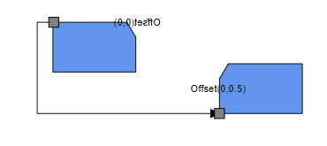
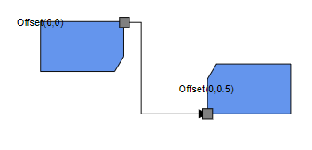
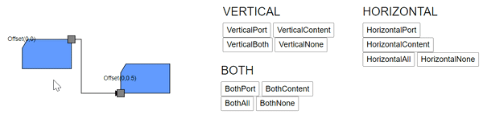

# Node Interaction in Blazor Diagram Component

Diagram provides the support to select, drag, resize, or rotate the node interactively.

## How to select the node

A node can be selected at runtime by using the [Select](https://help.syncfusion.com/cr/blazor/Syncfusion.Blazor.Diagram.SfDiagramComponent.html#Syncfusion_Blazor_Diagram_SfDiagramComponent_Select_System_Collections_ObjectModel_ObservableCollection_Syncfusion_Blazor_Diagram_IDiagramObject__System_Nullable_System_Boolean__) method and clear the selection in the diagram by using the [ClearSelection](https://help.syncfusion.com/cr/blazor/Syncfusion.Blazor.Diagram.SfDiagramComponent.html#Syncfusion_Blazor_Diagram_SfDiagramComponent_ClearSelection). The following code explains how to select and clear selection in the diagram.

```cshtml
@using Syncfusion.Blazor.Diagram
@using System.Collections.ObjectModel

<input type="button" value="Select" @onclick="OnSelect">
<input type="button" value="UnSelect" @onclick="@UnSelect" />
<SfDiagramComponent @ref="@diagram" Height="600px" Nodes="@nodes" />

@code
{
    // Reference of the diagram.
    SfDiagramComponent diagram;
    // To define node collection.
    DiagramObjectCollection<Node> nodes;

    protected override void OnInitialized()
    {
        nodes = new DiagramObjectCollection<Node>();
        // A node is created and stored in nodes collection.
        Node node = new Node()
        {
            // Position of the node.
            OffsetX = 250,
            OffsetY = 250,
            // Size of the node.
            Width = 100,
            Height = 100,
            Style = new ShapeStyle() 
            { 
                Fill = "#6495ED", 
                StrokeColor = "white" 
            }
        };
        // Add node.
        nodes.Add(node);
    }

    public void OnSelect()
    {
        // Select the node.
        diagram.Select(new ObservableCollection<IDiagramObject> { diagram.Nodes[0] });
    }

    public void UnSelect()
    {
        // Clear selection in the diagram.
        diagram.ClearSelection();
    }
}
```

And also the selection enable during the interaction.

* An element can be selected by clicking that element.
* When you select the elements in the diagram, the [SelectionChanging](https://help.syncfusion.com/cr/blazor/Syncfusion.Blazor.Diagram.SfDiagramComponent.html#Syncfusion_Blazor_Diagram_SfDiagramComponent_SelectionChanging) and [SelectionChanged](https://help.syncfusion.com/cr/blazor/Syncfusion.Blazor.Diagram.SfDiagramComponent.html#Syncfusion_Blazor_Diagram_SfDiagramComponent_SelectionChanged) events get triggered and do customization on those events.


## How to drag the node

A node can be dragged at runtime by using the [Drag](https://help.syncfusion.com/cr/blazor/Syncfusion.Blazor.Diagram.SfDiagramComponent.html#Syncfusion_Blazor_Diagram_SfDiagramComponent_Drag_Syncfusion_Blazor_Diagram_IDiagramObject_System_Double_System_Double_) method. The following code explains how to drag the node by using the drag method.

```cshtml
@using Syncfusion.Blazor.Diagram

<input type="button" value="Drag" @onclick="OnDrag">
<SfDiagramComponent @ref="@Diagram" Height="600px" Nodes="@nodes" />

@code
{
    // Reference of the diagram.
    SfDiagramComponent Diagram;
    // To define node collection.
    DiagramObjectCollection<Node> nodes;

    protected override void OnInitialized()
    {
        nodes = new DiagramObjectCollection<Node>();
        // A node is created and stored in nodes collection.
        Node node = new Node()
        {
            // Position of the node.
            OffsetX = 250,
            OffsetY = 250,
            // Size of the node.
            Width = 100,
            Height = 100,
            Style = new ShapeStyle() 
            { 
                Fill = "#6495ED", 
                StrokeColor = "white" 
            }
        };
        // Add node.
        nodes.Add(node);
    }

    public void OnDrag()
    {
        // Drag the node.
        Diagram.Drag(Diagram.Nodes[0], 10, 10);
    }
}
```

Also, drag the node during the interaction.

* An object can be dragged by clicking and dragging it. When multiple elements are selected, dragging any one of the selected elements move all the selected elements.
* When you drag the elements in the diagram, the [PositionChanging](https://help.syncfusion.com/cr/blazor/Syncfusion.Blazor.Diagram.SfDiagramComponent.html#Syncfusion_Blazor_Diagram_SfDiagramComponent_PositionChanging) and [PositionChanged](https://help.syncfusion.com/cr/blazor/Syncfusion.Blazor.Diagram.SfDiagramComponent.html#Syncfusion_Blazor_Diagram_SfDiagramComponent_PositionChanged) events get triggered and do customization on those events.


## How to resize the node

A node can be resized at runtime by using the [Scale](https://help.syncfusion.com/cr/blazor/Syncfusion.Blazor.Diagram.SfDiagramComponent.html#Syncfusion_Blazor_Diagram_SfDiagramComponent_Scale_Syncfusion_Blazor_Diagram_IDiagramObject_System_Double_System_Double_Syncfusion_Blazor_Diagram_DiagramPoint_) method. The following code explains how to resize the node by using the scale method.

```cshtml
@using Syncfusion.Blazor.Diagram

<input type="button" value="Resize" @onclick="OnResize">
<SfDiagramComponent @ref="@diagram" Height="600px" Nodes="@nodes" />

@code
{
    // Reference of the diagram.
    SfDiagramComponent diagram;
    // To define node collection.
    DiagramObjectCollection<Node> nodes;

    protected override void OnInitialized()
    {
        nodes = new DiagramObjectCollection<Node>();
        // A node is created and stored in nodes collection.
        Node node = new Node()
        {
            // Position of the node.
            OffsetX = 250,
            OffsetY = 250,
            // Size of the node.
            Width = 100,
            Height = 100,
            Style = new ShapeStyle() 
            { 
                Fill = "#6495ED", 
                StrokeColor = "white" 
            }
        };
        // Add node.
        nodes.Add(node);
    }

    public void OnResize()
    {
        // Resize the node.
        diagram.Scale(diagram.Nodes[0], 0.5, 0.5, new DiagramPoint() { X = 0, Y = 0 });
    }
}
```

Also, you can resize the node during interaction.

* Selector is surrounded by eight thumbs. When dragging these thumbs, the selected items can be resized.
* When one corner of the selector is dragged, the opposite corner will be in a static position.
* When a node is resized, the [SizeChanging](https://help.syncfusion.com/cr/blazor/Syncfusion.Blazor.Diagram.SfDiagramComponent.html#Syncfusion_Blazor_Diagram_SfDiagramComponent_SizeChanging) and [SizeChanged](https://help.syncfusion.com/cr/blazor/Syncfusion.Blazor.Diagram.SfDiagramComponent.html#Syncfusion_Blazor_Diagram_SfDiagramComponent_SizeChanged) events get triggered.


## How to rotate the node

A node can be rotated at runtime by using the [Rotate](https://help.syncfusion.com/cr/blazor/Syncfusion.Blazor.Diagram.SfDiagramComponent.html#Syncfusion_Blazor_Diagram_SfDiagramComponent_Rotate_Syncfusion_Blazor_Diagram_IDiagramObject_System_Double_Syncfusion_Blazor_Diagram_DiagramPoint_) method. The following code explains how to rotate the node by using the rotate method.

```cshtml
@using Syncfusion.Blazor.Diagram

<input type="button" value="Rotate" @onclick="OnRotate">
<SfDiagramComponent @ref="@diagram" Height="600px" Nodes="@nodes" />

@code
{
    // Reference of the diagram.
    SfDiagramComponent diagram;
    // To define node collection.
    DiagramObjectCollection<Node> nodes;

    protected override void OnInitialized()
    {
        nodes = new DiagramObjectCollection<Node>();
        // A node is created and stored in nodes collection.
        Node node = new Node()
        {
            // Position of the node.
            OffsetX = 250,
            OffsetY = 250,
            // Size of the node.
            Width = 100,
            Height = 100,
            Style = new ShapeStyle() 
            { 
                Fill = "#6495ED", 
                StrokeColor = "white" 
            }
        };
        // Add node.
        nodes.Add(node);
    }

    public void OnRotate()
    {
        // Rotate the node.
        diagram.Rotate(diagram.Nodes[0], diagram.Nodes[0].RotationAngle + 10);
    }
}
```

Also, rotate the node during the interaction.

* A rotate handler is placed above the selector. Clicking and dragging the handler in a circular direction lead to rotate the node.
* The node is rotated with reference to the static pivot point.
* Pivot thumb (thumb at the middle of the node) appears when rotating the node to represent the static point.
* When a node is rotated, the [RotationChanging](https://help.syncfusion.com/cr/blazor/Syncfusion.Blazor.Diagram.SfDiagramComponent.html#Syncfusion_Blazor_Diagram_SfDiagramComponent_RotationChanging) and [RotationChanged](https://help.syncfusion.com/cr/blazor/Syncfusion.Blazor.Diagram.SfDiagramComponent.html#Syncfusion_Blazor_Diagram_SfDiagramComponent_RotationChanged) events get triggered.


## How to flip the Node
The Flip  is used to mirror the selected object’s content and port in the diagram page for horizontal,Vertical and Both direction.

###  FlipDirection:
The flipdirection is used to mirror across Horizontal,Vertical and Both direction.

| FlipDirection | Description | 
| -------- | -------- |
|Horizontal|It is used to flip the node or connector is mirrored across the horizontal axis.|
|Vertical|	It is used to flip the node or connector is mirrored across the vertical axis.|
|Both|		It is used to flip the node or port is mirrored across the both horizontal and vertical axis.|
|None|	It is used to disables all the flip behaviour.| 


### FlipMode:
The FlipMode is used to control the behaviour of the flip object.
| FlipMode | Description | 
| -------- | -------- |
|Content|It is used to enable or disables the flip for object’s content..|
|Port|	It is used to enable or disables the flip for object’s port.|
|All|	It is used to enable or disables the flip for both object’s content and port.|
|None|	It is used to disables all the flipmode behaviour.|

**Note:** Flipmode is only applicable for Nodes not for Connectors

The following code example shows how to change the FlipDirection and FlipMode.
```chtml
@using Syncfusion.Blazor.Diagram
@using ChangeEventArgs = Microsoft.AspNetCore.Components.ChangeEventArgs

<style>    
    #diagram {
        width: 70%;
        float: left;
    }
    #properties {
        width: 15%;
        float: right;
        margin-right:300px;
    }
</style>
<div id="properties">
    <input type="button" value="HorizontalPort" @onclick="@HorizontalPort" />
    <input type="button" value="HorizontalContent" @onclick="@HorizontalContent" />
    <input type="button" value="HorizontalAll" @onclick="@HorizontalAll" />
    <input type="button" value="HorizontalNone" @onclick="@HorizontalNone" />  
 </div>     

<div id="#diagram">
    <SfDiagramComponent @ref="diagram" Width="1000px" Height="1000px"  Nodes="@NodeCollection" Connectors="@connectors">
        <SnapSettings Constraints="@SnapConstraints.None"></SnapSettings>
    </SfDiagramComponent>
    </div>

@code
{
    DiagramObjectCollection<Connector> connectors = new DiagramObjectCollection<Connector>();
    public SfDiagramComponent diagram;
    DiagramObjectCollection<Node> NodeCollection;
    protected override void OnInitialized()
    {
        Node node1 = new Node()
        {
            ID = "node1",
            Width = 100,
            Height = 100,
            OffsetX = 700,
            OffsetY = 100,
            Flip=FlipDirection.Horizontal,
            Annotations = new DiagramObjectCollection<ShapeAnnotation>()
            {
                new ShapeAnnotation 
                {
                   ID="node1annotation",
                   Content = "Offset(0,0)", 
                   Offset = new DiagramPoint() { X = 0, Y = 0 } 
                }
            },
             Style = new ShapeStyle() 
            { 
                Fill = "#6495ED", 
            },
            Shape= new FlowShape()
            {
                Type=NodeShapes.Flow,
                Shape=NodeFlowShapes.Card                   
            },
            Ports = new DiagramObjectCollection<PointPort>()
            {
                new PointPort()
                {
                    ID="ports",
                    Style = new ShapeStyle(){ Fill = "gray" },
                    Offset = new DiagramPoint() { X = 0, Y = 0 }, 
                    Visibility = PortVisibility.Visible,                  
                }
            }
        };
        Node node2 = new Node()
        {
            ID = "node2",
            Width = 100,
            Height = 100,
            OffsetX = 900,
            OffsetY = 100,
            Flip=FlipDirection.Horizontal,
            FlipMode=FlipMode.Port,
            Style = new ShapeStyle() 
            { 
                Fill = "#6495ED", 
            },
            Shape= new FlowShape()
            {
                Type=NodeShapes.Flow,
                Shape=NodeFlowShapes.Card           
            },
            Annotations = new DiagramObjectCollection<ShapeAnnotation>()
            {
                new ShapeAnnotation 
                {
                    Content = "Offset(0,0)", 
                    Offset = new DiagramPoint() { X = 0, Y = 0.5 } 
                }
            },
            Ports = new DiagramObjectCollection<PointPort>()
            {
               new PointPort()
               {  
                   Style = new ShapeStyle(){ Fill = "gray" },
                   Offset = new DiagramPoint() { X = 0, Y = 0 }, 
                   Visibility = PortVisibility.Visible
               }
            }
        };       
        NodeCollection = new DiagramObjectCollection<Node>() {node1,node2};       
    }
    
    public void HorizontalPort()
    {     
        if (diagram.SelectionSettings.Nodes.Count > 0)
        {
            for(int i = 0; i < diagram.SelectionSettings.Nodes.Count; i++)
            {
                diagram.SelectionSettings.Nodes[i].FlipMode = FlipMode.Port;
                if (diagram.SelectionSettings.Nodes[i].Flip.HasFlag(FlipDirection.Horizontal))
                {
                    diagram.SelectionSettings.Nodes[i].Flip &= ~FlipDirection.Horizontal;
                }
                else
                {
                    diagram.SelectionSettings.Nodes[i].Flip |= FlipDirection.Horizontal;
                }               
            }
        }            
    }
    public void HorizontalContent()
    {     
        if (diagram.SelectionSettings.Nodes.Count > 0)
        {
            for(int i = 0; i < diagram.SelectionSettings.Nodes.Count; i++)
            {
                diagram.SelectionSettings.Nodes[i].FlipMode = FlipMode.Content;
                if (diagram.SelectionSettings.Nodes[i].Flip.HasFlag(FlipDirection.Horizontal))
                {
                    diagram.SelectionSettings.Nodes[i].Flip &= ~FlipDirection.Horizontal;
                }
                else
                {
                    diagram.SelectionSettings.Nodes[i].Flip |= FlipDirection.Horizontal;
                }               
            }
        }            
    }
    public void HorizontalAll()
    {     
        if (diagram.SelectionSettings.Nodes.Count > 0)
        {
            for(int i = 0; i < diagram.SelectionSettings.Nodes.Count; i++)
            {
                diagram.SelectionSettings.Nodes[i].FlipMode = FlipMode.All;
                if (diagram.SelectionSettings.Nodes[i].Flip.HasFlag(FlipDirection.Horizontal))
                {
                    diagram.SelectionSettings.Nodes[i].Flip &= ~FlipDirection.Horizontal;
                }
                else
                {
                    diagram.SelectionSettings.Nodes[i].Flip |= FlipDirection.Horizontal;
                }              
            }
        }            
    }
    public void HorizontalNone()
    {     
        if (diagram.SelectionSettings.Nodes.Count > 0)
        {
            for(int i = 0; i < diagram.SelectionSettings.Nodes.Count; i++)
            {
                diagram.SelectionSettings.Nodes[i].FlipMode = FlipMode.None;
                if (diagram.SelectionSettings.Nodes[i].Flip.HasFlag(FlipDirection.Horizontal))
                {
                    diagram.SelectionSettings.Nodes[i].Flip &= ~FlipDirection.Horizontal;
                }
                else
                {
                    diagram.SelectionSettings.Nodes[i].Flip |= FlipDirection.Horizontal;
                }                               
            }
        }       
    }
}
```
### Initial Diagram:


| FlipDirection | FlipMode | Output|
| -------- | -------- | -------- |
|Horizontal|Port| |
|Horizontal|Content||
|Horizontal|All||
|Horizontal|None||
|Vertical|Port||
|Vertical|Content||
|Vertical|All||
|Vertical|None||
|Both|Port||
|Both|Content||
|Both|All||
|Both|None||



For more information about node interaction, refer to [Node Interaction](../interaction).

## See also

* [How to get events while interacting with the node](./events)

* [How to position the node](./positioning)

* [How to customize the node](./customization)

* [How to interact with the annotation in diagram](../annotations/node-annotation)

* [How to interact with the port in diagram](../ports/interaction)

* [How to interact with the connector in diagram](../connectors/interactions)
