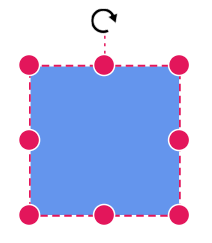
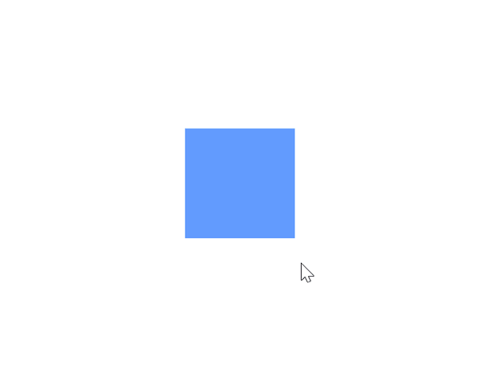
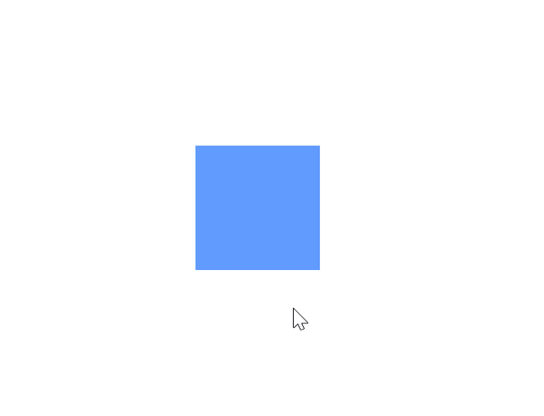
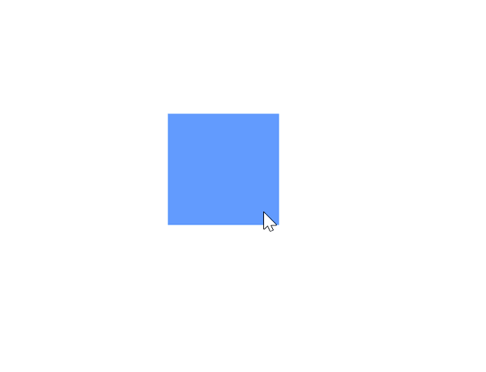
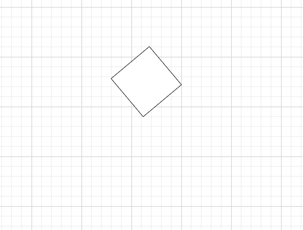

# Node Interaction in Diagram Component

Diagram provides the support to select, drag, resize, or rotate the node interactively.

## How to Select a Node

A node can be selected at runtime by using the [Select](https://help.syncfusion.com/cr/blazor/Syncfusion.Blazor.Diagram.SfDiagramComponent.html#Syncfusion_Blazor_Diagram_SfDiagramComponent_Select_System_Collections_ObjectModel_ObservableCollection_Syncfusion_Blazor_Diagram_IDiagramObject__System_Nullable_System_Boolean__) method and the selection can be cleared by using the [ClearSelection](https://help.syncfusion.com/cr/blazor/Syncfusion.Blazor.Diagram.SfDiagramComponent.html#Syncfusion_Blazor_Diagram_SfDiagramComponent_ClearSelection) method. The following code explains how to select and clear the selection in the diagram.

```cshtml
@using Syncfusion.Blazor.Diagram
@using System.Collections.ObjectModel
@using Syncfusion.Blazor.Buttons


<SfButton Content="Select" OnClick="@OnSelect" />
<SfButton Content="UnSelect" OnClick="@UnSelect" />
<SfDiagramComponent @ref="@diagram" Height="600px" Nodes="@nodes" />

@code
{
    // Reference of the diagram
    SfDiagramComponent diagram;
    // To define node collection
    DiagramObjectCollection<Node> nodes;

    protected override void OnInitialized()
    {
        nodes = new DiagramObjectCollection<Node>();
        // A node is created and stored in nodes collection.
        Node node = new Node()
            {
                // Position of the node
                OffsetX = 250,
                OffsetY = 250,
                // Size of the node
                Width = 100,
                Height = 100,
                Style = new ShapeStyle() { Fill = "#6495ED", StrokeColor = "white" }
            };
        // Add node
        nodes.Add(node);
    }

    public void OnSelect()
    {
        // Select the node
        diagram.Select(new ObservableCollection<IDiagramObject> { diagram.Nodes[0] });
    }

    public void UnSelect()
    {
        // clear selection in the diagram
        diagram.ClearSelection();
    }
}
```


A complete working sample can be downloaded from [GitHub](https://github.com/SyncfusionExamples/Blazor-Diagram-Examples/tree/master/UG-Samples/Nodes/Interaction/Select)

Selection is also available during interaction:

* Select an element by clicking it. Shift-click or drag a selection rectangle (if enabled) to select multiple elements.

* When elements are selected, the [SelectionChanging](https://help.syncfusion.com/cr/blazor/Syncfusion.Blazor.Diagram.SfDiagramComponent.html#Syncfusion_Blazor_Diagram_SfDiagramComponent_SelectionChanging) and [SelectionChanged](https://help.syncfusion.com/cr/blazor/Syncfusion.Blazor.Diagram.SfDiagramComponent.html#Syncfusion_Blazor_Diagram_SfDiagramComponent_SelectionChanged) events are triggered and do customization on those events.



## How to Drag a Node

A node can be dragged at runtime by using the [Drag](https://help.syncfusion.com/cr/blazor/Syncfusion.Blazor.Diagram.SfDiagramComponent.html#Syncfusion_Blazor_Diagram_SfDiagramComponent_Drag_Syncfusion_Blazor_Diagram_IDiagramObject_System_Double_System_Double_) method. The following code explains how to drag the node by using the drag method.

```cshtml
@using Syncfusion.Blazor.Diagram
@using Syncfusion.Blazor.Buttons


<SfButton Content="Drag" OnClick="@OnDrag" />
<SfDiagramComponent @ref="@Diagram" Height="600px" Nodes="@nodes" />

@code
{
    // Reference of the diagram
    SfDiagramComponent Diagram;
    // To define node collection
    DiagramObjectCollection<Node> nodes;

    protected override void OnInitialized()
    {
        nodes = new DiagramObjectCollection<Node>();
        // A node is created and stored in nodes collection.
        Node node = new Node()
            {
                // Position of the node
                OffsetX = 250,
                OffsetY = 250,
                // Size of the node
                Width = 100,
                Height = 100,
                Style = new ShapeStyle() { Fill = "#6495ED", StrokeColor = "white" }
            };
        // Add node
        nodes.Add(node);
    }

    public void OnDrag()
    {
        // Drag the node
        Diagram.Drag(Diagram.Nodes[0], 10, 10);
    }
}
```


A complete working sample can be downloaded from [GitHub](https://github.com/SyncfusionExamples/Blazor-Diagram-Examples/tree/master/UG-Samples/Nodes/Interaction/Drag)

Dragging is also supported during interaction:

* Drag an object by clicking and dragging it. When multiple elements are selected, dragging any one of the selected elements moves all the selected elements.
* During dragging, the [PositionChanging](https://help.syncfusion.com/cr/blazor/Syncfusion.Blazor.Diagram.SfDiagramComponent.html#Syncfusion_Blazor_Diagram_SfDiagramComponent_PositionChanging) and [PositionChanged](https://help.syncfusion.com/cr/blazor/Syncfusion.Blazor.Diagram.SfDiagramComponent.html#Syncfusion_Blazor_Diagram_SfDiagramComponent_PositionChanged) events are triggered and do customization on those events.



## How to Resize a Node

A node can be resized at runtime by using the [Scale](https://help.syncfusion.com/cr/blazor/Syncfusion.Blazor.Diagram.SfDiagramComponent.html#Syncfusion_Blazor_Diagram_SfDiagramComponent_Scale_Syncfusion_Blazor_Diagram_IDiagramObject_System_Double_System_Double_Syncfusion_Blazor_Diagram_DiagramPoint_) method. The following code explains how to resize the node by using the scale method.

```cshtml
@using Syncfusion.Blazor.Diagram
@using Syncfusion.Blazor.Buttons


<SfButton Content="Resize" OnClick="@OnResize" />
<SfDiagramComponent @ref="@diagram" Height="600px" Nodes="@nodes" />

@code
{
    // Reference of the diagram
    SfDiagramComponent diagram;
    // To define node collection
    DiagramObjectCollection<Node> nodes;

    protected override void OnInitialized()
    {
        nodes = new DiagramObjectCollection<Node>();
        // A node is created and stored in nodes collection.
        Node node = new Node()
            {
                // Position of the node
                OffsetX = 250,
                OffsetY = 250,
                // Size of the node
                Width = 100,
                Height = 100,
                Style = new ShapeStyle() { Fill = "#6495ED", StrokeColor = "white" }
            };
        // Add node
        nodes.Add(node);
    }

    public void OnResize()
    {
        // Resize the node
        diagram.Scale(diagram.Nodes[0], 0.5, 0.5, new DiagramPoint() { X = 0, Y = 0 });
    }
}
```


A complete working sample can be downloaded from [GitHub](https://github.com/SyncfusionExamples/Blazor-Diagram-Examples/tree/master/UG-Samples/Nodes/Interaction/Resize)

Resizing is also supported during interaction:

* The selector displays eight resize handles. Drag these handles to resize the selected items.
* When one corner of the selector is dragged, the opposite corner will be in a static position.
* When a node is resized, the [SizeChanging](https://help.syncfusion.com/cr/blazor/Syncfusion.Blazor.Diagram.SfDiagramComponent.html#Syncfusion_Blazor_Diagram_SfDiagramComponent_SizeChanging) and [SizeChanged](https://help.syncfusion.com/cr/blazor/Syncfusion.Blazor.Diagram.SfDiagramComponent.html#Syncfusion_Blazor_Diagram_SfDiagramComponent_SizeChanged) events get triggered.



## How to Rotate a Node

A node can be rotated at runtime by using the [Rotate](https://help.syncfusion.com/cr/blazor/Syncfusion.Blazor.Diagram.SfDiagramComponent.html#Syncfusion_Blazor_Diagram_SfDiagramComponent_Rotate_Syncfusion_Blazor_Diagram_IDiagramObject_System_Double_Syncfusion_Blazor_Diagram_DiagramPoint_) method. The following code explains how to rotate the node by using the rotate method.

```cshtml
@using Syncfusion.Blazor.Diagram
@using Syncfusion.Blazor.Buttons


<SfButton Content="Rotate" OnClick="@OnRotate" />
<SfDiagramComponent @ref="@diagram" Height="600px" Nodes="@nodes" />

@code
{
    // Reference of the diagram
    SfDiagramComponent diagram;
    // To define node collection
    DiagramObjectCollection<Node> nodes;

    protected override void OnInitialized()
    {
        nodes = new DiagramObjectCollection<Node>();
        // A node is created and stored in nodes collection.
        Node node = new Node()
        {
            // Position of the node
            OffsetX = 250,
            OffsetY = 250,
            // Size of the node
            Width = 100,
            Height = 100,
            Style = new ShapeStyle() { Fill = "#6495ED", StrokeColor = "white" }
        };
        // Add node
        nodes.Add(node);
    }

    public void OnRotate()
    {
        // Rotate the node
        diagram.Rotate(diagram.Nodes[0], diagram.Nodes[0].RotationAngle + 10);
    }
}
```


A complete working sample can be downloaded from [GitHub](https://github.com/SyncfusionExamples/Blazor-Diagram-Examples/tree/master/UG-Samples/Nodes/Interaction/Rotate)

Rotation is also supported during interaction:

* A rotate handle appears above the selector. Click and drag the handle in a circular direction to rotate the node.
* The node is rotated with reference to the static pivot point.
* The Pivot thumb (thumb at the middle of the node) appears when rotating the node to represent the static point.
* When a node is rotated, the [RotationChanging](https://help.syncfusion.com/cr/blazor/Syncfusion.Blazor.Diagram.SfDiagramComponent.html#Syncfusion_Blazor_Diagram_SfDiagramComponent_RotationChanging) and [RotationChanged](https://help.syncfusion.com/cr/blazor/Syncfusion.Blazor.Diagram.SfDiagramComponent.html#Syncfusion_Blazor_Diagram_SfDiagramComponent_RotationChanged) events are triggered.



## How to rotate a node using the RotationAngle property

The [RotationAngle](https://help.syncfusion.com/cr/blazor/Syncfusion.Blazor.Diagram.Node.html#Syncfusion_Blazor_Diagram_Node_RotationAngle)  property gets or sets the rotation angle of a node in degrees. This defines the fixed angle at which the node is displayed. The default value is **0**.

Use this property when you want to specify the node’s rotation at the time of creation or update it programmatically.

```cshtml
@using Syncfusion.Blazor.Diagram
<SfDiagramComponent Height="600px" Nodes="@nodes" />
@code
{
    DiagramObjectCollection<Node> nodes = new DiagramObjectCollection<Node>();
    protected override void OnInitialized()
    {
        Node node = new Node()
        {
            ID = "node1",
            Height = 100,
            Width = 100,
            OffsetX = 100,
            OffsetY = 100,
            RotationAngle = 50, // Rotates node by 50 degrees
        };
        nodes.Add(node);
    }
}
```


A complete working sample can be downloaded from [GitHub](https://github.com/SyncfusionExamples/Blazor-Diagram-Examples/tree/master/UG-Samples/Nodes/Interaction/RotateAngleProperty)



## How to Flip a Node

The [Flip](https://help.syncfusion.com/cr/blazor/Syncfusion.Blazor.Diagram.NodeBase.html#Syncfusion_Blazor_Diagram_NodeBase_Flip) is performed to give the mirrored image of the original element.

For more information about node flip, refer to [Node Flip](../flip#how-to-flip-the-node-or-group).

## See also

* [How to get events while interacting with the node](./events)

* [How to position the node](./positioning)

* [How to customize the node](./customization)

* [How to interact with the annotation in diagram](../annotations/node-annotation)

* [How to interact with the port in diagram](../ports/interaction)

* [How to interact with the connector in diagram](../connectors/interactions)

* [How to Disable Node Interaction While Maintaining Layout Updates in Syncfusion<sup style="font-size:70%">&reg;</sup> Blazor Diagram](https://support.syncfusion.com/kb/article/20189/how-to-disable-node-interaction-while-maintaining-layout-updates-in-syncfusion-blazor-diagram)

* [How to Drag a Node Programmatically Without User Interaction in Syncfusion<sup style="font-size:70%">&reg;</sup> Blazor Diagram](https://support.syncfusion.com/kb/article/20172/how-to-drag-a-node-programmatically-without-user-interaction-in-syncfusion-blazor-diagram)

* [How to Select a Group Child Element Without Selecting the Parent Group Node in Syncfusion<sup style="font-size:70%">&reg;</sup> Blazor Diagram Component](https://support.syncfusion.com/kb/article/18996/how-to-select-a-group-child-element-without-selecting-the-parent-group-node-in-syncfusion-blazor-diagram-component)

* [How to Select and Highlight Ports and Connect Selected Elements in Syncfusion<sup style="font-size:70%">&reg;</sup> Blazor Diagram](https://support.syncfusion.com/kb/article/18997/how-to-select-and-highlight-ports-and-connect-selected-elements-in-syncfusion-blazor-diagram)

* [How to Make HTML Node Resizable but Not Draggable in Blazor Diagram](https://support.syncfusion.com/kb/article/18727/how-to-make-html-node-resizable-but-not-draggable-in-blazor-diagram)

* [How to Get the Mouse Position When Hovering Over the Diagram Area in Blazor Diagram](https://support.syncfusion.com/kb/article/18960/how-to-get-the-mouse-position-when-hovering-over-the-diagram-area-in-blazor-diagram)


* [How to Zoom the Diagram Without Ctrl + Wheel and Enable Pan on Right Click Instead of Left Click in Blazor Diagram](https://support.syncfusion.com/kb/article/18992/how-to-zoom-the-diagram-without-ctrl--wheel-and-enable-pan-on-right-click-instead-of-left-click-in-blazor-diagram)

* [How to Embed Diagrams Inside Panels of a Dashboard Layout in Blazor](https://support.syncfusion.com/kb/article/18993/how-to-embed-diagrams-inside-panels-of-a-dashboard-layout-in-blazor)
