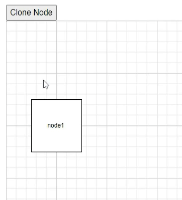

# Node in Blazor Diagram Component

Nodes are graphical objects that are used to visually represent the geometrical information, process flow, internal business procedure, entity, or any other kind of data and it represents the functions of a complete system, including how it interacts with external entities, providing a clear visual representation of complex processes and relationships.


## How to Create a Node

A node can be created and added to the diagram, either programmatically or interactively. In the diagram area, nodes are stacked from bottom-to-top in the order they are added.

To learn more about creating nodes and exploring different node shapes in a Blazor Diagram, refer to the below video link.



## How to Add a Node Using the Nodes Collection

To create a node, define the [Node](https://help.syncfusion.com/cr/blazor/Syncfusion.Blazor.Diagram.Node.html) object and add that to the nodes collection of the diagram. The following code example shows how to add a node to the diagram.

```cshtml
@using Syncfusion.Blazor.Diagram

<SfDiagramComponent Height="600px" Nodes="@nodes" />

@code
{
    //Define diagram's nodes collection
    DiagramObjectCollection<Node> nodes;

    protected override void OnInitialized()
    {
        nodes = new DiagramObjectCollection<Node>();
        // A node is created and stored in the nodes collection.
        Node node = new Node()
            {
                ID = "node1",
                // Position of the node
                OffsetX = 250,
                OffsetY = 250,
                // Size of the node
                Width = 100,
                Height = 100,
                Style = new ShapeStyle() { Fill = "#6495ED", StrokeColor = "white" }
            };
        // Add node
        nodes.Add(node);
    }
}
```
You can download a complete working sample from [GitHub](https://github.com/SyncfusionExamples/Blazor-Diagram-Examples/tree/master/UG-Samples/Nodes/ActionsofNodes/AddNode)


>**Note:** Node's Id should not start with numbers or special characters and should not contain special characters such as underscore(_) or space.

## How to Add Nodes at Runtime

You can add a Node at runtime by adding it to the nodes collection of the Diagram component. The following code explains how to add a node at runtime.

```cshtml
@using Syncfusion.Blazor.Diagram
@using Syncfusion.Blazor.Buttons


<SfButton Content="Add Node" OnClick="@AddNode" />
<SfDiagramComponent Width="1000px" Height="500px" Nodes="@nodes" />

@code
{
    //Define diagram's nodes collection
    DiagramObjectCollection<Node> nodes;

    protected override void OnInitialized()
    {
        nodes = new DiagramObjectCollection<Node>();
        Node node = new Node()
            {
                ID = "node1",
                // Position of the node
                OffsetX = 250,
                OffsetY = 250,
                // Size of the node
                Width = 100,
                Height = 100,
                Style = new ShapeStyle() { Fill = "#6495ED" }
            };
        nodes.Add(node);
    }
    //Method to add node at runtime
    public void AddNode()
    {
        Node NewNode = new Node()
            {
                ID = "node2",
                // Position of the node
                OffsetX = 450,
                OffsetY = 450,
                // Size of the node
                Width = 100,
                Height = 100,
                Style = new ShapeStyle() { Fill = "#6495ED" }
            };
        nodes.Add(NewNode);
    }
}
```
You can download a complete working sample from [GitHub](https://github.com/SyncfusionExamples/Blazor-Diagram-Examples/tree/master/UG-Samples/Nodes/ActionsofNodes/AddNodeAtRuntime)

## How to add node with annotations at runtime

You can add node with annotation at runtime in the diagram component by using the [AddDiagramElementsAsync](https://help.syncfusion.com/cr/blazor/Syncfusion.Blazor.Diagram.SfDiagramComponent.html#Syncfusion_Blazor_Diagram_SfDiagramComponent_AddDiagramElementsAsync_Syncfusion_Blazor_Diagram_DiagramObjectCollection_Syncfusion_Blazor_Diagram_NodeBase__) method.

The following code explains how to add an node with annotation  at runtime by using `AddDiagramElementsAsync` method.

```cshtml
@using Syncfusion.Blazor.Diagram
@using Syncfusion.Blazor.Buttons


<SfButton Content="AddLabel" OnClick="@AddLabel" />
<SfDiagramComponent Height="600px" @ref="@diagram" Nodes="@nodes">
</SfDiagramComponent>

@code
{
    // Reference to diagram.
    SfDiagramComponent diagram;

    // Defines diagram's node collection.
    DiagramObjectCollection<Node> nodes;

    DiagramObjectCollection<NodeBase> NodeCollection = new DiagramObjectCollection<NodeBase>();

    protected override void OnInitialized()
    {
        nodes = new DiagramObjectCollection<Node>();
        Node node = new Node()
        {
            Width = 100,
            Height = 100,
            OffsetX = 100,
            OffsetY = 100,
            Style = new ShapeStyle() { Fill = "#6495ED", StrokeColor = "white" },
        };
        nodes.Add(node);
    }

    // Method to add node with annotation at runtime.
    public async void  AddLabel()
    {
         Node NewNode = new Node()
        {
            ID = "node2",
            // Position of the node.
            OffsetX = 450,
            OffsetY = 450,
            // Size of the node.
            Width = 100,
            Height = 100,
            Style = new ShapeStyle() { Fill = "#6495ED" },
             Annotations= new DiagramObjectCollection<ShapeAnnotation>()
            {
                new ShapeAnnotation()
                {
                    Content="NewAnnotation"
                }
            },
        };
        NodeCollection.Add(NewNode);
       await diagram.AddDiagramElementsAsync(NodeCollection);
    }
}
```
## How to Add a Node to the Palette

Nodes can be predefined and added to the symbol palette, and can be dropped into the diagram when needed. For more information about adding nodes from symbol palette, refer to the [Symbol Palette](../symbol-palette).

* Once you drag a node/connector from the palette to the diagram, the following events can be used to do the customization.
* When a symbol is dragged into a diagram from symbol palette, the [DragStart](https://help.syncfusion.com/cr/blazor/Syncfusion.Blazor.Diagram.SfDiagramComponent.html#Syncfusion_Blazor_Diagram_SfDiagramComponent_DragStart) event gets triggered. [DragStartEventArgs](https://help.syncfusion.com/cr/blazor/Syncfusion.Blazor.Diagram.DragStartEventArgs.html) notifies when the element enters into the diagram from the symbol palette.
* When a symbol is dragged over a diagram, the [Dragging](https://help.syncfusion.com/cr/blazor/Syncfusion.Blazor.Diagram.SfDiagramComponent.html#Syncfusion_Blazor_Diagram_SfDiagramComponent_Dragging) event gets triggered. [DraggingEventArgs](https://help.syncfusion.com/cr/blazor/Syncfusion.Blazor.Diagram.DraggingEventArgs.html) notifies when an element drags over another diagram element.
* When a symbol is dragged and dropped from symbol palette to diagram area, the [DragDrop](https://help.syncfusion.com/cr/blazor/Syncfusion.Blazor.Diagram.SfDiagramComponent.html#Syncfusion_Blazor_Diagram_SfDiagramComponent_DragDrop) event gets triggered. [DropEventArgs](https://help.syncfusion.com/cr/blazor/Syncfusion.Blazor.Diagram.DropEventArgs.html) notifies when the element is dropped on the diagram.
* When a symbol is dragged outside of the diagram, the [DragLeave](https://help.syncfusion.com/cr/blazor/Syncfusion.Blazor.Diagram.SfDiagramComponent.html#Syncfusion_Blazor_Diagram_SfDiagramComponent_DragLeave) event gets triggered. [DragLeaveEventArgs](https://help.syncfusion.com/cr/blazor/Syncfusion.Blazor.Diagram.DragLeaveEventArgs.html) notifies when the element leaves the diagram.


## How to Draw Nodes Using Drawing Object

Nodes can be interactively drawn by clicking and dragging on the diagram surface by using the [DrawingObject](https://help.syncfusion.com/cr/blazor/Syncfusion.Blazor.Diagram.SfDiagramComponent.html#Syncfusion_Blazor_Diagram_SfDiagramComponent_DrawingObject).

For more information about drawing node, refer to the `Draw Nodes`.


## How to Create Nodes from DataSource

Nodes can be generated automatically with the information provided through a data source. The default properties for these nodes are fetched from default settings. For more information about datasource, refer to the [DataSource](../data-binding).

## How to Remove Nodes at Runtime

A node can be removed from the diagram at runtime by using the `Remove` method.

The following code shows how to remove a node at runtime.

```cshtml
@using Syncfusion.Blazor.Diagram
@using Syncfusion.Blazor.Buttons

<SfButton Content="Remove Node" OnClick="@RemoveNodes" />

<SfDiagramComponent Width="1000px" Height="500px" Nodes="@nodes" />

@code
{
    //Defines diagram's Node collection
    DiagramObjectCollection<Node> nodes;

    protected override void OnInitialized()
    {
        nodes = new DiagramObjectCollection<Node>();
        Node node = new Node()
            {
                ID = "node1",
                // Position of the node
                OffsetX = 250,
                OffsetY = 250,
                // Size of the node
                Width = 100,
                Height = 100,
                Style = new ShapeStyle() { Fill = "#6495ED", StrokeColor = "white" }
            };
        // Add node
        nodes.Add(node);
    }

    public void RemoveNodes()
    {
        // Remove Node at runtime
        nodes.Remove(nodes[0]);
    }
}
```
You can download a complete working sample from [GitHub](https://github.com/SyncfusionExamples/Blazor-Diagram-Examples/tree/master/UG-Samples/Nodes/ActionsofNodes/RemoveNode)

A node can be removed from the diagram by using the native `RemoveAt` method. Refer to the following example to see how to remove the node at runtime.

```csharp
public void RemoveNodes()
{
    nodes.RemoveAt(0);
}
```
### How to Clone a Node at Runtime
[Clone](https://help.syncfusion.com/cr/blazor/Syncfusion.Blazor.Diagram.Node.html#Syncfusion_Blazor_Diagram_Node_Clone) is a virtual method of the node that is used to create a copy of a diagram object. After cloning, we need to set the ID for cloned nodes. The following code demonstrates how to clone the nodes during runtime.

```cshtml
@using Syncfusion.Blazor.Diagram
@using System.Collections.ObjectModel
@using Syncfusion.Blazor.Buttons
@inject IJSRuntime js

<SfButton Content="Clone Node" OnClick="@CloneNode" />
<SfDiagramComponent @ref="diagram" Width="50%" Height="500px" @bind-Nodes="NodeCollection"></SfDiagramComponent>

@functions
{

    SfDiagramComponent diagram;
    public DiagramObjectCollection<Node> NodeCollection = new DiagramObjectCollection<Node>();
    protected override void OnInitialized()
    {
        Node node1 = new Node()
            {
                ID = "node1",
                OffsetX = 100,
                OffsetY = 200,
                Height = 100,
                Width = 100,
                Annotations = new DiagramObjectCollection<ShapeAnnotation>()
                    {
                        new ShapeAnnotation()
                        {
                            Content = "node1"
                        },
                    },
                Shape = new FlowShape() { Type = NodeShapes.Flow, Shape = NodeFlowShapes.Process }
            };
        NodeCollection.Add(node1);
    }
    public async Task CloneNode()
    {
        Node node = NodeCollection[0].Clone() as Node;
        node.ID = RandomId();
        node.OffsetX += 25;
        node.OffsetY += 25;
        await diagram.AddDiagramElementsAsync(new DiagramObjectCollection<NodeBase>() { node });
    }

    internal string RandomId()
    {
        Random random = new Random();
        const string chars = "ABCDEFGHIJKLMNOPQRSTUVWXTZabcdefghiklmnopqrstuvwxyz";
        return new string(Enumerable.Repeat(chars, 5)
          .Select(s => s[random.Next(s.Length)]).ToArray());
    }

}
```
You can download a complete working sample from [GitHub](https://github.com/SyncfusionExamples/Blazor-Diagram-Examples/tree/master/UG-Samples/Nodes/CloneNode)

## How to Update Nodes at Runtime

You can change any node's properties at runtime.

The following code example explains how to change the node properties.

```cshtml
@using Syncfusion.Blazor.Diagram
@using Syncfusion.Blazor.Buttons

<SfButton Content="Update Node" OnClick="@UpdateNodes" />

<SfDiagramComponent @ref="Diagram" Width="1000px" Height="500px" Nodes="@nodes" />

@code
{
    //Reference the diagram
    SfDiagramComponent Diagram;
    //Defines diagram's node collection
    DiagramObjectCollection<Node> nodes;

    protected override void OnInitialized()
    {
        nodes = new DiagramObjectCollection<Node>();
        Node node = new Node()
            {
                ID = "node1",
                // Position of the node
                OffsetX = 250,
                OffsetY = 250,
                // Size of the node
                Width = 100,
                Height = 100,
                Style = new ShapeStyle() { Fill = "#6495ED", StrokeColor = "white" }
            };
        nodes.Add(node);
    }
    //Method to Update node's width and height at runtime
    public async void UpdateNodes()
    {
        Diagram.BeginUpdate();
        Diagram.Nodes[0].Width = 50;
        Diagram.Nodes[0].Height = 50;
        await Diagram.EndUpdateAsync();
    }
}
```
You can download a complete working sample from [GitHub](https://github.com/SyncfusionExamples/Blazor-Diagram-Examples/tree/master/UG-Samples/Nodes/ActionsofNodes/UpdateNode)

N> [BeginUpdate](https://help.syncfusion.com/cr/blazor/Syncfusion.Blazor.Diagram.SfDiagramComponent.html#Syncfusion_Blazor_Diagram_SfDiagramComponent_BeginUpdate) and [EndUpdateAsync](https://help.syncfusion.com/cr/blazor/Syncfusion.Blazor.Diagram.SfDiagramComponent.html#Syncfusion_Blazor_Diagram_SfDiagramComponent_EndUpdateAsync) methods allow you to stop the continuous update of control and resume it finally.

## See Also

* [How to add annotations to the node](../annotations/labels)

* [How to add ports to the node](../ports/ports)

* [How to enable/disable the behavior of the node](../constraints)

* [How to Disable Node Interaction While Maintaining Layout Updates in Syncfusion Blazor Diagram](https://support.syncfusion.com/kb/article/20189/how-to-disable-node-interaction-while-maintaining-layout-updates-in-syncfusion-blazor-diagram)
* [How to Drag a Node Programmatically Without User Interaction in Syncfusion Blazor Diagram](https://support.syncfusion.com/kb/article/20172/how-to-drag-a-node-programmatically-without-user-interaction-in-syncfusion-blazor-diagram)
* [How to Change Round Rectangle Border for Image Node in Blazor Diagram](https://support.syncfusion.com/kb/article/18698/how-to-change-round-rectangle-border-for-image-node-in-blazor-diagram)
* [How to Update HTML Node Size on HTML Template in Blazor Diagram](https://support.syncfusion.com/kb/article/18692/how-to-update-html-node-size-on-html-template-in-blazor-diagram)
* [How to Make HTML Node Resizable but Not Draggable in Blazor Diagram](https://support.syncfusion.com/kb/article/18727/how-to-make-html-node-resizable-but-not-draggable-in-blazor-diagram)
* [How to Dynamically Create and Connect Diagram Nodes with Annotations via Ports in Syncfusion Blazor Diagram](https://support.syncfusion.com/kb/article/19001/how-to-dynamically-create-and-connect-diagram-nodes-with-annotations-via-ports-in-syncfusion-blazor-diagram)
* [How to Add Fixed Handle to Diagram from the Palette in Blazor Diagram](https://support.syncfusion.com/kb/article/18707/how-to-add-fixed-handle-to-diagram-from-the-palette-in-blazor-diagram)
* [How to Add Custom HTML Nodes in Symbol Palette for Blazor Diagram](https://support.syncfusion.com/kb/article/18737/how-to-add-custom-html-nodes-in-symbol-palette-for-blazor-diagram)
* [How to Detect Nodes That Cross Page Breaks in Syncfusion Blazor Diagram](https://support.syncfusion.com/kb/article/20111/how-to-detect-nodes-that-cross-page-breaks-in-syncfusion-blazor-diagram)
* [How to Select a Group Child Element Without Selecting the Parent Group Node in Syncfusion Blazor Diagram Component](https://support.syncfusion.com/kb/article/18996/how-to-select-a-group-child-element-without-selecting-the-parent-group-node-in-syncfusion-blazor-diagram-component)
* [How to Update AddInfo Property for the Dropped Node in Blazor Diagram](https://support.syncfusion.com/kb/article/10948/how-to-update-addinfo-property-for-the-dropped-node-in-blazor-diagram)
* [How to Add Image Node in Symbol Palette in Blazor](https://support.syncfusion.com/kb/article/10090/how-to-add-image-node-in-symbol-palette-in-blazor)
* [How to Get the Mouse Position When Hovering Over the Diagram Area in Blazor Diagram](https://support.syncfusion.com/kb/article/18960/how-to-get-the-mouse-position-when-hovering-over-the-diagram-area-in-blazor-diagram)

* [How to Embed Diagrams Inside Panels of a Dashboard Layout in Blazor](https://support.syncfusion.com/kb/article/18993/how-to-embed-diagrams-inside-panels-of-a-dashboard-layout-in-blazor)
* [How to Zoom the Diagram Without Ctrl + Wheel and Enable Pan on Right Click Instead of Left Click in Blazor Diagram](https://support.syncfusion.com/kb/article/18992/how-to-zoom-the-diagram-without-ctrl--wheel-and-enable-pan-on-right-click-instead-of-left-click-in-blazor-diagram)
* [How to Export Blazor Diagram with Image Nodes to a PNG File](https://support.syncfusion.com/kb/article/18750/how-to-export-blazor-diagram-with-image-nodes-to-a-png-file)
* [How to Select and Highlight Ports and Connect Selected Elements in Syncfusion Blazor Diagram](https://support.syncfusion.com/kb/article/18997/how-to-select-and-highlight-ports-and-connect-selected-elements-in-syncfusion-blazor-diagram)
* [How to Create Polygon and Circle Shapes in Blazor Diagram](https://support.syncfusion.com/kb/article/18054/how-to-create-polygon-and-circle-shapes-in-blazor-diagram)

* [How to Provide IDs for Diagram Elements in Blazor Diagrams](https://support.syncfusion.com/kb/article/17898/how-to-provide-ids-for-diagram-elements-in-blazor-diagrams)
