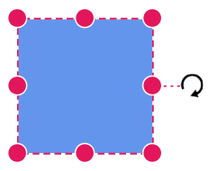

# Positioning a Node in Diagram Component

## How to Arrange Nodes

* Control a node’s position by using the [OffsetX](https://help.syncfusion.com/cr/blazor/Syncfusion.Blazor.Diagram.Node.html#Syncfusion_Blazor_Diagram_Node_OffsetX) and [OffsetY](https://help.syncfusion.com/cr/blazor/Syncfusion.Blazor.Diagram.Node.html#Syncfusion_Blazor_Diagram_Node_OffsetY) properties. By default, these represent the distance from the diagram page’s origin to the node’s pivot (center) point.

* If the expected reference is the node’s top-left corner instead of its center, adjust the [Pivot](https://help.syncfusion.com/cr/blazor/Syncfusion.Blazor.Diagram.Node.html#Syncfusion_Blazor_Diagram_Node_Pivot) property. The default pivot is (0.5, 0.5), which corresponds to the node’s center.

* Control the node size using the [Width](https://help.syncfusion.com/cr/blazor/Syncfusion.Blazor.Diagram.Node.html#Syncfusion_Blazor_Diagram_Node_Width) and [Height](https://help.syncfusion.com/cr/blazor/Syncfusion.Blazor.Diagram.Node.html#Syncfusion_Blazor_Diagram_Node_Height) properties.

The following table explains how the pivot relates offset values with node boundaries.

| Pivot | Offset |
|-------- | -------- |
| (0.5,0.5)| OffsetX and OffsetY values are considered as the node’s center point. |
| (0,0) | OffsetX and OffsetY values are considered as the top-left corner of the node. |
| (1,1) | OffsetX and OffsetY values are considered as the bottom-right corner of the node. |

The following code shows how to change the pivot value.

```cshtml
@using Syncfusion.Blazor.Diagram
@using System.Collections.ObjectModel

<SfDiagramComponent Height="600px" @ref="@diagram" Nodes="@nodes" />

@code
{
    //Reference the diagram
    SfDiagramComponent diagram;
    //Define diagram's nodes collection
    DiagramObjectCollection<Node> nodes;

    protected override void OnInitialized()
    {
        //Intialize diagram's nodes collection

        nodes = new DiagramObjectCollection<Node>();
        // A node is created and stored in nodes array.
        Node node = new Node()
            {
                ID = "node",
                // Position of the node
                OffsetX = 250,
                OffsetY = 250,
                // Size of the node
                Width = 100,
                Height = 100,
                Style = new ShapeStyle() { Fill = "#6495ED", StrokeColor = "white" },
                // Pivot of the node
                Pivot = new DiagramPoint() { X = 0, Y = 0 }
            };
        nodes.Add(node);
    }

    protected override async Task OnAfterRenderAsync(bool firstRender)
    {
        if (firstRender)
        {
            //OnAfterRenderAsync will be triggered after the component rendered.
            await Task.Delay(200);
            diagram.Select(new ObservableCollection<IDiagramObject>() { diagram.Nodes[0] });
        }
    }
}
```
A complete working sample can be downloaded from [GitHub](https://github.com/SyncfusionExamples/Blazor-Diagram-Examples/tree/master/UG-Samples/Nodes/Position/Positioning)


Rotation of a node is controlled by the [RotationAngle](https://help.syncfusion.com/cr/blazor/Syncfusion.Blazor.Diagram.Node.html#Syncfusion_Blazor_Diagram_Node_RotationAngle) property. The following code shows how to change the RotationAngle value.

```cshtml
@using Syncfusion.Blazor.Diagram

<SfDiagramComponent Height="600px" @ref="@diagram" Nodes="@nodes" />

@code
{
    SfDiagramComponent diagram;
    DiagramObjectCollection<Node> nodes;

    protected override void OnInitialized()
    {
        nodes = new DiagramObjectCollection<Node>();
        // A node is created and stored in nodes array.
        Node node = new Node()
        {
            ID = "node",
            // Position of the node.
            OffsetX = 250,
            OffsetY = 250,
            // Size of the node.
            Width = 100,
            Height = 100,
            Style = new ShapeStyle() 
            { 
                Fill = "#6495ED", 
                StrokeColor = "white"
            },
            // RotationAngle of the node.
            RotationAngle = 90
        };
        nodes.Add(node);
    }
}
```
A complete working sample can be downloaded from [GitHub](https://github.com/SyncfusionExamples/Blazor-Diagram-Examples/tree/master/UG-Samples/Nodes/Position/NodeRotateAngle)



## How to Set Minimum and Maximum Node Size

The [MinWidth](https://help.syncfusion.com/cr/blazor/Syncfusion.Blazor.Diagram.Node.html#Syncfusion_Blazor_Diagram_Node_MinWidth) and [MinHeight](https://help.syncfusion.com/cr/blazor/Syncfusion.Blazor.Diagram.Node.html#Syncfusion_Blazor_Diagram_Node_MinHeight) properties control the minimum size of a node during resizing. Similarly, the [MaxWidth](https://help.syncfusion.com/cr/blazor/Syncfusion.Blazor.Diagram.Node.html#Syncfusion_Blazor_Diagram_Node_MaxWidth) and [MaxHeight](https://help.syncfusion.com/cr/blazor/Syncfusion.Blazor.Diagram.Node.html#Syncfusion_Blazor_Diagram_Node_MaxHeight) properties control the maximum size of the node during resizing. The below gif explains how minimum and maximum sizes are controlled.

```cshtml
@using Syncfusion.Blazor.Diagram

<SfDiagramComponent Height="600px" @ref="@diagram" Nodes="@nodes" />

@code
 {
    SfDiagramComponent diagram;
    DiagramObjectCollection<Node> nodes;

    protected override void OnInitialized()
    {
        nodes = new DiagramObjectCollection<Node>();
        // A node is created and stored in nodes array.
        Node node = new Node()
        {
            ID = "node",
            // Position of the node.
            OffsetX = 250,
            OffsetY = 250,
            // Size of the node.
            Width = 100,
            Height = 100,
            //Minimum Size of the node.
            MinHeight = 50,
            MinWidth = 50,
            //Maximum Size of the node.
            MaxHeight = 200,
            MaxWidth = 200,
            Style = new ShapeStyle() 
            { 
                Fill = "#6495ED", 
                StrokeColor = "white" 
            },
        };
        nodes.Add(node);
    }
}
```
A complete working sample can be downloaded from [GitHub](https://github.com/SyncfusionExamples/Blazor-Diagram-Examples/tree/master/UG-Samples/Nodes/Position/MinMaxSize)


## See also

* [How to customize the node](./customization)

* [How to get events when interacting with the node](./events)


* [How to Drag a Node Programmatically Without User Interaction in Syncfusion<sup style="font-size:70%">&reg;</sup> Blazor Diagram](https://support.syncfusion.com/kb/article/20172/how-to-drag-a-node-programmatically-without-user-interaction-in-syncfusion-blazor-diagram)

* [How to Disable Node Interaction While Maintaining Layout Updates in Syncfusion<sup style="font-size:70%">&reg;</sup> Blazor Diagram](https://support.syncfusion.com/kb/article/20189/how-to-disable-node-interaction-while-maintaining-layout-updates-in-syncfusion-blazor-diagram)

* [How to Update HTML Node Size on HTML Template in Blazor Diagram](https://support.syncfusion.com/kb/article/18692/how-to-update-html-node-size-on-html-template-in-blazor-diagram)

* [How to Make HTML Node Resizable but Not Draggable in Blazor Diagram](https://support.syncfusion.com/kb/article/18727/how-to-make-html-node-resizable-but-not-draggable-in-blazor-diagram)

* [How to Dynamically Create and Connect Diagram Nodes with Annotations via Ports in Syncfusion<sup style="font-size:70%">&reg;</sup> Blazor Diagram](https://support.syncfusion.com/kb/article/19001/how-to-dynamically-create-and-connect-diagram-nodes-with-annotations-via-ports-in-syncfusion-blazor-diagram)

* [How to Select a Group Child Element Without Selecting the Parent Group Node in Syncfusion<sup style="font-size:70%">&reg;</sup> Blazor Diagram Component](https://support.syncfusion.com/kb/article/18996/how-to-select-a-group-child-element-without-selecting-the-parent-group-node-in-syncfusion-blazor-diagram-component)

* [How to Detect Nodes That Cross Page Breaks in Syncfusion<sup style="font-size:70%">&reg;</sup> Blazor Diagram](https://support.syncfusion.com/kb/article/20111/how-to-detect-nodes-that-cross-page-breaks-in-syncfusion-blazor-diagram)