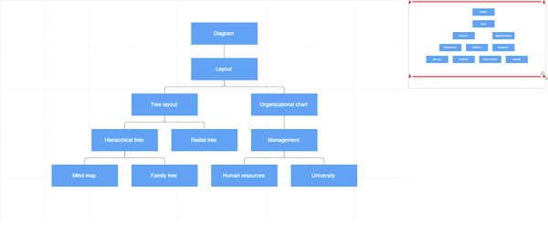

# Overview in Blazor Diagram Component

The [SfDiagramOverviewComponent](https://help.syncfusion.com/cr/blazor/Syncfusion.Blazor.Diagram.Overview.SfDiagramOverviewComponent.html) provides a miniature view of the entire diagram content, offering a comprehensive preview at a glance. This powerful feature enables users to effortlessly navigate, pan, and zoom to specific areas of interest within large and complex diagrams. By presenting a bird's-eye view, it enhances the user's ability to understand the diagram's structure and quickly locate desired sections, significantly improving overall usability and efficiency.

## Usage Scenario

When working with an extensive diagram, it can be challenging to maintain context or navigate efficiently between different sections. The traditional approach of zooming out to view the entire diagram and then zooming in on a specific area can be cumbersome, especially when frequent navigation is required.

The SfDiagramOverviewComponent offers an elegant solution to these challenges by providing a compact preview of the entire diagram. This overview displays a miniature representation of your diagram, with a rectangular viewport indicator highlighting your current focus area. Navigation becomes intuitive and effortless as you can simply drag this viewport rectangle to instantly move to different parts of the diagram, enhancing both productivity and user experience.

## How to Create an Overview

The [SourceID](https://help.syncfusion.com/cr/blazor/Syncfusion.Blazor.Diagram.Overview.SfDiagramOverviewComponent.html#Syncfusion_Blazor_Diagram_Overview_SfDiagramOverviewComponent_SourceID) property of the SfDiagramOverviewComponent is essential for linking the overview to its corresponding diagram. To establish this connection, set the SourceID to match the [ID](https://help.syncfusion.com/cr/blazor/Syncfusion.Blazor.Diagram.SfDiagramComponent.html#Syncfusion_Blazor_Diagram_SfDiagramComponent_ID) of the target diagram component. This ensures that the overview displays an accurate representation of the main diagram.

To customize the dimensions of the overview panel, utilize the [Width](https://help.syncfusion.com/cr/blazor/Syncfusion.Blazor.Diagram.Overview.SfDiagramOverviewComponent.html#Syncfusion_Blazor_Diagram_Overview_SfDiagramOverviewComponent_Width) and [Height](https://help.syncfusion.com/cr/blazor/Syncfusion.Blazor.Diagram.Overview.SfDiagramOverviewComponent.html#Syncfusion_Blazor_Diagram_Overview_SfDiagramOverviewComponent_Height) properties of the SfDiagramOverviewComponent. These properties allow you to precisely control the size of the overview, ensuring it fits seamlessly within your application's layout.

The following code illustrates how to create an overview.

```cshtml
@using Syncfusion.Blazor.Diagram
@using Syncfusion.Blazor.Diagram.Overview
@using System.Collections.ObjectModel

<SfDiagramComponent @ref="@Diagram" ID="element" Width="100%" Height="500px" InteractionController="DiagramInteractions.ZoomPan" ConnectorCreating="@ConnectorCreating" NodeCreating="@NodeCreating">
    <DataSourceSettings ID="Name" ParentID="Category" DataSource="DataSource"></DataSourceSettings>
    <Layout Type="LayoutType.HierarchicalTree" HorizontalSpacing="30" Orientation="LayoutOrientation.TopToBottom" VerticalSpacing="30" HorizontalAlignment="HorizontalAlignment.Auto" VerticalAlignment="VerticalAlignment.Auto" GetLayoutInfo="GetLayoutInfo">
        <LayoutMargin Top="50" Bottom="50" Right="50" Left="50"></LayoutMargin>
    </Layout>            
</SfDiagramComponent>
<SfDiagramOverviewComponent Height="150px" SourceID="element"></SfDiagramOverviewComponent>
@code {
SfDiagramComponent Diagram;
private void ConnectorCreating(IDiagramObject connector)
{
    (connector as Connector).Type = ConnectorSegmentType.Orthogonal;
    (connector as Connector).TargetDecorator.Shape = DecoratorShape.None;
    (connector as Connector).Style = new ShapeStyle() { StrokeColor = "#6d6d6d" };
    (connector as Connector).Constraints = 0;
    (connector as Connector).CornerRadius = 5;
}
private TreeInfo GetLayoutInfo(IDiagramObject obj, TreeInfo options)
{
    options.EnableSubTree = true;
    options.Orientation = Orientation.Horizontal;
    return options;
}
private void NodeCreating(IDiagramObject obj)
{
    Node node = obj as Node;
    if (node.Data is System.Text.Json.JsonElement)
    {
        node.Data = System.Text.Json.JsonSerializer.Deserialize<HierarchicalDetails>(node.Data.ToString());
    }
    HierarchicalDetails hierarchicalData = node.Data as HierarchicalDetails;
    node.Style = new ShapeStyle() { Fill = "#659be5", StrokeColor = "none", StrokeWidth = 2, };
    node.BackgroundColor = "#659be5";
    node.Width = 150;
    node.Height = 50;
    node.Annotations = new DiagramObjectCollection<ShapeAnnotation>()
    {
        new ShapeAnnotation()
        {
            Content = hierarchicalData.Name,
            Style =new TextStyle(){Color = "white"}
        }
    };
}
 //Create the hierarchical details with needed properties.
public class HierarchicalDetails
{
    public string Name { get; set; }
    public string FillColor { get; set; }
    public string Category { get; set; }
}
//Create the data source with node name and fill color values.
public List<HierarchicalDetails> DataSource = new List<HierarchicalDetails>()
{
    new HierarchicalDetails(){ Name ="Diagram", Category="",FillColor="#659be5"},
    new HierarchicalDetails(){ Name ="Layout", Category="Diagram",FillColor="#659be5"},
    new HierarchicalDetails(){ Name ="Tree layout", Category="Layout",FillColor="#659be5"},
    new HierarchicalDetails(){ Name ="Organizational chart", Category="Layout",FillColor="#659be5"},
    new HierarchicalDetails(){ Name ="Hierarchical tree", Category="Tree layout",FillColor="#659be5"},
    new HierarchicalDetails(){ Name ="Radial tree", Category="Tree layout",FillColor="#659be5"},
    new HierarchicalDetails(){ Name ="Mind map", Category="Hierarchical tree",FillColor="#659be5"},
    new HierarchicalDetails(){ Name ="Family tree", Category="Hierarchical tree",FillColor="#659be5"},
    new HierarchicalDetails(){ Name ="Management", Category="Organizational chart",FillColor="#659be5"},
    new HierarchicalDetails(){ Name ="Human resources", Category="Management",FillColor="#659be5"},
    new HierarchicalDetails(){ Name ="University", Category="Management",FillColor="#659be5"},
    new HierarchicalDetails(){ Name ="Business", Category="#Management",FillColor="#659be5"}
};
}
```


A complete working sample can be downloaded from [GitHub](https://github.com/SyncfusionExamples/Blazor-Diagram-Examples/tree/master/UG-Samples/Overview/Overview)

## How to Zoom and Pan the Diagram

The SfDiagramOverviewComponent displays a viewport of the diagram, highlighted by a red rectangular outline. This component allows for intuitive interaction with the diagram through the following methods:

* Resizing the rectangle: Dynamically zooms the diagram in or out.
* Dragging the rectangle: Smoothly pans the diagram to different areas.
* Clicking at a specific position: Instantly navigates the diagram to the clicked region.
* Selecting a region by click-and-drag: Precisely navigates to the user-defined area.

These interactions provide a seamless way to explore and navigate complex diagrams, enhancing the overall user experience and improving diagram comprehension.

The following image shows how the diagram is zoomed or panned with an overview.



## How to Enable or Disable Overview Functionalities Using Constraints

The [Constraints](https://help.syncfusion.com/cr/blazor/Syncfusion.Blazor.Diagram.Overview.SfDiagramOverviewComponent.html#Syncfusion_Blazor_Diagram_Overview_SfDiagramOverviewComponent_Constraints) property of the SfDiagramOverviewComponent allows enable or disable the following functionalities.

* None
* Zoom
* Pan
* DrawFocus
* TapFocus
* Default

| Constraints | Description |
| -------- | -------- |
| [None](https://help.syncfusion.com/cr/blazor/Syncfusion.Blazor.Diagram.DiagramOverviewConstraints.html#Syncfusion_Blazor_Diagram_DiagramOverviewConstraints_None) | Disables all the interactions in the overview component.|
| [Zoom](https://help.syncfusion.com/cr/blazor/Syncfusion.Blazor.Diagram.DiagramOverviewConstraints.html#Syncfusion_Blazor_Diagram_DiagramOverviewConstraints_Zoom) | Enables the zooming interaction in the overview component. |
| [Pan](https://help.syncfusion.com/cr/blazor/Syncfusion.Blazor.Diagram.DiagramOverviewConstraints.html#Syncfusion_Blazor_Diagram_DiagramOverviewConstraints_Pan) | Enables the panning interaction in the overview component. |
| [DrawFocus](https://help.syncfusion.com/cr/blazor/Syncfusion.Blazor.Diagram.DiagramOverviewConstraints.html#Syncfusion_Blazor_Diagram_DiagramOverviewConstraints_DrawFocus) | Enables to zoom or change the viewport area of the diagram by drawing the new rect in the overview component. | 
| [TapFocus](https://help.syncfusion.com/cr/blazor/Syncfusion.Blazor.Diagram.DiagramOverviewConstraints.html#Syncfusion_Blazor_Diagram_DiagramOverviewConstraints_TapFocus) | Enables the panning of the diagram viewport to a specific focus point by tapping on the overview component. |
| [Default](https://help.syncfusion.com/cr/blazor/Syncfusion.Blazor.Diagram.DiagramOverviewConstraints.html#Syncfusion_Blazor_Diagram_DiagramOverviewConstraints_Default) | Enables all the interactions in the overview component. |

The following example shows how to disable the zoom constraint from the default overview constraints.

```cshtml
@using Syncfusion.Blazor.Diagram
@using Syncfusion.Blazor.Diagram.Overview
@using System.Collections.ObjectModel

<SfDiagramComponent @ref="diagram" Height="600px" Width="90%" ID="element" @bind-Nodes="nodes" @bind-Connectors="connectors">
</SfDiagramComponent>
<SfDiagramOverviewComponent Height="150px" SourceID="element" Constraints="DiagramOverviewConstraints.Default &~ DiagramOverviewConstraints.Zoom"></SfDiagramOverviewComponent>
@code {
    SfDiagramComponent diagram; DiagramObjectCollection<Node> nodes; DiagramObjectCollection<Connector> connectors;
    protected override void OnInitialized()
    {
        //Initialize the node and connector collections
        nodes = new DiagramObjectCollection<Node>();
        connectors = new DiagramObjectCollection<Connector>();
        Node node1 = new Node()
        {
            ID = "node1",
            Height = 100,
            Width = 100,
            OffsetX = 100,
            OffsetY = 100,
            Style = new ShapeStyle()
            {
                Fill = "#6BA5D7",
                StrokeColor = "white",
                StrokeWidth = 1
            }
        };
        Node node2 = new Node()
        {
            ID = "node2",
            Height = 100,
            Width = 100,
            OffsetX = 300,
            OffsetY = 100,
            Style = new ShapeStyle()
            {
                Fill = "#6BA5D7",
                StrokeColor = "white",
                StrokeWidth = 1
            }
        };
        nodes.Add(node1); nodes.Add(node2);
        Connector connector1 = new Connector()
        {
            ID = "connector1",
            SourceID = "node1",
            TargetID = "node2",
            Type = ConnectorSegmentType.Straight,
            Style = new ShapeStyle()
            {
                Fill = "#6BA5D7",
                StrokeWidth = 2
            }
        };
        connectors.Add(connector1);
    }
}
```


A complete working sample can be downloaded from [GitHub](https://github.com/SyncfusionExamples/Blazor-Diagram-Examples/tree/master/UG-Samples/Overview/OverviewConstraints)

## See also 

* [How to Integrate Syncfusion<sup style="font-size:70%">&reg;</sup> Blazor Diagram with Overview Support in SfTab Component](https://support.syncfusion.com/kb/article/17263/how-to-integrating-syncfusion-blazor-diagram-with-overview-support-in-sftab-component)
