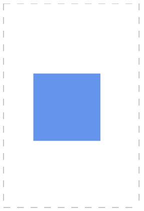

# Page Settings in Diagram Component

By default, the diagram page size is decided based on the position of its diagram elements. The size and appearance of diagram pages can be customized using the [PageSettings](https://help.syncfusion.com/cr/blazor/Syncfusion.Blazor.Diagram.PageSettings.html) property of the diagram.

* The [Width](https://help.syncfusion.com/cr/blazor/Syncfusion.Blazor.Diagram.PageSettings.html#Syncfusion_Blazor_Diagram_PageSettings_Width) and [Height](https://help.syncfusion.com/cr/blazor/Syncfusion.Blazor.Diagram.PageSettings.html#Syncfusion_Blazor_Diagram_PageSettings_Height) properties of `PageSettings` define the size of the page. The default `Width` is **1123** pixels, and `Height` is **794** pixels.

* The [Orientation](https://help.syncfusion.com/cr/blazor/Syncfusion.Blazor.Diagram.PageSettings.html#Syncfusion_Blazor_Diagram_PageSettings_Orientation) property of `PageSettings` is used to change the page orientation to portrait or landscape. The default orientation is landscape.

* Page breaks are visual guide to show how the pages are split into multiple pages. The [ShowPageBreaks](https://help.syncfusion.com/cr/blazor/Syncfusion.Blazor.Diagram.PageSettings.html#Syncfusion_Blazor_Diagram_PageSettings_ShowPageBreaks) property decides the visibility of page breaks. By default, this property is set to **false**. If it is **true**, then the page break lines will be visible.

* To explore those properties, refer to [PageSettings](https://help.syncfusion.com/cr/blazor/Syncfusion.Blazor.Diagram.PageSettings.html).

To learn more about customization of diagram page, refer to the below video link,



```cshtml
@using Syncfusion.Blazor.Diagram

<SfDiagramComponent Height="600px" Nodes="nodes">
    @*Initialize the page settings with page orientation and break lines*@
    <PageSettings Height="300"
                  Width="300"
                  Orientation="@orientation"
                  MultiplePage="true"
                  ShowPageBreaks="true">
        @*Set the page background color*@
        <BackgroundStyle Background="LightGreen" />
        <PageMargin Left="10" Top="10" Bottom="10" />
    </PageSettings>
</SfDiagramComponent>

@code
{
    DiagramObjectCollection<Node> nodes = new DiagramObjectCollection<Node>();
    protected override void OnInitialized()
    {
        Node node = new Node()
            {
                ID = "node6",
                Width = 50,
                Height = 50,
                OffsetX = 150,
                OffsetY = 100,
                Style = new ShapeStyle()
                {
                    Fill = "#6495ED",
                    StrokeColor = "white"
                }
            };
        nodes.Add(node);
    }
    //Set the page orientation as landscape.
    public PageOrientation orientation = PageOrientation.Landscape;
}
```


A complete working sample can be downloaded from [GitHub](https://github.com/SyncfusionExamples/Blazor-Diagram-Examples/tree/master/UG-Samples/PageSettings/PageAppearance)

|Orientation|Output|
|-------|-------|
|[Landscape](https://help.syncfusion.com/cr/blazor/Syncfusion.Blazor.Diagram.PageOrientation.html#Syncfusion_Blazor_Diagram_PageOrientation_Landscape)||
|[Portrait](https://help.syncfusion.com/cr/blazor/Syncfusion.Blazor.Diagram.PageOrientation.html#Syncfusion_Blazor_Diagram_PageOrientation_Portrait)||

## How to Enable Multiple Pages

Based on the diagramming element position, the size of the page dynamically increases or decreases in multiples of page width and height using the [MultiplePage](https://help.syncfusion.com/cr/blazor/Syncfusion.Blazor.Diagram.PageSettings.html#Syncfusion_Blazor_Diagram_PageSettings_MultiplePage) property of `PageSettings`.

```cshtml
@using Syncfusion.Blazor.Diagram

<SfDiagramComponent Height="600px" Nodes="nodes">
    <SnapSettings Constraints="SnapConstraints.None"></SnapSettings>
    @*Initialize the page settings with multiple page, page orientation and break lines*@
    <PageSettings Height="200"
                  Width="200"
                  MultiplePage="true"
                  Orientation="@orientation"
                  ShowPageBreaks="true">
    </PageSettings>
</SfDiagramComponent>

@code
{
    //Sets the page orientation as landscape.
    public PageOrientation orientation = PageOrientation.Landscape;
    DiagramObjectCollection<Node> nodes = new DiagramObjectCollection<Node>();
    protected override void OnInitialized()
    {
        Node node = new Node()
        {
            ID = "node6",
            Width = 50,
            Height = 50,
            OffsetX = 200,
            OffsetY = 200,
            Style = new ShapeStyle()
            {
                Fill = "#6495ED",
                StrokeColor = "white"
            }
        };
        nodes.Add(node);
    }
}
```
A complete working sample can be downloaded from [GitHub](https://github.com/SyncfusionExamples/Blazor-Diagram-Examples/tree/master/UG-Samples/PageSettings/MultiplePage)



## How to Customize Page Appearance

Customize page appearance using the `PageSettings` properties:

* The `Background` property of [BackgroundStyle](https://help.syncfusion.com/cr/blazor/Syncfusion.Blazor.Diagram.BackgroundStyle.html) sets the page background color.

* The [ImageSource](https://help.syncfusion.com/cr/blazor/Syncfusion.Blazor.Diagram.BackgroundStyle.html#Syncfusion_Blazor_Diagram_BackgroundStyle_ImageSource) property of the [BackgroundStyle](https://help.syncfusion.com/cr/blazor/Syncfusion.Blazor.Diagram.BackgroundStyle.html) sets the background image path (URL/base64).

* The [ImageScale](https://help.syncfusion.com/cr/blazor/Syncfusion.Blazor.Diagram.BackgroundStyle.html#Syncfusion_Blazor_Diagram_BackgroundStyle_ImageScale) and [ImageAlign](https://help.syncfusion.com/cr/blazor/Syncfusion.Blazor.Diagram.BackgroundStyle.html#Syncfusion_Blazor_Diagram_BackgroundStyle_ImageAlign) control background image scaling and alignment.

```cshtml
@using Syncfusion.Blazor.Diagram

<SfDiagramComponent Height="600px" Nodes="nodes">
    <SnapSettings Constraints="SnapConstraints.None"></SnapSettings>
    @*Initialize the page settings with page orientation and break lines*@
    <PageSettings Height="200"
                  Width="200"
                  Orientation="@orientation"
                  MultiplePage="true"
                  ShowPageBreaks="true">
        @*Set the page background color*@
        <BackgroundStyle Background="LightGreen" />
        <PageMargin Left="10" Top="10" Bottom="10" />
    </PageSettings>
</SfDiagramComponent>

@code
{
    DiagramObjectCollection<Node> nodes = new DiagramObjectCollection<Node>();
    protected override void OnInitialized()
    {
        Node node = new Node()
        {
            ID = "node6",
            Width = 50,
            Height = 50,
            OffsetX = 200,
            OffsetY = 200,
            Style = new ShapeStyle()
            {
                Fill = "#6495ED",
                StrokeColor = "white"
            }
        };
        nodes.Add(node);
    }
    //Set the page orientation as landscape.
    public PageOrientation orientation = PageOrientation.Landscape;
}
```
A complete working sample can be downloaded from [GitHub](https://github.com/SyncfusionExamples/Blazor-Diagram-Examples/tree/master/UG-Samples/PageSettings/PageAppearance)



### How to Customize Page Break Appearance

The appearance of the `PageBreak` can be customized using the style properties such as stroke, stroke-width and stroke-dasharray of the diagram pagebreak class.

Refer to the following code example on how to change the stroke, stroke-dasharray of the pagebreak.

```cshtml
@using Syncfusion.Blazor.Diagram

<style>
    .e-diagram-page-break 
    {
        stroke: blue;
        stroke-width: 3;
        stroke-dasharray: 20,20;
    }
</style>

<SfDiagramComponent Height="600px">
    <SnapSettings Constraints="SnapConstraints.None"></SnapSettings>
    @*Initialize the page settings with page orientation and break lines*@
    <PageSettings Height="500"
                  Width="500"
                  MultiplePage="true"
                  ShowPageBreaks="true">
                  <PageMargin Left="50" Right="50" Top="50" Bottom="50"></PageMargin>
    </PageSettings>
</SfDiagramComponent>
```
A complete working sample can be downloaded from [GitHub](https://github.com/SyncfusionExamples/Blazor-Diagram-Examples/tree/master/UG-Samples/PageSettings/PageBreak)



## How to Change Page Margins

The area between the maintain content of a page and the page edges can be changed by using the `PageMargin` property. The default margins are **25** pixels on all sides.

```cshtml
@using Syncfusion.Blazor.Diagram

<SfDiagramComponent Height="600px">
    @*Initialize the page settings with page margin*@
    <PageSettings Height="300" 
                  Width="300" 
                  MultiplePage="true"                  
                  ShowPageBreaks="true">
        <BackgroundStyle Background="lightblue"/>
        <PageMargin Left="50" Right="50" Top="50" Bottom="50"/> 
    </PageSettings>
</SfDiagramComponent>
```


A complete working sample can be downloaded from [GitHub](https://github.com/SyncfusionExamples/Blazor-Diagram-Examples/tree/master/UG-Samples/PageSettings/Margin)

## How to Restrict Node Interaction Using Boundary Constraints

Restrict or customize the interactive region, out of which the elements cannot be dragged, resized, or rotated. The [BoundaryConstraints](https://help.syncfusion.com/cr/blazor/Syncfusion.Blazor.Diagram.PageSettings.html#Syncfusion_Blazor_Diagram_PageSettings_BoundaryConstraints) property of page settings allows to customize the interactive region. To explore the boundary constraints, refer to [Boundary Constraints](https://help.syncfusion.com/cr/blazor/Syncfusion.Blazor.Diagram.BoundaryConstraints.html).

The following code example illustrates how to define boundary constraints with respect to the page.

```cshtml
@using Syncfusion.Blazor.Diagram

<SfDiagramComponent Nodes="@NodeCollection" Height="600px">
    <SnapSettings>
        <HorizontalGridLines LineColor="gray"/>
        <VerticalGridLines LineColor="gray"/>
    </SnapSettings>
    @*Initialize the page settings with page orientation and break lines*@
    <PageSettings Height="300" 
                  Width="300" 
                  MultiplePage="true" 
                  Orientation="@orientation" 
                  BoundaryConstraints="@boundaryConstraints" 
                  ShowPageBreaks="true">
        <BackgroundStyle Background="lightblue"/>
        <PageMargin Left="10" Top="10" Bottom="10"/>        
    </PageSettings>
</SfDiagramComponent>

@code
{
    //Reference to diagram.
    SfDiagramComponent diagram;
    public PageOrientation orientation = PageOrientation.Landscape;
    public BoundaryConstraints boundaryConstraints = BoundaryConstraints.Page;
    //Define diagram's nodes collection.
    public DiagramObjectCollection<Node>
    NodeCollection = new DiagramObjectCollection<Node>();

    protected override void OnInitialized()
    {
        Node node = new Node()
        {
            ID = "group",
            OffsetX = 200,
            OffsetY = 200,
            Width = 100,
            Height = 100,
            Annotations = new DiagramObjectCollection<ShapeAnnotation>()
            {
                new ShapeAnnotation()
                {
                    Content = "Node1",
                    Style = new TextStyle()
                    {
                        Color = "white",
                    }
                }
            },
            Style = new ShapeStyle() 
            { 
                Fill = "cornflowerblue", 
                StrokeColor = "white" 
            }
        };
        NodeCollection.Add(node);
    }
}
```


A complete working sample can be downloaded from [GitHub](https://github.com/SyncfusionExamples/Blazor-Diagram-Examples/tree/master/UG-Samples/PageSettings/BoundaryConstraints)

## How to Make Responsive with Parent Container

By setting the value in percentage, the diagram gets its dimention with respect to its parent container.Specify the Width and Height as 100% to make the diagram element fill its parent container.
Setting the Height to 100% requires the diagram parent element to have explicit height or you can use calc function to set explicit height based on the browser layout.

The following code example illustrates how to set width and height in percentage

```cshtml
@using Syncfusion.Blazor.Diagram
@using System.Collections.ObjectModel
<div style="width:700px; height:700px;">
    <SfDiagramComponent @ref="@diagram" Width="100%" Height="100%" Nodes="nodes"></SfDiagramComponent>
</div>
@code
{
    DiagramObjectCollection<Node> nodes = new DiagramObjectCollection<Node>();
    SfDiagramComponent diagram;
    protected override void OnInitialized()
    {
        nodes.Add(new Node()
        {
            ID = "node1",
            OffsetX = 100,
            OffsetY = 100,
            Width = 100,
            Height = 100,
            Style = new ShapeStyle() { Fill = "#6495ED", StrokeColor = "white" }
        });
    }
}
```


A complete working sample can be downloaded from [GitHub](https://github.com/SyncfusionExamples/Blazor-Diagram-Examples/tree/master/UG-Samples/PageSettings/ResponsiveWithParentContainer)

## How to Handle Page Settings Property Changes Using Callback Methods

* BackgroundChanged : Specifies the callback to trigger when the Background value changes.
* BoundaryConstraintsChanged : Specifies the callback to trigger when the BoundaryConstraints value changes.
* HeightChanged : Specifies the callback to trigger when the height value changes.
* MarginChanged : Specifies the callback to trigger when the Margin value changes.
* MultiplePageChanged :Specifies the callback to trigger when the MultiplePage value changes.
* OrientationChanged : Specifies the callback to trigger when the Orientation value changes.
* ShowPageBreaksChanged : Specifies the callback to trigger when the ShowPageBreaks value changes.
* WidthChanged : Specifies the callback to trigger when the width value changes.


```cshtml
@using Syncfusion.Blazor.Diagram

<SfDiagramComponent Height="600px">
    @* Sets the ScrollLimit of scroll settings *@
     <PageSettings BackgroundChanged="OnBackgroundChanged"></PageSettings>
</SfDiagramComponent>

@code
{
    private void OnBackgroundChanged()
    {
       // Enter your code.
    }
}
```


## See also 


* [How to Detect Nodes That Cross Page Breaks in Syncfusion<sup style="font-size:70%">&reg;</sup> Blazor Diagram](https://support.syncfusion.com/kb/article/20111/how-to-detect-nodes-that-cross-page-breaks-in-syncfusion-blazor-diagram)

* [How to Set Background Color for Entire Diagram Area in Blazor Diagram](https://support.syncfusion.com/kb/article/16016/how-to-set-background-color-for-entire-diagram-area-in-blazor-diagram)

* [How to Adjust Diagram Size When Sidebar Is Toggled in Blazor](https://support.syncfusion.com/kb/article/19989/how-to-adjust-diagram-size-when-sidebar-is-toggled-in-blazor)

* [How to Integrate the Blazor Diagram with SfDialog Box and Dynamically Adjust the Diagram's Width and Height Based on Viewport](https://support.syncfusion.com/kb/article/17253/how-to-integrate-the-blazor-diagram-with-the-sfdialog-box-and-dynamically-adjust-the-diagrams-width-and-height-based-on-the-viewport)