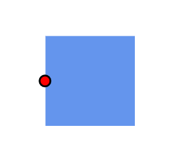
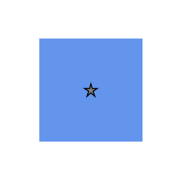

# Port Appearance in Diagram Component

## How to Customize Port Appearance

* Change the port shape by using the [Shape](https://help.syncfusion.com/cr/blazor/Syncfusion.Blazor.Diagram.Port.html#Syncfusion_Blazor_Diagram_Port_Shape) property. For available shapes, refer to Port Shapes. If you need to render a custom shape, then you can set shape to path and define path using the path data property.

* Customize port style using the [StrokeColor](https://help.syncfusion.com/cr/blazor/Syncfusion.Blazor.Diagram.ShapeStyle.html#Syncfusion_Blazor_Diagram_ShapeStyle_StrokeColor), [StrokeWidth](https://help.syncfusion.com/cr/blazor/Syncfusion.Blazor.Diagram.ShapeStyle.html#Syncfusion_Blazor_Diagram_ShapeStyle_StrokeWidth), and [Fill](https://help.syncfusion.com/cr/blazor/Syncfusion.Blazor.Diagram.ShapeStyle.html#Syncfusion_Blazor_Diagram_ShapeStyle_Fill) properties.

* Customize the port size using the [Width](https://help.syncfusion.com/cr/blazor/Syncfusion.Blazor.Diagram.Port.html#Syncfusion_Blazor_Diagram_Port_Width) and [Height](https://help.syncfusion.com/cr/blazor/Syncfusion.Blazor.Diagram.Port.html#Syncfusion_Blazor_Diagram_Port_Height) properties of port.

* Control when a port is visible using the  [Visibility](https://help.syncfusion.com/cr/blazor/Syncfusion.Blazor.Diagram.Port.html#Syncfusion_Blazor_Diagram_Port_Visibility) property.

The following code shows how to change the appearance of the port.

```cshtml
@using Syncfusion.Blazor.Diagram

<SfDiagramComponent Height="600px" Nodes="@nodes" />

@code
{
    DiagramObjectCollection<Node> nodes;

    protected override void OnInitialized()
    {
        nodes = new DiagramObjectCollection<Node>();
        // A node is created and stored in nodes array.
        Node node = new Node()
        {
            // Position of the node.
            OffsetX = 250,
            OffsetY = 250,
            // Size of the node.
            Width = 100,
            Height = 100,
            Style = new ShapeStyle() { Fill = "#6495ED", StrokeColor = "white" },
            // Initialize port collection
            Ports = new DiagramObjectCollection<PointPort>()
            {
                new PointPort()
                {
                    ID = "port1",
                    Offset = new DiagramPoint() { X = 0, Y = 0.5 },
                    Visibility = PortVisibility.Visible,
                    //Set the style for the port.
                    Style = new ShapeStyle()
                    { 
                        Fill = "red", 
                        StrokeColor = "black", 
                        StrokeWidth = 2
                    },
                    Width = 12,
                    Height = 12,
                    // Sets the shape of the port as Circle .
                    Shape = PortShapes.Circle
                }
            },
        };
        nodes.Add(node);
    }
}
```


A complete working sample can be downloaded from [GitHub](https://github.com/SyncfusionExamples/Blazor-Diagram-Examples/tree/master/UG-Samples/Ports/Appearance/Appearance)



## How to Control the Port Visibility

The [Visibility](https://help.syncfusion.com/cr/blazor/Syncfusion.Blazor.Diagram.Port.html#Syncfusion_Blazor_Diagram_Port_Visibility) of ports depends upon the properties of [Connect](https://help.syncfusion.com/cr/blazor/Syncfusion.Blazor.Diagram.PortVisibility.html#Syncfusion_Blazor_Diagram_PortVisibility_Connect), [Hidden](https://help.syncfusion.com/cr/blazor/Syncfusion.Blazor.Diagram.PortVisibility.html#Syncfusion_Blazor_Diagram_PortVisibility_Hidden), [Hover](https://help.syncfusion.com/cr/blazor/Syncfusion.Blazor.Diagram.PortVisibility.html#Syncfusion_Blazor_Diagram_PortVisibility_Hover), and [Visible](https://help.syncfusion.com/cr/blazor/Syncfusion.Blazor.Diagram.PortVisibility.html#Syncfusion_Blazor_Diagram_PortVisibility_Visible). By default, [PortVisibility](https://help.syncfusion.com/cr/blazor/Syncfusion.Blazor.Diagram.PortVisibility.html) is set to **Hidden**.

| Property | Definition |
|---|---|
| [Hover](https://help.syncfusion.com/cr/blazor/Syncfusion.Blazor.Diagram.PortVisibility.html#Syncfusion_Blazor_Diagram_PortVisibility_Hover) | Port is visible when the mouse hovers over the diagram element. |
| [Hidden](https://help.syncfusion.com/cr/blazor/Syncfusion.Blazor.Diagram.PortVisibility.html#Syncfusion_Blazor_Diagram_PortVisibility_Hidden) | Port is not visible for the diagram element. |
| [Connect](https://help.syncfusion.com/cr/blazor/Syncfusion.Blazor.Diagram.PortVisibility.html#Syncfusion_Blazor_Diagram_PortVisibility_Connect) | Specifies to visible the port when mouse hovers the diagram element and enable the port constraints as `InConnect` and `OutConnect`. |
| [Visible](https://help.syncfusion.com/cr/blazor/Syncfusion.Blazor.Diagram.PortVisibility.html#Syncfusion_Blazor_Diagram_PortVisibility_Visible) | Port is always visible for the DiagramElement. |

## How to Use Different Port Shapes 

We have provided some basic built-in [PortShapes](https://help.syncfusion.com/cr/blazor/Syncfusion.Blazor.Diagram.PortShapes.html) for the port. Find the shapes as follows.

* Circle
* Custom
* Square
* X

### How to Customize Port Shape

 Custom shapes are supported for ports. Provide custom path data instead of build-in shapes. The code example that explains how to change the custom shape for port.

 ```cshtml
@using Syncfusion.Blazor.Diagram

<SfDiagramComponent Height="600px" Nodes="@nodes" />

@code
{
    DiagramObjectCollection<Node> nodes;

    protected override void OnInitialized()
    {
        nodes = new DiagramObjectCollection<Node>();
        // A node is created and stored in nodes array.
        Node node = new Node()
        {
            // Position of the node
            OffsetX = 250,
            OffsetY = 250,
            // Size of the node.
            Width = 100,
            Height = 100,
            Style = new ShapeStyle() { Fill = "#6495ED", StrokeColor = "white" },
            // Initialize port collection.
            Ports = new DiagramObjectCollection<PointPort>()
            {
                new PointPort()
                {
                    ID = "port1",
                    Offset = new DiagramPoint() { X = 0.5, Y = 0.5 },
                    Visibility = PortVisibility.Visible,
                    //Set the style for the port.
                    Style = new ShapeStyle() { Fill = "gray", StrokeColor = "black" },
                    Width = 12, 
                    Height = 12,
                    // Sets the shape of the port as Custom .
                    Shape = PortShapes.Custom,
                    // Sets the PathData for port.
                    PathData = "M540.3643,137.9336L546.7973,159.7016L570.3633,159.7296L550.7723,171.9366L558.9053,194.9966L540.3643,179.4996L521.8223,194.9966L529.9553,171.9366L510.3633,159.7296L533.9313,159.7016L540.3643,137.9336z"
                }
            },
        };
        nodes.Add(node);
    }
}
```


A complete working sample can be downloaded from [GitHub](https://github.com/SyncfusionExamples/Blazor-Diagram-Examples/tree/master/UG-Samples/Ports/Appearance/CustomShape)



## How to Enable or Disable Port Behaviors Using Constraints

The constraints property allows enabling or disabling certain behaviors of ports. For more information about port constraints, refer to [PortConstraints](https://help.syncfusion.com/cr/blazor/Syncfusion.Blazor.Diagram.PortConstraints.html). Refer to [Constraints](https://blazor.syncfusion.com/documentation/diagram/constraints) for enabling or disabling port-related constraints.

The PortConstraints may have multiple behaviors like listed below:

| Constraints | Usage |
|---|---|
| [None](https://help.syncfusion.com/cr/blazor/Syncfusion.Blazor.Diagram.PortConstraints.html#Syncfusion_Blazor_Diagram_PortConstraints_None) |Disables all port behaviors. |
| [Draw](https://help.syncfusion.com/cr/blazor/Syncfusion.Blazor.Diagram.PortConstraints.html#Syncfusion_Blazor_Diagram_PortConstraints_Draw) |Enables or disables drawing a connector from the port. |
| [InConnect](https://help.syncfusion.com/cr/blazor/Syncfusion.Blazor.Diagram.PortConstraints.html#Syncfusion_Blazor_Diagram_PortConstraints_InConnect) |Enables or disables connecting incoming connectors to the port. |
| [OutConnect](https://help.syncfusion.com/cr/blazor/Syncfusion.Blazor.Diagram.PortConstraints.html#Syncfusion_Blazor_Diagram_PortConstraints_OutConnect) | Enables or disables connecting outgoing connectors from the port. |

## How to Add Additional Information for Port

The [AdditionalInfo](https://help.syncfusion.com/cr/blazor/Syncfusion.Blazor.Diagram.Port.html#Syncfusion_Blazor_Diagram_Port_AdditionalInfo) property allows you to maintain additional information for a port.

The following code shows how to set the `AdditionalInfo` value for a port.

```cshtml
@using Syncfusion.Blazor.Diagram
<SfDiagramComponent Height="600px" Nodes="@nodes" />
@code
{
    DiagramObjectCollection<Node> nodes;
    protected override void OnInitialized()
    {
        nodes = new DiagramObjectCollection<Node>();
        // Create a dictionary to hold additional information for the port.
        Dictionary<string, object> PortInfo = new Dictionary<string, object>();
        PortInfo.Add("portInfo", "Port A");
        // Create a port with additional info.
        PointPort port = new PointPort()
            {
                Offset = new DiagramPoint { X = 0.5, Y = 0.5 },
                Visibility=PortVisibility.Visible,
                AdditionalInfo = PortInfo
            };
        // A node is created and stored in nodes collection.
        Node node = new Node()
            {
                OffsetX = 250,
                OffsetY = 250,
                Width = 100,
                Height = 100,
                Style = new ShapeStyle()
                {
                    Fill = "#6BA5D7",
                    StrokeColor = "white"
                },
                Ports = new DiagramObjectCollection<PointPort>  { port }
            };
        // Add node.
        nodes.Add(node);
    }
}
```


A complete working sample can be downloaded from [GitHub](https://github.com/SyncfusionExamples/Blazor-Diagram-Examples/tree/master/UG-Samples/Ports/Appearance)


**Note:** Like `AdditionalInfo` for Nodes, you can set any type of value for the `AdditionalInfo` property of a port.

## See also

* [How to create a node](../nodes/nodes)

* [How to customize the ports](./appearance)

* [How to set the position of the port](./positioning)

* [How to interact with the ports](./interaction)
