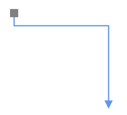
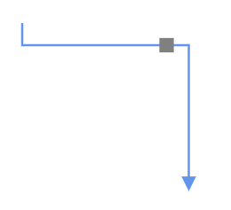

## How to create a connector port

Creating connector ports is similar to creating node ports. To define connector ports, you need to create a collection of `PathPort` and assign it to the connector’s `Ports` property.

The following code example demonstrates how to create a connector port.

```cshtml
@using Syncfusion.Blazor.Diagram

<SfDiagramComponent Height="600px" Connectors="@connectors">
</SfDiagramComponent>

@code
{
    //Define diagram's connector collection
    DiagramObjectCollection<Connector> connectors;

    protected override void OnInitialized()
    {
        // A connector is created and stored in connectors collection.
        connectors = new DiagramObjectCollection<Connector>();

        // Create connector
        Connector connector = new Connector()
        {
            ID = "connector",
            SourcePoint = new DiagramPoint() { X = 400, Y = 200 },
            TargetPoint = new DiagramPoint() { X = 550, Y = 350 },
            Type = ConnectorSegmentType.Orthogonal,
            Ports = new DiagramObjectCollection<PathPort>()
            {
                new PathPort()
                {
                    ID = "port",
                    Visibility = PortVisibility.Visible,
                    Shape = PortShapes.Square,
                }
            }
        };
        connectors.Add(connector);
    }
}
```
You can download a complete working sample from [GitHub](https://github.com/SyncfusionExamples/Blazor-Diagram-Examples/tree/master/UG-Samples/Ports/ConnectorPort/CreateConnectorPorts)

>**Note:** Port's Id should not start with numbers or special characters and should not contain special characters such as underscores(_) or spaces.

## How to set PathPosition for connector port

The `PathPosition` property allows you to place a connector port along the path of a connector. It accepts a value between 0 and 1, where:

* 0 represents the starting point of the connector.
* 1 represents the endpoint of the connector.

You can set any value between 0 and 1 to position the port at a specific location along the connector's path.

>**Note:** The default value of PathPosition is 0.5, which places the port at the midpoint of the connector.

| PathPosition value | Output |
|---|---|
| 0 |  |
| 0.5 |  |
| 1 |  |

The following code example demonstrates how to set the PathPosition for a connector port.

```cshtml
@using Syncfusion.Blazor.Diagram

<SfDiagramComponent Height="600px" Connectors="@connectors">
</SfDiagramComponent>

@code
{
    //Define diagram's connector collection
    DiagramObjectCollection<Connector> connectors;

    protected override void OnInitialized()
    {
        // A connector is created and stored in connectors collection.
        connectors = new DiagramObjectCollection<Connector>();

        // Create connector
        Connector connector = new Connector()
        {
            ID = "connector",
            SourcePoint = new DiagramPoint() { X = 400, Y = 200 },
            TargetPoint = new DiagramPoint() { X = 550, Y = 350 },
            Type = ConnectorSegmentType.Orthogonal,
            Ports = new DiagramObjectCollection<PathPort>()
            {
                new PathPort()
                {
                    ID = "port",
                    Visibility = PortVisibility.Visible,
                    Shape = PortShapes.Square,
                    PathPosition = 0,
                }
            }
        };
        connectors.Add(connector);
    }
}
```
You can download a complete working sample from [GitHub](https://github.com/SyncfusionExamples/Blazor-Diagram-Examples/tree/master/UG-Samples/Ports/ConnectorPort/ConnectorPortPathPosition)

## How to connect a connector to a port

Connector ports are used to establish connections between connectors. To create such a connection, set the `SourcePortID` or `TargetPortID` property to the ID of the corresponding port on the connector.

The following code example demonstrates how to connect one connector to a port on another connector.

```cshtml
@using Syncfusion.Blazor.Diagram

<SfDiagramComponent Height="600px" Connectors="@connectors">
</SfDiagramComponent>

@code
{
    // Initialize connector collection
    DiagramObjectCollection<Connector> connectors = new DiagramObjectCollection<Connector>();

    protected override void OnInitialized()
    {
        Connector connector1 = new Connector()
        {
            ID = "connector1",
            SourcePoint = new DiagramPoint() { X = 200, Y = 100 },
            TargetPoint = new DiagramPoint() { X = 350, Y = 250 },
            Type = ConnectorSegmentType.Bezier,
            Ports = new DiagramObjectCollection<PathPort>()
            {
                new PathPort()
                {
                    ID = "port",
                    Visibility = PortVisibility.Visible,
                    Shape = PortShapes.Square,
                }
            }
        };

        Connector connector2 = new Connector()
        {
            ID = "connector2",
            SourcePoint = new DiagramPoint() { X = 600, Y = 100 },
            TargetPoint = new DiagramPoint() { X = 750, Y = 250 },
            Type = ConnectorSegmentType.Bezier,
            Ports = new DiagramObjectCollection<PathPort>()
            {
                new PathPort()
                {
                    ID = "port",
                    Visibility = PortVisibility.Visible,
                    Shape = PortShapes.Square,
                }
            }
        };
        Connector connector3 = new Connector()
        {
            ID = "connector3",
            SourceID = "connector1",
            SourcePortID = "port",
            TargetID = "connector2",
            TargetPortID = "port",
            Type = ConnectorSegmentType.Straight
        };
        connectors.Add(connector1);
        connectors.Add(connector2);
        connectors.Add(connector3);
    }
}
```
You can download a complete working sample from [GitHub](https://github.com/SyncfusionExamples/Blazor-Diagram-Examples/tree/master/UG-Samples/Ports/ConnectorPort/ConnectorPortConnection)

## See also

* [How to customize the ports](./appearance.md)

* [How to set the position of the port](./positioning.md)

* [How to interact with the ports](./interaction.md)