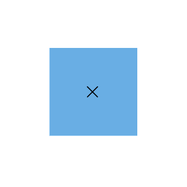

# Interaction

The port can be dragged in the diagram area and create the connector over the port by using the [`port constraints`](https://help.syncfusion.com/cr/blazor/Syncfusion.Blazor.Diagrams.PortConstraints.html).

## Drag

Diagram provides the support to drag the port interactively, it can be dragged out of the node bounds.

The following code explains how to drag the port.

```csharp
@using Syncfusion.Blazor.Diagrams
@using System.Collections.ObjectModel

<SfDiagram Height="600px" Nodes="@NodeCollection">
</SfDiagram>
@code{

    public ObservableCollection<DiagramNode> NodeCollection = new ObservableCollection<DiagramNode>() { };
    protected override void OnInitialized()
    {
        // A node is created and stored in nodes array.
        DiagramNode node1 = new DiagramNode()
        {
            // Position of the node
            OffsetX = 250, OffsetY = 250,
            // Size of the node
            Width = 100, Height = 100,
            Style = new NodeShapeStyle() { Fill = "#6BA5D7", StrokeColor = "white" },
            // Initialize port collection
            Ports = new ObservableCollection<DiagramPort>() {
            new DiagramPort() {
                Id = "port1",
                Offset = new NodePortOffset() { X = 0.5, Y = 0.5 },
                Visibility = PortVisibility.Visible,
                //Set the style for the port
                Style= new PortShapeStyle(){ Fill = "gray", StrokeColor = "black"},
                // Sets the shape of the port as Circle
                Width = 12, Height = 12, Shape = PortShapes.X,
                // Enable drag operation for Port
                Constraints = PortConstraints.Default|PortConstraints.Drag

            }},
        };
        NodeCollection.Add(node1);
    }
}
```



## Draw

Diagram provides the support to draw the connector in the port.

The following code explains how to draw the connector by using the port constraints.

```csharp
@using Syncfusion.Blazor.Diagrams
@using System.Collections.ObjectModel

<SfDiagram Height="600px" Nodes="@NodeCollection">
</SfDiagram>
@code{

    public ObservableCollection<DiagramNode> NodeCollection = new ObservableCollection<DiagramNode>() { };
    protected override void OnInitialized()
    {
        // A node is created and stored in nodes array.
        DiagramNode node1 = new DiagramNode()
        {
            // Position of the node
            OffsetX = 250, OffsetY = 250,
            // Size of the node
            Width = 100, Height = 100,
            Style = new NodeShapeStyle() { Fill = "#6BA5D7", StrokeColor = "white" },
            // Initialize port collection
            Ports = new ObservableCollection<DiagramPort>() {
            new DiagramPort() {
                Id = "port1",
                Offset = new NodePortOffset() { X = 1, Y = 0.5 },
                Visibility = PortVisibility.Visible,
                //Set the style for the port
                Style = new PortShapeStyle(){ Fill = "gray", StrokeColor = "black"},
                // Sets the shape of the port as Circle
                Width = 12, Height = 12, Shape = PortShapes.Circle,
                // Enable drag operation for Port
                Constraints = PortConstraints.Default | PortConstraints.Draw

            }},
        };
        NodeCollection.Add(node1);
    }
}
```


## See also

* [`How to create a node`](../nodes/nodes)

* [`How to customize the ports`](./appearance)

* [`How to set the position of the port`](./positioning)