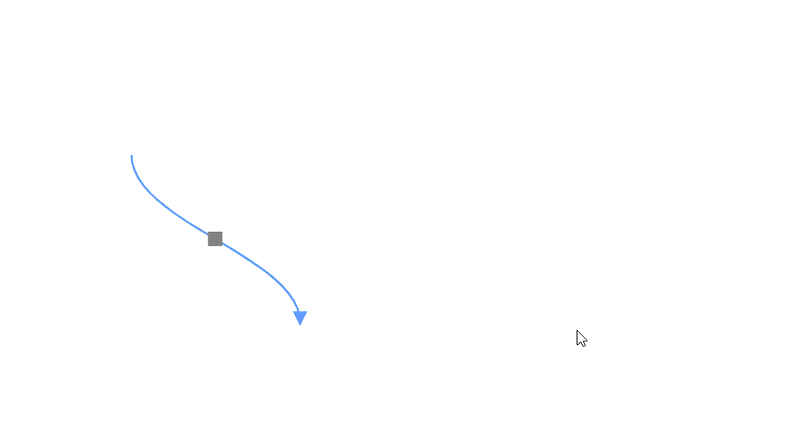
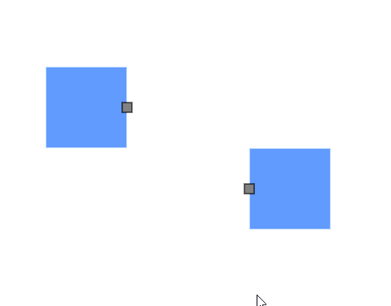

# Port Interaction in Blazor Diagram Component

The port can be used to create a connector by enabling the `Draw` in the [PortConstraints](https://help.syncfusion.com/cr/blazor/Syncfusion.Blazor.Diagram.PortConstraints.html).

## How to Draw Connector from Node Port
You can draw connectors from the node port by enabling Draw constraints to the Constraints property. By default, the connector segment type is set to [Orthogonal](https://help.syncfusion.com/cr/blazor/Syncfusion.Blazor.Diagram.ConnectorSegmentType.html#Syncfusion_Blazor_Diagram_ConnectorSegmentType_Orthogonal).

The following code explains how to draw the connector by using the port constraints.

```cshtml
@using Syncfusion.Blazor.Diagram

<SfDiagramComponent Height="600px" Nodes="@nodes" />

@code
{
    DiagramObjectCollection<Node> nodes;

    protected override void OnInitialized()
    {
        nodes = new DiagramObjectCollection<Node>();
        // A node is created and stored in the nodes array.
        Node node = new Node()
        {
            // Position of the node.
            OffsetX = 250,
            OffsetY = 250,
            // Size of the node.
            Width = 100,
            Height = 100,
            Style = new ShapeStyle() { Fill = "#6495ED", StrokeColor = "white" },
            // Initialize port collection.
            Ports = new DiagramObjectCollection<PointPort>()
            {
                new PointPort()
                {
                    ID = "port1",
                    Offset = new DiagramPoint() { X = 1, Y = 0.5 },
                    Visibility = PortVisibility.Visible,
                    //Set the style for the port.
                    Style = new ShapeStyle()
                    { 
                        Fill = "gray", 
                        StrokeColor = "black"
                     }, 
                    Width = 12, 
                    Height = 12, 
                    // Sets the shape of the port as Square.
                    Shape = PortShapes.Square,
                    // Enable draw operation for Port.
                    Constraints = PortConstraints.Default | PortConstraints.Draw
                }
            },
        };
        nodes.Add(node);
    }
}
```
You can download a complete working sample from [GitHub](https://github.com/SyncfusionExamples/Blazor-Diagram-Examples/tree/master/UG-Samples/Ports/Interaction/DrawConstraints)


## How to Draw Connector from Connector Port
You can draw connectors from the connector port by enabling Draw constraints to the Constraints property. By default, the connector segment type is set to [Orthogonal](https://help.syncfusion.com/cr/blazor/Syncfusion.Blazor.Diagram.ConnectorSegmentType.html#Syncfusion_Blazor_Diagram_ConnectorSegmentType_Orthogonal).

The following code explains how to draw the connector by using the port constraints.

```cshtml
@using Syncfusion.Blazor.Diagram

<SfDiagramComponent Height="600px" Connectors="@connectors">
</SfDiagramComponent>

@code
{
    //Define diagram's connector collection
    DiagramObjectCollection<Connector> connectors;

    protected override void OnInitialized()
    {
        // A connector is created and stored in connectors collection.
        connectors = new DiagramObjectCollection<Connector>();

        // Create an orthogonal connector
        Connector connector = new Connector()
        {
            ID = "connector",
            SourcePoint = new DiagramPoint() { X = 400, Y = 200 },
            TargetPoint = new DiagramPoint() { X = 550, Y = 350 },
            Type = ConnectorSegmentType.Bezier,
            Ports = new DiagramObjectCollection<ConnectorPort>()
            {
                new ConnectorPort()
                {
                    ID = "port",
                    Visibility = PortVisibility.Visible,
                    Shape = PortShapes.Square,
                    Constraints = PortConstraints.Default | PortConstraints.Draw
                }
            }
        };
        connectors.Add(connector);
    }
}
```
You can download a complete working sample from [GitHub](https://github.com/SyncfusionExamples/Blazor-Diagram-Examples/tree/master/UG-Samples/Ports/Interaction/ConnectorPortDraw)



## How to Draw Different Connector Types from Port

You can change the default connector type while drawing the connector from the port by setting the specific connector type instance to the [DrawingObject](https://help.syncfusion.com/cr/blazor/Syncfusion.Blazor.Diagram.SfDiagramComponent.html#Syncfusion_Blazor_Diagram_SfDiagramComponent_DrawingObject) property. This enables the drawing of various connector types from the port, including:
* Straight
* Bezier
* Polyline
* Orthogonal
* Free Hand


The following code explains how to draw the connector by using the port constraints.

```cshtml
@using Syncfusion.Blazor.Diagram

<SfDiagramComponent @ref="diagram" Height="600px" Nodes="@nodes" DrawingObject="DrawingObject"/>

@code
{
    DiagramObjectCollection<Node> nodes;
    public SfDiagramComponent diagram;
    IDiagramObject DrawingObject;
    protected override void OnInitialized()
    {
        nodes = new DiagramObjectCollection<Node>();
        // Nodes are created and stored in the nodes array.
        Node node1 = new Node()
        {
            // Position of the node.
            OffsetX = 250,
            OffsetY = 250,
            // Size of the node.
            Width = 100,
            Height = 100,
            Style = new ShapeStyle() { Fill = "#6495ED", StrokeColor = "white" },
            // Initialize port collection.
            Ports = new DiagramObjectCollection<PointPort>()
            {
                new PointPort()
                {
                    ID = "port1",
                    Offset = new DiagramPoint() { X = 1, Y = 0.5 },
                    Visibility = PortVisibility.Visible,
                    //Set the style for the port.
                    Style= new ShapeStyle(){ Fill = "gray", StrokeColor = "black"},
                    // Sets the shape of the port as Circle.
                    Width = 12, Height = 12, Shape = PortShapes.Square,
                    // Enable drag operation for Port.
                    Constraints = PortConstraints.Default|PortConstraints.Draw
                }
            },
        };
        nodes.Add(node1);
        Node node2 = new Node()
        {
            // Position of the node.
            OffsetX = 500,
            OffsetY = 350,
            // Size of the node.
            Width = 100,
            Height = 100,
            Style = new ShapeStyle() { Fill = "#6495ED", StrokeColor = "white" },
            // Initialize port collection.
            Ports = new DiagramObjectCollection<PointPort>()
            {
                new PointPort()
                {
                    ID = "port1",
                    Offset = new DiagramPoint() { X = 0, Y = 0.5 },
                    Visibility = PortVisibility.Visible,
                    //Set the style for the port.
                    Style= new ShapeStyle(){ Fill = "gray", StrokeColor = "black"},
                    // Sets the shape of the port as Circle.
                    Width = 12, Height = 12, Shape = PortShapes.Square,
                    // Enable drag operation for Port.
                    Constraints = PortConstraints.Default|PortConstraints.Draw
                }
            },
        };
        nodes.Add(node2);
        DrawingObject = new Connector()
        {
            ID = "connector1",
            Type = ConnectorSegmentType.Bezier,            
        };
    }
}
```
You can download a complete working sample from [GitHub](https://github.com/SyncfusionExamples/Blazor-Diagram-Examples/tree/master/UG-Samples/Ports/Interaction/DrawConstraintsWithDrawingObject).


## See also

* [How to create a node](../nodes/nodes)

* [How to customize the ports](./appearance)

* [How to set the position of the port](./positioning)
