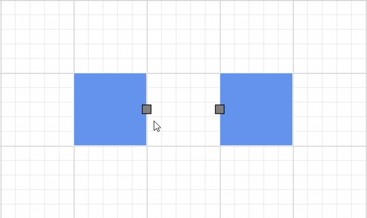
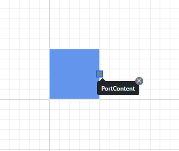

# Interaction in Blazor Diagram Component

The port can be used to create connector by enabling the `Draw` in the [PortConstraints](https://help.syncfusion.com/cr/blazor/Syncfusion.Blazor.Diagram.PortConstraints.html).

## How to draw connector from the port
You can draw connectors from the port by enabling Draw constraints to the Constraints property. By default, the connector segment type is set to [Orthogonal](https://help.syncfusion.com/cr/blazor/Syncfusion.Blazor.Diagram.ConnectorSegmentType.html#Syncfusion_Blazor_Diagram_ConnectorSegmentType_Orthogonal).

The following code explains how to draw the connector by using the port constraints.

```cshtml
@using Syncfusion.Blazor.Diagram

<SfDiagramComponent Height="600px" Nodes="@nodes" />

@code
{
    DiagramObjectCollection<Node> nodes;

    protected override void OnInitialized()
    {
        nodes = new DiagramObjectCollection<Node>();
        // A node is created and stored in the nodes array.
        Node node = new Node()
        {
            // Position of the node.
            OffsetX = 250,
            OffsetY = 250,
            // Size of the node.
            Width = 100,
            Height = 100,
            Style = new ShapeStyle() { Fill = "#6495ED", StrokeColor = "white" },
            // Initialize port collection.
            Ports = new DiagramObjectCollection<PointPort>()
            {
                new PointPort()
                {
                    ID = "port1",
                    Offset = new DiagramPoint() { X = 1, Y = 0.5 },
                    Visibility = PortVisibility.Visible,
                    //Set the style for the port.
                    Style = new ShapeStyle()
                    { 
                        Fill = "gray", 
                        StrokeColor = "black"
                     }, 
                    Width = 12, 
                    Height = 12, 
                    // Sets the shape of the port as Square.
                    Shape = PortShapes.Square,
                    // Enable draw operation for Port.
                    Constraints = PortConstraints.Default | PortConstraints.Draw
                }
            },
        };
        nodes.Add(node);
    }
}
```
You can download a complete working sample from [GitHub](https://github.com/SyncfusionExamples/Blazor-Diagram-Examples/tree/master/UG-Samples/Ports/Interaction/DrawConstraints)


## How to draw different types of connector from the port

You can change the default connector type while drawing the connector from the port by setting the specific connector type instance to the[DrawingObject](https://help.syncfusion.com/cr/blazor/Syncfusion.Blazor.Diagram.SfDiagramComponent.html#Syncfusion_Blazor_Diagram_SfDiagramComponent_DrawingObject) property. This enables the drawing of various connector types from the port, including:
* Straight
* Bezier
* Polyline
* Orthogonal
* Free Hand


The following code explains how to draw the connector by using the port constraints.

```cshtml
@using Syncfusion.Blazor.Diagram

<SfDiagramComponent @ref="diagram" Height="600px" Nodes="@nodes" DrawingObject="DrawingObject"/>

@code
{
    DiagramObjectCollection<Node> nodes;
    public SfDiagramComponent diagram;
    IDiagramObject DrawingObject;
    protected override void OnInitialized()
    {
        nodes = new DiagramObjectCollection<Node>();
        // Nodes are created and stored in the nodes array.
        Node node1 = new Node()
        {
            // Position of the node.
            OffsetX = 250,
            OffsetY = 250,
            // Size of the node.
            Width = 100,
            Height = 100,
            Style = new ShapeStyle() { Fill = "#6495ED", StrokeColor = "white" },
            // Initialize port collection.
            Ports = new DiagramObjectCollection<PointPort>()
            {
                new PointPort()
                {
                    ID = "port1",
                    Offset = new DiagramPoint() { X = 1, Y = 0.5 },
                    Visibility = PortVisibility.Visible,
                    //Set the style for the port.
                    Style= new ShapeStyle(){ Fill = "gray", StrokeColor = "black"},
                    // Sets the shape of the port as Circle.
                    Width = 12, Height = 12, Shape = PortShapes.Square,
                    // Enable drag operation for Port.
                    Constraints = PortConstraints.Default|PortConstraints.Draw
                }
            },
        };
        nodes.Add(node1);
        Node node2 = new Node()
        {
            // Position of the node.
            OffsetX = 500,
            OffsetY = 350,
            // Size of the node.
            Width = 100,
            Height = 100,
            Style = new ShapeStyle() { Fill = "#6495ED", StrokeColor = "white" },
            // Initialize port collection.
            Ports = new DiagramObjectCollection<PointPort>()
            {
                new PointPort()
                {
                    ID = "port1",
                    Offset = new DiagramPoint() { X = 0, Y = 0.5 },
                    Visibility = PortVisibility.Visible,
                    //Set the style for the port.
                    Style= new ShapeStyle(){ Fill = "gray", StrokeColor = "black"},
                    // Sets the shape of the port as Circle.
                    Width = 12, Height = 12, Shape = PortShapes.Square,
                    // Enable drag operation for Port.
                    Constraints = PortConstraints.Default|PortConstraints.Draw
                }
            },
        };
        nodes.Add(node2);
        DrawingObject = new Connector()
        {
            ID = "connector1",
            Type = ConnectorSegmentType.Bezier,            
        };
    }
}
```
You can download a complete working sample from [GitHub](https://github.com/SyncfusionExamples/Blazor-Diagram-Examples/tree/master/UG-Samples/Ports/Interaction/DrawConstraintsWithDrawingObject).


## How to set tooltip for ports

The diagram provides support to show a tooltip when the mouse hovers over any port. The tooltip can be customized for each port.To achieve this, the tooltip property of the diagram model must be configured to contain the tooltip [Content](https://help.syncfusion.com/cr/blazor/Syncfusion.Blazor.Diagram.DiagramTooltip.html#Syncfusion_Blazor_Diagram_DiagramTooltip_Content) and to [Position](https://help.syncfusion.com/cr/blazor/Syncfusion.Blazor.Diagram.DiagramTooltip.html#Syncfusion_Blazor_Diagram_DiagramTooltip_Position) it appropriately. By default, tooltips are not displayed; you need to add the tooltip as shown in the following example.


```cshtml
@using Syncfusion.Blazor.Diagram
<SfDiagramComponent Width="1000px" Height="500px" Nodes="@nodes"  />
@code
{
    DiagramObjectCollection<Node> nodes;
    
    protected override void OnInitialized()
    {
        nodes = new DiagramObjectCollection<Node>();
        Node node = new Node()
        {
            ID = "node1",
            OffsetX = 250,
            OffsetY = 250,
            Width = 100,
            Height = 100,
            Style = new ShapeStyle() 
            { 
                Fill = "#6495ED", 
                StrokeColor = "white" 
            },
            Ports = new DiagramObjectCollection<PointPort>()
            {
                new PointPort(){
                    ID="Port1",
                    Style = new ShapeStyle(){ Fill = "gray" },
                    Offset = new DiagramPoint() { X = 1, Y = 0.5 },
                    Visibility = PortVisibility.Visible,
                    Tooltip = new DiagramTooltip(){ Content = "OutConnectPort"},
                    Constraints = PortConstraints.Default | PortConstraints.Draw
                } 
            }
        };
        nodes.Add(node);
        Node node2 = new Node()
        {
             ID = "node2",
             OffsetX = 450,
             OffsetY = 250,
             Width = 100,
             Height = 100,
             Style = new ShapeStyle()
             {
                 Fill = "#6495ED",
                 StrokeColor = "white"
             },
             Ports = new DiagramObjectCollection<PointPort>()
             {
                 new PointPort()
                 {
                    ID="Port2",
                    Style = new ShapeStyle(){ Fill = "gray" },
                    Offset = new DiagramPoint() { X = 0, Y = 0.5},
                    Visibility = PortVisibility.Visible,
                    Tooltip = new DiagramTooltip(){ Content = "InConnectPort"},
                    Constraints = PortConstraints.Default | PortConstraints.Draw
                 }
             }
        };
        nodes.Add(node2);  
    }
}
```
You can download a complete working sample from [GitHub](https://github.com/SyncfusionExamples/Blazor-Diagram-Examples/tree/master/UG-Samples/Ports/ActionofPorts/TooltipForSpecificPort)



For more information about tooltip, refer to [Tooltip](https://blazor.syncfusion.com/documentation/diagram/tool-tip)

## How to set sticky tooltip for ports

With this mode set to `true`, Tooltips for ports can be made to show up on the screen as long as the close icon is pressed. In this mode, close icon is attached to the Tooltip located at the top right corner. This mode can be enabled or disabled using the `IsSticky` property in tooltip. By default, the value of the IsSticky property is set to false.

The following code example demonstrates how to set the IsSticky property to true for the ports:

```cshtml
@using Syncfusion.Blazor.Diagram
@using Syncfusion.Blazor.Popups
@using Syncfusion.Blazor.Buttons
<SfDiagramComponent @ref="@diagram" Width="1000px" Height="500px" Nodes="@nodes" />
@code
{
    //Define diagram's nodes collection
    DiagramObjectCollection<Node> nodes;
    //Reference the diagram
    SfDiagramComponent diagram;
    protected override void OnInitialized()
    {
        //Intialize diagram's nodes collection
        nodes = new DiagramObjectCollection<Node>();
        Node node = new Node()
            {
                ID = "node1",
                OffsetX = 100,
                OffsetY = 100,
                Width = 100,
                Height = 100,
                Style = new ShapeStyle()
                {
                    Fill = "#6495ED",
                    StrokeColor = "white"
                },
                Tooltip = new DiagramTooltip() { Content = "NodeContent", IsSticky = true },
                Constraints = NodeConstraints.Default | NodeConstraints.Tooltip,
                Ports = new DiagramObjectCollection<PointPort>()
                {
                new PointPort(){
                    ID="Port1",
                    Style = new ShapeStyle(){ Fill = "gray" },
                    Offset = new DiagramPoint() { X = 1, Y = 0.5 },
                    Visibility = PortVisibility.Visible,
                    Tooltip = new DiagramTooltip(){ Content = "PortContent" , IsSticky = true},
                    Constraints = PortConstraints.Default | PortConstraints.Draw
                }
                },
            };
        nodes.Add(node);
    }
}
```
You can download a complete working sample from [GitHub](https://github.com/SyncfusionExamples/Blazor-Diagram-Examples/tree/master/UG-Samples/Tooltip/)



For more information about tooltip, refer to [Tooltip](https://blazor.syncfusion.com/documentation/diagram/tool-tip)

## See also

* [How to create a node](../nodes/nodes)

* [How to customize the ports](./appearance)

* [How to set the position of the port](./positioning)
