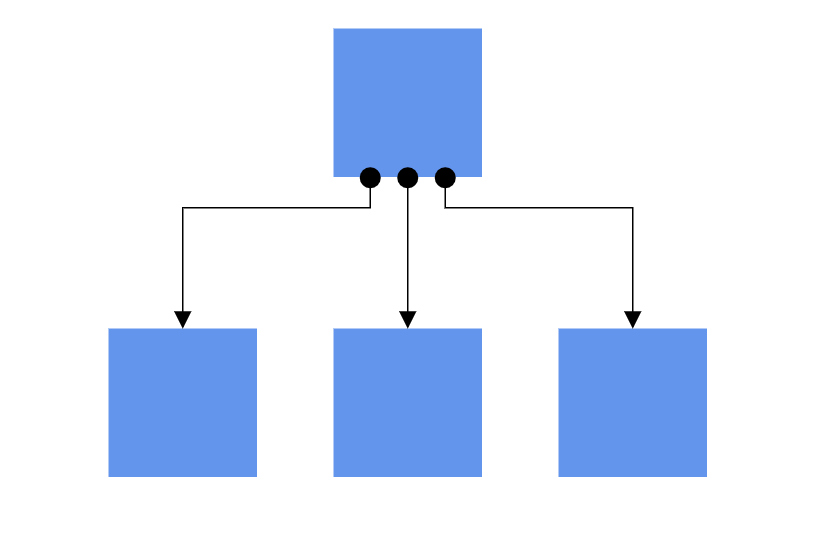
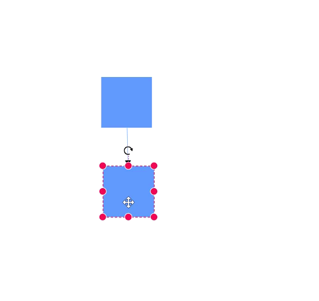
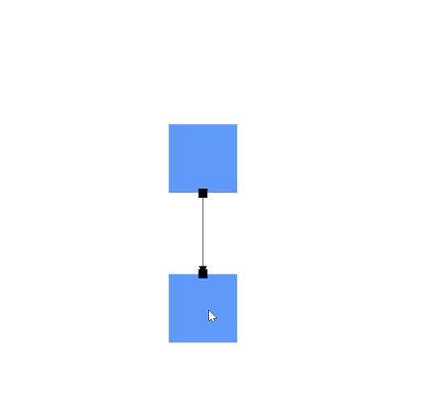

# Ports in Blazor Diagram Component

A [Port](https://help.syncfusion.com/cr/blazor/Syncfusion.Blazor.Diagram.Port.html) is a connection point on a Node where you can glue the connectors. When you glue a connector to a node or port, they remain connected even if one of the nodes is moved.



## How to Create Node to Node and Port to Port Connections

There are two main types of connections: node to node and port to port. The difference between these two connections is whether or not a connector remains glued to a specific connection point when you move the attached node or connector.

A node to node connection is one where the connector will move around the node as you move the node. Diagram will always ensure the connector is the shortest, most direct line possible. You can create a node to node connection by selecting the entire node (rather than the port) and connect it to another shape (rather than to a port).



Ports act as connection points on a node and allows creating connections with only those specific points, as shown in the following image.



## How to Create a Node Port

To add a connection port, define a port object and add it to the node’s ports collection. The [Offset](https://help.syncfusion.com/cr/blazor/Syncfusion.Blazor.Diagram.PointPort.html#Syncfusion_Blazor_Diagram_PointPort_Offset) property of the port accepts an object of fractions and is used to determine the position of ports. The following code explains how to add ports when initializing the node.

To learn more about creating and customizing ports in the Blazor Diagram, watch the following video:



```cshtml
@using Syncfusion.Blazor.Diagram

<SfDiagramComponent Height="600px" Nodes="@_nodes" />

@code
{
    private DiagramObjectCollection<Node> _nodes;

    protected override void OnInitialized()
    {
        // A node is created and stored in nodes collection.
        nodes = new DiagramObjectCollection<Node>();
        Node node = new Node()
        {
            // Position of the node.
            OffsetX = 250,
            OffsetY = 250,
            // Size of the node.
            Width = 100,
            Height = 100,
            Style = new ShapeStyle() { Fill = "#6495ED", StrokeColor = "white" },
            // Initialize port collection.
            Ports = new DiagramObjectCollection<PointPort>()
            {
               new PointPort()
               {
                   Style = new ShapeStyle(){ Fill = "gray" },
                   // Sets the position for the port.
                   Offset = new DiagramPoint() { X = 0.5, Y = 0.5 }, 
                   Visibility = PortVisibility.Visible
               }
            }
        };
        _nodes.Add(node);
    }
}
```
A complete working sample can be downloaded from [GitHub](https://github.com/SyncfusionExamples/Blazor-UG-Examples/blob/master/Diagram/Server/Pages/Ports/ActionofPorts/CreatePorts.razor)



>**Note:** Port ID should not start with numbers or special characters and should not contain special characters such as underscores(_) or spaces.

### How to Connect a Connector to a Node Port

Node ports are used to establish connections between node ports, connector ports, and nodes. To create such a connection, set the connector’s [SourceID](https://help.syncfusion.com/cr/blazor/Syncfusion.Blazor.Diagram.Connector.html#Syncfusion_Blazor_Diagram_Connector_SourceID) or [TargetID](https://help.syncfusion.com/cr/blazor/Syncfusion.Blazor.Diagram.Connector.html#Syncfusion_Blazor_Diagram_Connector_TargetID) property to the ID of the node and the [SourcePortID](https://help.syncfusion.com/cr/blazor/Syncfusion.Blazor.Diagram.Connector.html#Syncfusion_Blazor_Diagram_Connector_SourcePortID) or [TargetPortID](https://help.syncfusion.com/cr/blazor/Syncfusion.Blazor.Diagram.Connector.html#Syncfusion_Blazor_Diagram_Connector_TargetPortID) property to the ID of the corresponding port on the node.

The following code example demonstrates how to connect connectors to ports on nodes.

```cshtml
@using Syncfusion.Blazor.Diagram

<SfDiagramComponent Height="600px" Nodes="@_nodes" Connectors="@_connectors">
</SfDiagramComponent>

@code
{
    // Initialize node and connector collections
    private DiagramObjectCollection<Node> _nodes = new DiagramObjectCollection<Node>();
    private DiagramObjectCollection<Connector> _connectors = new DiagramObjectCollection<Connector>();

    protected override void OnInitialized()
    {
        Node node1 = new Node()
            {
                ID = "node1",
                OffsetX = 200,
                OffsetY = 200,
                Width = 100,
                Height = 100,
                Style = new ShapeStyle() { Fill = "#6495ED", StrokeColor = "white" },
                Ports = new DiagramObjectCollection<PointPort>()
            {
                new PointPort()
                {
                    ID = "port1",
                    Offset = new DiagramPoint() { X = 1, Y = 0.5 },
                    Visibility = PortVisibility.Visible,
                    Shape = PortShapes.Circle,
                }
            }
            };

        Node node2 = new Node()
            {
                ID = "node2",
                OffsetX = 400,
                OffsetY = 200,
                Width = 100,
                Height = 100,
                Style = new ShapeStyle() { Fill = "#6495ED", StrokeColor = "white" },
                Ports = new DiagramObjectCollection<PointPort>()
            {
                new PointPort()
                {
                    ID = "port1",
                    Offset = new DiagramPoint() { X = 0, Y = 0.5 },
                    Visibility = PortVisibility.Visible,
                    Shape = PortShapes.Circle,
                }
            }
            };

        // Connector connecting node1's port1 to node2's port1
        Connector connector1 = new Connector()
            {
                ID = "connector1",
                SourceID = "node1",
                SourcePortID = "port1",
                TargetID = "node2",
                TargetPortID = "port1",
                Type = ConnectorSegmentType.Straight,
                Style = new ShapeStyle() { StrokeColor = "#6495ED", StrokeWidth = 2 }
            };

        _nodes.Add(node1);
        _nodes.Add(node2);
        _connectors.Add(connector1);
    }
}
```


A complete working sample can be downloaded from [GitHub](https://github.com/SyncfusionExamples/Blazor-UG-Examples/blob/master/Diagram/Server/Pages/Ports/NodePortConnection/NodePortConnection.razor).

## How to Create a Connector Port

Creating connector ports is similar to creating node ports. Define a collection of `ConnectorPort` and assign it to the connector’s `Ports` property.

The following code example demonstrates how to create a connector port.

```cshtml
@using Syncfusion.Blazor.Diagram

<SfDiagramComponent Height="600px" Connectors="@_connectors">
</SfDiagramComponent>

@code
{
    //Define diagram's connector collection
    private DiagramObjectCollection<Connector> _connectors;

    protected override void OnInitialized()
    {
        // A connector is created and stored in connectors collection.
        _connectors = new DiagramObjectCollection<Connector>();

        // Create connector
        Connector connector = new Connector()
        {
            ID = "connector",
            SourcePoint = new DiagramPoint() { X = 400, Y = 200 },
            TargetPoint = new DiagramPoint() { X = 550, Y = 350 },
            Type = ConnectorSegmentType.Orthogonal,
            Ports = new DiagramObjectCollection<ConnectorPort>()
            {
                new ConnectorPort()
                {
                    ID = "port",
                    Visibility = PortVisibility.Visible,
                    Shape = PortShapes.Square,
                }
            }
        };
        _connectors.Add(connector);
    }
}
```


A complete working sample can be downloaded from [GitHub](https://github.com/SyncfusionExamples/Blazor-UG-Examples/blob/master/Diagram/Server/Pages/Ports/ConnectorPort/CreateConnectorPorts.razor)

### How to Connect a Connector to a Connector Port

Connector ports are used to establish connections between node ports, connector ports, and nodes. To create such a connection, set the connector’s `SourcePortID` or `TargetPortID` property to the `ID` of the corresponding port on the connector.

The following code example demonstrates how to connect one connector to a port on another connector.

```cshtml
@using Syncfusion.Blazor.Diagram

<SfDiagramComponent Height="600px" Connectors="@connectors">
</SfDiagramComponent>

@code
{
    // Initialize connector collection
    DiagramObjectCollection<Connector> connectors = new DiagramObjectCollection<Connector>();

    protected override void OnInitialized()
    {
        Connector connector1 = new Connector()
        {
            ID = "connector1",
            SourcePoint = new DiagramPoint() { X = 200, Y = 100 },
            TargetPoint = new DiagramPoint() { X = 350, Y = 250 },
            Type = ConnectorSegmentType.Bezier,
            Ports = new DiagramObjectCollection<ConnectorPort>()
            {
                new ConnectorPort()
                {
                    ID = "port",
                    Visibility = PortVisibility.Visible,
                    Shape = PortShapes.Square,
                }
            }
        };

        Connector connector2 = new Connector()
        {
            ID = "connector2",
            SourcePoint = new DiagramPoint() { X = 600, Y = 100 },
            TargetPoint = new DiagramPoint() { X = 750, Y = 250 },
            Type = ConnectorSegmentType.Bezier,
            Ports = new DiagramObjectCollection<ConnectorPort>()
            {
                new ConnectorPort()
                {
                    ID = "port",
                    Visibility = PortVisibility.Visible,
                    Shape = PortShapes.Square,
                }
            }
        };
        Connector connector3 = new Connector()
        {
            ID = "connector3",
            SourceID = "connector1",
            SourcePortID = "port",
            TargetID = "connector2",
            TargetPortID = "port",
            Type = ConnectorSegmentType.Straight
        };
        connectors.Add(connector1);
        connectors.Add(connector2);
        connectors.Add(connector3);
    }
}
```


A complete working sample can be downloaded from [GitHub](https://github.com/SyncfusionExamples/Blazor-UG-Examples/blob/master/Diagram/Server/Pages/Ports/ConnectorPort/ConnectorPortConnection.razor)

## How to Add Ports at Runtime

Add ports at runtime to the nodes collection in the Diagram component by using the `Add` method.

The following code explains how to add ports to a node at runtime by using the `Add` method. The port [ID](https://help.syncfusion.com/cr/blazor/Syncfusion.Blazor.Diagram.Port.html#Syncfusion_Blazor_Diagram_Port_ID) property is  define a unique ID for the port and it is further used to find the port at runtime.
If an `ID` is not set, then default `ID` is assigned automatically.

```cshtml
@using Syncfusion.Blazor.Diagram
@using Syncfusion.Blazor.Buttons


<SfButton Content="AddPorts" OnClick="@AddPorts" />
<SfDiagramComponent Height="600px" Nodes="@_nodes" />

@code
{
    private DiagramObjectCollection<Node> _nodes;
    protected override void OnInitialized()
    {
        //A node is created and stored in nodes array.
        _nodes = new DiagramObjectCollection<Node>();
        Node node = new Node()
        {
            //Position of the node.
            OffsetX = 250,
            OffsetY = 250,
            //Size of the node.
            Width = 100,
            Height = 100,
            Style = new ShapeStyle() { Fill = "#6495ED", StrokeColor = "white" },
        };
        _nodes.Add(node);
    }

    private void AddPorts()
    {
        PointPort port = new PointPort()
        {
            ID = "port",
            Style = new ShapeStyle(){ Fill = "gray" }, 
            Offset = new DiagramPoint() { X = 0, Y = 0.5 },
            Visibility = PortVisibility.Visible
        };
        // Initialize port collection.
        _nodes[0].Ports.Add(port);
    }
}

```


A complete working sample can be downloaded from [GitHub](https://github.com/SyncfusionExamples/Blazor-UG-Examples/blob/master/Diagram/Server/Pages/Ports/ActionofPorts/AddPort.razor)

Also, a port can be added at runtime by using the `AddAsync` method. The `await` operator suspends evaluation of the enclosing async method until the asynchronous operation represented by its operand completes.

The following code explains how to add ports to a node at runtime by using the `AddAsync` method.

```csharp
//Method to add port at runtime
private async void AddPorts()
{
    PointPort port = new PointPort()
    {
        Style = new ShapeStyle() { Fill = "gray" }, 
        Offset = new DiagramPoint() { X = 0, Y = 0.5 }, 
        Visibility = PortVisibility.Visible
    };
    await ((_nodes[0].Ports) as DiagramObjectCollection<PointPort>).AddAsync(port);
}
```
A complete working sample can be downloaded from [GitHub](https://github.com/SyncfusionExamples/Blazor-UG-Examples/blob/master/Diagram/Server/Pages/Ports/ActionofPorts/AddPortsAsync.razor)


## How to Add Multiple Ports at Runtime

Add multiple ports at runtime by using the `Add` method on the port collection. The following code explains how to add two or more ports to a node at runtime.

The port [ID](https://help.syncfusion.com/cr/blazor/Syncfusion.Blazor.Diagram.Port.html#Syncfusion_Blazor_Diagram_Port_ID) property defines a unique ID for the port and it is further used to find the port at runtime. If an `ID` is not set, then default `ID` is assigned automatically.

```cshtml
@using Syncfusion.Blazor.Diagram
@using Syncfusion.Blazor.Buttons

<SfButton Content="AddPorts" OnClick="@AddPorts" />
<SfDiagramComponent Height="600px" Nodes="@_nodes" />

@code
{
    private DiagramObjectCollection<Node> _nodes;
    protected override void OnInitialized()
    {
        //A node is created and stored in nodes array.
        _nodes = new DiagramObjectCollection<Node>();
        Node node = new Node()
        {
            //Position of the node.
            OffsetX = 250,
            OffsetY = 250,
            //Size of the node.
            Width = 100,
            Height = 100,
            Style = new ShapeStyle() 
            { 
                Fill = "#6495ED", 
                StrokeColor = "white" 
            },
        };
        _nodes.Add(node);
    }

   private void AddPorts()
    {
        PointPort port1 = new PointPort() 
        { 
            ID = "port1", 
            Offset = new DiagramPoint() { X = 0, Y = 0.5 }, 
            Visibility = PortVisibility.Visible,
            Style = new ShapeStyle() { Fill = "gray" }
        };
        PointPort port2 = new PointPort() 
        { 
            ID = "port2", 
            Offset = new DiagramPoint() { X = 1, Y = 0.5 }, 
            Visibility = PortVisibility.Visible, 
            Style = new ShapeStyle() { Fill = "gray" }
        };
        PointPort port3 = new PointPort()
        { 
            ID = "port3", 
            Offset = new DiagramPoint() { X = 0.5, Y = 0 }, 
            Visibility = PortVisibility.Visible, 
            Style = new ShapeStyle() { Fill = "gray" }
        };
        PointPort port4 = new PointPort() 
        { 
            ID = "port4", Offset = new DiagramPoint() { X = 0.5, Y = 1 }, 
            Visibility = PortVisibility.Visible, 
            Style = new ShapeStyle() { Fill = "gray" }
        };
        // Add multiple ports in the port collection.
        _nodes[0].Ports.Add(port1);
        _nodes[0].Ports.Add(port2);
        _nodes[0].Ports.Add(port3);
        _nodes[0].Ports.Add(port4);
    }
}
```
A complete working sample can be downloaded from [GitHub](https://github.com/SyncfusionExamples/Blazor-UG-Examples/blob/master/Diagram/Server/Pages/Ports/ActionofPorts/AddMultiplePorts.razor)



## How to Remove Port at Runtime

A port can be removed from a node by using the native `RemoveAt` method. The following example shows how to remove ports at runtime.

```cshtml
@using Syncfusion.Blazor.Diagram
@using Syncfusion.Blazor.Buttons

<SfButton Content="RemovePorts" OnClick="@RemovePorts" />
<SfDiagramComponent Height="600px" Nodes="@_nodes" />

@code
{
    private DiagramObjectCollection<Node> _nodes;
    protected override void OnInitialized()
    {
        // A node is created and stored in nodes array.
        _nodes = new DiagramObjectCollection<Node>();
        Node node = new Node()
        {
            // Position of the node.
            OffsetX = 250,
            OffsetY = 250,
            // Size of the node.
            Width = 100,
            Height = 100,
            Style = new ShapeStyle() { Fill = "#6495ED", StrokeColor = "white" },
            // Initialize port collection.
            Ports = new DiagramObjectCollection<PointPort>()
            {
                new PointPort()
                {
                    ID = "port1",
                    Offset = new DiagramPoint() { X = 0, Y = 0.5 },
                    Visibility = PortVisibility.Visible,
                    //Set the style for the port.
                    Style= new ShapeStyle()
                    { 
                        Fill = "red",
                        StrokeColor = "black", 
                        StrokeWidth = 2
                    },
                    Width = 12, 
                    Height = 12,
                    // Sets the shape of the port as Circle .
                    Shape = PortShapes.Circle
                }
            },
        };
        _nodes.Add(node);
    }

    private void RemovePorts()
    {
        (_nodes[0].Ports as DiagramObjectCollection<PointPort>).RemoveAt(0);
    }
}
```


A complete working sample can be downloaded from [GitHub](https://github.com/SyncfusionExamples/Blazor-UG-Examples/blob/master/Diagram/Server/Pages/Ports/ActionofPorts/RemovePorts.razor)

## How to Update Port at Runtime

`Port` properties can be changed at runtime.

The following code example explains how to change port properties at runtime.

```cshtml
@using Syncfusion.Blazor.Diagram
@using Syncfusion.Blazor.Buttons


<SfButton Content="Update Port" OnClick="@UpdatePort" />
<SfDiagramComponent @ref="_diagram" Height="600px" Nodes="@_nodes" />

@code
{
    private SfDiagramComponent _diagram;
    private DiagramObjectCollection<Node> _nodes;

protected override void OnInitialized()
{
    // Initialize port collection.
    DiagramObjectCollection<PointPort> ports = new DiagramObjectCollection<PointPort>();
    ports.Add(new PointPort() 
    { 
        ID = "port", 
        Offset = new DiagramPoint() 
        { 
            X = 0, 
            Y = 0.5 
        }, 
        Visibility = PortVisibility.Visible
    });
    // A node is created and stored in nodes array.
    _nodes = new DiagramObjectCollection<Node>();
    Node node = new Node()
    {
        // Position of the node.
        OffsetX = 250,
        OffsetY = 250,
        // Size of the node.
        Width = 100,
        Height = 100,
        Style = new ShapeStyle() { Fill = "#6BA5D7", StrokeColor = "white" },
        Ports = ports
    };
    _nodes.Add(node);
}

    public async void UpdatePort()
    {
        //Update ports at run time.
        _diagram.BeginUpdate();
        _nodes[0].Ports[0].Offset.X = 1;
        _nodes[0].Ports[0].Offset.Y = 1;
        await _diagram.EndUpdateAsync();
    }
}
```


A complete working sample can be downloaded from [GitHub](https://github.com/SyncfusionExamples/Blazor-UG-Examples/blob/master/Diagram/Server/Pages/Ports/ActionofPorts/UpdatePorts.razor)

## How to Specify Connection Direction for Ports

The [ConnectionDirection](https://help.syncfusion.com/cr/blazor/Syncfusion.Blazor.Diagram.Port.html#Syncfusion_Blazor_Diagram_Port_ConnectionDirection) property specifies the direction from which a connector should establish a connection. This can be either to the port incoming or from the port outgoing.

The following code example shows how to set the connection direction for a port.
```cshtml
@using Syncfusion.Blazor.Diagram


<SfDiagramComponent Width="600px" Height="600px" Nodes="@_nodes" Connectors="@_connectors" >
</SfDiagramComponent>


@code
{
    //Defines Diagram's Nodes collection
    private DiagramObjectCollection<Node> _nodes = new DiagramObjectCollection<Node>();
    //Defines Diagram's Connectors collection
    private DiagramObjectCollection<Connector> _connectors = new DiagramObjectCollection<Connector>();

    protected override void OnInitialized()
    {
        Node node1 = new Node()
            {
                ID = "node1",
                // Position of the node.
                OffsetX = 450,
                OffsetY = 200,
                // Size of the node.
                Width = 100,
                Height = 100,
                Style = new ShapeStyle() { Fill = "#6BA5D7" },
                Ports = new DiagramObjectCollection<PointPort>()
                {
                    new PointPort()
                    { ID="port1",
                      Offset = new DiagramPoint() { X = 0, Y = 0 },
                      Visibility = PortVisibility.Visible,
                    }
                }
            };
        _nodes.Add(node1);
        Node node2 = new Node()
            {
                ID = "node2",
                // Position of the node.
                OffsetX = 270,
                OffsetY = 300,
                // Size of the node.
                Style = new ShapeStyle() { Fill = "#6BA5D7" },
                Width = 100,
                Height = 100,
                Ports = new DiagramObjectCollection<PointPort>()
                {
                    new PointPort()
                    { ID="port2",
                      Offset = new DiagramPoint() { X = 0.5, Y = 0.5 },
                      Visibility = PortVisibility.Visible,
                      //Sets the connection direction as Left
                      ConnectionDirection = PortConnectionDirection.Left
                    }
                }
            };
        // Add node.
        _nodes.Add(node2);
        Connector Connector1 = new Connector()
            {
                ID = "connector1",
                // Set the source and target point of the connector.
                SourceID = "node2",
                TargetID = "node1",
                SourcePortID = "port2",
                TargetPortID = "port1",
                // Type of the connector segments.
                Type = ConnectorSegmentType.Orthogonal
            };
        _connectors.Add(Connector1);
    }
}
```
A complete working sample can be downloaded from [GitHub](https://github.com/SyncfusionExamples/Blazor-UG-Examples/blob/master/Diagram/Server/Pages/Ports/ActionofPorts/PortDirection.razor)



## How to Get InEdges and OutEdges of Ports

[InEdges](https://help.syncfusion.com/cr/blazor/Syncfusion.Blazor.Diagram.Port.html#Syncfusion_Blazor_Diagram_Port_InEdges) returns the incoming connectors of the port that are connected to the port. [OutEdges](https://help.syncfusion.com/cr/blazor/Syncfusion.Blazor.Diagram.Port.html#Syncfusion_Blazor_Diagram_Port_OutEdges) returns the outgoing connectors of the port that are connected to the port.

The following code example shows how to get `InEdges` and `OutEdges` of a port.
```cshtml
@using Syncfusion.Blazor.Diagram
@using Syncfusion.Blazor.Buttons


<SfButton Content="GetInEdges" OnClick="@GetInEdges" />
<SfDiagramComponent @ref="_diagram" Height="600px" Nodes="@_nodes" Connectors="@_connectors" />

@code
{
    private SfDiagramComponent _diagram;
    private DiagramObjectCollection<Node> _nodes= new DiagramObjectCollection<Node>();
    private DiagramObjectCollection<Connector> _connectors= new DiagramObjectCollection<Connector>();

    protected override void OnInitialized()
    {
        Node node1 = new Node()
        {
            ID = "node1",
            Width = 100,
            Height = 100,
            OffsetX = 300,
            OffsetY = 300,
             // Initialize port collection.
            Ports = new DiagramObjectCollection<PointPort>()
            {
                new PointPort()
                {
                    ID = "port1",
                    Offset = new DiagramPoint() { X = 0, Y = 0.5 },
                    Visibility = PortVisibility.Visible,
                    //Set the style for the port.
                    Style= new ShapeStyle()
                    { 
                        Fill = "red",
                        StrokeColor = "black", 
                        StrokeWidth = 2
                    },
                    Width = 12, 
                    Height = 12,
                  // Sets the shape of the port as a Circle.
                    Shape = PortShapes.Circle
                }
            },
            
        };
        _nodes.Add(node1);
        Node node2 = new Node()
        {
            ID = "node2",
            Width = 100,
            Height = 100,
            OffsetX = 300,
            OffsetY = 500,
             // Initialize port collection.
            Ports = new DiagramObjectCollection<PointPort>()
            {
                new PointPort()
                {
                    ID = "port1",
                    Offset = new DiagramPoint() { X = 0, Y = 0.5 },
                    Visibility = PortVisibility.Visible,
                    //Set the style for the port.
                    Style= new ShapeStyle()
                    { 
                        Fill = "red",
                        StrokeColor = "black", 
                        StrokeWidth = 2
                    },
                    Width = 12, 
                    Height = 12,
                    // Sets the shape of the port as Circle .
                    Shape = PortShapes.Circle
                }
            },
        };
        _nodes.Add(node2);
        Connector connector1 = new Connector()
        {
            ID = "connector1",
            SourceID = "node1",
            SourcePortID="port1",
            TargetPortID="port1",
            TargetID = "node2",
        };
        _connectors.Add(connector1);
    }
    private void GetInEdges()
    {
        List<string> Inedges= new List<string>();
        foreach (string inedge in _diagram.Nodes[1].Ports[0].InEdges)
        {
            Inedges.Add(inedge);
        }
    }
}
```


A complete working sample can be downloaded from [GitHub](https://github.com/SyncfusionExamples/Blazor-UG-Examples/blob/master/Diagram/Server/Pages/Ports/ActionofPorts/InedgesAndOutedges.razor)


## See also

* [How to create a node](../nodes/nodes)

* [How to customize the ports](./appearance)

* [How to interact with the ports](./interaction)

* [How to set the position of the port](./positioning)

* [How to Dynamically Create and Connect Diagram Nodes with Annotations via Ports in Syncfusion<sup style="font-size:70%">&reg;</sup> Blazor Diagram](https://support.syncfusion.com/kb/article/19001/how-to-dynamically-create-and-connect-diagram-nodes-with-annotations-via-ports-in-syncfusion-blazor-diagram)  


* [How to Select and Highlight Ports and Connect Selected Elements in Syncfusion<sup style="font-size:70%">&reg;</sup> Blazor Diagram](https://support.syncfusion.com/kb/article/18997/how-to-select-and-highlight-ports-and-connect-selected-elements-in-syncfusion-blazor-diagram)


* [How to Add Multiple Ports to All Sides of a Node in Syncfusion's Blazor Diagram Component](https://support.syncfusion.com/kb/article/18718/how-to-add-multiple-ports-to-all-sides-of-a-node-in-syncfusions-blazor-diagram-component)
