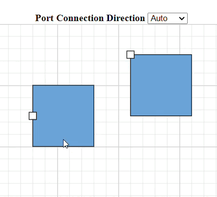

# Ports in Blazor Diagram Component

[Port](https://help.syncfusion.com/cr/blazor/Syncfusion.Blazor.Diagram.Port.html) is a special connection point in a Node where you can glue the connectors. When you glue a connector to a node or port, they remain connected even if one of the nodes is moved.


## How to Create Node to Node and Port to Port Connections

There are two main types of connections, node to node and port to port. The difference between these two connections is whether or not a connector remains glued to a specific connection point when you move the attached node or connector.

A node to node connection is one where the connector will move around the node as you move the node. Diagram will always ensure the connector is the shortest, most direct line possible. You can create a node to node connection by selecting the entire node (rather than the port) and connect it to another shape (rather than to a port).


Ports act as the connection points of the node and allows creating connections with only those specific points, as shown in the following image.


## How to Create a Node Port

To add a connection port, define the port object and add it to node’s ports collection. The [Offset](https://help.syncfusion.com/cr/blazor/Syncfusion.Blazor.Diagram.PointPort.html#Syncfusion_Blazor_Diagram_PointPort_Offset) property of the port accepts an object of fractions and is used to determine the position of ports. The following code explains how to add ports when initializing the node.

To create and customize the ports in the Blazor Diagram, refer to the below video link,



```cshtml
@using Syncfusion.Blazor.Diagram

<SfDiagramComponent Height="600px" Nodes="@nodes" />

@code
{
    DiagramObjectCollection<Node> nodes;

    protected override void OnInitialized()
    {
        // A node is created and stored in nodes collection.
        nodes = new DiagramObjectCollection<Node>();
        Node node = new Node()
        {
            // Position of the node.
            OffsetX = 250,
            OffsetY = 250,
            // Size of the node.
            Width = 100,
            Height = 100,
            Style = new ShapeStyle() { Fill = "#6495ED", StrokeColor = "white" },
            // Initialize port collection.
            Ports = new DiagramObjectCollection<PointPort>()
            {
               new PointPort()
               {
                   Style = new ShapeStyle(){ Fill = "gray" },
                   // Sets the position for the port.
                   Offset = new DiagramPoint() { X = 0.5, Y = 0.5 }, 
                   Visibility = PortVisibility.Visible
               }
            }
        };
        nodes.Add(node);
    }
}
```
You can download a complete working sample from [GitHub](https://github.com/SyncfusionExamples/Blazor-Diagram-Examples/tree/master/UG-Samples/Ports/ActionofPorts/CreatePorts)


### How to Connect a Connector to a Node Port

Node ports are used to establish connections between node ports, connector ports and nodes. To create such a connection, set the [SourceID](https://help.syncfusion.com/cr/blazor/Syncfusion.Blazor.Diagram.Connector.html#Syncfusion_Blazor_Diagram_Connector_SourceID) or [TargetID](https://help.syncfusion.com/cr/blazor/Syncfusion.Blazor.Diagram.Connector.html#Syncfusion_Blazor_Diagram_Connector_TargetID) property to the ID of the node and the [SourcePortID](https://help.syncfusion.com/cr/blazor/Syncfusion.Blazor.Diagram.Connector.html#Syncfusion_Blazor_Diagram_Connector_SourcePortID) or [TargetPortID](https://help.syncfusion.com/cr/blazor/Syncfusion.Blazor.Diagram.Connector.html#Syncfusion_Blazor_Diagram_Connector_TargetPortID) property to the ID of the corresponding port on the node.

The following code example demonstrates how to connect connectors to ports on nodes.

```cshtml
@using Syncfusion.Blazor.Diagram

<SfDiagramComponent Height="600px" Nodes="@nodes" Connectors="@connectors">
</SfDiagramComponent>

@code
{
    // Initialize node and connector collections
    DiagramObjectCollection<Node> nodes = new DiagramObjectCollection<Node>();
    DiagramObjectCollection<Connector> connectors = new DiagramObjectCollection<Connector>();

    protected override void OnInitialized()
    {
        Node node1 = new Node()
            {
                ID = "node1",
                OffsetX = 200,
                OffsetY = 200,
                Width = 100,
                Height = 100,
                Style = new ShapeStyle() { Fill = "#6495ED", StrokeColor = "white" },
                Ports = new DiagramObjectCollection<PointPort>()
            {
                new PointPort()
                {
                    ID = "port1",
                    Offset = new DiagramPoint() { X = 1, Y = 0.5 },
                    Visibility = PortVisibility.Visible,
                    Shape = PortShapes.Circle,
                }
            }
            };

        Node node2 = new Node()
            {
                ID = "node2",
                OffsetX = 400,
                OffsetY = 200,
                Width = 100,
                Height = 100,
                Style = new ShapeStyle() { Fill = "#6495ED", StrokeColor = "white" },
                Ports = new DiagramObjectCollection<PointPort>()
            {
                new PointPort()
                {
                    ID = "port1",
                    Offset = new DiagramPoint() { X = 0, Y = 0.5 },
                    Visibility = PortVisibility.Visible,
                    Shape = PortShapes.Circle,
                }
            }
            };

        // Connector connecting node1's port1 to node2's port1
        Connector connector1 = new Connector()
            {
                ID = "connector1",
                SourceID = "node1",
                SourcePortID = "port1",
                TargetID = "node2",
                TargetPortID = "port1",
                Type = ConnectorSegmentType.Straight,
                Style = new ShapeStyle() { StrokeColor = "#6495ED", StrokeWidth = 2 }
            };

        nodes.Add(node1);
        nodes.Add(node2);
        connectors.Add(connector1);
    }
}
```

You can download a complete working sample from [GitHub](https://github.com/SyncfusionExamples/Blazor-Diagram-Examples/tree/master/UG-Samples/Ports/NodePortConnection).

## How to Create a Connector Port

Creating connector ports is similar to creating node ports. To define connector ports, you need to create a collection of `ConnectorPort` and assign it to the connector’s `Ports` property.

The following code example demonstrates how to create a connector port.

```cshtml
@using Syncfusion.Blazor.Diagram

<SfDiagramComponent Height="600px" Connectors="@connectors">
</SfDiagramComponent>

@code
{
    //Define diagram's connector collection
    DiagramObjectCollection<Connector> connectors;

    protected override void OnInitialized()
    {
        // A connector is created and stored in connectors collection.
        connectors = new DiagramObjectCollection<Connector>();

        // Create connector
        Connector connector = new Connector()
        {
            ID = "connector",
            SourcePoint = new DiagramPoint() { X = 400, Y = 200 },
            TargetPoint = new DiagramPoint() { X = 550, Y = 350 },
            Type = ConnectorSegmentType.Orthogonal,
            Ports = new DiagramObjectCollection<ConnectorPort>()
            {
                new ConnectorPort()
                {
                    ID = "port",
                    Visibility = PortVisibility.Visible,
                    Shape = PortShapes.Square,
                }
            }
        };
        connectors.Add(connector);
    }
}
```
You can download a complete working sample from [GitHub](https://github.com/SyncfusionExamples/Blazor-Diagram-Examples/tree/master/UG-Samples/Ports/ConnectorPort/CreateConnectorPorts)

>**Note:** Port's Id should not start with numbers or special characters and should not contain special characters such as underscores(_) or spaces.

### How to Connect a Connector to a Connector Port

Connector ports are used to establish connections between node ports, connector ports and nodes. To create such a connection, set the `SourcePortID` or `TargetPortID` property to the ID of the corresponding port on the connector.

The following code example demonstrates how to connect one connector to a port on another connector.

```cshtml
@using Syncfusion.Blazor.Diagram

<SfDiagramComponent Height="600px" Connectors="@connectors">
</SfDiagramComponent>

@code
{
    // Initialize connector collection
    DiagramObjectCollection<Connector> connectors = new DiagramObjectCollection<Connector>();

    protected override void OnInitialized()
    {
        Connector connector1 = new Connector()
        {
            ID = "connector1",
            SourcePoint = new DiagramPoint() { X = 200, Y = 100 },
            TargetPoint = new DiagramPoint() { X = 350, Y = 250 },
            Type = ConnectorSegmentType.Bezier,
            Ports = new DiagramObjectCollection<ConnectorPort>()
            {
                new ConnectorPort()
                {
                    ID = "port",
                    Visibility = PortVisibility.Visible,
                    Shape = PortShapes.Square,
                }
            }
        };

        Connector connector2 = new Connector()
        {
            ID = "connector2",
            SourcePoint = new DiagramPoint() { X = 600, Y = 100 },
            TargetPoint = new DiagramPoint() { X = 750, Y = 250 },
            Type = ConnectorSegmentType.Bezier,
            Ports = new DiagramObjectCollection<ConnectorPort>()
            {
                new ConnectorPort()
                {
                    ID = "port",
                    Visibility = PortVisibility.Visible,
                    Shape = PortShapes.Square,
                }
            }
        };
        Connector connector3 = new Connector()
        {
            ID = "connector3",
            SourceID = "connector1",
            SourcePortID = "port",
            TargetID = "connector2",
            TargetPortID = "port",
            Type = ConnectorSegmentType.Straight
        };
        connectors.Add(connector1);
        connectors.Add(connector2);
        connectors.Add(connector3);
    }
}
```
You can download a complete working sample from [GitHub](https://github.com/SyncfusionExamples/Blazor-Diagram-Examples/tree/master/UG-Samples/Ports/ConnectorPort/ConnectorPortConnection)

## How to Add Ports at Runtime

You can add ports at runtime to the nodes collection in the Diagram component by using the `Add` method.

The following code explains how to add ports to node at runtime by using the `Add` method. The port’s [ID](https://help.syncfusion.com/cr/blazor/Syncfusion.Blazor.Diagram.Port.html#Syncfusion_Blazor_Diagram_Port_ID) property is used to define the unique ID for the port and it is further used to find the port at runtime.
If **ID** is not set, then default **ID** is automatically set.

```cshtml
@using Syncfusion.Blazor.Diagram
@using Syncfusion.Blazor.Buttons


<SfButton Content="AddPorts" OnClick="@AddPorts" />
<SfDiagramComponent Height="600px" Nodes="@nodes" />

@code
{
    DiagramObjectCollection<Node> nodes;

    protected override void OnInitialized()
    {
        //A node is created and stored in nodes array.
        nodes = new DiagramObjectCollection<Node>();
        Node node = new Node()
        {
            //Position of the node.
            OffsetX = 250,
            OffsetY = 250,
            //Size of the node.
            Width = 100,
            Height = 100,
            Style = new ShapeStyle() { Fill = "#6495ED", StrokeColor = "white" },
        };
        nodes.Add(node);
    }

    public void AddPorts()
    {
        PointPort port = new PointPort()
        {
            ID = "port",
            Style = new ShapeStyle(){ Fill = "gray" }, 
            Offset = new DiagramPoint() { X = 0, Y = 0.5 },
            Visibility = PortVisibility.Visible
        };
        // Initialize port collection.
        nodes[0].Ports.Add(port);
    }
}

```
You can download a complete working sample from [GitHub](https://github.com/SyncfusionExamples/Blazor-Diagram-Examples/tree/master/UG-Samples/Ports/ActionofPorts/AddPort)

Also, the port can be added at runtime by using the `AddAsync` method. The `await` operator suspends evaluation of the enclosing async method until the asynchronous operation represented by its operand completes.

The following code explains how to add ports to node at runtime by using the `AddAsync` method.

```csharp
//Method to add port at runtime
public async void AddPorts()
{
    PointPort port = new PointPort()
    {
        Style = new ShapeStyle() { Fill = "gray" }, 
        Offset = new DiagramPoint() { X = 0, Y = 0.5 }, 
        Visibility = PortVisibility.Visible
    };
    await ((nodes[0].Ports) as DiagramObjectCollection<PointPort>).AddAsync(port);
}
```
You can download a complete working sample from [GitHub](https://github.com/SyncfusionExamples/Blazor-Diagram-Examples/tree/master/UG-Samples/Ports/ActionofPorts/AddPortsAsync())


## How to Add Multiple Ports at Runtime

Add multiple ports at runtime by using the `Add` method in the port collection. The following code explains how to add two or more ports to node at runtime.

The port’s [ID](https://help.syncfusion.com/cr/blazor/Syncfusion.Blazor.Diagram.Port.html#Syncfusion_Blazor_Diagram_Port_ID) property is used to define the unique ID for the port and it is further used to find the port at runtime. If **ID** is not set, then default **ID** is automatically set.

```cshtml
@using Syncfusion.Blazor.Diagram
@using Syncfusion.Blazor.Buttons

<SfButton Content="AddPorts" OnClick="@AddPorts" />
<SfDiagramComponent Height="600px" Nodes="@nodes" />

@code
{
    DiagramObjectCollection<Node> nodes;

    protected override void OnInitialized()
    {
        //A node is created and stored in nodes array.
        nodes = new DiagramObjectCollection<Node>();
        Node node = new Node()
        {
            //Position of the node.
            OffsetX = 250,
            OffsetY = 250,
            //Size of the node.
            Width = 100,
            Height = 100,
            Style = new ShapeStyle() 
            { 
                Fill = "#6495ED", 
                StrokeColor = "white" 
            },
        };
        nodes.Add(node);
    }

   public void AddPorts()
    {
        PointPort port1 = new PointPort() 
        { 
            ID = "port1", 
            Offset = new DiagramPoint() { X = 0, Y = 0.5 }, 
            Visibility = PortVisibility.Visible,
            Style = new ShapeStyle() { Fill = "gray" }
        };
        PointPort port2 = new PointPort() 
        { 
            ID = "port2", 
            Offset = new DiagramPoint() { X = 1, Y = 0.5 }, 
            Visibility = PortVisibility.Visible, 
            Style = new ShapeStyle() { Fill = "gray" }
        };
        PointPort port3 = new PointPort()
        { 
            ID = "port3", 
            Offset = new DiagramPoint() { X = 0.5, Y = 0 }, 
            Visibility = PortVisibility.Visible, 
            Style = new ShapeStyle() { Fill = "gray" }
        };
        PointPort port4 = new PointPort() 
        { 
            ID = "port4", Offset = new DiagramPoint() { X = 0.5, Y = 1 }, 
            Visibility = PortVisibility.Visible, 
            Style = new ShapeStyle() { Fill = "gray" }
        };
        // Add multiple ports in the port collection.
        nodes[0].Ports.Add(port1);
        nodes[0].Ports.Add(port2);
        nodes[0].Ports.Add(port3);
        nodes[0].Ports.Add(port4);
    }
}
```
You can download a complete working sample from [GitHub](https://github.com/SyncfusionExamples/Blazor-Diagram-Examples/tree/master/UG-Samples/Ports/ActionofPorts/AddMultiplePorts)


## How to Remove Port at Runtime

A collection of ports can be removed from the node by using the native `RemoveAt` method. Refer to the following example that shows how to remove ports at runtime.

```cshtml
@using Syncfusion.Blazor.Diagram
@using Syncfusion.Blazor.Buttons

<SfButton Content="RemovePorts" OnClick="@RemovePorts" />
<SfDiagramComponent Height="600px" Nodes="@nodes" />

@code
{
    DiagramObjectCollection<Node> nodes;

    protected override void OnInitialized()
    {
        // A node is created and stored in nodes array.
        nodes = new DiagramObjectCollection<Node>();
        Node node = new Node()
        {
            // Position of the node.
            OffsetX = 250,
            OffsetY = 250,
            // Size of the node.
            Width = 100,
            Height = 100,
            Style = new ShapeStyle() { Fill = "#6495ED", StrokeColor = "white" },
            // Initialize port collection.
            Ports = new DiagramObjectCollection<PointPort>()
            {
                new PointPort()
                {
                    ID = "port1",
                    Offset = new DiagramPoint() { X = 0, Y = 0.5 },
                    Visibility = PortVisibility.Visible,
                    //Set the style for the port.
                    Style= new ShapeStyle()
                    { 
                        Fill = "red",
                        StrokeColor = "black", 
                        StrokeWidth = 2
                    },
                    Width = 12, 
                    Height = 12,
                    // Sets the shape of the port as Circle .
                    Shape = PortShapes.Circle
                }
            },
        };
        nodes.Add(node);
    }

    public void RemovePorts()
    {
        (nodes[0].Ports as DiagramObjectCollection<PointPort>).RemoveAt(0);
    }
}
```
You can download a complete working sample from [GitHub](https://github.com/SyncfusionExamples/Blazor-Diagram-Examples/tree/master/UG-Samples/Ports/ActionofPorts/RemovePorts)

## How to Update Port at Runtime

You can change any port properties at runtime.

The following code example explains how to change the port properties at runtime.

```cshtml
@using Syncfusion.Blazor.Diagram
@using Syncfusion.Blazor.Buttons


<SfButton Content="Update Port" OnClick="@UpdatePort" />
<SfDiagramComponent @ref="diagram" Height="600px" Nodes="@nodes" />

@code
{
    SfDiagramComponent diagram;
    DiagramObjectCollection<Node> nodes;

protected override void OnInitialized()
{
    // Initialize port collection.
    DiagramObjectCollection<PointPort> ports = new DiagramObjectCollection<PointPort>();
    ports.Add(new PointPort() 
    { 
        ID = "port", 
        Offset = new DiagramPoint() 
        { 
            X = 0, 
            Y = 0.5 
        }, 
        Visibility = PortVisibility.Visible
    });
    // A node is created and stored in nodes array.
    nodes = new DiagramObjectCollection<Node>();
    Node node = new Node()
    {
        // Position of the node.
        OffsetX = 250,
        OffsetY = 250,
        // Size of the node.
        Width = 100,
        Height = 100,
        Style = new ShapeStyle() { Fill = "#6BA5D7", StrokeColor = "white" },
        Ports = ports
    };
    nodes.Add(node);
}

    public async void UpdatePort()
    {
        //Update ports at run time.
        diagram.BeginUpdate();
        nodes[0].Ports[0].Offset.X = 1;
        nodes[0].Ports[0].Offset.Y = 1;
        await diagram.EndUpdateAsync();
    }
}
```
You can download a complete working sample from [GitHub](https://github.com/SyncfusionExamples/Blazor-Diagram-Examples/tree/master/UG-Samples/Ports/ActionofPorts/UpdatePorts)

## How to Specify Connection Direction for Ports

The [ConnectionDirection](https://help.syncfusion.com/cr/blazor/Syncfusion.Blazor.Diagram.Port.html#Syncfusion_Blazor_Diagram_Port_ConnectionDirection) property of a port allows users to specify the direction in which a connector should establish a connection. This can be either to the port incoming or from the port outgoing.

The following code example how to set connection direction to port.
```cshtml
@using Syncfusion.Blazor.Diagram


<SfDiagramComponent Width="600px" Height="600px" Nodes="@nodes" Connectors="@connectors" >
</SfDiagramComponent>


@code
{
    //Defines Diagram's Nodes collection
    private DiagramObjectCollection<Node> nodes = new DiagramObjectCollection<Node>();
    //Defines Diagram's Connectors collection
    private DiagramObjectCollection<Connector> connectors = new DiagramObjectCollection<Connector>();

    protected override void OnInitialized()
    {
        Node node1 = new Node()
            {
                ID = "node1",
                // Position of the node.
                OffsetX = 450,
                OffsetY = 200,
                // Size of the node.
                Width = 100,
                Height = 100,
                Style = new ShapeStyle() { Fill = "#6BA5D7" },
                Ports = new DiagramObjectCollection<PointPort>()
                {
                    new PointPort()
                    { ID="port1",
                      Offset = new DiagramPoint() { X = 0, Y = 0 },
                      Visibility = PortVisibility.Visible,
                    }
                }
            };
        nodes.Add(node1);
        Node node2 = new Node()
            {
                ID = "node2",
                // Position of the node.
                OffsetX = 270,
                OffsetY = 300,
                // Size of the node.
                Style = new ShapeStyle() { Fill = "#6BA5D7" },
                Width = 100,
                Height = 100,
                Ports = new DiagramObjectCollection<PointPort>()
                {
                    new PointPort()
                    { ID="port2",
                      Offset = new DiagramPoint() { X = 0.5, Y = 0.5 },
                      Visibility = PortVisibility.Visible,
                      //Sets the connection direction as Left
                      ConnectionDirection = PortConnectionDirection.Left
                    }
                }
            };
        // Add node.
        nodes.Add(node2);
        Connector Connector1 = new Connector()
            {
                ID = "connector1",
                // Set the source and target point of the connector.
                SourceID = "node2",
                TargetID = "node1",
                SourcePortID = "port2",
                TargetPortID = "port1",
                // Type of the connector segments.
                Type = ConnectorSegmentType.Orthogonal
            };
        connectors.Add(Connector1);
    }
}
```
You can download a complete working sample from [GitHub](https://github.com/SyncfusionExamples/Blazor-Diagram-Examples/tree/master/UG-Samples/Ports/ActionofPorts/PortDirection)



## How to Get InEdges and OutEdges of Ports

[InEdges](https://help.syncfusion.com/cr/blazor/Syncfusion.Blazor.Diagram.Port.html#Syncfusion_Blazor_Diagram_Port_InEdges) is used to get the incoming connectors of the port that are connected to the port. [OutEdges](https://help.syncfusion.com/cr/blazor/Syncfusion.Blazor.Diagram.Port.html#Syncfusion_Blazor_Diagram_Port_OutEdges) is used to get the outgoing connectors of the port that are connected to the port.

The following code example how to get [InEdges](https://help.syncfusion.com/cr/blazor/Syncfusion.Blazor.Diagram.Port.html#Syncfusion_Blazor_Diagram_Port_InEdges) and [OutEdges](https://help.syncfusion.com/cr/blazor/Syncfusion.Blazor.Diagram.Port.html#Syncfusion_Blazor_Diagram_Port_OutEdges) of port.
```cshtml
@using Syncfusion.Blazor.Diagram
@using Syncfusion.Blazor.Buttons


<SfButton Content="GetInEdges" OnClick="@GetInEdges" />
<SfDiagramComponent @ref="diagram" Height="600px" Nodes="@nodes" Connectors="@connectors" />

@code
{
    SfDiagramComponent diagram;
     DiagramObjectCollection<Node> nodes= new DiagramObjectCollection<Node>();
    DiagramObjectCollection<Connector> connectors= new DiagramObjectCollection<Connector>();

    protected override void OnInitialized()
    {
        Node node1 = new Node()
        {
            ID = "node1",
            Width = 100,
            Height = 100,
            OffsetX = 300,
            OffsetY = 300,
             // Initialize port collection.
            Ports = new DiagramObjectCollection<PointPort>()
            {
                new PointPort()
                {
                    ID = "port1",
                    Offset = new DiagramPoint() { X = 0, Y = 0.5 },
                    Visibility = PortVisibility.Visible,
                    //Set the style for the port.
                    Style= new ShapeStyle()
                    { 
                        Fill = "red",
                        StrokeColor = "black", 
                        StrokeWidth = 2
                    },
                    Width = 12, 
                    Height = 12,
                  // Sets the shape of the port as a Circle.
                    Shape = PortShapes.Circle
                }
            },
            
        };
        nodes.Add(node1);
        Node node2 = new Node()
        {
            ID = "node2",
            Width = 100,
            Height = 100,
            OffsetX = 300,
            OffsetY = 500,
             // Initialize port collection.
            Ports = new DiagramObjectCollection<PointPort>()
            {
                new PointPort()
                {
                    ID = "port1",
                    Offset = new DiagramPoint() { X = 0, Y = 0.5 },
                    Visibility = PortVisibility.Visible,
                    //Set the style for the port.
                    Style= new ShapeStyle()
                    { 
                        Fill = "red",
                        StrokeColor = "black", 
                        StrokeWidth = 2
                    },
                    Width = 12, 
                    Height = 12,
                    // Sets the shape of the port as Circle .
                    Shape = PortShapes.Circle
                }
            },
        };
        nodes.Add(node2);
        Connector connector1 = new Connector()
        {
            ID = "connector1",
            SourceID = "node1",
            SourcePortID="port1",
            TargetPortID="port1",
            TargetID = "node2",
        };
        connectors.Add(connector1);
    }
    private void GetInEdges()
    {
        List<string> Inedges= new List<string>();
        foreach (string inedge in diagram.Nodes[1].Ports[0].InEdges)
        {
            Inedges.Add(inedge);
        }
    }
}
```
You can download a complete working sample from [GitHub](https://github.com/SyncfusionExamples/Blazor-Diagram-Examples/tree/master/UG-Samples/Ports/ActionofPorts/InedgesAndOutedges)


## See also

* [How to create a node](../nodes/nodes)

* [How to customize the ports](./appearance)

* [How to interact with the ports](./interaction)

* [How to set the position of the port](./positioning)

* [How to Dynamically Create and Connect Diagram Nodes with Annotations via Ports in Syncfusion<sup style="font-size:70%">&reg;</sup> Blazor Diagram](https://support.syncfusion.com/kb/article/19001/how-to-dynamically-create-and-connect-diagram-nodes-with-annotations-via-ports-in-syncfusion-blazor-diagram)  


* [How to Select and Highlight Ports and Connect Selected Elements in Syncfusion<sup style="font-size:70%">&reg;</sup> Blazor Diagram](https://support.syncfusion.com/kb/article/18997/how-to-select-and-highlight-ports-and-connect-selected-elements-in-syncfusion-blazor-diagram)


* [How to Add Multiple Ports to All Sides of a Node in Syncfusion's Blazor Diagram Component](https://support.syncfusion.com/kb/article/18718/how-to-add-multiple-ports-to-all-sides-of-a-node-in-syncfusions-blazor-diagram-component)
