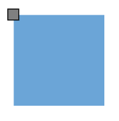
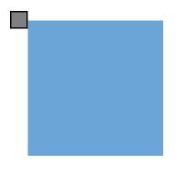

# Positioning in Blazor Diagram Component

Diagram allows you to customize the position and appearance of the port efficiently. Port can be aligned relative to the node boundaries. It has Margin, Offset, Horizontal, and Vertical alignment settings. It is quite tricky when all four alignments are used together but gives more control over alignments properties of the [DiagramPort](https://help.syncfusion.com/cr/blazor/Syncfusion.Blazor.Diagrams.DiagramPort.html) class. Ports of a node can be positioned using the following properties of `DiagramPort`.

* [Offset](https://help.syncfusion.com/cr/blazor/Syncfusion.Blazor.Diagrams.DiagramPort.html#Syncfusion_Blazor_Diagrams_DiagramPort_Offset)
* [HorizontalAlignment](https://help.syncfusion.com/cr/blazor/Syncfusion.Blazor.Diagrams.DiagramPort.html#Syncfusion_Blazor_Diagrams_DiagramPort_HorizontalAlignment)
* [VerticalAlignment](https://help.syncfusion.com/cr/blazor/Syncfusion.Blazor.Diagrams.DiagramPort.html#Syncfusion_Blazor_Diagrams_DiagramPort_VerticalAlignment)
* [Margin](https://help.syncfusion.com/cr/blazor/Syncfusion.Blazor.Diagrams.DiagramPort.html#Syncfusion_Blazor_Diagrams_DiagramPort_Margin)

> A new blazor diagram component which provides better performance than the existing diagram control in Blazor WebAssembly App. It is available in preview mode.  Refer the [Link](https://blazor.syncfusion.com/documentation/diagram-component/ports/positioning)

## Offset

The [Offset](https://help.syncfusion.com/cr/blazor/Syncfusion.Blazor.Diagrams.DiagramPort.html#Syncfusion_Blazor_Diagrams_DiagramPort_Offset) property is used to align the Ports based on fractions. 0 represents top/left corner, 1 represents bottom/right corner, and 0.5 represents half of width/height.

```cshtml
@using Syncfusion.Blazor.Diagrams
@using System.Collections.ObjectModel

<SfDiagram Height="600px" Nodes="@NodeCollection">
</SfDiagram>
@code{
    public ObservableCollection<DiagramNode> NodeCollection = new ObservableCollection<DiagramNode>() { };
    protected override void OnInitialized()
    {
        // A node is created and stored in nodes collection.
        DiagramNode node1 = new DiagramNode()
        {
            // Position of the node
            OffsetX = 250,
            OffsetY = 250,
            // Size of the node
            Width = 100,
            Height = 100,
            Style = new NodeShapeStyle() { Fill = "#6BA5D7", StrokeColor = "white" },
            // Initialize port collection
            Ports = new ObservableCollection<DiagramPort>()
            {
                new DiagramPort()
                {
                    Id = "port1",
                    Offset = new NodePortOffset() { X = 0, Y = 0.5 },
                    Visibility = PortVisibility.Visible,
                    //Set the style for the port
                    Style= new PortShapeStyle(){ Fill="gray", StrokeColor="black"},
                    // Sets the shape of the port as Square
                    Width= 12,
                    Height=12,
                    Shape= PortShapes.Square,
                }
            },
        };
        NodeCollection.Add(node1);
    }
}
```


The following code shows the relationship between the shape port position and path port offset (fraction values).

| Offset values | Output |
|---|---|
| (0,0) |  |
| (0,0.5) |  |
| (0,1) |  |
| (0.5,0) |  |
| (0.5,0.5) |  |
| (0.5,1) |  |
| (1,0) |  |
| (1,0.5) |  |
| (1,1) |  |


> Type of the offset property for node’s shape port is NodePortOffset.

## Horizontal and vertical alignment

The [HorizontalAlignment](https://help.syncfusion.com/cr/blazor/Syncfusion.Blazor.Diagrams.DiagramPort.html#Syncfusion_Blazor_Diagrams_DiagramPort_HorizontalAlignment) property of the port is used to set how the port is horizontally aligned at the port position determined from the fraction values. The [VerticalAlignment](https://help.syncfusion.com/cr/blazor/Syncfusion.Blazor.Diagrams.DiagramPort.html#Syncfusion_Blazor_Diagrams_DiagramPort_VerticalAlignment) property is used to set how the port is vertically aligned at the port position.

The following table shows all the possible alignments visually with `offset (0, 0)`.

| Horizontal Alignment | Vertical Alignment | Output with Offset(0,0) |
| -------- | -------- | -------- |
| Left | Top |  |
| Center | Top |  |
| Right | Top |   |
| Left | Center |  |
| Center | Center|  |
| Right | Center |  |
| Left | Bottom |  |
| Center | Bottom |  |
| Right |Bottom | |

The following code explains how to align ports.

```cshtml
@using Syncfusion.Blazor.Diagrams
@using System.Collections.ObjectModel

<SfDiagram Height="600px" Nodes="@NodeCollection">
</SfDiagram>
@code{

    public ObservableCollection<DiagramNode> NodeCollection = new ObservableCollection<DiagramNode>() { };

    protected override void OnInitialized()
    {
        // A node is created and stored in nodes array.
        DiagramNode node1 = new DiagramNode()
        {
            // Position of the node
            OffsetX = 250,
            OffsetY = 250,
            // Size of the node
            Width = 100,
            Height = 100,
            Style = new NodeShapeStyle() { Fill = "#6BA5D7", StrokeColor = "white" },
            // Initialize port collection
            Ports = new ObservableCollection<DiagramPort>()
            {
                new DiagramPort()
                {
                    Id = "port1",
                    Offset = new NodePortOffset() { X = 0, Y = 0 },
                    Visibility = PortVisibility.Visible,
                    //Set the style for the port
                    Style= new PortShapeStyle(){ Fill="gray", StrokeColor="black"},
                    // Sets the shape of the port as Square
                    Width= 12,
                    Height=12,
                    Shape= PortShapes.Square,
                    HorizontalAlignment = HorizontalAlignment.Left,
                    VerticalAlignment = VerticalAlignment.Top
                }
            },
        };
        NodeCollection.Add(node1);
    }
}
```

>* The value of the `HorizontalAlignment` is `Center` by default.
>* The value of the `VerticalAlignment` is `Center` by default.
>* Alignment positioned based on the offset value.

## Margin

[Margin](https://help.syncfusion.com/cr/blazor/Syncfusion.Blazor.Diagrams.DiagramPort.html#Syncfusion_Blazor_Diagrams_DiagramPort_Margin) is an absolute value used to add some blank space to any one of its four sides. The ports can be displaced with the margin property. The following code example explains how to align an port based on its Offset, HorizontalAlignment, VerticalAlignment, and Margin values.

```cshtml
@using Syncfusion.Blazor.Diagrams
@using System.Collections.ObjectModel

<SfDiagram Height="600px" Nodes="@NodeCollection">
</SfDiagram>
@code{

    public ObservableCollection<DiagramNode> NodeCollection = new ObservableCollection<DiagramNode>() { };
    protected override void OnInitialized()
    {
        // A node is created and stored in nodes array.
        DiagramNode node1 = new DiagramNode()
        {
            // Position of the node
            OffsetX = 250,
            OffsetY = 250,
            // Size of the node
            Width = 100,
            Height = 100,
            Style = new NodeShapeStyle() { Fill = "#6BA5D7", StrokeColor = "white" },
            // Initialize port collection
            Ports = new ObservableCollection<DiagramPort>()
            {
                new DiagramPort()
                {
                    Id = "port1",
                    Offset = new NodePortOffset() { X = 0.5, Y = 1 },
                    Visibility = PortVisibility.Visible,
                    //Set the style for the port
                    Style= new PortShapeStyle(){ Fill="gray", StrokeColor="black"},
                    // Sets the shape of the port as Circle
                    Width= 12,
                    Height=12,
                    Shape= PortShapes.Square,
                    HorizontalAlignment = HorizontalAlignment.Left,
                    VerticalAlignment = VerticalAlignment.Top,
                    Margin=new PortMargin(){Top=10}
                }
            },
        };
        NodeCollection.Add(node1);
    }
}
```


## See also

* [How to create a node](../nodes/nodes)

* [How to customize the ports](./appearance)

* [How to interact the ports](./interaction)
