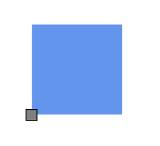

# Positioning a Port in Diagram Component

Customize the position and appearance of the port efficiently. Ports can be aligned relative to node boundaries. It has Margin, Offset, Horizontal, and Vertical alignment settings. It is quite tricky when all four alignments are used together but gives more control over alignments properties of the [PointPort](https://help.syncfusion.com/cr/blazor/Syncfusion.Blazor.Diagram.PointPort.html) class. Ports of a node can be positioned using the following properties of `PointPort`.

* Offset
* HorizontalAlignment
* VerticalAlignment
* Margin

## How to Change Offset at Runtime

Use [Offset](https://help.syncfusion.com/cr/blazor/Syncfusion.Blazor.Diagram.PointPort.html#Syncfusion_Blazor_Diagram_PointPort_Offset) to place a port using fractional values relative to the node: **0** represents the top/left, **1** represents the bottom/right, and **0.5** represents the center along each axis.

```cshtml
@using Syncfusion.Blazor.Diagram

<SfDiagramComponent Height="600px" Nodes="@_nodes"/>

@code
{
    private DiagramObjectCollection<Node> _nodes;
    protected override void OnInitialized()
    {
        _nodes = new DiagramObjectCollection<Node>();
        // A node is created and stored in _nodes collection.
        Node node = new Node()
        {
            // Position of the node.
            OffsetX = 250,
            OffsetY = 250,
            // Size of the node.
            Width = 100,
            Height = 100,
            Style = new ShapeStyle() { Fill = "#6495ED", StrokeColor = "white" },
            // Initialize port collection.
            Ports = new DiagramObjectCollection<PointPort>()
            {
                new PointPort() 
                {
                    ID = "port1",
                    // Sets the offset for the port.
                    Offset = new DiagramPoint() { X = 0, Y = 0.5 },
                    Visibility = PortVisibility.Visible,
                    //Set the style for the port.
                    Style= new ShapeStyle() { Fill = "gray", StrokeColor = "black" },
                    Width = 12,
                    Height = 12,
                    // Sets the shape of the port as Square .
                    Shape = PortShapes.Square
                }
            }
        };
        _nodes.Add(node);
    }
}
```
A complete working sample can be downloaded from [GitHub](https://github.com/SyncfusionExamples/Blazor-UG-Examples/blob/master/Diagram/Server/Pages/Ports/Positioning/PortOffset.razor)



The following table shows the relationship between the shape port position and path port offset (fraction values).

| Offset values | Output |
|---|---|
| (0,0) |  |
| (0,0.5) |  |
| (0,1) |  |
| (0.5,0) |  |
| (0.5,0.5) |  |
| (0.5,1) |  |
| (1,0) |  |
| (1,0.5) |  |
| (1,1) |  |

## How to Set Path Position for Connector Port

Use the `PathPosition` property to place a connector port along the connector path. It accepts values between 0 to 1, where:

* **0** represents the start point of the connector
* **1** represents the end point of the connector

>**Note:** The default value is **0.5**, which places the port at the midpoint of the connector.

| PathPosition value | Output |
|---|---|
| 0 |  |
| 0.5 |  |
| 1 |  |

The following code example demonstrates how to set path position for a connector port.

```cshtml
@using Syncfusion.Blazor.Diagram

<SfDiagramComponent Height="600px" Connectors="@_connectors">
</SfDiagramComponent>

@code
{
    //Define diagram's connector collection
    private DiagramObjectCollection<Connector> _connectors;

    protected override void OnInitialized()
    {
        // A connector is created and stored in connectors collection.
        _connectors = new DiagramObjectCollection<Connector>();

        // Create connector
        Connector connector = new Connector()
        {
            ID = "connector",
            SourcePoint = new DiagramPoint() { X = 400, Y = 200 },
            TargetPoint = new DiagramPoint() { X = 550, Y = 350 },
            Type = ConnectorSegmentType.Orthogonal,
            Ports = new DiagramObjectCollection<ConnectorPort>()
            {
                new ConnectorPort()
                {
                    ID = "port",
                    Visibility = PortVisibility.Visible,
                    Shape = PortShapes.Square,
                    PathPosition = 0,
                }
            }
        };
        _connectors.Add(connector);
    }
}
```


A complete working sample can be downloaded from [GitHub](https://github.com/SyncfusionExamples/Blazor-UG-Examples/blob/master/Diagram/Server/Pages/Ports/ConnectorPort/ConnectorPortPathPosition.razor)

## How to Change Horizontal and Vertical Alignment

[HorizontalAlignment](https://help.syncfusion.com/cr/blazor/Syncfusion.Blazor.Diagram.Port.html#Syncfusion_Blazor_Diagram_Port_HorizontalAlignment) property of the port is used to set how the port is horizontally aligned at the port position determined from the fraction values, and [VerticalAlignment](https://help.syncfusion.com/cr/blazor/Syncfusion.Blazor.Diagram.Port.html#Syncfusion_Blazor_Diagram_Port_VerticalAlignment) property is used to set how the port is vertically aligned at the port position.

The following table shows all the possible alignments visually with `offset (0, 0)`.

| Horizontal Alignment | Vertical Alignment | Output with Offset(0,0) |
| -------- | -------- | -------- |
| Left | Top |  |
| Center | Top |  |
| Right | Top |   |
| Left | Center |  |
| Center | Center|  |
| Right | Center |  |
| Left | Bottom |  |
| Center | Bottom |  |
| Right |Bottom | |

The following code shows how to align ports.

```cshtml
@using Syncfusion.Blazor.Diagram

<SfDiagramComponent Height="600px" Nodes="@_nodes"/>

@code
{
    private DiagramObjectCollection<Node> _nodes;
    protected override void OnInitialized()
    {
        _nodes = new DiagramObjectCollection<Node>();
        // A node is created and stored in _nodes array.
        Node node = new Node()
        {
            // Position of the node.
            OffsetX = 250,
            OffsetY = 250,
            // Size of the node.
            Width = 100,
            Height = 100,
            Style = new ShapeStyle() { Fill = "#6495ED", StrokeColor = "white" },
            // Initialize port collection.
            Ports = new DiagramObjectCollection<PointPort>() 
            {
                new PointPort() 
                {
                    ID = "port1",
                    Offset = new DiagramPoint() { X = 0, Y = 0 },
                    Visibility = PortVisibility.Visible,
                    //Set the style for the port.
                    Style = new ShapeStyle(){ Fill="gray", StrokeColor="black"},
                    Width = 12, 
                    Height = 12, 
                    // Sets the shape of the port as Square.                    
                    Shape = PortShapes.Square,
                    HorizontalAlignment = HorizontalAlignment.Center,
                    VerticalAlignment = VerticalAlignment.Center
                }
            }
        };
        _nodes.Add(node);
    }
}
```
A complete working sample can be downloaded from [GitHub](https://github.com/SyncfusionExamples/Blazor-UG-Examples/blob/master/Diagram/Server/Pages/Ports/Positioning/PortHorizontalVerticalAlignment.razor)




N> The default values for `HorizontalAlignment` and `VerticalAlignment` are `Center`. Alignment is positioned based on the offset value.

## How to Update Margin for Port

[Margin](https://help.syncfusion.com/cr/blazor/Syncfusion.Blazor.Diagram.Port.html#Syncfusion_Blazor_Diagram_Port_Margin) is an absolute value that adds some blank space to any one of its four sides. The ports can be displaced with the `Margin` property. The following code example explains how to align a port based on its `Offset`, `HorizontalAlignment`, `VerticalAlignment`, and `Margin` values.

```cshtml
@using Syncfusion.Blazor.Diagram

<SfDiagramComponent Height="600px" Nodes="@_nodes"/>

@code
{
    private DiagramObjectCollection<Node> _nodes;
    protected override void OnInitialized()
    {
        _nodes = new DiagramObjectCollection<Node>();
        // A node is created and stored in _nodes array.
        Node node = new Node()
        {
            // Position of the node.
            OffsetX = 250,
            OffsetY = 250,
            // Size of the node.
            Width = 100,
            Height = 100,
            Style = new ShapeStyle() { Fill = "#6495ED", StrokeColor = "white" },
            // Initialize port collection.
            Ports = new DiagramObjectCollection<PointPort>() 
            {
                new PointPort() 
                {
                    ID = "port1",
                    Offset = new DiagramPoint() { X = 0.5, Y = 1 },
                    Visibility = PortVisibility.Visible,
                    //Set the style for the port.
                    Style= new ShapeStyle() { Fill = "gray", StrokeColor = "black" },
                    Width = 12,
                    Height = 12, 
                    // Sets the shape of the port as Square.
                    Shape = PortShapes.Square,
                    HorizontalAlignment = HorizontalAlignment.Left,
                    VerticalAlignment = VerticalAlignment.Top,
                    Margin = new DiagramThickness() { Top = 20 }
                }
            }
        };
        _nodes.Add(node);
    }
}
```
A complete working sample can be downloaded from [GitHub](https://github.com/SyncfusionExamples/Blazor-UG-Examples/blob/master/Diagram/Server/Pages/Ports/Positioning/PortMargin.razor)



## See also

* [How to create a node](../nodes/nodes)

* [How to customize the ports](./appearance)

* [How to interact with the ports](./interaction)
