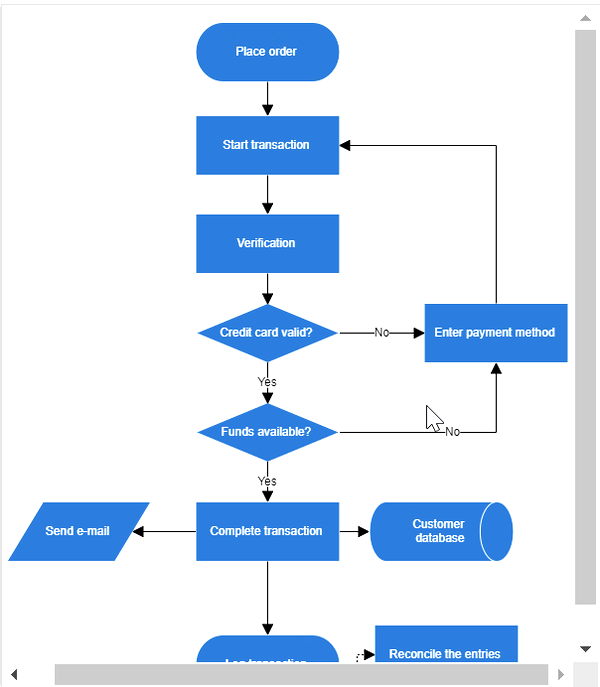
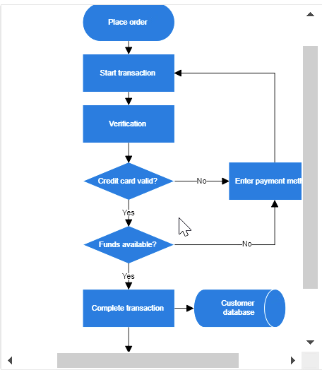
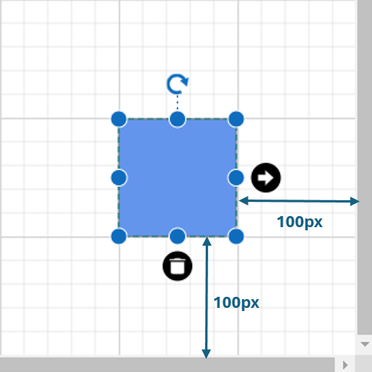

# Scroll Settings in Blazor Diagram Component

The diagram can be scrolled using vertical and horizontal scrollbars. In addition to the scrollbars, the mouse wheel can be used to scroll the diagram. The Diagram’s [ScrollSettings](https://help.syncfusion.com/cr/blazor/Syncfusion.Blazor.Diagram.ScrollSettings.html) allows to read the current scroll status, current zoom and zoom factor values. 

## How to Get Current Scroll Status

Scroll settings allows to read the scroll status, [CurrentZoom](https://help.syncfusion.com/cr/blazor/Syncfusion.Blazor.Diagram.ScrollSettings.html#Syncfusion_Blazor_Diagram_ScrollSettings_CurrentZoom) with a set of properties. To explore those properties, see [Scroll Settings](https://help.syncfusion.com/cr/blazor/Syncfusion.Blazor.Diagram.ScrollSettings.html).

* [CurrentZoom](https://help.syncfusion.com/cr/blazor/Syncfusion.Blazor.Diagram.ScrollSettings.html#Syncfusion_Blazor_Diagram_ScrollSettings_CurrentZoom): Specifies the current zoom level of the diagram page.
* [MinZoom](https://help.syncfusion.com/cr/blazor/Syncfusion.Blazor.Diagram.ScrollSettings.html#Syncfusion_Blazor_Diagram_ScrollSettings_MinZoom): Specifies the minimum zooming level of the diagram page.
* [MaxZoom](https://help.syncfusion.com/cr/blazor/Syncfusion.Blazor.Diagram.ScrollSettings.html#Syncfusion_Blazor_Diagram_ScrollSettings_MaxZoom): Specifies the maximum zooming level of the diagram page.
* [HorizontalOffset](https://help.syncfusion.com/cr/blazor/Syncfusion.Blazor.Diagram.ScrollSettings.html#Syncfusion_Blazor_Diagram_ScrollSettings_HorizontalOffset): Specifies the horizontal origin or left side origin of the view port of the diagram page.
* [VerticalOffset](https://help.syncfusion.com/cr/blazor/Syncfusion.Blazor.Diagram.ScrollSettings.html#Syncfusion_Blazor_Diagram_ScrollSettings_VerticalOffset): Specifies the vertical origin or top side of the view port of the diagram page.

## How to Define Scroll Status

Diagram allows to pan the diagram before loading so that any desired region of a large diagram can be viewed. Programmatically pan the diagram with the [HorizontalOffset](https://help.syncfusion.com/cr/blazor/Syncfusion.Blazor.Diagram.ScrollSettings.html#Syncfusion_Blazor_Diagram_ScrollSettings_HorizontalOffset) and [VerticalOffset](https://help.syncfusion.com/cr/blazor/Syncfusion.Blazor.Diagram.ScrollSettings.html#Syncfusion_Blazor_Diagram_ScrollSettings_VerticalOffset) properties of scroll settings. The following code illustrates how to pan the diagram programmatically.

In the following example, the vertical scroll bar is scrolled down by 50 px and the horizontal scroll bar is scrolled to right by 100 px.

```cshtml
@using Syncfusion.Blazor.Diagram

<SfDiagramComponent Height="600px">
    @* Sets the ScrollSettings for the diagram *@
    <ScrollSettings HorizontalOffset="100" VerticalOffset="50">
    </ScrollSettings>
</SfDiagramComponent>
```
A complete working sample can be downloaded from [GitHub](https://github.com/SyncfusionExamples/Blazor-Diagram-Examples/tree/master/UG-Samples/ScrollSettings/ScrollSettings)
## How to Update Scroll Status

Programmatically change the scroll offsets at runtime by using the external button click. The following code illustrates how to change the scroll offsets at runtime.

```cshtml
@using Syncfusion.Blazor.Diagram
@using Syncfusion.Blazor.Buttons

<SfButton Content="UpdateScrollValues" OnClick="@updateScrollValues" />
<SfDiagramComponent Height="600px">
    @* Sets the ScrollSettings for the diagram *@
    <ScrollSettings HorizontalOffset="@horizontalOffset" VerticalOffset="@verticalOffset">
    </ScrollSettings>
</SfDiagramComponent>

@code {
    public double horizontalOffset { get; set; } = 100;
    public double verticalOffset { get; set; } = 100;

    public void updateScrollValues()
    {
        //Update scroll settings.
        verticalOffset = 400;
        horizontalOffset = 200;
    }
}
```
A complete working sample can be downloaded from [GitHub](https://github.com/SyncfusionExamples/Blazor-Diagram-Examples/tree/master/UG-Samples/ScrollSettings/ScrollStatus)

## How to Handle the Scroll Changed Event 

The Diagram control provides the following event for scroll settings.

| Event Name | Event Type | Description |
| -------- | -------- | -------- |
| [ScrollChanged](https://help.syncfusion.com/cr/blazor/Syncfusion.Blazor.Diagram.SfDiagramComponent.html#Syncfusion_Blazor_Diagram_SfDiagramComponent_ScrollChanged) | [ScrollChangedEventArgs](https://help.syncfusion.com/cr/blazor/Syncfusion.Blazor.Diagram.ScrollChangedEventArgs.html) | Triggered when scrollbar is updated |


```cshtml
@using Syncfusion.Blazor.Diagram
@using Syncfusion.Blazor.Buttons

<SfButton Content="UpdateScrollValues" OnClick="@updateScrollValues" />
<SfDiagramComponent Height="600px" ScrollChanged="ScrollChanged">
    @* Sets the ScrollSettings for the diagram *@
    <ScrollSettings HorizontalOffset="@horizontalOffset" VerticalOffset="@verticalOffset">
    </ScrollSettings>
</SfDiagramComponent>

@code{
    public double horizontalOffset { get; set; } = 100;
    public double verticalOffset { get; set; } = 100;

    public void updateScrollValues()
    {
        //Update the scroll settings.
        verticalOffset = 400;
        horizontalOffset = 200;
    }
    private void ScrollChanged(ScrollChangedEventArgs args)
    {

    }

}
```

## How to Enable or Disable Auto Scroll 
Autoscroll feature automatically scrolls the Diagram whenever the Node or Connector is moved beyond the boundary of the diagram. So that, it is always visible during dragging, resizing, and multiple selection operations. Autoscroll is automatically triggered when any one of the following is done towards the edges of the Diagram:

* Node dragging, resizing
* Connector dragging and end thumb dragging
* Rubber band selection

The auto-scroll behavior in the diagram can be enabled or disabled by using the [EnableAutoScroll](https://help.syncfusion.com/cr/blazor/Syncfusion.Blazor.Diagram.ScrollSettings.html#Syncfusion_Blazor_Diagram_ScrollSettings_EnableAutoScroll) property of the diagram. The following code example illustrates enabling or disabling the auto-scroll support for nodes.


```cshtml
@using Syncfusion.Blazor.Diagram
<SfDiagramComponent Height="400px" Width="400px" Nodes="@nodes" Connectors="@connectors">
    @* Sets the ScrollSettings for the diagram *@
    <ScrollSettings EnableAutoScroll=true @bind-ScrollLimit="@scrollLimit">
    </ScrollSettings>
</SfDiagramComponent>
@code
{
    ScrollLimitMode scrollLimit { get; set; } = ScrollLimitMode.Infinity;
    //Defines diagram's node collection.
    DiagramObjectCollection<Node> nodes;
    //Defines diagram's connector collection.
    DiagramObjectCollection<Connector> connectors = new DiagramObjectCollection<Connector>();
    protected override void OnInitialized()
    {
        nodes = new DiagramObjectCollection<Node>();
        // A node is created and stored in the nodes collection.
        Node node = new Node()
            {
                ID = "node1",
                // Position of the node.
                OffsetX = 250,
                OffsetY = 250,
                // Size of the node.
                Width = 100,
                Height = 100,
                Style = new ShapeStyle()
                {
                    Fill = "#6495ED",
                    StrokeColor = "white"
                }
            };
        // Add node.
        nodes.Add(node);
        Connector Connector = new Connector()
            {
                ID = "connector1",
                // Set the source and target point of the connector.
                SourcePoint = new DiagramPoint() { X = 100, Y = 100 },
                TargetPoint = new DiagramPoint() { X = 100, Y = 200 },
                // Type of the connector segments.
                Type = ConnectorSegmentType.Straight,
                Style = new ShapeStyle()
                {
                    StrokeColor = "#6495ED",
                    StrokeWidth = 1
                },
            };
        connectors.Add(Connector);
    }
}
```

The auto-scrolling region is limited using [ScrollLimit](https://help.syncfusion.com/cr/blazor/Syncfusion.Blazor.Diagram.ScrollSettings.html#Syncfusion_Blazor_Diagram_ScrollSettings_ScrollLimit) property of the [ScrollSettings](https://help.syncfusion.com/cr/blazor/Syncfusion.Blazor.Diagram.ScrollSettings.html) class.Please refer [ScrollLimit](scroll-settings#scroll-limit) page for more details about ScrollLimit.

[OnAutoScrollChange](https://help.syncfusion.com/cr/blazor/Syncfusion.Blazor.Diagram.SfDiagramComponent.html#Syncfusion_Blazor_Diagram_SfDiagramComponent_OnAutoScrollChange) is raised when auto-scroll (scrollbars) is changed; for more information, see [OnAutoScrollChange](events#onautoscrollchange-event) page for more details about OnAutoScrollChange.

| | 

You can download a complete working sample from [GitHub](https://github.com/SyncfusionExamples/Blazor-Diagram-Examples/tree/master/UG-Samples/ScrollSettings/AutoScroll)

## How to Set Auto Scroll Padding
The [AutoScrollPadding](https://help.syncfusion.com/cr/blazor/Syncfusion.Blazor.Diagram.ScrollSettings.html#Syncfusion_Blazor_Diagram_ScrollSettings_AutoScrollPadding) is used to specify the maximum distance between the object and the diagram's edge that will trigger auto-scrolling. When auto-scrolling is enabled, the diagram viewport will automatically scroll in the direction of the mouse movement when the user drags a node or connector to the edge of the viewport. The padding to start the auto-scrolling at the edge can be controlled by setting AutoScrollPadding property.

N> The default value is 20 pixels.

The following example illustrates how to set auto scroll padding.


```cshtml
@using Syncfusion.Blazor.Diagram
<SfDiagramComponent Height="600px" Width="600px" Nodes="@nodes">
    @* Sets the ScrollSettings for the diagram *@
    <ScrollSettings EnableAutoScroll=true AutoScrollPadding="@autoScrollBorder">
    </ScrollSettings>
</SfDiagramComponent>
@code
{
    DiagramObjectCollection<Node> nodes;
    DiagramMargin autoScrollBorder = new DiagramMargin() { Left = 30, Right = 30, Top = 30, Bottom = 30 };
    protected override void OnInitialized()
    {
        nodes = new DiagramObjectCollection<Node>();
        // A node is created and stored in the nodes collection.
        Node node = new Node()
            {
                ID = "node1",
                // Position of the node.
                OffsetX = 250,
                OffsetY = 250,
                // Size of the node.
                Width = 100,
                Height = 100,
                Style = new ShapeStyle()
                {
                    Fill = "#6495ED",
                    StrokeColor = "white"
                }
            };
        // Add node.
        nodes.Add(node);
    }
}
```

A complete working sample can be downloaded from [GitHub](https://github.com/SyncfusionExamples/Blazor-Diagram-Examples/tree/master/UG-Samples/ScrollSettings/AutoScrollPadding)


## How to Limit Scrolling Area

The scroll limit allows to define the scrollable region of the Diagram while scrolling the page with the mouse. The [ScrollLimit](https://help.syncfusion.com/cr/blazor/Syncfusion.Blazor.Diagram.ScrollSettings.html#Syncfusion_Blazor_Diagram_ScrollSettings_ScrollLimit) property of scroll settings helps to limit the scrolling area. It includes the following options:

* [Infinity](https://help.syncfusion.com/cr/blazor/Syncfusion.Blazor.Diagram.ScrollLimitMode.html#Syncfusion_Blazor_Diagram_ScrollLimitMode_Infinity): Allows to scroll in any directions without being restricted.
* [Diagram](https://help.syncfusion.com/cr/blazor/Syncfusion.Blazor.Diagram.ScrollLimitMode.html#Syncfusion_Blazor_Diagram_ScrollLimitMode_Diagram): Allows to scroll within the diagram content.
* [Limited](https://help.syncfusion.com/cr/blazor/Syncfusion.Blazor.Diagram.ScrollLimitMode.html#Syncfusion_Blazor_Diagram_ScrollLimitMode_Limited): Allows to scroll within a specified area.

The default operation is Diagram.

The following example illustrates how to specify the scroll limit.

```cshtml
@using Syncfusion.Blazor.Diagram

<SfDiagramComponent Height="600px">
    @* Sets the ScrollLimit of scroll settings *@
     <ScrollSettings @bind-ScrollLimit="@scrollLimit" ></ScrollSettings>
</SfDiagramComponent>

@code{
    ScrollLimitMode scrollLimit { get; set; } = ScrollLimitMode.Infinity;
}

```
A complete working sample can be downloaded from [GitHub](https://github.com/SyncfusionExamples/Blazor-Diagram-Examples/tree/master/UG-Samples/ScrollSettings/ScrollLimit)

To explore about the options , refer [ScrollLimitMode](https://help.syncfusion.com/cr/blazor/Syncfusion.Blazor.Diagram.ScrollLimitMode.html).

| ScrollLimit | Output |
|-------------|--------|
|   Diagram   | |   
|   Infinity  | |

## How to Set Scroll Padding
The [ScrollPadding](https://help.syncfusion.com/cr/blazor/Syncfusion.Blazor.Diagram.ScrollSettings.html#Syncfusion_Blazor_Diagram_ScrollSettings_ScrollPadding) property in the scroll settings allows to extend the scrollable region based on the [ScrollLimit](https://help.syncfusion.com/cr/blazor/Syncfusion.Blazor.Diagram.ScrollSettings.html#Syncfusion_Blazor_Diagram_ScrollSettings_ScrollLimit), when an element is interacted with at the edges of the viewport. It specifies the maximum distance between the object and the edge of the diagram area. This behavior is essential for improving the user experience, especially in large diagrams where users need to extend elements across different parts of the diagram area.

N> The default value is 0 pixels.

The following example illustrates how to sets scroll padding.

```cshtml
@using Syncfusion.Blazor.Diagram
<SfDiagramComponent Height="600px" Width="600px" Nodes="@nodes">
    @* Sets the ScrollSettings for the diagram *@
    <ScrollSettings ScrollPadding="@ScrollBorder">
    </ScrollSettings>
</SfDiagramComponent>
@code
{
    DiagramMargin ScrollBorder = new DiagramMargin() { Left = 100, Right = 100, Top = 100, Bottom = 100 };
    DiagramObjectCollection<Node> nodes;
    protected override void OnInitialized()
    {
        nodes = new DiagramObjectCollection<Node>();
        // A node is created and stored in the nodes collection.
        Node node = new Node()
            {
                ID = "node1",
                // Position of the node.
                OffsetX = 250,
                OffsetY = 250,
                // Size of the node.
                Width = 100,
                Height = 100,
                Style = new ShapeStyle()
                {
                    Fill = "#6495ED",
                    StrokeColor = "white"
                }
            };
        // Add node.
        nodes.Add(node);
    }
}
```


A complete working sample can be downloaded from [GitHub](https://github.com/SyncfusionExamples/Blazor-Diagram-Examples/tree/master/UG-Samples/ScrollSettings/ScrollPadding)

## How to Restrict Scrollable Area
Scrolling beyond any particular rectangular area can be restricted using the [ScrollableArea](https://help.syncfusion.com/cr/blazor/Syncfusion.Blazor.Diagram.ScrollSettings.html#Syncfusion_Blazor_Diagram_ScrollSettings_ScrollableArea) property of scroll settings. To restrict scrolling beyond any custom region, set [ScrollLimit](https://help.syncfusion.com/cr/blazor/Syncfusion.Blazor.Diagram.ScrollSettings.html#Syncfusion_Blazor_Diagram_ScrollSettings_ScrollLimit) as “limited.” The following code example illustrates how to customize the scrollable area.

```cshtml
@using Syncfusion.Blazor.Diagram
<SfDiagramComponent Width="50%" Height="300px" Nodes="@nodes">
    <ScrollSettings  ScrollableArea="@scrollableArea" ScrollLimit="ScrollLimitMode.Limited">
    </ScrollSettings>
</SfDiagramComponent>
@code
{
    DiagramRect scrollableArea = new DiagramRect() { X = 0, Y = 0, Width = 500, Height = 500 };
    DiagramObjectCollection<Node> nodes;
    protected override void OnInitialized()
    {
        nodes = new DiagramObjectCollection<Node>();
        Node node = new Node()
            {
                ID = "node1",
                // Position of the node.
                OffsetX = 300,
                OffsetY = 50,
                // Size of the node.
                Width = 100,
                Height = 100,
                Style = new ShapeStyle()
                {
                    Fill = "#6495ED",
                    StrokeColor = "white"
                }
            };
        // Add node.
        nodes.Add(node);
    }
}
```
A complete working sample can be downloaded from [GitHub](https://github.com/SyncfusionExamples/Blazor-Diagram-Examples/tree/master/UG-Samples/ScrollSettings/ScrollableArea)
## How to Handle Scroll Settings Property Changes Using Callback Methods

* CurrentZoomChanged : Specifies the callback to be triggered when the current zoom value changes.
* HorizontalOffsetChanged : Specifies the callback to be triggered when the horizontal offset changes.
* VerticalOffsetChanged : Specifies the callback to be triggered when the vertical offset changes.
* MaxZoomChanged : Specifies the callback to trigger when the maximum zoom changes.
* MinZoomChanged : Specifies the callback to trigger when the minimum zoom changes.
* ScrollableAreaChanged : Specifies the callback to trigger when the scrollable area changes.
* ScrollLimitChanged : Specifies the callback to trigger when the scroll limit changes.


```cshtml
@using Syncfusion.Blazor.Diagram

<SfDiagramComponent Height="600px">
    @* Sets the ScrollLimit of scroll settings *@
     <ScrollSettings CurrentZoomChanged="OnCurrentZoomChanged"></ScrollSettings>
</SfDiagramComponent>

@code
{
    private void OnCurrentZoomChanged()
    {
        // Enter your code
    }
}
```
## See also

* [How to Detect Nodes That Cross Page Breaks in Syncfusion<sup style="font-size:70%">&reg;</sup> Blazor Diagram](https://support.syncfusion.com/kb/article/20111/how-to-detect-nodes-that-cross-page-breaks-in-syncfusion-blazor-diagram)
