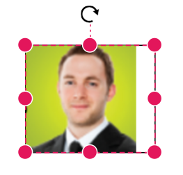
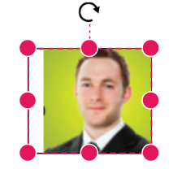
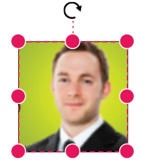
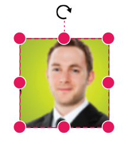

# Node Shapes in Blazor Diagram Component

Diagram supports creating several kinds of nodes. The available shape types include:

* Text shape
* Image shape
* Path shape
* Basic shape
* Flow shape
* SVG shape
* HTML template 
* BPMN shape

## How to Create and Customize a Text Node

The diagram allows to add texts as [TextShape](https://help.syncfusion.com/cr/blazor/Syncfusion.Blazor.Diagram.TextShape.html). The [Content](https://help.syncfusion.com/cr/blazor/Syncfusion.Blazor.Diagram.TextShape.html#Syncfusion_Blazor_Diagram_TextShape_Content) property defines the text that is to be added. The [Style](https://help.syncfusion.com/cr/blazor/Syncfusion.Blazor.Diagram.Node.html#Syncfusion_Blazor_Diagram_Node_Style) of the node is used as [TextStyle](https://help.syncfusion.com/cr/blazor/Syncfusion.Blazor.Diagram.TextStyle.html) to customize the appearance of the text.

The following code illustrates how to create a text node.
```cshtml
@using Syncfusion.Blazor.Diagram

@* Initialize Diagram *@
<SfDiagramComponent Height="600px" Nodes="@nodes" />

@code
{
    SfDiagramComponent diagram;
    DiagramObjectCollection<Node> nodes = new DiagramObjectCollection<Node>();

    protected override void OnInitialized()
    {
        Node node = new Node()
        {
            ID = "node1",
            //Size of the node.
            Height = 100,
            Width = 100,
            //Position of the node.
            OffsetX = 100,
            OffsetY = 100,
            Shape = new TextShape()
            {
                //Set the Content of the text shape.
                Content = "Text Node"
            },
            
        };
        nodes.Add(node);
    }
}
```
A complete working sample can be downloaded from [GitHub](https://github.com/SyncfusionExamples/Blazor-Diagram-Examples/tree/master/UG-Samples/Shapes/TextNode)



## How to Create a Image Node

The diagram allows to add images as [ImageShape](https://help.syncfusion.com/cr/blazor/Syncfusion.Blazor.Diagram.ImageShape.html). The [Shape](https://help.syncfusion.com/cr/blazor/Syncfusion.Blazor.Diagram.Node.html#Syncfusion_Blazor_Diagram_Node_Shape) property of node allows to set the type of node and for image nodes, it should be set as **Image**. In addition, the [Source](https://help.syncfusion.com/cr/blazor/Syncfusion.Blazor.Diagram.ImageShape.html#Syncfusion_Blazor_Diagram_ImageShape_Source) property of shape enables to set the image.

The following code illustrates how an image node is created.

```cshtml
@using Syncfusion.Blazor.Diagram

@* Initialize Diagram *@
<SfDiagramComponent Height="600px" Nodes="@nodes" />

@code
{
    SfDiagramComponent diagram;
    DiagramObjectCollection<Node> nodes = new DiagramObjectCollection<Node>();

    protected override void OnInitialized()
    {
        Node node = new Node()
        {
            ID = "node1",
            //Size of the node
            Height = 100,
            Width = 100,
            //Position of the node
            OffsetX = 100,
            OffsetY = 100,
            Shape = new ImageShape()
            {
                Type = NodeShapes.Image,
                //Sets the source to the image shape
                Source = "https://cdn.syncfusion.com/content/images/company-logos/Syncfusion_Logo_Image.png"
            }
        };
        nodes.Add(node);
    }
}
```
A complete working sample can be downloaded from [GitHub](https://github.com/SyncfusionExamples/Blazor-Diagram-Examples/tree/master/UG-Samples/Shapes/ImageShape)



### How to Add a Base64 Encoded Image to an Image Node

The following code illustrates how to add a Base64 image to the image node.

```cshtml
@using Syncfusion.Blazor.Diagram

@* Initialize Diagram *@
<SfDiagramComponent Height="600px" Nodes="@nodes"></SfDiagramComponent>

@code
{
    //Initialize node collection with node
    DiagramObjectCollection<Node> nodes = new DiagramObjectCollection<Node>();

    protected override void OnInitialized()
    {
        Node node = new Node()
            {
                ID = "node1",
                //Size of the node
                Height = 100,
                Width = 100,
                //Position of the node
                OffsetX = 100,
                OffsetY = 100,
                //Sets type of the shape as image
                Shape = new ImageShape()
                {
                    Type = NodeShapes.Image,
                    Source = "data:image/gif;base64,R0lGODlhPQBEAPeoAJosM//AwO/AwHVYZ/z595kzAP/s7P+goOXMv8+fhw/v739/f+8PD98fH/8mJl+fn/9ZWb8/PzWlwv///6wWGbImAPgTEMImIN9gUFCEm/gDALULDN8PAD6atYdCTX9gUNKlj8wZAKUsAOzZz+UMAOsJAP/Z2ccMDA8PD/95eX5NWvsJCOVNQPtfX/8zM8+QePLl38MGBr8JCP+zs9myn/8GBqwpAP/GxgwJCPny78lzYLgjAJ8vAP9fX/+MjMUcAN8zM/9wcM8ZGcATEL+QePdZWf/29uc/P9cmJu9MTDImIN+/r7+/vz8/P8VNQGNugV8AAF9fX8swMNgTAFlDOICAgPNSUnNWSMQ5MBAQEJE3QPIGAM9AQMqGcG9vb6MhJsEdGM8vLx8fH98AANIWAMuQeL8fABkTEPPQ0OM5OSYdGFl5jo+Pj/+pqcsTE78wMFNGQLYmID4dGPvd3UBAQJmTkP+8vH9QUK+vr8ZWSHpzcJMmILdwcLOGcHRQUHxwcK9PT9DQ0O/v70w5MLypoG8wKOuwsP/g4P/Q0IcwKEswKMl8aJ9fX2xjdOtGRs/Pz+Dg4GImIP8gIH0sKEAwKKmTiKZ8aB/f39Wsl+LFt8dgUE9PT5x5aHBwcP+AgP+WltdgYMyZfyywz78AAAAAAAD///8AAP9mZv///wAAAAAAAAAAAAAAAAAAAAAAAAAAAAAAAAAAAAAAAAAAAAAAAAAAAAAAAAAAAAAAAAAAAAAAAAAAAAAAAAAAAAAAAAAAAAAAAAAAAAAAAAAAAAAAAAAAAAAAAAAAAAAAAAAAAAAAAAAAAAAAAAAAAAAAAAAAAAAAAAAAAAAAAAAAAAAAAAAAAAAAAAAAAAAAAAAAAAAAAAAAAAAAAAAAAAAAAAAAAAAAAAAAAAAAAAAAAAAAAAAAAAAAAAAAAAAAAAAAAAAAAAAAAAAAAAAAAAAAAAAAAAAAAAAAAAAAAAAAAAAAAAAAAAAAAAAAAAAAAAAAAAAAAAAAAAAAAAAAAAAAAAAAACH5BAEAAKgALAAAAAA9AEQAAAj/AFEJHEiwoMGDCBMqXMiwocAbBww4nEhxoYkUpzJGrMixogkfGUNqlNixJEIDB0SqHGmyJSojM1bKZOmyop0gM3Oe2liTISKMOoPy7GnwY9CjIYcSRYm0aVKSLmE6nfq05QycVLPuhDrxBlCtYJUqNAq2bNWEBj6ZXRuyxZyDRtqwnXvkhACDV+euTeJm1Ki7A73qNWtFiF+/gA95Gly2CJLDhwEHMOUAAuOpLYDEgBxZ4GRTlC1fDnpkM+fOqD6DDj1aZpITp0dtGCDhr+fVuCu3zlg49ijaokTZTo27uG7Gjn2P+hI8+PDPERoUB318bWbfAJ5sUNFcuGRTYUqV/3ogfXp1rWlMc6awJjiAAd2fm4ogXjz56aypOoIde4OE5u/F9x199dlXnnGiHZWEYbGpsAEA3QXYnHwEFliKAgswgJ8LPeiUXGwedCAKABACCN+EA1pYIIYaFlcDhytd51sGAJbo3onOpajiihlO92KHGaUXGwWjUBChjSPiWJuOO/LYIm4v1tXfE6J4gCSJEZ7YgRYUNrkji9P55sF/ogxw5ZkSqIDaZBV6aSGYq/lGZplndkckZ98xoICbTcIJGQAZcNmdmUc210hs35nCyJ58fgmIKX5RQGOZowxaZwYA+JaoKQwswGijBV4C6SiTUmpphMspJx9unX4KaimjDv9aaXOEBteBqmuuxgEHoLX6Kqx+yXqqBANsgCtit4FWQAEkrNbpq7HSOmtwag5w57GrmlJBASEU18ADjUYb3ADTinIttsgSB1oJFfA63bduimuqKB1keqwUhoCSK374wbujvOSu4QG6UvxBRydcpKsav++Ca6G8A6Pr1x2kVMyHwsVxUALDq/krnrhPSOzXG1lUTIoffqGR7Goi2MAxbv6O2kEG56I7CSlRsEFKFVyovDJoIRTg7sugNRDGqCJzJgcKE0ywc0ELm6KBCCJo8DIPFeCWNGcyqNFE06ToAfV0HBRgxsvLThHn1oddQMrXj5DyAQgjEHSAJMWZwS3HPxT/QMbabI/iBCliMLEJKX2EEkomBAUCxRi42VDADxyTYDVogV+wSChqmKxEKCDAYFDFj4OmwbY7bDGdBhtrnTQYOigeChUmc1K3QTnAUfEgGFgAWt88hKA6aCRIXhxnQ1yg3BCayK44EWdkUQcBByEQChFXfCB776aQsG0BIlQgQgE8qO26X1h8cEUep8ngRBnOy74E9QgRgEAC8SvOfQkh7FDBDmS43PmGoIiKUUEGkMEC/PJHgxw0xH74yx/3XnaYRJgMB8obxQW6kL9QYEJ0FIFgByfIL7/IQAlvQwEpnAC7DtLNJCKUoO/w45c44GwCXiAFB/OXAATQryUxdN4LfFiwgjCNYg+kYMIEFkCKDs6PKAIJouyGWMS1FSKJOMRB/BoIxYJIUXFUxNwoIkEKPAgCBZSQHQ1A2EWDfDEUVLyADj5AChSIQW6gu10bE/JG2VnCZGfo4R4d0sdQoBAHhPjhIB94v/wRoRKQWGRHgrhGSQJxCS+0pCZbEhAAOw=="
                },
                Style = new ShapeStyle() { StrokeColor = "White" }
            };
        nodes.Add(node);
    }
}
```
A complete working sample can be downloaded from [GitHub](https://github.com/SyncfusionExamples/Blazor-Diagram-Examples/tree/master/UG-Samples/Shapes/Base64image)



N> Deploy your HTML file in the web application and export the diagram (image node) or else the image node will not be exported in the Chrome and Firefox due to security issues.

### How to Stretch and Align Image Content

Stretch and align the image content anywhere but within the node boundary. The [Scale](https://help.syncfusion.com/cr/blazor/Syncfusion.Blazor.Diagram.ImageShape.html#Syncfusion_Blazor_Diagram_ImageShape_Scale) property of the node allows to stretch the image as you desire. (either to maintain proportion or to stretch). By default, the `Scale` property of the node is set as **Meet**. The following code illustrates how to scale or stretch the content of the image node.

```cshtml
@using Syncfusion.Blazor.Diagram

@* Initialize Diagram *@
<SfDiagramComponent Height="600px" Nodes="@nodes" />

@code
{
    SfDiagramComponent diagram;
    DiagramObjectCollection<Node> nodes = new DiagramObjectCollection<Node>();

    protected override void OnInitialized()
    {
        Node node = new Node()
        {
            ID = "node1",
            //Size of the node.
            Height = 100,
            Width = 100,
            //Position of the node.
            OffsetX = 100,
            OffsetY = 100,
            Shape = new ImageShape()
            {
                Type = NodeShapes.Image,
                Source = "/diagram/images/productmanager.png",
                //To stretch the image.
                Scale = DiagramScale.Meet,
                //To align the image.
                ImageAlign = ImageAlignment.XMinYMax
            }
        };
        nodes.Add(node);
    }
}
```


A complete working sample can be downloaded from [GitHub](https://github.com/SyncfusionExamples/Blazor-Diagram-Examples/tree/master/UG-Samples/Shapes/ImageAlign)

* [ImageAlign](https://help.syncfusion.com/cr/blazor/Syncfusion.Blazor.Diagram.ImageShape.html#Syncfusion_Blazor_Diagram_ImageShape_ImageAlign) property of the shape helps to align the image based on the x and y values in the node boundary. The following table illustrates the various image alignments in the node boundary.

|Scale |ImageAlign |Result|
|---|---|---|
|   Meet  |     XMinYMax  ||
|Meet|XMinYMin||
|Meet|XMaxYMax||
|None|XMinYMax||
|None|XMinYMin||
|Slice|XMinYMax||
|Slice|XMinYMin||

## How to Create HTML Template Shapes

HTML elements can be embedded in the diagram by setting the node Shape type to [HTML](https://help.syncfusion.com/cr/blazor/Syncfusion.Blazor.Diagram.NodeShapes.html#Syncfusion_Blazor_Diagram_NodeShapes_HTML). The `Shape` property of Node determines the node type. The following code illustrates how an HTML node is created.

```cshtml
@using Syncfusion.Blazor.Diagram

@* Add a Namespace for a Syncfusion<sup style="font-size:70%">&reg;</sup> control used in Diagrm HTML node *@
@using Syncfusion.Blazor.CircularGauge

@* Initialize Diagram with node template *@
<SfDiagramComponent Height="600px" Nodes="@nodes">
    <DiagramTemplates>
        <NodeTemplate>
            @{
                <SfCircularGauge Width="300px" Height="300px">
                    <CircularGaugeAxes>
                        <CircularGaugeAxis StartAngle="210" EndAngle="150" Minimum="0" Maximum="120" Radius="80%">
                            <CircularGaugeAxisLineStyle Width="10" Color="transparent">
                            </CircularGaugeAxisLineStyle>
                            <CircularGaugeAxisLabelStyle UseRangeColor="false">
                                <CircularGaugeAxisLabelFont Size="12px" FontFamily="Roboto" FontStyle="Regular">
                                </CircularGaugeAxisLabelFont>
                            </CircularGaugeAxisLabelStyle>
                            <CircularGaugeAxisMajorTicks Height="10" Offset="5" UseRangeColor="false">
                            </CircularGaugeAxisMajorTicks>
                            <CircularGaugeAxisMinorTicks Height="0" Width="0" UseRangeColor="false">
                            </CircularGaugeAxisMinorTicks>
                            <CircularGaugeAnnotations>
                                <CircularGaugeAnnotation Radius="30%" Angle="0" ZIndex="1" Content="Speedometer">
                                    <ContentTemplate>
                                        <div><span style="font-size:14px; color:#9E9E9E; font-family:Regular; margin-left: -33px">Speedometer</span></div>
                                    </ContentTemplate>
                                </CircularGaugeAnnotation>
                                <CircularGaugeAnnotation Radius="40%" Angle="180" ZIndex="1" Content="65 MPH">
                                    <ContentTemplate>
                                        <div><span style="font-size:20px; color:#424242; font-family:Regular; margin-left: -33px">65 MPH</span></div>
                                    </ContentTemplate>
                                </CircularGaugeAnnotation>
                            </CircularGaugeAnnotations>
                            <CircularGaugeRanges>
                                <CircularGaugeRange Start="0" End="40" Color="#30B32D" StartWidth="10" EndWidth="10" RoundedCornerRadius="0">
                                </CircularGaugeRange>
                                <CircularGaugeRange Start="40" End="80" Color="#FFDD00" StartWidth="10" EndWidth="10" RoundedCornerRadius="0">
                                </CircularGaugeRange>
                                <CircularGaugeRange Start="80" End="120" Color="#F03E3E" StartWidth="10" EndWidth="10" RoundedCornerRadius="0">
                                </CircularGaugeRange>
                            </CircularGaugeRanges>
                            <CircularGaugePointers>
                                <CircularGaugePointer Value="65" Radius="60%" PointerWidth="8">
                                    <CircularGaugePointerAnimation Enable="true"></CircularGaugePointerAnimation>
                                    <CircularGaugeCap Radius="7">
                                    </CircularGaugeCap>
                                    <CircularGaugeNeedleTail Length="18%">
                                    </CircularGaugeNeedleTail>
                                </CircularGaugePointer>
                            </CircularGaugePointers>
                        </CircularGaugeAxis>
                    </CircularGaugeAxes>
                </SfCircularGauge>
            }
        </NodeTemplate>
    </DiagramTemplates>
</SfDiagramComponent>

@code
{
    //Initialize node collection with node
    DiagramObjectCollection<Node> nodes = new DiagramObjectCollection<Node>();

    protected override void OnInitialized()
    {
        Node node = new Node()
        {
            ID = "node1",
            //Size of the node
            Width = 300,
            Height = 300,
            //Position of the node
            OffsetX = 400,
            OffsetY = 300,
            //sets the type of the shape as HTML
            Shape = new Shape()
            {
                Type = NodeShapes.HTML,
            }
        };
        nodes.Add(node);
    }
}
```
A complete working sample can be downloaded from [GitHub](https://github.com/SyncfusionExamples/Blazor-Diagram-Examples/tree/master/UG-Samples/Shapes/HTMLShape)



N> HTML nodes cannot be exported to image format, like JPEG and PNG. It is by design, while exporting the diagram is drawn in a canvas. Further, this canvas is exported into image formats. Currently, drawing in a canvas equivalent from all possible HTML is not feasible. Hence, this limitation. Also , HTML node always appears as topmost layer ( whose index is the higher index, even though it is defined at the last).

## How to Create a Basic Shape Node

The [BasicShapes](https://help.syncfusion.com/cr/blazor/Syncfusion.Blazor.Diagram.BasicShape.html) are common shapes that are used to represent the geometrical information visually. To create basic shapes, the `Type` of the shape should be set as **Basic**. Its `Shape` property can be set with any one of the built-in shapes. To render a rounded rectangle, set the type as **Basic** and shape as **Rectangle**. Set the [CornerRadius](https://help.syncfusion.com/cr/blazor/Syncfusion.Blazor.Diagram.BasicShape.html#Syncfusion_Blazor_Diagram_BasicShape_CornerRadius) property to specify the radius of rounded rectangle.

The following code example illustrates how to create a basic shape.

```cshtml
@using Syncfusion.Blazor.Diagram

@* Initialize Diagram *@
<SfDiagramComponent Height="600px" Nodes="@nodes" />

@code
{
    //Initialize node collection with node.
    DiagramObjectCollection<Node> nodes = new DiagramObjectCollection<Node>();

    protected override void OnInitialized()
    {
        Node node = new Node()
        {
            ID = "node1",
            //Size of the node.
            Height = 100,
            Width = 100,
            //Position of the node.
            OffsetX = 100,
            OffsetY = 100,
            //Sets the type of the shape as basic.
            Shape = new BasicShape()
            {
                Type = NodeShapes.Basic,
                Shape = NodeBasicShapes.Rectangle,
                //Sets the corner radius to the node shape.
                CornerRadius = 10
            },
            Style = new ShapeStyle() { Fill = "#6495ED" }
        };
        nodes.Add(node);
    }
}
```
A complete working sample can be downloaded from [GitHub](https://github.com/SyncfusionExamples/Blazor-Diagram-Examples/tree/master/UG-Samples/Shapes/BasicShape)

N> By default, the [Shape](https://help.syncfusion.com/cr/blazor/Syncfusion.Blazor.Diagram.Node.html#Syncfusion_Blazor_Diagram_Node_Shape) property of the node is set as **Basic**. Default property for `Shape` is **Rectangle**.
<br/> When `Shape` is not set for a basic shape, it is considered as a **Rectangle**.
<br/> The `CornerRadius` property applies only to basic shapes.
The list of basic shapes are as follows.



## How to Create a Path Shape Node

The [PathShape](https://help.syncfusion.com/cr/blazor/Syncfusion.Blazor.Diagram.PathShape.html) is a commonly used basic shape that allows visually to represent the geometrical information. As node path data, any geometrical data can be provided. Create own Geometry and assign it to data if you want anything different from the standard figures. A geometry does not require any dimension specifications, such as width or height, because it specifies its own size. If the node's size is set, the geometry is extended to fit the node's dimensions.

To create a path node, set the shape as **Path**. The [Data](https://help.syncfusion.com/cr/blazor/Syncfusion.Blazor.Diagram.PathShape.html#Syncfusion_Blazor_Diagram_PathShape_Data). The following code illustrates how a path node is created.

```cshtml
@using Syncfusion.Blazor.Diagram

@* Initialize Diagram *@
<SfDiagramComponent Height="600px" Nodes="@NodeCollection">
    <SnapSettings Constraints="SnapConstraints.None"></SnapSettings>
</SfDiagramComponent>
@code
{
    //Initialize node collection with node
    DiagramObjectCollection<Node> NodeCollection = new DiagramObjectCollection<Node>()
       {
         // Creates a path node
         new Node()
         {
             ID="node1",
             //Size of the node
             Height=100,
             Width=100,
             //Position of the node
             OffsetX=100,
             OffsetY=100,
             //Sets the type of the shape as path
             Shape=new PathShape()
             {
                 Type=NodeShapes.Path,
                 Data="M 355.31 12.07 C 352.11 5.95 345.35 -1.14 331.41 0.15 C 290.33 3.93 209.61 81.48 190.42 111.69 C 189.66 107.76 187.9 101.49 184.12 98.05 C 189.5 87.75 198.01 69.64 201.57 52.48 C 202.4 52.26 203.12 51.68 203.34 50.44 C 203.72 48.34 204 46.22 204.39 44.13 C 205.01 40.62 199.99 39.43 199.42 42.91 C 199.06 45.06 198.69 47.15 198.35 49.31 C 198.16 50.6 198.69 51.62 199.54 52.14 C 196.08 68.87 187.75 86.63 182.43 96.81 C 181.52 96.29 180.53 95.87 179.41 95.7 C 179.09 95.65 178.8 95.72 178.5 95.71 C 178.19 95.72 177.91 95.65 177.59 95.7 C 176.46 95.87 175.48 96.29 174.56 96.81 C 169.24 86.63 160.92 68.87 157.46 52.14 C 158.3 51.62 158.83 50.6 158.65 49.31 C 158.3 47.15 157.93 45.06 157.58 42.91 C 157.01 39.43 151.99 40.62 152.61 44.13 C 152.99 46.22 153.28 48.34 153.66 50.44 C 153.87 51.68 154.6 52.27 155.42 52.48 C 158.98 69.63 167.49 87.75 172.87 98.05 C 169.09 101.49 167.33 107.76 166.57 111.69 C 147.39 81.48 66.67 3.93 25.59 0.15 C 11.65 -1.14 4.89 5.95 1.69 12.07 C -2.05 19.07 0.84 33.48 6.24 58.46 C 8.66 69.55 11.16 80.96 12.94 92.2 C 13.89 98.36 14.79 104.49 15.64 110.36 C 19.39 136.89 22.52 158.97 32.64 166.04 C 35.41 167.98 38.65 168.78 42.61 168.24 C 52.26 165.95 63.79 164.03 75.99 162.67 C 64.03 171.47 49.08 185.81 44.17 204.84 C 40.38 219.72 43.37 234.86 53.01 250.05 C 64.37 267.81 76.02 279.48 86.91 287.09 C 108.68 302.31 127.52 301.24 135.48 300.78 C 136.3 300.77 136.94 300.71 137.56 300.69 C 143.62 300.61 147.76 291.39 156.6 270.51 C 160.94 260.34 167.39 245.19 172.83 237.47 C 173.97 240.31 177.22 242.31 178.92 242.87 C 178.78 242.94 178.62 243.07 178.49 243.12 C 178.65 243.08 178.83 242.97 179 242.91 C 179.1 242.94 179.25 243.02 179.34 243.04 C 179.26 243.01 179.13 242.93 179.04 242.89 C 180.83 242.24 183.05 240.25 184.16 237.48 C 189.6 245.19 196.05 260.34 200.39 270.52 C 209.23 291.4 213.38 300.61 219.43 300.7 C 220.05 300.72 220.69 300.77 221.51 300.78 C 229.47 301.25 248.31 302.31 270.08 287.1 C 280.97 279.49 292.62 267.81 303.98 250.05 C 313.62 234.86 316.6 219.72 312.82 204.84 C 307.91 185.82 292.96 171.48 281 162.67 C 293.2 164.03 304.73 165.95 314.38 168.24 C 318.34 168.78 321.58 167.98 324.35 166.04 C 334.47 158.97 337.6 136.89 341.35 110.37 C 342.19 104.49 343.1 98.37 344.05 92.2 C 345.83 80.96 348.33 69.55 350.75 58.46 C 356.16 33.48 359.05 19.07 355.31 12.07 z M 183.92 237.56 C 182.35 240.3 180.35 242.13 178.97 242.86 C 177.49 242.19 174.7 240.38 173.08 237.56 C 173.08 237.56 166.19 138.22 166.91 113.58 C 166.91 113.58 169.24 97.92 178.5 97.81 C 187.76 97.92 190.09 113.58 190.09 113.58 C 190.81 138.22 183.92 237.56 183.92 237.56 z"
             },
             Style=new ShapeStyle()
             {
                 Fill="Orange"
             }
        }
    };
}
```
A complete working sample can be downloaded from [GitHub](https://github.com/SyncfusionExamples/Blazor-Diagram-Examples/tree/master/UG-Samples/Shapes/PathShape)



## How to Create a Flow Shape Node

The [Flow](https://help.syncfusion.com/cr/blazor/Syncfusion.Blazor.Diagram.FlowShape.html) shapes represent process flow. It is used for analyzing, designing and managing the documentation process. To create a flow shape, specify the shape type as **Flow**. By default, it is considered as a **Process**. The following code example illustrates how to create a flow shape.

```cshtml
@using Syncfusion.Blazor.Diagram

@* Initialize Diagram *@
<SfDiagramComponent Height="600px" Nodes="@nodes" />

@code
{
    //Initialize node collection with node.
    DiagramObjectCollection<Node> nodes = new DiagramObjectCollection<Node>();

    protected override void OnInitialized()
    {
        Node node = new Node()
        {
            ID = "node1",
            //Size of the node.
            Height = 100,
            Width = 100,
            //Position of the node.
            OffsetX = 100,
            OffsetY = 100,
            //Sets the type of the shape as flow.
            Shape = new FlowShape()
            {
                Type = NodeShapes.Flow,
                Shape = NodeFlowShapes.DirectData
            }
        };
        nodes.Add(node);
    }
}
```
A complete working sample can be downloaded from [GitHub](https://github.com/SyncfusionExamples/Blazor-Diagram-Examples/tree/master/UG-Samples/Shapes/FlowShape)

The list of flow shapes are as follows.



## How to Create a SVG Template Shape

The diagram provides support to embed SVG element into a node. The Shape property of the node allows to set the type of node. To create a SVG node, it should be set as [SVG](https://help.syncfusion.com/cr/blazor/Syncfusion.Blazor.Diagram.NodeShapes.html#Syncfusion_Blazor_Diagram_NodeShapes_SVG). The following code illustrates how a SVG node is created.

```cshtml
@using Syncfusion.Blazor.Diagram

@* Initialize Diagram *@
<SfDiagramComponent Height="600px" Nodes="@nodes">
    <SnapSettings Constraints="SnapConstraints.None"></SnapSettings>
    <DiagramTemplates>
        <NodeTemplate>
            @{
                if ((context as Node).Shape.Type == NodeShapes.SVG)
                {
                    <svg viewBox="0 0 100 100" xmlns="http://www.w3.org/2000/svg">
                        <!-- Using g to inherit presentation attributes -->
                        <g fill="white" stroke="green" stroke-width="5">
                            <circle cx="40" cy="40" r="25" />
                            <circle cx="60" cy="60" r="25" />
                        </g>
                    </svg>
                }
            }
        </NodeTemplate>
    </DiagramTemplates>
</SfDiagramComponent>

@code
{
    //Initialize node collection with node.
    DiagramObjectCollection<Node> nodes = new DiagramObjectCollection<Node>();

    protected override void OnInitialized()
    {
        Node node = new Node()
        {
            ID = "node1",
            // Size of the node.
            Height = 100,
            Width = 100,
            // Position of the node.
            OffsetX = 100,
            OffsetY = 100,
            //Sets type of the shape as SVG.
            Shape = new Shape() { Type = NodeShapes.SVG },
        };
        nodes.Add(node);
    }
}
```
A complete working sample can be downloaded from [GitHub](https://github.com/SyncfusionExamples/Blazor-Diagram-Examples/tree/master/UG-Samples/Shapes/SVGShape)



N> Similar to HTML node, SVG nodes cannot be exported to image format. The fill color of an SVG node can be overridden by inline style or fill of the SVG element specified in the template.

## Node with BPMN shapes

The [BPMN](https://help.syncfusion.com/cr/blazor/Syncfusion.Blazor.Diagram.NodeShapes.html#Syncfusion_Blazor_Diagram_NodeShapes_Bpmn) shapes visually represent Business Process Model and Notation elements such as events, tasks, gateways, and more. To create BPMN shapes, set the `Type` property of the shape to **Bpmn**.

Its Shape property can then be configured with any one of the available built-in BPMN subtypes, such as events, activities, or gateways. Customize each BPMN shape by specifying its category and characteristics (like Event, Trigger, Loop, etc.).


The following code example illustrates how to create a BPMN shape.

```cshtml
@using Syncfusion.Blazor.Diagram
@* Initialize Diagram *@
<SfDiagramComponent Height="600px" Nodes="@nodes" />
@code
{
    // Initialize node collection with Node.
    DiagramObjectCollection<Node> nodes;
    protected override void OnInitialized()
    {
        nodes = new DiagramObjectCollection<Node>();
        Node node = new Node()
        {
            // Position of the node.
            OffsetX = 100,
            OffsetY = 100,
            // Size of the node.
            Width = 100,
            Height = 100,
            // Unique Id of the node.
            ID = "node1",
            // Sets the shape to activity.
            Shape = new BpmnActivity() 
            { 
                ActivityType = BpmnActivityType.Task 
            },
        };
        nodes.Add(node);
    }
}
```
A complete working sample can be downloaded from [GitHub](https://github.com/SyncfusionExamples/Blazor-Diagram-Examples/tree/master/UG-Samples/Shapes)

For more information about node constraints, refer to the [BPMN Shapes](https://github.com/SyncfusionExamples/Blazor-Diagram-Examples/tree/master/UG-Samples/Shapes/BPMNShape).




## See also

* [How to Create Polygon and Circle Shapes in Blazor Diagram](https://support.syncfusion.com/kb/article/18054/how-to-create-polygon-and-circle-shapes-in-blazor-diagram)  
* [How to Export HTML Shapes Into Image and PDF Format in Blazor Diagram](https://support.syncfusion.com/kb/article/16039/how-to-export-html-shapes-into-image-and-pdf-format-in-blazor-diagram)  
* [How to Serialize the HTML Template Value of the NodeTemplate Property in Syncfusion<sup style="font-size:70%">&reg;</sup> Blazor Diagram](https://support.syncfusion.com/kb/article/17218/how-to-serialize-the-html-template-value-of-the-nodetemplate-property-in-syncfusion-blazor-diagram)  
* [How to Add Custom HTML Nodes in Symbol Palette for Blazor Diagram](https://support.syncfusion.com/kb/article/18737/how-to-add-custom-html-nodes-in-symbol-palette-for-blazor-diagram)  
* [How to Make HTML Node Resizable but Not Draggable in Blazor Diagram](https://support.syncfusion.com/kb/article/18727/how-to-make-html-node-resizable-but-not-draggable-in-blazor-diagram)  
* [How to Update HTML Node Size on HTML Template in Blazor Diagram](https://support.syncfusion.com/kb/article/18692/how-to-update-html-node-size-on-html-template-in-blazor-diagram)  
* [How to Print or Export the HTML and Native Node into Image Format in Blazor Diagram](https://support.syncfusion.com/kb/article/12332/how-to-print-or-export-the-html-and-native-node-into-image-format-in-blazor-diagarm)
