# Style in Blazor Diagram Component

## How to customize the connector endpoint handle

To change the appearance of the connector endpoint handle in a diagram, use the following CSS code:

```cshtml
<style>
    .e-diagram-endpoint-handle {
        fill: red;
        stroke: green;
    }
</style>
```
You can download a complete working sample from [GitHub](https://github.com/SyncfusionExamples/Blazor-Diagram-Examples/tree/master/UG-Samples)

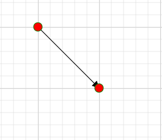

## How to customize the connector endpoint handle when it is connected

To change the appearance of the connector endpoint handle when it is connected, use the following CSS code:

```cshtml
<style>
    .e-diagram-endpoint-handle.e-connected {
    fill: red;
    stroke: green;
   }
</style>
```
You can download a complete working sample from [GitHub](https://github.com/SyncfusionExamples/Blazor-Diagram-Examples/tree/master/UG-Samples)

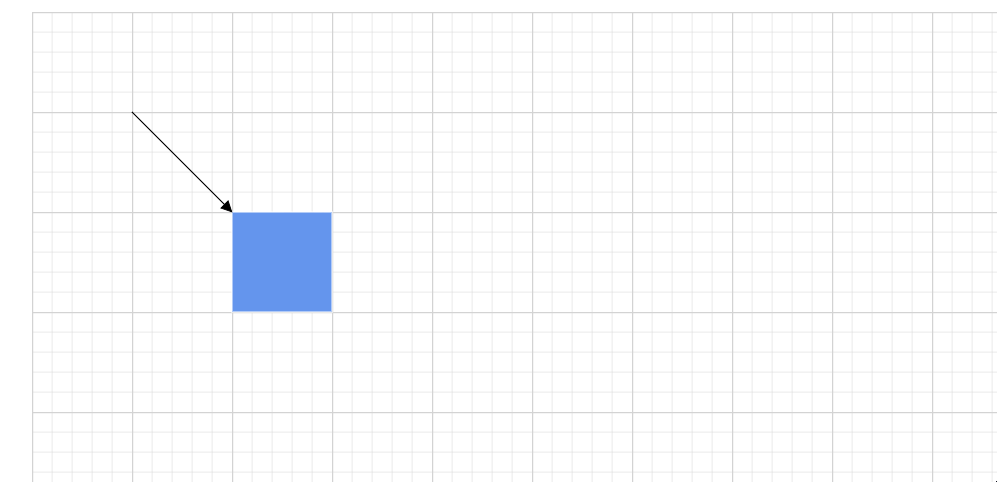

## How to customize the connector endpoint handle when it disable

To change the appearance of the connector endpoint handle when it is in a disabled state, use the following CSS code:

```cshtml
<style>
   .e-diagram-endpoint-handle.e-disabled {
    fill: red;
    opacity: 1;
    stroke: green;
   }
</style>
```
You can download a complete working sample from [GitHub](https://github.com/SyncfusionExamples/Blazor-Diagram-Examples/tree/master/UG-Samples)

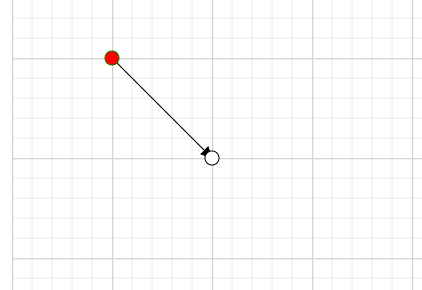

## How to customize the bezier connector handle

To change the appearance of the Bezier connector handle, use the following CSS code:

```cshtml
<style>
  .e-diagram-bezier-handle {
    fill: red;
    stroke: green;
  }
</style>
```
You can download a complete working sample from [GitHub](https://github.com/SyncfusionExamples/Blazor-Diagram-Examples/tree/master/UG-Samples)

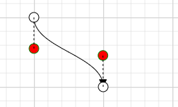

## How to customize the bezier connector line

To change the appearance of the Bezier connector line, use the following CSS code:

```cshtml
<style>
 .e-diagram-bezier-line {
  stroke: red;
}
</style>
```
You can download a complete working sample from [GitHub](https://github.com/SyncfusionExamples/Blazor-Diagram-Examples/tree/master/UG-Samples)

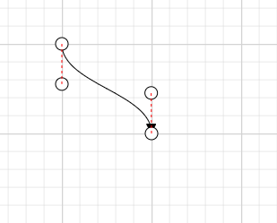

## How to customize the resize handle

To change the appearance of the resize handle, use the following CSS code:

```cshtml
<style>
    .e-diagram-resize-handle {
        fill: white;
        opacity: 1;
        stroke: white;
    }
</style>
```
You can download a complete working sample from [GitHub](https://github.com/SyncfusionExamples/Blazor-Diagram-Examples/tree/master/UG-Samples)

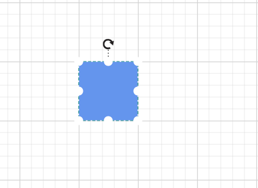

## How to customize the selector pivot line

To change the appearance of the selector pivot line, use the following CSS code:

```cshtml
<style>
  .e-diagram-pivot-line {
    stroke: red;
  }
</style>
```
You can download a complete working sample from [GitHub](https://github.com/SyncfusionExamples/Blazor-Diagram-Examples/tree/master/UG-Samples)

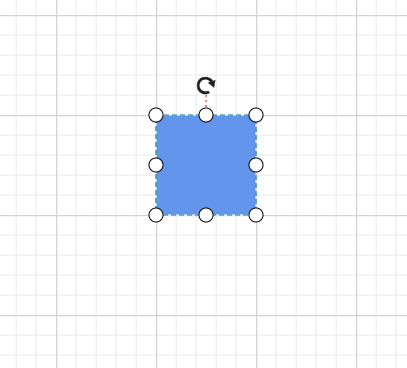

## How to customize the selector border

To change the appearance of the selector border, use the following CSS code:

```cshtml
<style>
 .e-diagram-border {
    stroke: red;
  }
</style>
```
You can download a complete working sample from [GitHub](https://github.com/SyncfusionExamples/Blazor-Diagram-Examples/tree/master/UG-Samples)

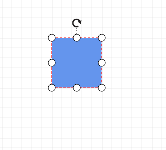

## How to customize the rotate handle

To change the appearance of the rotate handle, use the following CSS code:

```cshtml
<style>
.e-diagram-rotate-handle {
    fill: red;
    stroke: green;
  }
</style>
```
You can download a complete working sample from [GitHub](https://github.com/SyncfusionExamples/Blazor-Diagram-Examples/tree/master/UG-Samples)

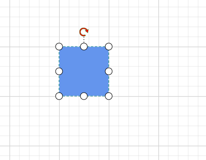

## How to customize the symbol palette while hovering over a symbol

To change the appearance of the symbol palette while hovering over a symbol, use the following CSS code:

```cshtml
<style>
.e-symbolpalette .e-symbol-hover:hover {
    background: red;
  }
</style>
```
You can download a complete working sample from [GitHub](https://github.com/SyncfusionExamples/Blazor-Diagram-Examples/tree/master/UG-Samples)

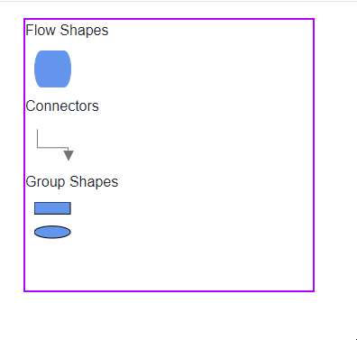

## How to customize the symbol palette when symbol is selected

To change the appearance of the symbol palette when a symbol is selected, use the following CSS code:

```cshtml
<style>
.e-symbolpalette .e-symbol-selected {
    background: blue;
  }
</style>
```
You can download a complete working sample from [GitHub](https://github.com/SyncfusionExamples/Blazor-Diagram-Examples/tree/master/UG-Samples)

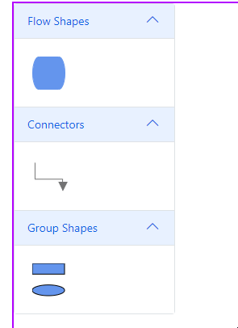

## How to customize the ruler

To change the appearance of the ruler properties, use the following CSS code:

```cshtml
<style>
.e-diagram .e-ruler {
    background-color: red;
    font-size: 13px;
  }
</style>
```
You can download a complete working sample from [GitHub](https://github.com/SyncfusionExamples/Blazor-Diagram-Examples/tree/master/UG-Samples)

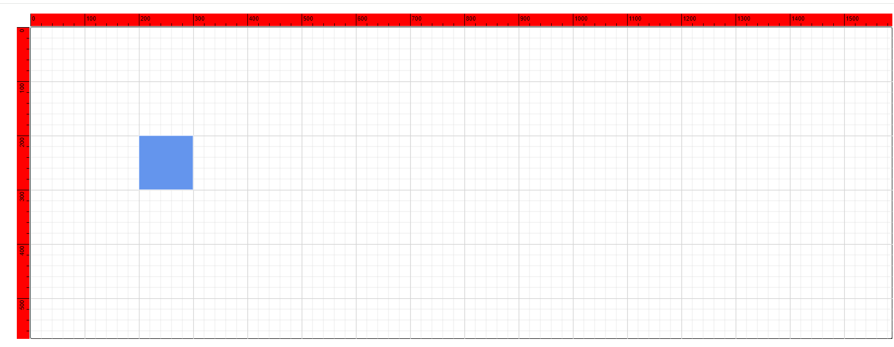

## How to customize the ruler overlap

To change the appearance of the ruler overlap properties, use the following CSS code:

```cshtml
<style>
.e-diagram .e-ruler-overlap {
    background-color: red;
  }
</style>
```
You can download a complete working sample from [GitHub](https://github.com/SyncfusionExamples/Blazor-Diagram-Examples/tree/master/UG-Samples)

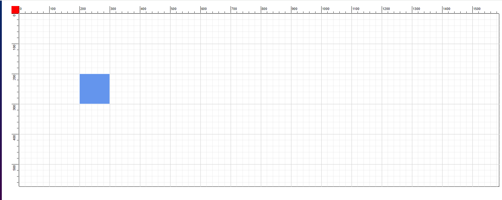

## How to customize the text edit

To change the appearance of the text edit properties, use the following CSS code:

```cshtml
<style>
 .e-diagram .e-diagram-text-edit {
    background: white;
    border-color: red;
    border-style: dashed;
    border-width: 1px;
    box-sizing: content-box;
    color: black;
    min-width: 50px;
  }
</style>
```
You can download a complete working sample from [GitHub](https://github.com/SyncfusionExamples/Blazor-Diagram-Examples/tree/master/UG-Samples)

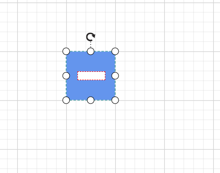

## How to customize the text edit on selection

To change the appearance of the text edit on selection properties, use the following CSS code:

```cshtml
<style>
 .e-diagram-text-edit::selection {
    background: red;
    color: green;
  }
</style>
```
You can download a complete working sample from [GitHub](https://github.com/SyncfusionExamples/Blazor-Diagram-Examples/tree/master/UG-Samples)

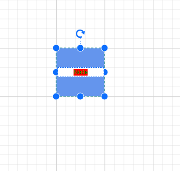

## How to customize the highlighter

To change the appearance of the highlighter, use the following CSS code:

```cshtml
<style>
.e-diagram-highlighter {
  stroke:red;
  stroke-width: 7;
}
</style>
```
You can download a complete working sample from [GitHub](https://github.com/SyncfusionExamples/Blazor-Diagram-Examples/tree/master/UG-Samples)

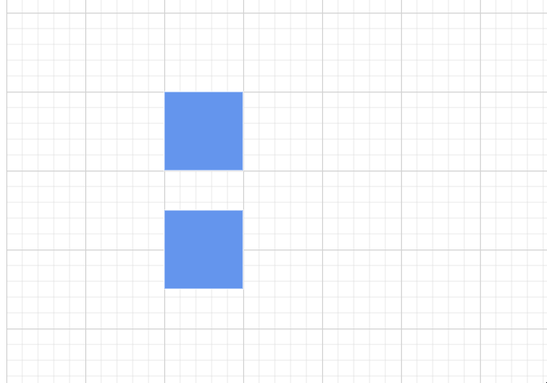

## How to customize the diagram background color

To change the background color of the diagram, use the following CSS code:

```cshtml
<style>
  .e-diagram {
      background-color: green;
  }
</style>
```
You can download a complete working sample from [GitHub](https://github.com/SyncfusionExamples/Blazor-Diagram-Examples/tree/master/UG-Samples)

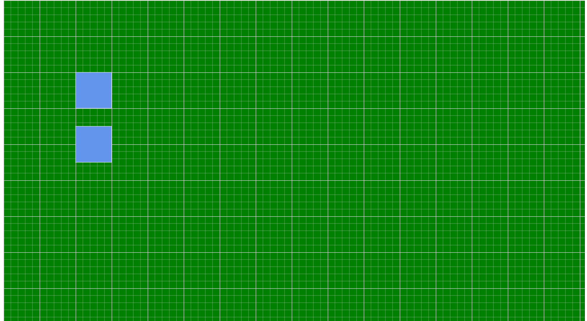

## How to customize the overview resize handle

To change the appearance of the overview resize handle, use the following CSS code:

```cshtml
<style>
    .overviewresizer
    {
          fill:blue;
    }
</style>
```
You can download a complete working sample from [GitHub](https://github.com/SyncfusionExamples/Blazor-Diagram-Examples/tree/master/UG-Samples)

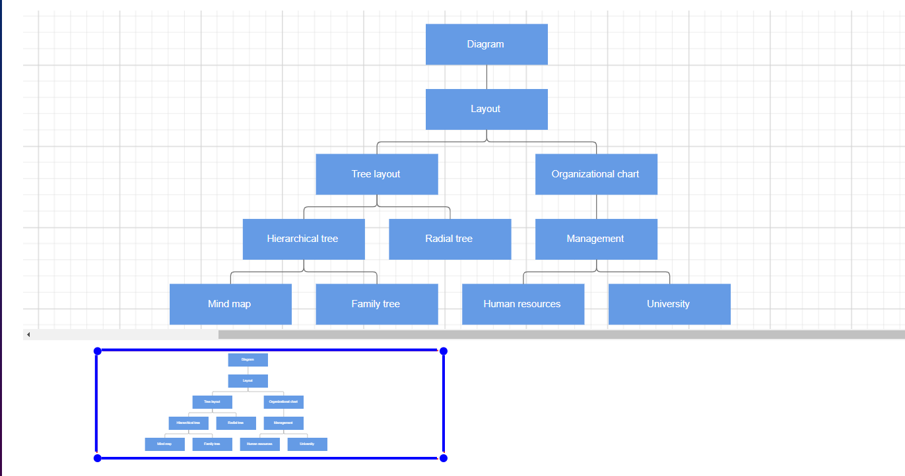

## How to customize the helper

To change the appearance of the helper, use the following CSS code:

```cshtml
<style>
   .e-diagram-helper {
      stroke: red;
      stroke-width: 5px;
  }

</style>
```
You can download a complete working sample from [GitHub](https://github.com/SyncfusionExamples/Blazor-Diagram-Examples/tree/master/UG-Samples)

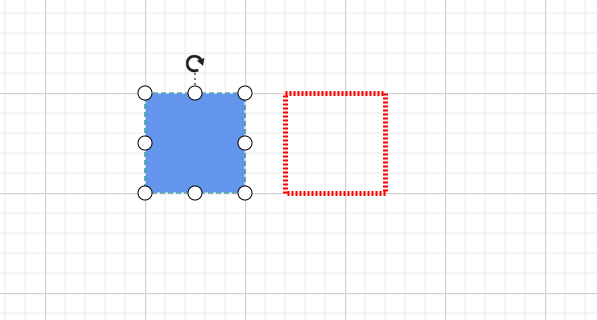

## How to customize the grid

To change the appearance of the grid, use the following CSS code:

```cshtml
<style>
     .e-diagram-thin-grid {
       stroke: red;
   }

</style>
```
You can download a complete working sample from [GitHub](https://github.com/SyncfusionExamples/Blazor-Diagram-Examples/tree/master/UG-Samples)

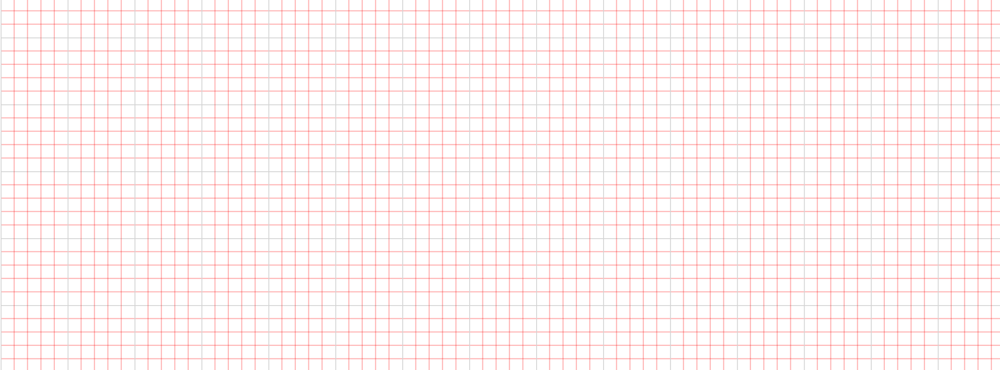

To change the appearance of the thick grid, use the following CSS code:

```cshtml
<style>
     .e-diagram-thick-grid {
       stroke: red;
   }

</style>
```
You can download a complete working sample from [GitHub](https://github.com/SyncfusionExamples/Blazor-Diagram-Examples/tree/master/UG-Samples)

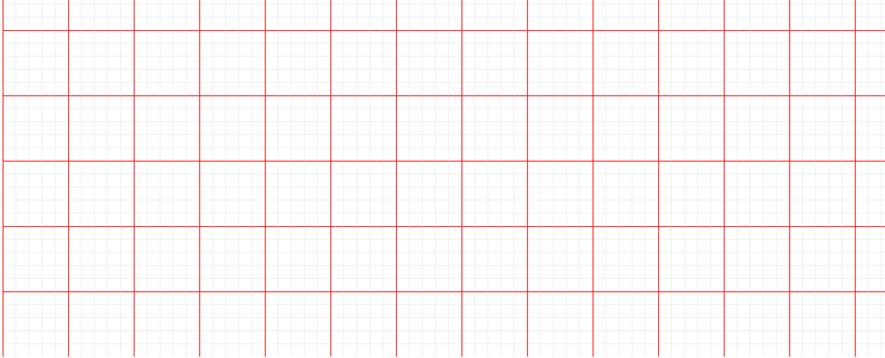

## How to customize the symbol palette symbols background color

To change the appearance of the symbol palette symbols' background color, use the following CSS code:

```cshtml
<style>
     .e-symbol-draggable {
       stroke: red;
   }

</style>
```
You can download a complete working sample from [GitHub](https://github.com/SyncfusionExamples/Blazor-Diagram-Examples/tree/master/UG-Samples)

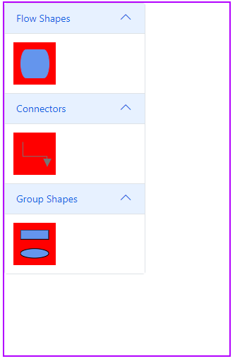


## How to customize the style of orthogonal segment thumb

To change the appearance of the Orthogonal segment thumb, use the following CSS code:

```cshtml
<style>
     .e-diagram-ortho-segment-handle {
       stroke: red;
       stroke-width: 1px;
       fill: green;
   }

</style>
```
You can download a complete working sample from [GitHub](https://github.com/SyncfusionExamples/Blazor-Diagram-Examples/tree/master/UG-Sample/Style/OrthogonalThumbStyle)

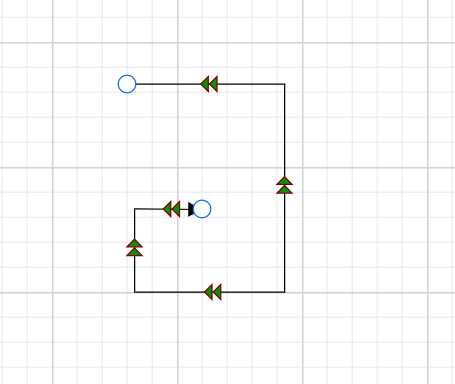