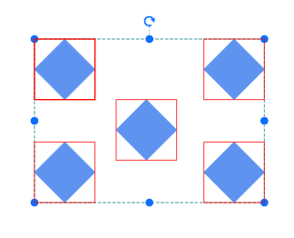
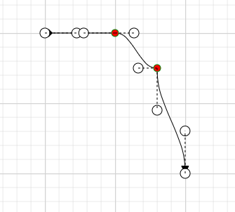

# Style in Blazor Diagram Component

## How to Customize the Connector Endpoint Handle

To customize the visual appearance of the connector endpoint handle in a diagram, apply the following CSS code:

```cshtml
<style>
    .e-diagram-endpoint-handle {
        fill: red;
        stroke: green;
    }
</style>
```
A complete working sample can be downloaded from [GitHub](https://github.com/SyncfusionExamples/Blazor-UG-Examples/tree/master/Diagram/Server/Pages/Style)


## How to Customize the Connector Endpoint Handle When it is Connected

To customize the visual appearance of the connector endpoint handle in a connected state, apply the following CSS code:

```cshtml
<style>
    .e-diagram-endpoint-handle.e-connected {
    fill: red;
    stroke: green;
   }
</style>
```
A complete working sample can be downloaded from [GitHub](https://github.com/SyncfusionExamples/Blazor-UG-Examples/tree/master/Diagram/Server/Pages/Style)


## How to Customize the Connector Endpoint Handle When it is Disabled

To customize the visual appearance of the connector endpoint handle when it is in a disabled state, apply the following CSS code to the Blazor application:

```cshtml
<style>
   .e-diagram-endpoint-handle.e-disabled {
    fill: red;
    opacity: 1;
    stroke: green;
   }
</style>
```
A complete working sample can be downloaded from [GitHub](https://github.com/SyncfusionExamples/Blazor-UG-Examples/tree/master/Diagram/Server/Pages/Style)


## How to Customize the Bezier Connector Handle

To customize the appearance of the Bezier connector handle, apply the following CSS code to the Blazor application:

```cshtml
<style>
  .e-diagram-bezier-handle {
    fill: red;
    stroke: green;
  }
</style>
```
A complete working sample can be downloaded from [GitHub](https://github.com/SyncfusionExamples/Blazor-UG-Examples/tree/master/Diagram/Server/Pages/Style)


## How to Customize the Bezier Connector Line

To customize the appearance of the Bezier connector line, apply the following CSS code to the Blazor diagram:

```cshtml
<style>
 .e-diagram-bezier-line {
  stroke: red;
}
</style>
```
A complete working sample can be downloaded from [GitHub](https://github.com/SyncfusionExamples/Blazor-UG-Examples/tree/master/Diagram/Server/Pages/Style)


## How to Customize the Resize Handle

To customize the appearance of the resize handle, apply the following CSS code to the Blazor application:

```cshtml
<style>
    .e-diagram-resize-handle {
        fill: white;
        opacity: 1;
        stroke: white;
    }
</style>
```
A complete working sample can be downloaded from [GitHub](https://github.com/SyncfusionExamples/Blazor-UG-Examples/tree/master/Diagram/Server/Pages/Style)


## How to Customize the Selector Pivot Line

To customize the appearance of the selector pivot line, apply the following CSS properties:

```cshtml
<style>
  .e-diagram-pivot-line {
    stroke: red;
  }
</style>
```
A complete working sample can be downloaded from [GitHub](https://github.com/SyncfusionExamples/Blazor-UG-Examples/tree/master/Diagram/Server/Pages/Style)


## How to Customize the Selector Border

To customize the appearance of the selector border, apply the following CSS styles:

```cshtml
<style>
 .e-diagram-border {
    stroke: red;
  }
</style>
```
A complete working sample can be downloaded from [GitHub](https://github.com/SyncfusionExamples/Blazor-UG-Examples/tree/master/Diagram/Server/Pages/Style)


## How to Customize Highlights for Selected Diagram Elements

To customize the appearance of the highlighter for selected diagram elements, apply the following CSS styles:

```cshtml
<style>
 .e-diagram-first-selection-indicator {
    stroke: red !important;
  }
  .e-diagram-selection-indicator {
    stroke: red !important;
  }
</style>
```
A complete working sample can be downloaded from [GitHub](https://github.com/SyncfusionExamples/Blazor-UG-Examples/tree/master/Diagram/Server/Pages/Style)



## How to Customize the Rotate Handle

To customize the appearance of the rotation handle, apply the following CSS code to the Blazor diagram:

```cshtml
<style>
.e-diagram-rotate-handle {
    fill: red;
    stroke: green;
  }
</style>
```
A complete working sample can be downloaded from [GitHub](https://github.com/SyncfusionExamples/Blazor-UG-Examples/tree/master/Diagram/Server/Pages/Style)


## How to Customize the Symbol Palette While Hovering Over a Symbol

To customize the visual appearance of symbols in the symbol palette during mouse hover, apply the following CSS code to the Blazor Diagram component:

```cshtml
<style>
.e-symbolpalette .e-symbol-hover:hover {
    background: red;
  }
</style>
```
A complete working sample can be downloaded from [GitHub](https://github.com/SyncfusionExamples/Blazor-UG-Examples/tree/master/Diagram/Server/Pages/Style)


## How to Customize the Symbol Palette When a Symbol Is Selected

To customize the visual appearance of the symbol palette when a symbol is selected, apply the following CSS code to enhance the user interface:

```cshtml
<style>
.e-symbolpalette .e-symbol-selected {
    background: blue;
  }
</style>
```
A complete working sample can be downloaded from [GitHub](https://github.com/SyncfusionExamples/Blazor-UG-Examples/tree/master/Diagram/Server/Pages/Style)


## How to Customize the Ruler

To customize the visual appearance of ruler properties, apply the following CSS code to the Blazor diagram:

```cshtml
<style>
.e-diagram .e-ruler {
    background-color: red;
    font-size: 13px;
  }
</style>
```
A complete working sample can be downloaded from [GitHub](https://github.com/SyncfusionExamples/Blazor-UG-Examples/tree/master/Diagram/Server/Pages/Style)


## How to Customize the Ruler Overlap

To customize the visual appearance of ruler overlap properties, apply the following CSS code to the Blazor diagram component:

```cshtml
<style>
.e-diagram .e-ruler-overlap {
    background-color: red;
  }
</style>
```
A complete working sample can be downloaded from [GitHub](https://github.com/SyncfusionExamples/Blazor-UG-Examples/tree/master/Diagram/Server/Pages/Style)


## How to Customize the Text Edit

To customize the appearance of the text edit properties, apply the following CSS code to the Blazor application:

```cshtml
<style>
 .e-diagram .e-diagram-text-edit {
    background: white;
    border-color: red;
    border-style: dashed;
    border-width: 1px;
    box-sizing: content-box;
    color: black;
    min-width: 50px;
  }
</style>
```
A complete working sample can be downloaded from [GitHub](https://github.com/SyncfusionExamples/Blazor-UG-Examples/tree/master/Diagram/Server/Pages/Style)


## How to Customize the Text Edit on Selection

To customize the appearance of the text edit control when selected, apply the following CSS properties:

```cshtml
<style>
 .e-diagram-text-edit::selection {
    background: red;
    color: green;
  }
</style>
```
A complete working sample can be downloaded from [GitHub](https://github.com/SyncfusionExamples/Blazor-UG-Examples/tree/master/Diagram/Server/Pages/Style)


## How to Customize the Highlighter

To customize the appearance of the highlighter, use the following CSS code:

```cshtml
<style>
.e-diagram-highlighter {
  stroke:red;
  stroke-width: 7;
}
</style>
```
A complete working sample can be downloaded from [GitHub](https://github.com/SyncfusionExamples/Blazor-UG-Examples/tree/master/Diagram/Server/Pages/Style)


## How to Customize the Diagram Background Color

To customize the background color of the diagram, apply the following CSS rule:

```cshtml
<style>
  .e-diagram {
      background-color: green;
  }
</style>
```
A complete working sample can be downloaded from [GitHub](https://github.com/SyncfusionExamples/Blazor-UG-Examples/tree/master/Diagram/Server/Pages/Style)


## How to Customize the Overview Resize Handle

To customize the appearance of the overview resize handle, apply the following CSS code to the Blazor application:

```cshtml
<style>
    .overviewresizer
    {
          fill:blue;
    }
</style>
```
A complete working sample can be downloaded from [GitHub](https://github.com/SyncfusionExamples/Blazor-UG-Examples/tree/master/Diagram/Server/Pages/Style)


## How to Customize the Helper

To customize the appearance of the helper element, apply the following CSS rules:

```cshtml
<style>
   .e-diagram-helper {
      stroke: red;
      stroke-width: 5px;
  }

</style>
```
A complete working sample can be downloaded from [GitHub](https://github.com/SyncfusionExamples/Blazor-UG-Examples/tree/master/Diagram/Server/Pages/Style)


## How to Customize the Grid

To customize the visual appearance of the diagram grid, apply the following CSS styles:

```cshtml
<style>
     .e-diagram-thin-grid {
       stroke: red;
   }

</style>
```
A complete working sample can be downloaded from [GitHub](https://github.com/SyncfusionExamples/Blazor-UG-Examples/tree/master/Diagram/Server/Pages/Style)


To customize the appearance of the thick grid lines in the diagram, apply the following CSS code:

```cshtml
<style>
     .e-diagram-thick-grid {
       stroke: red;
   }

</style>
```
A complete working sample can be downloaded from [GitHub](https://github.com/SyncfusionExamples/Blazor-UG-Examples/tree/master/Diagram/Server/Pages/Style)


## How to Customize the Symbol Palette Symbols Background Color

To customize the background color of symbols in the symbol palette, apply the following CSS code:

```cshtml
<style>
     .e-symbol-draggable {
       stroke: red;
   }

</style>
```
A complete working sample can be downloaded from [GitHub](https://github.com/SyncfusionExamples/Blazor-UG-Examples/tree/master/Diagram/Server/Pages/Style)


## How to Customize the Orthogonal Segment Thumb


To customize the visual appearance of the orthogonal segment thumb, apply the following CSS code to the stylesheet:


```cshtml
<style>
     .e-diagram-ortho-segment-handle {
       stroke: red;
       stroke-width: 1px;
       fill: green;
   }
</style>
```
A complete working sample can be downloaded from [GitHub](https://github.com/SyncfusionExamples/Blazor-UG-Examples/tree/master/Diagram/Server/Pages/Style)


## How to Customize the Bezier and Straight Segment Thumb 
To customize the visual appearance of Bezier and Straight connector segments, apply the following CSS code:

```cshtml
<style>
  .e-diagram-bezier-segment-handle {
    fill: red;
    stroke: green;
  }
</style>
```
You can download a complete working sample from [GitHub](https://github.com/SyncfusionExamples/Blazor-UG-Examples/tree/master/Diagram/Server/Pages/Style)



## see also

* [How to Set Background Color for Entire Diagram Area in Blazor Diagram](https://support.syncfusion.com/kb/article/16016/how-to-set-background-color-for-entire-diagram-area-in-blazor-diagram)