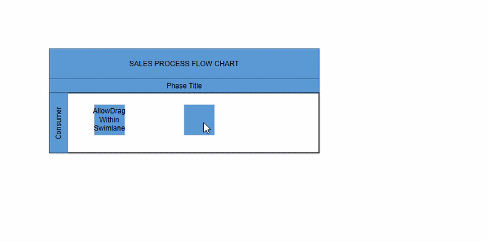

# Lane Interaction in Blazor Diagram Component

The diagram supports interactive lane operations, including selecting, resizing, and swapping lanes, as well as working with child elements inside lanes. 

## How to Select a Lane

A [Lane](https://help.syncfusion.com/cr/blazor/Syncfusion.Blazor.Diagram.Lane.html) can be selected by clicking (tapping) the header of the lane.

## How to Resize a Lane

* A lane can be resized in the bottom and right direction.
* A lane can be resized by using the resize selector of the lane.
* A lane can be resized by dragging the bottom and right border of the lane without making a selection.
* When a lane is resized, the parent swimlane will automatically adjust its size.
* A lane can resized either by resizing the selector or the tight bounds of the child objects. If a child node moves to the edge of the lane, it can be automatically resized.

The following image shows how to resize the lane.


## How to Swap Lanes

* Lanes can be swapped by dragging a lane over another lane.
* A helper indicator appears to show the insertion position during lane swapping.
The following image shows how to swap lanes.


## How to Interact with Child Nodes in Lanes

* Resize child nodes within swimlanes.
* You can drag the child nodes within the lane.
* Drag child nodes within the same lane to reposition them.
* Drag and drop the child nodes from a lane to the diagram.
* Drag and drop the child nodes from diagram to the lane.
* Based on the child node interactions, the lane size will be updated.

The following image shows children interaction in lane.


## How to restrict nodes from being dragged or repositioned outside their assigned swimlane

To restrict child nodes to their swimlane, set their [Constraints](https://help.syncfusion.com/cr/blazor/Syncfusion.Blazor.Diagram.Node.html#Syncfusion_Blazor_Diagram_Node_Constraints) to include [NodeConstraints.AllowDragWithinSwimlane](https://help.syncfusion.com/cr/blazor/Syncfusion.Blazor.Diagram.NodeConstraints.html#Syncfusion_Blazor_Diagram_NodeConstraints_AllowDragWithinSwimlane). By default, nodes can move freely; however, with this constraint enabled, a node can only be dragged within the bounds of its owning swimlane. Attempts to move it across lane or swimlane boundaries are prevented.

The following example demonstrates one node restricted to its swimlane, while another remains unrestricted for comparison.

```cshtml
@using Syncfusion.Blazor.Diagram

<SfDiagramComponent Height="600px" Swimlanes="@SwimlaneCollections" NodeCreating="@OnNodeCreating" >
    <SnapSettings Constraints="SnapConstraints.None"></SnapSettings>
</SfDiagramComponent>

@code
{
    //Define diagram's swimlane collection
    DiagramObjectCollection<Swimlane> SwimlaneCollections = new DiagramObjectCollection<Swimlane>();

    protected override void OnInitialized()
    {
        // A swimlane is created and stored in the swimlanes collection.
        Swimlane swimlane = new Swimlane()
        {
            Header = new SwimlaneHeader()
            {
                Annotation = new ShapeAnnotation()
                {
                    Content = "SALES PROCESS FLOW CHART"
                },
                Height = 50,
            },
            OffsetX = 400,
            OffsetY = 200,
            Height = 120,
            Width = 450,
            Lanes = new DiagramObjectCollection<Lane>()
            {
                new Lane()
                {
                    Height = 100,
                    Header = new SwimlaneHeader()
                    {
                        Width = 30,
                        Annotation = new ShapeAnnotation(){ Content = "Consumer" }
                    },
                    Children = new DiagramObjectCollection<Node>()
                    {
                        new Node()
                        {
                            Height = 50, 
                            Width = 100, 
                            LaneOffsetX = 100, 
                            LaneOffsetY = 30, 
                            //Enable AllowDragWithinSwimlane to restrict movement outside the swimlane
                            Constraints = NodeConstraints.Default | NodeConstraints.AllowDragWithinSwimlane , 
                            Annotations = new DiagramObjectCollection<ShapeAnnotation>()
                            { 
                                new ShapeAnnotation() 
                                { 
                                    Content="AllowDrag Within Swimlane",
                                    Style= new  TextStyle()
                                    {
                                        TextOverflow = TextOverflow.Wrap, TextWrapping = TextWrap.WrapWithOverflow
                                    }
                                } 
                            } 
                        },
                        new Node(){Height = 50, Width = 50, LaneOffsetX = 250, LaneOffsetY = 30},
                    }
                },
            }
        };
        // Add swimlane
        SwimlaneCollections.Add(swimlane);
    }

    private void OnNodeCreating(IDiagramObject obj)
    {
        if (obj is Swimlane swimlane)
        {
            swimlane.Header.Style = new TextStyle()
                {
                    Fill = "#5b9bd5",
                    StrokeColor = "#5b9bd5"
                };
            foreach (Phase phase in swimlane.Phases)
            {
                phase.Style = new ShapeStyle() { Fill = "#5b9bd5", StrokeColor = "#5b9bd5" };
            }
            foreach (Lane lane in swimlane.Lanes)
            {
                lane.Header.Style = new TextStyle() { Fill = "#5b9bd5", StrokeColor = "#5b9bd5" };
            }
        }
        else if (obj is Node node)
        {
            node.Style = new ShapeStyle()
                {
                    Fill = "#5b9bd5",
                    StrokeColor = "#5b9bd5"
                };
        }
    }
}

``` 
A complete working sample can be downloaded from [GitHub](https://github.com/SyncfusionExamples/Blazor-Diagram-Examples/tree/master/UG-Samples/Nodes/ActionsofNodes/AddNode)



>**Note:**
* To restrict a node to its owning swimlane, add [NodeConstraints.AllowDragWithinSwimlane](https://help.syncfusion.com/cr/blazor/Syncfusion.Blazor.Diagram.NodeConstraints.html#Syncfusion_Blazor_Diagram_NodeConstraints_AllowDragWithinSwimlane) to the node’s `Constraints` property.

* To enforce this restriction for all child nodes within swimlanes, set the [Constraints](https://help.syncfusion.com/cr/blazor/Syncfusion.Blazor.Diagram.Node.html#Syncfusion_Blazor_Diagram_Node_Constraints) during node initialization in the NodeCreating event.

