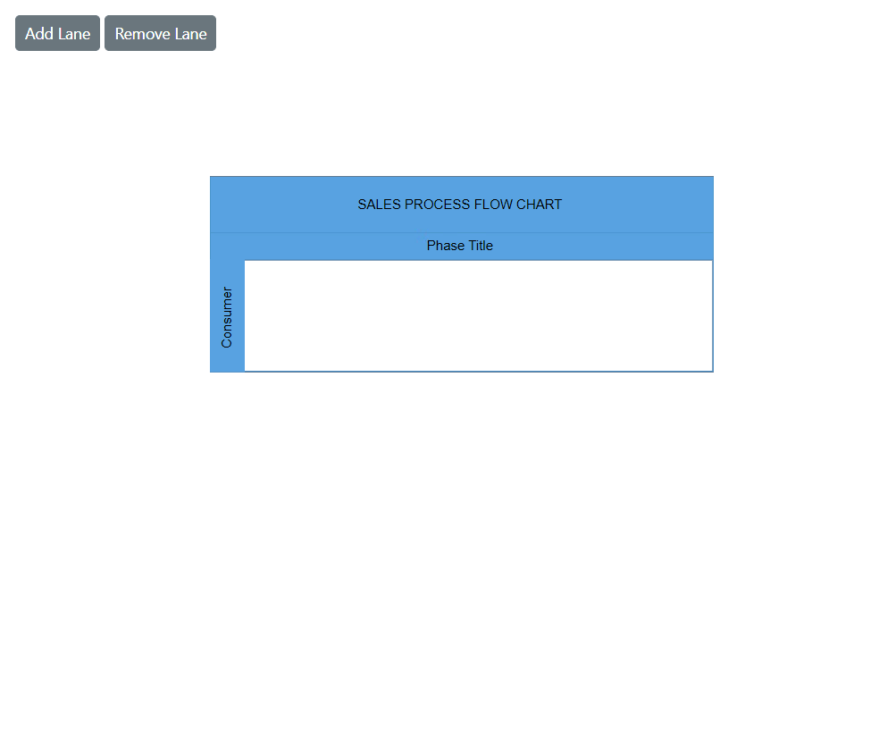
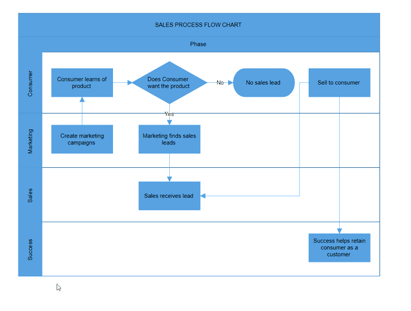

# Lane in Blazor Diagram Component

A [Lane](https://help.syncfusion.com/cr/blazor/Syncfusion.Blazor.Diagram.Lane.html) is a functional unit or responsible department in a business process that helps to map a process within the functional unit or between other functional units.

Multiple lanes can be added to a swimlane and rendered in the diagram. Lanes are automatically stacked inside the swimlane in the order they are added.

## How to Create an Empty Lane

* Create a [Lane](https://help.syncfusion.com/cr/blazor/Syncfusion.Blazor.Diagram.Lane.html) and add it to the [Lanes](https://help.syncfusion.com/cr/blazor/Syncfusion.Blazor.Diagram.Swimlane.html#Syncfusion_Blazor_Diagram_Swimlane_Lanes) collection of the swimlane.

> Note: For a horizontal swimlane, set the [Height](https://help.syncfusion.com/cr/blazor/Syncfusion.Blazor.Diagram.SwimlaneChild.html#Syncfusion_Blazor_Diagram_SwimlaneChild_Height) of the lane. For a vertical swimlane, set the [Width](https://help.syncfusion.com/cr/blazor/Syncfusion.Blazor.Diagram.SwimlaneChild.html#Syncfusion_Blazor_Diagram_SwimlaneChild_Width) of the lane.

The following code example explains how to define a swimlane with lane.

```cshtml
@using Syncfusion.Blazor.Diagram

<SfDiagramComponent Height="600px" Swimlanes="@SwimlaneCollections" NodeCreating="@OnNodeCreating" />

@code
{
    //Define diagram's swimlane collection.
    DiagramObjectCollection<Swimlane> SwimlaneCollections = new DiagramObjectCollection<Swimlane>();

    protected override void OnInitialized()
    {
        // A swimlane is created and stored in the swimlanes collection.
        Swimlane swimlane = new Swimlane()
        {
            Header = new SwimlaneHeader()
            {
                Annotation = new ShapeAnnotation()
                {
                    Content = "SALES PROCESS FLOW CHART"
                },
                Height = 50,
            },
            OffsetX = 400, OffsetY = 200, Height = 120, Width = 450,
            Lanes = new DiagramObjectCollection<Lane>()
            {
                new Lane(){Height = 100},
            }
        };
        // Add swimlane.
        SwimlaneCollections.Add(swimlane);
    }
    private void OnNodeCreating(IDiagramObject obj)
    {
       if (obj is Swimlane swimlane)
       {
         swimlane.Header.Style = new TextStyle()
             {
                 Fill = "#5b9bd5",
                 StrokeColor = "#5b9bd5"
             };
         foreach (Phase phase in swimlane.Phases)
         {
             phase.Style = new ShapeStyle() { Fill = "#5b9bd5", StrokeColor = "#5b9bd5" };
         }
         foreach (Lane lane in swimlane.Lanes)
         {
             lane.Header.Style = new TextStyle() { Fill = "#5b9bd5", StrokeColor = "#5b9bd5" };
         }
       }
    }
}
``` 


A complete working sample can be downloaded from [GitHub](https://github.com/SyncfusionExamples/Blazor-Diagram-Examples/tree/master/UG-Samples/Swimlanes/Lane/LaneCreation).


## How to Create and Customize Lane Header

* Use the [Header](https://help.syncfusion.com/cr/blazor/Syncfusion.Blazor.Diagram.Lane.html#Syncfusion_Blazor_Diagram_Lane_Header) property to describe the lane and customize the header appearance.
* Control the size of the lane header using the header [Width](https://help.syncfusion.com/cr/blazor/Syncfusion.Blazor.Diagram.SwimlaneChild.html#Syncfusion_Blazor_Diagram_SwimlaneChild_Width) and [Height](https://help.syncfusion.com/cr/blazor/Syncfusion.Blazor.Diagram.SwimlaneChild.html#Syncfusion_Blazor_Diagram_SwimlaneChild_Height) properties.
* Set the header appearance using the [Style](https://help.syncfusion.com/cr/blazor/Syncfusion.Blazor.Diagram.SwimlaneHeader.html#Syncfusion_Blazor_Diagram_SwimlaneHeader_Style) property.

The following code example shows how to define and customize a lane header.

```cshtml
@using Syncfusion.Blazor.Diagram

<SfDiagramComponent Height="600px" Swimlanes="@SwimlaneCollections"  NodeCreating="@OnNodeCreating"/>

@code
{
    //Define diagram's swimlane collection.
    DiagramObjectCollection<Swimlane> SwimlaneCollections = new DiagramObjectCollection<Swimlane>();

    protected override void OnInitialized()
    {
        // A swimlane is created and stored in the swimlanes collection.
        Swimlane swimlane = new Swimlane()
            {
                Header = new SwimlaneHeader()
                {
                    Annotation = new ShapeAnnotation()
                    {
                        Content = "SALES PROCESS FLOW CHART"
                    },
                    Height = 50,
                },
                OffsetX = 400,
                OffsetY = 200,
                Height = 120,
                Width = 450,
                Lanes = new DiagramObjectCollection<Lane>()
                {
                    new Lane(){Height = 100,
                    Header = new SwimlaneHeader(){
                        Width = 30,
                        Style = new TextStyle(){ Fill = "Teal"},
                        Annotation = new ShapeAnnotation(){ Content = "Consumer", Style = new TextStyle(){ Color = "White", TextDecoration = TextDecoration.Underline, Italic = true, Bold = true} }
                    } },
                }
            };
    // Add swimlane.
    SwimlaneCollections.Add(swimlane);
    }
    private void OnNodeCreating(IDiagramObject obj)
    {
       if (obj is Swimlane swimlane)
       {
           swimlane.Header.Style = new TextStyle()
           {
                Fill = "#5b9bd5",
                StrokeColor = "#5b9bd5"
           };
           foreach (Phase phase in swimlane.Phases)
           {
                phase.Style = new ShapeStyle() { Fill = "#5b9bd5", StrokeColor = "#5b9bd5" };
           }
        }
    }
}
``` 


A complete working sample can be downloaded from [GitHub](https://github.com/SyncfusionExamples/Blazor-Diagram-Examples/tree/master/UG-Samples/Swimlanes/Lane/LaneHeader).

.

Lane header annotations also support templates. Define HTML content at the tag level and enable template with the [UseTemplate](https://help.syncfusion.com/cr/blazor/Syncfusion.Blazor.Diagram.Annotation.html#Syncfusion_Blazor_Diagram_Annotation_UseTemplate) property. To assign different templates per lane, differentiate annotations by the `ID` property.

The following code example explains how to define a lane header annotation template:

```cshtml
@using Syncfusion.Blazor.Diagram

<SfDiagramComponent Height="600px" Swimlanes="@SwimlaneCollections">
    <DiagramTemplates>
        <AnnotationTemplate>
            @if (context is Annotation annotation)
            {
                if (annotation.ID == "Lane 1")
                {
                    string ID = annotation.ID + "TemplateContent";
                    <div id="@ID" class="profile-card" style="width:100%;height:100%;display:flex;align-items:center; gap:10px">
                        <svg xmlns="http://www.w3.org/2000/svg" height="24" width="24" viewBox="0 0 24 24">
                            <g>
                                <ellipse cy="12" cx="12" ry="12" rx="12" fill="#000000" />
                                <path id="path1" transform="rotate(0,12,12) translate(6.06543695926666,6) scale(0.375,0.375)  " fill="#FFFFFF" d="M15.827007,0C20.406003,0 24.346007,3.1960449 24.346007,9.2930298 24.346007,13.259033 22.542005,17.289001 20.180997,19.791992L20.193005,19.791992C19.287,22.627014 20.736997,23.299011 20.966,23.376038 25.997008,25.090027 31.651002,28.317993 31.651002,31.626038L31.651002,32 0,32 0,31.626038C8.034749E-08,28.414001 5.6260008,25.161011 10.421,23.376038 10.766993,23.244995 12.422999,22.317017 11.497004,19.817993 9.1220035,17.321045 7.3279971,13.275024 7.3279971,9.2930298 7.3279971,3.1960449 11.245006,0 15.827007,0z" />
                            </g>
                        </svg>
                        <div class="profile-name" style="font-size:12px;font-weight:bold;">Users</div>
                    </div>
                }              
            }
        </AnnotationTemplate>
    </DiagramTemplates>
</SfDiagramComponent>

@code
{
    //Define diagram's swimlane collection.
    DiagramObjectCollection<Swimlane> SwimlaneCollections = new DiagramObjectCollection<Swimlane>();

    protected override void OnInitialized()
    {
        // A swimlane is created and stored in the swimlanes collection.
        Swimlane swimlane = new Swimlane()
        {
            Header = new SwimlaneHeader()
            {
                Annotation = new ShapeAnnotation()
                {
                    Content = "SALES PROCESS FLOW CHART"
                },
                Height = 50,
            },
            OffsetX = 400,
            OffsetY = 200,
            Height = 120,
            Width = 450,
            Lanes = new DiagramObjectCollection<Lane>()
            {
                new Lane(){Height = 100,
                Header = new SwimlaneHeader(){
                    Width = 30,
                    Style = new TextStyle(){ Fill = "Teal"},
                    Annotation = new ShapeAnnotation(){ 
                        ID="Lane 1",
                        Content = "Lane 1",
                        UseTemplate = true,
                        Height = 50,
                        Width = 75,
                    },
                } },
            }
        };
        // Add swimlane.
        SwimlaneCollections.Add(swimlane);
    }
}
``` 


A complete working sample can be downloaded from [GitHub](https://github.com/SyncfusionExamples/Blazor-Diagram-Examples/tree/master/UG-Samples/Swimlanes/Lane/LaneHeaderTemplate)

.

## How to Add and Remove the Lane at Runtime

Add and remove a lane at runtime by using the `Add` and `Remove` methods of the [Swimlane.Lanes](https://help.syncfusion.com/cr/blazor/Syncfusion.Blazor.Diagram.Swimlane.html#Syncfusion_Blazor_Diagram_Swimlane_Lanes) Collection. The following code shows how to dynamically add and remove a lane in a swimlane.

```cshtml
@using Syncfusion.Blazor.Diagram
@using Syncfusion.Blazor.Buttons

<SfButton Content="Add Lane" OnClick="@AddLane" />
<SfButton Content="Remove Lane" OnClick="@RemoveLane" />
<SfDiagramComponent Height="600px" Swimlanes="@SwimlaneCollections" NodeCreating="@OnNodeCreating"/>

@code
{
    //Define diagram's swimlane collection.
    DiagramObjectCollection<Swimlane> SwimlaneCollections = new DiagramObjectCollection<Swimlane>();

        protected override void OnInitialized()
    {
        // A swimlane is created and stored in the swimlanes collection.
        Swimlane swimlane = new Swimlane()
            {
                Header = new SwimlaneHeader()
                {
                    Annotation = new ShapeAnnotation()
                    {
                        Content = "SALES PROCESS FLOW CHART"
                    },
                    Height = 50,
                },
                OffsetX = 400,
                OffsetY = 200,
                Height = 120,
                Width = 450,
                Lanes = new DiagramObjectCollection<Lane>()
                {
                    new Lane(){Height = 100,
                    Header = new SwimlaneHeader(){
                        Width = 30,
                        Annotation = new ShapeAnnotation(){ Content = "Consumer" }
                    } },
                }
            };
        // Add swimlane.
        SwimlaneCollections.Add(swimlane);
    }

    private void AddLane()
    {
        Lane newLane = new Lane() { Height = 100, 
            Header = new SwimlaneHeader()
            {
                 Annotation = new ShapeAnnotation() { Content = "Lane title" }, Width = 30,
                  Style = new TextStyle() { Fill = "#5b9bd5", StrokeColor = "#5b9bd5" }
            }
        };
        SwimlaneCollections[0].Lanes.Add(newLane);
    }

    private void RemoveLane()
    {
        Lane lane = SwimlaneCollections[0].Lanes[^1];
        SwimlaneCollections[0].Lanes.Remove(lane);
    }
    private void OnNodeCreating(IDiagramObject obj)
    {
        if (obj is Swimlane swimlane)
        {
            swimlane.Header.Style = new TextStyle()
             {
                 Fill = "#5b9bd5",
                 StrokeColor = "#5b9bd5"
             };
             foreach (Phase phase in swimlane.Phases)
             {
                 phase.Style = new ShapeStyle() { Fill = "#5b9bd5", StrokeColor = "#5b9bd5" };
             }
             foreach (Lane lane in swimlane.Lanes)
             {
                 lane.Header.Style = new TextStyle() { Fill = "#5b9bd5", StrokeColor = "#5b9bd5" };
             }
        }
    }
}
``` 


A complete working sample can be downloaded from [GitHub](https://github.com/SyncfusionExamples/Blazor-Diagram-Examples/tree/master/UG-Samples/Swimlanes/Lane/AddRemoveLaneAtRuntime).



## How to Add Children to Lane

 Add nodes to the lane by adding a node collection to the [Children](https://help.syncfusion.com/cr/blazor/Syncfusion.Blazor.Diagram.Lane.html#Syncfusion_Blazor_Diagram_Lane_Children) collection of the lane.

 The node [LaneOffsetX](https://help.syncfusion.com/cr/blazor/Syncfusion.Blazor.Diagram.Node.html#Syncfusion_Blazor_Diagram_Node_LaneOffsetX) and [LaneOffsetY](https://help.syncfusion.com/cr/blazor/Syncfusion.Blazor.Diagram.Node.html#Syncfusion_Blazor_Diagram_Node_LaneOffsetY) properties position the element within the lane canvas.

>Note: By default, lane children maintain a **20** pixels padding from the lane canvas.

The following code example shows how to add nodes to a lane.

```cshtml
@using Syncfusion.Blazor.Diagram

<SfDiagramComponent Height="600px" Swimlanes="@SwimlaneCollections" NodeCreating="@OnNodeCreating"/>

@code
{
    //Define diagram's swimlane collection.
    DiagramObjectCollection<Swimlane> SwimlaneCollections = new DiagramObjectCollection<Swimlane>();

    protected override void OnInitialized()
    {
        // A swimlane is created and stored in the swimlanes collection.
        Swimlane swimlane = new Swimlane()
            {
                Header = new SwimlaneHeader()
                {
                    Annotation = new ShapeAnnotation()
                    {
                        Content = "SALES PROCESS FLOW CHART"
                    },
                    Height = 50,
                },
                OffsetX = 400,
                OffsetY = 200,
                Height = 120,
                Width = 450,
                Lanes = new DiagramObjectCollection<Lane>()
                {
                    new Lane(){Height = 100,
                    Header = new SwimlaneHeader(){
                        Width = 30,
                        Annotation = new ShapeAnnotation(){ Content = "Consumer" }
                    },
                    Children = new DiagramObjectCollection<Node>()
                    {
                        new Node(){Height = 50, Width = 50, LaneOffsetX = 100, LaneOffsetY = 30},
                        new Node(){Height = 50, Width = 50, LaneOffsetX = 250, LaneOffsetY = 30},
                    }
                    },
                }
            };
        // Add swimlane.
        SwimlaneCollections.Add(swimlane);
    }
    private void OnNodeCreating(IDiagramObject obj)
    {
        if (obj is Swimlane swimlane)
        {
             swimlane.Header.Style = new TextStyle()
             {
                 Fill = "#5b9bd5",
                 StrokeColor = "#5b9bd5"
             };
             foreach (Phase phase in swimlane.Phases)
             {
                 phase.Style = new ShapeStyle() { Fill = "#5b9bd5", StrokeColor = "#5b9bd5" };
             }
             foreach (Lane lane in swimlane.Lanes)
             {
                 lane.Header.Style = new TextStyle() { Fill = "#5b9bd5", StrokeColor = "#5b9bd5" };
             }
        }
        else if (obj is Node node)
        {
             node.Style = new ShapeStyle()
             {
                 Fill = "#5b9bd5",
                 StrokeColor = "#5b9bd5"
             };
        }
    }
}
```


A complete working sample can be downloaded from [GitHub](https://github.com/SyncfusionExamples/Blazor-Diagram-Examples/tree/master/UG-Samples/Swimlanes/Lane/LaneChildren).

.

## How to Set the Orientation of a Lane

The [Orientation](https://help.syncfusion.com/cr/blazor/Syncfusion.Blazor.Diagram.Lane.html#Syncfusion_Blazor_Diagram_Lane_Orientation) property in the symbol palette defines whether a lane is displayed horizontally or vertically. This property is particularly relevant when the lane is part of a symbol palette.

* **Horizontal orientation**: The lane is aligned horizontally.
* **Vertical orientation**: The lane is aligned vertically.

Below is an example demonstrating how to set the orientation for lanes in an SfSymbolPaletteComponent:

```cshtml
   @using Syncfusion.Blazor.Diagram
   @using Syncfusion.Blazor.Diagram.SymbolPalette
<div class="control-section">
    <div style="width:80%;">
        <div id="palette-space" class="sb-mobile-palette" style="border: 2px solid #b200ff">
            <SfSymbolPaletteComponent @ref="@symbolpalette" Height="300px" Width="200px"
                                      Palettes="@Palettes" SymbolHeight="60" SymbolWidth="60" SymbolMargin="@SymbolMargin">
            </SfSymbolPaletteComponent>
        </div>
    </div>
</div>
@code
{
    //Reference the symbolpreview.
    DiagramSize SymbolPreview;
    //Define symbol margin.
    SymbolMargin SymbolMargin = new SymbolMargin { Left = 15, Right = 15, Top = 15, Bottom = 15 };
    SfSymbolPaletteComponent symbolpalette;
    //Define palattes collection.
    DiagramObjectCollection<Palette> Palettes = new DiagramObjectCollection<Palette>();
    // Defines palette's swimlane-shape collection.
    DiagramObjectCollection<NodeBase> SwimlaneNodes = new DiagramObjectCollection<NodeBase>();
    protected override void OnInitialized()
    {
        InitPaletteModel();
    }
    private void InitPaletteModel()
    {
        Palettes = new DiagramObjectCollection<Palette>();
        SwimlaneNodes = new DiagramObjectCollection<NodeBase>();
        //create a horizontal lane.
        Lane horizontalLane = new Lane()
            {
                ID = "HorizontalSwimlane",
                Orientation = Orientation.Horizontal,
                Height = 100,
                Width = 150,
                // Style = new TextStyle() { Fill = "orange", StrokeColor = "black" },
                Header = new SwimlaneHeader()
                {
                    Annotation = new ShapeAnnotation() { Content = "Lane Title" },
                    Style = new TextStyle() { Fill = "lightblue", StrokeColor = "black" },
                    Width = 25,
                    Height = 100
                },
            };
        //create a vertical lane.
        Lane verticalLane = new Lane()
            {
                ID = "VerticalSwimlane",
                Orientation = Orientation.Vertical,
                Height = 150,
                Width = 100,
                // Style = new TextStyle() { Fill = "orange", StrokeColor = "black" },
                Header = new SwimlaneHeader()
                {
                    Annotation = new ShapeAnnotation() { Content = "Lane Title" },
                    Style = new TextStyle() { Fill = "lightblue", StrokeColor = "black" },
                    Width = 100,
                    Height = 25
                },
            };
        SwimlaneNodes = new DiagramObjectCollection<NodeBase>()
        {
            horizontalLane,
            verticalLane,
        };
        Palettes = new DiagramObjectCollection<Palette>()
        {
            new Palette(){Symbols =SwimlaneNodes,Title="Swimlane Shapes",ID="SwimlaneShapes" },
        };
      }
    }
```


A complete working sample can be downloaded from [GitHub](https://github.com/SyncfusionExamples/Blazor-Diagram-Examples/tree/master/UG-Samples/Swimlanes/Lane/LaneOrientation).

.

## Header Selection and Resize

* Select an individual lane header by clicking the header twice. The first click selects the lane, and the second click selects the header.

* Resize an individual lane header. While resizing a lane, a 20 pixels distance is maintained from the lane children.

* When an element is resized, the [SizeChanging](https://help.syncfusion.com/cr/blazor/Syncfusion.Blazor.Diagram.SfDiagramComponent.html#Syncfusion_Blazor_Diagram_SfDiagramComponent_SizeChanging) and [SizeChanged](https://help.syncfusion.com/cr/blazor/Syncfusion.Blazor.Diagram.SfDiagramComponent.html#Syncfusion_Blazor_Diagram_SfDiagramComponent_SizeChanged) events are triggered.

The following image shows how to select and resize the lane header.


  
## How to Edit Lane Header

Lane headers can be edited at runtime. Double-click the header label to enable in-place editing of that specific header.

The following image demonstrates how to edit the lane header.


