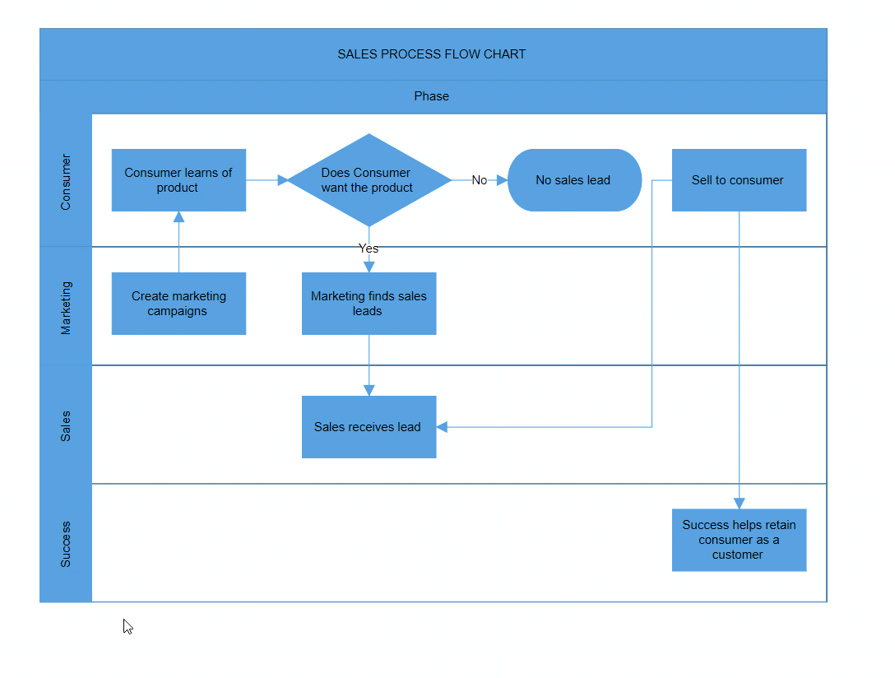

# Lane in Blazor Diagram Component

A `Lane` is a functional unit or a responsible department of a business process that helps to map a process within the functional unit or in between other functional units.

The number of lanes can be added to swimlane and rendered in the diagram. The lanes are automatically stacked inside swimlane based on the order they are added.

## Create an empty lane

* You can create the `Lane` and add it to the `Lanes` collection of the Swimlane.

>Note: For the Horizontal Swimlane, you must set the `Height` of the Lane. For the Vertical Swimlane, you must set `Width` of the Lane.

The following code example explains how to define a swimlane with lane.

```cshtml
@using Syncfusion.Blazor.Diagram

<SfDiagramComponent Height="600px" Swimlanes="@SwimlaneCollections" />

@code
{
    //Define diagram's swimlane collection.
    DiagramObjectCollection<Swimlane> SwimlaneCollections = new DiagramObjectCollection<Swimlane>();

    protected override void OnInitialized()
    {
        // A swimlane is created and stored in the swimlanes collection.
        Swimlane swimlane = new Swimlane()
        {
            Header = new SwimlaneHeader()
            {
                Annotation = new ShapeAnnotation()
                {
                    Content = "SALES PROCESS FLOW CHART"
                },
                Height = 50,
            },
            OffsetX = 400, OffsetY = 200, Height = 120, Width = 450,
            Lanes = new DiagramObjectCollection<Lane>()
            {
                new Lane(){Height = 100},
            }
        };
        // Add swimlane.
        SwimlaneCollections.Add(swimlane);
    }
}
``` 


You can download a complete working sample from [GitHub]().

## Create Lane Header and Header customization

* The `Header` property of the lane allows you to textually describe the lane and to customize the appearance of the description.
* The size of the lane header can be controlled by using the `Width` and `Height` properties of the header.
* The appearance of the lane header can be set by using the `Style` property.

The following code example explains how to define a lane header and its customization.

```cshtml
@using Syncfusion.Blazor.Diagram

<SfDiagramComponent Height="600px" Swimlanes="@SwimlaneCollections" />

@code
{
    //Define diagram's swimlane collection.
    DiagramObjectCollection<Swimlane> SwimlaneCollections = new DiagramObjectCollection<Swimlane>();

    protected override void OnInitialized()
    {
        // A swimlane is created and stored in the swimlanes collection.
        Swimlane swimlane = new Swimlane()
            {
                Header = new SwimlaneHeader()
                {
                    Annotation = new ShapeAnnotation()
                    {
                        Content = "SALES PROCESS FLOW CHART"
                    },
                    Height = 50,
                },
                OffsetX = 400,
                OffsetY = 200,
                Height = 120,
                Width = 450,
                Lanes = new DiagramObjectCollection<Lane>()
                {
                    new Lane(){Height = 100,
                    Header = new SwimlaneHeader(){
                        Width = 30,
                        Style = new TextStyle(){ Fill = "Teal"},
                        Annotation = new ShapeAnnotation(){ Content = "Consumer", Style = new TextStyle(){ Color = "White", TextDecoration = TextDecoration.Underline, Italic = true, Bold = true} }
                    } },
                }
            };
    // Add swimlane.
    SwimlaneCollections.Add(swimlane);
    }
}
``` 

.

You can download a complete working sample from [GitHub]()

## Add and Remove the lane at runtime

 You can add and remove the lane at runtime by using the `Add` and `Remove` methods of the `Swimlane.Lanes` Collection. The following code explains how to dynamically add and remove the lane to swimlane.

```cshtml
@using Syncfusion.Blazor.Diagram
@using Syncfusion.Blazor.Buttons

<SfButton Content="Add Lane" OnClick="@AddLane" />
<SfButton Content="Remove Lane" OnClick="@RemoveLane" />
<SfDiagramComponent Height="600px" Swimlanes="@SwimlaneCollections" />

@code
{
    //Define diagram's swimlane collection.
    DiagramObjectCollection<Swimlane> SwimlaneCollections = new DiagramObjectCollection<Swimlane>();

        protected override void OnInitialized()
    {
        // A swimlane is created and stored in the swimlanes collection.
        Swimlane swimlane = new Swimlane()
            {
                Header = new SwimlaneHeader()
                {
                    Annotation = new ShapeAnnotation()
                    {
                        Content = "SALES PROCESS FLOW CHART"
                    },
                    Height = 50,
                },
                OffsetX = 400,
                OffsetY = 200,
                Height = 120,
                Width = 450,
                Lanes = new DiagramObjectCollection<Lane>()
                {
                    new Lane(){Height = 100,
                    Header = new SwimlaneHeader(){
                        Width = 30,
                        Annotation = new ShapeAnnotation(){ Content = "Consumer" }
                    } },
                }
            };
        // Add swimlane.
        SwimlaneCollections.Add(swimlane);
    }

    private void AddLane()
    {
        Lane newLane = new Lane() { Height = 100, 
            Header = new SwimlaneHeader()
            {
                 Annotation = new ShapeAnnotation() { Content = "Lane title" }, Width = 30,
            }
        };
        SwimlaneCollections[0].Lanes.Add(newLane);
    }

    private void RemoveLane()
    {
        Lane lane = SwimlaneCollections[0].Lanes[^1];
        SwimlaneCollections[0].Lanes.Remove(lane);
    }
}
``` 


You can download a complete working sample from [GitHub]().

## Add children to lane

 To add nodes to the lane, you should add a node collection to the `Children` collection of the lane.

 The `LaneOffsetX` and `LaneOffsetY` property of the node will position the element in the lane canvas.

>Note: By default, lane children will maintain a 20px padding from the lane canvas.

The following code example explains how to add nodes to lane.

```cshtml
@using Syncfusion.Blazor.Diagram

<SfDiagramComponent Height="600px" Swimlanes="@SwimlaneCollections" />

@code
{
    //Define diagram's swimlane collection.
    DiagramObjectCollection<Swimlane> SwimlaneCollections = new DiagramObjectCollection<Swimlane>();

    protected override void OnInitialized()
    {
        // A swimlane is created and stored in the swimlanes collection.
        Swimlane swimlane = new Swimlane()
            {
                Header = new SwimlaneHeader()
                {
                    Annotation = new ShapeAnnotation()
                    {
                        Content = "SALES PROCESS FLOW CHART"
                    },
                    Height = 50,
                },
                OffsetX = 400,
                OffsetY = 200,
                Height = 120,
                Width = 450,
                Lanes = new DiagramObjectCollection<Lane>()
                {
                    new Lane(){Height = 100,
                    Header = new SwimlaneHeader(){
                        Width = 30,
                        Annotation = new ShapeAnnotation(){ Content = "Consumer" }
                    },
                    Children = new DiagramObjectCollection<Node>()
                    {
                        new Node(){Height = 50, Width = 50, LaneOffsetX = 100, LaneOffsetY = 30},
                        new Node(){Height = 50, Width = 50, LaneOffsetX = 250, LaneOffsetY = 30},
                    }
                    },
                }
            };
        // Add swimlane.
        SwimlaneCollections.Add(swimlane);
    }
}
```

.

You can download a complete working sample from [GitHub]().

## Header Selection and Resize

 * You can select the individual lane header by clicking on the header twice. On the first click, the respective lane can be selected.

 * You can resize the individual lane header. While resizing lane, it will maintain 20px distances from the Lane children.

 * When a element is resized, the [SizeChanging](https://help.syncfusion.com/cr/blazor/Syncfusion.Blazor.Diagram.SfDiagramComponent.html#Syncfusion_Blazor_Diagram_SfDiagramComponent_SizeChanging) and [SizeChanged](https://help.syncfusion.com/cr/blazor/Syncfusion.Blazor.Diagram.SfDiagramComponent.html#Syncfusion_Blazor_Diagram_SfDiagramComponent_SizeChanged) events get triggered.

 The following image shows how to select and resize the lane header.

.
  
## Lane header editing

The diagram provides support for editing Lane headers at runtime. You can achieve header editing by using the double-click event. Double-clicking the header label enables the editing of that specific header. 

The following image demonstrates how to edit the lane header.


