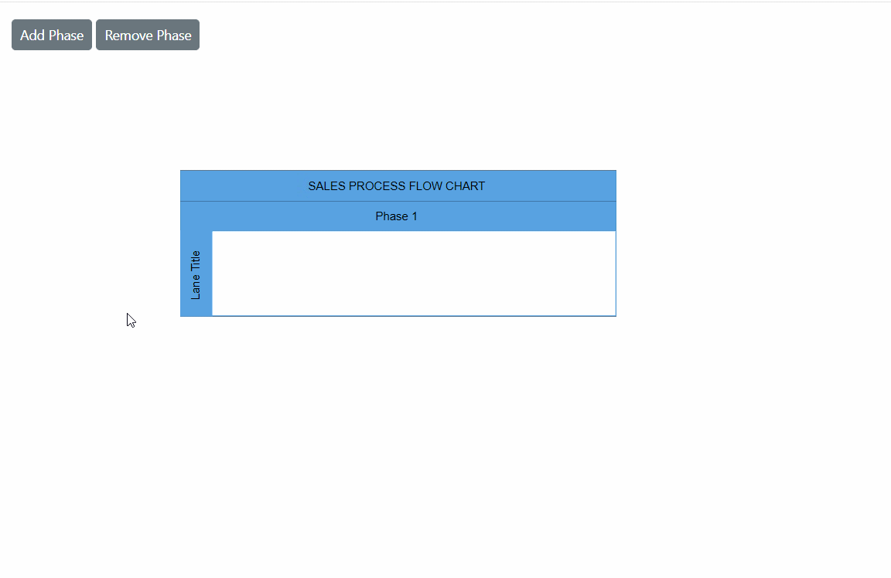
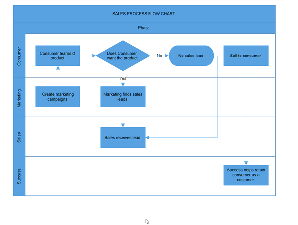
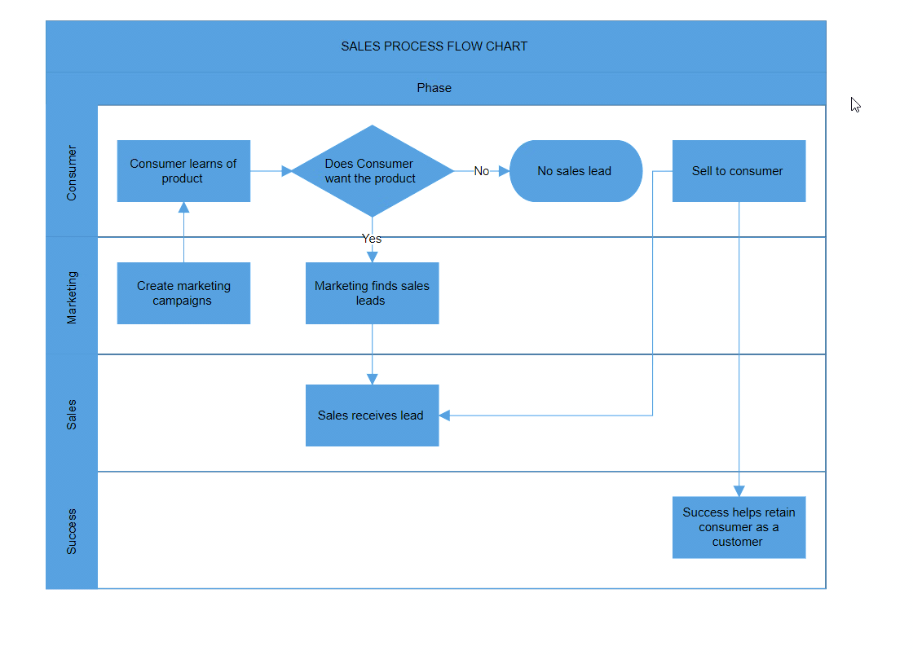

# Phase in Blazor Diagram Component

 The [Phase](https://help.syncfusion.com/cr/blazor/Syncfusion.Blazor.Diagram.Phase.html) divides each lane horizontally or vertically based on the swimlane orientation. Multiple phases can be added to a swimlane.

## How to Create an Empty Phase

Create a [Phase](https://help.syncfusion.com/cr/blazor/Syncfusion.Blazor.Diagram.Phase.html) and add it to the [Phases](https://help.syncfusion.com/cr/blazor/Syncfusion.Blazor.Diagram.Swimlane.html#Syncfusion_Blazor_Diagram_Swimlane_Phases) collection of the swimlane.

>Note: For a horizontal swimlane, set the phase [Width](https://help.syncfusion.com/cr/blazor/Syncfusion.Blazor.Diagram.SwimlaneChild.html#Syncfusion_Blazor_Diagram_SwimlaneChild_Width). For a vertical swimlane, set the phase [Height](https://help.syncfusion.com/cr/blazor/Syncfusion.Blazor.Diagram.SwimlaneChild.html#Syncfusion_Blazor_Diagram_SwimlaneChild_Height).

The following code example explains how to add a phase to a swimlane.

```cshtml
@using Syncfusion.Blazor.Diagram

<SfDiagramComponent Height="600px" Swimlanes="@SwimlaneCollections" NodeCreating="@OnNodeCreating" />

@code
{
    //Define diagram's swimlane collection.
    private DiagramObjectCollection<Swimlane> SwimlaneCollections = new DiagramObjectCollection<Swimlane>();

    protected override void OnInitialized()
    {
        // A swimlane is created and stored in the swimlanes collection.
        Swimlane swimlane = new Swimlane()
        {
            Header = new SwimlaneHeader()
            {
                Annotation = new ShapeAnnotation()
                {
                    Content = "SALES PROCESS FLOW CHART"
                },
                Height = 50,
            },
            OffsetX = 400,
            OffsetY = 200,
            Height = 150,
            Width = 450,
            Phases = new DiagramObjectCollection<Phase>()
            {
                new Phase()
                {
                    Width = 450,
                    Header = new SwimlaneHeader()
                    {
                        Annotation = new ShapeAnnotation(){Content = "Phase 1"},
                        Height = 30
                    }
                }
            }
        };
        // Add swimlane.
        SwimlaneCollections.Add(swimlane);
    }

    private void OnNodeCreating(IDiagramObject obj)
    {
        if (obj is Swimlane swimlane)
        {
            swimlane.Header.Style = new TextStyle()
            {
                Fill = "#5b9bd5",
                StrokeColor = "#5b9bd5"
            };
            foreach (Phase phase in swimlane.Phases)
            {
                phase.Style = new ShapeStyle() { Fill = "#5b9bd5", StrokeColor = "#5b9bd5" };
            }
            foreach (Lane lane in swimlane.Lanes)
            {
                lane.Header.Style = new TextStyle() { Fill = "#5b9bd5", StrokeColor = "#5b9bd5" };
            }
        }
    }
}
```


A complete working sample can be downloaded from [GitHub](https://github.com/SyncfusionExamples/Blazor-Diagram-Examples/tree/master/UG-Samples/Swimlanes/Phase/PhaseCreation).

.

## How to Dynamically Add and Remove Phase in Swimlane

 Add or remove a phase at runtime by using the `Add` and `Remove` methods of the [Swimlane.Phases](https://help.syncfusion.com/cr/blazor/Syncfusion.Blazor.Diagram.Swimlane.html#Syncfusion_Blazor_Diagram_Swimlane_Phases) collection. The following code example shows how to add and remove phases at runtime.

```cshtml
@using Syncfusion.Blazor.Diagram
@using Syncfusion.Blazor.Buttons

<SfButton Content="Add Phase" OnClick="@AddPhase" />
<SfButton Content="Remove Phase" OnClick="@RemovePhase" />
<SfDiagramComponent Height="600px" Swimlanes="@SwimlaneCollections" NodeCreating="@OnNodeCreating" />

@code
{
    //Define diagram's swimlane collection.
    private DiagramObjectCollection<Swimlane> SwimlaneCollections = new DiagramObjectCollection<Swimlane>();

    protected override void OnInitialized()
    {
        // A swimlane is created and stored in the swimlanes collection.
        Swimlane swimlane = new Swimlane()
        {
            Header = new SwimlaneHeader()
            {
                Annotation = new ShapeAnnotation()
                {
                    Content = "SALES PROCESS FLOW CHART"
                },
                Height = 50,
            },
            OffsetX = 400,
            OffsetY = 200,
            Height = 150,
            Width = 450,
            Phases = new DiagramObjectCollection<Phase>()
            {
                new Phase()
                {
                    Width = 450,
                    Header = new SwimlaneHeader()
                    {
                        Annotation = new ShapeAnnotation(){Content = "Phase 1"},
                        Height = 30
                    }
                }
            }
        };
        // Add swimlane.
        SwimlaneCollections.Add(swimlane);
    }

    private void AddPhase()
    {
        Swimlane swimlane = SwimlaneCollections[0];
        Phase newPhase = new Phase()
        {
            Width = 100,
            Header = new SwimlaneHeader()
            {
                Annotation = new ShapeAnnotation() { Content = "Phase " + (swimlane.Phases.Count + 1) },
                Height = 30
            },
            Style = new ShapeStyle() { Fill = "#5b9bd5", StrokeColor = "#5b9bd5" }
        };
        swimlane.Phases.Add(newPhase);
    }

    private void RemovePhase()
    {
        Swimlane swimlane = SwimlaneCollections[0];
        if (swimlane.Phases.Count > 1)
            swimlane.Phases.RemoveAt(swimlane.Phases.Count - 1);
    }

    private void OnNodeCreating(IDiagramObject obj)
    {
        if (obj is Swimlane swimlane)
        {
            swimlane.Header.Style = new TextStyle()
            {
                Fill = "#5b9bd5",
                StrokeColor = "#5b9bd5"
            };
            foreach (Phase phase in swimlane.Phases)
            {
                phase.Style = new ShapeStyle() { Fill = "#5b9bd5", StrokeColor = "#5b9bd5" };
            }
            foreach (Lane lane in swimlane.Lanes)
            {
                lane.Header.Style = new TextStyle() { Fill = "#5b9bd5", StrokeColor = "#5b9bd5" };
            }
        }
    }
}
```


A complete working sample can be downloaded from [GitHub](https://github.com/SyncfusionExamples/Blazor-Diagram-Examples/tree/master/UG-Samples/Swimlanes/Phase/AddRemovePhaseAtRuntime).



## How to Create and Customize the Phase Header

* The [Header](https://help.syncfusion.com/cr/blazor/Syncfusion.Blazor.Diagram.Phase.html#Syncfusion_Blazor_Diagram_Phase_Header) property describes the phase and provides appearance customization.
* Control the header size using [Width](https://help.syncfusion.com/cr/blazor/Syncfusion.Blazor.Diagram.SwimlaneChild.html#Syncfusion_Blazor_Diagram_SwimlaneChild_Width) and [Height](https://help.syncfusion.com/cr/blazor/Syncfusion.Blazor.Diagram.SwimlaneChild.html#Syncfusion_Blazor_Diagram_SwimlaneChild_Height) properties.
* Customize header appearance using [Style](https://help.syncfusion.com/cr/blazor/Syncfusion.Blazor.Diagram.SwimlaneHeader.html#Syncfusion_Blazor_Diagram_SwimlaneHeader_Style) property.

The following code example shows how to define and customize a phase header.

```cshtml
@using Syncfusion.Blazor.Diagram

<SfDiagramComponent Height="600px" Swimlanes="@SwimlaneCollections" NodeCreating="@OnNodeCreating" />

@code
{
    //Define diagram's swimlane collection.
    private DiagramObjectCollection<Swimlane> SwimlaneCollections = new DiagramObjectCollection<Swimlane>();

    protected override void OnInitialized()
    {
        // A swimlane is created and stored in the swimlanes collection.
        Swimlane swimlane = new Swimlane()
        {
            Header = new SwimlaneHeader()
            {
                Annotation = new ShapeAnnotation()
                {
                    Content = "SALES PROCESS FLOW CHART"
                },
                Height = 50,
            },
            OffsetX = 400,
            OffsetY = 200,
            Height = 150,
            Width = 450,
            Phases = new DiagramObjectCollection<Phase>()
            {
                new Phase()
                {
                    Width = 450,
                    Header = new SwimlaneHeader()
                    {
                        Annotation = new ShapeAnnotation(){Content = "Phase 1", Style = new TextStyle(){ Color = "White", TextDecoration = TextDecoration.Underline, Italic = true, Bold = true} },
                        Height = 30
                    },
                    Style = new TextStyle(){Fill = "Teal"},
                }
            }
        };
        // Add swimlane.
        SwimlaneCollections.Add(swimlane);
    }

    private void OnNodeCreating(IDiagramObject obj)
    {
        if (obj is Swimlane swimlane)
        {
            swimlane.Header.Style = new TextStyle()
            {
                Fill = "#5b9bd5",
                StrokeColor = "#5b9bd5"
            };
            foreach (Lane lane in swimlane.Lanes)
            {
                lane.Header.Style = new TextStyle() { Fill = "#5b9bd5", StrokeColor = "#5b9bd5" };
            }
        }
    }
}
```


A complete working sample can be downloaded from [GitHub](https://github.com/SyncfusionExamples/Blazor-Diagram-Examples/tree/master/UG-Samples/Swimlanes/Phase/PhaseHeader).

.

Phase header annotations also support templates. Define HTML content at the tag level and specify the use of a template with the [UseTemplate](https://help.syncfusion.com/cr/blazor/Syncfusion.Blazor.Diagram.Annotation.html#Syncfusion_Blazor_Diagram_Annotation_UseTemplate) property. To assign different templates per phase, differentiate annotations by the ID property.

The following code example explains how to define a phase header annotation template.

```cshtml
@using Syncfusion.Blazor.Diagram

<SfDiagramComponent Height="600px" Swimlanes="@SwimlaneCollections">
    <DiagramTemplates>
        <AnnotationTemplate>
            @if (context is Annotation annotation)
            {
                if (annotation.ID == "Phase 1")
                {
                    string ID = annotation.ID + "TemplateContent";
                    <div id="@ID" class="profile-card" style="width:100%;height:100%;display:flex;align-items:center; gap:10px">
                        <svg xmlns="http://www.w3.org/2000/svg" height="24" width="24" viewBox="0 0 24 24">
                            <g>
                                <ellipse cy="12" cx="12" ry="12" rx="12" fill="#000000" />
                                <path id="path1" transform="rotate(0,12,12) translate(6.06543695926666,6) scale(0.375,0.375)  " fill="#FFFFFF" d="M15.827007,0C20.406003,0 24.346007,3.1960449 24.346007,9.2930298 24.346007,13.259033 22.542005,17.289001 20.180997,19.791992L20.193005,19.791992C19.287,22.627014 20.736997,23.299011 20.966,23.376038 25.997008,25.090027 31.651002,28.317993 31.651002,31.626038L31.651002,32 0,32 0,31.626038C8.034749E-08,28.414001 5.6260008,25.161011 10.421,23.376038 10.766993,23.244995 12.422999,22.317017 11.497004,19.817993 9.1220035,17.321045 7.3279971,13.275024 7.3279971,9.2930298 7.3279971,3.1960449 11.245006,0 15.827007,0z" />
                            </g>
                        </svg>
                        <div class="profile-name" style="font-size:12px;font-weight:bold;">Users</div>
                    </div>
                }
            }
        </AnnotationTemplate>
    </DiagramTemplates>
</SfDiagramComponent>

@code
{
    //Define diagram's swimlane collection.
    private DiagramObjectCollection<Swimlane> SwimlaneCollections = new DiagramObjectCollection<Swimlane>();

    protected override void OnInitialized()
    {
        // A swimlane is created and stored in the swimlanes collection.
        Swimlane swimlane = new Swimlane()
        {
            Header = new SwimlaneHeader()
            {
                Annotation = new ShapeAnnotation()
                {
                    Content = "SALES PROCESS FLOW CHART"
                },
                Height = 50,
            },
            OffsetX = 400,
            OffsetY = 200,
            Height = 150,
            Width = 450,
            Phases = new DiagramObjectCollection<Phase>()
            {
                new Phase()
                {
                    Width = 450,
                    Header = new SwimlaneHeader()
                    {
                        Annotation = new ShapeAnnotation()
                        { 
                            ID="Phase 1",
                            Content = "Phase 1",
                            UseTemplate = true,
                            Height = 50,
                            Width = 75,
                        },
                        Height = 30,
                    },
                    Style = new TextStyle(){Fill = "Teal"},
                }
            }
        };
        // Add swimlane.
        SwimlaneCollections.Add(swimlane);
    }
}
```


A complete working sample can be downloaded from [GitHub](https://github.com/SyncfusionExamples/Blazor-Diagram-Examples/tree/master/UG-Samples/Swimlanes/Phase/PhaseHeaderTemplate).

.

## How to Set the Orientation of a Phase

The [Orientation](https://help.syncfusion.com/cr/blazor/Syncfusion.Blazor.Diagram.Phase.html#Syncfusion_Blazor_Diagram_Phase_Orientation) property in the symbol palette defines whether a phase is displayed horizontally or vertically. This setting is particularly relevant when the phase is part of a symbol palette.

* Horizontal orientation: The phase is aligned horizontally.
* Vertical orientation: The phase is aligned vertically.

Below is an example demonstrating how to set the orientation for phases in an SfSymbolPaletteComponent:

```cshtml
@using Syncfusion.Blazor.Diagram
@using Syncfusion.Blazor.Diagram.SymbolPalette

<div class="control-section">
    <div style="width:80%;">
        <div id="palette-space" class="sb-mobile-palette" style="border: 2px solid #b200ff">
            <SfSymbolPaletteComponent @ref="@symbolpalette" Height="300px" Width="200px"
                                      Palettes="@Palettes" SymbolHeight="60" SymbolWidth="60" SymbolMargin="@SymbolMargin">
            </SfSymbolPaletteComponent>
        </div>
    </div>
</div>
@code
{
    //Reference the symbolpreview.
    private DiagramSize SymbolPreview;
    //Define symbol margin.
    private SymbolMargin SymbolMargin = new SymbolMargin { Left = 15, Right = 15, Top = 15, Bottom = 15 };
    private SfSymbolPaletteComponent symbolpalette;
    //Define palattes collection.
    private DiagramObjectCollection<Palette> Palettes = new DiagramObjectCollection<Palette>();
    // Defines palette's swimlane-shape collection.
    private DiagramObjectCollection<NodeBase> SwimlaneNodes = new DiagramObjectCollection<NodeBase>();

    protected override void OnInitialized()
    {
        InitPaletteModel();
    }

    private void InitPaletteModel()
    {
        Palettes = new DiagramObjectCollection<Palette>();
        SwimlaneNodes = new DiagramObjectCollection<NodeBase>();
        //create a horizontal phase.
        Phase horizontalPhase = new Phase() { ID = "HorizontalPhase", Orientation = Orientation.Horizontal, Width = 80, Height = 1, Style = new ShapeStyle() { Fill = "#5b9bd5", StrokeColor = "#5b9bd5" } };
        //create a vertical phase.
        Phase verticalPhase = new Phase() { ID = "VerticalPhase", Orientation = Orientation.Vertical, Width = 1, Height = 80, Style = new ShapeStyle() { Fill = "#5b9bd5", StrokeColor = "#5b9bd5" } };
        SwimlaneNodes = new DiagramObjectCollection<NodeBase>()
        {
            horizontalPhase,
            verticalPhase
        };
        Palettes = new DiagramObjectCollection<Palette>()
        {
            new Palette(){Symbols =SwimlaneNodes,Title="Swimlane Shapes",ID="SwimlaneShapes" },
        };
    }
}
```


You can download a complete working sample from [GitHub](https://github.com/SyncfusionExamples/Blazor-Diagram-Examples/tree/master/UG-Samples/Swimlanes/Phase/PhaseOrientation).

.

## How to Select and Resize Phase Header

 * Select an individual phase header by clicking the header twice. The first click selects the phase, and the second click selects the header. 

 * Resize an individual phase header. While resizing a phase, a 20 pixels distance is maintained from the lane children.

  * When an element is resized, the [SizeChanging](https://help.syncfusion.com/cr/blazor/Syncfusion.Blazor.Diagram.SfDiagramComponent.html#Syncfusion_Blazor_Diagram_SfDiagramComponent_SizeChanging) and [SizeChanged](https://help.syncfusion.com/cr/blazor/Syncfusion.Blazor.Diagram.SfDiagramComponent.html#Syncfusion_Blazor_Diagram_SfDiagramComponent_SizeChanged) events are triggered.

The following image shows how to select and resize the phase header.



## How to Edit Phase Header

Phase headers support runtime editing. Double-click the header label to enable in-place editing for that specific header. 

The following image shows how to edit the phase header.




## Phase Interaction

### How to Select a Phase

Phase can be selected by clicking (tapping) the header of the phase.

### How to Resize a Phase

* Resize the phase by using the selector.
* Click the phase header to enable phase selection.
* After resizing a phase, the lane updates its size automatically.

