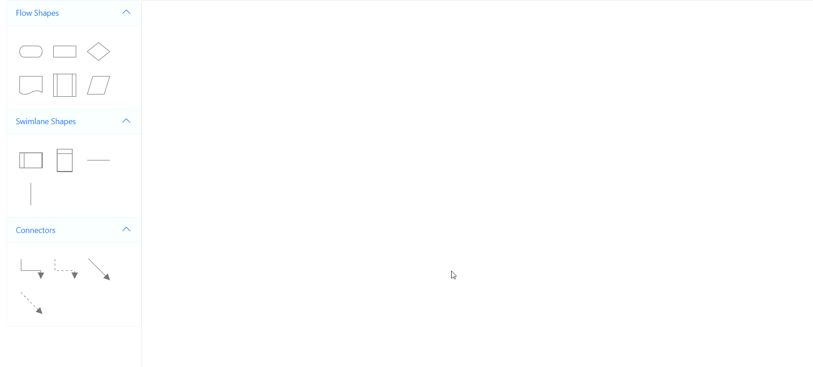

# Swimlane-Palette in Blazor Diagram Component
Diagram supports adding lanes and phases to the symbol palette. 

## How to Add Lanes and Phases to the Symbol Palette

Swimlane elements such as [Lane](https://help.syncfusion.com/cr/blazor/Syncfusion.Blazor.Diagram.Lane.html) and [Phase](https://help.syncfusion.com/cr/blazor/Syncfusion.Blazor.Diagram.Phase.html) can be used to visualize the symbols.

The following code shows how to add lanes and phases to a palette.

```cshtml
@using Syncfusion.Blazor.Diagram
@using Syncfusion.Blazor.Diagram.SymbolPalette

<div class="control-section">
    <div style="width:80%;">
        <div id="palette-space" class="sb-mobile-palette" style="border: 2px solid #b200ff">
            <SfSymbolPaletteComponent @ref="@symbolpalette" Height="300px" Width="200px"
                                      Palettes="@Palettes" SymbolHeight="60" SymbolWidth="60" SymbolMargin="@SymbolMargin">
            </SfSymbolPaletteComponent>
        </div>
    </div>
</div>

@code
{
    //Reference the symbolnpreview.
    private DiagramSize SymbolPreview;
    //Define symbol margin.
    private SymbolMargin SymbolMargin = new SymbolMargin { Left = 15, Right = 15, Top = 15, Bottom = 15 };
    private SfSymbolPaletteComponent symbolpalette;
    //Define palettes collection.
    private DiagramObjectCollection<Palette> Palettes = new DiagramObjectCollection<Palette>();
    // Define the palette's swimlane-shape collection.
    private DiagramObjectCollection<NodeBase> SwimlaneNodes = new DiagramObjectCollection<NodeBase>();

    protected override void OnInitialized()
    {
        InitPaletteModel();
    }

    private void InitPaletteModel()
    {
        Palettes = new DiagramObjectCollection<Palette>();

        SwimlaneNodes = new DiagramObjectCollection<NodeBase>();

        //Create a horizontal lane.
        Lane horizontalLane = new Lane()
        {
            ID = "HorizontalSwimlane",
            Orientation = Orientation.Horizontal,
            Height = 100,
            Width = 150,
            // Style = new TextStyle() { Fill = "orange", StrokeColor = "black" },
            Header = new SwimlaneHeader()
            {
                Annotation = new ShapeAnnotation() { Content = "Lane Title" },
                Style = new TextStyle() { Fill = "lightblue", StrokeColor = "black" },
                Width = 25,
                Height = 100
            },
        };

        //Create a vertical lane.
        Lane verticalLane = new Lane()
        {
            ID = "VerticalSwimlane",
            Orientation = Orientation.Vertical,
            Height = 150,
            Width = 100,
            // Style = new TextStyle() { Fill = "orange", StrokeColor = "black" },
            Header = new SwimlaneHeader()
            {
                Annotation = new ShapeAnnotation() { Content = "Lane Title" },
                Style = new TextStyle() { Fill = "lightblue", StrokeColor = "black" },
                Width = 100,
                Height = 25
            },
        };

        //Create a horizontal phase.
        Phase horizontalPhase = new Phase() 
        { 
            ID = "HorizontalPhase", 
            Orientation = Orientation.Horizontal, 
            Width = 80, Height = 1, 
            Style = new ShapeStyle() { Fill = "#5b9bd5", StrokeColor = "#5b9bd5" } 
        };

        //Create a vertical phase.
        Phase verticalPhase = new Phase()
        {
            ID = "VerticalPhase", 
            Orientation = Orientation.Vertical,
            Width = 1, Height = 80, 
            Style = new ShapeStyle() { Fill = "#5b9bd5", StrokeColor = "#5b9bd5" }
        };

        SwimlaneNodes = new DiagramObjectCollection<NodeBase>()
        {
            horizontalLane,
            verticalLane,
            horizontalPhase,
            verticalPhase
        };

        Palettes = new DiagramObjectCollection<Palette>()
        {
            new Palette(){Symbols =SwimlaneNodes,Title="Swimlane Shapes",ID="SwimlaneShapes" },
        };
    }
}
```


A complete working sample can be downloaded from [GitHub](https://github.com/SyncfusionExamples/Blazor-Diagram-Examples/tree/master/UG-Samples/Swimlanes/SwimlanePalette)


## How to Drag and Drop Swimlane Shapes from the Symbol Palette

* Drag-and-drop is supported for swimlane symbols.
* When a lane symbol is dropped, if the diagram already contains a swimlane with the same orientation, the lane is added and stacked inside the swimlane based on order. Otherwise, a new swimlane is created.
* A phase will only drop on a swimlane shape with the same orientation.

The following image shows dragging a symbol from the palette.


