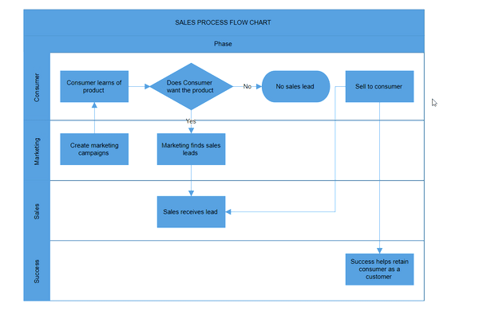
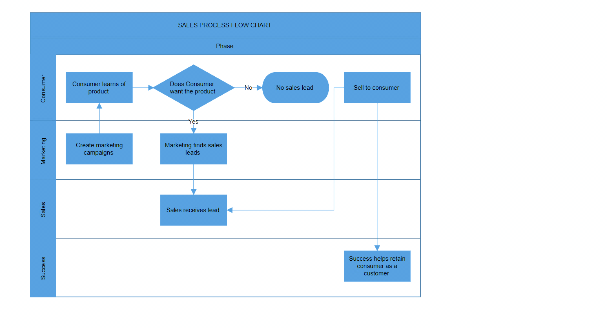

# Swimlane in Blazor Diagram Component

A [Swimlane](https://help.syncfusion.com/cr/blazor/Syncfusion.Blazor.Diagram.Swimlane.html) is a type of diagram node that is used to visualize the connection between a business process and its responsible department. It emphasizes logical relationships among activities, making it easier to understand the dynamics of the process and the associated departmental responsibilities.


## How to Create a Swimlane
A swimlane can be created and added to the diagram either programmatically or interactively.

### How to Add Swimlane Through Swimlanes Collection

To create a swimlane, you have to define the swimlane object and add it to the [Swimlanes](https://help.syncfusion.com/cr/blazor/Syncfusion.Blazor.Diagram.SfDiagramComponent.html#Syncfusion_Blazor_Diagram_SfDiagramComponent_Swimlanes) collection of the diagram.

>Note: By default, when a swimlane is created, one lane and one phase are added.

```cshtml
@using Syncfusion.Blazor.Diagram

<SfDiagramComponent Height="600px" Swimlanes="@SwimlaneCollections" NodeCreating="@OnNodeCreating"/>

@code
{
    //Define diagram's swimlane collection.
    DiagramObjectCollection<Swimlane> SwimlaneCollections = new DiagramObjectCollection<Swimlane>();

    protected override void OnInitialized()
    {
        // A swimlane is created and stored in the swimlanes collection.
        Swimlane swimlane = new Swimlane()
        {
            OffsetX = 400, OffsetY = 200, Height = 120, Width = 450,
        };
        // Add swimlane.
        SwimlaneCollections.Add(swimlane);
    }
    private void OnNodeCreating(IDiagramObject obj)
    {
        if (obj is Swimlane swimlane)
        {
            swimlane.Header.Style = new TextStyle()
            {
                Fill = "#5b9bd5",
                StrokeColor = "#5b9bd5"
            };
            foreach (Phase phase in swimlane.Phases)
            {
                phase.Style = new ShapeStyle() { Fill = "#5b9bd5", StrokeColor = "#5b9bd5" };
            }
            foreach (Lane lane in swimlane.Lanes)
            {
                lane.Header.Style = new TextStyle() { Fill = "#5b9bd5", StrokeColor = "#5b9bd5" };
            }
        }
    }
}
```


>**Note:** Swimlane IDs should not start with numbers or special characters and should not contain special characters such as underscore(_) or spaces.

The swimlane appears as follows.


A complete working sample can be downloaded from [GitHub](https://github.com/SyncfusionExamples/Blazor-Diagram-Examples/tree/master/UG-Samples/Swimlanes/SwimlaneCreation/SwimlaneCreation).

>Note: Swimlane elements (phase, lane, and lane children) cannot be added at runtime using [AddDiagramElementsAsync](https://help.syncfusion.com/cr/blazor/Syncfusion.Blazor.Diagram.SfDiagramComponent.html#Syncfusion_Blazor_Diagram_SfDiagramComponent_AddDiagramElementsAsync_Syncfusion_Blazor_Diagram_DiagramObjectCollection_Syncfusion_Blazor_Diagram_NodeBase__) method.

### How to Create and Customize the Swimlane Header

The swimlane header is the primary interactive element for a swimlane. The [Header](https://help.syncfusion.com/cr/blazor/Syncfusion.Blazor.Diagram.Swimlane.html#Syncfusion_Blazor_Diagram_Swimlane_Header) property of swimlane allows you to define its textual description and to customize its appearance.

>Note: The header supports interaction such as selection, dragging, and related actions.

The following code example explains how to define the swimlane header.

```cshtml
@using Syncfusion.Blazor.Diagram

<SfDiagramComponent Height="600px" Swimlanes="@SwimlaneCollections" NodeCreating="@OnNodeCreating"/>

@code
{
    //Define diagram's swimlane collection.
    DiagramObjectCollection<Swimlane> SwimlaneCollections = new DiagramObjectCollection<Swimlane>();

    protected override void OnInitialized()
    {
        // A swimlane is created and stored in the swimlanes collection.
        Swimlane swimlane = new Swimlane()
        {
            Header = new SwimlaneHeader()
            {
                Annotation = new ShapeAnnotation()
                {
                    Content = "SALES PROCESS FLOW CHART"
                },
                Height = 50,
            },
            OffsetX = 400, OffsetY = 200, Height = 120, Width = 450,
        };
        // Add swimlane.
        SwimlaneCollections.Add(swimlane);
    }
    private void OnNodeCreating(IDiagramObject obj)
    {
        if (obj is Swimlane swimlane)
        {
             swimlane.Header.Style = new TextStyle()
             {
                 Fill = "#5b9bd5",
                 StrokeColor = "#5b9bd5"
             };
             foreach (Phase phase in swimlane.Phases)
             {
                 phase.Style = new ShapeStyle() { Fill = "#5b9bd5", StrokeColor = "#5b9bd5" };
             }
             foreach (Lane lane in swimlane.Lanes)
             {
                 lane.Header.Style = new TextStyle() { Fill = "#5b9bd5", StrokeColor = "#5b9bd5" };
             }
        }
    }
}
```


A complete working sample can be downloaded from [GitHub](https://github.com/SyncfusionExamples/Blazor-Diagram-Examples/tree/master/UG-Samples/Swimlanes/SwimlaneHeader/SwimlaneHeader)


### How to Customize Swimlane Header

Customize the header height and width using the [Width](https://help.syncfusion.com/cr/blazor/Syncfusion.Blazor.Diagram.SwimlaneChild.html#Syncfusion_Blazor_Diagram_SwimlaneChild_Width) and [Height](https://help.syncfusion.com/cr/blazor/Syncfusion.Blazor.Diagram.SwimlaneChild.html#Syncfusion_Blazor_Diagram_SwimlaneChild_Height) properties of the swimlane header. Set the fill color of the header by using the [Style](https://help.syncfusion.com/cr/blazor/Syncfusion.Blazor.Diagram.SwimlaneHeader.html#Syncfusion_Blazor_Diagram_SwimlaneHeader_Style) property.

The following code example explains how to customize a swimlane header.

```cshtml
@using Syncfusion.Blazor.Diagram

<SfDiagramComponent Height="600px" Swimlanes="@SwimlaneCollections" NodeCreating="@OnNodeCreating" />

@code
{
    //Define diagram's swimlane collection.
    DiagramObjectCollection<Swimlane> SwimlaneCollections = new DiagramObjectCollection<Swimlane>();

    protected override void OnInitialized()
    {
        // A swimlane is created and stored in the swimlanes collection.
        Swimlane swimlane = new Swimlane()
        {
            Header = new SwimlaneHeader()
            {
                Annotation = new ShapeAnnotation()
                {
                    Content = "SALES PROCESS FLOW CHART",
                    Style = new TextStyle(){Color = "White", FontSize = 12, Bold = true, Italic = true, TextDecoration = TextDecoration.Underline}
                },
                Height = 50,
                Style = new TextStyle()
                {
                    Fill = "Teal"
                }
            },
            OffsetX = 400, OffsetY = 200, Height = 120, Width = 450,
        };
        // Add swimlane.
        SwimlaneCollections.Add(swimlane);
    }
    private void OnNodeCreating(IDiagramObject obj)
    {
        if (obj is Swimlane swimlane)
        {
            foreach (Phase phase in swimlane.Phases)
            {
               phase.Style = new ShapeStyle() { Fill = "#5b9bd5", StrokeColor = "#5b9bd5" };
            }
            foreach (Lane lane in swimlane.Lanes)
            {
               lane.Header.Style = new TextStyle() { Fill = "#5b9bd5", StrokeColor = "#5b9bd5" };
            }
        }
    }
}
```


A complete working sample can be downloaded from [GitHub](https://github.com/SyncfusionExamples/Blazor-Diagram-Examples/tree/master/UG-Samples/Swimlanes/SwimlaneHeader/SwimlaneHeaderCustomization)


Swimlane header annotations also support templates. Define HTML content at the tag level and enable templating with the [UseTemplate](https://help.syncfusion.com/cr/blazor/Syncfusion.Blazor.Diagram.Annotation.html#Syncfusion_Blazor_Diagram_Annotation_UseTemplate) property. To assign different templates per swimlane, differentiate annotations by the ID property.

The following code example explains how to define a Swimlane header annotation template.

```cshtml
@using Syncfusion.Blazor.Diagram

<SfDiagramComponent Height="600px" Swimlanes="@SwimlaneCollections">
    <DiagramTemplates>
        <AnnotationTemplate>
            @if (context is Annotation annotation)
            {
                if (annotation.ID == "swimlane 1")
                {
                    string ID = annotation.ID + "TemplateContent";
                    <div id="@ID" class="profile-card" style="width:100%;height:100%;display:flex;align-items:center; gap:10px">
                        <svg xmlns="http://www.w3.org/2000/svg" height="32" width="32" viewBox="0 0 32 32">
                            <g>
                                <ellipse cy="16" cx="16" ry="16" rx="16" fill="#000000" />
                                <path id="path1" transform="rotate(0,16,16) translate(8,8) scale(0.5,0.5)  " fill="#FFFFFF" d="M5.0000001,24C3.346,24 2,25.346 2.0000001,27.000001 2,28.654 3.346,30.000001 5.0000001,30.000001 6.654,30.000001 8,28.654 7.9999998,27.000001 8,25.346 6.654,24 5.0000001,24z M27,18C25.346001,18 24,19.346 24,21 24,22.654 25.346001,24 27,24 28.653999,24 30,22.654 30,21 30,19.346 28.653999,18 27,18z M17,2C15.346,2 14,3.3460002 14,5 14,6.654 15.346,8 17,7.9999998 18.654,8 20,6.654 20,5 20,3.3460002 18.654,2 17,2z M17,0C19.757,0 22,2.243 22,5 22,7.412375 20.282703,9.4312188 18.006404,9.898237L18,9.8993834 18,12 28,12 28,16.100617 28.006405,16.101764C30.282703,16.568781 32,18.587625 32,21 32,23.757 29.757,26.000001 27,26.000001 24.243,26.000001 22,23.757 22,21 22,18.587625 23.717297,16.568781 25.993595,16.101764L26,16.100617 26,14 18,14 18,19.979009 6.0000002,19.979009 6.0000002,22.100617 6.0064046,22.101764C8.2827029,22.568781 10,24.587626 10,27.000001 10,29.757001 7.757,32.000001 5.0000001,32.000001 2.243,32.000001 0,29.757001 0,27.000001 0,24.587626 1.7172968,22.568781 3.9935957,22.101764L4.0000001,22.100617 4.0000001,17.979007 16,17.979007 16,9.8993834 15.993595,9.898237C13.717297,9.4312188 12,7.412375 12,5 12,2.243 14.243,0 17,0z" />
                            </g>
                        </svg>
                        <div class="profile-name" style="font-size:12px;font-weight:bold;">SALES PROCESS FLOW CHART</div>
                    </div>
                }
            }
        </AnnotationTemplate>
    </DiagramTemplates>
</SfDiagramComponent>

@code
{
    //Define diagram's swimlane collection.
    DiagramObjectCollection<Swimlane> SwimlaneCollections = new DiagramObjectCollection<Swimlane>();

    protected override void OnInitialized()
    {
        // A swimlane is created and stored in the swimlanes collection.
        Swimlane swimlane = new Swimlane()
        {
            Header = new SwimlaneHeader()
            {
                Annotation = new ShapeAnnotation()
                {
                    ID = "swimlane 1",
                    Content = "SALES PROCESS FLOW CHART",
                    Width = 220,
                    Height = 50,
                    UseTemplate = true

                },
                Height = 50,
                Style = new TextStyle()
                {
                    Fill = "Teal"
                }
            },
            OffsetX = 400,
            OffsetY = 200,
            Height = 120,
            Width = 450,
        };
        // Add swimlane.
        SwimlaneCollections.Add(swimlane);
    }
}
```


A complete working sample can be downloaded from [GitHub](https://github.com/SyncfusionExamples/Blazor-Diagram-Examples/tree/master/UG-Samples/Swimlanes/SwimlaneHeader/SwimlaneHeaderTemplate)


### How to Edit Header

Edit swimlane headers at runtime by double-clicking the header label to enable in-place editing.

.

## Orientation

Customize swimlane orientation using the [Orientation](https://help.syncfusion.com/cr/blazor/Syncfusion.Blazor.Diagram.Swimlane.html#Syncfusion_Blazor_Diagram_Swimlane_Orientation) property.

>Note: The default swimlane orientation is Horizontal.

The following code example explains how to set the orientation of the swimlane.

```cshtml
@using Syncfusion.Blazor.Diagram

<SfDiagramComponent Height="600px" Swimlanes="@SwimlaneCollections" />

@code
{
    //Define diagram's swimlane collection.
    DiagramObjectCollection<Swimlane> SwimlaneCollections = new DiagramObjectCollection<Swimlane>();

    protected override void OnInitialized()
    {
        // A swimlane is created and stored in the swimlanes collection.
        Swimlane swimlane = new Swimlane()
        {
            OffsetX = 400, OffsetY = 200, Height = 120, Width = 450,
            Orientation = Orientation.Horizontal,
        };
        // Add swimlane.
        SwimlaneCollections.Add(swimlane);
    }
}
```


A complete working sample can be downloaded from [GitHub](https://github.com/SyncfusionExamples/Blazor-Diagram-Examples/tree/master/UG-Samples/Swimlanes/SwimlaneCreation/SwimlaneOrientation)

| Orientation | Output |
|---|---|
| Horizontal |  |
| Vertical |  |


## How to set pacing between lane or phase header and its children

Define custom spacing between a lane or phase header and its child elements (nodes, connectors, or groups) using the [ChildrenSpacing](https://help.syncfusion.com/cr/blazor/Syncfusion.Blazor.Diagram.Swimlane.html#Syncfusion_Blazor_Diagram_Swimlane_ChildrenSpacing) property, which accepts a DiagramThickness with Top, Bottom, Left, and Right values.

By default, ChildrenSpacing is 20 px on all sides. Adjust these values to control padding between the header and its children within the swimlane layout.

The following example shows how to apply custom spacing using ChildrenSpacing property.

```cshtml
@using Syncfusion.Blazor.Diagram
<!-- Diagram component rendering a swimlane layout -->
<SfDiagramComponent Height="600px" Width="90%" Swimlanes="@swimlaneCollections">
</SfDiagramComponent>
@code {
    /// <summary>
    /// Collection of swimlanes used in the SfDiagramComponent.
    /// </summary>
    DiagramObjectCollection<Swimlane> swimlaneCollections = new DiagramObjectCollection<Swimlane>();
    /// <summary>
    /// Initializes the swimlane, phases, lanes, and child nodes for the diagram.
    /// </summary>
    protected override void OnInitialized()
    {
        // Define the first node
        Node node1 = new Node()
            {
                ID = "node1",
                Height = 100,
                Width = 100,
                OffsetX = 100,
                OffsetY = 100,
            };
        // Define the second node
        Node node2 = new Node()
            {
                ID = "node2",
                Height = 100,
                Width = 100,
                OffsetX = 300,
                OffsetY = 100,
            };
        // Create swimlane structure
        swimlaneCollections = new DiagramObjectCollection<Swimlane>()
        {
            new Swimlane()
            {
                ID = "swimlane1",
                Height = 200,
                Width = 450,
                Header = new SwimlaneHeader()
                {
                    Annotation = new ShapeAnnotation()
                    {
                        Content = "Header of swimlane"
                    },
                    Height = 30
                },
                Phases = new DiagramObjectCollection<Phase>()
                {
                    new Phase()
                    {
                        
                        Header = new SwimlaneHeader()
                        {
                            Annotation = new ShapeAnnotation()
                            {
                                Content = "Header of phase"
                            }
                        },
                        Width = 450
                    }
                },
                Lanes = new DiagramObjectCollection<Lane>()
                {
                    
                    new Lane()
                    {
                        Header = new SwimlaneHeader()
                        {
                            Style = new TextStyle() { Fill = "#5b9bd5", StrokeColor = "#5b9bd5" },
                            Annotation = new ShapeAnnotation()
                            {
                                Content = "Header of lane"
                            }
                        },
                        Height = 100,
                        Children = new DiagramObjectCollection<Node>()
                        {
                            node1,
                            node2
                        }
                    }
                },
                ChildrenSpacing = new DiagramThickness()
                {
                    Bottom = 10,
                    Left = 10,
                    Right = 10,
                    Top = 10
                }
            }
        };
    }
}
```


A complete working sample can be downloaded from [GitHub](https://github.com/SyncfusionExamples/Blazor-Diagram-Examples/tree/master/UG-Samples/Swimlanes/ChildrenSpacingProperty)


## Interaction

### How to Select the Swimlane

Select a swimlane by clicking (tapping) the header of the swimlane. Also, it can be selected at runtime by using the [Select](https://help.syncfusion.com/cr/blazor/Syncfusion.Blazor.Diagram.SfDiagramComponent.html#Syncfusion_Blazor_Diagram_SfDiagramComponent_Select_System_Collections_ObjectModel_ObservableCollection_Syncfusion_Blazor_Diagram_IDiagramObject__System_Nullable_System_Boolean__) method and clear the selection in the diagram by using the [ClearSelection](https://help.syncfusion.com/cr/blazor/Syncfusion.Blazor.Diagram.SfDiagramComponent.html#Syncfusion_Blazor_Diagram_SfDiagramComponent_ClearSelection)

### How to Drag the Swimlane

* Drag a swimlane by clicking and dragging its header.

* During drag, the [PositionChanging](https://help.syncfusion.com/cr/blazor/Syncfusion.Blazor.Diagram.SfDiagramComponent.html#Syncfusion_Blazor_Diagram_SfDiagramComponent_PositionChanging) and [PositionChanged](https://help.syncfusion.com/cr/blazor/Syncfusion.Blazor.Diagram.SfDiagramComponent.html#Syncfusion_Blazor_Diagram_SfDiagramComponent_PositionChanged) events are raised; handle these events to implement pre/post-move logic.

