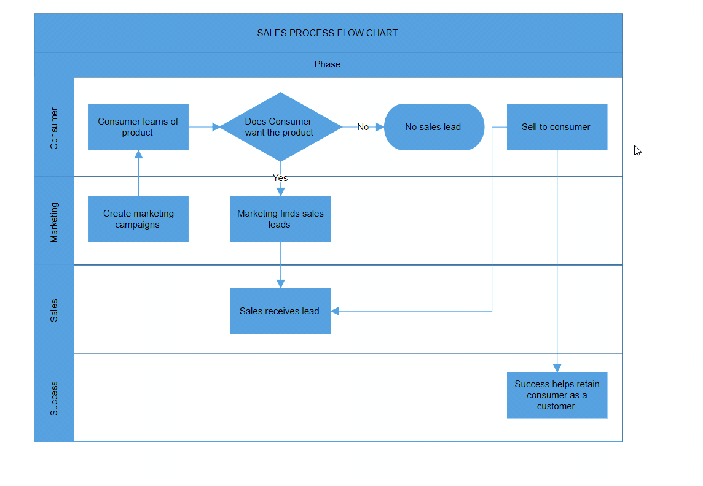

# Swimlane in Blazor Diagram Component

A [Swimlane](https://help.syncfusion.com/cr/blazor/Syncfusion.Blazor.Diagram.Swimlane.html) is a type of diagram nodes that is used to visualize the connection between a business process and its responsible department. It emphasizes logical relationships among activities, making it easier to understand the dynamics of the process and the associated departmental responsibilities.


## Create a swimlane
A swimlane can be created and added to the diagram, either programmatically or interactively. 

### Add Swimlane through the Swimlanes collection 

To create a swimlane, you have to define the swimlane object and add it to the [Swimlanes](https://help.syncfusion.com/cr/blazor/Syncfusion.Blazor.Diagram.SfDiagramComponent.html#Syncfusion_Blazor_Diagram_SfDiagramComponent_Swimlanes) collection of the diagram.

>Note: By default, if you create a swimlane, one lane and phase will be added.

```cshtml
@using Syncfusion.Blazor.Diagram

<SfDiagramComponent Height="600px" Swimlanes="@SwimlaneCollections" />

@code
{
    //Define diagram's swimlane collection.
    DiagramObjectCollection<Swimlane> SwimlaneCollections = new DiagramObjectCollection<Swimlane>();

    protected override void OnInitialized()
    {
        // A swimlane is created and stored in the swimlanes collection.
        Swimlane swimlane = new Swimlane()
        {
            OffsetX = 400, OffsetY = 200, Height = 120, Width = 450,
        };
        // Add swimlane.
        SwimlaneCollections.Add(swimlane);
    }
}
```

Now, the swimlane will be as follows.


You can download a complete working sample from [GitHub](https://github.com/SyncfusionExamples/Blazor-Diagram-Examples/tree/master/UG-Samples/Swimlanes/SwimlaneCreation/SwimlaneCreation).

>Note: We can't add swimlane elements such as phase, lane, and lane children at runtime by using the [AddDiagramElements](https://help.syncfusion.com/cr/blazor/Syncfusion.Blazor.Diagram.SfDiagramComponent.html#Syncfusion_Blazor_Diagram_SfDiagramComponent_AddDiagramElements_Syncfusion_Blazor_Diagram_DiagramObjectCollection_Syncfusion_Blazor_Diagram_NodeBase__) method.

### Swimlane Header

The Swimlane Header was the primary element for swimlanes. The [Header](https://help.syncfusion.com/cr/blazor/Syncfusion.Blazor.Diagram.Swimlane.html#Syncfusion_Blazor_Diagram_Swimlane_Header) property of swimlane allows you to define its textual description and to customize its appearance.

>Note: By using this header, swimlane interactions such as selection, dragging, and other functionalities will be performed.

The following code example explains how to define the swimlane header.

```cshtml
@using Syncfusion.Blazor.Diagram

<SfDiagramComponent Height="600px" Swimlanes="@SwimlaneCollections" />

@code
{
    //Define diagram's swimlane collection.
    DiagramObjectCollection<Swimlane> SwimlaneCollections = new DiagramObjectCollection<Swimlane>();

    protected override void OnInitialized()
    {
        // A swimlane is created and stored in the swimlanes collection.
        Swimlane swimlane = new Swimlane()
        {
            Header = new SwimlaneHeader()
            {
                Annotation = new ShapeAnnotation()
                {
                    Content = "SALES PROCESS FLOW CHART"
                },
                Height = 50,
            },
            OffsetX = 400, OffsetY = 200, Height = 120, Width = 450,
        };
        // Add swimlane.
        SwimlaneCollections.Add(swimlane);
    }
}
``` 


You can download a complete working sample from [GitHub](https://github.com/SyncfusionExamples/Blazor-Diagram-Examples/tree/master/UG-Samples/Swimlanes/SwimlaneHeader/SwimlaneHeader)

### Customization of headers

The height and width of the swimlane header can be customized with the [Width](https://help.syncfusion.com/cr/blazor/Syncfusion.Blazor.Diagram.SwimlaneChild.html#Syncfusion_Blazor_Diagram_SwimlaneChild_Width) and [Height](https://help.syncfusion.com/cr/blazor/Syncfusion.Blazor.Diagram.SwimlaneChild.html#Syncfusion_Blazor_Diagram_SwimlaneChild_Height) properties of the swimlane header. You can set the fill color of the header by using the [Style](https://help.syncfusion.com/cr/blazor/Syncfusion.Blazor.Diagram.SwimlaneHeader.html#Syncfusion_Blazor_Diagram_SwimlaneHeader_Style) property.

The following code example explains how to customize the swimlane header.

```cshtml
@using Syncfusion.Blazor.Diagram

<SfDiagramComponent Height="600px" Swimlanes="@SwimlaneCollections" />

@code
{
    //Define diagram's swimlane collection.
    DiagramObjectCollection<Swimlane> SwimlaneCollections = new DiagramObjectCollection<Swimlane>();

    protected override void OnInitialized()
    {
        // A swimlane is created and stored in the swimlanes collection.
        Swimlane swimlane = new Swimlane()
        {
            Header = new SwimlaneHeader()
            {
                Annotation = new ShapeAnnotation()
                {
                    Content = "SALES PROCESS FLOW CHART",
                    Style = new TextStyle(){Color = "White", FontSize = 12, Bold = true, Italic = true, TextDecoration = TextDecoration.Underline}
                },
                Height = 50,
                Style = new TextStyle()
                {
                    Fill = "Teal"
                }
            },
            OffsetX = 400, OffsetY = 200, Height = 120, Width = 450,
        }
        // Add swimlane.
        SwimlaneCollections.Add(swimlane);
    }
}
``` 


You can download a complete working sample from [GitHub](https://github.com/SyncfusionExamples/Blazor-Diagram-Examples/tree/master/UG-Samples/Swimlanes/SwimlaneHeader/SwimlaneHeaderCustomization)

### Header editing

The diagram provides support to edit swimlane headers at runtime. You can achieve the header editing by double-clicking on it. Double-clicking the header label will enable the editing mode.

.

## Orientation

The orientation of swimlane can be customized with the [Orientation](https://help.syncfusion.com/cr/blazor/Syncfusion.Blazor.Diagram.Swimlane.html#Syncfusion_Blazor_Diagram_Swimlane_Orientation) property of the swimlane.

>Note: The swimlane orientation is set to horizontal by default.

The following code example explains how to set the orientation of the swimlane.

```cshtml
@using Syncfusion.Blazor.Diagram

<SfDiagramComponent Height="600px" Swimlanes="@SwimlaneCollections" />

@code
{
    //Define diagram's swimlane collection.
    DiagramObjectCollection<Swimlane> SwimlaneCollections = new DiagramObjectCollection<Swimlane>();

    protected override void OnInitialized()
    {
        // A swimlane is created and stored in the swimlanes collection.
        Swimlane swimlane = new Swimlane()
        {
            OffsetX = 400, OffsetY = 200, Height = 120, Width = 450, 
            Orientation = Orientation.Horizontal,
        }
        // Add swimlane.
        SwimlaneCollections.Add(swimlane);
    }
}
```

You can download a complete working sample from [GitHub](https://github.com/SyncfusionExamples/Blazor-Diagram-Examples/tree/master/UG-Samples/Swimlanes/SwimlaneCreation/SwimlaneOrientation)

| Orientation | Output |
|---|---|
| Horizontal |  |
| Vertical |  |

## Interaction

### How to select the swimlane

Swimlane can be selected by clicking (tapping) the header of the swimlane. Also, it can be selected at runtime by using the [Select](https://help.syncfusion.com/cr/blazor/Syncfusion.Blazor.Diagram.SfDiagramComponent.html#Syncfusion_Blazor_Diagram_SfDiagramComponent_Select_System_Collections_ObjectModel_ObservableCollection_Syncfusion_Blazor_Diagram_IDiagramObject__System_Nullable_System_Boolean__) method and clear the selection in the diagram by using the [ClearSelection](https://help.syncfusion.com/cr/blazor/Syncfusion.Blazor.Diagram.SfDiagramComponent.html#Syncfusion_Blazor_Diagram_SfDiagramComponent_ClearSelection)

### How to drag the swimlane  

* Swimlane object can be dragged by clicking and dragging the header of the swimlane. 

* When you drag the elements in the diagram, the [PositionChanging](https://help.syncfusion.com/cr/blazor/Syncfusion.Blazor.Diagram.SfDiagramComponent.html#Syncfusion_Blazor_Diagram_SfDiagramComponent_PositionChanging) and [PositionChanged](https://help.syncfusion.com/cr/blazor/Syncfusion.Blazor.Diagram.SfDiagramComponent.html#Syncfusion_Blazor_Diagram_SfDiagramComponent_PositionChanged) events get triggered and we can do customization on those events.


