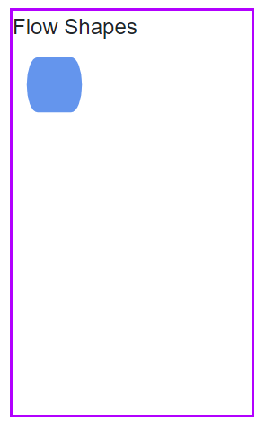
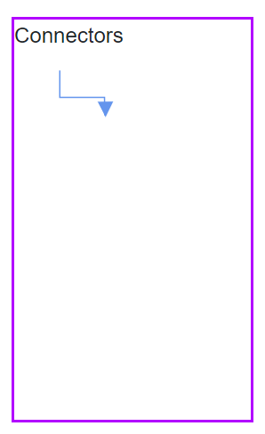
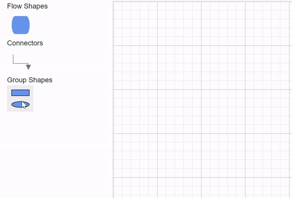
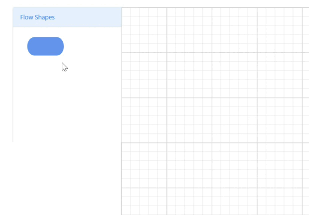

# Symbol Palette in Blazor Diagram Component

The [SymbolPalette](https://help.syncfusion.com/cr/blazor/Syncfusion.Blazor.Diagram.SymbolPalette.html) displays a collection of [Palettes](https://help.syncfusion.com/cr/blazor/Syncfusion.Blazor.Diagram.SymbolPalette.SfSymbolPaletteComponent.html#Syncfusion_Blazor_Diagram_SymbolPalette_SfSymbolPaletteComponent_Palettes). The palette shows a set of nodes and connectors. It allows to drag and drop the nodes and connectors into the diagram.

## How to create symbol palette

To create Symbol Palette easily and to add nodes and connectors in it, you can check the video below.




The [Width](https://help.syncfusion.com/cr/blazor/Syncfusion.Blazor.Diagram.SymbolPalette.SfSymbolPaletteComponent.html#Syncfusion_Blazor_Diagram_SymbolPalette_SfSymbolPaletteComponent_Width) and [Height](https://help.syncfusion.com/cr/blazor/Syncfusion.Blazor.Diagram.SymbolPalette.SfSymbolPaletteComponent.html#Syncfusion_Blazor_Diagram_SymbolPalette_SfSymbolPaletteComponent_Height) properties of the symbol palette allows to define the size of the symbol palette.

```csharp
@using Syncfusion.Blazor.Diagram.SymbolPalette
@using Syncfusion.Blazor.Diagram

@* Initializes the symbol palette *@
<SfSymbolPaletteComponent Height="600px" 
                          SymbolHeight="80" SymbolWidth="80">
</SfSymbolPaletteComponent>
```
You can download a complete working sample from [GitHub](https://github.com/SyncfusionExamples/Blazor-Diagram-Examples/tree/master/UG-Samples/SymbolPalette/CreateSymbolPalette)


### How to add node to palette

[SymbolWidth](https://help.syncfusion.com/cr/blazor/Syncfusion.Blazor.Diagram.SymbolPalette.SfSymbolPaletteComponent.html#Syncfusion_Blazor_Diagram_SymbolPalette_SfSymbolPaletteComponent_SymbolWidth) and [SymbolHeight](https://help.syncfusion.com/cr/blazor/Syncfusion.Blazor.Diagram.SymbolPalette.SfSymbolPaletteComponent.html#Syncfusion_Blazor_Diagram_SymbolPalette_SfSymbolPaletteComponent_SymbolHeight) properties of the SfSymbolPaletteComponent should be defined to render the symbol(node, connector or nodegroup) in the palette. The following code example illustrates how to add node to a palette.

* To render a node in a palette, first create SymbolPalette and initialize palettes collection.

```csharp
@using Syncfusion.Blazor.Diagram
@using Syncfusion.Blazor.Diagram.SymbolPalette

<div class="control-section">
    <div style="width:20%">
        <div id="palette-space" class="sb-mobile-palette" style="border: 2px solid #b200ff">
            <SfSymbolPaletteComponent @ref="@SymbolPalette" Height="300px" Width="200px"
                                      Palettes="@Palettes" SymbolHeight="60" SymbolWidth="60" SymbolMargin="@SymbolMargin">
            </SfSymbolPaletteComponent>
        </div>
    </div>
</div>

@code
{
    SymbolMargin SymbolMargin = new SymbolMargin 
    { 
        Left = 15, 
        Right = 15, 
        Top = 15, 
        Bottom = 15 
    };
    SfSymbolPaletteComponent SymbolPalette;
    //Define palettes collection.
    DiagramObjectCollection<Palette> Palettes = new DiagramObjectCollection<Palette>();
}
```

* Create node and add that node to the DiagramObjectCollection<NodeBase>.

```csharp
   // Defines palette's flow-shape collection.
    DiagramObjectCollection<NodeBase> PaletteNodes = new DiagramObjectCollection<NodeBase>();

    protected override void OnInitialized()
    {
        InitPaletteModel();
    }

    private void InitPaletteModel()
    {                    
        CreatePaletteNode(NodeFlowShapes.Terminator, "Terminator");       
    }

    private void CreatePaletteNode(NodeFlowShapes flowShape, string id)
    {
        Node node = new Node()
        {
            ID = id,
            Shape = new FlowShape() { Type = NodeShapes.Flow, Shape = flowShape },
            Style = new ShapeStyle() {Fill="#6495ED", StrokeColor = "#757575" },
        };
        PaletteNodes.Add(node);
    }
```

* Complete code to add node to the palette.

```csharp
@using Syncfusion.Blazor.Diagram
@using Syncfusion.Blazor.Diagram.SymbolPalette

<div class="control-section">
    <div style="width:20%">
        <div id="palette-space" class="sb-mobile-palette" style="border: 2px solid #b200ff">
            <SfSymbolPaletteComponent @ref="@SymbolPalette" Height="300px" Width="200px"
                                      Palettes="@Palettes" SymbolHeight="60" SymbolWidth="60" SymbolMargin="@SymbolMargin">
            </SfSymbolPaletteComponent>
        </div>
    </div>
</div>

@code
{
    SymbolMargin SymbolMargin = new SymbolMargin 
    { 
        Left = 15, 
        Right = 15, 
        Top = 15, 
        Bottom = 15
    };

    SfSymbolPaletteComponent SymbolPalette;

    //Define palettes collection.
    DiagramObjectCollection<Palette> Palettes = new DiagramObjectCollection<Palette>();

    // Defines palette's flow-shape collection.
    DiagramObjectCollection<NodeBase> PaletteNodes = new DiagramObjectCollection<NodeBase>();

    protected override void OnInitialized()
    {
        InitPaletteModel();
    }

    private void InitPaletteModel()
    {
        CreatePaletteNode(NodeFlowShapes.Terminator, "Terminator");
        Palettes = new DiagramObjectCollection<Palette>()
        {
           new Palette(){Symbols =PaletteNodes, Title="Flow Shapes", ID="Flow Shapes" },
        };
    }
    private void CreatePaletteNode(NodeFlowShapes flowShape, string id)
    {
        Node node = new Node()
        {
            ID = id,
            Shape = new FlowShape() { Type = NodeShapes.Flow, Shape = flowShape },
            Style = new ShapeStyle() { Fill = "#6495ED", StrokeColor = "#6495ED" },
        };
        PaletteNodes.Add(node);
    }
}

```
You can download a complete working sample from [GitHub](https://github.com/SyncfusionExamples/Blazor-Diagram-Examples/tree/master/UG-Samples/SymbolPalette/AddNodeToPalette)




### How to add connector to palette

The following code example illustrates how to add connector to a palette.

```csharp
@using Syncfusion.Blazor.Diagram
@using Syncfusion.Blazor.Diagram.SymbolPalette

<div class="control-section">
    <div style="width:20%">
        <div id="palette-space" class="sb-mobile-palette" style="border: 2px solid #b200ff">
            <SfSymbolPaletteComponent @ref="@SymbolPalette" Height="300px" Width="200px"
                                      Palettes="@Palettes" SymbolHeight="60" SymbolWidth="100">
            </SfSymbolPaletteComponent>
        </div>
    </div>
</div>

@code
{
    SfSymbolPaletteComponent SymbolPalette;

    //Define palettes collection.
    DiagramObjectCollection<Palette> Palettes = new DiagramObjectCollection<Palette>();

    // Defines palette's flow-shape collection.
    DiagramObjectCollection<NodeBase> PaletteNodes = new DiagramObjectCollection<NodeBase>();

    // Defines palette's connector collection.
    DiagramObjectCollection<NodeBase> PaletteConnectors = new DiagramObjectCollection<NodeBase>();

    protected override void OnInitialized()
    {
        InitPaletteModel();
    }

    private void InitPaletteModel()
    {
        CreatePaletteConnector("Link1", ConnectorSegmentType.Orthogonal, DecoratorShape.Arrow);
        Palettes = new DiagramObjectCollection<Palette>()
        {
            new Palette(){Symbols = PaletteConnectors, Title = "Connectors" , IsExpanded = true},
        };
    }

    private void CreatePaletteConnector(string id, ConnectorSegmentType type, DecoratorShape decoratorShape)
    {
        Connector connector = new Connector()
        {
            ID = id,
            Type = type,
            SourcePoint = new DiagramPoint() { X = 0, Y = 0 },
            TargetPoint = new DiagramPoint() { X = 100, Y = 100 },
            Style = new ShapeStyle() { StrokeWidth = 1, StrokeColor = "#6495ED" },
            TargetDecorator = new DecoratorSettings()
            {
                Shape = decoratorShape,
                Style = new ShapeStyle() { StrokeColor = "#6495ED", Fill = "#6495ED" }
            }
        };

        PaletteConnectors.Add(connector);
    }
}
```
You can download a complete working sample from [GitHub](https://github.com/SyncfusionExamples/Blazor-Diagram-Examples/tree/master/UG-Samples/SymbolPalette/AddConnectorToSymbolPalette)




### How to add nodegroup into palette

The following code example illustrates how to add nodegroup to a palette.

```csharp
@using Syncfusion.Blazor.Diagram
@using Syncfusion.Blazor.Diagram.SymbolPalette

<div class="control-section">
    <div style="width:20%">
        <div id="palette-space" class="sb-mobile-palette" style="border: 2px solid #b200ff">
            <SfSymbolPaletteComponent @ref="@SymbolPalette" Height="300px" Width="200px"
                                      Palettes="@Palettes" SymbolHeight="60" SymbolWidth="60" SymbolMargin="@SymbolMargin">
            </SfSymbolPaletteComponent>
        </div>
    </div>
</div>

@code{

    SymbolMargin SymbolMargin = new SymbolMargin
    {
        Left = 15,
        Right = 15,
        Top = 15,
        Bottom = 15
    };

    SfSymbolPaletteComponent SymbolPalette;

    //Define palettes collection.
    DiagramObjectCollection<Palette> Palettes = new DiagramObjectCollection<Palette>();

    // Defines palette's group collection.
    DiagramObjectCollection<NodeBase> PaletteGroup = new DiagramObjectCollection<NodeBase>();

    protected override void OnInitialized()
    {
        InitPaletteModel();
    }

    private void InitPaletteModel()
    {
        CreatePaletteGroup();
        Palettes = new DiagramObjectCollection<Palette>()
        {
             new Palette(){Symbols = PaletteGroup,Title = "Group Shapes", IsExpanded = true}
        };
    }

    private void CreatePaletteGroup()
    {
        Node node1 = new Node()
        {
            ID = "node1",
            Width = 50,
            Height = 50,
            OffsetX = 100,
            OffsetY = 100,
            Shape = new BasicShape() { Type = NodeShapes.Basic, Shape = NodeBasicShapes.Rectangle },
            Style = new ShapeStyle() { Fill = "#6495ed" },
        };
        Node node2 = new Node()
        {
            ID = "node2",
            Width = 50,
            Height = 50,
            OffsetX = 100,
            OffsetY = 200,
            Shape = new BasicShape() { Type = NodeShapes.Basic, Shape = NodeBasicShapes.Ellipse },
            Style = new ShapeStyle() { Fill = "#6495ed" },
        };
        PaletteGroup.Add(node1);
        PaletteGroup.Add(node2);

        NodeGroup group = new NodeGroup()
        {
            ID = "group1",
            Children = new string[] { "node1", "node2" }
        };
        PaletteGroup.Add(group);
    }
}
```
You can download a complete working sample from [GitHub](https://github.com/SyncfusionExamples/Blazor-Diagram-Examples/tree/master/UG-Samples/SymbolPalette/AddGroupToPalette)


## Add palette to SymbolPalette

A palette allows to display a group of related symbols and it textually annotates the group with its header. A [Palette](https://help.syncfusion.com/cr/blazor/Syncfusion.Blazor.Diagram.SymbolPalette.Palette.html) can be added as a collection of symbol groups.

The collection of predefined symbols can be added in palettes using the [Symbols](https://help.syncfusion.com/cr/blazor/Syncfusion.Blazor.Diagram.SymbolPalette.Palette.html#Syncfusion_Blazor_Diagram_SymbolPalette_Palette_Symbols) property.

To initialize a palette, define a JSON object with the property [ID](https://help.syncfusion.com/cr/blazor/Syncfusion.Blazor.Diagram.SymbolPalette.Palette.html#Syncfusion_Blazor_Diagram_SymbolPalette_Palette_ID) that is unique ID is set to the palettes.

The following code example illustrates how to define a palette.

```csharp
@using Syncfusion.Blazor.Diagram.SymbolPalette
@using Syncfusion.Blazor.Diagram

@* Initializes the symbol palette *@
<SfSymbolPaletteComponent @ref="SymbolPalette" Height="600px"
                          SymbolHeight="80" SymbolWidth="80" Palettes="@palettes">
</SfSymbolPaletteComponent>

@code
{
    SfSymbolPaletteComponent SymbolPalette;
    DiagramObjectCollection<Palette> palettes = new DiagramObjectCollection<Palette>();
}
```

The following code example illustrates how to add nodes, connectors, nodegroups to the palette and add palette to the palettes collection of the symbol palette.

```csharp
Palettes = new DiagramObjectCollection<Palette>()
{
    new Palette(){Symbols = PaletteNodes, Title = "Flow Shapes", ID = "Flow Shapes" },
    new Palette(){Symbols = PaletteConnectors, Title = "Connectors", IsExpanded = true},
    new Palette(){Symbols = PaletteGroup, Title = "Group Shapes", IsExpanded = true}
};                  
```

* Complete code to render palette with node, connector, and nodegroup.

```csharp
@using Syncfusion.Blazor.Diagram
@using Syncfusion.Blazor.Diagram.SymbolPalette

<div class="control-section">
    <div style="width:20%">       
        <div id="palette-space" class="sb-mobile-palette" style="border: 2px solid #b200ff">
            <SfSymbolPaletteComponent @ref="@SymbolPalette" Height="300px" Width="200px"
                                      Palettes="@Palettes" SymbolHeight="60" SymbolWidth="60" SymbolMargin="@SymbolMargin">
            </SfSymbolPaletteComponent>
        </div>
    </div>
</div>

@code
{
    SymbolMargin SymbolMargin = new SymbolMargin 
    { 
        Left = 15, 
        Right = 15, 
        Top = 15, 
        Bottom = 15 
    };
    SfSymbolPaletteComponent SymbolPalette;
    //Define palettes collection.
    DiagramObjectCollection<Palette> Palettes = new DiagramObjectCollection<Palette>();
    // Defines palette's flow-shape collection.
    DiagramObjectCollection<NodeBase> PaletteNodes = new DiagramObjectCollection<NodeBase>();
    // Defines palette's group collection.
    DiagramObjectCollection<NodeBase> PaletteGroup = new DiagramObjectCollection<NodeBase>();
    // Defines palette's connector collection.
    DiagramObjectCollection<NodeBase> PaletteConnectors = new DiagramObjectCollection<NodeBase>();

    protected override void OnInitialized()
    {
        InitPaletteModel();
    }

    private void InitPaletteModel()
    {
        CreatePaletteNode(NodeFlowShapes.Terminator, "Terminator");
        CreatePaletteConnector("Link1", ConnectorSegmentType.Orthogonal, DecoratorShape.Arrow);
        CreatePaletteGroup();
        Palettes = new DiagramObjectCollection<Palette>()
        {
            new Palette(){Symbols = PaletteNodes,Title = "Flow Shapes", ID = "Flow Shapes" },
            new Palette(){Symbols = PaletteConnectors,Title = "Connectors", IsExpanded = true},
            new Palette(){Symbols = PaletteGroup,Title = "Group Shapes", IsExpanded = true}
        };
    }

    private void CreatePaletteNode(NodeFlowShapes flowShape, string id)
    {
        Node node = new Node()
        {
            ID = id,
            Shape = new FlowShape() { Type = NodeShapes.Flow, Shape = flowShape },
            Style = new ShapeStyle() { Fill = "#6495ED", StrokeColor = "#6495ED" },
        };
        PaletteNodes.Add(node);
    }

    private void CreatePaletteConnector(string id, ConnectorSegmentType type, DecoratorShape decoratorShape)
    {
        Connector connector = new Connector()
        {
            ID = id,
            Type = type,
            SourcePoint = new DiagramPoint() { X = 0, Y = 0 },
            TargetPoint = new DiagramPoint() { X = 60, Y = 60 },
            Style = new ShapeStyle() { StrokeWidth = 1, StrokeColor = "#757575" },
            TargetDecorator = new DecoratorSettings()
            {
                Shape = decoratorShape,
                Style = new ShapeStyle() { StrokeColor = "#757575", Fill = "#757575" }
            }
        };
        PaletteConnectors.Add(connector);
    }

    private void CreatePaletteGroup()
    {
        Node node1 = new Node()
        {
            ID = "node1",
            Width = 50,
            Height = 50,
            OffsetX = 100,
            OffsetY = 100,
            Shape = new BasicShape() { Type = NodeShapes.Basic, Shape = NodeBasicShapes.Rectangle },
            Style = new ShapeStyle() { Fill = "#6495ed" },
        };
        Node node2 = new Node()
        {
            ID = "node2",
            Width = 50,
            Height = 50,
            OffsetX = 100,
            OffsetY = 200,
            Shape = new BasicShape() { Type = NodeShapes.Basic, Shape = NodeBasicShapes.Ellipse },
            Style = new ShapeStyle() { Fill = "#6495ed" },
        };
        PaletteGroup.Add(node1);
        PaletteGroup.Add(node2);
        NodeGroup group = new NodeGroup()
        {
            ID = "group1",
            Children = new string[] { "node1", "node2" }
        };
        PaletteGroup.Add(group);
    }
}
```
You can download a complete working sample from [GitHub](https://github.com/SyncfusionExamples/Blazor-Diagram-Examples/tree/master/UG-Samples/SymbolPalette/AddPaletteToSymbolPalette)


## How to drag and drop symbols from palette to diagram

To initialize drag and drop, you must add the diagram to the [Targets](https://help.syncfusion.com/cr/blazor/Syncfusion.Blazor.Diagram.SymbolPalette.SfSymbolPaletteComponent.html#Syncfusion_Blazor_Diagram_SymbolPalette_SfSymbolPaletteComponent_Targets) collection of the symbol palette. The following code illustrates how to add diagram to the Targets collection.

```csharp
@code
{
    SfDiagramComponent diagram;

    protected override async Task OnAfterRenderAsync(bool firstRender)
    {
        SymbolPalette.Targets = new DiagramObjectCollection<SfDiagramComponent>() { };
        SymbolPalette.Targets.Add(diagram);
    }
}
```

* Complete code to drag and drop symbols from palette to diagram.

```csharp
@using Syncfusion.Blazor.Diagram
@using Syncfusion.Blazor.Diagram.SymbolPalette

<div class="control-section">    
    <div style="width: 100%">
        <div class="sb-mobile-palette-bar">
            <div id="palette-icon" style="float: right;" role="button" class="e-ddb-icons1 e-toggle-palette"></div>
        </div>
        <div id="palette-space" class="sb-mobile-palette">
            <SfSymbolPaletteComponent @ref="@SymbolPalette" Height="700px"
                                      Palettes="@Palettes"  SymbolHeight="60" SymbolWidth="60" SymbolMargin="@SymbolMargin">
            </SfSymbolPaletteComponent>
        </div>
        <div id="diagram-space" class="sb-mobile-diagram">
            <div class="content-wrapper" style="border: 1px solid #D7D7D7">
                <SfDiagramComponent @ref="@diagram" Height="700px" Connectors="@connectors" Nodes="@nodes">
                </SfDiagramComponent>
            </div>
        </div>
    </div>
</div>

@code
{
    SymbolMargin SymbolMargin = new SymbolMargin 
    { 
        Left = 15, 
        Right = 15, 
        Top = 15, 
        Bottom = 15 
    };
    SfDiagramComponent diagram;
    SfSymbolPaletteComponent SymbolPalette;
    //Define nodes collection.
    DiagramObjectCollection<Node> nodes = new DiagramObjectCollection<Node>();
    //Define connectors collection.
    DiagramObjectCollection<Connector> connectors = new DiagramObjectCollection<Connector>();
    //Define palettes collection.
    DiagramObjectCollection<Palette> Palettes = new DiagramObjectCollection<Palette>();
    // Defines palette's flow-shape collection.
    DiagramObjectCollection<NodeBase> PaletteNodes = new DiagramObjectCollection<NodeBase>();
    // Defines palette's group collection.
    DiagramObjectCollection<NodeBase> PaletteGroup = new DiagramObjectCollection<NodeBase>();
    // Defines palette's connector collection.
    DiagramObjectCollection<NodeBase> PaletteConnectors = new DiagramObjectCollection<NodeBase>();

    protected override async Task OnAfterRenderAsync(bool firstRender)
    {
        SymbolPalette.Targets = new DiagramObjectCollection<SfDiagramComponent>() { };
        SymbolPalette.Targets.Add(diagram);
    }

    protected override void OnInitialized()
    {
        InitPaletteModel();
    }

    private void InitPaletteModel()
    {
        CreatePaletteNode(NodeFlowShapes.Terminator, "Terminator");        
        CreatePaletteConnector("Link1", ConnectorSegmentType.Orthogonal, DecoratorShape.Arrow);        
        CreatePaletteGroup();
        Palettes = new DiagramObjectCollection<Palette>()
        {
            new Palette(){Symbols = PaletteNodes,Title = "Flow Shapes", ID = "Flow Shapes" },
            new Palette(){Symbols = PaletteConnectors,Title = "Connectors", IsExpanded = true},
            new Palette(){Symbols = PaletteGroup,Title = "Group Shapes", IsExpanded = true}
        };
    }

    private void CreatePaletteNode(NodeFlowShapes flowShape, string id)
    {
        Node node = new Node()
        {
            ID = id,
            Shape = new FlowShape() { Type = NodeShapes.Flow, Shape = flowShape },
            Style = new ShapeStyle() { Fill= "#6495ED", StrokeColor = "#6495ED" },
        };
        PaletteNodes.Add(node);
    }

    private void CreatePaletteConnector(string id, ConnectorSegmentType type, DecoratorShape decoratorShape)
    {
        Connector connector = new Connector()
        {
            ID = id,
            Type = type,
            SourcePoint = new DiagramPoint() { X = 0, Y = 0 },
            TargetPoint = new DiagramPoint() { X = 60, Y = 60 },
            Style = new ShapeStyle() { StrokeWidth = 1, StrokeColor = "#757575" },
            TargetDecorator = new DecoratorSettings()
            {
                Shape = decoratorShape,
                Style = new ShapeStyle() { StrokeColor = "#757575", Fill = "#757575" }
            }
        };
        PaletteConnectors.Add(connector);
    }

    private void CreatePaletteGroup()
    {
        Node node1 = new Node()
        {
            ID = "node1",
            Width = 50,
            Height = 50,
            OffsetX = 100,
            OffsetY = 100,
            Shape = new BasicShape() { Type = NodeShapes.Basic, Shape = NodeBasicShapes.Rectangle },
            Style = new ShapeStyle() { Fill = "#6495ed" },
        };
        Node node2 = new Node()
        {
            ID = "node2",
            Width = 50,
            Height = 50,
            OffsetX = 100,
            OffsetY = 200,
            Shape = new BasicShape() { Type = NodeShapes.Basic, Shape = NodeBasicShapes.Ellipse },
            Style = new ShapeStyle() { Fill = "#6495ed" },
        };
        PaletteGroup.Add(node1);
        PaletteGroup.Add(node2);
        NodeGroup group = new NodeGroup()
        {
            ID = "group1",
            Children = new string[] { "node1", "node2" }
        };
        PaletteGroup.Add(group);
    }
}
```
You can download a complete working sample from [GitHub](https://github.com/SyncfusionExamples/Blazor-Diagram-Examples/tree/master/UG-Samples/SymbolPalette/DragAndDrop)



## Customize the palette header

Palettes can be annotated with its header texts.

The [Title](https://help.syncfusion.com/cr/blazor/Syncfusion.Blazor.Diagram.SymbolPalette.Palette.html#Syncfusion_Blazor_Diagram_SymbolPalette_Palette_Title) displayed as the header text of palette.

The [IsExpanded](https://help.syncfusion.com/cr/blazor/Syncfusion.Blazor.Diagram.SymbolPalette.Palette.html#Syncfusion_Blazor_Diagram_SymbolPalette_Palette_IsExpanded) property of palette allows to expand/collapse its palette items.

The following code illustrates how to change the Title and IsExpanded properties at runtime.

```csharp
SymbolPalette.Palettes[0].Title = "NewTitle";
SymbolPalette.Palettes[0].IsExpanded = false;
```
You can download a complete working sample from [GitHub](https://github.com/SyncfusionExamples/Blazor-Diagram-Examples/tree/master/UG-Samples/SymbolPalette/PaletteHeader)


## How to provide tooltip for symbols in symbol palette

Symbol palette provides supports to show toolip when mouse hovers over any node or connector. The tooltip can be customized for each symbols in the symbol palette.

### Default tooltip for symbols

By default, the symbol's ID will be displayed as the tooltip for each symbol in the symbol palette. The following image illustrate how the tooltip displays when mouse hovers over the symbols in symbol palette.


### Custom tooltip for symbols

You can provide custom tooltip for symbols in the symbol palette by assigning custom tooltip to Tooltip property of nodes and connectors. Once custom tooltip is defined then enable the custom tooltip for symbols in the symbol palette by setting the Tooltip constraints for node and connector. This allows the custom tooltips to be displayed when hovering over symbols in the symbol palette.

The following code example illustrates how to provide the custom tooltip for nodes.

```csharp
@using Syncfusion.Blazor.Diagram
@using Syncfusion.Blazor.Diagram.SymbolPalette

<div class="control-section">
    <div style="width:20%">
        <div id="palette-space" class="sb-mobile-palette" style="border: 2px solid #b200ff">
            <SfSymbolPaletteComponent @ref="@SymbolPalette" Height="300px" Width="200px"
                                      Palettes="@Palettes" SymbolHeight="60" SymbolWidth="60" SymbolMargin="@SymbolMargin">
            </SfSymbolPaletteComponent>
        </div>
    </div>
</div>

@code
{
    SfSymbolPaletteComponent SymbolPalette;

    //Define palettes collection.
    DiagramObjectCollection<Palette> Palettes = new DiagramObjectCollection<Palette>();

    // Defines palette's flow-shape collection.
    DiagramObjectCollection<NodeBase> PaletteNodes = new DiagramObjectCollection<NodeBase>();

    protected override void OnInitialized()
    {
        InitPaletteModel();
    }

    private void InitPaletteModel()
    {
        CreatePaletteNode(NodeFlowShapes.Terminator, "Terminator");
        Palettes = new DiagramObjectCollection<Palette>()
        {
           new Palette(){Symbols =PaletteNodes, Title="Flow Shapes", ID="Flow Shapes" },
        };
    }
    private void CreatePaletteNode(NodeFlowShapes flowShape, string id)
    {
        Node node = new Node()
        {
            ID = id,
            Shape = new FlowShape() { Type = NodeShapes.Flow, Shape = flowShape },
            Style = new ShapeStyle() { Fill = "#6495ED", StrokeColor = "#6495ED" },
            Tooltip = new DiagramTooltip()
            {
                Content = "This is Terminator",
                Position = Position.BottomRight,
                ShowTipPointer = true
            },
            Constraints = NodeConstraints.Default | NodeConstraints.Tooltip
        };
        PaletteNodes.Add(node);
    }
}

```
You can download a complete working sample from [GitHub](https://github.com/SyncfusionExamples/Blazor-Diagram-Examples/tree/master/UG-Samples/SymbolPalette/SymbolPaletteTooltip)


## How to provide different tooltip for Symbol palette and diagram elements.

When you define custom tooltip to the symbol then same tooltip will be displayed for both symbol and dropped node in the diagram canvas. To provide different tooltip for symbols in the symbol palette and the dropped node in the diagram canvas, then DragDrop event can be utilized. The [DragDrop](https://help.syncfusion.com/cr/blazor/Syncfusion.Blazor.Diagram.SfDiagramComponent.html#Syncfusion_Blazor_Diagram_SfDiagramComponent_DragDrop) event is triggered when a symbol is dragged and dropped from the symbol palette to the drawing area. In the Drop event, you can define the new tooltip for the dropped node by assigning new tooltip content to the Tooltip property of the node. The following code snippet will demonstrate how to define two different tooltip for symbol in the symbol palette and dropped node in the diagram canvas.

```csharp
@using Syncfusion.Blazor.Diagram
@using Syncfusion.Blazor.Diagram.SymbolPalette

<div class="control-section">    
    <div style="width: 100%">
        <div class="sb-mobile-palette-bar">
            <div id="palette-icon" style="float: right;" role="button" class="e-ddb-icons1 e-toggle-palette"></div>
        </div>
        <div id="palette-space" class="sb-mobile-palette">
            <SfSymbolPaletteComponent @ref="@SymbolPalette" Height="700px"
                                      Palettes="@Palettes"  SymbolHeight="60" SymbolWidth="60" SymbolMargin="@SymbolMargin">
            </SfSymbolPaletteComponent>
        </div>
        <div id="diagram-space" class="sb-mobile-diagram">
            <div class="content-wrapper" style="border: 1px solid #D7D7D7">
                <SfDiagramComponent @ref="@diagram" Height="700px" Connectors="@connectors" Nodes="@nodes" DragDrop="DragDropEvent">
                </SfDiagramComponent>
            </div>
        </div>
    </div>
</div>

@code
{
    SymbolMargin SymbolMargin = new SymbolMargin 
    { 
        Left = 15, 
        Right = 15, 
        Top = 15, 
        Bottom = 15 
    };
    SfDiagramComponent diagram;
    SfSymbolPaletteComponent SymbolPalette;
    //Define nodes collection.
    DiagramObjectCollection<Node> nodes = new DiagramObjectCollection<Node>();
    //Define palettes collection.
    DiagramObjectCollection<Palette> Palettes = new DiagramObjectCollection<Palette>();
    // Defines palette's flow-shape collection.
    DiagramObjectCollection<NodeBase> PaletteNodes = new DiagramObjectCollection<NodeBase>();
    
    protected override async Task OnAfterRenderAsync(bool firstRender)
    {
        SymbolPalette.Targets = new DiagramObjectCollection<SfDiagramComponent>() { };
        SymbolPalette.Targets.Add(diagram);
    }

    protected override void OnInitialized()
    {
        InitPaletteModel();
    }

    private void InitPaletteModel()
    {
        CreatePaletteNode(NodeFlowShapes.Terminator, "Terminator");        
        Palettes = new DiagramObjectCollection<Palette>()
        {
            new Palette(){Symbols = PaletteNodes,Title = "Flow Shapes", ID = "Flow Shapes" },
        };
    }

    private void CreatePaletteNode(NodeFlowShapes flowShape, string id)
    {
        Node node = new Node()
        {
            ID = id,
            Shape = new FlowShape() { Type = NodeShapes.Flow, Shape = flowShape },
            Style = new ShapeStyle() { Fill= "#6495ED", StrokeColor = "#6495ED" },
            Tooltip = new DiagramTooltip()
            {
                Content = "This is Terminator",
                Position = Position.RightCenter,
                ShowTipPointer = true
            },
            Constraints = NodeConstraints.Default | NodeConstraints.Tooltip        
        };
        PaletteNodes.Add(node);
    }

    private void DragDropEvent(DropEventArgs args)
    {
        if (args.Element is Node)
        {
            (args.Element as Node).Tooltip.Content = "This is diagram Tooltip";
        }
    }
}
```
You can download a complete working sample from [GitHub](https://github.com/SyncfusionExamples/Blazor-Diagram-Examples/tree/master/UG-Samples/SymbolPalette/SymbolPaletteTooltip)



## How to add/remove symbols from palette at runtime

Symbols can be added to palette at runtime by using the public method [AddPaletteItem](https://help.syncfusion.com/cr/blazor/Syncfusion.Blazor.Diagram.SymbolPalette.SfSymbolPaletteComponent.html#Syncfusion_Blazor_Diagram_SymbolPalette_SfSymbolPaletteComponent_AddPaletteItem_System_String_Syncfusion_Blazor_Diagram_NodeBase_System_Boolean_). The following code sample illustrates how to add symbol using AddPaletteItem method.

```csharp
Node decision = new Node()
{ 
    ID = "Decision",
    Shape = new FlowShape() { Type = NodeShapes.Flow, Shape = NodeFlowShapes.Decision } 
};
SymbolPalette.AddPaletteItem("FlowShapes", decision, false);
```

Also, you can add symbol to the palette at runtime by using the `Add` method. The following code sample illustrates how to add symbol using Add method.


```csharp
Node decision = new Node()
{ 
    ID = "Decision",
    Shape = new FlowShape() { Type = NodeShapes.Flow, Shape = NodeFlowShapes.Decision } 
};
SymbolPalette.Palettes[0].Symbols.Add(decision);
```

Symbols can be removed from palette at runtime by using the public method [RemovePaletteItem](https://help.syncfusion.com/cr/blazor/Syncfusion.Blazor.Diagram.SymbolPalette.SfSymbolPaletteComponent.html#Syncfusion_Blazor_Diagram_SymbolPalette_SfSymbolPaletteComponent_RemovePaletteItem_System_String_System_String_). The following code sample illustrates how to remove symbol using RemovePaletteItem method.


```csharp
   symbolpalette.RemovePaletteItem("FlowShapes", "Decision");
```
You can download a complete working sample from [GitHub](https://github.com/SyncfusionExamples/Blazor-Diagram-Examples/tree/master/UG-Samples/SymbolPalette/AddRemoveSymbolAtRuntime)


## How to add/remove palettes at runtime

Palettes can be added to the symbol palette at runtime by using the public method [AddPalettes](https://help.syncfusion.com/cr/blazor/Syncfusion.Blazor.Diagram.SymbolPalette.SfSymbolPaletteComponent.html#Syncfusion_Blazor_Diagram_SymbolPalette_SfSymbolPaletteComponent_AddPalettes_Syncfusion_Blazor_Diagram_DiagramObjectCollection_Syncfusion_Blazor_Diagram_SymbolPalette_Palette__). The following code sample illustrates how to add palette using AddPalettes method.

```csharp
    DiagramObjectCollection<NodeBase> newNodes = new DiagramObjectCollection<NodeBase>();
    Node newNode = new Node()
        {
            ID = "newNode",
            Shape = new BasicShape() { Type = NodeShapes.Basic, Shape = NodeBasicShapes.Ellipse }
        };
    newNodes.Add(newNode as NodeBase);
    DiagramObjectCollection<Palette> newPalettes = new DiagramObjectCollection<Palette>()
    {
        new Palette(){Symbols = newNodes,Title = "BasicShapes",ID = "BasicShapes" },
    };
    symbolpalette.AddPalettes(newPalettes);
```

Also, you can add palette to the symbol palette at runtime by using the `Add` method. The following code sample illustrates how to add palette using Add method.

```csharp
    DiagramObjectCollection<NodeBase> newNodes = new DiagramObjectCollection<NodeBase>();
    Node newNode = new Node()
        {
            ID = "newNode",
            Shape = new BasicShape() { Type = NodeShapes.Basic, Shape = NodeBasicShapes.Ellipse }
        };
    newNodes.Add(newNode as NodeBase);
    DiagramObjectCollection<Palette> newPalettes = new DiagramObjectCollection<Palette>()
    {
        new Palette(){Symbols = newNodes,Title = "BasicShapes",ID = "BasicShapes" },
    };
    SymbolPalette.Palettes.Add(NewPalette);
```

Palettes can be removed from the symbol palette at runtime by using the public method [RemovePalettes](https://help.syncfusion.com/cr/blazor/Syncfusion.Blazor.Diagram.SymbolPalette.SfSymbolPaletteComponent.html#Syncfusion_Blazor_Diagram_SymbolPalette_SfSymbolPaletteComponent_RemovePalettes_System_String_). The following code sample illustrates how to remove palette using the RemovePalettes method.

```csharp
 SymbolPalette.RemovePalettes("BasicShapes");
```
You can download a complete working sample from [GitHub](https://github.com/SyncfusionExamples/Blazor-Diagram-Examples/tree/master/UG-Samples/SymbolPalette/AddRemovePaletteAtRuntime)


## How to customize the size of symbols

The size of the individual symbol can be customized. The [SymbolWidth](https://help.syncfusion.com/cr/blazor/Syncfusion.Blazor.Diagram.SymbolPalette.SfSymbolPaletteComponent.html#Syncfusion_Blazor_Diagram_SymbolPalette_SfSymbolPaletteComponent_SymbolWidth) and [SymbolHeight](https://help.syncfusion.com/cr/blazor/Syncfusion.Blazor.Diagram.SymbolPalette.SfSymbolPaletteComponent.html#Syncfusion_Blazor_Diagram_SymbolPalette_SfSymbolPaletteComponent_SymbolHeight) properties of symbol palette enables you to define the size of the symbols.

Also, you can update the size of the symbols at runtime.

The following code example illustrates how to change the size of a symbol and how to update the size at runtime.

```csharp
@using Syncfusion.Blazor.Diagram
@using Syncfusion.Blazor.Diagram.SymbolPalette
@using Syncfusion.Blazor.Buttons

<div class="control-section">
    <div class="properties">
        <SfButton Content="UpdateSize" OnClick="@UpdateSize" />

    </div>
    <div style="width:20%">
        <div id="palette-space" class="sb-mobile-palette" style="border: 2px solid #b200ff">
            <SfSymbolPaletteComponent @ref="@symbolpalette" Height="300px" Width="200px"
                                      Palettes="@Palettes" SymbolHeight="@symbolwidth" SymbolWidth="@symbolheight" SymbolMargin="@SymbolMargin">
            </SfSymbolPaletteComponent>
        </div>
    </div>
</div>

@code {
    //Define symbolpreview
    DiagramSize SymbolPreview;
    //Define symbolmargin
    SymbolMargin SymbolMargin = new SymbolMargin { Left = 15, Right = 15, Top = 15, Bottom = 15 };
    double symbolwidth = 60;
    double symbolheight = 60;
    //Reference the symbolpalette
    SfSymbolPaletteComponent symbolpalette;

    //Define palattes collection
    DiagramObjectCollection<Palette> Palettes = new DiagramObjectCollection<Palette>();

    // Defines palette's flow-shape collection
    DiagramObjectCollection<NodeBase> PaletteNodes = new DiagramObjectCollection<NodeBase>();

    protected override void OnInitialized()
    {
        InitPaletteModel();
    }

    private void InitPaletteModel()
    {
        Node node1 = new Node()
            {
                ID = "Rectangle",
                Shape = new BasicShape() { Type = NodeShapes.Basic, Shape = NodeBasicShapes.Rectangle },
                Style = new ShapeStyle() { Fill = "#6495ED", StrokeColor = "#6495ED" },
            };
        Node node2 = new Node()
            {
                ID = "Ellipse",
                Shape = new BasicShape() { Type = NodeShapes.Basic, Shape = NodeBasicShapes.Ellipse },
                Style = new ShapeStyle() { Fill = "#6495ED", StrokeColor = "#6495ED" },
            };
        Node node3 = new Node()
            {
                ID = "Diamond",
                Shape = new BasicShape() { Type = NodeShapes.Basic, Shape = NodeBasicShapes.Diamond },
                Style = new ShapeStyle() { Fill = "#6495ED", StrokeColor = "#6495ED" },
            };
        PaletteNodes.Add(node1);
        PaletteNodes.Add(node2);
        PaletteNodes.Add(node3);

        Palettes = new DiagramObjectCollection<Palette>()
    {
           new Palette(){Symbols =PaletteNodes,Title="Basic Shapes",ID="Basic Shapes" },
        };
    }
    //Method to update symbol width and symbol height
    private void UpdateSize()
    {
        symbolwidth = 80;
        symbolheight = 80;
    }
}
```
You can download a complete working sample from [GitHub](https://github.com/SyncfusionExamples/Blazor-Diagram-Examples/tree/master/UG-Samples/SymbolPalette/CustomSymbolSize)


The [SymbolMargin](https://help.syncfusion.com/cr/blazor/Syncfusion.Blazor.Diagram.SymbolPalette.SfSymbolPaletteComponent.html#Syncfusion_Blazor_Diagram_SymbolPalette_SfSymbolPaletteComponent_SymbolMargin) property is used to create the space around the elements, outside of any defined borders.

## SymbolDragPreviewSize

The symbol preview size of the palette items can be customized using the [SymbolDragPreviewSize](https://help.syncfusion.com/cr/blazor/Syncfusion.Blazor.Diagram.SymbolPalette.SfSymbolPaletteComponent.html#Syncfusion_Blazor_Diagram_SymbolPalette_SfSymbolPaletteComponent_SymbolDiagramPreviewSize) property. The [Width](https://help.syncfusion.com/cr/blazor/Syncfusion.Blazor.Diagram.SymbolPalette.SfSymbolPaletteComponent.html#Syncfusion_Blazor_Diagram_SymbolPalette_SfSymbolPaletteComponent_Width) and [Height](https://help.syncfusion.com/cr/blazor/Syncfusion.Blazor.Diagram.SymbolPalette.SfSymbolPaletteComponent.html#Syncfusion_Blazor_Diagram_SymbolPalette_SfSymbolPaletteComponent_Height) properties of SymbolDragPreviewSize enable you to define the preview size to all the symbol palette items.

The following code example illustrates how to change the preview size of a palette item.

```csharp
@using Syncfusion.Blazor.Diagram
@using Syncfusion.Blazor.Diagram.SymbolPalette

<div class="control-section">
    <div style="width: 100%">
        <div class="sb-mobile-palette-bar">
            <div id="palette-icon" style="float: right;" role="button" class="e-ddb-icons1 e-toggle-palette"></div>
        </div>
        <div id="palette-space" class="sb-mobile-palette">
            <SfSymbolPaletteComponent @ref="@SymbolPalette" Height="300px" Width="200px" SymbolDragPreviewSize="@symbolDragPreviewSize"
                                      Palettes="@Palettes" SymbolHeight="60" SymbolWidth="60" SymbolMargin="@SymbolMargin">
            </SfSymbolPaletteComponent>
        </div>
        <div id="diagram-space" class="sb-mobile-diagram">
            <div class="content-wrapper" style="border: 1px solid #D7D7D7">
                <SfDiagramComponent @ref="@diagram" Height="700px" Connectors="@connectors" Nodes="@nodes">
                </SfDiagramComponent>
            </div>
        </div>
    </div>
</div>

@code
{
    DiagramSize symbolDragPreviewSize;
    SymbolMargin SymbolMargin = new SymbolMargin 
    { 
        Left = 15, 
        Right = 15, 
        Top = 15, 
        Bottom = 15
     };
    SfDiagramComponent diagram;
    SfSymbolPaletteComponent SymbolPalette;
    DiagramObjectCollection<Node> nodes = new DiagramObjectCollection<Node>();
    DiagramObjectCollection<Connector> connectors = new DiagramObjectCollection<Connector>();
    //Define palettes collection.
    DiagramObjectCollection<Palette> Palettes = new DiagramObjectCollection<Palette>();
    // Defines palette's flow-shape collection.
    DiagramObjectCollection<NodeBase> PaletteNodes = new DiagramObjectCollection<NodeBase>();

    protected override void OnInitialized()
    {
        InitPaletteModel();
    }

    protected override async Task OnAfterRenderAsync(bool firstRender)
    {
        SymbolPalette.Targets = new DiagramObjectCollection<SfDiagramComponent>() { };
        SymbolPalette.Targets.Add(diagram);
    }

    private void InitPaletteModel()
    {
        symbolDragPreviewSize = new DiagramSize();
        symbolDragPreviewSize.Width = 100;
        symbolDragPreviewSize.Height = 100;
        CreatePaletteNode(NodeBasicShapes.Rectangle, "Rectangle");
        Palettes = new DiagramObjectCollection<Palette>()
        {
           new Palette(){Symbols = PaletteNodes,Title = "Basic Shapes", ID = "Basic Shapes" },
        };
    }

    private void CreatePaletteNode(NodeBasicShapes basicShape, string id)
    {
        Node node = new Node()
        {
            ID = id,
            Shape = new BasicShape() { Type = NodeShapes.Basic, Shape = basicShape },
            Style = new ShapeStyle() { Fill = "#6495ED", StrokeColor = "#6495ED" },
        };
        PaletteNodes.Add(node);
    }
}
```
You can download a complete working sample from [GitHub](https://github.com/SyncfusionExamples/Blazor-Diagram-Examples/tree/master/UG-Samples/SymbolPalette/SymbolPreview)


## How to restrict symbol dragging in a palette

The [AllowDrag](https://help.syncfusion.com/cr/blazor/Syncfusion.Blazor.Diagram.SymbolPalette.SfSymbolPaletteComponent.html#Syncfusion_Blazor_Diagram_SymbolPalette_SfSymbolPaletteComponent_AllowDrag) property of `SfSymbolPaletteComponent` helps to decide whether the symbols can be dragged from the palette or not.

## Expanding event

The [Expanding](https://help.syncfusion.com/cr/blazor/Syncfusion.Blazor.Diagram.SymbolPalette.SfSymbolPaletteComponent.html#Syncfusion_Blazor_Diagram_SymbolPalette_SfSymbolPaletteComponent_Expanding) event of the `SfSymbolPaletteComponent` will be triggered before the item gets collapsed/expanded.

## How to expand single or multiple palette

The [PaletteExpandMode](https://help.syncfusion.com/cr/blazor/Syncfusion.Blazor.Diagram.SymbolPalette.SfSymbolPaletteComponent.html#Syncfusion_Blazor_Diagram_SymbolPalette_SfSymbolPaletteComponent_PaletteExpandMode) property of `SfSymbolPaletteComponent` specifies the option to expand single or multiple palettes at a time.
 
* If the ExpandMode is Multiple when clicking on the collapsed icon, the clicked palette will get expanded and at the same time, the other palettes will be maintained in their previous state.
* If the ExpandMode is Single when clicking on the collapsed icon, the clicked palette will get expanded and the rest of all the palettes will get collapsed.

```cshtml
<SfSymbolPaletteComponent @ref="@palette"
                           Width="80%"
                           Height="445px"
                           PaletteExpandMode="@expandMode"
                           Palettes="@palettes">
</SfSymbolPaletteComponent>
```

## Default settings

While adding more symbols such as nodes and connectors to the palette, define the default settings for those objects through the [NodeCreating](https://help.syncfusion.com/cr/blazor/Syncfusion.Blazor.Diagram.SymbolPalette.SfSymbolPaletteComponent.html#Syncfusion_Blazor_Diagram_SymbolPalette_SfSymbolPaletteComponent_NodeCreating) and the [ConnectorCreating](https://help.syncfusion.com/cr/blazor/Syncfusion.Blazor.Diagram.SymbolPalette.SfSymbolPaletteComponent.html#Syncfusion_Blazor_Diagram_SymbolPalette_SfSymbolPaletteComponent_ConnectorCreating) properties of diagram that allow to define the default settings for nodes and connectors.

```csharp
@using Syncfusion.Blazor.Diagram
@using Syncfusion.Blazor.Diagram.SymbolPalette

<div class="control-section">   
    <div style="width: 100%">  
        <div id="palette-space" class="sb-mobile-palette" style="border: 2px solid #b200ff">
            <SfSymbolPaletteComponent @ref="@SymbolPalette" Height="300px" Width="200px" GetSymbolInfo="GetSymbolInfo" NodeCreating="OnNodeCreating" ConnectorCreating="OnConnectorCreating"
                                      Palettes="@Palettes" SymbolHeight="60" SymbolWidth="120" SymbolMargin="@SymbolMargin">
            </SfSymbolPaletteComponent>
        </div>
        </div>
</div>

@code
{
    SymbolMargin SymbolMargin = new SymbolMargin 
    { 
        Left = 15, 
        Right = 15, 
        Top = 15, 
        Bottom = 15 
    };       
    SfSymbolPaletteComponent SymbolPalette;
    //Define the palettes collection.
    DiagramObjectCollection<Palette> Palettes = new DiagramObjectCollection<Palette>();
    //  Define the palette's flow-shape collection.
    DiagramObjectCollection<NodeBase> PaletteNodes = new DiagramObjectCollection<NodeBase>();
     public void OnNodeCreating(IDiagramObject args)
    { 
        Node node = obj as Node;
        node.Style.Fill = "#357BD2";
        node.Style.StrokeColor = "White";
        node.Style.Opacity = 1;
    }

    public void OnConnectorCreating(IDiagramObject args)
    { 
        Connector connector = obj as Connector;
        connector.Style.Fill = "black";
        connector.Style.StrokeColor = "black";
        connector.Style.Opacity = 1;
        connector.TargetDecorator.Style.Fill = "black";
        connector.TargetDecorator.Style.StrokeColor = "black";
    }

    protected override void OnInitialized()
    {
        InitPaletteModel();
    }
        
    private void InitPaletteModel()
    {
        CreatePaletteNode(NodeBasicShapes.Rectangle, "Rectangle");
        Palettes = new DiagramObjectCollection<Palette>()
        {
           new Palette(){Symbols = PaletteNodes,Title = "Basic Shapes", ID = "Basic Shapes" },
        };
    }
        
    private void CreatePaletteNode(NodeBasicShapes basicShape, string id)
    {
        Node node = new Node()
        {
            ID = id,
            Shape = new BasicShape() { Type = NodeShapes.Basic, Shape = basicShape },
            Style = new ShapeStyle() { Fill = "#6495ED", StrokeColor = "#6495ED" },
        };
        PaletteNodes.Add(node);
    }

    private SymbolInfo GetSymbolInfo(IDiagramObject symbol)
    {
        SymbolInfo SymbolInfo = new SymbolInfo();
        string text = null;
        text = (symbol as Node).ID;
        SymbolInfo.Description = new SymbolDescription() { Text = text };
        return SymbolInfo;
    }
}
```


## How to refresh the symbols at runtime

The [RefreshSymbols](https://help.syncfusion.com/cr/blazor/Syncfusion.Blazor.Diagram.SymbolPalette.SfSymbolPaletteComponent.html#Syncfusion_Blazor_Diagram_SymbolPalette_SfSymbolPaletteComponent_RefreshSymbols)  method allows you to redraw the symbols dynamically in the SymbolPalette instead of re-rendering the complete Diagram component.

```csharp

@using Syncfusion.Blazor.Diagram
@using Syncfusion.Blazor.Diagram.SymbolPalette
@using Syncfusion.Blazor.Buttons

<div class="control-section">
    <div style="width: 100%">
        <div id="palette-space" class="sb-mobile-palette" style="border: 2px solid #b200ff">
            <SfSymbolPaletteComponent @ref="@SymbolPalette" Height="300px" Width="200px" GetSymbolInfo="GetSymbolInfo"
                                      Palettes="@Palettes" SymbolHeight="60" SymbolWidth="120" SymbolMargin="@SymbolMargin">
            </SfSymbolPaletteComponent>
        </div>
    </div>
</div>
<input type="button" value="RefreshSymbols" @onclick="RefreshSymbols" />
<SfButton Content="RefreshSymbols" OnClick="@RefreshSymbols" />

@code
{
    SymbolMargin SymbolMargin = new SymbolMargin
        {
            Left = 15,
            Right = 15,
            Top = 15,
            Bottom = 15
        };
    SfSymbolPaletteComponent SymbolPalette;
    //Define palettes collection.
    DiagramObjectCollection<Palette> Palettes = new DiagramObjectCollection<Palette>();
    // Defines palette's flow-shape collection.
    DiagramObjectCollection<NodeBase> PaletteNodes = new DiagramObjectCollection<NodeBase>();

    protected override void OnInitialized()
    {
        InitPaletteModel();
    }

    private void InitPaletteModel()
    {
        CreatePaletteNode(NodeBasicShapes.Rectangle, "Rectangle");
        Palettes = new DiagramObjectCollection<Palette>()
        {
           new Palette(){Symbols = PaletteNodes,Title = "Basic Shapes", ID = "Basic Shapes" },
        };
    }

    private void CreatePaletteNode(NodeBasicShapes basicShape, string id)
    {
        Node node = new Node()
            {
                ID = id,
                Shape = new BasicShape() { Type = NodeShapes.Basic, Shape = basicShape },
                Style = new ShapeStyle() { Fill = "#6495ED", StrokeColor = "#6495ED" },
            };
        PaletteNodes.Add(node);
    }

    private SymbolInfo GetSymbolInfo(IDiagramObject symbol)
    {
        SymbolInfo SymbolInfo = new SymbolInfo();
        string text = null;
        text = (symbol as Node).ID;
        SymbolInfo.Description = new SymbolDescription() { Text = text };
        return SymbolInfo;
    }
    private void RefreshSymbols()
    {
        SymbolPalette.RefreshSymbols();
    }
}
```  
You can download a complete working sample from [GitHub](https://github.com/SyncfusionExamples/Blazor-Diagram-Examples/tree/master/UG-Samples/SymbolPalette/RefereshPalette)

## How to add symbol descriptions to palette symbols

The diagram provides support to add symbol description below each symbol of a palette. This descriptive representation of each symbol will enhance the details of the symbol visually. The height and width of the symbol description can also be set individually. The method [GetSymbolInfo](https://help.syncfusion.com/cr/blazor/Syncfusion.Blazor.Diagram.SymbolPalette.SfSymbolPaletteComponent.html#Syncfusion_Blazor_Diagram_SymbolPalette_SfSymbolPaletteComponent_GetSymbolInfo) can be used to add the symbol description at runtime.
The following code is an example to set a symbol description for symbols in the palette.

```csharp
@using Syncfusion.Blazor.Diagram
@using Syncfusion.Blazor.Diagram.SymbolPalette

<div class="control-section">   
    <div style="width: 100%">  
        <div id="palette-space" class="sb-mobile-palette" style="border: 2px solid #b200ff">
            <SfSymbolPaletteComponent @ref="@SymbolPalette" Height="300px" Width="200px" GetSymbolInfo="GetSymbolInfo"
                                      Palettes="@Palettes" SymbolHeight="60" SymbolWidth="120" SymbolMargin="@SymbolMargin">
            </SfSymbolPaletteComponent>
        </div>
        </div>
</div>

@code
{
    SymbolMargin SymbolMargin = new SymbolMargin 
    { 
        Left = 15, 
        Right = 15, 
        Top = 15, 
        Bottom = 15 
    };       
    SfSymbolPaletteComponent SymbolPalette;
    //Define palettes collection.
    DiagramObjectCollection<Palette> Palettes = new DiagramObjectCollection<Palette>();
    // Defines palette's flow-shape collection.
    DiagramObjectCollection<NodeBase> PaletteNodes = new DiagramObjectCollection<NodeBase>();

    protected override void OnInitialized()
    {
        InitPaletteModel();
    }
        
    private void InitPaletteModel()
    {
        CreatePaletteNode(NodeBasicShapes.Rectangle, "Rectangle");
        Palettes = new DiagramObjectCollection<Palette>()
        {
           new Palette(){Symbols = PaletteNodes,Title = "Basic Shapes", ID = "Basic Shapes" },
        };
    }
        
    private void CreatePaletteNode(NodeBasicShapes basicShape, string id)
    {
        Node node = new Node()
        {
            ID = id,
            Shape = new BasicShape() { Type = NodeShapes.Basic, Shape = basicShape },
            Style = new ShapeStyle() { Fill = "#6495ED", StrokeColor = "#6495ED" },
        };
        PaletteNodes.Add(node);
    }

    private SymbolInfo GetSymbolInfo(IDiagramObject symbol)
    {
        SymbolInfo SymbolInfo = new SymbolInfo();
        string text = null;
        text = (symbol as Node).ID;
        SymbolInfo.Description = new SymbolDescription() { Text = text };
        return SymbolInfo;
    }
}
```
You can download a complete working sample from [GitHub](https://github.com/SyncfusionExamples/Blazor-Diagram-Examples/tree/master/UG-Samples/SymbolPalette/SymbolDescription)


## Appearance of symbol description

The appearance of a symbol description in the symbol palette can be customized by adjusting properties such as [Color](https://help.syncfusion.com/cr/blazor/Syncfusion.Blazor.Diagram.TextStyle.html#Syncfusion_Blazor_Diagram_TextStyle_Color), [Fill](https://help.syncfusion.com/cr/blazor/Syncfusion.Blazor.Diagram.ShapeStyle.html#Syncfusion_Blazor_Diagram_ShapeStyle_Fill), [FontSize](https://help.syncfusion.com/cr/blazor/Syncfusion.Blazor.Diagram.TextStyle.html#Syncfusion_Blazor_Diagram_TextStyle_FontSize), [FontFamily](https://help.syncfusion.com/cr/blazor/Syncfusion.Blazor.Diagram.TextStyle.html#Syncfusion_Blazor_Diagram_TextStyle_FontFamily), [Bold](https://help.syncfusion.com/cr/blazor/Syncfusion.Blazor.Diagram.TextStyle.html#Syncfusion_Blazor_Diagram_TextStyle_Bold), [Italic](https://help.syncfusion.com/cr/blazor/Syncfusion.Blazor.Diagram.TextStyle.html#Syncfusion_Blazor_Diagram_TextStyle_Italic), [TextDecoration](https://help.syncfusion.com/cr/blazor/Syncfusion.Blazor.Diagram.TextStyle.html#Syncfusion_Blazor_Diagram_TextStyle_TextDecoration), [TextWrapping](https://help.syncfusion.com/cr/blazor/Syncfusion.Blazor.Diagram.TextStyle.html#Syncfusion_Blazor_Diagram_TextStyle_TextWrapping), [TextOverflow](https://help.syncfusion.com/cr/blazor/Syncfusion.Blazor.Diagram.TextStyle.html#Syncfusion_Blazor_Diagram_TextStyle_TextOverflow) and [Margin](https://help.syncfusion.com/cr/blazor/Syncfusion.Blazor.Diagram.SymbolPalette.SymbolDescription.html#Syncfusion_Blazor_Diagram_SymbolPalette_SymbolDescription_Margin) properties.

The following code is an example to change the style of a symbol description for symbols in the palette.

```csharp
@using Syncfusion.Blazor.Diagram
@using Syncfusion.Blazor.Diagram.SymbolPalette

<div class="control-section">
    <div style="width: 30%">
        <div id="palette-space" class="sb-mobile-palette" style="border: 2px solid #b200ff; height:200px">
            <SfSymbolPaletteComponent @ref="@SymbolPalette" Height="300px" GetSymbolInfo="GetSymbolInfo"
                                      Palettes="@Palettes" SymbolHeight="60" SymbolWidth="120">
            </SfSymbolPaletteComponent>
        </div>
    </div>
</div>

@code
{
    SfSymbolPaletteComponent SymbolPalette;
    //Define palettes collection.
    DiagramObjectCollection<Palette> Palettes = new DiagramObjectCollection<Palette>();
    // Defines palette's basic-shape collection.
    DiagramObjectCollection<NodeBase> PaletteNodes = new DiagramObjectCollection<NodeBase>();

    protected override void OnInitialized()
    {
        InitPaletteModel();
    }

    private void InitPaletteModel()
    {
        CreatePaletteNode(NodeBasicShapes.Rectangle, "Rectangle");
        CreatePaletteNode(NodeBasicShapes.Ellipse, "Ellipse");
        CreatePaletteNode(NodeBasicShapes.Hexagon, "Hexagon");
        Palettes = new DiagramObjectCollection<Palette>()
        {
           new Palette(){Symbols = PaletteNodes,Title = "Basic Shapes", ID = "Basic Shapes" },
        };
    }

    private void CreatePaletteNode(NodeBasicShapes basicShape, string id)
    {
        Node node = new Node()
            {
                ID = id,
                Shape = new BasicShape() { Type = NodeShapes.Basic, Shape = basicShape },
                Style = new ShapeStyle() { Fill = "#6495ED", StrokeColor = "#6495ED" },
            };
        PaletteNodes.Add(node);
    }

    private SymbolInfo GetSymbolInfo(IDiagramObject symbol)
    {
        SymbolInfo SymbolInfo = new SymbolInfo();
        string text = string.Empty;
        text = (symbol as NodeBase).ID;
        SymbolInfo.Width = 75;
        SymbolInfo.Height = 40;
        SymbolInfo.Description = new SymbolDescription() { 
            Text = text,
            // Customize the style of the symbol description
            Style = new TextStyle() 
            { 
                Bold = true,
                Italic = true,
                Color = "red",
                Fill = "transparent",
                FontFamily = "Arial",
                FontSize = 15,
                TextDecoration = TextDecoration.Underline,
                TextOverflow = TextOverflow.Ellipsis,
                TextWrapping = TextWrap.WrapWithOverflow
            },
            Margin = new DiagramThickness(){ Top = 10, Bottom = 10 }
        };
        return SymbolInfo;
    }
}
```
You can download a complete working sample from [GitHub]()


## Palette interaction

Palette interaction notifies the element enter, leave, and dragging of the symbols into the diagram.

## Escape key function

The diagram provides support to cancel the node drop from symbol palette when the ESC key is pressed.

## See Also

* [How to add the symbol to the diagram](./nodes)
