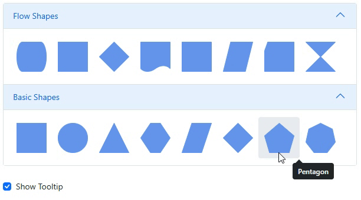

# Symbol Palette Appearance in Blazor Diagram Component

The [SymbolPalette](https://help.syncfusion.com/cr/blazor/Syncfusion.Blazor.Diagram.SymbolPalette.html) component showcases a collection of [Palettes](https://help.syncfusion.com/cr/blazor/Syncfusion.Blazor.Diagram.SymbolPalette.SfSymbolPaletteComponent.html#Syncfusion_Blazor_Diagram_SymbolPalette_SfSymbolPaletteComponent_Palettes), each containing a set of predefined nodes and connectors. This powerful feature enables users to easily drag and drop these elements into the diagram, streamlining the process of creating and modifying complex diagrams.

## How to Customize the Palette Header

Palettes can be customized with header texts and expansion controls for better organization and user experience.

The [Title](https://help.syncfusion.com/cr/blazor/Syncfusion.Blazor.Diagram.SymbolPalette.Palette.html#Syncfusion_Blazor_Diagram_SymbolPalette_Palette_Title) property allows you to set a descriptive header text for each palette, providing clear identification of its contents.

The [IsExpanded](https://help.syncfusion.com/cr/blazor/Syncfusion.Blazor.Diagram.SymbolPalette.Palette.html#Syncfusion_Blazor_Diagram_SymbolPalette_Palette_IsExpanded) property enables you to control the initial state of a palette, determining whether its items are visible (expanded) or hidden (collapsed) when the Symbol Palette is first loaded.

The [IconCss](https://help.syncfusion.com/cr/blazor/Syncfusion.Blazor.Diagram.SymbolPalette.Palette.html#Syncfusion_Blazor_Diagram_SymbolPalette_Palette_IconCss) property of the `Palette` allows you to add CSS class values to customize the appearance of icons in the palette header. By assigning CSS classes to this property, you can apply custom styling, colors, fonts, and other visual modifications to enhance the palette header icons and symbol content presentation.

The following code illustrates how to change the Title and IsExpanded properties at runtime.

```csharp
SymbolPalette.Palettes[0].Title = "NewTitle";
SymbolPalette.Palettes[0].IsExpanded = false;
SymbolPalette.Palettes[0].IconCss = "e-ddb-icons e-basic";
```
You can download a complete working sample from [GitHub](https://github.com/SyncfusionExamples/Blazor-Diagram-Examples/tree/master/UG-Samples/SymbolPalette/PaletteHeader)


## How to Customize Symbol Size

The size of individual symbols in the symbol palette can be customized. The [SymbolWidth](https://help.syncfusion.com/cr/blazor/Syncfusion.Blazor.Diagram.SymbolPalette.SfSymbolPaletteComponent.html#Syncfusion_Blazor_Diagram_SymbolPalette_SfSymbolPaletteComponent_SymbolWidth) and [SymbolHeight](https://help.syncfusion.com/cr/blazor/Syncfusion.Blazor.Diagram.SymbolPalette.SfSymbolPaletteComponent.html#Syncfusion_Blazor_Diagram_SymbolPalette_SfSymbolPaletteComponent_SymbolHeight) properties of the SfSymbolPaletteComponent allow you to define the dimensions of the symbols.

Furthermore, you have the flexibility to dynamically adjust the size of the symbols at runtime, providing a more interactive user experience.

The following code example illustrates how to change the size of a symbol and how to update the size at runtime.

```csharp
@using Syncfusion.Blazor.Diagram
@using Syncfusion.Blazor.Diagram.SymbolPalette
@using Syncfusion.Blazor.Buttons

<div class="control-section">
    <div class="properties">
        <SfButton Content="UpdateSize" OnClick="@UpdateSize" />

    </div>
    <div style="width:20%">
        <div id="palette-space" class="sb-mobile-palette" style="border: 2px solid #b200ff">
            <SfSymbolPaletteComponent @ref="@symbolpalette" Height="300px" Width="200px"
                                      Palettes="@Palettes" SymbolHeight="@symbolwidth" SymbolWidth="@symbolheight" SymbolMargin="@SymbolMargin">
            </SfSymbolPaletteComponent>
        </div>
    </div>
</div>

@code {
    //Define symbolpreview
    DiagramSize SymbolPreview;
    //Define symbolmargin
    SymbolMargin SymbolMargin = new SymbolMargin { Left = 15, Right = 15, Top = 15, Bottom = 15 };
    double symbolwidth = 60;
    double symbolheight = 60;
    //Reference the symbolpalette
    SfSymbolPaletteComponent symbolpalette;

    //Define palattes collection
    DiagramObjectCollection<Palette> Palettes = new DiagramObjectCollection<Palette>();

    // Defines palette's flow-shape collection
    DiagramObjectCollection<NodeBase> PaletteNodes = new DiagramObjectCollection<NodeBase>();

    protected override void OnInitialized()
    {
        InitPaletteModel();
    }

    private void InitPaletteModel()
    {
        Node node1 = new Node()
            {
                ID = "Rectangle",
                Shape = new BasicShape() { Type = NodeShapes.Basic, Shape = NodeBasicShapes.Rectangle },
                Style = new ShapeStyle() { Fill = "#6495ED", StrokeColor = "#6495ED" },
            };
        Node node2 = new Node()
            {
                ID = "Ellipse",
                Shape = new BasicShape() { Type = NodeShapes.Basic, Shape = NodeBasicShapes.Ellipse },
                Style = new ShapeStyle() { Fill = "#6495ED", StrokeColor = "#6495ED" },
            };
        Node node3 = new Node()
            {
                ID = "Diamond",
                Shape = new BasicShape() { Type = NodeShapes.Basic, Shape = NodeBasicShapes.Diamond },
                Style = new ShapeStyle() { Fill = "#6495ED", StrokeColor = "#6495ED" },
            };
        PaletteNodes.Add(node1);
        PaletteNodes.Add(node2);
        PaletteNodes.Add(node3);

        Palettes = new DiagramObjectCollection<Palette>()
    {
           new Palette(){Symbols =PaletteNodes,Title="Basic Shapes",ID="Basic Shapes" },
        };
    }
    //Method to update symbol width and symbol height
    private void UpdateSize()
    {
        symbolwidth = 80;
        symbolheight = 80;
    }
}
```
You can download a complete working sample from [GitHub](https://github.com/SyncfusionExamples/Blazor-Diagram-Examples/tree/master/UG-Samples/SymbolPalette/CustomSymbolSize)


The [SymbolMargin](https://help.syncfusion.com/cr/blazor/Syncfusion.Blazor.Diagram.SymbolPalette.SfSymbolPaletteComponent.html#Syncfusion_Blazor_Diagram_SymbolPalette_SfSymbolPaletteComponent_SymbolMargin) property allows you to define the space around individual symbols in the palette, outside of their defined borders. This margin creates visual separation between symbols, enhancing the overall layout and appearance of the Symbol Palette.

## How to Customize the Symbol Drag Preview

The symbol preview size of palette items can be customized using the [SymbolDragPreviewSize](https://help.syncfusion.com/cr/blazor/Syncfusion.Blazor.Diagram.SymbolPalette.SfSymbolPaletteComponent.html#Syncfusion_Blazor_Diagram_SymbolPalette_SfSymbolPaletteComponent_SymbolDiagramPreviewSize) property. This property allows you to define a uniform preview size for all symbol palette items. The [Width](https://help.syncfusion.com/cr/blazor/Syncfusion.Blazor.Diagram.SymbolPalette.SfSymbolPaletteComponent.html#Syncfusion_Blazor_Diagram_SymbolPalette_SfSymbolPaletteComponent_Width) and [Height](https://help.syncfusion.com/cr/blazor/Syncfusion.Blazor.Diagram.SymbolPalette.SfSymbolPaletteComponent.html#Syncfusion_Blazor_Diagram_SymbolPalette_SfSymbolPaletteComponent_Height) properties of SymbolDragPreviewSize enable you to specify the dimensions of the preview for each symbol in the palette.

The following code example illustrates how to change the preview size of a palette item.

```csharp
@using Syncfusion.Blazor.Diagram
@using Syncfusion.Blazor.Diagram.SymbolPalette

<div class="control-section">
    <div style="width: 100%">
        <div class="sb-mobile-palette-bar">
            <div id="palette-icon" style="float: right;" role="button" class="e-ddb-icons1 e-toggle-palette"></div>
        </div>
        <div id="palette-space" class="sb-mobile-palette">
            <SfSymbolPaletteComponent @ref="@SymbolPalette" Height="300px" Width="200px" SymbolDragPreviewSize="@symbolDragPreviewSize"
                                      Palettes="@Palettes" SymbolHeight="60" SymbolWidth="60" SymbolMargin="@SymbolMargin">
            </SfSymbolPaletteComponent>
        </div>
        <div id="diagram-space" class="sb-mobile-diagram">
            <div class="content-wrapper" style="border: 1px solid #D7D7D7">
                <SfDiagramComponent @ref="@diagram" Height="700px" Connectors="@connectors" Nodes="@nodes">
                </SfDiagramComponent>
            </div>
        </div>
    </div>
</div>

@code
{
    DiagramSize symbolDragPreviewSize;
    SymbolMargin SymbolMargin = new SymbolMargin 
    { 
        Left = 15, 
        Right = 15, 
        Top = 15, 
        Bottom = 15
     };
    SfDiagramComponent diagram;
    SfSymbolPaletteComponent SymbolPalette;
    DiagramObjectCollection<Node> nodes = new DiagramObjectCollection<Node>();
    DiagramObjectCollection<Connector> connectors = new DiagramObjectCollection<Connector>();
    //Define palettes collection.
    DiagramObjectCollection<Palette> Palettes = new DiagramObjectCollection<Palette>();
    // Defines palette's flow-shape collection.
    DiagramObjectCollection<NodeBase> PaletteNodes = new DiagramObjectCollection<NodeBase>();

    protected override void OnInitialized()
    {
        InitPaletteModel();
    }

    protected override async Task OnAfterRenderAsync(bool firstRender)
    {
        SymbolPalette.Targets = new DiagramObjectCollection<SfDiagramComponent>() { };
        SymbolPalette.Targets.Add(diagram);
    }

    private void InitPaletteModel()
    {
        symbolDragPreviewSize = new DiagramSize();
        symbolDragPreviewSize.Width = 100;
        symbolDragPreviewSize.Height = 100;
        CreatePaletteNode(NodeBasicShapes.Rectangle, "Rectangle");
        Palettes = new DiagramObjectCollection<Palette>()
        {
           new Palette(){Symbols = PaletteNodes,Title = "Basic Shapes", ID = "Basic Shapes" },
        };
    }

    private void CreatePaletteNode(NodeBasicShapes basicShape, string id)
    {
        Node node = new Node()
        {
            ID = id,
            Shape = new BasicShape() { Type = NodeShapes.Basic, Shape = basicShape },
            Style = new ShapeStyle() { Fill = "#6495ED", StrokeColor = "#6495ED" },
        };
        PaletteNodes.Add(node);
    }
}
```
You can download a complete working sample from [GitHub](https://github.com/SyncfusionExamples/Blazor-Diagram-Examples/tree/master/UG-Samples/SymbolPalette/SymbolPreview).


## How to Restrict Symbol Dragging in a Palette

The [AllowDrag](https://help.syncfusion.com/cr/blazor/Syncfusion.Blazor.Diagram.SymbolPalette.SfSymbolPaletteComponent.html#Syncfusion_Blazor_Diagram_SymbolPalette_SfSymbolPaletteComponent_AllowDrag) property of `SfSymbolPaletteComponent` enables or disables the ability to drag symbols from the palette. When set to `true`, users can drag symbols; when `false`, dragging is disabled. This property provides control over symbol interaction within the Symbol Palette component.

## How to get notification when a symbol is selected

The [SelectionChanged](https://help.syncfusion.com/cr/blazor/Syncfusion.Blazor.Diagram.SymbolPalette.SfSymbolPaletteComponent.html#Syncfusion_Blazor_Diagram_SymbolPalette_SfSymbolPaletteComponent_SelectionChanged) event of the `SfSymbolPaletteComponent` is triggered when a symbol in the symbol palette is selected or deselected. This event provides an opportunity to perform custom actions or track symbol selection changes within the palette. The `SelectionChanged` event uses [PaletteSelectionChangedEventArgs](https://help.syncfusion.com/cr/blazor/Syncfusion.Blazor.Diagram.SymbolPalette.PaletteSelectionChangedEventArgs.html) as its event argument, which provides access to both the previously selected symbol and the newly selected symbol through the following properties:

- [OldValue](https://help.syncfusion.com/cr/blazor/Syncfusion.Blazor.Diagram.SymbolPalette.PaletteSelectionChangedEventArgs.html#Syncfusion_Blazor_Diagram_SymbolPalette_PaletteSelectionChangedEventArgs_OldValue): Contains the ID of the previously selected symbol
- [NewValue](https://help.syncfusion.com/cr/blazor/Syncfusion.Blazor.Diagram.SymbolPalette.PaletteSelectionChangedEventArgs.html#Syncfusion_Blazor_Diagram_SymbolPalette_PaletteSelectionChangedEventArgs_NewValue): Contains the ID of the newly selected symbol

This allows you to track selection changes and perform specific actions based on which symbols are being selected or deselected.

The following code example illustrates how to use the selectionChanged event.

```csharp
@using Syncfusion.Blazor.Diagram
@using Syncfusion.Blazor.Diagram.SymbolPalette
@using Syncfusion.Blazor.Buttons

<div class="control-section">
    <div style="width:20%">
        <div id="palette-space" class="sb-mobile-palette" style="border: 2px solid #b200ff">
            <SfSymbolPaletteComponent @ref="@symbolpalette" Height="300px" Width="200px"
                                    Palettes="@Palettes" SymbolHeight="@symbolwidth" SymbolWidth="@symbolheight" 
                                    SymbolMargin="@SymbolMargin" SelectionChanged="SelectionChanged">
            </SfSymbolPaletteComponent>
        </div>
    </div>
</div>

@code {
    // Define symbol properties
    DiagramSize SymbolPreview;
    SymbolMargin SymbolMargin = new SymbolMargin { Left = 15, Right = 15, Top = 15, Bottom = 15 };
    double symbolwidth = 60;
    double symbolheight = 60;
    
    // Reference the symbol palette
    SfSymbolPaletteComponent symbolpalette;
    
    // Define palettes collection
    DiagramObjectCollection<Palette> Palettes = new DiagramObjectCollection<Palette>();
    DiagramObjectCollection<NodeBase> PaletteNodes = new DiagramObjectCollection<NodeBase>();

    protected override void OnInitialized()
    {
        InitPaletteModel();
    }

    private void InitPaletteModel()
    {
        Node node1 = new Node()
        {
            ID = "Rectangle",
            Shape = new BasicShape() { Type = NodeShapes.Basic, Shape = NodeBasicShapes.Rectangle },
            Style = new ShapeStyle() { Fill = "#6495ED", StrokeColor = "#6495ED" },
        };
        Node node2 = new Node()
        {
            ID = "Ellipse",
            Shape = new BasicShape() { Type = NodeShapes.Basic, Shape = NodeBasicShapes.Ellipse },
            Style = new ShapeStyle() { Fill = "#6495ED", StrokeColor = "#6495ED" },
        };
        Node node3 = new Node()
        {
            ID = "Diamond",
            Shape = new BasicShape() { Type = NodeShapes.Basic, Shape = NodeBasicShapes.Diamond },
            Style = new ShapeStyle() { Fill = "#6495ED", StrokeColor = "#6495ED" },
        };

        PaletteNodes.Add(node1);
        PaletteNodes.Add(node2);
        PaletteNodes.Add(node3);

        Palettes = new DiagramObjectCollection<Palette>()
        {
            new Palette(){Symbols = PaletteNodes, Title = "Basic Shapes", ID = "Basic Shapes" },
        };
    }

    // Handle selection changes in the symbol palette
    private void SelectionChanged(PaletteSelectionChangedEventArgs args)
    {
        // Check if Rectangle was previously selected
        if(args.OldValue.Contains("Rectangle"))
        {
            // Perform actions when Rectangle is deselected
        }
        
        // Check if Ellipse is newly selected
        if(args.NewValue.Contains("Ellipse"))
        {
            // Perform actions when Ellipse is selected
        }
        
        // You can also perform general selection tracking
        Console.WriteLine($"Selection changed from: {args.OldValue} to: {args.NewValue}");
    }
}
```
You can download a complete working sample from [GitHub](https://github.com/SyncfusionExamples/Blazor-Diagram-Examples/tree/master/UG-Samples/SymbolPalette/SelectionChanged).

## How to get notification for expanding the palette

The [Expanding](https://help.syncfusion.com/cr/blazor/Syncfusion.Blazor.Diagram.SymbolPalette.SfSymbolPaletteComponent.html#Syncfusion_Blazor_Diagram_SymbolPalette_SfSymbolPaletteComponent_Expanding) event of the `SfSymbolPaletteComponent` is triggered just before an item in the symbol palette is expanded or collapsed. This event provides an opportunity to perform custom actions or modifications before the expansion/collapse state changes.

## How to Expand Single or Multiple Palette

The [PaletteExpandMode](https://help.syncfusion.com/cr/blazor/Syncfusion.Blazor.Diagram.SymbolPalette.SfSymbolPaletteComponent.html#Syncfusion_Blazor_Diagram_SymbolPalette_SfSymbolPaletteComponent_PaletteExpandMode) property of `SfSymbolPaletteComponent` determines how multiple palettes can be expanded within the symbol palette.

* When set to `Multiple`, clicking on a collapsed palette icon expands that specific palette while preserving the state of other palettes. This allows multiple palettes to be expanded simultaneously.
* When set to `Single`, clicking on a collapsed palette icon expands that palette while automatically collapsing all other palettes. This ensures only one palette is expanded at a time.

```cshtml
<SfSymbolPaletteComponent @ref="@palette"
                           Width="80%"
                           Height="445px"
                           PaletteExpandMode="@expandMode"
                           Palettes="@palettes">
</SfSymbolPaletteComponent>
```

## How to Enable or Disable Animation in Symbol Palette

The symbol palette offers the ability to enable or disable animation when expanding and collapsing panels. This feature is controlled through the [EnableAnimation](https://help.syncfusion.com/cr/blazor/Syncfusion.Blazor.Diagram.SymbolPalette.SfSymbolPaletteComponent.html#Syncfusion_Blazor_Diagram_SymbolPalette_SfSymbolPaletteComponent_EnableAnimation) property. By default, EnableAnimation is set to true.

When animation is enabled, the following effects are applied by default:

* Expand Animation: The panel expands with a SlideDown effect.
* Collapse Animation: The panel collapses with a SlideUp effect.
* Animation Duration: The collapse animation lasts for 400 milliseconds by default. This duration determines how long it takes for a panel to fully collapse.

These default settings can be customized to enhance the user experience and match your application's visual style.

```csharp
@using Syncfusion.Blazor.Diagram
@using Syncfusion.Blazor.Diagram.SymbolPalette

<div class="control-section">   
    <div style="width: 100%">  
        <div id="palette-space" class="sb-mobile-palette" style="border: 2px solid #b200ff">
            <SfSymbolPaletteComponent @ref="@SymbolPalette" EnableAnimation=true Height="300px" Width="200px" 
                                      Palettes="@Palettes" SymbolHeight="60" SymbolWidth="120" SymbolMargin="@SymbolMargin">
            </SfSymbolPaletteComponent>
        </div>
        </div>
</div>

@code
{
    SymbolMargin SymbolMargin = new SymbolMargin 
    { 
        Left = 15, 
        Right = 15, 
        Top = 15, 
        Bottom = 15 
    };       
    SfSymbolPaletteComponent SymbolPalette;
    //Define palettes collection.
    DiagramObjectCollection<Palette> Palettes = new DiagramObjectCollection<Palette>();
    // Defines palette's flow-shape collection.
    DiagramObjectCollection<NodeBase> PaletteNodes = new DiagramObjectCollection<NodeBase>();

    protected override void OnInitialized()
    {
        InitPaletteModel();
    }
        
    private void InitPaletteModel()
    {
        CreatePaletteNode(NodeBasicShapes.Rectangle, "Rectangle");
        CreatePaletteNode(NodeBasicShapes.Ellipse, "Ellipse");
        CreatePaletteNode(NodeBasicShapes.Star, "Star");
        Palettes = new DiagramObjectCollection<Palette>()
        {
           new Palette(){Symbols = PaletteNodes,Title = "Basic Shapes", ID = "Basic Shapes" },
        };
    }
        
    private void CreatePaletteNode(NodeBasicShapes basicShape, string id)
    {
        Node node = new Node()
        {
            ID = id,
            Shape = new BasicShape() { Type = NodeShapes.Basic, Shape = basicShape },
            Style = new ShapeStyle() { Fill = "#6495ED", StrokeColor = "#6495ED" },
        };
        PaletteNodes.Add(node);
    }
}
```
You can download a complete working sample from [GitHub](https://github.com/SyncfusionExamples/Blazor-Diagram-Examples/tree/master/UG-Samples/SymbolPalette/AnimationSupport)

## How to Add Symbol Descriptions to Palette Symbols

The diagram component offers support for adding descriptive text below each symbol in the palette. This enhanced visual representation provides additional details about each symbol, improving user understanding and usability. You can customize the height and width of the symbol description individually to suit your needs. To add or modify symbol descriptions at runtime, utilize the [GetSymbolInfo](https://help.syncfusion.com/cr/blazor/Syncfusion.Blazor.Diagram.SymbolPalette.SfSymbolPaletteComponent.html#Syncfusion_Blazor_Diagram_SymbolPalette_SfSymbolPaletteComponent_GetSymbolInfo) method provided by the SfSymbolPaletteComponent.
The following code is an example to set a symbol description for symbols in the palette.

```csharp
@using Syncfusion.Blazor.Diagram
@using Syncfusion.Blazor.Diagram.SymbolPalette

<div class="control-section">   
    <div style="width: 100%">  
        <div id="palette-space" class="sb-mobile-palette" style="border: 2px solid #b200ff">
            <SfSymbolPaletteComponent @ref="@SymbolPalette" Height="300px" Width="200px" GetSymbolInfo="GetSymbolInfo"
                                      Palettes="@Palettes" SymbolHeight="60" SymbolWidth="120" SymbolMargin="@SymbolMargin">
            </SfSymbolPaletteComponent>
        </div>
        </div>
</div>

@code
{
    SymbolMargin SymbolMargin = new SymbolMargin 
    { 
        Left = 15, 
        Right = 15, 
        Top = 15, 
        Bottom = 15 
    };       
    SfSymbolPaletteComponent SymbolPalette;
    //Define palettes collection.
    DiagramObjectCollection<Palette> Palettes = new DiagramObjectCollection<Palette>();
    // Defines palette's flow-shape collection.
    DiagramObjectCollection<NodeBase> PaletteNodes = new DiagramObjectCollection<NodeBase>();

    protected override void OnInitialized()
    {
        InitPaletteModel();
    }
        
    private void InitPaletteModel()
    {
        CreatePaletteNode(NodeBasicShapes.Rectangle, "Rectangle");
        Palettes = new DiagramObjectCollection<Palette>()
        {
           new Palette(){Symbols = PaletteNodes,Title = "Basic Shapes", ID = "Basic Shapes" },
        };
    }
        
    private void CreatePaletteNode(NodeBasicShapes basicShape, string id)
    {
        Node node = new Node()
        {
            ID = id,
            Shape = new BasicShape() { Type = NodeShapes.Basic, Shape = basicShape },
            Style = new ShapeStyle() { Fill = "#6495ED", StrokeColor = "#6495ED" },
        };
        PaletteNodes.Add(node);
    }

    private SymbolInfo GetSymbolInfo(IDiagramObject symbol)
    {
        SymbolInfo SymbolInfo = new SymbolInfo();
        string text = null;
        text = (symbol as Node).ID;
        SymbolInfo.Description = new SymbolDescription() { Text = text };
        return SymbolInfo;
    }
}
```
You can download a complete working sample from [GitHub](https://github.com/SyncfusionExamples/Blazor-Diagram-Examples/tree/master/UG-Samples/SymbolPalette/SymbolDescription)


## How to Customize the Symbol Description

Customize the appearance of symbol descriptions in the symbol palette by adjusting the following properties:

### SymbolInfo Properties

[Fit](https://help.syncfusion.com/cr/blazor/Syncfusion.Blazor.Diagram.SymbolPalette.SymbolInfo.html#Syncfusion_Blazor_Diagram_SymbolPalette_SymbolInfo_Fit): Represents whether the symbol can fit into the size that is defined by the symbol palette. When set to `true`, the symbol will be resized to fit within the dimensions specified by the symbol palette; otherwise `false` maintains the symbol's original size. The default value is `false`.

[Width](https://help.syncfusion.com/cr/blazor/Syncfusion.Blazor.Diagram.SymbolPalette.SymbolInfo.html#Syncfusion_Blazor_Diagram_SymbolPalette_SymbolInfo_Width): Defines the width of the symbol in the palette. This property allows you to control the horizontal space allocated to each symbol.

[Height](https://help.syncfusion.com/cr/blazor/Syncfusion.Blazor.Diagram.SymbolPalette.SymbolInfo.html#Syncfusion_Blazor_Diagram_SymbolPalette_SymbolInfo_Height): Defines the height of the symbol in the palette. This property allows you to control the vertical space allocated to each symbol.

### SymbolDescription Properties

[Text](https://help.syncfusion.com/cr/blazor/Syncfusion.Blazor.Diagram.SymbolPalette.SymbolDescription.html#Syncfusion_Blazor_Diagram_SymbolPalette_SymbolDescription_Text): Represents the textual information to be displayed below the symbol in the palette. This is the actual content that users will see as the symbol's description.

[Margin](https://help.syncfusion.com/cr/blazor/Syncfusion.Blazor.Diagram.SymbolPalette.SymbolDescription.html#Syncfusion_Blazor_Diagram_SymbolPalette_SymbolDescription_Margin): Gets or sets the margin around the text rendered in the symbol palette. This property uses `DiagramThickness` to define spacing on all sides (Top, Bottom, Left, Right) of the description text, improving the visual layout and readability.

### TextStyle Properties

[Color](https://help.syncfusion.com/cr/blazor/Syncfusion.Blazor.Diagram.TextStyle.html#Syncfusion_Blazor_Diagram_TextStyle_Color): Defines the color of the symbol description text, enhancing readability and visual appeal.

[Fill](https://help.syncfusion.com/cr/blazor/Syncfusion.Blazor.Diagram.ShapeStyle.html#Syncfusion_Blazor_Diagram_ShapeStyle_Fill): Sets the background color of the symbol description, improving contrast and highlighting important information.

[FontSize](https://help.syncfusion.com/cr/blazor/Syncfusion.Blazor.Diagram.TextStyle.html#Syncfusion_Blazor_Diagram_TextStyle_FontSize): Adjusts the font size of the symbol description text, ensuring optimal visibility and hierarchy.

[FontFamily](https://help.syncfusion.com/cr/blazor/Syncfusion.Blazor.Diagram.TextStyle.html#Syncfusion_Blazor_Diagram_TextStyle_FontFamily): Specifies the font family of the symbol description text, maintaining consistency with your application's typography.

[Bold](https://help.syncfusion.com/cr/blazor/Syncfusion.Blazor.Diagram.TextStyle.html#Syncfusion_Blazor_Diagram_TextStyle_Bold): Toggles bold formatting for the symbol description text, emphasizing key information.

[Italic](https://help.syncfusion.com/cr/blazor/Syncfusion.Blazor.Diagram.TextStyle.html#Syncfusion_Blazor_Diagram_TextStyle_Italic): Applies italic formatting to the symbol description text, useful for creating visual distinctions.

[TextDecoration](https://help.syncfusion.com/cr/blazor/Syncfusion.Blazor.Diagram.TextStyle.html#Syncfusion_Blazor_Diagram_TextStyle_TextDecoration): Adds decorative elements to the symbol description text, such as underline or strikethrough.

[TextWrapping](https://help.syncfusion.com/cr/blazor/Syncfusion.Blazor.Diagram.TextStyle.html#Syncfusion_Blazor_Diagram_TextStyle_TextWrapping): Controls how the symbol description text wraps within its container, optimizing space utilization.

[TextOverflow](https://help.syncfusion.com/cr/blazor/Syncfusion.Blazor.Diagram.TextStyle.html#Syncfusion_Blazor_Diagram_TextStyle_TextOverflow): Defines the behavior when the symbol description text exceeds its container, ensuring all content is accessible.

By fine-tuning these properties, you can create visually appealing and user-friendly symbol descriptions that seamlessly integrate with your Blazor application's design and enhance the overall user experience.


The following code is an example to change the style of a symbol description for symbols in the palette.

```csharp
@using Syncfusion.Blazor.Diagram
@using Syncfusion.Blazor.Diagram.SymbolPalette

<div class="control-section">
    <div style="width: 30%">
        <div id="palette-space" class="sb-mobile-palette" style="border: 2px solid #b200ff; height:200px">
            <SfSymbolPaletteComponent @ref="@SymbolPalette" Height="300px" GetSymbolInfo="GetSymbolInfo"
                                      Palettes="@Palettes" SymbolHeight="60" SymbolWidth="120">
            </SfSymbolPaletteComponent>
        </div>
    </div>
</div>

@code
{
    SfSymbolPaletteComponent SymbolPalette;
    //Define palettes collection.
    DiagramObjectCollection<Palette> Palettes = new DiagramObjectCollection<Palette>();
    // Defines palette's basic-shape collection.
    DiagramObjectCollection<NodeBase> PaletteNodes = new DiagramObjectCollection<NodeBase>();

    protected override void OnInitialized()
    {
        InitPaletteModel();
    }

    private void InitPaletteModel()
    {
        CreatePaletteNode(NodeBasicShapes.Rectangle, "Rectangle");
        CreatePaletteNode(NodeBasicShapes.Ellipse, "Ellipse");
        CreatePaletteNode(NodeBasicShapes.Hexagon, "Hexagon");
        Palettes = new DiagramObjectCollection<Palette>()
        {
           new Palette(){Symbols = PaletteNodes,Title = "Basic Shapes", ID = "Basic Shapes" },
        };
    }

    private void CreatePaletteNode(NodeBasicShapes basicShape, string id)
    {
        Node node = new Node()
            {
                ID = id,
                Shape = new BasicShape() { Type = NodeShapes.Basic, Shape = basicShape },
                Style = new ShapeStyle() { Fill = "#6495ED", StrokeColor = "#6495ED" },
            };
        PaletteNodes.Add(node);
    }

    private SymbolInfo GetSymbolInfo(IDiagramObject symbol)
    {
        SymbolInfo SymbolInfo = new SymbolInfo();
        string text = string.Empty;
        text = (symbol as NodeBase).ID;
        SymbolInfo.Width = 75;
        SymbolInfo.Height = 40;
        SymbolInfo.Description = new SymbolDescription() { 
            Text = text,
            // Customize the style of the symbol description
            Style = new TextStyle() 
            { 
                Bold = true,
                Italic = true,
                Color = "red",
                Fill = "transparent",
                FontFamily = "Arial",
                FontSize = 15,
                TextDecoration = TextDecoration.Underline,
                TextOverflow = TextOverflow.Ellipsis,
                TextWrapping = TextWrap.WrapWithOverflow
            },
            Margin = new DiagramThickness(){ Top = 10, Bottom = 10 }
        };
        return SymbolInfo;
    }
}
```
You can download a complete working sample from [GitHub](https://github.com/SyncfusionExamples/Blazor-Diagram-Examples/tree/master/UG-Samples/SymbolPalette/DescriptionStyle)


## How to Provide Tooltip for Symbols in Symbol Palette

The Symbol Palette offers tooltip support, displaying informative text when the mouse hovers over any node or connector. These tooltips can be customized individually for each symbol within the palette, enhancing user experience and providing additional context for the available elements.

### How to Enable or Disable Default Tooltip for Symbols in Symbol Palette

By default, the symbol [`ID`](https://help.syncfusion.com/cr/blazor/Syncfusion.Blazor.Diagram.NodeBase.html#Syncfusion_Blazor_Diagram_NodeBase_ID) is displayed as a tooltip when hovering over a symbol in the Symbol Palette. To disable this default tooltip, you can use the [`ShowTooltip`](https://help.syncfusion.com/cr/blazor/Syncfusion.Blazor.Diagram.SymbolPalette.SymbolInfo.html#Syncfusion_Blazor_Diagram_SymbolPalette_SymbolInfo_ShowToolTip) property within the [`GetSymbolInfo`](https://help.syncfusion.com/cr/blazor/Syncfusion.Blazor.Diagram.SymbolPalette.SfSymbolPaletteComponent.html#Syncfusion_Blazor_Diagram_SymbolPalette_SfSymbolPaletteComponent_GetSymbolInfo) method. The `ShowTooltip` property is set to **true** by default, which enables the tooltip.

The following code example demonstrates how to enable or disable the default tooltip for shapes in the Symbol Palette. 

```cshtml
@using Syncfusion.Blazor.Diagram
@using Syncfusion.Blazor.Diagram.SymbolPalette
@using Syncfusion.Blazor.Popups
@using Syncfusion.Blazor.Buttons

<div style="display:flex;gap:20px;">
    <div style="width:20%">
        <div>
            <SfCheckBox @bind-Checked="ShowTooltip" Label="Show Symbol ID as Tooltip" TChecked="bool">
            </SfCheckBox>
        </div>
        <div id="palette-space" class="sb-mobile-palette" style="border: 2px solid #b200ff">
            <SfSymbolPaletteComponent @ref="symbolPalette" Height="1000px" Width="300px"GetSymbolInfo="GetSymbolInfo" Palettes="Palettes" SymbolHeight="60" 
                                      SymbolWidth="60" SymbolMargin="symbolMargin">
            </SfSymbolPaletteComponent>
        </div>
    </div>
    <div>
        <SfDiagramComponent @ref="diagram" Height="1000px" Width="1000px" />
    </div>
</div>

@code {
    // Controls tooltip visibility for symbols at runtime.
    private bool ShowTooltip = false;
    private SfSymbolPaletteComponent? symbolPalette;
    private SfDiagramComponent? diagram;
    private SymbolMargin symbolMargin = new SymbolMargin()
    {
        Left = 15,
        Right = 15,
        Top = 15,
        Bottom = 15
    };

    public DiagramObjectCollection<Palette> Palettes { get; set; } = new DiagramObjectCollection<Palette>();
    public DiagramObjectCollection<NodeBase> FlowShapesPalette { get; set; } = new DiagramObjectCollection<NodeBase>();
    public DiagramObjectCollection<NodeBase> BasicShapesPalette { get; set; } = new DiagramObjectCollection<NodeBase>();
    public DiagramObjectCollection<NodeBase> ConnectorsPalette { get; set; } = new DiagramObjectCollection<NodeBase>();

    protected override void OnInitialized()
    {
        // Initialize all palette models with predefined shapes.
        InitPaletteModel();
    }

    protected override async Task OnAfterRenderAsync(bool firstRender)
    {
        if (firstRender && symbolPalette != null && diagram != null)
        {
            // Set diagram as drag-drop target for symbol palette.
            symbolPalette.Targets = new DiagramObjectCollection<SfDiagramComponent> { diagram };
        }
    }

    // Configures symbol tooltip display based on checkbox state.
    private SymbolInfo GetSymbolInfo(IDiagramObject symbol)
    {
        // Enable/disable tooltip display based on user preference at runtime.
        return new SymbolInfo { ShowTooltip = ShowTooltip };
    }

    private void InitPaletteModel()
    {
        // Add flow shapes to palette.
        AddFlowShape(NodeFlowShapes.Terminator, "Terminator", 0);
        AddFlowShape(NodeFlowShapes.Decision, "Decision", 1);
        AddFlowShape(NodeFlowShapes.Process, "Process", 2);
        AddFlowShape(NodeFlowShapes.Document, "Document", 3);

        // Add basic shapes to palette.
        AddBasicShape(NodeBasicShapes.Rectangle, "Rectangle", 0);
        AddBasicShape(NodeBasicShapes.Ellipse, "Ellipse", 1);
        AddBasicShape(NodeBasicShapes.Pentagon, "Pentagon", 2);
        AddBasicShape(NodeBasicShapes.Hexagon, "Hexagon", 3);

        // Add connectors to palette.
        AddConnector("Orthogonal", ConnectorSegmentType.Orthogonal, DecoratorShape.Arrow, 0);
        AddConnector("Straight", ConnectorSegmentType.Straight, DecoratorShape.Arrow, 1);
        AddConnector("Bezier", ConnectorSegmentType.Bezier, DecoratorShape.Arrow, 2);
        AddConnector("StraightOpp", ConnectorSegmentType.Straight, DecoratorShape.None, 3);

        // Create palette collection with all shape categories.
        Palettes = new DiagramObjectCollection<Palette>
        {
            new Palette { Symbols = FlowShapesPalette, Title = "Flow Shapes", ID = "FlowShapes", IsExpanded = true },
            new Palette { Symbols = BasicShapesPalette, Title = "Basic Shapes", ID = "BasicShapes", IsExpanded = true },
            new Palette { Symbols = ConnectorsPalette, Title = "Connectors", ID = "Connectors", IsExpanded = true }
        };
    }

    private void AddFlowShape(NodeFlowShapes shape, string id, int index)
    {
        var node = new Node
        {
            ID = id,
            Shape = new FlowShape { Type = NodeShapes.Flow, Shape = shape },
            Width = 60,
            Height = 60,
            Style = new ShapeStyle { Fill = "#6495ED", StrokeColor = "#6495ED" },
            Constraints = NodeConstraints.Default | NodeConstraints.Tooltip
        };
        // Add tooltip for even-indexed shapes only.
        if (index % 2 == 0)
        {
            node.Tooltip = new DiagramTooltip 
            { 
                Content = $"This is {id} (Flow)", 
                ShowTipPointer = true, 
                Position = Position.RightCenter 
            };
        }  
        FlowShapesPalette.Add(node);
    }

    private void AddBasicShape(NodeBasicShapes shapeType, string id, int index)
    {
        var node = new Node
        {
            ID = id,
            Width = 60,
            Height = 60,
            Shape = new BasicShape
            {
                Type = NodeShapes.Basic,
                Shape = shapeType,
                CornerRadius = 10 // Rounded corners for visual appeal
            },
            Style = new ShapeStyle { Fill = "#9CCC65", StrokeColor = "#558B2F" },
            Constraints = NodeConstraints.Default | NodeConstraints.Tooltip
        };
        // Add tooltip for even-indexed shapes only.
        if (index % 2 == 0)
        {
            node.Tooltip = new DiagramTooltip 
            { 
                Content = $"This is {id} (Basic)", 
                ShowTipPointer = true, 
                Position = Position.RightCenter 
            };
        }
        BasicShapesPalette.Add(node);
    }

    private void AddConnector(string id, ConnectorSegmentType type, DecoratorShape decoratorShape, int index)
    {
        var connector = new Connector
        {
            ID = id,
            Type = type,
            SourcePoint = new DiagramPoint { X = 0, Y = 0 },
            TargetPoint = new DiagramPoint { X = 60, Y = 60 },
            Style = new ShapeStyle { StrokeWidth = 2, StrokeColor = "#757575" },
            TargetDecorator = new DecoratorSettings
            {
                Shape = decoratorShape,
                Style = new ShapeStyle { StrokeColor = "#757575", Fill = "#757575" }
            },
            Constraints = ConnectorConstraints.Default | ConnectorConstraints.Tooltip
        };
        // Add tooltip for even-indexed connectors only.
        if (index % 2 == 0)
        {
            connector.Tooltip = new DiagramTooltip 
            { 
                Content = $"This is {id} (Connector)", 
                Position = Position.RightCenter, 
                ShowTipPointer = true 
            };
        }
        ConnectorsPalette.Add(connector);
    }
}
```

You can download a complete working sample from [GitHub](https://github.com/SyncfusionExamples/Blazor-Diagram-Examples/tree/master/UG-Samples/SymbolPalette/ShowToolTip).



>**Note:** This `ShowToolTip` property is effective only when tooltip constraints are disabled for the symbol palette element.

### How to Provide Custom Tooltips for Symbols

You can enhance the symbol palette by providing custom tooltips for symbols. This is achieved by assigning custom tooltip content to the [Tooltip](https://help.syncfusion.com/cr/blazor/Syncfusion.Blazor.Diagram.NodeBase.html#Syncfusion_Blazor_Diagram_NodeBase_Tooltip) property of nodes and connectors. To enable these custom tooltips for symbols in the symbol palette, set the Tooltip constraints for both nodes and connectors. Once configured, these custom tooltips will be displayed when hovering over the corresponding symbols in the symbol palette, offering users more informative and context-specific details about each symbol.

The following code example illustrates how to provide the custom tooltip for nodes.

```csharp
@using Syncfusion.Blazor.Diagram
@using Syncfusion.Blazor.Diagram.SymbolPalette
@using Syncfusion.Blazor.Popups
<div class="control-section">
    <div style="width:20%">
        <div id="palette-space" class="sb-mobile-palette" style="border: 2px solid #b200ff">
            <SfSymbolPaletteComponent @ref="@SymbolPalette" Height="300px" Width="200px"
                                      Palettes="@Palettes" SymbolHeight="60" SymbolWidth="60" SymbolMargin="@SymbolMargin">
            </SfSymbolPaletteComponent>
        </div>
    </div>
</div>

@code
{
    SfSymbolPaletteComponent SymbolPalette;
    SymbolMargin SymbolMargin = new SymbolMargin
    {
        Left = 15,
        Right = 15,
        Top = 15,
        Bottom = 15
    };
    //Define palettes collection.
    DiagramObjectCollection<Palette> Palettes = new DiagramObjectCollection<Palette>();

    // Defines palette's flow-shape collection.
    DiagramObjectCollection<NodeBase> PaletteNodes = new DiagramObjectCollection<NodeBase>();

    protected override void OnInitialized()
    {
        InitPaletteModel();
    }

    private void InitPaletteModel()
    {
        CreatePaletteNode(NodeFlowShapes.Terminator, "Terminator");
        Palettes = new DiagramObjectCollection<Palette>()
        {
           new Palette(){Symbols =PaletteNodes, Title="Flow Shapes", ID="Flow Shapes" },
        };
    }
    private void CreatePaletteNode(NodeFlowShapes flowShape, string id)
    {
        Node node = new Node()
        {
            ID = id,
            Shape = new FlowShape() { Type = NodeShapes.Flow, Shape = flowShape },
            Style = new ShapeStyle() { Fill = "#6495ED", StrokeColor = "#6495ED" },
            Tooltip = new DiagramTooltip()
            {
                Content = "This is Terminator",
                Position = Position.BottomRight,
                ShowTipPointer = true
            },
            Constraints = NodeConstraints.Default | NodeConstraints.Tooltip
        };
        PaletteNodes.Add(node);
    }
}

```
You can download a complete working sample from [GitHub](https://github.com/SyncfusionExamples/Blazor-Diagram-Examples/tree/master/UG-Samples/SymbolPalette/SymbolPaletteTooltip)


## How to Provide Different Tooltip for Symbols in the Palette and Diagram Elements.

When you define custom tooltip to the symbol then same tooltip will be displayed for both symbol and dropped node in the diagram canvas. To provide different tooltip for symbols in the symbol palette and the dropped node in the diagram canvas, then DragDrop event can be utilized. The [DragDrop](https://help.syncfusion.com/cr/blazor/Syncfusion.Blazor.Diagram.SfDiagramComponent.html#Syncfusion_Blazor_Diagram_SfDiagramComponent_DragDrop) event is triggered when a symbol is dragged and dropped from the symbol palette to the drawing area. In the Drop event, you can define the new tooltip for the dropped node by assigning new tooltip content to the Tooltip property of the node. The following code snippet will demonstrate how to define two different tooltip for symbol in the symbol palette and dropped node in the diagram canvas.

```csharp
@using Syncfusion.Blazor.Diagram
@using Syncfusion.Blazor.Diagram.SymbolPalette
@using Syncfusion.Blazor.Popups
<div class="control-section">    
    <div style="width: 100%">
        <div class="sb-mobile-palette-bar">
            <div id="palette-icon" style="float: right;" role="button" class="e-ddb-icons1 e-toggle-palette"></div>
        </div>
        <div id="palette-space" class="sb-mobile-palette">
            <SfSymbolPaletteComponent @ref="@SymbolPalette" Height="700px"
                                      Palettes="@Palettes"  SymbolHeight="60" SymbolWidth="60" SymbolMargin="@SymbolMargin">
            </SfSymbolPaletteComponent>
        </div>
        <div id="diagram-space" class="sb-mobile-diagram">
            <div class="content-wrapper" style="border: 1px solid #D7D7D7">
                <SfDiagramComponent @ref="@diagram" Height="700px" Connectors="@connectors" Nodes="@nodes" DragDrop="DragDropEvent">
                </SfDiagramComponent>
            </div>
        </div>
    </div>
</div>

@code
{
    SymbolMargin SymbolMargin = new SymbolMargin 
    { 
        Left = 15, 
        Right = 15, 
        Top = 15, 
        Bottom = 15 
    };
    SfDiagramComponent diagram;
    SfSymbolPaletteComponent SymbolPalette;
    //Define nodes collection.
    DiagramObjectCollection<Node> nodes = new DiagramObjectCollection<Node>();
    //Define connectors collection.
    DiagramObjectCollection<Connector> connectors = new DiagramObjectCollection<Connector>();
    //Define palettes collection.
    DiagramObjectCollection<Palette> Palettes = new DiagramObjectCollection<Palette>();
    // Defines palette's flow-shape collection.
    DiagramObjectCollection<NodeBase> PaletteNodes = new DiagramObjectCollection<NodeBase>();
    
    protected override async Task OnAfterRenderAsync(bool firstRender)
    {
        SymbolPalette.Targets = new DiagramObjectCollection<SfDiagramComponent>() { };
        SymbolPalette.Targets.Add(diagram);
    }

    protected override void OnInitialized()
    {
        InitPaletteModel();
    }

    private void InitPaletteModel()
    {
        CreatePaletteNode(NodeFlowShapes.Terminator, "Terminator");        
        Palettes = new DiagramObjectCollection<Palette>()
        {
            new Palette(){Symbols = PaletteNodes,Title = "Flow Shapes", ID = "Flow Shapes" },
        };
    }

    private void CreatePaletteNode(NodeFlowShapes flowShape, string id)
    {
        Node node = new Node()
        {
            ID = id,
            Shape = new FlowShape() { Type = NodeShapes.Flow, Shape = flowShape },
            Style = new ShapeStyle() { Fill= "#6495ED", StrokeColor = "#6495ED" },
            Tooltip = new DiagramTooltip()
            {
                Content = "This is Terminator",
                Position = Position.RightCenter,
                ShowTipPointer = true
            },
            Constraints = NodeConstraints.Default | NodeConstraints.Tooltip        
        };
        PaletteNodes.Add(node);
    }

    private void DragDropEvent(DropEventArgs args)
    {
        if (args.Element is Node)
        {
            (args.Element as Node).Tooltip.Content = "This is diagram Tooltip";
        }
    }
}
```
You can download a complete working sample from [GitHub](https://github.com/SyncfusionExamples/Blazor-Diagram-Examples/tree/master/UG-Samples/SymbolPalette/SymbolPaletteTooltip)


### How to Provide Tooltip Template for Symbols

You can provide a custom template as a tooltip for symbols in the symbol palette using the [TooltipTemplate](https://help.syncfusion.com/cr/blazor/Syncfusion.Blazor.Diagram.SymbolPalette.SymbolPaletteTemplates.html#Syncfusion_Blazor_Diagram_SymbolPalette_SymbolPaletteTemplates_TooltipTemplate) property of the `SfDiagramComponent`. Once the tooltip template is defined, enable custom tooltips for symbols in the symbol palette by setting the Tooltip constraints for nodes and connectors. This allows the custom tooltip template to be displayed when hovering over symbols in the symbol palette, enhancing the user experience and providing more informative tooltips for each symbol.

The following code example illustrates how to provide the tooltip template for nodes.

```csharp
@using Syncfusion.Blazor.Diagram
@using Syncfusion.Blazor.Diagram.SymbolPalette

<div class="control-section">
    <div style="width:20%">
        <div id="palette-space" class="sb-mobile-palette" style="border: 2px solid #b200ff">
            <SfSymbolPaletteComponent @ref="@SymbolPalette" Height="300px" Width="200px"
                                      Palettes="@Palettes" SymbolHeight="60" SymbolWidth="60" SymbolMargin="@SymbolMargin">
               <SymbolPaletteTemplates>
                    <TooltipTemplate>
                        @{
                            if (context is Node node)
                            {
                                <div><p>Product Name : Diagram</p><p>Element: Node</p><p>Content: Node Tooltip</p><p>ID:@node.ID</p></div>

                            }
                        }
                    </TooltipTemplate>
                </SymbolPaletteTemplates>
            </SfSymbolPaletteComponent>
        </div>
    </div>
</div>

@code
{
    SfSymbolPaletteComponent SymbolPalette;

    //Define palettes collection.
    DiagramObjectCollection<Palette> Palettes = new DiagramObjectCollection<Palette>();

    // Defines palette's flow-shape collection.
    DiagramObjectCollection<NodeBase> PaletteNodes = new DiagramObjectCollection<NodeBase>();

    protected override void OnInitialized()
    {
        InitPaletteModel();
    }

    private void InitPaletteModel()
    {
        CreatePaletteNode(NodeFlowShapes.Terminator, "Terminator");
        Palettes = new DiagramObjectCollection<Palette>()
        {
           new Palette(){Symbols =PaletteNodes, Title="Flow Shapes", ID="Flow Shapes" },
        };
    }
    private void CreatePaletteNode(NodeFlowShapes flowShape, string id)
    {
        Node node = new Node()
        {
            ID = id,
            Shape = new FlowShape() { Type = NodeShapes.Flow, Shape = flowShape },
            Style = new ShapeStyle() { Fill = "#6495ED", StrokeColor = "#6495ED" },
            Tooltip = new DiagramTooltip()
            {
                Position = Position.BottomRight,
                ShowTipPointer = true
            },
            Constraints = NodeConstraints.Default | NodeConstraints.Tooltip
        };
        PaletteNodes.Add(node);
    }
}

```
You can download a complete working sample from [GitHub](https://github.com/SyncfusionExamples/Blazor-Diagram-Examples/tree/master/UG-Samples/SymbolPalette/SymbolPaletteTooltip)


>**Note:**  When the tooltip for the symbol is not initialized, the ID of the symbol will be rendered by default as the tooltip content. When the tooltip is defined, either content or template must be specified; otherwise, the tooltip will remain empty.

## How to Handle Symbol Palette Interaction

Palette interaction provides notifications for symbol entry, exit, and dragging within the diagram.

- The [DragStart](https://help.syncfusion.com/cr/blazor/Syncfusion.Blazor.Diagram.SfDiagramComponent.html#Syncfusion_Blazor_Diagram_SfDiagramComponent_DragStart) event is triggered when a symbol is initially dragged from the symbol palette into the diagram area.
- The [Dragging](https://help.syncfusion.com/cr/blazor/Syncfusion.Blazor.Diagram.SfDiagramComponent.html#Syncfusion_Blazor_Diagram_SfDiagramComponent_Dragging) event is triggered continuously as an element is being dragged over other diagram elements.
- The [DragLeave](https://help.syncfusion.com/cr/blazor/Syncfusion.Blazor.Diagram.SfDiagramComponent.html#Syncfusion_Blazor_Diagram_SfDiagramComponent_DragLeave) event is triggered when a dragged element exits the boundaries of another diagram element.

For more information about event, refer to the [Events](../events).

## How to Cancel Symbol Drop Using the Escape Key

The diagram provides support to cancel the node drop from symbol palette when the ESC key is pressed.


## How to Enable the Chunk Message

In the Blazor Diagram component, calculating the bounds of paths, text, images, and SVG data from the server to the JavaScript side using JsInterop calls is crucial. However, when processing large data sets (exceeding 32KB for a single incoming hub message) in a single JS call, connection disconnection issues can arise. To mitigate this problem, we have introduced the [EnableChunkMessages](https://help.syncfusion.com/cr/blazor/Syncfusion.Blazor.Diagram.SymbolPalette.SfSymbolPaletteComponent.html#Syncfusion_Blazor_Diagram_SymbolPalette_SfSymbolPaletteComponent_EnableChunkMessages) property in the Symbol Palette component.

This property enables the transmission of large data in smaller, manageable chunks, effectively preventing connection disconnection issues. Chunk messages facilitate the measurement of paths, images, text, and SVG data without exceeding the maximum size limit for a single incoming hub message (MaximumReceiveMessageSize of 32KB). This approach ensures smooth data transfer and processing, even for complex diagrams with substantial amounts of information.

By default, the [EnableChunkMessages](https://help.syncfusion.com/cr/blazor/Syncfusion.Blazor.Diagram.SymbolPalette.SfSymbolPaletteComponent.html#Syncfusion_Blazor_Diagram_SymbolPalette_SfSymbolPaletteComponent_EnableChunkMessages) property is set to `false`. However, for scenarios involving large data sets or complex diagram elements, it is recommended to enable this feature to enhance performance and prevent potential connection issues.

Here is an example demonstrating how to use the [EnableChunkMessages](https://help.syncfusion.com/cr/blazor/Syncfusion.Blazor.Diagram.SymbolPalette.SfSymbolPaletteComponent.html#Syncfusion_Blazor_Diagram_SymbolPalette_SfSymbolPaletteComponent_EnableChunkMessages) property:

```cshtml
@using Syncfusion.Blazor.Diagram
@using Syncfusion.Blazor.Diagram.SymbolPalette

<SfSymbolPaletteComponent Width="100%" Height="700px" EnableChunkMessages="true" Palettes="@palettes" SymbolHeight="@symbolHeight" SymbolWidth="@symbolWidth" SymbolDragPreviewSize="@symbolDragPreviewSize" />

@code{

    DiagramSize symbolDragPreviewSize;
    public DiagramObjectCollection<Palette> palettes;
    double symbolHeight = 75;
    double symbolWidth = 75;

    protected override void OnInitialized()
    {
        symbolDragPreviewSize = new DiagramSize();
        symbolDragPreviewSize.Width = 80;
        symbolDragPreviewSize.Height = 80;
        InitializeFloorPlannerPalettes();
    }

    private void InitializeFloorPlannerPalettes()
    {
        DiagramObjectCollection<NodeBase> DoorSymbols = new DiagramObjectCollection<NodeBase>();
        DiagramObjectCollection<NodeBase> DiningRoomSymbols = new DiagramObjectCollection<NodeBase>();
        DiagramObjectCollection<NodeBase> KitchenSymbols = new DiagramObjectCollection<NodeBase>();
        

        DoorSymbols = new DiagramObjectCollection<NodeBase>()
        {
            new Node()
            {
                ID = "Staircase",
                Width = 40,
                Height = 30,
                Tooltip= new DiagramTooltip()
                {
                    Content="Staircase"
                },
                Constraints = (NodeConstraints.Default | NodeConstraints.Tooltip),
                Shape = new PathShape()
                {
                    Data = "M36 1V35M36 1L25 1M36 1H48M36 35H25M36 35H48M25 35L25 1M25 35H13L13 1L25 1M48 1V35M48 1H59M48 35H59M59 1V35M59 1H71M59 35H71M71 1V35M71 1H82M71 35H82M82 1V35M82 1H94M82 35H94M94 1V35M94 1H105M94 35H105M105 1V35M105 1H117V35H105M129 1V35L1 35L1 1L129 1Z"
                }
            },
            new Node()
            {
                ID = "Staircase1",
                Width = 40,
                Height = 30,
                Tooltip= new DiagramTooltip()
                {
                    Content="Staircase1"
                },
                Constraints = (NodeConstraints.Default | NodeConstraints.Tooltip),
                Shape = new PathShape()
                {
                    Data = "M36 1V35M36 1L25 1M36 1H48M36 35H25M36 35H48M25 35L25 1M25 35H13L13 1L25 1M48 1V35M48 1H59M48 35H59M59 1V35M59 1H71M59 35H71M71 1V35M71 1H82M71 35H82M82 1V35M82 1H94M82 35H94M94 1V35M94 1H105M94 35H105M105 1V35M105 1H117V35H105M9 17.5H122M9 17.5C9 18.8807 7.88071 20 6.5 20C5.11929 20 4 18.8807 4 17.5C4 16.1193 5.11929 15 6.5 15C7.88071 15 9 16.1193 9 17.5ZM129 1V35L1 35L1 1L129 1ZM126 17.5L121.5 20.5311V14.4689L126 17.5Z"
                }
            },
            new Node()
            {
                ID = "Staircase2",
                Width = 40,
                Height = 30,
                Tooltip= new DiagramTooltip()
                {
                    Content="Staircase2"
                },
                Constraints = (NodeConstraints.Default | NodeConstraints.Tooltip),
                Shape = new PathShape()
                {
                    Data = "M1 17.4998L133 17.4998M121.177 0.869141L132.874 17.3083M121.582 34.7252L132.756 17.7252M121.5 0.999829V34.9998M109.5 0.999829V34.9998M97.5 0.999829V34.9998M85.5 0.999829V34.9998M73.5 0.999829V34.9998M61.5 0.999829V34.9998M49.5 0.999829V34.9998M37.5 0.999829V34.9998M25.5 0.999829L25.5 34.9998M13.5 0.999829L13.5 34.9998M133 0.999829V34.9998L1 34.9998L1 0.999824L133 0.999829Z"
                }
            },
            new Node()
            {
                ID = "TWall",
                Width = 45,
                Height = 30,
                Tooltip= new DiagramTooltip()
                {
                    Content="T Wall"
                },
                Constraints = (NodeConstraints.Default | NodeConstraints.Tooltip),
                Shape = new PathShape()
                {
                    Data = "M106 4.00002L206 4.00004M106 4.00002L106 104M106 4.00002L0 4"
                }
            },
            new Node()
            {
                ID = "WindowGarden",
                Width = 60,
                Height = 10,
                Tooltip= new DiagramTooltip()
                {
                    Content="Window Garden"
                },
                Constraints = (NodeConstraints.Default | NodeConstraints.Tooltip),
                Shape = new PathShape()
                {
                    Data = "M1.5 0H0V1.5V38.5H3V3H152V38.5H155V1.5V0H153.5H1.5ZM6.5 5H5V6.5V38.5H8V8H53V38.5H56V8H100V38.5H103V8H147V38.5H150V6.5V5H148.5H103H101.5H100H56H54.5H53H6.5Z"
                }
            },
            new Node()
            {
                ID = "Window1",
                Width = 50,
                Height = 5,
                Tooltip= new DiagramTooltip()
                {
                    Content="Window1"
                },
                Constraints = (NodeConstraints.Default | NodeConstraints.Tooltip),
                Shape = new PathShape()
                {
                    Data = "M22 5.5L124 5.50001M145 9L128 9V1L145 1V9ZM1 1L18 1L18 9L1 9L1 1ZM128 8L124 8V2L128 2V8ZM18 2L22 2L22 8L18 8L18 2Z"
                }
            },
            new Node()
            {
                ID = "Window2",
                Width = 50,
                Height = 5,
                Tooltip= new DiagramTooltip()
                {
                    Content="Window2"
                },
                Constraints = (NodeConstraints.Default | NodeConstraints.Tooltip),
                Shape = new PathShape()
                {
                    Data = "M22 3.5L124 3.50001M22 6.5L124 6.50001M145 9L128 9V1L145 1V9ZM1 1L18 1L18 9L1 9L1 1ZM128 8L124 8V2L128 2V8ZM18 2L22 2L22 8L18 8L18 2Z"
                }
            },
        };
        DiningRoomSymbols = new DiagramObjectCollection<NodeBase>()
        {
            new Node()
            {
                ID = "CircleStudyTable",
                Width = 27,
                Height = 27,
                Tooltip= new DiagramTooltip()
                {
                    Content="DCircle Study Table"
                },
                Constraints = (NodeConstraints.Default | NodeConstraints.Tooltip),
                Shape = new PathShape()
                {
                    Data = "M57 29C57 44.464 44.464 57 29 57C13.536 57 1 44.464 1 29C1 13.536 13.536 1 29 1C44.464 1 57 13.536 57 29Z"
                }
            },
            new Node()
            {
                ID = "CircleStudyTable1",
                Width = 27,
                Height = 27,
                Tooltip= new DiagramTooltip()
                {
                    Content="DCircle Study Table1"
                },
                Constraints = (NodeConstraints.Default | NodeConstraints.Tooltip),
                Shape = new PathShape()
                {
                    Data = "M57 29C57 44.464 44.464 57 29 57C13.536 57 1 44.464 1 29C1 13.536 13.536 1 29 1C44.464 1 57 13.536 57 29Z M6.85355 12.1464C6.19532 11.4882 5.98924 10.6873 6.11305 9.86427C6.23921 9.02567 6.71264 8.15463 7.43393 7.43333L6.72683 6.72622C5.88603 7.56702 5.28822 8.62505 5.12418 9.71551C4.9578 10.8215 5.24259 11.9497 6.14645 12.8536L6.85355 12.1464ZM7.43393 7.43333C8.15523 6.71203 9.02609 6.23877 9.8645 6.11276C10.6874 5.98909 11.4882 6.19526 12.1464 6.85355L12.8536 6.14645C11.9498 5.24265 10.8218 4.95765 9.71588 5.12387C8.62553 5.28775 7.56763 5.88542 6.72683 6.72622L7.43393 7.43333ZM51.1464 46.0224C51.8108 46.6867 52.0089 47.4472 51.888 48.217C51.7639 49.0076 51.2956 49.8383 50.5673 50.5667L51.2744 51.2738C52.1081 50.44 52.7105 49.4261 52.8759 48.3721C53.0447 47.2971 52.7513 46.213 51.8536 45.3153L51.1464 46.0224ZM50.5673 50.5667C49.837 51.2969 49.0611 51.7213 48.3324 51.8114C47.6254 51.8987 46.902 51.68 46.2203 50.9982L45.5132 51.7053C46.3935 52.5857 47.4161 52.9322 48.4551 52.8038C49.4724 52.6781 50.4425 52.1056 51.2744 51.2738L50.5673 50.5667ZM46.1646 6.95984C46.8414 6.28307 47.5752 6.07026 48.2996 6.16688C49.0457 6.2664 49.837 6.70326 50.5667 7.43296L51.2738 6.72585C50.4414 5.89345 49.4592 5.3127 48.4318 5.17566C47.3826 5.03572 46.3429 5.3674 45.4575 6.25273L46.1646 6.95984ZM50.5667 7.43296C51.3108 8.17704 51.7686 8.92759 51.889 9.62476C52.0035 10.2884 51.8245 10.9684 51.1464 11.6464L51.8536 12.3536C52.7376 11.4695 53.0497 10.4703 52.8744 9.45465C52.7049 8.47256 52.0918 7.54386 51.2738 6.72585L50.5667 7.43296ZM12.1464 51.1464C11.4882 51.8047 10.6872 52.011 9.86418 51.8873C9.0256 51.7613 8.15459 51.2881 7.43333 50.5668L6.72622 51.2739C7.56706 52.1147 8.62512 52.7124 9.7156 52.8762C10.8216 53.0424 11.9497 52.7574 12.8536 51.8536L12.1464 51.1464ZM7.43333 50.5668C6.71206 49.8455 6.23878 48.9745 6.11276 48.1359C5.98908 47.3128 6.19528 46.5118 6.85355 45.8536L6.14645 45.1464C5.24262 46.0503 4.95766 47.1784 5.12387 48.2845C5.28774 49.375 5.88539 50.4331 6.72622 51.2739L7.43333 50.5668ZM56.5 29C56.5 44.1878 44.1878 56.5 29 56.5V57.5C44.7401 57.5 57.5 44.7401 57.5 29H56.5ZM29 56.5C13.8122 56.5 1.5 44.1878 1.5 29H0.5C0.5 44.7401 13.2599 57.5 29 57.5V56.5ZM1.5 29C1.5 13.8122 13.8122 1.5 29 1.5V0.5C13.2599 0.5 0.5 13.2599 0.5 29H1.5ZM29 1.5C44.1878 1.5 56.5 13.8122 56.5 29H57.5C57.5 13.2599 44.7401 0.5 29 0.5V1.5Z"
                }
            },
            new Node()
            {
                ID = "CircleStudyTable2",
                Width = 27,
                Height = 27,
                Tooltip= new DiagramTooltip()
                {
                    Content="Circle Study Table2"
                },
                Constraints = (NodeConstraints.Default | NodeConstraints.Tooltip),
                Shape = new PathShape()
                {
                    Data = "M57 29C57 44.464 44.464 57 29 57C13.536 57 1 44.464 1 29C1 13.536 13.536 1 29 1C44.464 1 57 13.536 57 29Z  M53 29C53 42.2548 42.2548 53 29 53C15.7452 53 5 42.2548 5 29C5 15.7452 15.7452 5 29 5C42.2548 5 53 15.7452 53 29Z"
                }
            },
            new Node()
            {
                ID = "CircleStudyTable3",
                Width = 27,
                Height = 27,
                Tooltip= new DiagramTooltip()
                {
                    Content="Circle Study Table3"
                },
                Constraints = (NodeConstraints.Default | NodeConstraints.Tooltip),
                Shape = new PathShape()
                {
                    Data = "M1.00187 29.3204C0.824922 13.8575 13.2167 1.17882 28.6796 1.00187C44.1426 0.824922 56.8213 13.2167 56.9982 28.6796C57.1752 44.1426 44.7834 56.8213 29.3204 56.9982C13.8575 57.1752 1.17882 44.7834 1.00187 29.3204Z M4.00163 29.2862C3.84364 15.48 14.9077 4.15981 28.7139 4.00182C42.5201 3.84383 53.8404 14.9079 53.9984 28.7141C54.1563 42.5203 43.0923 53.8406 29.2861 53.9985C15.4798 54.1565 4.15962 43.0925 4.00163 29.2862Z M44.5585 52.7817C44.8152 53.0656 45.1557 53.2686 45.5606 53.3791C45.9655 53.4897 46.4268 53.5056 46.9183 53.426C47.4097 53.3464 47.9216 53.1729 48.4248 52.9153C48.928 52.6577 49.4125 52.3211 49.8508 51.9248C50.2891 51.5284 50.6725 51.08 50.9792 50.6051C51.2859 50.1303 51.5099 49.6383 51.6383 49.1573C51.7667 48.6763 51.797 48.2157 51.7276 47.8018C51.6581 47.3879 51.4903 47.0287 51.2336 46.7449L44.5585 52.7817Z M13.9609 52.8751C13.6983 53.1861 13.3493 53.419 12.934 53.5604C12.5186 53.7019 12.0449 53.7492 11.5399 53.6995C11.035 53.6499 10.5086 53.5043 9.99098 53.2711C9.47332 53.0379 8.97448 52.7217 8.52293 52.3405C8.07139 51.9593 7.67598 51.5205 7.35929 51.0493C7.0426 50.5781 6.81083 50.0836 6.6772 49.5942C6.54358 49.1047 6.51072 48.6298 6.58051 48.1965C6.6503 47.7633 6.82136 47.3803 7.08394 47.0692L13.9609 52.8751Z M51.1787 11.4637C51.4719 11.1448 51.6767 10.7503 51.7812 10.3026C51.8857 9.8549 51.8879 9.36283 51.7877 8.85448C51.6876 8.34613 51.4869 7.83145 51.1973 7.33983C50.9077 6.84821 50.5348 6.38928 50.0998 5.98923C49.6649 5.58919 49.1764 5.25587 48.6623 5.00831C48.1483 4.76074 47.6186 4.60378 47.1037 4.54639C46.5888 4.48899 46.0986 4.53229 45.6612 4.6738C45.2238 4.81531 44.8477 5.05227 44.5544 5.37114L51.1787 11.4637Z M6.96563 11.1862C6.7075 10.8946 6.53905 10.5288 6.46989 10.1095C6.40073 9.69022 6.43222 9.22575 6.56256 8.7426C6.6929 8.25944 6.91954 7.76707 7.22954 7.29359C7.53953 6.8201 7.92682 6.37478 8.36927 5.98305C8.81173 5.59132 9.30069 5.26085 9.80825 5.01052C10.3158 4.76018 10.832 4.59487 11.3274 4.52404C11.8228 4.4532 12.2877 4.47822 12.6955 4.59767C13.1033 4.71713 13.446 4.92867 13.7041 5.22022L6.96563 11.1862Z"
                }
            },
            new Node()
            {
                ID = "CircularTableforTwo",
                Width = 27,
                Height = 27,
                Tooltip= new DiagramTooltip()
                {
                    Content="Circular Table for Two"
                },
                Constraints = (NodeConstraints.Default | NodeConstraints.Tooltip),
                Shape = new PathShape()
                {
                    Data = "M12.7839 6.68319C12.3695 3.67862 14.704 1 17.737 1H33.4357C36.4079 1 38.7239 3.57736 38.4072 6.53267L37.5 14.7962C33 12.2962 30.4479 12.2502 25.5 12.0049C20.8774 12.1817 18.4551 13.0876 13.9551 15.0876L12.7839 6.68319Z M32 2C32 4.20914 30.2091 6 28 6L23 6C20.7909 6 19 4.20914 19 2V1L32 1V2Z M38.6314 67.656C38.8308 70.546 36.5401 73 33.6433 73H17.5439C14.579 73 12.2654 70.4347 12.5705 67.4855L13.4604 58.6325C17.7149 60.6639 20.3595 61.8118 25.5 61.9951C30.7634 61.8969 34.0464 60.4596 38.1993 58.8266L38.6314 67.656Z M19 72C19 69.7909 20.7909 68 23 68H28C30.2091 68 32 69.7909 32 72V73H19V72Z M51 37C51 50.8071 39.8071 62 26 62C12.1929 62 1 50.8071 1 37C1 23.1929 12.1929 12 26 12C39.8071 12 51 23.1929 51 37Z M48 37C48 49.1503 38.1503 59 26 59C13.8497 59 4 49.1503 4 37C4 24.8497 13.8497 15 26 15C38.1503 15 48 24.8497 48 37Z"
                }
            },
            new Node()
            {
                ID = "RectangleDiningTable",
                Width = 50,
                Height = 30,
                Tooltip= new DiagramTooltip()
                {
                    Content="Rectangle Dining Table"
                },
                Constraints = (NodeConstraints.Default | NodeConstraints.Tooltip),
                Shape = new PathShape()
                {
                    Data = "M26.5284 6.47992C26.2452 3.54248 28.5543 1 31.5053 1H47.4947C50.4457 1 52.7548 3.54248 52.4716 6.47992L51.65 15L27.35 15L26.5284 6.47992Z M46 2C46 4.20914 44.2091 6 42 6L37 6C34.7909 6 33 4.20914 33 2V1L46 1V2Z M52.4716 73.5201C52.7548 76.4575 50.4457 79 47.4947 79H31.5053C28.5543 79 26.2452 76.4575 26.5284 73.5201L27.35 65H51.65L52.4716 73.5201Z M33 78C33 75.7909 34.7909 74 37 74H42C44.2091 74 46 75.7909 46 78V79H33V78Z M73.5201 27.5284C76.4575 27.2452 79 29.5543 79 32.5053V48.4947C79 51.4457 76.4575 53.7548 73.5201 53.4716L65 52.65V28.35L73.5201 27.5284Z M78 47C75.7909 47 74 45.2091 74 43V38C74 35.7909 75.7909 34 78 34H79V47H78Z M6.47992 53.4716C3.54248 53.7548 1 51.4457 1 48.4947L1 32.5053C1 29.5543 3.54249 27.2452 6.47992 27.5284L15 28.35L15 52.65L6.47992 53.4716Z M61 15H19C16.7909 15 15 16.7909 15 19V61C15 63.2091 16.7909 65 19 65H61C63.2091 65 65 63.2091 65 61V19C65 16.7909 63.2091 15 61 15Z M2 34C4.20914 34 6 35.7909 6 38L6 43C6 45.2091 4.20914 47 2 47H1L1 34H2Z"
                }
            },
            new Node()
            {
                ID = "OblongDiningTable",
                Width = 50,
                Height = 30,
                Tooltip= new DiagramTooltip()
                {
                    Content="Oblong Dining Table"
                },
                Constraints = (NodeConstraints.Default | NodeConstraints.Tooltip),
                Shape = new PathShape()
                {
                    Data = "M25.0284 6.47992C24.7452 3.54248 27.0543 1 30.0053 1H45.9947C48.9457 1 51.2548 3.54248 50.9716 6.47992L50.15 15L25.85 15L25.0284 6.47992ZM58.0284 6.47992C57.7452 3.54248 60.0543 1 63.0053 1H78.9947C81.9457 1 84.2548 3.54248 83.9716 6.47992L83.15 15L58.85 15L58.0284 6.47992Z M84.9716 73.5201C85.2548 76.4575 82.9457 79 79.9947 79H64.0053C61.0543 79 58.7452 76.4575 59.0284 73.5201L59.85 65H84.15L84.9716 73.5201Z M51.9716 73.5201C52.2548 76.4575 49.9457 79 46.9947 79H31.0053C28.0543 79 25.7452 76.4575 26.0284 73.5201L26.85 65H51.15L51.9716 73.5201Z M6.47992 53.4716C3.54249 53.7548 1 51.4457 1 48.4947L1 32.5053C1 29.5543 3.54249 27.2452 6.47992 27.5284L15 28.35V52.65L6.47992 53.4716Z M103.52 27.5284C106.458 27.2452 109 29.5543 109 32.5053V48.4947C109 51.4457 106.458 53.7548 103.52 53.4716L95 52.65V28.35L103.52 27.5284Z M91 15H19C16.7909 15 15 16.7909 15 19V61C15 63.2091 16.7909 65 19 65H91C93.2091 65 95 63.2091 95 61V19C95 16.7909 93.2091 15 91 15Z M50.15 15V15.5H50.6041L50.6477 15.048L50.15 15ZM25.85 15L25.3523 15.048L25.3959 15.5H25.85V15ZM50.9716 6.47992L50.4739 6.43192L50.9716 6.47992ZM25.0284 6.47992L24.5307 6.52791L25.0284 6.47992ZM32 1V0.5L31.5 0.5V1H32ZM45 1H45.5V0.500001L45 0.500001V1ZM36 6V5.5V6ZM32 2L32.5 2V2H32ZM41 6V6.5V6ZM45 2H45.5H45ZM83.15 15V15.5H83.6041L83.6477 15.048L83.15 15ZM58.85 15L58.3523 15.048L58.3959 15.5H58.85V15ZM83.9716 6.47992L83.4739 6.43192L83.9716 6.47992ZM58.0284 6.47992L58.5261 6.43192L58.0284 6.47992ZM65 1V0.5L64.5 0.5V1H65ZM78 1H78.5V0.500001L78 0.500001V1ZM69 6V5.5V6ZM65 2L65.5 2V2H65ZM74 6V6.5V6ZM78 2H78.5H78ZM59.85 65V64.5H59.3959L59.3523 64.952L59.85 65ZM84.15 65L84.6477 64.952L84.6041 64.5H84.15V65ZM59.0284 73.5201L59.5261 73.5681L59.0284 73.5201ZM84.9716 73.5201L84.4739 73.5681L84.9716 73.5201ZM78 79V79.5H78.5V79H78ZM65 79H64.5V79.5H65V79ZM74 74V73.5V74ZM78 78H77.5H78ZM69 74V74.5V74ZM65 78H64.5H65ZM26.85 65V64.5H26.3959L26.3523 64.952L26.85 65ZM51.15 65L51.6477 64.952L51.6041 64.5H51.15V65ZM26.0284 73.5201L26.5261 73.5681L26.0284 73.5201ZM51.9716 73.5201L51.4739 73.5681L51.9716 73.5201ZM15 28.35H15.5V27.8959L15.048 27.8523L15 28.35ZM15 52.65L15.048 53.1477L15.5 53.1041V52.65H15ZM1 32.5053H0.500002H1ZM6.47992 27.5284L6.43193 28.0261L6.47992 27.5284ZM1 48.4947H1.5H1ZM6.47992 53.4716L6.43192 52.9739L6.47992 53.4716ZM45 79V79.5H45.5V79H45ZM32 79H31.5V79.5H32V79ZM41 74V73.5V74ZM45 78H44.5H45ZM36 74V74.5V74ZM32 78H31.5H32ZM1 47H0.5L0.5 47.5H1V47ZM1 34V33.5H0.500002L0.500002 34H1ZM6 43H6.5H6ZM2 47L2 46.5H2V47ZM6 38H5.5H6ZM2 34V33.5V34ZM95 52.65H94.5V53.1041L94.952 53.1477L95 52.65ZM95 28.35L94.952 27.8523L94.5 27.8959V28.35H95ZM109 48.4947H109.5H109ZM103.52 53.4716L103.472 53.9693L103.52 53.4716ZM109 32.5053H108.5H109ZM103.52 27.5284L103.568 28.0261L103.52 27.5284ZM109 34H109.5V33.5H109V34ZM109 47V47.5H109.5V47H109ZM104 38H103.5H104ZM108 34V34.5V34ZM104 43H104.5H104ZM108 47V47.5V47ZM30.0053 1.5H45.9947V0.5H30.0053V1.5ZM50.4739 6.43192L49.6523 14.952L50.6477 15.048L51.4693 6.52791L50.4739 6.43192ZM50.15 14.5L25.85 14.5V15.5L50.15 15.5V14.5ZM26.3477 14.952L25.5261 6.43192L24.5307 6.52791L25.3523 15.048L26.3477 14.952ZM45.9947 1.5C48.6506 1.5 50.7288 3.78824 50.4739 6.43192L51.4693 6.52791C51.7808 3.29673 49.2408 0.5 45.9947 0.5V1.5ZM30.0053 0.5C26.7592 0.5 24.2192 3.29673 24.5307 6.52791L25.5261 6.43192C25.2712 3.78824 27.3494 1.5 30.0053 1.5V0.5ZM41 5.5L36 5.5V6.5L41 6.5V5.5ZM32.5 2V1H31.5V2H32.5ZM32 1.5L45 1.5V0.500001L32 0.5V1.5ZM44.5 1V2H45.5V1H44.5ZM36 5.5C34.067 5.5 32.5 3.933 32.5 2L31.5 2C31.5 4.48528 33.5147 6.5 36 6.5V5.5ZM41 6.5C43.4853 6.5 45.5 4.48528 45.5 2H44.5C44.5 3.933 42.933 5.5 41 5.5V6.5ZM63.0053 1.5H78.9947V0.5H63.0053V1.5ZM83.4739 6.43192L82.6523 14.952L83.6477 15.048L84.4693 6.52791L83.4739 6.43192ZM83.15 14.5L58.85 14.5V15.5L83.15 15.5V14.5ZM59.3477 14.952L58.5261 6.43192L57.5307 6.52791L58.3523 15.048L59.3477 14.952ZM78.9947 1.5C81.6506 1.5 83.7288 3.78824 83.4739 6.43192L84.4693 6.52791C84.7809 3.29673 82.2408 0.5 78.9947 0.5V1.5ZM63.0053 0.5C59.7592 0.5 57.2192 3.29673 57.5307 6.52791L58.5261 6.43192C58.2712 3.78824 60.3494 1.5 63.0053 1.5V0.5ZM74 5.5L69 5.5V6.5L74 6.5V5.5ZM65.5 2V1H64.5V2H65.5ZM65 1.5L78 1.5V0.500001L65 0.5V1.5ZM77.5 1V2H78.5V1H77.5ZM69 5.5C67.067 5.5 65.5 3.933 65.5 2L64.5 2C64.5 4.48528 66.5147 6.5 69 6.5V5.5ZM74 6.5C76.4853 6.5 78.5 4.48528 78.5 2H77.5C77.5 3.933 75.933 5.5 74 5.5V6.5ZM79.9947 78.5H64.0053V79.5H79.9947V78.5ZM59.5261 73.5681L60.3477 65.048L59.3523 64.952L58.5307 73.4721L59.5261 73.5681ZM59.85 65.5H84.15V64.5H59.85V65.5ZM83.6523 65.048L84.4739 73.5681L85.4693 73.4721L84.6477 64.952L83.6523 65.048ZM64.0053 78.5C61.3494 78.5 59.2712 76.2118 59.5261 73.5681L58.5307 73.4721C58.2192 76.7033 60.7592 79.5 64.0053 79.5V78.5ZM79.9947 79.5C83.2408 79.5 85.7809 76.7033 85.4693 73.4721L84.4739 73.5681C84.7288 76.2118 82.6506 78.5 79.9947 78.5V79.5ZM69 74.5H74V73.5H69V74.5ZM77.5 78V79H78.5V78H77.5ZM78 78.5H65V79.5H78V78.5ZM65.5 79V78H64.5V79H65.5ZM74 74.5C75.933 74.5 77.5 76.067 77.5 78H78.5C78.5 75.5147 76.4853 73.5 74 73.5V74.5ZM69 73.5C66.5147 73.5 64.5 75.5147 64.5 78H65.5C65.5 76.067 67.067 74.5 69 74.5V73.5ZM46.9947 78.5H31.0053V79.5H46.9947V78.5ZM26.5261 73.5681L27.3477 65.048L26.3523 64.952L25.5307 73.4721L26.5261 73.5681ZM26.85 65.5H51.15V64.5H26.85V65.5ZM50.6523 65.048L51.4739 73.5681L52.4693 73.4721L51.6477 64.952L50.6523 65.048ZM31.0053 78.5C28.3494 78.5 26.2712 76.2118 26.5261 73.5681L25.5307 73.4721C25.2192 76.7033 27.7592 79.5 31.0053 79.5V78.5ZM46.9947 79.5C50.2408 79.5 52.7808 76.7033 52.4693 73.4721L51.4739 73.5681C51.7288 76.2118 49.6506 78.5 46.9947 78.5V79.5ZM1.5 48.4947L1.5 32.5053H0.500002L0.500001 48.4947H1.5ZM6.43193 28.0261L14.952 28.8477L15.048 27.8523L6.52791 27.0307L6.43193 28.0261ZM14.5 28.35V52.65H15.5V28.35H14.5ZM14.952 52.1523L6.43192 52.9739L6.52791 53.9693L15.048 53.1477L14.952 52.1523ZM1.5 32.5053C1.5 29.8494 3.78824 27.7712 6.43193 28.0261L6.52791 27.0307C3.29674 26.7192 0.500002 29.2592 0.500002 32.5053H1.5ZM0.500001 48.4947C0.500001 51.7408 3.29673 54.2808 6.52791 53.9693L6.43192 52.9739C3.78824 53.2288 1.5 51.1506 1.5 48.4947H0.500001ZM36 74.5H41V73.5H36V74.5ZM44.5 78V79H45.5V78H44.5ZM45 78.5H32V79.5H45V78.5ZM32.5 79V78H31.5V79H32.5ZM41 74.5C42.933 74.5 44.5 76.067 44.5 78H45.5C45.5 75.5147 43.4853 73.5 41 73.5V74.5ZM36 73.5C33.5147 73.5 31.5 75.5147 31.5 78H32.5C32.5 76.067 34.067 74.5 36 74.5V73.5ZM5.5 38L5.5 43H6.5L6.5 38H5.5ZM2 46.5H1V47.5H2V46.5ZM1.5 47L1.5 34H0.500002L0.5 47H1.5ZM1 34.5H2V33.5H1V34.5ZM5.5 43C5.5 44.933 3.933 46.5 2 46.5L2 47.5C4.48528 47.5 6.5 45.4853 6.5 43H5.5ZM6.5 38C6.5 35.5147 4.48528 33.5 2 33.5L2 34.5C3.933 34.5 5.5 36.067 5.5 38H6.5ZM108.5 32.5053V48.4947H109.5V32.5053H108.5ZM103.568 52.9739L95.048 52.1523L94.952 53.1477L103.472 53.9693L103.568 52.9739ZM95.5 52.65V28.35H94.5V52.65H95.5ZM95.048 28.8477L103.568 28.0261L103.472 27.0307L94.952 27.8523L95.048 28.8477ZM108.5 48.4947C108.5 51.1506 106.212 53.2288 103.568 52.9739L103.472 53.9693C106.703 54.2808 109.5 51.7408 109.5 48.4947H108.5ZM109.5 32.5053C109.5 29.2592 106.703 26.7192 103.472 27.0307L103.568 28.0261C106.212 27.7712 108.5 29.8494 108.5 32.5053H109.5ZM104.5 43V38H103.5V43H104.5ZM108 34.5H109V33.5H108V34.5ZM108.5 34V47H109.5V34H108.5ZM109 46.5H108V47.5H109V46.5ZM104.5 38C104.5 36.067 106.067 34.5 108 34.5V33.5C105.515 33.5 103.5 35.5147 103.5 38H104.5ZM103.5 43C103.5 45.4853 105.515 47.5 108 47.5V46.5C106.067 46.5 104.5 44.933 104.5 43H103.5ZM19 15.5H91V14.5H19V15.5ZM94.5 19V61H95.5V19H94.5ZM91 64.5H19V65.5H91V64.5ZM15.5 61V19H14.5V61H15.5ZM19 64.5C17.067 64.5 15.5 62.933 15.5 61H14.5C14.5 63.4853 16.5147 65.5 19 65.5V64.5ZM94.5 61C94.5 62.933 92.933 64.5 91 64.5V65.5C93.4853 65.5 95.5 63.4853 95.5 61H94.5ZM91 15.5C92.933 15.5 94.5 17.067 94.5 19H95.5C95.5 16.5147 93.4853 14.5 91 14.5V15.5ZM19 14.5C16.5147 14.5 14.5 16.5147 14.5 19H15.5C15.5 17.067 17.067 15.5 19 15.5V14.5Z"
                }
            },
            new Node()
            {
                ID = "OvalDiningTable",
                Width = 50,
                Height = 30,
                Tooltip= new DiagramTooltip()
                {
                    Content="Oval Dining Table"
                },
                Constraints = (NodeConstraints.Default | NodeConstraints.Tooltip),
                Shape = new PathShape()
                {
                    Data = "M22.0284 6.47992C21.7452 3.54248 24.0543 1 27.0053 1H42.9947C45.9457 1 48.2548 3.54248 47.9716 6.47992L47.5 11C47.5 11 35.2044 11.2442 32.7044 11.3676C29.5 11.5 22.85 15 22.85 15L22.0284 6.47992Z M42 2C42 4.20914 40.2091 6 38 6L33 6C30.7909 6 29 4.20914 29 2V1L42 1V2Z M55.0284 6.47992C54.7452 3.54248 57.0543 1 60.0053 1H75.9947C78.9457 1 81.2548 3.54248 80.9716 6.47992L80.2454 14.7933C76.3282 11.875 70.5 11.2431 68.6396 11.0529L55.5 11L55.0284 6.47992Z M75 2C75 4.20914 73.2091 6 71 6L66 6C63.7909 6 62 4.20914 62 2V1L75 1V2Z M81.9716 65.5201C82.2548 68.4575 79.9457 71 76.9947 71H61.0053C58.0543 71 55.7452 68.4575 56.0284 65.5201L57 61L67.5 60.9951C73.0289 60.6225 76.0202 59.7634 81.15 57L81.9716 65.5201Z M62 70C62 67.7909 63.7909 66 66 66H71C73.2091 66 75 67.7909 75 70V71H62V70Z M48.9716 65.5201C49.2548 68.4575 46.9457 71 43.9947 71H28.0053C25.0543 71 22.7452 68.4575 23.0284 65.5201L24 57.3584C24 57.3584 29 60.5 36.3178 60.9909L48.5 61L48.9716 65.5201Z M6.47992 49.4716C3.54249 49.7548 1 47.4457 1 44.4947L1 28.5053C1 25.5543 3.54249 23.2452 6.47992 23.5284L15 24C15 24 12 29.5 12.0148 36.8689C12 42 15.3446 48.5 15.3446 48.5L6.47992 49.4716Z M29 70C29 67.7909 30.7909 66 33 66H38C40.2091 66 42 67.7909 42 70V71H29V70Z M2 30C4.20914 30 6 31.7909 6 34L6 39C6 41.2091 4.20914 43 2 43H1L1 30H2Z M97.5201 23.5284C100.458 23.2452 103 25.5543 103 28.5053V44.4947C103 47.4457 100.458 49.7548 97.5201 49.4716L89 48.65C89 48.65 92 42.5 91.9951 36.5C92 30 89.1049 24.3114 89.1049 24.3114L97.5201 23.5284Z M102 43C99.7909 43 98 41.2091 98 39V34C98 31.7909 99.7909 30 102 30H103V43H102Z M67 11H37C23.1929 11 12 22.1929 12 36C12 49.8071 23.1929 61 37 61H67C80.8071 61 92 49.8071 92 36C92 22.1929 80.8071 11 67 11Z"
                }
            },
            new Node()
            {
                ID = "CircleDiningTable",
                Width = 30,
                Height = 30,
                Tooltip= new DiagramTooltip()
                {
                    Content="Circle Dining Table"
                },
                Constraints = (NodeConstraints.Default | NodeConstraints.Tooltip),
                Shape = new PathShape()
                {
                    Data = "M36.5 12C41 12 48 14.5 48 14.5L48.8831 6.55216C49.2122 3.59033 46.8937 1 43.9137 1H28.9858C26.0418 1 23.735 3.5309 24.0072 6.46229L24.8 15C24.8 15 29.5 12 36.5 12ZM36.5 12C22.6929 12 11.5 23.1929 11.5 37C11.5 50.8071 22.6929 62 36.5 62C50.3071 62 61.5 50.8071 61.5 37C61.5 23.1929 50.3071 12 36.5 12ZM30.5 1V2C30.5 4.20914 32.2909 6 34.5 6L38.5 6C40.7091 6 42.5 4.20914 42.5 2V1L30.5 1ZM25 59.5L24.1169 67.4478C23.7878 70.4097 26.1063 73 29.0863 73H44.1301C47.0318 73 49.3242 70.5381 49.1174 67.6438L48.5 59C48.5 59 43 62 36 62C31.5 62 25 59.5 25 59.5ZM42.5 73V72C42.5 69.7909 40.7091 68 38.5 68H34.5C32.2909 68 30.5 69.7909 30.5 72V73H42.5ZM59 25.5L66.9478 24.6169C69.9097 24.2878 72.5 26.6063 72.5 29.5863V45.4357C72.5 48.4079 69.9226 50.7239 66.9673 50.4072L58.5 49.5C58.5 49.5 61.5 43.5 61.5 37.5C61.5 29 59 25.5 59 25.5ZM72.5 44H71.5C69.2909 44 67.5 42.2091 67.5 40V35C67.5 32.7909 69.2909 31 71.5 31H72.5V44ZM14 25.5L6.57312 24.6431C3.60432 24.3005 1 26.6216 1 29.6101L1 45.4137C1 48.3937 3.59033 50.7122 6.55216 50.3831L14.5 49.5C14.5 49.5 11.5 44.5 11.5 37.5C11.5 30.5 14 25.5 14 25.5ZM1 44H2C4.20914 44 6 42.2091 6 40L6 35C6 32.7909 4.20914 31 2 31H1L1 44Z"
                }
            },
            new Node()
            {
                ID = "RectangleStudyTable",
                Width = 35,
                Height = 22,
                Tooltip= new DiagramTooltip()
                {
                    Content="Rectangle Study Table"
                },
                Constraints = (NodeConstraints.Default | NodeConstraints.Tooltip),
                Shape = new PathShape()
                {
                    Data = "M79 1H3C1.89543 1 1 1.89543 1 3V49C1 50.1046 1.89543 51 3 51H79C80.1046 51 81 50.1046 81 49V3C81 1.89543 80.1046 1 79 1Z"
                }
            },
            new Node()
            {
                ID = "RectangleStudyTable1",
                Width = 35,
                Height = 22,
                Tooltip= new DiagramTooltip()
                {
                    Content="Rectangle Study Table1"
                },
                Constraints = (NodeConstraints.Default | NodeConstraints.Tooltip),
                Shape = new PathShape()
                {
                    Data = "M4 5C4 4.44772 4.44772 4 5 4H83C83.5523 4 84 4.44772 84 5V53C84 53.5523 83.5523 54 83 54H5C4.44772 54 4 53.5523 4 53V5Z M4 6.5C4 6.77614 3.77462 7.00425 3.50231 6.95843C3.08607 6.88841 2.68736 6.73099 2.33329 6.49441C1.83994 6.16477 1.45543 5.69623 1.22836 5.14805C1.0013 4.59987 0.94189 3.99667 1.05765 3.41473C1.1734 2.83279 1.45912 2.29824 1.87868 1.87868C2.29824 1.45912 2.83279 1.1734 3.41473 1.05765C3.99667 0.94189 4.59987 1.0013 5.14805 1.22836C5.69623 1.45543 6.16477 1.83994 6.49441 2.33329C6.73099 2.68736 6.88841 3.08607 6.95843 3.50231C7.00424 3.77462 6.77614 4 6.5 4L4.5 4C4.22386 4 4 4.22386 4 4.5L4 6.5Z M81.5 4C81.2239 4 80.9958 3.77462 81.0416 3.50231C81.1116 3.08607 81.269 2.68736 81.5056 2.33329C81.8352 1.83994 82.3038 1.45543 82.852 1.22836C83.4001 1.0013 84.0033 0.94189 84.5853 1.05765C85.1672 1.1734 85.7018 1.45912 86.1213 1.87868C86.5409 2.29824 86.8266 2.83279 86.9424 3.41473C87.0581 3.99667 86.9987 4.59987 86.7716 5.14805C86.5446 5.69623 86.1601 6.16477 85.6667 6.49441C85.3126 6.73099 84.9139 6.88841 84.4977 6.95843C84.2254 7.00424 84 6.77614 84 6.5V4.5C84 4.22386 83.7761 4 83.5 4L81.5 4Z M6.5 54C6.77614 54 7.00425 54.2254 6.95843 54.4977C6.88841 54.9139 6.73099 55.3126 6.49441 55.6667C6.16477 56.1601 5.69623 56.5446 5.14805 56.7716C4.59987 56.9987 3.99667 57.0581 3.41473 56.9424C2.83279 56.8266 2.29824 56.5409 1.87868 56.1213C1.45912 55.7018 1.1734 55.1672 1.05765 54.5853C0.94189 54.0033 1.0013 53.4001 1.22836 52.852C1.45543 52.3038 1.83994 51.8352 2.33329 51.5056C2.68736 51.269 3.08607 51.1116 3.50231 51.0416C3.77462 50.9958 4 51.2239 4 51.5V53.5C4 53.7761 4.22386 54 4.5 54H6.5Z M84 51.5C84 51.2239 84.2254 50.9958 84.4977 51.0416C84.9139 51.1116 85.3126 51.269 85.6667 51.5056C86.1601 51.8352 86.5446 52.3038 86.7716 52.852C86.9987 53.4001 87.0581 54.0033 86.9424 54.5853C86.8266 55.1672 86.5409 55.7018 86.1213 56.1213C85.7018 56.5409 85.1672 56.8266 84.5853 56.9424C84.0033 57.0581 83.4001 56.9987 82.852 56.7716C82.3038 56.5446 81.8352 56.1601 81.5056 55.6667C81.269 55.3126 81.1116 54.9139 81.0416 54.4977C80.9958 54.2254 81.2239 54 81.5 54H83.5C83.7761 54 84 53.7761 84 53.5V51.5Z"
                }
            },
            new Node()
            {
                ID = "RectangleStudyTable1",
                Width = 26,
                Height = 30,
                Tooltip= new DiagramTooltip()
                {
                    Content="Rectangle Study Table1"
                },
                Constraints = (NodeConstraints.Default | NodeConstraints.Tooltip),
                Shape = new PathShape()
                {
                    Data = "M12.5284 6.47992C12.2452 3.54248 14.5543 1 17.5053 1H33.4947C36.4457 1 38.7548 3.54248 38.4716 6.47992L37.65 15L13.35 15L12.5284 6.47992Z M38.4716 73.5201C38.7548 76.4575 36.4457 79 33.4947 79H17.5053C14.5543 79 12.2452 76.4575 12.5284 73.5201L13.35 65H37.65L38.4716 73.5201Z M47 15H5C2.79086 15 1 16.7909 1 19V61C1 63.2091 2.79086 65 5 65H47C49.2091 65 51 63.2091 51 61V19C51 16.7909 49.2091 15 47 15Z M37.65 15V15.5H38.1041L38.1477 15.048L37.65 15ZM13.35 15L12.8523 15.048L12.8959 15.5H13.35V15ZM38.4716 6.47992L37.9739 6.43192L38.4716 6.47992ZM12.5284 6.47992L13.0261 6.43192L12.5284 6.47992ZM19 1V0.5L18.5 0.5V1H19ZM32 1H32.5V0.500001L32 0.500001V1ZM23 6V5.5V6ZM19 2L19.5 2V2H19ZM28 6V6.5V6ZM32 2H32.5H32ZM13.35 65V64.5H12.8959L12.8523 64.952L13.35 65ZM37.65 65L38.1477 64.952L38.1041 64.5H37.65V65ZM17.5053 79V79.5V79ZM12.5284 73.5201L13.0261 73.5681L12.5284 73.5201ZM33.4947 79V78.5V79ZM38.4716 73.5201L37.9739 73.5681L38.4716 73.5201ZM32 79V79.5H32.5V79H32ZM19 79H18.5V79.5H19V79ZM19 78H19.5H19ZM17.5053 1.5H33.4947V0.5H17.5053V1.5ZM37.9739 6.43192L37.1523 14.952L38.1477 15.048L38.9693 6.52791L37.9739 6.43192ZM37.65 14.5L13.35 14.5V15.5L37.65 15.5V14.5ZM13.8477 14.952L13.0261 6.43192L12.0307 6.52791L12.8523 15.048L13.8477 14.952ZM33.4947 1.5C36.1506 1.5 38.2288 3.78824 37.9739 6.43192L38.9693 6.52791C39.2808 3.29673 36.7408 0.5 33.4947 0.5V1.5ZM17.5053 0.5C14.2592 0.5 11.7192 3.29673 12.0307 6.52791L13.0261 6.43192C12.7712 3.78824 14.8494 1.5 17.5053 1.5V0.5ZM28 5.5L23 5.5V6.5L28 6.5V5.5ZM19.5 2V1H18.5V2H19.5ZM19 1.5L32 1.5V0.500001L19 0.5V1.5ZM31.5 1V2H32.5V1H31.5ZM23 5.5C21.067 5.5 19.5 3.933 19.5 2L18.5 2C18.5 4.48528 20.5147 6.5 23 6.5V5.5ZM28 6.5C30.4853 6.5 32.5 4.48528 32.5 2H31.5C31.5 3.933 29.933 5.5 28 5.5V6.5ZM33.4947 78.5H17.5053V79.5H33.4947V78.5ZM13.0261 73.5681L13.8477 65.048L12.8523 64.952L12.0307 73.4721L13.0261 73.5681ZM13.35 65.5H37.65V64.5H13.35V65.5ZM37.1523 65.048L37.9739 73.5681L38.9693 73.4721L38.1477 64.952L37.1523 65.048ZM17.5053 78.5C14.8494 78.5 12.7712 76.2118 13.0261 73.5681L12.0307 73.4721C11.7192 76.7033 14.2592 79.5 17.5053 79.5V78.5ZM33.4947 79.5C36.7408 79.5 39.2808 76.7033 38.9693 73.4721L37.9739 73.5681C38.2288 76.2118 36.1506 78.5 33.4947 78.5V79.5ZM23 74.5H28V73.5H23V74.5ZM31.5 78V79H32.5V78H31.5ZM32 78.5H19V79.5H32V78.5ZM19.5 79V78H18.5V79H19.5ZM28 74.5C29.933 74.5 31.5 76.067 31.5 78H32.5C32.5 75.5147 30.4853 73.5 28 73.5V74.5ZM23 73.5C20.5147 73.5 18.5 75.5147 18.5 78H19.5C19.5 76.067 21.067 74.5 23 74.5V73.5ZM5 15.5H47V14.5H5V15.5ZM50.5 19V61H51.5V19H50.5ZM47 64.5H5V65.5H47V64.5ZM1.5 61V19H0.5V61H1.5ZM5 64.5C3.067 64.5 1.5 62.933 1.5 61H0.5C0.5 63.4853 2.51472 65.5 5 65.5V64.5ZM50.5 61C50.5 62.933 48.933 64.5 47 64.5V65.5C49.4853 65.5 51.5 63.4853 51.5 61H50.5ZM47 15.5C48.933 15.5 50.5 17.067 50.5 19H51.5C51.5 16.5147 49.4853 14.5 47 14.5V15.5ZM5 14.5C2.51472 14.5 0.5 16.5147 0.5 19H1.5C1.5 17.067 3.067 15.5 5 15.5V14.5Z"
                }
            },
        };
        KitchenSymbols = new DiagramObjectCollection<NodeBase>()
        {
            new Node()
            {
                ID = "SmallGasRange",
                Width = 50,
                Height = 25,
                Tooltip= new DiagramTooltip()
                {
                    Content="mall Gas Range"
                },
                Constraints = (NodeConstraints.Default | NodeConstraints.Tooltip),
                Shape = new PathShape()
                {
                    Data = "M67.5828 1.96454C67.5828 1.43184 67.151 1 66.6183 1L1.96405 1.00001C1.43135 1.00001 0.999512 1.43184 0.999512 1.96454L0.999515 34.0355C0.999515 34.5682 1.43135 35 1.96405 35L66.6183 35C67.151 35 67.5828 34.5682 67.5828 34.0355V1.96454Z M33.5828 4.79852C33.5828 4.26582 33.151 3.83398 32.6183 3.83398L4.79737 3.83399C4.26467 3.83399 3.83283 4.26583 3.83283 4.79853L3.83284 31.2028C3.83284 31.7355 4.26468 32.1673 4.79738 32.1673L32.6183 32.1673C33.151 32.1673 33.5828 31.7355 33.5828 31.2028L33.5828 4.79852Z M64.7488 4.79852C64.7488 4.26582 64.317 3.83398 63.7843 3.83398L35.9634 3.83399C35.4307 3.83399 34.9988 4.26583 34.9988 4.79853L34.9989 31.2028C34.9989 31.7355 35.4307 32.1673 35.9634 32.1673L63.7843 32.1673C64.317 32.1673 64.7489 31.7355 64.7489 31.2028L64.7488 4.79852Z M26.4988 18C26.4988 22.6944 22.6933 26.5 17.9988 26.5C13.3044 26.5 9.49885 22.6944 9.49885 18C9.49885 13.3056 13.3044 9.5 17.9988 9.5C22.6933 9.5 26.4988 13.3056 26.4988 18Z M25.4363 18C25.4363 22.1076 22.1065 25.4375 17.9988 25.4375C13.8912 25.4375 10.5613 22.1076 10.5613 18C10.5613 13.8924 13.8912 10.5625 17.9988 10.5625C22.1065 10.5625 25.4363 13.8924 25.4363 18Z M25.0574 24.6826L24.6818 25.0583L22.0015 22.378L22.3772 22.0024L25.0574 24.6826Z M13.9442 13.5703L13.5685 13.946L10.888 11.2655L11.2637 10.8898L13.9442 13.5703Z M24.786 11.0938L25.1616 11.4694L22.4813 14.1497L22.1057 13.774L24.786 11.0938Z M13.7733 21.9844L14.1489 22.36L11.4686 25.0403L11.093 24.6646L13.7733 21.9844Z M21.452 18C21.452 19.9071 19.906 21.4531 17.9988 21.4531C16.0917 21.4531 14.5457 19.9071 14.5457 18C14.5457 16.0929 16.0917 14.5469 17.9988 14.5469C19.906 14.5469 21.452 16.0929 21.452 18Z M57.6658 18C57.6658 22.6944 53.8603 26.5 49.1658 26.5C44.4714 26.5 40.6658 22.6944 40.6658 18C40.6658 13.3056 44.4714 9.5 49.1658 9.5C53.8603 9.5 57.6658 13.3056 57.6658 18Z M56.6033 18C56.6033 22.1076 53.2735 25.4375 49.1658 25.4375C45.0582 25.4375 41.7283 22.1076 41.7283 18C41.7283 13.8924 45.0582 10.5625 49.1658 10.5625C53.2735 10.5625 56.6033 13.8924 56.6033 18Z M56.2235 24.6826L55.8478 25.0583L53.1675 22.378L53.5432 22.0024L56.2235 24.6826Z M45.1121 13.5703L44.7365 13.946L42.056 11.2655L42.4317 10.8898L45.1121 13.5703Z M55.952 11.0938L56.3276 11.4694L53.6474 14.1497L53.2717 13.774L55.952 11.0938Z M44.9403 21.9844L45.3159 22.36L42.6356 25.0403L42.26 24.6646L44.9403 21.9844Z M52.619 18C52.619 19.9071 51.0729 21.4531 49.1658 21.4531C47.2587 21.4531 45.7127 19.9071 45.7127 18C45.7127 16.0929 47.2587 14.5469 49.1658 14.5469C51.0729 14.5469 52.619 16.0929 52.619 18Z"
                }
            },
            new Node()
            {
                ID = "LargeGasRange",
                Width = 50,
                Height = 25,
                Tooltip= new DiagramTooltip()
                {
                    Content="Large Gas Range"
                },
                Constraints = (NodeConstraints.Default | NodeConstraints.Tooltip),
                Shape = new PathShape()
                {
                    Data = "M101.999 1.96454C101.999 1.43184 101.567 1 101.034 1L1.96356 1.00001C1.43086 1.00001 0.999023 1.43185 0.999023 1.96455L0.999026 34.0355C0.999026 34.5682 1.43087 35 1.96357 35L101.034 35C101.567 35 101.999 34.5682 101.999 34.0355V1.96454Z M33.583 4.79803C33.583 4.26533 33.1512 3.8335 32.6185 3.8335L4.79755 3.8335C4.26485 3.8335 3.83301 4.26534 3.83301 4.79804L3.83301 31.2023C3.83301 31.735 4.26485 32.1668 4.79755 32.1668L32.6185 32.1668C33.1512 32.1668 33.583 31.735 33.583 31.2023L33.583 4.79803Z M98.749 4.96454C98.749 4.43184 98.3172 4 97.7845 4L69.9636 4C69.4309 4 68.999 4.43184 68.999 4.96454L68.999 31.3688C68.999 31.9015 69.4309 32.3333 69.9636 32.3333L97.7845 32.3333C98.3172 32.3333 98.749 31.9015 98.749 31.3688V4.96454Z M60.999 9.61601C60.999 9.2758 60.7232 9 60.383 9L42.615 9C42.2748 9 41.999 9.2758 41.999 9.61601L41.999 26.4792C41.999 26.8195 42.2748 27.0953 42.615 27.0953L60.383 27.0953C60.7232 27.0953 60.999 26.8195 60.999 26.4792V9.61601Z M26.499 18C26.499 22.6944 22.6934 26.5 17.999 26.5C13.3046 26.5 9.49902 22.6944 9.49902 18C9.49902 13.3056 13.3046 9.5 17.999 9.5C22.6934 9.5 26.499 13.3056 26.499 18Z M25.4365 18C25.4365 22.1076 22.1066 25.4375 17.999 25.4375C13.8914 25.4375 10.5615 22.1076 10.5615 18C10.5615 13.8924 13.8914 10.5625 17.999 10.5625C22.1066 10.5625 25.4365 13.8924 25.4365 18Z M25.0576 24.6826L24.682 25.0583L22.0017 22.378L22.3774 22.0024L25.0576 24.6826Z M13.9443 13.5698L13.5687 13.9455L10.8882 11.265L11.2639 10.8894L13.9443 13.5698Z M24.7861 11.0938L25.1618 11.4694L22.4815 14.1497L22.1059 13.774L24.7861 11.0938Z M13.7734 21.9844L14.1491 22.36L11.4688 25.0403L11.0932 24.6646L13.7734 21.9844Z M21.4521 18C21.4521 19.9071 19.9061 21.4531 17.999 21.4531C16.0919 21.4531 14.5459 19.9071 14.5459 18C14.5459 16.0929 16.0919 14.5469 17.999 14.5469C19.9061 14.5469 21.4521 16.0929 21.4521 18Z M91.665 18.1665C91.665 22.8609 87.8595 26.6665 83.165 26.6665C78.4706 26.6665 74.665 22.8609 74.665 18.1665C74.665 13.4721 78.4706 9.6665 83.165 9.6665C87.8595 9.6665 91.665 13.4721 91.665 18.1665Z M90.6025 18.1665C90.6025 22.2741 87.2727 25.604 83.165 25.604C79.0574 25.604 75.7275 22.2741 75.7275 18.1665C75.7275 14.0589 79.0574 10.729 83.165 10.729C87.2727 10.729 90.6025 14.0589 90.6025 18.1665Z M90.2236 24.8491L89.848 25.2248L87.1677 22.5445L87.5434 22.1689L90.2236 24.8491Z M79.1104 13.7363L78.7347 14.112L76.0542 11.4315L76.4299 11.0559L79.1104 13.7363Z M89.9521 11.2603L90.3278 11.6359L87.6475 14.3162L87.2719 13.9405L89.9521 11.2603Z M78.9404 22.1509L79.3161 22.5265L76.6358 25.2068L76.2602 24.8311L78.9404 22.1509Z M86.6182 18.1665C86.6182 20.0736 85.0721 21.6196 83.165 21.6196C81.2579 21.6196 79.7119 20.0736 79.7119 18.1665C79.7119 16.2594 81.2579 14.7134 83.165 14.7134C85.0721 14.7134 86.6182 16.2594 86.6182 18.1665Z M56.4753 18.0477C56.4753 21.0458 54.0449 23.4763 51.0467 23.4763C48.0486 23.4763 45.6182 21.0458 45.6182 18.0477C45.6182 15.0496 48.0486 12.6191 51.0467 12.6191C54.0449 12.6191 56.4753 15.0496 56.4753 18.0477Z M55.7979 18.0479C55.7979 20.6712 53.6712 22.7979 51.0479 22.7979C48.4245 22.7979 46.2979 20.6712 46.2979 18.0479C46.2979 15.4245 48.4245 13.2979 51.0479 13.2979C53.6712 13.2979 55.7979 15.4245 55.7979 18.0479Z M55.5557 22.3154L55.3158 22.5553L53.604 20.8436L53.8439 20.6037L55.5557 22.3154Z M48.458 15.2183L48.2181 15.4582L46.5062 13.7463L46.7461 13.5064L48.458 15.2183Z M55.3818 13.6367L55.6217 13.8766L53.91 15.5884L53.6701 15.3485L55.3818 13.6367Z M48.3486 20.5923L48.5885 20.8322L46.8768 22.544L46.6369 22.3041L48.3486 20.5923Z M53.2525 18.0476C53.2525 19.2656 52.2651 20.253 51.0472 20.253C49.8292 20.253 48.8418 19.2656 48.8418 18.0476C48.8418 16.8297 49.8292 15.8423 51.0472 15.8423C52.2651 15.8423 53.2525 16.8297 53.2525 18.0476Z"
                }
            },
            new Node()
            {
                ID = "LargeGasRange1",
                Width = 50,
                Height = 25,
                Tooltip= new DiagramTooltip()
                {
                    Content="Large Gas Range1"
                },
                Constraints = (NodeConstraints.Default | NodeConstraints.Tooltip),
                Shape = new PathShape()
                {
                    Data = "M101.999 1.96454C101.999 1.43184 101.567 1 101.034 1L1.96356 1.00001C1.43086 1.00001 0.999023 1.43185 0.999023 1.96455L0.999026 34.0355C0.999026 34.5682 1.43087 35 1.96357 35L101.034 35C101.567 35 101.999 34.5682 101.999 34.0355V1.96454Z M33.583 4.79803C33.583 4.26533 33.1512 3.8335 32.6185 3.8335L4.79755 3.8335C4.26485 3.8335 3.83301 4.26534 3.83301 4.79804L3.83301 31.2023C3.83301 31.735 4.26485 32.1668 4.79755 32.1668L32.6185 32.1668C33.1512 32.1668 33.583 31.735 33.583 31.2023L33.583 4.79803Z M98.749 4.96454C98.749 4.43184 98.3172 4 97.7845 4L69.9636 4C69.4309 4 68.999 4.43184 68.999 4.96454L68.999 31.3688C68.999 31.9015 69.4309 32.3333 69.9636 32.3333L97.7845 32.3333C98.3172 32.3333 98.749 31.9015 98.749 31.3688V4.96454Z M65.749 4.96454C65.749 4.43184 65.3172 4 64.7845 4L36.9636 4C36.4309 4 35.999 4.43184 35.999 4.96454L35.999 31.3688C35.999 31.9015 36.4309 32.3333 36.9636 32.3333L64.7845 32.3333C65.3172 32.3333 65.749 31.9015 65.749 31.3688V4.96454Z M26.499 18C26.499 22.6944 22.6934 26.5 17.999 26.5C13.3046 26.5 9.49902 22.6944 9.49902 18C9.49902 13.3056 13.3046 9.5 17.999 9.5C22.6934 9.5 26.499 13.3056 26.499 18Z M25.4365 18C25.4365 22.1076 22.1066 25.4375 17.999 25.4375C13.8914 25.4375 10.5615 22.1076 10.5615 18C10.5615 13.8924 13.8914 10.5625 17.999 10.5625C22.1066 10.5625 25.4365 13.8924 25.4365 18Z M25.0576 24.6826L24.682 25.0583L22.0017 22.378L22.3774 22.0024L25.0576 24.6826Z M13.9443 13.5698L13.5687 13.9455L10.8882 11.265L11.2639 10.8894L13.9443 13.5698Z M24.7861 11.0938L25.1618 11.4694L22.4815 14.1497L22.1059 13.774L24.7861 11.0938Z M13.7734 21.9844L14.1491 22.36L11.4688 25.0403L11.0932 24.6646L13.7734 21.9844Z M21.4521 18C21.4521 19.9071 19.9061 21.4531 17.999 21.4531C16.0919 21.4531 14.5459 19.9071 14.5459 18C14.5459 16.0929 16.0919 14.5469 17.999 14.5469C19.9061 14.5469 21.4521 16.0929 21.4521 18Z M91.665 18.1665C91.665 22.8609 87.8595 26.6665 83.165 26.6665C78.4706 26.6665 74.665 22.8609 74.665 18.1665C74.665 13.4721 78.4706 9.6665 83.165 9.6665C87.8595 9.6665 91.665 13.4721 91.665 18.1665Z M90.6025 18.1665C90.6025 22.2741 87.2727 25.604 83.165 25.604C79.0574 25.604 75.7275 22.2741 75.7275 18.1665C75.7275 14.0589 79.0574 10.729 83.165 10.729C87.2727 10.729 90.6025 14.0589 90.6025 18.1665Z M90.2236 24.8491L89.848 25.2248L87.1677 22.5445L87.5434 22.1689L90.2236 24.8491Z M79.1104 13.7363L78.7347 14.112L76.0542 11.4315L76.4299 11.0559L79.1104 13.7363Z M89.9521 11.2603L90.3278 11.6359L87.6475 14.3162L87.2719 13.9405L89.9521 11.2603Z M78.9404 22.1509L79.3161 22.5265L76.6358 25.2068L76.2602 24.8311L78.9404 22.1509Z M86.6182 18.1665C86.6182 20.0736 85.0721 21.6196 83.165 21.6196C81.2579 21.6196 79.7119 20.0736 79.7119 18.1665C79.7119 16.2594 81.2579 14.7134 83.165 14.7134C85.0721 14.7134 86.6182 16.2594 86.6182 18.1665Z M58.665 18.1665C58.665 22.8609 54.8595 26.6665 50.165 26.6665C45.4706 26.6665 41.665 22.8609 41.665 18.1665C41.665 13.4721 45.4706 9.6665 50.165 9.6665C54.8595 9.6665 58.665 13.4721 58.665 18.1665Z M57.6025 18.1665C57.6025 22.2741 54.2727 25.604 50.165 25.604C46.0574 25.604 42.7275 22.2741 42.7275 18.1665C42.7275 14.0589 46.0574 10.729 50.165 10.729C54.2727 10.729 57.6025 14.0589 57.6025 18.1665Z M57.2236 24.8491L56.848 25.2248L54.1677 22.5445L54.5434 22.1689L57.2236 24.8491Z M46.1104 13.7363L45.7347 14.112L43.0542 11.4315L43.4299 11.0559L46.1104 13.7363Z M56.9521 11.2603L57.3278 11.6359L54.6475 14.3162L54.2719 13.9405L56.9521 11.2603Z M45.9404 22.1509L46.3161 22.5265L43.6358 25.2068L43.2602 24.8311L45.9404 22.1509Z M53.6182 18.1665C53.6182 20.0736 52.0721 21.6196 50.165 21.6196C48.2579 21.6196 46.7119 20.0736 46.7119 18.1665C46.7119 16.2594 48.2579 14.7134 50.165 14.7134C52.0721 14.7134 53.6182 16.2594 53.6182 18.1665Z"
                }
            },
            new Node()
            {
                ID = "Refrigerator",
                Width = 25,
                Height = 25,
                Tooltip= new DiagramTooltip()
                {
                    Content="Refrigerator"
                },
                Constraints = (NodeConstraints.Default | NodeConstraints.Tooltip),
                Shape = new PathShape()
                {
                    Data = "M1 8.58323H61V58.0356H1V8.58323Z M1 58.8332H61V63.6189C61 65.381 59.5716 66.8094 57.8095 66.8094H4.19048C2.42843 66.8094 1 65.381 1 63.6189V58.8332Z M57.0527 8.17857L4.158 8.17857L4.158 4.19047C4.158 2.42842 5.58642 1 7.34847 1L53.8623 1C55.6243 1 57.0527 2.42843 57.0527 4.19048V8.17857Z M1 8.58323V8.08323H0.5V8.58323H1ZM61 8.58323H61.5V8.08323H61V8.58323ZM61 58.0356V58.5356H61.5V58.0356H61ZM1 58.0356H0.5V58.5356H1V58.0356ZM1 58.8332V58.3332H0.5V58.8332H1ZM61 58.8332H61.5V58.3332H61V58.8332ZM6.52686 66.8094V66.3094H6.02686V66.8094H6.52686ZM16.79 66.8094H17.29V66.3094H16.79V66.8094ZM57.0527 8.17857V8.67857H57.5527V8.17857H57.0527ZM4.158 8.17857H3.658V8.67857H4.158V8.17857ZM53.8623 1V0.500004V1ZM57.0527 4.19048H56.5527H57.0527ZM4.158 4.19047H3.658H4.158ZM7.34847 1V1.5V1ZM1 9.08323H61V8.08323H1V9.08323ZM60.5 8.58323V58.0356H61.5V8.58323H60.5ZM61 57.5356H1V58.5356H61V57.5356ZM1.5 58.0356V8.58323H0.5V58.0356H1.5ZM1 59.3332H61V58.3332H1V59.3332ZM60.5 58.8332V63.6189H61.5V58.8332H60.5ZM57.8095 66.3094H4.19048V67.3094H57.8095V66.3094ZM1.5 63.6189V58.8332H0.5V63.6189H1.5ZM4.19048 66.3094C2.70457 66.3094 1.5 65.1049 1.5 63.6189H0.5C0.5 65.6571 2.15228 67.3094 4.19048 67.3094V66.3094ZM60.5 63.6189C60.5 65.1049 59.2954 66.3094 57.8095 66.3094V67.3094C59.8477 67.3094 61.5 65.6571 61.5 63.6189H60.5ZM6.52686 67.3094H16.79V66.3094H6.52686V67.3094ZM13.5995 69.4999H9.71733V70.4999H13.5995V69.4999ZM9.71733 69.4999C8.23142 69.4999 7.02686 68.2953 7.02686 66.8094H6.02686C6.02686 68.8476 7.67914 70.4999 9.71733 70.4999V69.4999ZM16.29 66.8094C16.29 68.2953 15.0854 69.4999 13.5995 69.4999V70.4999C15.6377 70.4999 17.29 68.8476 17.29 66.8094H16.29ZM57.0527 7.67857L4.158 7.67857V8.67857L57.0527 8.67857V7.67857ZM4.658 8.17857L4.658 4.19047H3.658L3.658 8.17857H4.658ZM7.34847 1.5L53.8623 1.5V0.500004L7.34847 0.5V1.5ZM56.5527 4.19048V8.17857H57.5527V4.19048H56.5527ZM53.8623 1.5C55.3482 1.5 56.5527 2.70457 56.5527 4.19048H57.5527C57.5527 2.15229 55.9005 0.500004 53.8623 0.500004V1.5ZM4.658 4.19047C4.658 2.70456 5.86256 1.5 7.34847 1.5V0.5C5.31028 0.5 3.658 2.15228 3.658 4.19047H4.658Z"
                }
            },
            new Node()
            {
                ID = "WaterCooler",
                Width = 25,
                Height = 25,
                Tooltip= new DiagramTooltip()
                {
                    Content="Water Cooler"
                },
                Constraints = (NodeConstraints.Default | NodeConstraints.Tooltip),
                Shape = new PathShape()
                {
                    Data = "M49 1H3C1.89543 1 1 1.89543 1 3V49C1 50.1046 1.89543 51 3 51H49C50.1046 51 51 50.1046 51 49V3C51 1.89543 50.1046 1 49 1Z M47 26C47 37.598 37.598 47 26 47C14.402 47 5 37.598 5 26C5 14.402 14.402 5 26 5C37.598 5 47 14.402 47 26Z M30 26C30 28.2091 28.2091 30 26 30C23.7909 30 22 28.2091 22 26C22 23.7909 23.7909 22 26 22C28.2091 22 30 23.7909 30 26Z M49 1H3C1.89543 1 1 1.89543 1 3V49C1 50.1046 1.89543 51 3 51H49C50.1046 51 51 50.1046 51 49V3C51 1.89543 50.1046 1 49 1Z M47 26C47 37.598 37.598 47 26 47C14.402 47 5 37.598 5 26C5 14.402 14.402 5 26 5C37.598 5 47 14.402 47 26Z M30 26C30 28.2091 28.2091 30 26 30C23.7909 30 22 28.2091 22 26C22 23.7909 23.7909 22 26 22C28.2091 22 30 23.7909 30 26Z"
                }
            },
            new Node()
            {
                ID = "DoubleSink",
                Width = 50,
                Height = 22,
                Tooltip= new DiagramTooltip()
                {
                    Content="Double Sink"
                },
                Constraints = (NodeConstraints.Default | NodeConstraints.Tooltip),
                Shape = new PathShape()
                {
                    Data = "M1 9C1 4.58172 4.58172 1 9 1H115C119.418 1 123 4.58172 123 9V41C123 45.4183 119.418 49 115 49H9C4.58172 49 1 45.4183 1 41V9Z M7 13C7 10.7909 8.79086 9 11 9H55C57.2091 9 59 10.7909 59 13V37C59 39.2091 57.2091 41 55 41H11C8.79086 41 7 39.2091 7 37V13Z M65 13C65 10.7909 66.7909 9 69 9H113C115.209 9 117 10.7909 117 13V37C117 39.2091 115.209 41 113 41H69C66.7909 41 65 39.2091 65 37V13Z M35 25.5C35 26.8807 33.8807 28 32.5 28C31.1193 28 30 26.8807 30 25.5C30 24.1193 31.1193 23 32.5 23C33.8807 23 35 24.1193 35 25.5Z M93 25.5C93 26.8807 91.8807 28 90.5 28C89.1193 28 88 26.8807 88 25.5C88 24.1193 89.1193 23 90.5 23C91.8807 23 93 24.1193 93 25.5Z M64.3638 10.4863C64.3638 10.4863 65.071 10.4863 65.7781 9.77915C66.4852 9.07204 66.4852 8.36493 66.4852 8.36493L74.4865 15.2232C75.5104 16.1009 75.5705 17.6644 74.6169 18.618C73.6633 19.5716 72.0998 19.5115 71.2221 18.4876L64.3638 10.4863Z M65.4246 4.47532C66.7915 5.84216 66.7915 8.05823 65.4246 9.42507C64.0578 10.7919 61.8417 10.7919 60.4749 9.42507C59.108 8.05823 59.108 5.84216 60.4749 4.47532C61.8417 3.10849 64.0578 3.10849 65.4246 4.47532Z"
                }
            },
        };
        
        Palette Door = new Palette() { Symbols = DoorSymbols, Title = "Doors and Walls", ID = "Door", IconCss = "e-ddb-icons e-flow" };
        Palette DiningRoom = new Palette() { Symbols = DiningRoomSymbols, Title = "Dining Room", ID = "DiningRoom", IconCss = "e-ddb-icons e-flow" };
        Palette Kitchen = new Palette() { Symbols = KitchenSymbols, Title = "Kitchen", ID = "Kitchen", IconCss = "e-ddb-icons e-flow" };
        
        palettes = new DiagramObjectCollection<Palette>();
        palettes.Add(Door);
        palettes.Add(DiningRoom);
        palettes.Add(Kitchen);
    }
}
```

You can download a complete working sample from [GitHub](https://github.com/SyncfusionExamples/Blazor-Diagram-Examples/tree/master/UG-Samples/SymbolPalette/EnableChunkMessage)

## See Also

* [How to add the symbol to the diagram](./nodes)