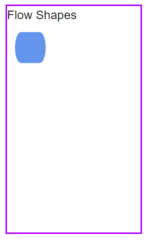
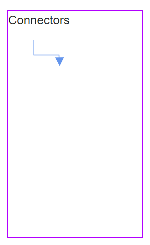
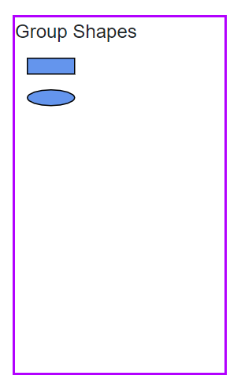
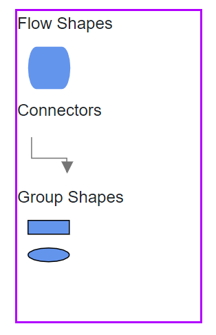
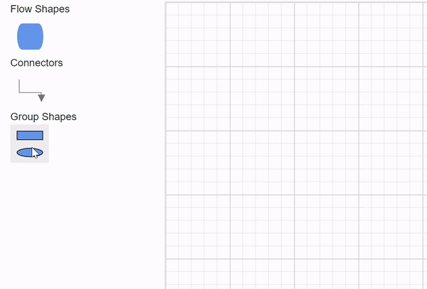
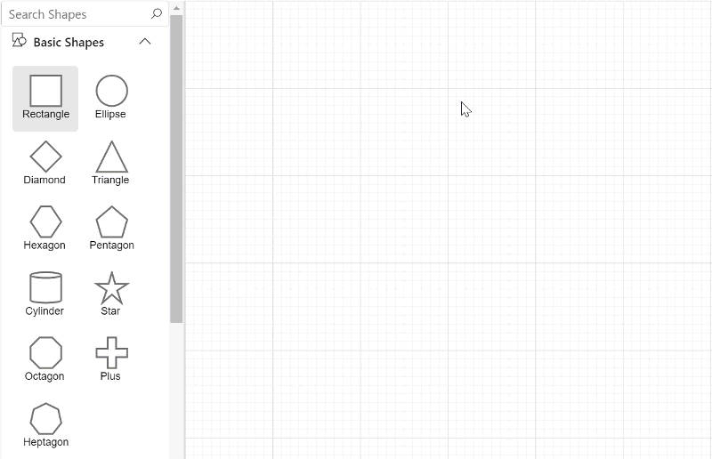
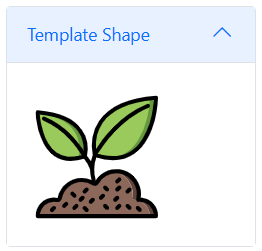

# Symbol Palette in Diagram Component

The [SymbolPalette](https://help.syncfusion.com/cr/blazor/Syncfusion.Blazor.Diagram.SymbolPalette.html) component displays a collection of [Palettes](https://help.syncfusion.com/cr/blazor/Syncfusion.Blazor.Diagram.SymbolPalette.SfSymbolPaletteComponent.html#Syncfusion_Blazor_Diagram_SymbolPalette_SfSymbolPaletteComponent_Palettes), each containing predefined nodes and connectors. This versatile tool enables users to easily drag and drop these elements into the diagram, streamlining the process of creating and modifying diagrams efficiently.

## How to Create Symbol Palette

To learn how to create a symbol palette and add nodes and connectors, refer to the following video.




The [Width](https://help.syncfusion.com/cr/blazor/Syncfusion.Blazor.Diagram.SymbolPalette.SfSymbolPaletteComponent.html#Syncfusion_Blazor_Diagram_SymbolPalette_SfSymbolPaletteComponent_Width) and [Height](https://help.syncfusion.com/cr/blazor/Syncfusion.Blazor.Diagram.SymbolPalette.SfSymbolPaletteComponent.html#Syncfusion_Blazor_Diagram_SymbolPalette_SfSymbolPaletteComponent_Height) properties define the overall size of the symbol palette to fit layout requirements.

```csharp
@using Syncfusion.Blazor.Diagram.SymbolPalette
@using Syncfusion.Blazor.Diagram

@* Initializes the symbol palette *@
<SfSymbolPaletteComponent Height="600px" 
                          SymbolHeight="80" SymbolWidth="80">
</SfSymbolPaletteComponent>
```
A complete working sample can be downloaded from [GitHub](https://github.com/SyncfusionExamples/Blazor-Diagram-Examples/tree/master/UG-Samples/SymbolPalette/CreateSymbolPalette)


### How to Add Node to Palette

The [SymbolWidth](https://help.syncfusion.com/cr/blazor/Syncfusion.Blazor.Diagram.SymbolPalette.SfSymbolPaletteComponent.html#Syncfusion_Blazor_Diagram_SymbolPalette_SfSymbolPaletteComponent_SymbolWidth) and [SymbolHeight](https://help.syncfusion.com/cr/blazor/Syncfusion.Blazor.Diagram.SymbolPalette.SfSymbolPaletteComponent.html#Syncfusion_Blazor_Diagram_SymbolPalette_SfSymbolPaletteComponent_SymbolHeight) properties of the SfSymbolPaletteComponent are essential for defining the dimensions of symbols (nodes, connectors, or node groups) rendered in the palette. These properties ensure that symbols are displayed with the correct size and proportions. The following code example demonstrates how to add a node to a symbol palette with specified dimensions.

* To render a node in a palette, first create symbol palette and initialize the palettes collection.

```csharp
@using Syncfusion.Blazor.Diagram
@using Syncfusion.Blazor.Diagram.SymbolPalette

<div class="control-section">
    <div style="width:20%">
        <div id="palette-space" class="sb-mobile-palette" style="border: 2px solid #b200ff">
            <SfSymbolPaletteComponent @ref="@SymbolPalette" Height="300px" Width="200px"
                                      Palettes="@Palettes" SymbolHeight="60" SymbolWidth="60" SymbolMargin="@SymbolMargin">
            </SfSymbolPaletteComponent>
        </div>
    </div>
</div>

@code
{
    SymbolMargin SymbolMargin = new SymbolMargin 
    { 
        Left = 15, 
        Right = 15, 
        Top = 15, 
        Bottom = 15 
    };
    SfSymbolPaletteComponent SymbolPalette;
    //Define palettes collection.
    DiagramObjectCollection<Palette> Palettes = new DiagramObjectCollection<Palette>();
}
```

* Create a node and add it to the `DiagramObjectCollection<NodeBase>`.

```csharp
   // Defines palette's flow-shape collection.
    DiagramObjectCollection<NodeBase> PaletteNodes = new DiagramObjectCollection<NodeBase>();

    protected override void OnInitialized()
    {
        InitPaletteModel();
    }

    private void InitPaletteModel()
    {                    
        CreatePaletteNode(NodeFlowShapes.Terminator, "Terminator");       
    }

    private void CreatePaletteNode(NodeFlowShapes flowShape, string id)
    {
        Node node = new Node()
        {
            ID = id,
            Shape = new FlowShape() { Type = NodeShapes.Flow, Shape = flowShape },
            Style = new ShapeStyle() {Fill="#6495ED", StrokeColor = "#757575" },
        };
        PaletteNodes.Add(node);
    }
```

* Complete example to add a node to the palette.

```csharp
@using Syncfusion.Blazor.Diagram
@using Syncfusion.Blazor.Diagram.SymbolPalette

<div class="control-section">
    <div style="width:80%">
        <div id="palette-space" class="sb-mobile-palette" style="border: 2px solid #b200ff">
            <SfSymbolPaletteComponent @ref="@SymbolPalette" Height="300px" Width="200px"
                                      Palettes="@Palettes" SymbolHeight="60" SymbolWidth="60" SymbolMargin="@SymbolMargin">
            </SfSymbolPaletteComponent>
        </div>
    </div>
</div>

@code
{
    SymbolMargin SymbolMargin = new SymbolMargin 
    { 
        Left = 15, 
        Right = 15, 
        Top = 15, 
        Bottom = 15
    };

    SfSymbolPaletteComponent SymbolPalette;

    //Define palettes collection.
    DiagramObjectCollection<Palette> Palettes = new DiagramObjectCollection<Palette>();

    // Defines palette's flow-shape collection.
    DiagramObjectCollection<NodeBase> PaletteNodes = new DiagramObjectCollection<NodeBase>();

    protected override void OnInitialized()
    {
        InitPaletteModel();
    }

    private void InitPaletteModel()
    {
        CreatePaletteNode(NodeFlowShapes.Terminator, "Terminator");
        Palettes = new DiagramObjectCollection<Palette>()
        {
           new Palette(){Symbols =PaletteNodes, Title="Flow Shapes", ID="Flow Shapes" },
        };
    }
    private void CreatePaletteNode(NodeFlowShapes flowShape, string id)
    {
        Node node = new Node()
        {
            ID = id,
            Shape = new FlowShape() { Type = NodeShapes.Flow, Shape = flowShape },
            Style = new ShapeStyle() { Fill = "#6495ED", StrokeColor = "#6495ED" },
        };
        PaletteNodes.Add(node);
    }
}

```


A complete working sample can be downloaded from [GitHub](https://github.com/SyncfusionExamples/Blazor-Diagram-Examples/tree/master/UG-Samples/SymbolPalette/AddNodeToPalette)




### How to Add Connector to Palette

The following example illustrates how to add a connector to a palette.

```csharp
@using Syncfusion.Blazor.Diagram
@using Syncfusion.Blazor.Diagram.SymbolPalette

<div class="control-section">
    <div style="width:80%">
        <div id="palette-space" class="sb-mobile-palette" style="border: 2px solid #b200ff">
            <SfSymbolPaletteComponent @ref="@SymbolPalette" Height="300px" Width="200px"
                                      Palettes="@Palettes" SymbolHeight="60" SymbolWidth="100">
            </SfSymbolPaletteComponent>
        </div>
    </div>
</div>

@code
{
    SfSymbolPaletteComponent SymbolPalette;

    //Define palettes collection.
    DiagramObjectCollection<Palette> Palettes = new DiagramObjectCollection<Palette>();

    // Defines palette's flow-shape collection.
    DiagramObjectCollection<NodeBase> PaletteNodes = new DiagramObjectCollection<NodeBase>();

    // Defines palette's connector collection.
    DiagramObjectCollection<NodeBase> PaletteConnectors = new DiagramObjectCollection<NodeBase>();

    protected override void OnInitialized()
    {
        InitPaletteModel();
    }

    private void InitPaletteModel()
    {
        CreatePaletteConnector("Link1", ConnectorSegmentType.Orthogonal, DecoratorShape.Arrow);
        Palettes = new DiagramObjectCollection<Palette>()
        {
            new Palette(){Symbols = PaletteConnectors, Title = "Connectors" , IsExpanded = true},
        };
    }

    private void CreatePaletteConnector(string id, ConnectorSegmentType type, DecoratorShape decoratorShape)
    {
        Connector connector = new Connector()
        {
            ID = id,
            Type = type,
            SourcePoint = new DiagramPoint() { X = 0, Y = 0 },
            TargetPoint = new DiagramPoint() { X = 100, Y = 100 },
            Style = new ShapeStyle() { StrokeWidth = 1, StrokeColor = "#6495ED" },
            TargetDecorator = new DecoratorSettings()
            {
                Shape = decoratorShape,
                Style = new ShapeStyle() { StrokeColor = "#6495ED", Fill = "#6495ED" }
            }
        };

        PaletteConnectors.Add(connector);
    }
}
```


A complete working sample can be downloaded from [GitHub](https://github.com/SyncfusionExamples/Blazor-Diagram-Examples/tree/master/UG-Samples/SymbolPalette/AddConnectorToSymbolPalette)




### How to Add Node Group into Palette

The following example illustrates how to add a node group to a palette.

```csharp
@using Syncfusion.Blazor.Diagram
@using Syncfusion.Blazor.Diagram.SymbolPalette

<div class="control-section">
    <div style="width:80%">
        <div id="palette-space" class="sb-mobile-palette" style="border: 2px solid #b200ff">
            <SfSymbolPaletteComponent @ref="@SymbolPalette" Height="300px" Width="200px"
                                      Palettes="@Palettes" SymbolHeight="60" SymbolWidth="60" SymbolMargin="@SymbolMargin">
            </SfSymbolPaletteComponent>
        </div>
    </div>
</div>

@code{

    SymbolMargin SymbolMargin = new SymbolMargin
    {
        Left = 15,
        Right = 15,
        Top = 15,
        Bottom = 15
    };

    SfSymbolPaletteComponent SymbolPalette;

    //Define palettes collection.
    DiagramObjectCollection<Palette> Palettes = new DiagramObjectCollection<Palette>();

    // Defines palette's group collection.
    DiagramObjectCollection<NodeBase> PaletteGroup = new DiagramObjectCollection<NodeBase>();

    protected override void OnInitialized()
    {
        InitPaletteModel();
    }

    private void InitPaletteModel()
    {
        CreatePaletteGroup();
        Palettes = new DiagramObjectCollection<Palette>()
        {
             new Palette(){Symbols = PaletteGroup,Title = "Group Shapes", IsExpanded = true}
        };
    }

    private void CreatePaletteGroup()
    {
        Node node1 = new Node()
        {
            ID = "node1",
            Width = 50,
            Height = 50,
            OffsetX = 100,
            OffsetY = 100,
            Shape = new BasicShape() { Type = NodeShapes.Basic, Shape = NodeBasicShapes.Rectangle },
            Style = new ShapeStyle() { Fill = "#6495ed" },
        };
        Node node2 = new Node()
        {
            ID = "node2",
            Width = 50,
            Height = 50,
            OffsetX = 100,
            OffsetY = 200,
            Shape = new BasicShape() { Type = NodeShapes.Basic, Shape = NodeBasicShapes.Ellipse },
            Style = new ShapeStyle() { Fill = "#6495ed" },
        };
        PaletteGroup.Add(node1);
        PaletteGroup.Add(node2);

        NodeGroup group = new NodeGroup()
        {
            ID = "group1",
            Children = new string[] { "node1", "node2" }
        };
        PaletteGroup.Add(group);
    }
}
```


A complete working sample can be downloaded from [GitHub](https://github.com/SyncfusionExamples/Blazor-Diagram-Examples/tree/master/UG-Samples/SymbolPalette/AddGroupToPalette)




## How to Add Palette to Symbol Palette

A palette displays a group of related symbols and textually annotate the group with a header. [Palettes](https://help.syncfusion.com/cr/blazor/Syncfusion.Blazor.Diagram.SymbolPalette.Palette.html) can be added as a collection of symbol groups, providing a organized way to categorize and present symbols.

The collection of predefined symbols can be added to palettes using the [Symbols](https://help.syncfusion.com/cr/blazor/Syncfusion.Blazor.Diagram.SymbolPalette.Palette.html#Syncfusion_Blazor_Diagram_SymbolPalette_Palette_Symbols) property. This allows populate your palette with custom or pre-designed symbols that users can drag and drop into their diagrams.

To initialize a palette, define a JSON object with the [ID](https://help.syncfusion.com/cr/blazor/Syncfusion.Blazor.Diagram.SymbolPalette.Palette.html#Syncfusion_Blazor_Diagram_SymbolPalette_Palette_ID) property. This unique identifier is essential for distinguishing between different palettes and for referencing them programmatically.

The following example shows how to define a palette.

```csharp
@using Syncfusion.Blazor.Diagram.SymbolPalette
@using Syncfusion.Blazor.Diagram

@* Initializes the symbol palette *@
<SfSymbolPaletteComponent @ref="SymbolPalette" Height="600px"
                          SymbolHeight="80" SymbolWidth="80" Palettes="@palettes">
</SfSymbolPaletteComponent>

@code
{
    SfSymbolPaletteComponent SymbolPalette;
    DiagramObjectCollection<Palette> palettes = new DiagramObjectCollection<Palette>();
}
```

The following example illustrates how to add nodes, connectors, nodegroups to the palette and add the palette to the palettes collection of the symbol palette.

```csharp
Palettes = new DiagramObjectCollection<Palette>()
{
    new Palette(){Symbols = PaletteNodes, Title = "Flow Shapes", ID = "Flow Shapes" },
    new Palette(){Symbols = PaletteConnectors, Title = "Connectors", IsExpanded = true},
    new Palette(){Symbols = PaletteGroup, Title = "Group Shapes", IsExpanded = true}
};                  
```

* Complete example to render a palette with node, connector, and node group symbols.

```csharp
@using Syncfusion.Blazor.Diagram
@using Syncfusion.Blazor.Diagram.SymbolPalette

<div class="control-section">
    <div style="width:75%">       
        <div id="palette-space" class="sb-mobile-palette" style="border: 2px solid #b200ff">
            <SfSymbolPaletteComponent @ref="@SymbolPalette" Height="300px" Width="200px"
                                      Palettes="@Palettes" SymbolHeight="60" SymbolWidth="60" SymbolMargin="@SymbolMargin">
            </SfSymbolPaletteComponent>
        </div>
    </div>
</div>

@code
{
    SymbolMargin SymbolMargin = new SymbolMargin 
    { 
        Left = 15, 
        Right = 15, 
        Top = 15, 
        Bottom = 15 
    };
    SfSymbolPaletteComponent SymbolPalette;
    //Define palettes collection.
    DiagramObjectCollection<Palette> Palettes = new DiagramObjectCollection<Palette>();
    // Defines palette's flow-shape collection.
    DiagramObjectCollection<NodeBase> PaletteNodes = new DiagramObjectCollection<NodeBase>();
    // Defines palette's group collection.
    DiagramObjectCollection<NodeBase> PaletteGroup = new DiagramObjectCollection<NodeBase>();
    // Defines palette's connector collection.
    DiagramObjectCollection<NodeBase> PaletteConnectors = new DiagramObjectCollection<NodeBase>();

    protected override void OnInitialized()
    {
        InitPaletteModel();
    }

    private void InitPaletteModel()
    {
        CreatePaletteNode(NodeFlowShapes.Terminator, "Terminator");
        CreatePaletteConnector("Link1", ConnectorSegmentType.Orthogonal, DecoratorShape.Arrow);
        CreatePaletteGroup();
        Palettes = new DiagramObjectCollection<Palette>()
        {
            new Palette(){Symbols = PaletteNodes,Title = "Flow Shapes", ID = "Flow Shapes" },
            new Palette(){Symbols = PaletteConnectors,Title = "Connectors", IsExpanded = true},
            new Palette(){Symbols = PaletteGroup,Title = "Group Shapes", IsExpanded = true}
        };
    }

    private void CreatePaletteNode(NodeFlowShapes flowShape, string id)
    {
        Node node = new Node()
        {
            ID = id,
            Shape = new FlowShape() { Type = NodeShapes.Flow, Shape = flowShape },
            Style = new ShapeStyle() { Fill = "#6495ED", StrokeColor = "#6495ED" },
        };
        PaletteNodes.Add(node);
    }

    private void CreatePaletteConnector(string id, ConnectorSegmentType type, DecoratorShape decoratorShape)
    {
        Connector connector = new Connector()
        {
            ID = id,
            Type = type,
            SourcePoint = new DiagramPoint() { X = 0, Y = 0 },
            TargetPoint = new DiagramPoint() { X = 60, Y = 60 },
            Style = new ShapeStyle() { StrokeWidth = 1, StrokeColor = "#757575" },
            TargetDecorator = new DecoratorSettings()
            {
                Shape = decoratorShape,
                Style = new ShapeStyle() { StrokeColor = "#757575", Fill = "#757575" }
            }
        };
        PaletteConnectors.Add(connector);
    }

    private void CreatePaletteGroup()
    {
        Node node1 = new Node()
        {
            ID = "node1",
            Width = 50,
            Height = 50,
            OffsetX = 100,
            OffsetY = 100,
            Shape = new BasicShape() { Type = NodeShapes.Basic, Shape = NodeBasicShapes.Rectangle },
            Style = new ShapeStyle() { Fill = "#6495ed" },
        };
        Node node2 = new Node()
        {
            ID = "node2",
            Width = 50,
            Height = 50,
            OffsetX = 100,
            OffsetY = 200,
            Shape = new BasicShape() { Type = NodeShapes.Basic, Shape = NodeBasicShapes.Ellipse },
            Style = new ShapeStyle() { Fill = "#6495ed" },
        };
        PaletteGroup.Add(node1);
        PaletteGroup.Add(node2);
        NodeGroup group = new NodeGroup()
        {
            ID = "group1",
            Children = new string[] { "node1", "node2" }
        };
        PaletteGroup.Add(group);
    }
}
```


A complete working sample can be downloaded from [GitHub](https://github.com/SyncfusionExamples/Blazor-Diagram-Examples/tree/master/UG-Samples/SymbolPalette/AddPaletteToSymbolPalette)



## How to Drag and Drop Symbols from Palette to Diagram

To enable drag and drop functionality, add the diagram component to the [Targets](https://help.syncfusion.com/cr/blazor/Syncfusion.Blazor.Diagram.SymbolPalette.SfSymbolPaletteComponent.html#Syncfusion_Blazor_Diagram_SymbolPalette_SfSymbolPaletteComponent_Targets) collection of the symbol palette. This connects the palette to the diagram so users can drop symbols onto the canvas.
 The following code illustrates how to add diagram to the Targets collection.

```csharp
@code
{
    SfDiagramComponent diagram;

    protected override async Task OnAfterRenderAsync(bool firstRender)
    {
        SymbolPalette.Targets = new DiagramObjectCollection<SfDiagramComponent>() { };
        SymbolPalette.Targets.Add(diagram);
    }
}
```

* Complete example to drag and drop symbols from the palette to the diagram.

```csharp
@using Syncfusion.Blazor.Diagram
@using Syncfusion.Blazor.Diagram.SymbolPalette

<div class="control-section">    
    <div style="width: 100%">
        <div class="sb-mobile-palette-bar">
            <div id="palette-icon" style="float: right;" role="button" class="e-ddb-icons1 e-toggle-palette"></div>
        </div>
        <div id="palette-space" class="sb-mobile-palette">
            <SfSymbolPaletteComponent @ref="@SymbolPalette" Height="700px"
                                      Palettes="@Palettes"  SymbolHeight="60" SymbolWidth="60" SymbolMargin="@SymbolMargin">
            </SfSymbolPaletteComponent>
        </div>
        <div id="diagram-space" class="sb-mobile-diagram">
            <div class="content-wrapper" style="border: 1px solid #D7D7D7">
                <SfDiagramComponent @ref="@diagram" Height="700px" Connectors="@connectors" Nodes="@nodes">
                </SfDiagramComponent>
            </div>
        </div>
    </div>
</div>

@code
{
    SymbolMargin SymbolMargin = new SymbolMargin 
    { 
        Left = 15, 
        Right = 15, 
        Top = 15, 
        Bottom = 15 
    };
    SfDiagramComponent diagram;
    SfSymbolPaletteComponent SymbolPalette;
    //Define nodes collection.
    DiagramObjectCollection<Node> nodes = new DiagramObjectCollection<Node>();
    //Define connectors collection.
    DiagramObjectCollection<Connector> connectors = new DiagramObjectCollection<Connector>();
    //Define palettes collection.
    DiagramObjectCollection<Palette> Palettes = new DiagramObjectCollection<Palette>();
    // Defines palette's flow-shape collection.
    DiagramObjectCollection<NodeBase> PaletteNodes = new DiagramObjectCollection<NodeBase>();
    // Defines palette's group collection.
    DiagramObjectCollection<NodeBase> PaletteGroup = new DiagramObjectCollection<NodeBase>();
    // Defines palette's connector collection.
    DiagramObjectCollection<NodeBase> PaletteConnectors = new DiagramObjectCollection<NodeBase>();

    protected override async Task OnAfterRenderAsync(bool firstRender)
    {
        SymbolPalette.Targets = new DiagramObjectCollection<SfDiagramComponent>() { };
        SymbolPalette.Targets.Add(diagram);
    }

    protected override void OnInitialized()
    {
        InitPaletteModel();
    }

    private void InitPaletteModel()
    {
        CreatePaletteNode(NodeFlowShapes.Terminator, "Terminator");        
        CreatePaletteConnector("Link1", ConnectorSegmentType.Orthogonal, DecoratorShape.Arrow);        
        CreatePaletteGroup();
        Palettes = new DiagramObjectCollection<Palette>()
        {
            new Palette(){Symbols = PaletteNodes,Title = "Flow Shapes", ID = "Flow Shapes" },
            new Palette(){Symbols = PaletteConnectors,Title = "Connectors", IsExpanded = true},
            new Palette(){Symbols = PaletteGroup,Title = "Group Shapes", IsExpanded = true}
        };
    }

    private void CreatePaletteNode(NodeFlowShapes flowShape, string id)
    {
        Node node = new Node()
        {
            ID = id,
            Shape = new FlowShape() { Type = NodeShapes.Flow, Shape = flowShape },
            Style = new ShapeStyle() { Fill= "#6495ED", StrokeColor = "#6495ED" },
        };
        PaletteNodes.Add(node);
    }

    private void CreatePaletteConnector(string id, ConnectorSegmentType type, DecoratorShape decoratorShape)
    {
        Connector connector = new Connector()
        {
            ID = id,
            Type = type,
            SourcePoint = new DiagramPoint() { X = 0, Y = 0 },
            TargetPoint = new DiagramPoint() { X = 60, Y = 60 },
            Style = new ShapeStyle() { StrokeWidth = 1, StrokeColor = "#757575" },
            TargetDecorator = new DecoratorSettings()
            {
                Shape = decoratorShape,
                Style = new ShapeStyle() { StrokeColor = "#757575", Fill = "#757575" }
            }
        };
        PaletteConnectors.Add(connector);
    }

    private void CreatePaletteGroup()
    {
        Node node1 = new Node()
        {
            ID = "node1",
            Width = 50,
            Height = 50,
            OffsetX = 100,
            OffsetY = 100,
            Shape = new BasicShape() { Type = NodeShapes.Basic, Shape = NodeBasicShapes.Rectangle },
            Style = new ShapeStyle() { Fill = "#6495ed" },
        };
        Node node2 = new Node()
        {
            ID = "node2",
            Width = 50,
            Height = 50,
            OffsetX = 100,
            OffsetY = 200,
            Shape = new BasicShape() { Type = NodeShapes.Basic, Shape = NodeBasicShapes.Ellipse },
            Style = new ShapeStyle() { Fill = "#6495ed" },
        };
        PaletteGroup.Add(node1);
        PaletteGroup.Add(node2);
        NodeGroup group = new NodeGroup()
        {
            ID = "group1",
            Children = new string[] { "node1", "node2" }
        };
        PaletteGroup.Add(group);
    }
}
```


A complete working sample can be downloaded from [GitHub](https://github.com/SyncfusionExamples/Blazor-Diagram-Examples/tree/master/UG-Samples/SymbolPalette/DragAndDrop)



## How to Add or Remove Symbols in the Symbol Palette at Runtime

Add symbols at runtime using [AddPaletteItem](https://help.syncfusion.com/cr/blazor/Syncfusion.Blazor.Diagram.SymbolPalette.SfSymbolPaletteComponent.html#Syncfusion_Blazor_Diagram_SymbolPalette_SfSymbolPaletteComponent_AddPaletteItem_System_String_Syncfusion_Blazor_Diagram_NodeBase_System_Boolean_). This method allows for flexible customization of the symbol palette, enabling users to incorporate new symbols as needed during the application's execution. The following code sample illustrates how to add symbol using AddPaletteItem method.

```csharp
Node decision = new Node()
{ 
    ID = "Decision",
    Shape = new FlowShape() { Type = NodeShapes.Flow, Shape = NodeFlowShapes.Decision } 
};
SymbolPalette.AddPaletteItem("FlowShapes", decision, false);
```

Symbols can also be added at runtime by using the `Add` method on the palette’s Symbol collection.


```csharp
Node decision = new Node()
{ 
    ID = "Decision",
    Shape = new FlowShape() { Type = NodeShapes.Flow, Shape = NodeFlowShapes.Decision } 
};
SymbolPalette.Palettes[0].Symbols.Add(decision);
```

Remove symbols at runtime using [RemovePaletteItem](https://help.syncfusion.com/cr/blazor/Syncfusion.Blazor.Diagram.SymbolPalette.SfSymbolPaletteComponent.html#Syncfusion_Blazor_Diagram_SymbolPalette_SfSymbolPaletteComponent_RemovePaletteItem_System_String_System_String_). The following code sample illustrates how to remove symbol using RemovePaletteItem method.


```csharp
   symbolpalette.RemovePaletteItem("FlowShapes", "Decision");
```
You can download a complete working sample from [GitHub](https://github.com/SyncfusionExamples/Blazor-Diagram-Examples/tree/master/UG-Samples/SymbolPalette/AddRemoveSymbolAtRuntime)


## How to Add or Remove Palettes at Runtime 

Add palettes dynamically using [AddPalettes](https://help.syncfusion.com/cr/blazor/Syncfusion.Blazor.Diagram.SymbolPalette.SfSymbolPaletteComponent.html#Syncfusion_Blazor_Diagram_SymbolPalette_SfSymbolPaletteComponent_AddPalettes_Syncfusion_Blazor_Diagram_DiagramObjectCollection_Syncfusion_Blazor_Diagram_SymbolPalette_Palette__) which accepts a collection of palettes. This method allows for flexible customization of the symbol palette during application execution. The following code sample illustrates how to add palette using AddPalettes method.

```csharp
    DiagramObjectCollection<NodeBase> newNodes = new DiagramObjectCollection<NodeBase>();
    Node newNode = new Node()
        {
            ID = "newNode",
            Shape = new BasicShape() { Type = NodeShapes.Basic, Shape = NodeBasicShapes.Ellipse }
        };
    newNodes.Add(newNode as NodeBase);
    DiagramObjectCollection<Palette> newPalettes = new DiagramObjectCollection<Palette>()
    {
        new Palette(){Symbols = newNodes,Title = "BasicShapes",ID = "BasicShapes" },
    };
    symbolpalette.AddPalettes(newPalettes);
```

Also, Add palette to the symbol palette at runtime by using the `Add` method. The following code sample illustrates how to add palette using Add method.

```csharp
    DiagramObjectCollection<NodeBase> newNodes = new DiagramObjectCollection<NodeBase>();
    Node newNode = new Node()
        {
            ID = "newNode",
            Shape = new BasicShape() { Type = NodeShapes.Basic, Shape = NodeBasicShapes.Ellipse }
        };
    newNodes.Add(newNode as NodeBase);
    DiagramObjectCollection<Palette> newPalettes = new DiagramObjectCollection<Palette>()
    {
        new Palette(){Symbols = newNodes,Title = "BasicShapes",ID = "BasicShapes" },
    };
    SymbolPalette.Palettes.Add(newPalettes);
```

Remove palettes at runtime using [RemovePalettes](https://help.syncfusion.com/cr/blazor/Syncfusion.Blazor.Diagram.SymbolPalette.SfSymbolPaletteComponent.html#Syncfusion_Blazor_Diagram_SymbolPalette_SfSymbolPaletteComponent_RemovePalettes_System_String_). The following code sample illustrates how to remove palette using the RemovePalettes method.

```csharp
 SymbolPalette.RemovePalettes("BasicShapes");
```
You can download a complete working sample from [GitHub](https://github.com/SyncfusionExamples/Blazor-Diagram-Examples/tree/master/UG-Samples/SymbolPalette/AddRemovePaletteAtRuntime)

## How to Enable Symbol Search Option in Symbol Palette

The diagram component offers a search functionality within the symbol palette. By utilizing the [ShowSearchTextBox](https://help.syncfusion.com/cr/blazor/Syncfusion.Blazor.Diagram.SymbolPalette.SfSymbolPaletteComponent.html#Syncfusion_Blazor_Diagram_SymbolPalette_SfSymbolPaletteComponent_ShowSearchTextBox) property of the palette, you can control the visibility of the search textbox. This feature allows users to quickly locate specific symbols by entering either the symbol ID (e.g., "rectangle") or relevant search keywords into the search field. After inputting the search criteria, clicking the search button will filter and display matching symbols. The search mechanism works by comparing the entered text with the value of each symbol's ID property, ensuring efficient and accurate symbol retrieval within the palette.

```csharp
@using Syncfusion.Blazor.Diagram
@using Syncfusion.Blazor.Diagram.SymbolPalette

<div class="control-section">   
    <div style="width: 100%">  
        <div id="palette-space" class="sb-mobile-palette" style="border: 2px solid #b200ff">
            <SfSymbolPaletteComponent @ref="@SymbolPalette" ShowSearchTextBox="true" Height="700px" Width="100%" 
                                      Palettes="@Palettes" SymbolHeight="60" SymbolWidth="120" SymbolMargin="@SymbolMargin">
            </SfSymbolPaletteComponent>
        </div>
        </div>
</div>

@code
{
    SymbolMargin SymbolMargin = new SymbolMargin 
    { 
        Left = 15, 
        Right = 15, 
        Top = 15, 
        Bottom = 15 
    };       
    SfSymbolPaletteComponent SymbolPalette;
    //Define palettes collection.
    DiagramObjectCollection<Palette> Palettes = new DiagramObjectCollection<Palette>();
    // Defines palette's flow-shape collection.
    DiagramObjectCollection<NodeBase> FlowShapes = new DiagramObjectCollection<NodeBase>();
    // Defines palette's basic-shape collection.
    DiagramObjectCollection<NodeBase> PaletteNodes = new DiagramObjectCollection<NodeBase>();

    // Defines palette's connector collection.
    DiagramObjectCollection<NodeBase> Connectors = new DiagramObjectCollection<NodeBase>();

    protected override void OnInitialized()
    {
        InitPaletteModel();
    }

    private void InitPaletteModel()
    {
        CreatePaletteNode(NodeBasicShapes.Rectangle, "Rectangle");
        CreatePaletteNode(NodeBasicShapes.Ellipse, "Ellipse");
        CreatePaletteNode(NodeBasicShapes.Star, "Star");
        CreatePaletteNode(NodeBasicShapes.Hexagon, "Hexagon");
        CreatePaletteNode(NodeBasicShapes.Plus, "Plus");
        CreatePaletteNode(NodeBasicShapes.Diamond, "Diamond");

        CreateFlowShape(NodeFlowShapes.Terminator, "Terminator");
        CreateFlowShape(NodeFlowShapes.Process, "Process");
        CreateFlowShape(NodeFlowShapes.PreDefinedProcess, "PreDefinedProcess");
        CreateFlowShape(NodeFlowShapes.Annotation, "Annotation");
        CreateFlowShape(NodeFlowShapes.Card, "Card");

        CreateConnector("ortho", ConnectorSegmentType.Orthogonal, DecoratorShape.Arrow);
        CreateConnector("link2", ConnectorSegmentType.Orthogonal, DecoratorShape.None);
        CreateConnector("link3", ConnectorSegmentType.Straight, DecoratorShape.Arrow);
        CreateConnector("straight", ConnectorSegmentType.Straight, DecoratorShape.None);
        CreateConnector("link5", ConnectorSegmentType.Bezier, DecoratorShape.None);
        CreateConnector("link6", ConnectorSegmentType.Bezier, DecoratorShape.Arrow);
        Palettes = new DiagramObjectCollection<Palette>()
        {
           new Palette(){Symbols = PaletteNodes,Title = "Basic Shapes", ID = "Basic Shapes" },
           new Palette(){Symbols = FlowShapes,Title = "Flow Shapes", ID = "Flow Shapes" },
            new Palette(){Symbols = Connectors,Title = "Connector", ID = "Connector" },
        };
    }
    private void CreateConnector(string id, ConnectorSegmentType type, DecoratorShape shape)
    {
        Connector connector = new Connector()
            {
                ID = id,
                Type = type,
                SearchTags = new List<string>() { "connector" },
                SourcePoint = new DiagramPoint() { X = 0, Y = 0 },
                TargetPoint = new DiagramPoint() { X = 40, Y = 40 },
                TargetDecorator = new DecoratorSettings()
                {
                    Shape = shape,
                    Style = new ShapeStyle() { StrokeColor = "#757575", Fill = "#757575" }
                },
                Style = new ShapeStyle() { StrokeWidth = 2, StrokeColor = "#757575" }
            };
        Connectors.Add(connector);
    }
    private void CreatePaletteNode(NodeBasicShapes basicShape, string id)
    {
        Node node = new Node()
        {
            ID = id,
                SearchTags = new List<string>() { "Basic" },
            Shape = new BasicShape() { Type = NodeShapes.Basic, Shape = basicShape },
            Style = new ShapeStyle() { Fill = "#6495ED", StrokeColor = "#6495ED" },
        };
        PaletteNodes.Add(node);
    }
    private void CreateFlowShape(NodeFlowShapes flowShape, string id)
    {
        Node node = new Node()
            {
                ID = id,
                SearchTags = new List<string>() { "Flow" },
                Shape = new FlowShape() { Type = NodeShapes.Flow, Shape = flowShape },
                Style = new ShapeStyle() { Fill = "#6495ED", StrokeColor = "#6495ED" },
            };
        FlowShapes.Add(node);
    }
}
```


A complete working sample can be downloaded from [GitHub](https://github.com/SyncfusionExamples/Blazor-Diagram-Examples/tree/master/UG-Samples/SymbolPalette/SearchOption)



## How to Add Search keywords for Symbols

The [SearchTags](https://help.syncfusion.com/cr/blazor/Syncfusion.Blazor.Diagram.NodeBase.html#Syncfusion_Blazor_Diagram_NodeBase_SearchTags) property enhances the search ability of symbols within the symbol palette by allowing you to specify custom keywords. These tags can be associated with various diagram elements such as nodes, connectors, groups, swimlanes, and BPMN symbols. By utilizing search tags, users can more easily locate and identify relevant symbols for their diagramming needs, improving the overall user experience and efficiency of the symbol palette feature.

```csharp
@using Syncfusion.Blazor.Diagram
@using Syncfusion.Blazor.Diagram.SymbolPalette

<div class="control-section">   
    <div style="width: 100%">  
        <div id="palette-space" class="sb-mobile-palette" style="border: 2px solid #b200ff">
            <SfSymbolPaletteComponent @ref="@SymbolPalette" ShowSearchTextBox="true" Height="300px" Width="200px" 
                                      Palettes="@Palettes" SymbolHeight="60" SymbolWidth="120" SymbolMargin="@SymbolMargin">
            </SfSymbolPaletteComponent>
        </div>
        </div>
</div>

@code
{
    SymbolMargin SymbolMargin = new SymbolMargin 
    { 
        Left = 15, 
        Right = 15, 
        Top = 15, 
        Bottom = 15 
    };       
    SfSymbolPaletteComponent SymbolPalette;
    //Define palettes collection.
    DiagramObjectCollection<Palette> Palettes = new DiagramObjectCollection<Palette>();
    // Defines palette's flow-shape collection.
    DiagramObjectCollection<NodeBase> PaletteNodes = new DiagramObjectCollection<NodeBase>();

    protected override void OnInitialized()
    {
        InitPaletteModel();
    }
        
    private void InitPaletteModel()
    {
        CreatePaletteNode(NodeBasicShapes.Rectangle, "Rectangle");
        CreatePaletteNode(NodeBasicShapes.Ellipse, "Ellipse");
        CreatePaletteNode(NodeBasicShapes.Star, "Star");
        Palettes = new DiagramObjectCollection<Palette>()
        {
           new Palette(){Symbols = PaletteNodes,Title = "Basic Shapes", ID = "Basic Shapes" },
        };
    }
        
    private void CreatePaletteNode(NodeBasicShapes basicShape, string id)
    {
        Node node = new Node()
        {
            ID = id,
            SearchTags = new List<string>() { "Basic" },
            Shape = new BasicShape() { Type = NodeShapes.Basic, Shape = basicShape },
            Style = new ShapeStyle() { Fill = "#6495ED", StrokeColor = "#6495ED" },
        };
        PaletteNodes.Add(node);
    }
}
```


A complete working sample can be downloaded from [GitHub](https://github.com/SyncfusionExamples/Blazor-Diagram-Examples/tree/master/UG-Samples/SymbolPalette/SearchTag)

## How to Update Common Values for All Nodes and Connectors

Use the [NodeCreating](https://help.syncfusion.com/cr/blazor/Syncfusion.Blazor.Diagram.SymbolPalette.SfSymbolPaletteComponent.html#Syncfusion_Blazor_Diagram_SymbolPalette_SfSymbolPaletteComponent_NodeCreating) and [ConnectorCreating](https://help.syncfusion.com/cr/blazor/Syncfusion.Blazor.Diagram.SymbolPalette.SfSymbolPaletteComponent.html#Syncfusion_Blazor_Diagram_SymbolPalette_SfSymbolPaletteComponent_ConnectorCreating) callbacks on `SfSymbolPaletteComponent` to apply default styles or settings for symbols as they are created in the palette.

```csharp
@using Syncfusion.Blazor.Diagram
@using Syncfusion.Blazor.Diagram.SymbolPalette

<div class="control-section">   
    <div style="width: 100%">  
        <div id="palette-space" class="sb-mobile-palette" style="border: 2px solid #b200ff">
            <SfSymbolPaletteComponent @ref="@SymbolPalette" Height="300px" Width="200px" GetSymbolInfo="GetSymbolInfo" NodeCreating="OnNodeCreating" ConnectorCreating="OnConnectorCreating"
                                      Palettes="@Palettes" SymbolHeight="60" SymbolWidth="120" SymbolMargin="@SymbolMargin">
            </SfSymbolPaletteComponent>
        </div>
        </div>
</div>

@code
{
    SymbolMargin SymbolMargin = new SymbolMargin 
    { 
        Left = 15, 
        Right = 15, 
        Top = 15, 
        Bottom = 15 
    };       
    SfSymbolPaletteComponent SymbolPalette;
    //Define the palettes collection.
    DiagramObjectCollection<Palette> Palettes = new DiagramObjectCollection<Palette>();
    //  Define the palette's flow-shape collection.
    DiagramObjectCollection<NodeBase> PaletteNodes = new DiagramObjectCollection<NodeBase>();
     public void OnNodeCreating(IDiagramObject args)
    { 
        Node node = args as Node;
        node.Style.Fill = "#357BD2";
        node.Style.StrokeColor = "White";
        node.Style.Opacity = 1;
    }

    public void OnConnectorCreating(IDiagramObject args)
    { 
        Connector connector = args as Connector;
        connector.Style.Fill = "black";
        connector.Style.StrokeColor = "black";
        connector.Style.Opacity = 1;
        connector.TargetDecorator.Style.Fill = "black";
        connector.TargetDecorator.Style.StrokeColor = "black";
    }

    protected override void OnInitialized()
    {
        InitPaletteModel();
    }
        
    private void InitPaletteModel()
    {
        CreatePaletteNode(NodeBasicShapes.Rectangle, "Rectangle");
        Palettes = new DiagramObjectCollection<Palette>()
        {
           new Palette(){Symbols = PaletteNodes,Title = "Basic Shapes", ID = "Basic Shapes" },
        };
    }
        
    private void CreatePaletteNode(NodeBasicShapes basicShape, string id)
    {
        Node node = new Node()
        {
            ID = id,
            Shape = new BasicShape() { Type = NodeShapes.Basic, Shape = basicShape },
            Style = new ShapeStyle() { Fill = "#6495ED", StrokeColor = "#6495ED" },
        };
        PaletteNodes.Add(node);
    }

    private SymbolInfo GetSymbolInfo(IDiagramObject symbol)
    {
        SymbolInfo SymbolInfo = new SymbolInfo();
        string text = null;
        text = (symbol as Node).ID;
        SymbolInfo.Description = new SymbolDescription() { Text = text };
        return SymbolInfo;
    }
}
```



## How to Refresh the Symbols at Runtime

The [RefreshSymbols](https://help.syncfusion.com/cr/blazor/Syncfusion.Blazor.Diagram.SymbolPalette.SfSymbolPaletteComponent.html#Syncfusion_Blazor_Diagram_SymbolPalette_SfSymbolPaletteComponent_RefreshSymbols) method redraw symbols in the symbol palette without re-rendering the entire diagram. This method enhances performance by updating only the necessary symbols, providing a more efficient way to refresh the SymbolPalette's content.

```csharp

@using Syncfusion.Blazor.Diagram
@using Syncfusion.Blazor.Diagram.SymbolPalette
@using Syncfusion.Blazor.Buttons

<div class="control-section">
    <div style="width: 100%">
        <div id="palette-space" class="sb-mobile-palette" style="border: 2px solid #b200ff">
            <SfSymbolPaletteComponent @ref="@SymbolPalette" Height="300px" Width="200px" GetSymbolInfo="GetSymbolInfo"
                                      Palettes="@Palettes" SymbolHeight="60" SymbolWidth="120" SymbolMargin="@SymbolMargin">
            </SfSymbolPaletteComponent>
        </div>
    </div>
</div>
<SfButton Content="RefreshSymbols" OnClick="@RefreshSymbols" />

@code
{
    SymbolMargin SymbolMargin = new SymbolMargin
        {
            Left = 15,
            Right = 15,
            Top = 15,
            Bottom = 15
        };
    SfSymbolPaletteComponent SymbolPalette;
    //Define palettes collection.
    DiagramObjectCollection<Palette> Palettes = new DiagramObjectCollection<Palette>();
    // Defines palette's flow-shape collection.
    DiagramObjectCollection<NodeBase> PaletteNodes = new DiagramObjectCollection<NodeBase>();

    protected override void OnInitialized()
    {
        InitPaletteModel();
    }

    private void InitPaletteModel()
    {
        CreatePaletteNode(NodeBasicShapes.Rectangle, "Rectangle");
        Palettes = new DiagramObjectCollection<Palette>()
        {
           new Palette(){Symbols = PaletteNodes,Title = "Basic Shapes", ID = "Basic Shapes" },
        };
    }

    private void CreatePaletteNode(NodeBasicShapes basicShape, string id)
    {
        Node node = new Node()
            {
                ID = id,
                Shape = new BasicShape() { Type = NodeShapes.Basic, Shape = basicShape },
                Style = new ShapeStyle() { Fill = "#6495ED", StrokeColor = "#6495ED" },
            };
        PaletteNodes.Add(node);
    }

    private SymbolInfo GetSymbolInfo(IDiagramObject symbol)
    {
        SymbolInfo SymbolInfo = new SymbolInfo();
        string text = null;
        text = (symbol as Node).ID;
        SymbolInfo.Description = new SymbolDescription() { Text = text };
        return SymbolInfo;
    }
    private void RefreshSymbols()
    {
        SymbolPalette.RefreshSymbols();
    }
}
```


A complete working sample can be downloaded from [GitHub](https://github.com/SyncfusionExamples/Blazor-Diagram-Examples/tree/master/UG-Samples/SymbolPalette/RefereshPalette)

## How to Set a Template for Symbol Palette Symbols

Customize the appearance of symbols using [SymbolPaletteTemplates](https://help.syncfusion.com/cr/blazor/Syncfusion.Blazor.Diagram.SymbolPalette.SymbolPaletteTemplates.html). This feature enable to create visually appealing and informative symbols that can enhance the user experience. The following example demonstrates how to set a template for SVG symbols. Similarly set templates for HTML symbols.

```csharp
@using Syncfusion.Blazor.Diagram
@using Syncfusion.Blazor.Diagram.SymbolPalette

<SfSymbolPaletteComponent Width="200px" Height="300px" Palettes="@Palettes">
    <SymbolPaletteTemplates>
        <NodeTemplate>
            <g style="fill:black">   <g xmlns="http://www.w3.org/2000/svg">	<g transform="translate(1 1)">		<g>			<path style="fill:#61443C;" d="M61.979,435.057c2.645-0.512,5.291-0.853,7.936-1.109c-2.01,1.33-4.472,1.791-6.827,1.28     C62.726,435.13,62.354,435.072,61.979,435.057z" />			<path style="fill:#61443C;" d="M502.469,502.471h-25.6c0.163-30.757-20.173-57.861-49.749-66.304     c-5.784-1.581-11.753-2.385-17.749-2.389c-2.425-0.028-4.849,0.114-7.253,0.427c1.831-7.63,2.747-15.45,2.731-23.296     c0.377-47.729-34.52-88.418-81.749-95.317c4.274-0.545,8.577-0.83,12.885-0.853c25.285,0.211,49.448,10.466,67.167,28.504     c17.719,18.039,27.539,42.382,27.297,67.666c0.017,7.846-0.9,15.666-2.731,23.296c2.405-0.312,4.829-0.455,7.253-0.427     C472.572,434.123,502.783,464.869,502.469,502.471z" />		</g>		<path style="fill:#8B685A;" d="M476.869,502.471H7.536c-0.191-32.558,22.574-60.747,54.443-67.413    c0.375,0.015,0.747,0.072,1.109,0.171c2.355,0.511,4.817,0.05,6.827-1.28c1.707-0.085,3.413-0.171,5.12-0.171    c4.59,0,9.166,0.486,13.653,1.451c2.324,0.559,4.775,0.147,6.787-1.141c2.013-1.288,3.414-3.341,3.879-5.685    c7.68-39.706,39.605-70.228,79.616-76.117c4.325-0.616,8.687-0.929,13.056-0.939c13.281-0.016,26.409,2.837,38.485,8.363    c3.917,1.823,7.708,3.904,11.349,6.229c2.039,1.304,4.527,1.705,6.872,1.106c2.345-0.598,4.337-2.142,5.502-4.264    c14.373-25.502,39.733-42.923,68.693-47.189h0.171c47.229,6.899,82.127,47.588,81.749,95.317c0.017,7.846-0.9,15.666-2.731,23.296    c2.405-0.312,4.829-0.455,7.253-0.427c5.996,0.005,11.965,0.808,17.749,2.389C456.696,444.61,477.033,471.713,476.869,502.471    L476.869,502.471z" />		<path style="fill:#66993E;" d="M502.469,7.537c0,0-6.997,264.96-192.512,252.245c-20.217-1.549-40.166-5.59-59.392-12.032    c-1.365-0.341-2.731-0.853-4.096-1.28c0,0-0.597-2.219-1.451-6.144c-6.656-34.048-25.088-198.997,231.765-230.144    C485.061,9.159,493.595,8.22,502.469,7.537z" />		<path style="fill:#9ACA5C;" d="M476.784,10.183c-1.28,26.197-16.213,238.165-166.827,249.6    c-20.217-1.549-40.166-5.59-59.392-12.032c-1.365-0.341-2.731-0.853-4.096-1.28c0,0-0.597-2.219-1.451-6.144    C238.363,206.279,219.931,41.329,476.784,10.183z" />		<path style="fill:#66993E;" d="M206.192,246.727c-0.768,3.925-1.365,6.144-1.365,6.144c-1.365,0.427-2.731,0.939-4.096,1.28    c-21.505,7.427-44.293,10.417-66.987,8.789C21.104,252.103,8.816,94.236,7.621,71.452c-0.085-1.792-0.085-2.731-0.085-2.731    C222.747,86.129,211.653,216.689,206.192,246.727z" />		<path style="fill:#9ACA5C;" d="M180.336,246.727c-0.768,3.925-1.365,6.144-1.365,6.144c-1.365,0.427-2.731,0.939-4.096,1.28    c-13.351,4.412-27.142,7.359-41.131,8.789C21.104,252.103,8.816,94.236,7.621,71.452    C195.952,96.881,185.541,217.969,180.336,246.727z" />	</g>	<g>		<path d="M162.136,426.671c3.451-0.001,6.562-2.08,7.882-5.268s0.591-6.858-1.849-9.298l-8.533-8.533    c-3.341-3.281-8.701-3.256-12.012,0.054c-3.311,3.311-3.335,8.671-0.054,12.012l8.533,8.533    C157.701,425.773,159.872,426.673,162.136,426.671L162.136,426.671z" />		<path d="M292.636,398.57c3.341,3.281,8.701,3.256,12.012-0.054c3.311-3.311,3.335-8.671,0.054-12.012l-8.533-8.533    c-3.341-3.281-8.701-3.256-12.012,0.054s-3.335,8.671-0.054,12.012L292.636,398.57z" />		<path d="M296.169,454.771c-3.341-3.281-8.701-3.256-12.012,0.054c-3.311,3.311-3.335,8.671-0.054,12.012l8.533,8.533    c3.341,3.281,8.701,3.256,12.012-0.054c3.311-3.311,3.335-8.671,0.054-12.012L296.169,454.771z" />		<path d="M386.503,475.37c3.341,3.281,8.701,3.256,12.012-0.054c3.311-3.311,3.335-8.671,0.054-12.012l-8.533-8.533    c-3.341-3.281-8.701-3.256-12.012,0.054c-3.311,3.311-3.335,8.671-0.054,12.012L386.503,475.37z" />		<path d="M204.803,409.604c2.264,0.003,4.435-0.897,6.033-2.5l8.533-8.533c3.281-3.341,3.256-8.701-0.054-12.012    c-3.311-3.311-8.671-3.335-12.012-0.054l-8.533,8.533c-2.44,2.44-3.169,6.11-1.849,9.298    C198.241,407.524,201.352,409.603,204.803,409.604z" />		<path d="M332.803,443.737c2.264,0.003,4.435-0.897,6.033-2.5l8.533-8.533c3.281-3.341,3.256-8.701-0.054-12.012    c-3.311-3.311-8.671-3.335-12.012-0.054l-8.533,8.533c-2.44,2.44-3.169,6.11-1.849,9.298    C326.241,441.658,329.352,443.737,332.803,443.737z" />		<path d="M341.336,366.937c2.264,0.003,4.435-0.897,6.033-2.5l8.533-8.533c3.281-3.341,3.256-8.701-0.054-12.012    c-3.311-3.311-8.671-3.335-12.012-0.054l-8.533,8.533c-2.44,2.44-3.169,6.11-1.849,9.298    C334.774,364.858,337.885,366.937,341.336,366.937z" />		<path d="M164.636,454.771l-8.533,8.533c-2.188,2.149-3.055,5.307-2.27,8.271c0.785,2.965,3.1,5.28,6.065,6.065    c2.965,0.785,6.122-0.082,8.271-2.27l8.533-8.533c3.281-3.341,3.256-8.701-0.054-12.012    C173.337,451.515,167.977,451.49,164.636,454.771L164.636,454.771z" />		<path d="M232.903,429.171l-8.533,8.533c-2.188,2.149-3.055,5.307-2.27,8.271c0.785,2.965,3.1,5.28,6.065,6.065    c2.965,0.785,6.122-0.082,8.271-2.27l8.533-8.533c3.281-3.341,3.256-8.701-0.054-12.012    C241.604,425.915,236.243,425.89,232.903,429.171L232.903,429.171z" />		<path d="M384.003,409.604c2.264,0.003,4.435-0.897,6.033-2.5l8.533-8.533c3.281-3.341,3.256-8.701-0.054-12.012    c-3.311-3.311-8.671-3.335-12.012-0.054l-8.533,8.533c-2.44,2.44-3.169,6.11-1.849,9.298    C377.441,407.524,380.552,409.603,384.003,409.604z" />		<path d="M70.77,463.304l-8.533,8.533c-2.188,2.149-3.055,5.307-2.27,8.271s3.1,5.28,6.065,6.065    c2.965,0.785,6.122-0.082,8.271-2.27l8.533-8.533c3.281-3.341,3.256-8.701-0.054-12.012    C79.47,460.048,74.11,460.024,70.77,463.304L70.77,463.304z" />		<path d="M121.97,446.238l-8.533,8.533c-2.188,2.149-3.055,5.307-2.27,8.271c0.785,2.965,3.1,5.28,6.065,6.065    c2.965,0.785,6.122-0.082,8.271-2.27l8.533-8.533c3.281-3.341,3.256-8.701-0.054-12.012    C130.67,442.981,125.31,442.957,121.97,446.238L121.97,446.238z" />		<path d="M202.302,420.638c-1.6-1.601-3.77-2.5-6.033-2.5c-2.263,0-4.433,0.899-6.033,2.5l-8.533,8.533    c-2.178,2.151-3.037,5.304-2.251,8.262c0.786,2.958,3.097,5.269,6.055,6.055c2.958,0.786,6.111-0.073,8.262-2.251l8.533-8.533    c1.601-1.6,2.5-3.77,2.5-6.033C204.802,424.408,203.903,422.237,202.302,420.638L202.302,420.638z" />		<path d="M210.836,463.304c-3.341-3.281-8.701-3.256-12.012,0.054c-3.311,3.311-3.335,8.671-0.054,12.012l8.533,8.533    c2.149,2.188,5.307,3.055,8.271,2.27c2.965-0.785,5.28-3.1,6.065-6.065c0.785-2.965-0.082-6.122-2.27-8.271L210.836,463.304z" />		<path d="M343.836,454.771l-8.533,8.533c-2.188,2.149-3.055,5.307-2.27,8.271c0.785,2.965,3.1,5.28,6.065,6.065    c2.965,0.785,6.122-0.082,8.271-2.27l8.533-8.533c3.281-3.341,3.256-8.701-0.054-12.012    C352.537,451.515,347.177,451.49,343.836,454.771L343.836,454.771z" />		<path d="M429.17,483.904c3.341,3.281,8.701,3.256,12.012-0.054s3.335-8.671,0.054-12.012l-8.533-8.533    c-3.341-3.281-8.701-3.256-12.012,0.054c-3.311,3.311-3.335,8.671-0.054,12.012L429.17,483.904z" />		<path d="M341.336,401.071c2.264,0.003,4.435-0.897,6.033-2.5l8.533-8.533c3.281-3.341,3.256-8.701-0.054-12.012    s-8.671-3.335-12.012-0.054l-8.533,8.533c-2.44,2.441-3.169,6.11-1.849,9.298C334.774,398.991,337.885,401.07,341.336,401.071z" />		<path d="M273.069,435.204c2.264,0.003,4.435-0.897,6.033-2.5l8.533-8.533c3.281-3.341,3.256-8.701-0.054-12.012    s-8.671-3.335-12.012-0.054l-8.533,8.533c-2.44,2.44-3.169,6.11-1.849,9.298C266.508,433.124,269.618,435.203,273.069,435.204z" />		<path d="M253.318,258.138c22.738,7.382,46.448,11.338,70.351,11.737c31.602,0.543,62.581-8.828,88.583-26.796    c94.225-65.725,99.567-227.462,99.75-234.317c0.059-2.421-0.91-4.754-2.667-6.421c-1.751-1.679-4.141-2.52-6.558-2.308    C387.311,9.396,307.586,44.542,265.819,104.5c-28.443,42.151-38.198,94.184-26.956,143.776c-3.411,8.366-6.04,17.03-7.852,25.881    c-4.581-7.691-9.996-14.854-16.147-21.358c8.023-38.158,0.241-77.939-21.57-110.261C160.753,95.829,98.828,68.458,9.228,61.196    c-2.417-0.214-4.808,0.628-6.558,2.308c-1.757,1.667-2.726,4-2.667,6.421c0.142,5.321,4.292,130.929,77.717,182.142    c20.358,14.081,44.617,21.428,69.367,21.008c18.624-0.309,37.097-3.388,54.814-9.138c11.69,12.508,20.523,27.407,25.889,43.665    c0.149,15.133,2.158,30.19,5.982,44.832c-12.842-5.666-26.723-8.595-40.759-8.6c-49.449,0.497-91.788,35.567-101.483,84.058    c-5.094-1.093-10.29-1.641-15.5-1.638c-42.295,0.38-76.303,34.921-76.025,77.217c-0.001,2.263,0.898,4.434,2.499,6.035    c1.6,1.6,3.771,2.499,6.035,2.499h494.933c2.263,0.001,4.434-0.898,6.035-2.499c1.6-1.6,2.499-3.771,2.499-6.035    c0.249-41.103-31.914-75.112-72.967-77.154c0.65-4.78,0.975-9.598,0.975-14.421c0.914-45.674-28.469-86.455-72.083-100.045    c-43.615-13.59-90.962,3.282-116.154,41.391C242.252,322.17,242.793,288.884,253.318,258.138L253.318,258.138z M87.519,238.092    c-55.35-38.567-67.358-129.25-69.833-158.996c78.8,7.921,133.092,32.454,161.458,72.992    c15.333,22.503,22.859,49.414,21.423,76.606c-23.253-35.362-77.83-105.726-162.473-140.577c-2.82-1.165-6.048-0.736-8.466,1.125    s-3.658,4.873-3.252,7.897c0.406,3.024,2.395,5.602,5.218,6.761c89.261,36.751,144.772,117.776,161.392,144.874    C150.795,260.908,115.29,257.451,87.519,238.092z M279.969,114.046c37.6-53.788,109.708-86.113,214.408-96.138    c-2.65,35.375-17.158,159.05-91.892,211.175c-37.438,26.116-85.311,30.57-142.305,13.433    c19.284-32.09,92.484-142.574,212.405-191.954c2.819-1.161,4.805-3.738,5.209-6.76c0.404-3.022-0.835-6.031-3.25-7.892    c-2.415-1.861-5.64-2.292-8.459-1.131C351.388,82.01,279.465,179.805,252.231,222.711    C248.573,184.367,258.381,145.945,279.969,114.046L279.969,114.046z M262.694,368.017c15.097-26.883,43.468-43.587,74.3-43.746    c47.906,0.521,86.353,39.717,85.95,87.625c-0.001,7.188-0.857,14.351-2.55,21.337c-0.67,2.763,0.08,5.677,1.999,7.774    c1.919,2.097,4.757,3.1,7.568,2.676c1.994-0.272,4.005-0.393,6.017-0.362c29.59,0.283,54.467,22.284,58.367,51.617H17.661    c3.899-29.333,28.777-51.334,58.367-51.617c4-0.004,7.989,0.416,11.9,1.254c4.622,0.985,9.447,0.098,13.417-2.467    c3.858-2.519,6.531-6.493,7.408-11.017c7.793-40.473,43.043-69.838,84.258-70.192c16.045-0.002,31.757,4.582,45.283,13.212    c4.01,2.561,8.897,3.358,13.512,2.205C256.422,375.165,260.36,372.163,262.694,368.017L262.694,368.017z" />	</g></g></g>
        </NodeTemplate>
    </SymbolPaletteTemplates>
</SfSymbolPaletteComponent>

@code {
    DiagramObjectCollection<NodeBase> Symbols = new DiagramObjectCollection<NodeBase>();
    DiagramObjectCollection<Palette> Palettes = new DiagramObjectCollection<Palette>();

    protected override void OnInitialized()
    {
        Symbols = new DiagramObjectCollection<NodeBase>();
        Node node = new Node()
            {
                ID = "Nativenode",
                Shape = new Shape() { Type = NodeShapes.SVG },
            };
        Symbols.Add(node as NodeBase);

        Palettes = new DiagramObjectCollection<Palette>()
        {
            new Palette(){Symbols =Symbols, Title="Template Shape" },
        };
    }
}
```




A complete working sample can be downloaded from [GitHub](https://github.com/SyncfusionExamples/Blazor-Diagram-Examples/tree/master/UG-Samples/SymbolPalette/SymbolPaletteTemplate)

## See Also

* [How to add the symbol to the diagram](./nodes)

* [How to Add Image Node in Symbol Palette in Blazor](https://support.syncfusion.com/kb/article/10090/how-to-add-image-node-in-symbol-palette-in-blazor)  
* [How to Add Custom HTML Nodes in Symbol Palette for Blazor Diagram](https://support.syncfusion.com/kb/article/18737/how-to-add-custom-html-nodes-in-symbol-palette-for-blazor-diagram)  

* [How to Render the Freehand Connector in Symbol Palette?](https://support.syncfusion.com/kb/article/17236/how-to-render-the-freehand-connector-in-symbol-palette)  

* [How to Set Symbol Size in the Palette and Increase Node Size When Dropped onto the Diagram in Blazor Application](https://support.syncfusion.com/kb/article/17283/how-to-set-symbol-size-in-the-palette-and-increase-node-size-when-dropped-onto-the-diagram-in-blazor-application)

* [How to Render SVG Nodes to Include Multiple Path Elements Within a Single Node for Both Diagram and Symbol Palette Rendering](https://support.syncfusion.com/kb/article/17266/how-to-render-svg-nodes-to-include-multiple-path-elements-within-a-single-node-for-both-diagram-and-symbol-palette-rendering)

* [How to Create a Palette and a Diagram in the Same Razor Component by Combining Two Separate Razor Files](https://support.syncfusion.com/kb/article/17219/how-to-create-a-palette-and-a-diagram-in-the-same-razor-component-by-combining-two-separate-razor-files)

* [How to Create a Blazor Application for Dragging and Dropping Symbols from a Palette into Multiple Diagrams](https://support.syncfusion.com/kb/article/18717/how-to-create-a-blazor-application-for-dragging-and-dropping-symbols-from-a-palette-into-multiple-diagrams)

* [How to Increase the Width When Resize the Splitter in Blazor Diagram](https://support.syncfusion.com/kb/article/18731/how-to-increase-the-width-when-resize-the-splitter-in-blazor-diagram)