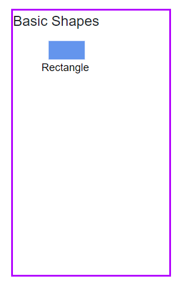

# Symbol Palette in Blazor Diagram Component

The [SymbolPalette](https://help.syncfusion.com/cr/blazor/Syncfusion.Blazor.Diagram.SymbolPalette.html) component displays a collection of [Palettes](https://help.syncfusion.com/cr/blazor/Syncfusion.Blazor.Diagram.SymbolPalette.SfSymbolPaletteComponent.html#Syncfusion_Blazor_Diagram_SymbolPalette_SfSymbolPaletteComponent_Palettes), each containing a set of predefined nodes and connectors. This versatile tool enables users to easily drag and drop these elements into the diagram, streamlining the process of creating and modifying diagrams efficiently.

## How to create symbol palette

To create Symbol Palette easily and to add nodes and connectors in it, you can check the video below.




The [Width](https://help.syncfusion.com/cr/blazor/Syncfusion.Blazor.Diagram.SymbolPalette.SfSymbolPaletteComponent.html#Syncfusion_Blazor_Diagram_SymbolPalette_SfSymbolPaletteComponent_Width) and [Height](https://help.syncfusion.com/cr/blazor/Syncfusion.Blazor.Diagram.SymbolPalette.SfSymbolPaletteComponent.html#Syncfusion_Blazor_Diagram_SymbolPalette_SfSymbolPaletteComponent_Height) properties of the symbol palette allow you to define the dimensions of the symbol palette. These properties enable you to customize the size of the palette to fit your specific layout requirements.

```csharp
@using Syncfusion.Blazor.Diagram.SymbolPalette
@using Syncfusion.Blazor.Diagram

@* Initializes the symbol palette *@
<SfSymbolPaletteComponent Height="600px" 
                          SymbolHeight="80" SymbolWidth="80">
</SfSymbolPaletteComponent>
```
You can download a complete working sample from [GitHub](https://github.com/SyncfusionExamples/Blazor-Diagram-Examples/tree/master/UG-Samples/SymbolPalette/CreateSymbolPalette)


### How to add node to palette

The [SymbolWidth](https://help.syncfusion.com/cr/blazor/Syncfusion.Blazor.Diagram.SymbolPalette.SfSymbolPaletteComponent.html#Syncfusion_Blazor_Diagram_SymbolPalette_SfSymbolPaletteComponent_SymbolWidth) and [SymbolHeight](https://help.syncfusion.com/cr/blazor/Syncfusion.Blazor.Diagram.SymbolPalette.SfSymbolPaletteComponent.html#Syncfusion_Blazor_Diagram_SymbolPalette_SfSymbolPaletteComponent_SymbolHeight) properties of the SfSymbolPaletteComponent are essential for defining the dimensions of symbols (nodes, connectors, or nodegroups) rendered in the palette. These properties ensure that symbols are displayed with the correct size and proportions. The following code example demonstrates how to add a node to a symbol palette with specified dimensions.

* To render a node in a palette, first create SymbolPalette and initialize palettes collection.

```csharp
@using Syncfusion.Blazor.Diagram
@using Syncfusion.Blazor.Diagram.SymbolPalette

<div class="control-section">
    <div style="width:20%">
        <div id="palette-space" class="sb-mobile-palette" style="border: 2px solid #b200ff">
            <SfSymbolPaletteComponent @ref="@SymbolPalette" Height="300px" Width="200px"
                                      Palettes="@Palettes" SymbolHeight="60" SymbolWidth="60" SymbolMargin="@SymbolMargin">
            </SfSymbolPaletteComponent>
        </div>
    </div>
</div>

@code
{
    SymbolMargin SymbolMargin = new SymbolMargin 
    { 
        Left = 15, 
        Right = 15, 
        Top = 15, 
        Bottom = 15 
    };
    SfSymbolPaletteComponent SymbolPalette;
    //Define palettes collection.
    DiagramObjectCollection<Palette> Palettes = new DiagramObjectCollection<Palette>();
}
```

* Create node and add that node to the DiagramObjectCollection<NodeBase>.

```csharp
   // Defines palette's flow-shape collection.
    DiagramObjectCollection<NodeBase> PaletteNodes = new DiagramObjectCollection<NodeBase>();

    protected override void OnInitialized()
    {
        InitPaletteModel();
    }

    private void InitPaletteModel()
    {                    
        CreatePaletteNode(NodeFlowShapes.Terminator, "Terminator");       
    }

    private void CreatePaletteNode(NodeFlowShapes flowShape, string id)
    {
        Node node = new Node()
        {
            ID = id,
            Shape = new FlowShape() { Type = NodeShapes.Flow, Shape = flowShape },
            Style = new ShapeStyle() {Fill="#6495ED", StrokeColor = "#757575" },
        };
        PaletteNodes.Add(node);
    }
```

* Complete code to add node to the palette.

```csharp
@using Syncfusion.Blazor.Diagram
@using Syncfusion.Blazor.Diagram.SymbolPalette

<div class="control-section">
    <div style="width:20%">
        <div id="palette-space" class="sb-mobile-palette" style="border: 2px solid #b200ff">
            <SfSymbolPaletteComponent @ref="@SymbolPalette" Height="300px" Width="200px"
                                      Palettes="@Palettes" SymbolHeight="60" SymbolWidth="60" SymbolMargin="@SymbolMargin">
            </SfSymbolPaletteComponent>
        </div>
    </div>
</div>

@code
{
    SymbolMargin SymbolMargin = new SymbolMargin 
    { 
        Left = 15, 
        Right = 15, 
        Top = 15, 
        Bottom = 15
    };

    SfSymbolPaletteComponent SymbolPalette;

    //Define palettes collection.
    DiagramObjectCollection<Palette> Palettes = new DiagramObjectCollection<Palette>();

    // Defines palette's flow-shape collection.
    DiagramObjectCollection<NodeBase> PaletteNodes = new DiagramObjectCollection<NodeBase>();

    protected override void OnInitialized()
    {
        InitPaletteModel();
    }

    private void InitPaletteModel()
    {
        CreatePaletteNode(NodeFlowShapes.Terminator, "Terminator");
        Palettes = new DiagramObjectCollection<Palette>()
        {
           new Palette(){Symbols =PaletteNodes, Title="Flow Shapes", ID="Flow Shapes" },
        };
    }
    private void CreatePaletteNode(NodeFlowShapes flowShape, string id)
    {
        Node node = new Node()
        {
            ID = id,
            Shape = new FlowShape() { Type = NodeShapes.Flow, Shape = flowShape },
            Style = new ShapeStyle() { Fill = "#6495ED", StrokeColor = "#6495ED" },
        };
        PaletteNodes.Add(node);
    }
}

```
You can download a complete working sample from [GitHub](https://github.com/SyncfusionExamples/Blazor-Diagram-Examples/tree/master/UG-Samples/SymbolPalette/AddNodeToPalette)


### How to add connector to palette

The following code example illustrates how to add connector to a palette.

```csharp
@using Syncfusion.Blazor.Diagram
@using Syncfusion.Blazor.Diagram.SymbolPalette

<div class="control-section">
    <div style="width:20%">
        <div id="palette-space" class="sb-mobile-palette" style="border: 2px solid #b200ff">
            <SfSymbolPaletteComponent @ref="@SymbolPalette" Height="300px" Width="200px"
                                      Palettes="@Palettes" SymbolHeight="60" SymbolWidth="100">
            </SfSymbolPaletteComponent>
        </div>
    </div>
</div>

@code
{
    SfSymbolPaletteComponent SymbolPalette;

    //Define palettes collection.
    DiagramObjectCollection<Palette> Palettes = new DiagramObjectCollection<Palette>();

    // Defines palette's flow-shape collection.
    DiagramObjectCollection<NodeBase> PaletteNodes = new DiagramObjectCollection<NodeBase>();

    // Defines palette's connector collection.
    DiagramObjectCollection<NodeBase> PaletteConnectors = new DiagramObjectCollection<NodeBase>();

    protected override void OnInitialized()
    {
        InitPaletteModel();
    }

    private void InitPaletteModel()
    {
        CreatePaletteConnector("Link1", ConnectorSegmentType.Orthogonal, DecoratorShape.Arrow);
        Palettes = new DiagramObjectCollection<Palette>()
        {
            new Palette(){Symbols = PaletteConnectors, Title = "Connectors" , IsExpanded = true},
        };
    }

    private void CreatePaletteConnector(string id, ConnectorSegmentType type, DecoratorShape decoratorShape)
    {
        Connector connector = new Connector()
        {
            ID = id,
            Type = type,
            SourcePoint = new DiagramPoint() { X = 0, Y = 0 },
            TargetPoint = new DiagramPoint() { X = 100, Y = 100 },
            Style = new ShapeStyle() { StrokeWidth = 1, StrokeColor = "#6495ED" },
            TargetDecorator = new DecoratorSettings()
            {
                Shape = decoratorShape,
                Style = new ShapeStyle() { StrokeColor = "#6495ED", Fill = "#6495ED" }
            }
        };

        PaletteConnectors.Add(connector);
    }
}
```
You can download a complete working sample from [GitHub](https://github.com/SyncfusionExamples/Blazor-Diagram-Examples/tree/master/UG-Samples/SymbolPalette/AddConnectorToSymbolPalette)


### How to add nodegroup into palette

The following code example illustrates how to add nodegroup to a palette.

```csharp
@using Syncfusion.Blazor.Diagram
@using Syncfusion.Blazor.Diagram.SymbolPalette

<div class="control-section">
    <div style="width:20%">
        <div id="palette-space" class="sb-mobile-palette" style="border: 2px solid #b200ff">
            <SfSymbolPaletteComponent @ref="@SymbolPalette" Height="300px" Width="200px"
                                      Palettes="@Palettes" SymbolHeight="60" SymbolWidth="60" SymbolMargin="@SymbolMargin">
            </SfSymbolPaletteComponent>
        </div>
    </div>
</div>

@code{

    SymbolMargin SymbolMargin = new SymbolMargin
    {
        Left = 15,
        Right = 15,
        Top = 15,
        Bottom = 15
    };

    SfSymbolPaletteComponent SymbolPalette;

    //Define palettes collection.
    DiagramObjectCollection<Palette> Palettes = new DiagramObjectCollection<Palette>();

    // Defines palette's group collection.
    DiagramObjectCollection<NodeBase> PaletteGroup = new DiagramObjectCollection<NodeBase>();

    protected override void OnInitialized()
    {
        InitPaletteModel();
    }

    private void InitPaletteModel()
    {
        CreatePaletteGroup();
        Palettes = new DiagramObjectCollection<Palette>()
        {
             new Palette(){Symbols = PaletteGroup,Title = "Group Shapes", IsExpanded = true}
        };
    }

    private void CreatePaletteGroup()
    {
        Node node1 = new Node()
        {
            ID = "node1",
            Width = 50,
            Height = 50,
            OffsetX = 100,
            OffsetY = 100,
            Shape = new BasicShape() { Type = NodeShapes.Basic, Shape = NodeBasicShapes.Rectangle },
            Style = new ShapeStyle() { Fill = "#6495ed" },
        };
        Node node2 = new Node()
        {
            ID = "node2",
            Width = 50,
            Height = 50,
            OffsetX = 100,
            OffsetY = 200,
            Shape = new BasicShape() { Type = NodeShapes.Basic, Shape = NodeBasicShapes.Ellipse },
            Style = new ShapeStyle() { Fill = "#6495ed" },
        };
        PaletteGroup.Add(node1);
        PaletteGroup.Add(node2);

        NodeGroup group = new NodeGroup()
        {
            ID = "group1",
            Children = new string[] { "node1", "node2" }
        };
        PaletteGroup.Add(group);
    }
}
```
You can download a complete working sample from [GitHub](https://github.com/SyncfusionExamples/Blazor-Diagram-Examples/tree/master/UG-Samples/SymbolPalette/AddGroupToPalette)


## How to add palette to SymbolPalette

A palette allows you to display a group of related symbols and textually annotate the group with a header. [Palettes](https://help.syncfusion.com/cr/blazor/Syncfusion.Blazor.Diagram.SymbolPalette.Palette.html) can be added as a collection of symbol groups, providing a organized way to categorize and present symbols.

The collection of predefined symbols can be added to palettes using the [Symbols](https://help.syncfusion.com/cr/blazor/Syncfusion.Blazor.Diagram.SymbolPalette.Palette.html#Syncfusion_Blazor_Diagram_SymbolPalette_Palette_Symbols) property. This allows you to populate your palette with custom or pre-designed symbols that users can drag and drop into their diagrams.

To initialize a palette, define a JSON object with the [ID](https://help.syncfusion.com/cr/blazor/Syncfusion.Blazor.Diagram.SymbolPalette.Palette.html#Syncfusion_Blazor_Diagram_SymbolPalette_Palette_ID) property. This unique identifier is essential for distinguishing between different palettes and for referencing them programmatically.

The following code example illustrates how to define a palette.

```csharp
@using Syncfusion.Blazor.Diagram.SymbolPalette
@using Syncfusion.Blazor.Diagram

@* Initializes the symbol palette *@
<SfSymbolPaletteComponent @ref="SymbolPalette" Height="600px"
                          SymbolHeight="80" SymbolWidth="80" Palettes="@palettes">
</SfSymbolPaletteComponent>

@code
{
    SfSymbolPaletteComponent SymbolPalette;
    DiagramObjectCollection<Palette> palettes = new DiagramObjectCollection<Palette>();
}
```

The following code example illustrates how to add nodes, connectors, nodegroups to the palette and add palette to the palettes collection of the symbol palette.

```csharp
Palettes = new DiagramObjectCollection<Palette>()
{
    new Palette(){Symbols = PaletteNodes, Title = "Flow Shapes", ID = "Flow Shapes" },
    new Palette(){Symbols = PaletteConnectors, Title = "Connectors", IsExpanded = true},
    new Palette(){Symbols = PaletteGroup, Title = "Group Shapes", IsExpanded = true}
};                  
```

* Complete code to render palette with node, connector, and nodegroup.

```csharp
@using Syncfusion.Blazor.Diagram
@using Syncfusion.Blazor.Diagram.SymbolPalette

<div class="control-section">
    <div style="width:20%">       
        <div id="palette-space" class="sb-mobile-palette" style="border: 2px solid #b200ff">
            <SfSymbolPaletteComponent @ref="@SymbolPalette" Height="300px" Width="200px"
                                      Palettes="@Palettes" SymbolHeight="60" SymbolWidth="60" SymbolMargin="@SymbolMargin">
            </SfSymbolPaletteComponent>
        </div>
    </div>
</div>

@code
{
    SymbolMargin SymbolMargin = new SymbolMargin 
    { 
        Left = 15, 
        Right = 15, 
        Top = 15, 
        Bottom = 15 
    };
    SfSymbolPaletteComponent SymbolPalette;
    //Define palettes collection.
    DiagramObjectCollection<Palette> Palettes = new DiagramObjectCollection<Palette>();
    // Defines palette's flow-shape collection.
    DiagramObjectCollection<NodeBase> PaletteNodes = new DiagramObjectCollection<NodeBase>();
    // Defines palette's group collection.
    DiagramObjectCollection<NodeBase> PaletteGroup = new DiagramObjectCollection<NodeBase>();
    // Defines palette's connector collection.
    DiagramObjectCollection<NodeBase> PaletteConnectors = new DiagramObjectCollection<NodeBase>();

    protected override void OnInitialized()
    {
        InitPaletteModel();
    }

    private void InitPaletteModel()
    {
        CreatePaletteNode(NodeFlowShapes.Terminator, "Terminator");
        CreatePaletteConnector("Link1", ConnectorSegmentType.Orthogonal, DecoratorShape.Arrow);
        CreatePaletteGroup();
        Palettes = new DiagramObjectCollection<Palette>()
        {
            new Palette(){Symbols = PaletteNodes,Title = "Flow Shapes", ID = "Flow Shapes" },
            new Palette(){Symbols = PaletteConnectors,Title = "Connectors", IsExpanded = true},
            new Palette(){Symbols = PaletteGroup,Title = "Group Shapes", IsExpanded = true}
        };
    }

    private void CreatePaletteNode(NodeFlowShapes flowShape, string id)
    {
        Node node = new Node()
        {
            ID = id,
            Shape = new FlowShape() { Type = NodeShapes.Flow, Shape = flowShape },
            Style = new ShapeStyle() { Fill = "#6495ED", StrokeColor = "#6495ED" },
        };
        PaletteNodes.Add(node);
    }

    private void CreatePaletteConnector(string id, ConnectorSegmentType type, DecoratorShape decoratorShape)
    {
        Connector connector = new Connector()
        {
            ID = id,
            Type = type,
            SourcePoint = new DiagramPoint() { X = 0, Y = 0 },
            TargetPoint = new DiagramPoint() { X = 60, Y = 60 },
            Style = new ShapeStyle() { StrokeWidth = 1, StrokeColor = "#757575" },
            TargetDecorator = new DecoratorSettings()
            {
                Shape = decoratorShape,
                Style = new ShapeStyle() { StrokeColor = "#757575", Fill = "#757575" }
            }
        };
        PaletteConnectors.Add(connector);
    }

    private void CreatePaletteGroup()
    {
        Node node1 = new Node()
        {
            ID = "node1",
            Width = 50,
            Height = 50,
            OffsetX = 100,
            OffsetY = 100,
            Shape = new BasicShape() { Type = NodeShapes.Basic, Shape = NodeBasicShapes.Rectangle },
            Style = new ShapeStyle() { Fill = "#6495ed" },
        };
        Node node2 = new Node()
        {
            ID = "node2",
            Width = 50,
            Height = 50,
            OffsetX = 100,
            OffsetY = 200,
            Shape = new BasicShape() { Type = NodeShapes.Basic, Shape = NodeBasicShapes.Ellipse },
            Style = new ShapeStyle() { Fill = "#6495ed" },
        };
        PaletteGroup.Add(node1);
        PaletteGroup.Add(node2);
        NodeGroup group = new NodeGroup()
        {
            ID = "group1",
            Children = new string[] { "node1", "node2" }
        };
        PaletteGroup.Add(group);
    }
}
```
You can download a complete working sample from [GitHub](https://github.com/SyncfusionExamples/Blazor-Diagram-Examples/tree/master/UG-Samples/SymbolPalette/AddPaletteToSymbolPalette)


## How to drag and drop symbols from palette to diagram

To enable drag and drop functionality, you must add the diagram component to the [Targets](https://help.syncfusion.com/cr/blazor/Syncfusion.Blazor.Diagram.SymbolPalette.SfSymbolPaletteComponent.html#Syncfusion_Blazor_Diagram_SymbolPalette_SfSymbolPaletteComponent_Targets) collection of the symbol palette. This establishes the connection between the symbol palette and the diagram, allowing seamless interaction between the two components.
 The following code illustrates how to add diagram to the Targets collection.

```csharp
@code
{
    SfDiagramComponent diagram;

    protected override async Task OnAfterRenderAsync(bool firstRender)
    {
        SymbolPalette.Targets = new DiagramObjectCollection<SfDiagramComponent>() { };
        SymbolPalette.Targets.Add(diagram);
    }
}
```

* Complete code to drag and drop symbols from palette to diagram.

```csharp
@using Syncfusion.Blazor.Diagram
@using Syncfusion.Blazor.Diagram.SymbolPalette

<div class="control-section">    
    <div style="width: 100%">
        <div class="sb-mobile-palette-bar">
            <div id="palette-icon" style="float: right;" role="button" class="e-ddb-icons1 e-toggle-palette"></div>
        </div>
        <div id="palette-space" class="sb-mobile-palette">
            <SfSymbolPaletteComponent @ref="@SymbolPalette" Height="700px"
                                      Palettes="@Palettes"  SymbolHeight="60" SymbolWidth="60" SymbolMargin="@SymbolMargin">
            </SfSymbolPaletteComponent>
        </div>
        <div id="diagram-space" class="sb-mobile-diagram">
            <div class="content-wrapper" style="border: 1px solid #D7D7D7">
                <SfDiagramComponent @ref="@diagram" Height="700px" Connectors="@connectors" Nodes="@nodes">
                </SfDiagramComponent>
            </div>
        </div>
    </div>
</div>

@code
{
    SymbolMargin SymbolMargin = new SymbolMargin 
    { 
        Left = 15, 
        Right = 15, 
        Top = 15, 
        Bottom = 15 
    };
    SfDiagramComponent diagram;
    SfSymbolPaletteComponent SymbolPalette;
    //Define nodes collection.
    DiagramObjectCollection<Node> nodes = new DiagramObjectCollection<Node>();
    //Define connectors collection.
    DiagramObjectCollection<Connector> connectors = new DiagramObjectCollection<Connector>();
    //Define palettes collection.
    DiagramObjectCollection<Palette> Palettes = new DiagramObjectCollection<Palette>();
    // Defines palette's flow-shape collection.
    DiagramObjectCollection<NodeBase> PaletteNodes = new DiagramObjectCollection<NodeBase>();
    // Defines palette's group collection.
    DiagramObjectCollection<NodeBase> PaletteGroup = new DiagramObjectCollection<NodeBase>();
    // Defines palette's connector collection.
    DiagramObjectCollection<NodeBase> PaletteConnectors = new DiagramObjectCollection<NodeBase>();

    protected override async Task OnAfterRenderAsync(bool firstRender)
    {
        SymbolPalette.Targets = new DiagramObjectCollection<SfDiagramComponent>() { };
        SymbolPalette.Targets.Add(diagram);
    }

    protected override void OnInitialized()
    {
        InitPaletteModel();
    }

    private void InitPaletteModel()
    {
        CreatePaletteNode(NodeFlowShapes.Terminator, "Terminator");        
        CreatePaletteConnector("Link1", ConnectorSegmentType.Orthogonal, DecoratorShape.Arrow);        
        CreatePaletteGroup();
        Palettes = new DiagramObjectCollection<Palette>()
        {
            new Palette(){Symbols = PaletteNodes,Title = "Flow Shapes", ID = "Flow Shapes" },
            new Palette(){Symbols = PaletteConnectors,Title = "Connectors", IsExpanded = true},
            new Palette(){Symbols = PaletteGroup,Title = "Group Shapes", IsExpanded = true}
        };
    }

    private void CreatePaletteNode(NodeFlowShapes flowShape, string id)
    {
        Node node = new Node()
        {
            ID = id,
            Shape = new FlowShape() { Type = NodeShapes.Flow, Shape = flowShape },
            Style = new ShapeStyle() { Fill= "#6495ED", StrokeColor = "#6495ED" },
        };
        PaletteNodes.Add(node);
    }

    private void CreatePaletteConnector(string id, ConnectorSegmentType type, DecoratorShape decoratorShape)
    {
        Connector connector = new Connector()
        {
            ID = id,
            Type = type,
            SourcePoint = new DiagramPoint() { X = 0, Y = 0 },
            TargetPoint = new DiagramPoint() { X = 60, Y = 60 },
            Style = new ShapeStyle() { StrokeWidth = 1, StrokeColor = "#757575" },
            TargetDecorator = new DecoratorSettings()
            {
                Shape = decoratorShape,
                Style = new ShapeStyle() { StrokeColor = "#757575", Fill = "#757575" }
            }
        };
        PaletteConnectors.Add(connector);
    }

    private void CreatePaletteGroup()
    {
        Node node1 = new Node()
        {
            ID = "node1",
            Width = 50,
            Height = 50,
            OffsetX = 100,
            OffsetY = 100,
            Shape = new BasicShape() { Type = NodeShapes.Basic, Shape = NodeBasicShapes.Rectangle },
            Style = new ShapeStyle() { Fill = "#6495ed" },
        };
        Node node2 = new Node()
        {
            ID = "node2",
            Width = 50,
            Height = 50,
            OffsetX = 100,
            OffsetY = 200,
            Shape = new BasicShape() { Type = NodeShapes.Basic, Shape = NodeBasicShapes.Ellipse },
            Style = new ShapeStyle() { Fill = "#6495ed" },
        };
        PaletteGroup.Add(node1);
        PaletteGroup.Add(node2);
        NodeGroup group = new NodeGroup()
        {
            ID = "group1",
            Children = new string[] { "node1", "node2" }
        };
        PaletteGroup.Add(group);
    }
}
```
You can download a complete working sample from [GitHub](https://github.com/SyncfusionExamples/Blazor-Diagram-Examples/tree/master/UG-Samples/SymbolPalette/DragAndDrop)


## How to add/remove symbols from palette at runtime

Symbols can be dynamically added to the palette at runtime using the public method [AddPaletteItem](https://help.syncfusion.com/cr/blazor/Syncfusion.Blazor.Diagram.SymbolPalette.SfSymbolPaletteComponent.html#Syncfusion_Blazor_Diagram_SymbolPalette_SfSymbolPaletteComponent_AddPaletteItem_System_String_Syncfusion_Blazor_Diagram_NodeBase_System_Boolean_). This method allows for flexible customization of the symbol palette, enabling users to incorporate new symbols as needed during the application's execution. The following code sample illustrates how to add symbol using AddPaletteItem method.

```csharp
Node decision = new Node()
{ 
    ID = "Decision",
    Shape = new FlowShape() { Type = NodeShapes.Flow, Shape = NodeFlowShapes.Decision } 
};
SymbolPalette.AddPaletteItem("FlowShapes", decision, false);
```

Also, you can add symbol to the palette at runtime by using the `Add` method. The following code sample illustrates how to add symbol using Add method.


```csharp
Node decision = new Node()
{ 
    ID = "Decision",
    Shape = new FlowShape() { Type = NodeShapes.Flow, Shape = NodeFlowShapes.Decision } 
};
SymbolPalette.Palettes[0].Symbols.Add(decision);
```

Symbols can be removed from palette at runtime by using the public method [RemovePaletteItem](https://help.syncfusion.com/cr/blazor/Syncfusion.Blazor.Diagram.SymbolPalette.SfSymbolPaletteComponent.html#Syncfusion_Blazor_Diagram_SymbolPalette_SfSymbolPaletteComponent_RemovePaletteItem_System_String_System_String_). The following code sample illustrates how to remove symbol using RemovePaletteItem method.


```csharp
   symbolpalette.RemovePaletteItem("FlowShapes", "Decision");
```
You can download a complete working sample from [GitHub](https://github.com/SyncfusionExamples/Blazor-Diagram-Examples/tree/master/UG-Samples/SymbolPalette/AddRemoveSymbolAtRuntime)


## How to add/remove palettes at runtime

Palettes can be dynamically added to the symbol palette at runtime using the public method [AddPalettes](https://help.syncfusion.com/cr/blazor/Syncfusion.Blazor.Diagram.SymbolPalette.SfSymbolPaletteComponent.html#Syncfusion_Blazor_Diagram_SymbolPalette_SfSymbolPaletteComponent_AddPalettes_Syncfusion_Blazor_Diagram_DiagramObjectCollection_Syncfusion_Blazor_Diagram_SymbolPalette_Palette__). This method allows for flexible customization of the symbol palette during application execution. The following code sample illustrates how to add palette using AddPalettes method.

```csharp
    DiagramObjectCollection<NodeBase> newNodes = new DiagramObjectCollection<NodeBase>();
    Node newNode = new Node()
        {
            ID = "newNode",
            Shape = new BasicShape() { Type = NodeShapes.Basic, Shape = NodeBasicShapes.Ellipse }
        };
    newNodes.Add(newNode as NodeBase);
    DiagramObjectCollection<Palette> newPalettes = new DiagramObjectCollection<Palette>()
    {
        new Palette(){Symbols = newNodes,Title = "BasicShapes",ID = "BasicShapes" },
    };
    symbolpalette.AddPalettes(newPalettes);
```

Also, you can add palette to the symbol palette at runtime by using the `Add` method. The following code sample illustrates how to add palette using Add method.

```csharp
    DiagramObjectCollection<NodeBase> newNodes = new DiagramObjectCollection<NodeBase>();
    Node newNode = new Node()
        {
            ID = "newNode",
            Shape = new BasicShape() { Type = NodeShapes.Basic, Shape = NodeBasicShapes.Ellipse }
        };
    newNodes.Add(newNode as NodeBase);
    DiagramObjectCollection<Palette> newPalettes = new DiagramObjectCollection<Palette>()
    {
        new Palette(){Symbols = newNodes,Title = "BasicShapes",ID = "BasicShapes" },
    };
    SymbolPalette.Palettes.Add(newPalettes);
```

Palettes can be removed from the symbol palette at runtime by using the public method [RemovePalettes](https://help.syncfusion.com/cr/blazor/Syncfusion.Blazor.Diagram.SymbolPalette.SfSymbolPaletteComponent.html#Syncfusion_Blazor_Diagram_SymbolPalette_SfSymbolPaletteComponent_RemovePalettes_System_String_). The following code sample illustrates how to remove palette using the RemovePalettes method.

```csharp
 SymbolPalette.RemovePalettes("BasicShapes");
```
You can download a complete working sample from [GitHub](https://github.com/SyncfusionExamples/Blazor-Diagram-Examples/tree/master/UG-Samples/SymbolPalette/AddRemovePaletteAtRuntime)

## How to enable symbol search option in symbol palette

The diagram component offers a search functionality within the symbol palette. By utilizing the [ShowSearchTextBox](https://help.syncfusion.com/cr/blazor/Syncfusion.Blazor.Diagram.SymbolPalette.SfSymbolPaletteComponent.html#Syncfusion_Blazor_Diagram_SymbolPalette_SfSymbolPaletteComponent_ShowSearchTextBox) property of the palette, you can control the visibility of the search textbox. This feature allows users to quickly locate specific symbols by entering either the symbol ID (e.g., "rectangle") or relevant search keywords into the search field. After inputting the search criteria, clicking the search button will filter and display matching symbols. The search mechanism works by comparing the entered text with the value of each symbol's ID property, ensuring efficient and accurate symbol retrieval within the palette.

```csharp
@using Syncfusion.Blazor.Diagram
@using Syncfusion.Blazor.Diagram.SymbolPalette

<div class="control-section">   
    <div style="width: 100%">  
        <div id="palette-space" class="sb-mobile-palette" style="border: 2px solid #b200ff">
            <SfSymbolPaletteComponent @ref="@SymbolPalette" ShowSearchTextBox="true" Height="700px" Width="100%" 
                                      Palettes="@Palettes" SymbolHeight="60" SymbolWidth="120" SymbolMargin="@SymbolMargin">
            </SfSymbolPaletteComponent>
        </div>
        </div>
</div>

@code
{
    SymbolMargin SymbolMargin = new SymbolMargin 
    { 
        Left = 15, 
        Right = 15, 
        Top = 15, 
        Bottom = 15 
    };       
    SfSymbolPaletteComponent SymbolPalette;
    //Define palettes collection.
    DiagramObjectCollection<Palette> Palettes = new DiagramObjectCollection<Palette>();
    // Defines palette's flow-shape collection.
    DiagramObjectCollection<NodeBase> FlowShapes = new DiagramObjectCollection<NodeBase>();
    // Defines palette's basic-shape collection.
    DiagramObjectCollection<NodeBase> PaletteNodes = new DiagramObjectCollection<NodeBase>();

    // Defines palette's connector collection.
    DiagramObjectCollection<NodeBase> Connectors = new DiagramObjectCollection<NodeBase>();

    protected override void OnInitialized()
    {
        InitPaletteModel();
    }

    private void InitPaletteModel()
    {
        CreatePaletteNode(NodeBasicShapes.Rectangle, "Rectangle");
        CreatePaletteNode(NodeBasicShapes.Ellipse, "Ellipse");
        CreatePaletteNode(NodeBasicShapes.Star, "Star");
        CreatePaletteNode(NodeBasicShapes.Hexagon, "Hexagon");
        CreatePaletteNode(NodeBasicShapes.Plus, "Plus");
        CreatePaletteNode(NodeBasicShapes.Diamond, "Diamond");

        CreateFlowShape(NodeFlowShapes.Terminator, "Terminator");
        CreateFlowShape(NodeFlowShapes.Process, "Process");
        CreateFlowShape(NodeFlowShapes.PreDefinedProcess, "PreDefinedProcess");
        CreateFlowShape(NodeFlowShapes.Annotation, "Annotation");
        CreateFlowShape(NodeFlowShapes.Card, "Card");

        CreateConnector("ortho", ConnectorSegmentType.Orthogonal, DecoratorShape.Arrow);
        CreateConnector("link2", ConnectorSegmentType.Orthogonal, DecoratorShape.None);
        CreateConnector("link3", ConnectorSegmentType.Straight, DecoratorShape.Arrow);
        CreateConnector("straight", ConnectorSegmentType.Straight, DecoratorShape.None);
        CreateConnector("link5", ConnectorSegmentType.Bezier, DecoratorShape.None);
        CreateConnector("link6", ConnectorSegmentType.Bezier, DecoratorShape.Arrow);
        Palettes = new DiagramObjectCollection<Palette>()
        {
           new Palette(){Symbols = PaletteNodes,Title = "Basic Shapes", ID = "Basic Shapes" },
           new Palette(){Symbols = FlowShapes,Title = "Flow Shapes", ID = "Flow Shapes" },
            new Palette(){Symbols = Connectors,Title = "Connector", ID = "Connector" },
        };
    }
    private void CreateConnector(string id, ConnectorSegmentType type, DecoratorShape shape)
    {
        Connector connector = new Connector()
            {
                ID = id,
                Type = type,
                SearchTags = new List<string>() { "connector" },
                SourcePoint = new DiagramPoint() { X = 0, Y = 0 },
                TargetPoint = new DiagramPoint() { X = 40, Y = 40 },
                TargetDecorator = new DecoratorSettings()
                {
                    Shape = shape,
                    Style = new ShapeStyle() { StrokeColor = "#757575", Fill = "#757575" }
                },
                Style = new ShapeStyle() { StrokeWidth = 2, StrokeColor = "#757575" }
            };
        Connectors.Add(connector);
    }
    private void CreatePaletteNode(NodeBasicShapes basicShape, string id)
    {
        Node node = new Node()
        {
            ID = id,
                SearchTags = new List<string>() { "Basic" },
            Shape = new BasicShape() { Type = NodeShapes.Basic, Shape = basicShape },
            Style = new ShapeStyle() { Fill = "#6495ED", StrokeColor = "#6495ED" },
        };
        PaletteNodes.Add(node);
    }
    private void CreateFlowShape(NodeFlowShapes flowShape, string id)
    {
        Node node = new Node()
            {
                ID = id,
                SearchTags = new List<string>() { "Flow" },
                Shape = new FlowShape() { Type = NodeShapes.Flow, Shape = flowShape },
                Style = new ShapeStyle() { Fill = "#6495ED", StrokeColor = "#6495ED" },
            };
        FlowShapes.Add(node);
    }
}
```
You can download a complete working sample from [GitHub](https://github.com/SyncfusionExamples/Blazor-Diagram-Examples/tree/master/UG-Samples/SymbolPalette/SearchOption)


## How to add search keywords for symbols

The [SearchTags](https://help.syncfusion.com/cr/blazor/Syncfusion.Blazor.Diagram.NodeBase.html#Syncfusion_Blazor_Diagram_NodeBase_SearchTags) property enhances the searchability of symbols within the symbol palette by allowing you to specify custom keywords. These tags can be associated with various diagram elements such as nodes, connectors, groups, swimlanes, and BPMN symbols. By utilizing search tags, users can more easily locate and identify relevant symbols for their diagramming needs, improving the overall user experience and efficiency of the symbol palette feature.

```csharp
@using Syncfusion.Blazor.Diagram
@using Syncfusion.Blazor.Diagram.SymbolPalette

<div class="control-section">   
    <div style="width: 100%">  
        <div id="palette-space" class="sb-mobile-palette" style="border: 2px solid #b200ff">
            <SfSymbolPaletteComponent @ref="@SymbolPalette" ShowSearchTextBox="true" Height="300px" Width="200px" 
                                      Palettes="@Palettes" SymbolHeight="60" SymbolWidth="120" SymbolMargin="@SymbolMargin">
            </SfSymbolPaletteComponent>
        </div>
        </div>
</div>

@code
{
    SymbolMargin SymbolMargin = new SymbolMargin 
    { 
        Left = 15, 
        Right = 15, 
        Top = 15, 
        Bottom = 15 
    };       
    SfSymbolPaletteComponent SymbolPalette;
    //Define palettes collection.
    DiagramObjectCollection<Palette> Palettes = new DiagramObjectCollection<Palette>();
    // Defines palette's flow-shape collection.
    DiagramObjectCollection<NodeBase> PaletteNodes = new DiagramObjectCollection<NodeBase>();

    protected override void OnInitialized()
    {
        InitPaletteModel();
    }
        
    private void InitPaletteModel()
    {
        CreatePaletteNode(NodeBasicShapes.Rectangle, "Rectangle");
        CreatePaletteNode(NodeBasicShapes.Ellipse, "Ellipse");
        CreatePaletteNode(NodeBasicShapes.Star, "Star");
        Palettes = new DiagramObjectCollection<Palette>()
        {
           new Palette(){Symbols = PaletteNodes,Title = "Basic Shapes", ID = "Basic Shapes" },
        };
    }
        
    private void CreatePaletteNode(NodeBasicShapes basicShape, string id)
    {
        Node node = new Node()
        {
            ID = id,
            SearchTags = new List<string>() { "Basic" },
            Shape = new BasicShape() { Type = NodeShapes.Basic, Shape = basicShape },
            Style = new ShapeStyle() { Fill = "#6495ED", StrokeColor = "#6495ED" },
        };
        PaletteNodes.Add(node);
    }
}
```
You can download a complete working sample from [GitHub](https://github.com/SyncfusionExamples/Blazor-Diagram-Examples/tree/master/UG-Samples/SymbolPalette/SearchTag)

## How to update common values for all nodes and connectors

When adding additional symbols such as nodes and connectors to the palette, you can define default settings for these objects using the [NodeCreating](https://help.syncfusion.com/cr/blazor/Syncfusion.Blazor.Diagram.SymbolPalette.SfSymbolPaletteComponent.html#Syncfusion_Blazor_Diagram_SymbolPalette_SfSymbolPaletteComponent_NodeCreating) and [ConnectorCreating](https://help.syncfusion.com/cr/blazor/Syncfusion.Blazor.Diagram.SymbolPalette.SfSymbolPaletteComponent.html#Syncfusion_Blazor_Diagram_SymbolPalette_SfSymbolPaletteComponent_ConnectorCreating) properties of the diagram. These properties allow you to specify default attributes and behaviors for nodes and connectors, ensuring consistency and efficiency when adding new symbols to your palette.

```csharp
@using Syncfusion.Blazor.Diagram
@using Syncfusion.Blazor.Diagram.SymbolPalette

<div class="control-section">   
    <div style="width: 100%">  
        <div id="palette-space" class="sb-mobile-palette" style="border: 2px solid #b200ff">
            <SfSymbolPaletteComponent @ref="@SymbolPalette" Height="300px" Width="200px" GetSymbolInfo="GetSymbolInfo" NodeCreating="OnNodeCreating" ConnectorCreating="OnConnectorCreating"
                                      Palettes="@Palettes" SymbolHeight="60" SymbolWidth="120" SymbolMargin="@SymbolMargin">
            </SfSymbolPaletteComponent>
        </div>
        </div>
</div>

@code
{
    SymbolMargin SymbolMargin = new SymbolMargin 
    { 
        Left = 15, 
        Right = 15, 
        Top = 15, 
        Bottom = 15 
    };       
    SfSymbolPaletteComponent SymbolPalette;
    //Define the palettes collection.
    DiagramObjectCollection<Palette> Palettes = new DiagramObjectCollection<Palette>();
    //  Define the palette's flow-shape collection.
    DiagramObjectCollection<NodeBase> PaletteNodes = new DiagramObjectCollection<NodeBase>();
     public void OnNodeCreating(IDiagramObject args)
    { 
        Node node = args as Node;
        node.Style.Fill = "#357BD2";
        node.Style.StrokeColor = "White";
        node.Style.Opacity = 1;
    }

    public void OnConnectorCreating(IDiagramObject args)
    { 
        Connector connector = args as Connector;
        connector.Style.Fill = "black";
        connector.Style.StrokeColor = "black";
        connector.Style.Opacity = 1;
        connector.TargetDecorator.Style.Fill = "black";
        connector.TargetDecorator.Style.StrokeColor = "black";
    }

    protected override void OnInitialized()
    {
        InitPaletteModel();
    }
        
    private void InitPaletteModel()
    {
        CreatePaletteNode(NodeBasicShapes.Rectangle, "Rectangle");
        Palettes = new DiagramObjectCollection<Palette>()
        {
           new Palette(){Symbols = PaletteNodes,Title = "Basic Shapes", ID = "Basic Shapes" },
        };
    }
        
    private void CreatePaletteNode(NodeBasicShapes basicShape, string id)
    {
        Node node = new Node()
        {
            ID = id,
            Shape = new BasicShape() { Type = NodeShapes.Basic, Shape = basicShape },
            Style = new ShapeStyle() { Fill = "#6495ED", StrokeColor = "#6495ED" },
        };
        PaletteNodes.Add(node);
    }

    private SymbolInfo GetSymbolInfo(IDiagramObject symbol)
    {
        SymbolInfo SymbolInfo = new SymbolInfo();
        string text = null;
        text = (symbol as Node).ID;
        SymbolInfo.Description = new SymbolDescription() { Text = text };
        return SymbolInfo;
    }
}
```



## How to refresh the symbols at runtime

The [RefreshSymbols](https://help.syncfusion.com/cr/blazor/Syncfusion.Blazor.Diagram.SymbolPalette.SfSymbolPaletteComponent.html#Syncfusion_Blazor_Diagram_SymbolPalette_SfSymbolPaletteComponent_RefreshSymbols) method enables dynamic redrawing of symbols in the SymbolPalette without the need to re-render the entire Diagram component. This method enhances performance by updating only the necessary symbols, providing a more efficient way to refresh the SymbolPalette's content.

```csharp

@using Syncfusion.Blazor.Diagram
@using Syncfusion.Blazor.Diagram.SymbolPalette
@using Syncfusion.Blazor.Buttons

<div class="control-section">
    <div style="width: 100%">
        <div id="palette-space" class="sb-mobile-palette" style="border: 2px solid #b200ff">
            <SfSymbolPaletteComponent @ref="@SymbolPalette" Height="300px" Width="200px" GetSymbolInfo="GetSymbolInfo"
                                      Palettes="@Palettes" SymbolHeight="60" SymbolWidth="120" SymbolMargin="@SymbolMargin">
            </SfSymbolPaletteComponent>
        </div>
    </div>
</div>
<SfButton Content="RefreshSymbols" OnClick="@RefreshSymbols" />

@code
{
    SymbolMargin SymbolMargin = new SymbolMargin
        {
            Left = 15,
            Right = 15,
            Top = 15,
            Bottom = 15
        };
    SfSymbolPaletteComponent SymbolPalette;
    //Define palettes collection.
    DiagramObjectCollection<Palette> Palettes = new DiagramObjectCollection<Palette>();
    // Defines palette's flow-shape collection.
    DiagramObjectCollection<NodeBase> PaletteNodes = new DiagramObjectCollection<NodeBase>();

    protected override void OnInitialized()
    {
        InitPaletteModel();
    }

    private void InitPaletteModel()
    {
        CreatePaletteNode(NodeBasicShapes.Rectangle, "Rectangle");
        Palettes = new DiagramObjectCollection<Palette>()
        {
           new Palette(){Symbols = PaletteNodes,Title = "Basic Shapes", ID = "Basic Shapes" },
        };
    }

    private void CreatePaletteNode(NodeBasicShapes basicShape, string id)
    {
        Node node = new Node()
            {
                ID = id,
                Shape = new BasicShape() { Type = NodeShapes.Basic, Shape = basicShape },
                Style = new ShapeStyle() { Fill = "#6495ED", StrokeColor = "#6495ED" },
            };
        PaletteNodes.Add(node);
    }

    private SymbolInfo GetSymbolInfo(IDiagramObject symbol)
    {
        SymbolInfo SymbolInfo = new SymbolInfo();
        string text = null;
        text = (symbol as Node).ID;
        SymbolInfo.Description = new SymbolDescription() { Text = text };
        return SymbolInfo;
    }
    private void RefreshSymbols()
    {
        SymbolPalette.RefreshSymbols();
    }
}
```  
You can download a complete working sample from [GitHub](https://github.com/SyncfusionExamples/Blazor-Diagram-Examples/tree/master/UG-Samples/SymbolPalette/RefereshPalette)


## See Also

* [How to add the symbol to the diagram](./nodes)
