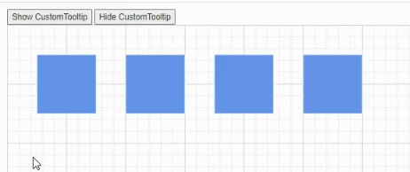

# Tooltip in Diagram Component

In a Graphical User Interface (GUI), a tooltip is an informative pop-up message that appears when the user hovers their cursor over an interactive element. The diagram component offers comprehensive tooltip support, enhancing user experience during various interactions. These tooltips are displayed when dragging, resizing, or rotating nodes, as well as when the mouse hovers over any diagram element, providing contextual information and improving overall usability.

## How to Show Default Tooltip

By default, an interactive tooltip displays crucial information about diagram elements during user interactions. This tooltip provides real-time data on size, position, and angle when users drag, resize, or rotate elements. The following images demonstrate how the diagram presents this node-specific information during various user interactions, enhancing the overall user experience and precision in element manipulation.

| Drag | Resize | Rotate |
|------|--------|--------|
| |  |  |

## How to Show Tooltip for Specific Nodes and Connectors

Tooltips can be shown when hovering over nodes or connectors. This powerful functionality allows for highly customizable tooltips, enabling unique information display for each individual node and connector within the diagram.

The following code example illustrates how to customize the tooltip for nodes.

```cshtml
@using Syncfusion.Blazor.Diagram
<SfDiagramComponent Width="1000px" Height="500px" Nodes="@nodes" />
@code
{
    DiagramObjectCollection<Node> nodes;

    protected override void OnInitialized()
    {
        nodes = new DiagramObjectCollection<Node>();
        Node node = new Node()
        {
            ID = "node1",
            OffsetX = 250,
            OffsetY = 250,
            Width = 100,
            Height = 100,
            Style = new ShapeStyle() 
            { 
                Fill = "#6495ED", 
                StrokeColor = "white" 
            },
            Tooltip = new DiagramTooltip(){Content="NodeTooltip"},
            Constraints = NodeConstraints.Default|NodeConstraints.Tooltip,
        };
        nodes.Add(node);
    }
}
```
A complete working sample can be downloaded from [GitHub](https://github.com/SyncfusionExamples/Blazor-Diagram-Examples/tree/master/UG-Samples/Tooltip/TooltipForSpecificNode)



The following code example illustrates how to customize the tooltip for connectors.

```cshtml
@using Syncfusion.Blazor.Diagram
@using Syncfusion.Blazor.Popups
<SfDiagramComponent Width="1000px" Height="500px" Connectors="connector" />
@code
{
    DiagramObjectCollection<Connector> connector;

    protected override void OnInitialized()
    {
        connector = new DiagramObjectCollection<Connector>();
        Connector connectors = new Connector()
        {
            ID = "Connector1",
            SourcePoint = new DiagramPoint() { X = 500, Y = 500 },
            TargetPoint = new DiagramPoint() { X = 600, Y = 400 },
            Tooltip = new DiagramTooltip(){Content="ConnectorTooltip"},
            Constraints =  ConnectorConstraints.Default|ConnectorConstraints.Tooltip ,
        };
        connector.Add(connectors);
    }
}
```
A complete working sample can be downloaded from [GitHub](https://github.com/SyncfusionExamples/Blazor-Diagram-Examples/tree/master/UG-Samples/Tooltip/TooltipForSpecificConnector)



## How to Set Tooltip Position for Nodes and Connectors

Tooltips can be attached to 12 predefined positions around the target element. When initializing the Tooltip, specify the desired location by setting the [Position](https://help.syncfusion.com/cr/blazor/Syncfusion.Blazor.Diagram.DiagramTooltip.html#Syncfusion_Blazor_Diagram_DiagramTooltip_Position) property to one of the following values:

* [TopLeft](https://help.syncfusion.com/cr/blazor/Syncfusion.Blazor.Popups.Position.html#Syncfusion_Blazor_Popups_Position_TopLeft)
* [TopCenter](https://help.syncfusion.com/cr/blazor/Syncfusion.Blazor.Popups.Position.html#Syncfusion_Blazor_Popups_Position_TopCenter)
* [TopRight](https://help.syncfusion.com/cr/blazor/Syncfusion.Blazor.Popups.Position.html#Syncfusion_Blazor_Popups_Position_TopRight)
* [BottomLeft](https://help.syncfusion.com/cr/blazor/Syncfusion.Blazor.Popups.Position.html#Syncfusion_Blazor_Popups_Position_BottomLeft)
* [BottomCenter](https://help.syncfusion.com/cr/blazor/Syncfusion.Blazor.Popups.Position.html#Syncfusion_Blazor_Popups_Position_BottomCenter)
* [BottomRight](https://help.syncfusion.com/cr/blazor/Syncfusion.Blazor.Popups.Position.html#Syncfusion_Blazor_Popups_Position_BottomRight)
* [LeftTop](https://help.syncfusion.com/cr/blazor/Syncfusion.Blazor.Popups.Position.html#Syncfusion_Blazor_Popups_Position_LeftTop)
* [LeftCenter](https://help.syncfusion.com/cr/blazor/Syncfusion.Blazor.Popups.Position.html#Syncfusion_Blazor_Popups_Position_LeftCenter)
* [LeftBottom](https://help.syncfusion.com/cr/blazor/Syncfusion.Blazor.Popups.Position.html#Syncfusion_Blazor_Popups_Position_LeftBottom)
* [RightTop](https://help.syncfusion.com/cr/blazor/Syncfusion.Blazor.Popups.Position.html#Syncfusion_Blazor_Popups_Position_RightTop)
* [`RightCenter](https://help.syncfusion.com/cr/blazor/Syncfusion.Blazor.Popups.Position.html#Syncfusion_Blazor_Popups_Position_RightCenter)
* [RightBottom`](https://help.syncfusion.com/cr/blazor/Syncfusion.Blazor.Popups.Position.html#Syncfusion_Blazor_Popups_Position_RightCenter)

N> By default, the Tooltip is placed at the BottomRight of the target element.

The following code example sets the tooltip position for the nodes.

```cshtml
@using Syncfusion.Blazor.Diagram
@using Syncfusion.Blazor.Popups
@using Syncfusion.Blazor.Buttons

<SfButton Content="Node Position" OnClick="@PositionChange" />
<SfDiagramComponent Width="1000px" Height="500px" Nodes="@nodes" />
@code
{
    //Define diagram's nodes collection
    DiagramObjectCollection<Node> nodes;

    protected override void OnInitialized()
    {

        //Intialize diagram's nodes collection
        nodes = new DiagramObjectCollection<Node>();
        Node node = new Node()
            {
                ID = "node1",
                OffsetX = 250,
                OffsetY = 250,
                Width = 100,
                Height = 100,
                Style = new ShapeStyle()
                {
                    Fill = "#6495ED",
                    StrokeColor = "white"
                },
                Tooltip = new DiagramTooltip() { Content = "NodeTooltip", Position = Position.TopCenter },
                Constraints = NodeConstraints.Default | NodeConstraints.Tooltip,
            };
        nodes.Add(node);
    }
    //Change position at run time.
    private void PositionChange()
    {
        nodes[0].Tooltip.Position = Position.RightCenter;
    }
}
```


A complete working sample can be downloaded from [GitHub](https://github.com/SyncfusionExamples/Blazor-Diagram-Examples/tree/master/UG-Samples/Tooltip/TooltipPositionforNode)

The following code example sets the tooltip position for the connectors.

```cshtml
@using Syncfusion.Blazor.Diagram
@using Syncfusion.Blazor.Popups
@using Syncfusion.Blazor.Buttons

<SfButton Content="Connector Position" OnClick="@PositionChange" />
<SfDiagramComponent Width="1000px" Height="500px" Connectors="connector" />
@code
{
    //Define diagram's connectors collection
    DiagramObjectCollection<Connector> connector;

    protected override void OnInitialized()
    {
        //Intialize diagram's connectors collection

        connector = new DiagramObjectCollection<Connector>();
        Connector connectors = new Connector()
            {
                ID = "Connector1",
                SourcePoint = new DiagramPoint() { X = 500, Y = 500 },
                TargetPoint = new DiagramPoint() { X = 600, Y = 400 },
                Tooltip = new DiagramTooltip() { Content = "ConnectorTooltip", Position = Position.TopCenter },
                Constraints = ConnectorConstraints.Default | ConnectorConstraints.Tooltip,
            };
        connector.Add(connectors);
    }
    //Change position at run time.
    private void PositionChange()
    {
        connector[0].Tooltip.Position = Position.RightCenter;
    }
}
```


A complete working sample can be downloaded from [GitHub](https://github.com/SyncfusionExamples/Blazor-Diagram-Examples/tree/master/UG-Samples/Tooltip/TooltipPositionForConnector)

## How to Set Tooltip Content for Nodes and Connectors

The Tooltip [Content](https://help.syncfusion.com/cr/blazor/Syncfusion.Blazor.Diagram.DiagramTooltip.html#Syncfusion_Blazor_Diagram_DiagramTooltip_Content) property accepts text or other informational content, which will be displayed as the primary message within the Tooltip when hovering over nodes or connectors.

The following code example sets the tooltip content for the nodes.

```cshtml
@using Syncfusion.Blazor.Diagram
@using Syncfusion.Blazor.Popups
@using Syncfusion.Blazor.Buttons

<SfButton Content="Node Content" OnClick="@ContentChange" />
<SfDiagramComponent Width="1000px" Height="500px" Nodes="@nodes" />
@code
{
    //Define diagram's nodes collection
    DiagramObjectCollection<Node> nodes;

    protected override void OnInitialized()
    {
        //Intialize diagram's nodes collection
        nodes = new DiagramObjectCollection<Node>();
        Node node = new Node()
            {
                ID = "node1",
                OffsetX = 250,
                OffsetY = 250,
                Width = 100,
                Height = 100,
                Style = new ShapeStyle()
                {
                    Fill = "#6495ED",
                    StrokeColor = "white"
                },
                Tooltip = new DiagramTooltip() { Content = "NodeTooltip" },
                Constraints = NodeConstraints.Default | NodeConstraints.Tooltip,
            };
        nodes.Add(node);
    }
    //Change Content at run time.
    private void ContentChange()
    {
        nodes[0].Tooltip.Content = "UpdateTooltipContent";
    }
}
```


A complete working sample can be downloaded from [GitHub](https://github.com/SyncfusionExamples/Blazor-Diagram-Examples/tree/master/UG-Samples/Tooltip/TooltipContentForNode)

The following code example sets the tooltip content for the connectors.

```cshtml
@using Syncfusion.Blazor.Diagram
@using Syncfusion.Blazor.Popups
@using Syncfusion.Blazor.Buttons

<SfButton Content="Connector Content" OnClick="@ContentChange" />
<SfDiagramComponent Width="1000px" Height="500px" Connectors="connector" />
@code
{
    DiagramObjectCollection<Connector> connector;

    protected override void OnInitialized()
    {
        connector = new DiagramObjectCollection<Connector>();
        Connector connectors = new Connector()
            {
                ID = "Connector1",
                SourcePoint = new DiagramPoint() { X = 500, Y = 500 },
                TargetPoint = new DiagramPoint() { X = 600, Y = 400 },
                Tooltip = new DiagramTooltip() { Content = "ConnectorTooltip" },
                Constraints = ConnectorConstraints.Default | ConnectorConstraints.Tooltip,
            };
        connector.Add(connectors);
    }
    //Change Content at run time.
    private void ContentChange()
    {
        connector[0].Tooltip.Content = "UpdateTooltipContent";
    }
}
```


A complete working sample can be downloaded from [GitHub](https://github.com/SyncfusionExamples/Blazor-Diagram-Examples/tree/master/UG-Samples/Tooltip/TooltipContentForConnector)

## How to Shows or Hides the Tip Pointer for Tooltip

The [ShowTipPointer](https://help.syncfusion.com/cr/blazor/Syncfusion.Blazor.Diagram.DiagramTooltip.html#Syncfusion_Blazor_Diagram_DiagramTooltip_ShowTipPointer) property controls the visibility of the tooltip pointer. Set it to **true** to display the pointer, or **false** to hide it. This property allows to customize the appearance of tooltips in your Blazor diagram.

The following code example is used to set the tooltip tip pointer for nodes.

```cshtml
@using Syncfusion.Blazor.Diagram
@using Syncfusion.Blazor.Popups
@using Syncfusion.Blazor.Buttons

<SfButton Content="Node TipPointer" OnClick="@TipPointerChange" />
<SfDiagramComponent Width="1000px" Height="500px" Nodes="@nodes" />
@code
{
    //Define diagram's nodes collection
    DiagramObjectCollection<Node> nodes;

    protected override void OnInitialized()
    {
        //Intialize diagram's nodes collection
        nodes = new DiagramObjectCollection<Node>();
        Node node = new Node()
            {
                ID = "node1",
                OffsetX = 250,
                OffsetY = 250,
                Width = 100,
                Height = 100,
                Style = new ShapeStyle()
                {
                    Fill = "#6495ED",
                    StrokeColor = "white"
                },
                //Set tooltip
                Tooltip = new DiagramTooltip() { Content = "NodeTooltip", ShowTipPointer = true },
                Constraints = NodeConstraints.Default | NodeConstraints.Tooltip,
            };
        nodes.Add(node);
    }
    //Change TipPointer at run time.
    private void TipPointerChange()
    {
        nodes[0].Tooltip.ShowTipPointer = false;
    }
}
```


A complete working sample can be downloaded from [GitHub](https://github.com/SyncfusionExamples/Blazor-Diagram-Examples/tree/master/UG-Samples/Tooltip/TipPointerForNodeTooltip)

The following code example is used to set the tooltip tip pointer for connectors.

```cshtml
@using Syncfusion.Blazor.Diagram
@using Syncfusion.Blazor.Popups
@using Syncfusion.Blazor.Buttons

<SfButton Content="Connector TipPointer" OnClick="@TipPointerChange" />
<SfDiagramComponent Width="1000px" Height="500px" Connectors="connector" />
@code
{
    //Define diagram's connectors collection
    DiagramObjectCollection<Connector> connector;

    protected override void OnInitialized()
    {
        //Intialize diagram's connectors collection
        connector = new DiagramObjectCollection<Connector>();
        Connector connectors = new Connector()
            {
                ID = "Connector1",
                SourcePoint = new DiagramPoint() { X = 500, Y = 500 },
                TargetPoint = new DiagramPoint() { X = 600, Y = 400 },
                //Set tooltip
                Tooltip = new DiagramTooltip() { Content = "ConnectorTooltip", ShowTipPointer = true },
                Constraints = ConnectorConstraints.Default | ConnectorConstraints.Tooltip,
            };
        connector.Add(connectors);
    }
    //Change the TipPointer at run time.
    private void TipPointerChange()
    {
        connector[0].Tooltip.ShowTipPointer = false;
    }
}
```


A complete working sample can be downloaded from [GitHub](https://github.com/SyncfusionExamples/Blazor-Diagram-Examples/tree/master/UG-Samples/Tooltip/TipPointerForConnectorTooltip)

## How to Customize Tooltip Using Template
For advanced customization of tooltip content or to create a unique visual structure, use the [TooltipTemplate](https://help.syncfusion.com/cr/blazor/Syncfusion.Blazor.Diagram.DiagramTemplates.html#Syncfusion_Blazor_Diagram_DiagramTemplates_TooltipTemplate) property of the `SfDiagramComponent`. This enables tailored tooltip elements that enhance the user experience and provide more detailed or context-specific information.

The following code example illustrates how to add formatted template content to the tooltip for nodes.

```cshtml
@using Syncfusion.Blazor.Diagram
@using Syncfusion.Blazor.Buttons

<SfDiagramComponent Width="1000px" Height="500px" Nodes="@nodes" >
    <DiagramTemplates>
        <TooltipTemplate>
            @{
                if (context is Node)
                {
                    <div><p>Product Name : Diagram</p><p>Element: Node</p><p>Content: Node Tooltip </p></div>
                }
            }
        </TooltipTemplate>
    </DiagramTemplates>
</SfDiagramComponent>
@code
{
    //Define diagram's nodes collection
    DiagramObjectCollection<Node> nodes;

    protected override void OnInitialized()
    {
        //Intialize diagram's nodes collection
        nodes = new DiagramObjectCollection<Node>();
        Node node = new Node()
            {
                ID = "node1",
                OffsetX = 250,
                OffsetY = 250,
                Width = 100,
                Height = 100,
                Style = new ShapeStyle()
                {
                    Fill = "#6495ED",
                    StrokeColor = "white"
                },
                Tooltip = new DiagramTooltip(),
                Constraints = NodeConstraints.Default | NodeConstraints.Tooltip,
            };
        nodes.Add(node);
    }
}
```


A complete working sample can be downloaded from [GitHub](https://github.com/SyncfusionExamples/Blazor-Diagram-Examples/tree/master/UG-Samples/Tooltip/TooltipTemplateForNode)


The following code example illustrates how to add formatted template content to the tooltip for connectors.

```cshtml
@using Syncfusion.Blazor.Diagram
@using Syncfusion.Blazor.Popups
@using Syncfusion.Blazor.Buttons

<SfDiagramComponent Width="1000px" Height="500px" Connectors="connector">
    <DiagramTemplates>
        <TooltipTemplate>
            @{
                if (context is Connector)
                {
                    <div><p>Product Name : Diagram</p><p>Element: Node</p><p>Content: Node Tooltip </p></div>
                }
            }
        </TooltipTemplate>
    </DiagramTemplates>
</SfDiagramComponent>
@code
{
    //Define diagram's connectors collection
    DiagramObjectCollection<Connector> connector;

    protected override void OnInitialized()
    {
        //Intialize diagram's connectors collection

        connector = new DiagramObjectCollection<Connector>();
        Connector connectors = new Connector()
            {
                ID = "Connector1",
                SourcePoint = new DiagramPoint() { X = 500, Y = 500 },
                TargetPoint = new DiagramPoint() { X = 600, Y = 400 },
                Tooltip = new DiagramTooltip(),
                Constraints = ConnectorConstraints.Default | ConnectorConstraints.Tooltip,
            };
        connector.Add(connectors);
    }
}
```


A complete working sample can be downloaded from [GitHub](https://github.com/SyncfusionExamples/Blazor-Diagram-Examples/tree/master/UG-Samples/Tooltip/TooltipTemplateForConnector)

>**Note:**  When the content propoerty of the tooltip is also defined with the template for either node , connector or diagram, only the  content will get rendered. The template content will get rendered only when the content property is undefined.

## How to Animate Tooltip

To animate the tooltip, a set of specific animation effects are available, and it can be controlled by using the animation property. The [Animation](https://help.syncfusion.com/cr/blazor/Syncfusion.Blazor.Diagram.DiagramTooltip.html#Syncfusion_Blazor_Diagram_DiagramTooltip_AnimationSettings) property also allows to set delay, duration, and various other effects of your choice.

The following code example illustrates how to set animation for tooltip on nodes.

```cshtml
@using Syncfusion.Blazor.Diagram
@using Syncfusion.Blazor.Popups
@using Syncfusion.Blazor.Buttons

<SfButton Content="Node Animation" OnClick="@AnimationChange" />
<SfDiagramComponent Width="1000px" Height="500px" Nodes="@nodes" />
@code
{
    //Define diagram's nodes collection
    DiagramObjectCollection<Node> nodes;

    protected override void OnInitialized()
    {
        //Initialize the diagram's nodes collection
        nodes = new DiagramObjectCollection<Node>();
        Node node = new Node()
            {
                ID = "node1",
                OffsetX = 250,
                OffsetY = 250,
                Width = 100,
                Height = 100,
                Style = new ShapeStyle()
                {
                    Fill = "#6495ED",
                    StrokeColor = "white"
                },
                Tooltip = new DiagramTooltip()
                {
                    Content = "NodeTooltip",
                    AnimationSettings = new AnimationModel()
                    {
                        Open = new TooltipAnimationSettings() { Effect = Effect.None },
                        Close = new TooltipAnimationSettings() { Effect = Effect.None }
                    }
                },
                Constraints = NodeConstraints.Default | NodeConstraints.Tooltip,
            };
        nodes.Add(node);
    }
    //Change the Animation at run time.
    private void AnimationChange()
    {
        nodes[0].Tooltip.AnimationSettings = new AnimationModel()
            {
                Open = new TooltipAnimationSettings() { Effect = Effect.FadeZoomIn, Duration = 100 },
                Close = new TooltipAnimationSettings() { Effect = Effect.FadeZoomOut, Duration = 50 }
            };
    }
}
```


A complete working sample can be downloaded from [GitHub](https://github.com/SyncfusionExamples/Blazor-Diagram-Examples/tree/master/UG-Samples/Tooltip/TooltipAnimationForNode)

The following code example illustrates how to set animation for tooltips on connectors.

```cshtml
@using Syncfusion.Blazor.Diagram
@using Syncfusion.Blazor.Popups
@using Syncfusion.Blazor.Buttons

<SfButton Content="Connector Animation" OnClick="@AnimationChange" />
<SfDiagramComponent Width="1000px" Height="500px" Connectors="connector" />
@code
{
    //Define diagram's connectors collection
    DiagramObjectCollection<Connector> connector;

    protected override void OnInitialized()
    {
        //Initialize diagram's connectors collection
        connector = new DiagramObjectCollection<Connector>();
        Connector connectors = new Connector()
            {
                ID = "Connector1",
                SourcePoint = new DiagramPoint() { X = 500, Y = 500 },
                TargetPoint = new DiagramPoint() { X = 600, Y = 400 },
                Tooltip = new DiagramTooltip()
                {
                    Content = "ConnectorTooltip",
                    AnimationSettings = new AnimationModel()
                    {
                        Open = new TooltipAnimationSettings() { Effect = Effect.None },
                        Close = new TooltipAnimationSettings() { Effect = Effect.None }
                    }
                },
                Constraints = ConnectorConstraints.Default | ConnectorConstraints.Tooltip,
            };
        connector.Add(connectors);
    }
    //Change the Animation at run time.
    private void AnimationChange()
    {
        connector[0].Tooltip.AnimationSettings = new AnimationModel()
            {
                Open = new TooltipAnimationSettings() { Effect = Effect.ZoomIn, Duration = 500 },
                Close = new TooltipAnimationSettings() { Effect = Effect.ZoomOut, Duration = 500 }
            };
    }
}
```


A complete working sample can be downloaded from [GitHub](https://github.com/SyncfusionExamples/Blazor-Diagram-Examples/tree/master/UG-Samples/Tooltip/TooltipAnimationForConnector)

## How to Customize Tooltip Open Mode

The Tooltip activation mode can be customized to determine how it appears on the page. Configure it to open when hovering over, focusing on, or clicking the target element. To set this behavior, use the [OpensOn](https://help.syncfusion.com/cr/blazor/Syncfusion.Blazor.Diagram.DiagramTooltip.html#Syncfusion_Blazor_Diagram_DiagramTooltip_OpensOn) property when initializing the Tooltip. Choose one of the following values to define the desired interaction:

* `Auto`
* `Hover`
* `Custom`
* `Click`


N> By default, the Tooltip open mode is Auto.

The following code example illustrates how to set the open mode for tooltips on nodes.

```cshtml
@using Syncfusion.Blazor.Diagram
@using Syncfusion.Blazor.Popups
@using Syncfusion.Blazor.Buttons

<SfButton Content="Show CustomTooltip" OnClick="@show" />
<SfButton Content="Hide CustomTooltip" OnClick="@hide" />

<SfDiagramComponent @ref="@diagram" Width="1000px" Height="500px" Nodes="@nodes" />
@code
{
    //Define diagram's nodes collection
    DiagramObjectCollection<Node> nodes;
    //Reference the diagram
    SfDiagramComponent diagram;
    protected override void OnInitialized()
    {
        //Intialize diagram's nodes collection
        nodes = new DiagramObjectCollection<Node>();
        Node node = new Node()
            {
                ID = "node1",
                OffsetX = 100,
                OffsetY = 100,
                Width = 100,
                Height = 100,
                Style = new ShapeStyle()
                {
                    Fill = "#6495ED",
                    StrokeColor = "white"
                },
                Tooltip = new DiagramTooltip() { Content = "Auto", OpensOn = "Auto", Position = Position.BottomCenter },
                Constraints = NodeConstraints.Default | NodeConstraints.Tooltip,
            };
        Node node1 = new Node()
            {
                ID = "node2",
                OffsetX = 250,
                OffsetY = 100,
                Width = 100,
                Height = 100,
                Style = new ShapeStyle()
                {
                    Fill = "#6495ED",
                    StrokeColor = "white"
                },
                Tooltip = new DiagramTooltip() { Content = "Hover", OpensOn = "Hover" },
                Constraints = NodeConstraints.Default | NodeConstraints.Tooltip,
            };
        Node node2 = new Node()
            {
                ID = "node3",
                OffsetX = 400,
                OffsetY = 100,
                Width = 100,
                Height = 100,
                Style = new ShapeStyle()
                {
                    Fill = "#6495ED",
                    StrokeColor = "white"
                },
                Tooltip = new DiagramTooltip() { Content = "Custom", OpensOn = "Custom" },
                Constraints = NodeConstraints.Default | NodeConstraints.Tooltip,
            };
        Node node3 = new Node()
            {
                ID = "node4",
                OffsetX = 550,
                OffsetY = 100,
                Width = 100,
                Height = 100,
                Style = new ShapeStyle()
                {
                    Fill = "#6495ED",
                    StrokeColor = "white"
                },
                Tooltip = new DiagramTooltip() { Content = "Click", OpensOn = "Click" },
                Constraints = NodeConstraints.Default | NodeConstraints.Tooltip,
            };
        nodes.Add(node);
        nodes.Add(node1);
        nodes.Add(node2);
        nodes.Add(node3);
    }
    //Method to show tooltip
    private void show()
    {
        diagram.ShowTooltipAsync(diagram.Nodes[2] as NodeBase);
    }
    //Method to hide tooltip
    private void hide()
    {
        diagram.HideTooltipAsync(diagram.Nodes[2] as NodeBase);
    }
}
```


A complete working sample can be downloaded from [GitHub](https://github.com/SyncfusionExamples/Blazor-Diagram-Examples/tree/master/UG-Samples/Tooltip/TooltipOpenModeForNode)

| | 

The following code example illustrates how to set the open mode for tooltips on connectors.

```cshtml
@using Syncfusion.Blazor.Diagram
@using Syncfusion.Blazor.Popups
@using Syncfusion.Blazor.Buttons

<SfButton Content="Show CustomTooltip" OnClick="@show" />
<SfButton Content="Hide CustomTooltip" OnClick="@hide" />
<SfDiagramComponent @ref="@diagram" Width="1000px" Height="500px" Connectors="connector" />
@code
{
    //Define diagram's connectors collection
    DiagramObjectCollection<Connector> connector;
    //Refrence the diagram
    SfDiagramComponent diagram;
    protected override void OnInitialized()
    {
        //Intialize diagram's nodes collection
        connector = new DiagramObjectCollection<Connector>();
        Connector connectors = new Connector()
            {
                ID = "Connector1",
                SourcePoint = new DiagramPoint() { X = 100, Y = 200 },
                TargetPoint = new DiagramPoint() { X = 200, Y = 100 },
                Tooltip = new DiagramTooltip() { Content = "Auto", OpensOn = "Auto" },
                Constraints = ConnectorConstraints.Default | ConnectorConstraints.Tooltip,
            };
        Connector connectors1 = new Connector()
            {
                ID = "Connector2",
                SourcePoint = new DiagramPoint() { X = 300, Y = 200 },
                TargetPoint = new DiagramPoint() { X = 400, Y = 100 },
                Tooltip = new DiagramTooltip() { Content = "Hover", OpensOn = "Hover" },
                Constraints = ConnectorConstraints.Default | ConnectorConstraints.Tooltip,
            };
        Connector connectors2 = new Connector()
            {
                ID = "Connector3",
                SourcePoint = new DiagramPoint() { X = 500, Y = 200 },
                TargetPoint = new DiagramPoint() { X = 600, Y = 100 },
                Tooltip = new DiagramTooltip() { Content = "Custom", OpensOn = "Custom" },
                Constraints = ConnectorConstraints.Default | ConnectorConstraints.Tooltip,
            };
        Connector connectors3 = new Connector()
            {
                ID = "Connector4",
                SourcePoint = new DiagramPoint() { X = 700, Y = 200 },
                TargetPoint = new DiagramPoint() { X = 800, Y = 100 },
                Tooltip = new DiagramTooltip() { Content = "Click", OpensOn = "Click" },
                Constraints = ConnectorConstraints.Default | ConnectorConstraints.Tooltip,
            };
        connector.Add(connectors);
        connector.Add(connectors1);
        connector.Add(connectors2);
        connector.Add(connectors3);
    }
    //Method to show tooltip
    private void show()
    {
        diagram.ShowTooltipAsync(diagram.Connectors[2] as NodeBase);
    }
    //Method to hide tooltip
    private void hide()
    {
        diagram.HideTooltipAsync(diagram.Connectors[2] as NodeBase);
    }
}
```


A complete working sample can be downloaded from [GitHub](https://github.com/SyncfusionExamples/Blazor-Diagram-Examples/tree/master/UG-Samples/Tooltip/TooltipOpenModeForConnector)

## How to Enable Sticky Mode

Tooltips for nodes and connectors can be configured to remain visible until manually dismissed, a feature known as "sticky" tooltips. When enabled, a close icon appears in the top-right corner of the tooltip, allowing users to explicitly close it when desired.

To enable or disable this sticky mode, use the `IsSticky` property in the tooltip configuration. By default, the `IsSticky` property is set to `false`.

N> The tooltip will have an open and close state whenever the mouse hovers over different diagram elements. Only one "sticky" tooltip can be visible in the diagram at a time.

The following code example demonstrates how to set `IsSticky` property to **true** for a node:

```cshtml
@using Syncfusion.Blazor.Diagram
@using Syncfusion.Blazor.Popups
@using Syncfusion.Blazor.Buttons
<SfDiagramComponent @ref="@diagram" Width="1000px" Height="500px" Nodes="@nodes" />
@code
{
    //Define diagram's nodes collection
    DiagramObjectCollection<Node> nodes;
    //Reference the diagram
    SfDiagramComponent diagram;
    protected override void OnInitialized()
    {
        //Intialize diagram's nodes collection
        nodes = new DiagramObjectCollection<Node>();
        Node node = new Node()
            {
                ID = "node1",
                OffsetX = 100,
                OffsetY = 100,
                Width = 100,
                Height = 100,
                Style = new ShapeStyle()
                {
                    Fill = "#6495ED",
                    StrokeColor = "white"
                },
                Tooltip = new DiagramTooltip() { Content = "Tooltip", IsSticky=true },
                Constraints = NodeConstraints.Default | NodeConstraints.Tooltip,
            };
        nodes.Add(node);
    }
}
```
A complete working sample can be downloaded from [GitHub](https://github.com/SyncfusionExamples/Blazor-Diagram-Examples/tree/master/UG-Samples/Tooltip/)



The following code example demonstrates how to set `IsSticky` property to **true** for a connector:

```cshtml
@using Syncfusion.Blazor.Diagram
@using Syncfusion.Blazor.Popups
@using Syncfusion.Blazor.Buttons
<SfDiagramComponent @ref="@diagram" Width="1000px" Height="500px" Connectors="connectors" />
@code
{
    //Define diagram's connectors collection
    DiagramObjectCollection<Connector> connectors;
    //Refrence the diagram
    SfDiagramComponent diagram;
    protected override void OnInitialized()
    {
        //Intialize diagram's nodes collection
        connectors = new DiagramObjectCollection<Connector>();
        Connector connector = new Connector()
            {
                ID = "Connector1",
                SourcePoint = new DiagramPoint() { X = 100, Y = 200 },
                TargetPoint = new DiagramPoint() { X = 200, Y = 100 },
                Tooltip = new DiagramTooltip() { Content = "Tooltip", IsSticky=true  },
                Constraints = ConnectorConstraints.Default | ConnectorConstraints.Tooltip,
            };
        connectors.Add(connector);
    }
}
```
A complete working sample can be downloaded from [GitHub](https://github.com/SyncfusionExamples/Blazor-Diagram-Examples/tree/master/UG-Samples/Tooltip/)



For more information about tooltip, refer to [Tooltip](https://blazor.syncfusion.com/documentation/diagram/tool-tip)

## How to Set Tooltip for User Handles

The Diagram component offers robust tooltip functionality for [UserHandles](https://help.syncfusion.com/cr/blazor/Syncfusion.Blazor.Diagram.SelectorConstraints.html#Syncfusion_Blazor_Diagram_SelectorConstraints_UserHandle), enhancing user interaction. To implement this feature, configure the `Tooltip` property of the `UserHandle` with the desired [Content](https://help.syncfusion.com/cr/blazor/Syncfusion.Blazor.Diagram.DiagramTooltip.html#Syncfusion_Blazor_Diagram_DiagramTooltip_Content) and specify its [Position](https://help.syncfusion.com/cr/blazor/Syncfusion.Blazor.Diagram.DiagramTooltip.html#Syncfusion_Blazor_Diagram_DiagramTooltip_Position). This setup ensures that informative tooltips appear at the optimal location when users hover over the handles, providing a more intuitive and user-friendly diagramming experience.

By default, tooltips are not displayed. Need to explicitly configure the tooltip settings as shown in the following example:

```cshtml
@using Syncfusion.Blazor.Diagram

<SfDiagramComponent Height="600px"
                    Nodes="@nodes"
                    SelectionSettings="@SelectedModel">
</SfDiagramComponent>

@code
{
    DiagramObjectCollection<Node> nodes = new DiagramObjectCollection<Node>();
    DiagramSelectionSettings SelectedModel = new DiagramSelectionSettings();
    DiagramObjectCollection<UserHandle> UserHandles = new DiagramObjectCollection<UserHandle>();
    protected override void OnInitialized()
    {
        UserHandle cloneHandle = new UserHandle()
        {
            Name = "clone",
            PathData = "M60.3,18H27.5c-3,0-5.5,2.4-5.5,5.5v38.2h5.5V23.5h32.7V18z M68.5,28.9h-30c-3,0-5.5,2.4-5.5,5.5v38.2c0,3,2.4,5.5,5.5,5.5h30c3,0,5.5-2.4,5.5-5.5V34.4C73.9,31.4,71.5,28.9,68.5,28.9z M68.5,72.5h-30V34.4h30V72.5z",
            Visible = true,
            Offset = 0,
            Side = Direction.Right,
            Margin = new DiagramThickness() { Top = 0, Bottom = 0, Left = 0, Right = 0 },
            Tooltip = new DiagramTooltip() { Content = "CloneNode" }
        };
        UserHandles = new DiagramObjectCollection<UserHandle>()
        {
            cloneHandle
        };
        SelectedModel.UserHandles = UserHandles;
        nodes = new DiagramObjectCollection<Node>();
        Node diagramNode = new Node()
        {
            ID = "node1",
            OffsetX = 100,
            OffsetY = 100,
            Width = 100,
            Height = 100,
            Style = new ShapeStyle() { Fill = "#6495ED", StrokeColor = "none" },
            Annotations = new DiagramObjectCollection<ShapeAnnotation>() { new ShapeAnnotation { Content = "Node" } }
        };
        nodes.Add(diagramNode);
    }
}
```
A complete working sample can be downloaded from [GitHub](https://github.com/SyncfusionExamples/Blazor-Diagram-Examples/tree/master/UG-Samples/UserHandle/UserHandleTooltip)



### How to Set Sticky Tooltip for User Handles

Tooltips for user handles can be configured to remain visible until manually dismissed, a feature known as "sticky" tooltips. When enabled, a close icon appears in the top-right corner of the tooltip, allowing users to explicitly close it when desired.

To enable or disable this sticky mode, use the `IsSticky` property in the tooltip configuration. By default, the `IsSticky` property is set to `false`.

N> The tooltip will have an open and close state whenever the mouse hovers over different diagram elements. Only one "sticky" tooltip can be visible in the diagram at a time.

The following code example demonstrates how to set `IsSticky` property to **true** for a user handle:

```cshtml
@using Syncfusion.Blazor.Diagram

<SfDiagramComponent Height="600px"
                    Nodes="@nodes"
                    SelectionSettings="@SelectedModel">
</SfDiagramComponent>

@code
{
    DiagramObjectCollection<Node> nodes = new DiagramObjectCollection<Node>();
    DiagramSelectionSettings SelectedModel = new DiagramSelectionSettings();
    DiagramObjectCollection<UserHandle> UserHandles = new DiagramObjectCollection<UserHandle>();
    protected override void OnInitialized()
    {
        UserHandle cloneHandle = new UserHandle()
        {
            Name = "clone",
            PathData = "M60.3,18H27.5c-3,0-5.5,2.4-5.5,5.5v38.2h5.5V23.5h32.7V18z M68.5,28.9h-30c-3,0-5.5,2.4-5.5,5.5v38.2c0,3,2.4,5.5,5.5,5.5h30c3,0,5.5-2.4,5.5-5.5V34.4C73.9,31.4,71.5,28.9,68.5,28.9z M68.5,72.5h-30V34.4h30V72.5z",
            Visible = true,
            Offset = 0,
            Side = Direction.Right,
            Margin = new DiagramThickness() { Top = 0, Bottom = 0, Left = 0, Right = 0 },
            Tooltip = new DiagramTooltip() { Content = "CloneNode",IsSticky = true }
        };
        UserHandles = new DiagramObjectCollection<UserHandle>()
        {
            cloneHandle
        };
        SelectedModel.UserHandles = UserHandles;
        nodes = new DiagramObjectCollection<Node>();
        Node diagramNode = new Node()
        {
            ID = "node1",
            OffsetX = 100,
            OffsetY = 100,
            Width = 100,
            Height = 100,
            Style = new ShapeStyle() { Fill = "#6495ED", StrokeColor = "none" },
            Annotations = new DiagramObjectCollection<ShapeAnnotation>() { new ShapeAnnotation { Content = "Node" } }
        };
        nodes.Add(diagramNode);
    }
}
```
A complete working sample can be downloaded from [GitHub](https://github.com/SyncfusionExamples/Blazor-Diagram-Examples/tree/master/UG-Samples/UserHandle/UserHandleIsSticky/)



## How to Set Tooltip for Fixed User Handle

The diagram component offers robust tooltip functionality for [FixedUserHandles](https://help.syncfusion.com/cr/blazor/Syncfusion.Blazor.Diagram.FixedUserHandle.html), enhancing user interaction and information display. To enable this feature, configure the tooltip property within the diagram model. Specifically, define the tooltip [Content](https://help.syncfusion.com/cr/blazor/Syncfusion.Blazor.Diagram.DiagramTooltip.html#Syncfusion_Blazor_Diagram_DiagramTooltip_Content) and set its [Position](https://help.syncfusion.com/cr/blazor/Syncfusion.Blazor.Diagram.DiagramTooltip.html#Syncfusion_Blazor_Diagram_DiagramTooltip_Position) relative to the handle. This configuration ensures that when users hover over a fixed user handle, contextual information appears at the specified location. It's important to note that tooltips are disabled by default and require explicit activation through these settings. Need to add the tooltip as shown in the following example.

```cshtml
@using Syncfusion.Blazor.Diagram

<SfDiagramComponent Height="600px" Nodes="@nodes" />

@code
{
    DiagramObjectCollection<Node> nodes = new DiagramObjectCollection<Node>();

    protected override void OnInitialized()
    {
        nodes = new DiagramObjectCollection<Node>();
        Node node1 = new Node()
        {
            OffsetX = 250,
            OffsetY = 250,
            Width = 100,
            Height = 100,
            Style = new ShapeStyle() { Fill = "#6495ED", StrokeColor = "white" },
            FixedUserHandles = new DiagramObjectCollection<NodeFixedUserHandle>()
            {
                new NodeFixedUserHandle() 
                { 
                    ID = "user1",
                    Height = 20, 
                    Width = 20, 
                    Visibility = true,
                    Padding = new DiagramThickness() { Bottom = 1, Left = 1, Right = 1, Top = 1 }, 
                    Margin = new DiagramThickness() { Right = 20 }, Offset = new DiagramPoint() { X = 0 , Y = 0 }, 
                    PathData = "M60.3,18H27.5c-3,0-5.5,2.4-5.5,5.5v38.2h5.5V23.5h32.7V18z M68.5,28.9h-30c-3,0-5.5,2.4-5.5,5.5v38.2c0,3,2.4,5.5,5.5,5.5h30c3,0,5.5-2.4,5.5-5.5V34.4C73.9,31.4,71.5,28.9,68.5,28.9z M68.5,72.5h-30V34.4h30V72.5z",
                    Tooltip = new DiagramTooltip(){Content="CloneNode", Position=Position.BottomLeft},
                },
            }
        };
        nodes.Add(node1);
    }
}
```
A complete working sample can be downloaded from [GitHub](https://github.com/SyncfusionExamples/Blazor-Diagram-Examples/tree/master/UG-Samples/UserHandle/FixedUserHandleTooltip)



### How to Set Sticky Tooltip for Fixed User Handles

When `IsSticky` property of the tooltip is set to **true**, tooltips for fixed user handles will remain visible on the screen until the user explicitly dismisses them by clicking the close icon. In this mode, a close icon is added to the top-right corner of the tooltip. This persistent tooltip behavior can be enabled or disabled using the `IsSticky` property. By default, the `IsSticky` property is set to **false**, meaning tooltips will disappear automatically when the user moves the mouse away from the handle.

The following code example demonstrates how to set `IsSticky` property to true for a fixed user handle:

```cshtml
@using Syncfusion.Blazor.Diagram

<SfDiagramComponent Height="600px" Nodes="@nodes" />

@code
{
    DiagramObjectCollection<Node> nodes = new DiagramObjectCollection<Node>();

    protected override void OnInitialized()
    {
        nodes = new DiagramObjectCollection<Node>();
        Node node1 = new Node()
        {
            OffsetX = 250,
            OffsetY = 250,
            Width = 100,
            Height = 100,
            Style = new ShapeStyle() { Fill = "#6495ED", StrokeColor = "white" },
            FixedUserHandles = new DiagramObjectCollection<NodeFixedUserHandle>()
            {
                new NodeFixedUserHandle() 
                { 
                    ID = "user1",
                    Height = 20, 
                    Width = 20, 
                    Visibility = true,
                    Padding = new DiagramThickness() { Bottom = 1, Left = 1, Right = 1, Top = 1 }, 
                    Margin = new DiagramThickness() { Right = 20 }, Offset = new DiagramPoint() { X = 0 , Y = 0 }, 
                    PathData = "M60.3,18H27.5c-3,0-5.5,2.4-5.5,5.5v38.2h5.5V23.5h32.7V18z M68.5,28.9h-30c-3,0-5.5,2.4-5.5,5.5v38.2c0,3,2.4,5.5,5.5,5.5h30c3,0,5.5-2.4,5.5-5.5V34.4C73.9,31.4,71.5,28.9,68.5,28.9z M68.5,72.5h-30V34.4h30V72.5z",
                    Tooltip = new DiagramTooltip(){Content="CloneNode", IsSticky=true},
                },
            }
        };
        nodes.Add(node1);
    }
}
```
A complete working sample can be downloaded from [GitHub](https://github.com/SyncfusionExamples/Blazor-Diagram-Examples/tree/master/UG-Samples/UserHandle/FixedUserHandleIsSticky)



## How to Set Tooltip for Ports

The Diagram component offers robust support for displaying tooltips when the mouse hovers over ports. This feature can be customized for each port individually, allowing for a more informative and interactive user experience.

To implement a tooltip for a port, you need to utilize the Tooltip property of the port object. This property provides options to define the tooltip's [Content](https://help.syncfusion.com/cr/blazor/Syncfusion.Blazor.Diagram.DiagramTooltip.html#Syncfusion_Blazor_Diagram_DiagramTooltip_Content) and [Position](https://help.syncfusion.com/cr/blazor/Syncfusion.Blazor.Diagram.DiagramTooltip.html#Syncfusion_Blazor_Diagram_DiagramTooltip_Position). By configuring these attributes, you can create tailored tooltips that enhance the functionality and usability of your diagram.

By default, tooltips are not displayed. To display a tooltip, you must explicitly configure the tooltip settings for each port as shown in the following example:


```cshtml
@using Syncfusion.Blazor.Diagram
<SfDiagramComponent Width="1000px" Height="500px" Nodes="@nodes"  />
@code
{
    DiagramObjectCollection<Node> nodes;
    
    protected override void OnInitialized()
    {
        nodes = new DiagramObjectCollection<Node>();
        Node node = new Node()
        {
            ID = "node1",
            OffsetX = 250,
            OffsetY = 250,
            Width = 100,
            Height = 100,
            Style = new ShapeStyle() 
            { 
                Fill = "#6495ED", 
                StrokeColor = "white" 
            },
            Ports = new DiagramObjectCollection<PointPort>()
            {
                new PointPort(){
                    ID="Port1",
                    Style = new ShapeStyle(){ Fill = "gray" },
                    Offset = new DiagramPoint() { X = 1, Y = 0.5 },
                    Visibility = PortVisibility.Visible,
                    Tooltip = new DiagramTooltip(){ Content = "OutConnectPort"},
                    Constraints = PortConstraints.Default | PortConstraints.Draw
                } 
            }
        };
        nodes.Add(node);
        Node node2 = new Node()
        {
             ID = "node2",
             OffsetX = 450,
             OffsetY = 250,
             Width = 100,
             Height = 100,
             Style = new ShapeStyle()
             {
                 Fill = "#6495ED",
                 StrokeColor = "white"
             },
             Ports = new DiagramObjectCollection<PointPort>()
             {
                 new PointPort()
                 {
                    ID="Port2",
                    Style = new ShapeStyle(){ Fill = "gray" },
                    Offset = new DiagramPoint() { X = 0, Y = 0.5},
                    Visibility = PortVisibility.Visible,
                    Tooltip = new DiagramTooltip(){ Content = "InConnectPort"},
                    Constraints = PortConstraints.Default | PortConstraints.Draw
                 }
             }
        };
        nodes.Add(node2);  
    }
}
```
A complete working sample can be downloaded from [GitHub](https://github.com/SyncfusionExamples/Blazor-Diagram-Examples/tree/master/UG-Samples/Ports/ActionofPorts/TooltipForSpecificPort)



### How to Set Sticky Tooltip for Ports

Enhance the diagram's user experience with sticky tooltips for ports. This feature allows tooltips to remain visible until explicitly closed, providing users with persistent information. When enabled, a close icon appears in the top-right corner of the tooltip, empowering users to dismiss it at their convenience.

To enable or disable this sticky mode, use the `IsSticky` property in the tooltip configuration. By default, the `IsSticky` property is set to `false`.

N> The tooltip will have an open and close state whenever the mouse hovers over different diagram elements. Only one "sticky" tooltip can be visible in the diagram at a time.

The following code example demonstrates how to set `IsSticky` property to **true** for a ports:

```cshtml
@using Syncfusion.Blazor.Diagram
@using Syncfusion.Blazor.Popups
@using Syncfusion.Blazor.Buttons
<SfDiagramComponent @ref="@diagram" Width="1000px" Height="500px" Nodes="@nodes" />
@code
{
    //Define diagram's nodes collection
    DiagramObjectCollection<Node> nodes;
    //Reference the diagram
    SfDiagramComponent diagram;
    protected override void OnInitialized()
    {
        //Intialize diagram's nodes collection
        nodes = new DiagramObjectCollection<Node>();
        Node node = new Node()
            {
                ID = "node1",
                OffsetX = 100,
                OffsetY = 100,
                Width = 100,
                Height = 100,
                Style = new ShapeStyle()
                {
                    Fill = "#6495ED",
                    StrokeColor = "white"
                },
                Tooltip = new DiagramTooltip() { Content = "NodeContent", IsSticky = true },
                Constraints = NodeConstraints.Default | NodeConstraints.Tooltip,
                Ports = new DiagramObjectCollection<PointPort>()
                {
                new PointPort(){
                    ID="Port1",
                    Style = new ShapeStyle(){ Fill = "gray" },
                    Offset = new DiagramPoint() { X = 1, Y = 0.5 },
                    Visibility = PortVisibility.Visible,
                    Tooltip = new DiagramTooltip(){ Content = "PortContent" , IsSticky = true},
                    Constraints = PortConstraints.Default | PortConstraints.Draw
                }
                },
            };
        nodes.Add(node);
    }
}
```
A complete working sample can be downloaded from [GitHub](https://github.com/SyncfusionExamples/Blazor-Diagram-Examples/tree/master/UG-Samples/Tooltip/)




## See also

* [How to Prevent Text Overflow and Display Excess Content on Hover in a Diagram](https://support.syncfusion.com/kb/article/18726/how-to-prevent-text-overflow-and-display-excess-content-on-hover-in-a-diagram)
