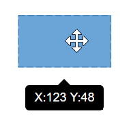

# Tooltip in Blazor Diagram Component

In Graphical User Interface (GUI), the tooltip is a message that is displayed when mouse hovers over an element. The diagram provides tooltip support while dragging, resizing, rotating a node, and when the mouse hovers any diagram element.

## Default tooltip

By default, diagram displays a tooltip to provide the size, position, and angle related information while dragging, resizing, and rotating. The following images illustrate how the diagram displays the node information during an interaction.

| Drag | Resize | Rotate |
|------|--------|--------|
| |  |  |

## Common tooltip for all nodes and connectors

The diagram provides support to show tooltip when the mouse hovers over any node/connector. To show tooltip on mouse over, the [Tooltip](https://help.syncfusion.com/cr/blazor/Syncfusion.Blazor.Diagrams.DiagramTooltip.html) property of diagram model needs to be set with the tooltip `Content` and `Position` as shown in the following example.

```cshtml
@using Syncfusion.Blazor.Diagrams
@using System.Collections.ObjectModel

@* Initializes the diagram component *@
<SfDiagram Height="600px" Nodes="@NodeCollection" Tooltip="@tooltip">
</SfDiagram>

@code{
    //Defines diagram's node collection
    public ObservableCollection<DiagramNode> NodeCollection { get; set; }
    // Defines position of the tooltip

    public DiagramTooltip tooltip = new DiagramTooltip()
    {
        Content = "Nodes",
        Position = Syncfusion.Blazor.Popups.Position.TopLeft
    };

    protected override void OnInitialized()
    {
        NodeCollection = new ObservableCollection<DiagramNode>();
        //Defines nodes
        DiagramNode node = new DiagramNode()
        {
            Id = "node1",
            Width = 100,
            Height = 100,
            OffsetX = 200,
            OffsetY = 200,
            Style = new NodeShapeStyle() { StrokeColor = "#6BA5D7", Fill = "#6BA5D7" },
            Constraints = NodeConstraints.Default | NodeConstraints.Tooltip,
            Annotations = new ObservableCollection<DiagramNodeAnnotation>()
            {
                new DiagramNodeAnnotation()
                {
                    Id = "label", Content = "Rectangle",
                    Offset = new NodeAnnotationOffset()
                    {
                        X = 0.5,
                        Y = 0.5
                    },
                    Style = new AnnotationStyle(){ Color = "white" }
                }
            }
        };
        NodeCollection.Add(node);
    }
}
```

### Disable tooltip at runtime

The tooltip on mouse over can be disabled by assigning the [Tooltip](https://help.syncfusion.com/cr/blazor/Syncfusion.Blazor.Diagrams.DiagramTooltip.html) property as `null`. The following code example illustrates how to disable the mouse over tooltip at runtime.

```cshtml
@using Syncfusion.Blazor.Diagrams

@* Initializes the diagram component *@
<SfDiagram Height="600px" Tooltip="@tooltip">
</SfDiagram>

@code{
    //Disables mouse over tooltip
    public DiagramTooltip tooltip = null;
}

```

## Tooltip for a specific node/connector

The tooltip can be customized for each node and connector. Remove the `InheritTooltip` option from the [Constraints](https://help.syncfusion.com/cr/blazor/Syncfusion.Blazor.Diagrams.NodeConstraints.html) of that node/connector. The following code example illustrates how to customize the tooltip for individual elements.

```cshtml
@using Syncfusion.Blazor.Diagrams
@using System.Collections.ObjectModel

@* Initializes the diagram component *@
<SfDiagram Height="600px" Constraints="DiagramConstraints.Default | DiagramConstraints.Tooltip" Nodes="@NodeCollection">
</SfDiagram>

@code{
    // Defines diagram's nodes collection
    public ObservableCollection<DiagramNode> NodeCollection { get; set; }

    protected override void OnInitialized()
    {
        NodeCollection = new ObservableCollection<DiagramNode>();
        //Defines nodes
        DiagramNode node = new DiagramNode()
        {
            Id = "node1",
            Width = 100,
            Height = 100,
            OffsetX = 200,
            OffsetY = 200,
            Style = new NodeShapeStyle() { StrokeColor = "#6BA5D7", Fill = "#6BA5D7" },
            Constraints = NodeConstraints.Default | NodeConstraints.Tooltip,
            Annotations = new ObservableCollection<DiagramNodeAnnotation>()
            {
                new DiagramNodeAnnotation()
                {
                    Id = "label", Content = "Rectangle",
                    Offset = new NodeAnnotationOffset()
                    {
                        X = 0.5,
                        Y = 0.5
                    },
                    Style = new AnnotationStyle(){ Color = "white" }
                }
            },
            //Defines mouse over tooltip for a node
            Tooltip = new NodeTooltip()
            {
                //Sets the content of the tooltip
                Content = "Node1",
                //Sets the position of the tooltip
                Position = Syncfusion.Blazor.Popups.Position.BottomRight,
                //Sets the tooltip position relative to the node
                RelativeMode = TooltipRelativeMode.Object
            }
        };
        NodeCollection.Add(node);
    }
}
```

## Tooltip alignments

### Tooltip relative to object

The diagram provides support to show tooltip around the node/connector that is hovered by the mouse. The tooltip can be aligned by using the `Position` property of the tooltip. The [RelativeMode](https://help.syncfusion.com/cr/blazor/Syncfusion.Blazor.Diagrams.NodeTooltip.html#Syncfusion_Blazor_Diagrams_NodeTooltip_RelativeMode) property of the tooltip defines whether the tooltip has to be displayed around the object or at the mouse position.

The following code example illustrates how to position the tooltip around object.

```cshtml
@using Syncfusion.Blazor.Diagrams
@using System.Collections.ObjectModel

@* Initializes the diagram component *@
<SfDiagram Height="600px"
           Constraints="DiagramConstraints.Default | DiagramConstraints.Tooltip" Nodes="@NodeCollection">
</SfDiagram>

@code{
    // Defines diagram's nodes collection
    public ObservableCollection<DiagramNode> NodeCollection { get; set; }

    protected override void OnInitialized()
    {
        NodeCollection = new ObservableCollection<DiagramNode>();
        //Defines nodes
        DiagramNode node = new DiagramNode()
        {
            Id = "node1",
            Width = 100,
            Height = 100,
            OffsetX = 200,
            OffsetY = 200,
            Style = new NodeShapeStyle() { StrokeColor = "#6BA5D7", Fill = "#6BA5D7" },
            Constraints = NodeConstraints.Default | NodeConstraints.Tooltip,
            Annotations = new ObservableCollection<DiagramNodeAnnotation>()
            {
                new DiagramNodeAnnotation()
                {
                    Id = "label",
                    Content = "Rectangle",
                    Offset = new NodeAnnotationOffset()
                    {
                        X = 0.5,
                        Y = 0.5
                    },
                    Style = new AnnotationStyle(){ Color = "white" }
                }
            },
            //Defines mouse over tooltip for a node
            Tooltip = new NodeTooltip()
            {
                Content = "Node1",
                //Sets the position properties
                Position = Syncfusion.Blazor.Popups.Position.BottomRight,
                //Sets to show tooltip around the element
                RelativeMode = TooltipRelativeMode.Object
            }
        };
        NodeCollection.Add(node);
    }
}
```

### Tooltip relative to mouse position

To display the tooltip at mouse position, need to set mouse option to the [RelativeMode](https://help.syncfusion.com/cr/blazor/Syncfusion.Blazor.Diagrams.NodeTooltip.html#Syncfusion_Blazor_Diagrams_NodeTooltip_RelativeMode) property of the tooltip. The following code example illustrates how to show tooltip at mouse position.

```cshtml
@using Syncfusion.Blazor.Diagrams
@using System.Collections.ObjectModel

@* Initializes the diagram component *@
<SfDiagram Height="600px" Constraints="DiagramConstraints.Default | DiagramConstraints.Tooltip" Nodes="@NodeCollection">
</SfDiagram>

@code{
    // Defines diagram's nodes collection
    public ObservableCollection<DiagramNode> NodeCollection { get; set; }

    protected override void OnInitialized()
    {
        NodeCollection = new ObservableCollection<DiagramNode>();
        //Defines nodes
        DiagramNode node = new DiagramNode()
        {
            Id = "node1",
            Width = 100,
            Height = 100,
            OffsetX = 200,
            OffsetY = 200,
            Style = new NodeShapeStyle() { StrokeColor = "#6BA5D7", Fill = "#6BA5D7" },
            Constraints = NodeConstraints.Default | NodeConstraints.Tooltip,
            Annotations = new ObservableCollection<DiagramNodeAnnotation>()
            {
                new DiagramNodeAnnotation()
                {
                    Id = "label",
                    Content = "Rectangle",
                    Offset = new NodeAnnotationOffset()
                    {
                        X = 0.5,
                        Y = 0.5
                    },
                    Style = new AnnotationStyle(){ Color = "white" }
                }
            },
            //Defines mouse over tooltip for a node
            Tooltip = new NodeTooltip()
            {
                Content = "Node1",
                //Sets to show tooltip at mouse position
                RelativeMode = TooltipRelativeMode.Mouse
            }
        };
        NodeCollection.Add(node);
    }
}
```

## Tooltip animation

To animate the tooltip, a set of specific animation effects are available, and it can be controlled by using the [Animation](https://help.syncfusion.com/cr/blazor/Syncfusion.Blazor.Diagrams.DiagramsTooltip.html#Syncfusion_Blazor_Diagrams_DiagramsTooltip_Animation) property. The animation property also allows you to set delay, duration, and various other effects of your choice.

```cshtml
@using Syncfusion.Blazor.Diagrams
@using System.Collections.ObjectModel

@* Initializes the Diagram component *@
<SfDiagram Height="600px"
           Constraints="DiagramConstraints.Default | DiagramConstraints.Tooltip" Nodes="@NodeCollection">
</SfDiagram>

@code{
    // Defines diagram's nodes collection
    public ObservableCollection<DiagramNode> NodeCollection { get; set; }

    protected override void OnInitialized()
    {
        NodeCollection = new ObservableCollection<DiagramNode>();
        DiagramNode node = new DiagramNode()
        {
            Id = "node1",
            Width = 100,
            Height = 100,
            OffsetX = 200,
            OffsetY = 200,
            Style = new NodeShapeStyle() { StrokeColor = "#6BA5D7", Fill = "#6BA5D7" },
            Constraints = NodeConstraints.Default | NodeConstraints.Tooltip,
            Annotations = new ObservableCollection<DiagramNodeAnnotation>()
            {
                new DiagramNodeAnnotation()
                {
                    Id = "label", Content = "Rectangle",
                    Offset = new NodeAnnotationOffset()
                    {
                        X = 0.5,
                        Y = 0.5
                    },
                    Style = new AnnotationStyle(){ Color = "white" }
                }
            },
            //Defines mouse over tooltip for a node
            Tooltip = new NodeTooltip()
            {
                Content = "Node1",
                Position = Syncfusion.Blazor.Popups.Position.BottomRight,
                RelativeMode = TooltipRelativeMode.Mouse,
                Animation = new Syncfusion.Blazor.Popups.AnimationModel()
                {
                    //Animation settings to be applied on the tooltip, while it is being shown over the target.
                    Open = new Syncfusion.Blazor.Popups.TooltipAnimationSettings()
                    {
                        //Animation effect on the tooltip is applied during open and close actions.
                        Effect = Syncfusion.Blazor.Popups.Effect.ZoomIn,
                        //Duration of the animation that is completed per animation cycle.
                        Duration = 1000,
                        //Indicating the waiting time before animation begins.
                        Delay = 0
                    },
                    //Animation settings to be applied on the tooltip, when it is closed.
                    Close = new Syncfusion.Blazor.Popups.TooltipAnimationSettings()
                    {
                        Effect = Syncfusion.Blazor.Popups.Effect.ZoomOut,
                        Duration = 500,
                        Delay = 0
                    }
                }
            }
        };
        NodeCollection.Add(node);
    }
}

```