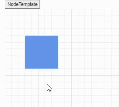

# Tooltip in Blazor Diagram Component

In a Graphical User Interface (GUI), a tooltip is a message that is displayed when the mouse is hovered over an element. The diagram provides tooltip support when dragging, resizing or rotating a node, and when the mouse hovers any diagram element.

## Default tooltip

By default, the diagram displays a tooltip that provides information about the size, position, and angle when dragging, resizing, and rotating diagram elements. The following images illustrate how the diagram displays the node information during an interaction.

| Drag | Resize | Rotate |
|------|--------|--------|
| |  |  |

## Tooltip for a specific nodes/connectors

The tooltip can be customized for each node and connector.The following code example illustrates how to customize the tooltip for individual elements.

Create tooltip for node

```cshtml
@using Syncfusion.Blazor.Diagram
<SfDiagramComponent Width="1000px" Height="500px" Nodes="@nodes" />
@code
{
    DiagramObjectCollection<Node> nodes;

    protected override void OnInitialized()
    {
        nodes = new DiagramObjectCollection<Node>();
        Node node = new Node()
        {
            ID = "node1",
            OffsetX = 250,
            OffsetY = 250,
            Width = 100,
            Height = 100,
            Style = new ShapeStyle() 
            { 
                Fill = "#6495ED", 
                StrokeColor = "white" 
            },
            Tooltip = new DiagramTooltip(){Content="NodeTooltip"},
            Constraints = NodeConstraints.Default|NodeConstraints.Tooltip,
        };
        nodes.Add(node);
    }
}
```
| | 
 
Create tooltip for connector

```cshtml
@using Syncfusion.Blazor.Diagram
@using Syncfusion.Blazor.Popups
<SfDiagramComponent Width="1000px" Height="500px" Connectors="connector" />
@code
{
    DiagramObjectCollection<Connector> connector;

    protected override void OnInitialized()
    {
        connector = new DiagramObjectCollection<Connector>();
        Connector connectors = new Connector()
        {
            ID = "Connector1",
            SourcePoint = new DiagramPoint() { X = 500, Y = 500 },
            TargetPoint = new DiagramPoint() { X = 600, Y = 400 },
            Tooltip = new DiagramTooltip(){Content="ConnectorTooltip"},
            Constraints =  ConnectorConstraints.Default|ConnectorConstraints.Tooltip ,
        };
        connector.Add(connectors);
    }
}
```
| | 

## Tooltip with NodeConstraints

Based on the node constraints value tooltip is visible from diagram or nodes tooltip.When set constraints as Tooltip it's shows the node tooltip or set the constraints as InheritTooltip it's shows the diagram tooltip.

```cshtml
@using Syncfusion.Blazor.Diagram
<SfDiagramComponent Width="1000px" Height="500px" Nodes="@nodes" Tooltip="@tooltip" />
@code
{
    DiagramObjectCollection<Node> nodes;
    DiagramTooltip tooltip = new DiagramTooltip() { Content = "DiagramTooltip" };
    protected override void OnInitialized()
    {
        nodes = new DiagramObjectCollection<Node>();
        Node node = new Node()
        {
            ID = "node1",
            OffsetX = 250,
            OffsetY = 250,
            Width = 100,
            Height = 100,
            Style = new ShapeStyle() 
            { 
                Fill = "#6495ED", 
                StrokeColor = "white" 
            },
            Tooltip = new DiagramTooltip(){Content="NodeTooltip"},
            Constraints = NodeConstraints.Default|NodeConstraints.InheritTooltip,
        };
        nodes.Add(node);
    }
}
```
| | 

## Tooltip with ConnectorConstraints

Based on the connector constraints value tooltip is visible from diagram or connectors tooltip.When set constraints as Tooltip it's shows the connector tooltip or set the constraints as InheritTooltip it's shows the diagram tooltip.

```cshtml
@using Syncfusion.Blazor.Diagram
@using Syncfusion.Blazor.Popups
<SfDiagramComponent Width="1000px" Height="500px" Connectors="connector" Tooltip="@tooltip" />
@code
{
    
    DiagramObjectCollection<Connector> connector;
    DiagramTooltip tooltip = new DiagramTooltip() { Content = "DiagramTooltip" };
    protected override void OnInitialized()
    {
        connector = new DiagramObjectCollection<Connector>();
        Connector connectors = new Connector()
        {
            ID = "Connector1",
            SourcePoint = new DiagramPoint() { X = 500, Y = 500 },
            TargetPoint = new DiagramPoint() { X = 600, Y = 400 },
            Tooltip = new DiagramTooltip(){Content="ConnectorTooltip"},
            Constraints =  ConnectorConstraints.Default|ConnectorConstraints.InheritTooltip ,
        };
        connector.Add(connectors);
    }
}
```
| | 

## Tooltip with Position property

Tooltips can be attached to 12 static locations around the target. On initializing the Tooltip, set the position property with any one of the following values:

* `TopLeft`
* `TopCenter`
* `TopRight`
* `BottomLeft`
* `BottomCenter`
* `BottomRight`
* `LeftTop`
* `LeftCenter`
* `LeftBottom`
* `RightTop`
* `RightCenter`
* `RightBottom`

> By default, Tooltip is placed at the `BottomRight` of the target element.


Create tooltip for node with particular position and change position at run time

```cshtml
@using Syncfusion.Blazor.Diagram
@using Syncfusion.Blazor.Popups
<input type="button" value="NodePosition" @onclick="PositionChange" />
<SfDiagramComponent Width="1000px" Height="500px" Nodes="@nodes" />
@code
{
    DiagramObjectCollection<Node> nodes;

    protected override void OnInitialized()
    {
        nodes = new DiagramObjectCollection<Node>();
        Node node = new Node()
        {
            ID = "node1",
            OffsetX = 250,
            OffsetY = 250,
            Width = 100,
            Height = 100,
            Style = new ShapeStyle() 
            { 
                Fill = "#6495ED", 
                StrokeColor = "white" 
            },
            Tooltip = new DiagramTooltip(){Content="NodeTooltip",Position=Position.TopCenter},
            Constraints = NodeConstraints.Default|NodeConstraints.Tooltip,
        };
        nodes.Add(node);
    }
    //Change position at run time
    private void PositionChange()
    {
        nodes[0].Tooltip.Position = Position.RightCenter;
    }
}
```
| | 


Create tooltip for connector with particular position and change position at run time

```cshtml
@using Syncfusion.Blazor.Diagram
@using Syncfusion.Blazor.Popups
<input type="button" value="ConnectorPosition" @onclick="PositionChange" />
<SfDiagramComponent Width="1000px" Height="500px" Connectors="connector" />
@code
{
    DiagramObjectCollection<Connector> connector;

    protected override void OnInitialized()
    {
        connector = new DiagramObjectCollection<Connector>();
        Connector connectors = new Connector()
        {
            ID = "Connector1",
            SourcePoint = new DiagramPoint() { X = 500, Y = 500 },
            TargetPoint = new DiagramPoint() { X = 600, Y = 400 },
            Tooltip = new DiagramTooltip(){Content="ConnectorTooltip",Position=Position.TopCenter},
            Constraints =  ConnectorConstraints.Default|ConnectorConstraints.Tooltip ,
        };
        connector.Add(connectors);
    }
     //Change position at run time
    private void PositionChange()
    {
        connector[0].Tooltip.Position = Position.RightCenter;
    }
}
```
| | 
 
## Tooltip with Content Property

Create tooltip for node with particular content and change content at run time

```cshtml
@using Syncfusion.Blazor.Diagram
@using Syncfusion.Blazor.Popups
<input type="button" value="NodeContent" @onclick="ContentChange" />
<SfDiagramComponent Width="1000px" Height="500px" Nodes="@nodes" />
@code
{
    DiagramObjectCollection<Node> nodes;

    protected override void OnInitialized()
    {
        nodes = new DiagramObjectCollection<Node>();
        Node node = new Node()
        {
            ID = "node1",
            OffsetX = 250,
            OffsetY = 250,
            Width = 100,
            Height = 100,
            Style = new ShapeStyle() 
            { 
                Fill = "#6495ED", 
                StrokeColor = "white" 
            },
            Tooltip = new DiagramTooltip(){Content="NodeTooltip"},
            Constraints = NodeConstraints.Default|NodeConstraints.Tooltip,
        };
        nodes.Add(node);
    }
    //Change Content at run time
    private void ContentChange()
    {
        nodes[0].Tooltip.Content = "UpdateTooltipContent";
    }
}
```
| | 

Create tooltip for connector with particular content and change content at run time

```cshtml
@using Syncfusion.Blazor.Diagram
@using Syncfusion.Blazor.Popups
<input type="button" value="ConnectorContent" @onclick="ContentChange" />
<SfDiagramComponent Width="1000px" Height="500px" Connectors="connector" />
@code
{
    //Defines diagram's connector collection.
    DiagramObjectCollection<Connector> connector;

    protected override void OnInitialized()
    {
        connector = new DiagramObjectCollection<Connector>();
        Connector connectors = new Connector()
        {
            ID = "Connector1",
            SourcePoint = new DiagramPoint() { X = 500, Y = 500 },
            TargetPoint = new DiagramPoint() { X = 600, Y = 400 },
            Tooltip = new DiagramTooltip(){Content="ConnectorTooltip"},
            Constraints =  ConnectorConstraints.Default|ConnectorConstraints.Tooltip ,
        };
        connector.Add(connectors);
    }
    //Change Content at run time
    private void ContentChange()
    {
        connector[0].Tooltip.Content = "UpdateTooltipContent";
    }
}
```
| | 

## Tooltip with TipPointer property

Create tooltip for node with particular tip pointer value and change tip pointer at run time

```cshtml
@using Syncfusion.Blazor.Diagram
@using Syncfusion.Blazor.Popups
<input type="button" value="NodeTipPointer" @onclick="TipPointerChange" />
<SfDiagramComponent Width="1000px" Height="500px" Nodes="@nodes" />
@code
{
    DiagramObjectCollection<Node> nodes;

    protected override void OnInitialized()
    {
        nodes = new DiagramObjectCollection<Node>();
        Node node = new Node()
        {
            ID = "node1",
            OffsetX = 250,
            OffsetY = 250,
            Width = 100,
            Height = 100,
            Style = new ShapeStyle() 
            { 
                Fill = "#6495ED", 
                StrokeColor = "white" 
            },
            Tooltip = new DiagramTooltip(){Content="NodeTooltip",ShowTipPointer=true},
            Constraints = NodeConstraints.Default|NodeConstraints.Tooltip,
        };
        nodes.Add(node);
    }
    //Change TipPointer at run time
    private void TipPointerChange()
    {
        nodes[0].Tooltip.ShowTipPointer = false;
    }
}
```
| | 

Create tooltip for connector with particular tip pointer value and change tip pointer at run time

```cshtml
@using Syncfusion.Blazor.Diagram
@using Syncfusion.Blazor.Popups
<input type="button" value="ConnectorTipPointer" @onclick="TipPointerChange" />
<SfDiagramComponent Width="1000px" Height="500px" Connectors="connector" />
@code
{
    //Defines diagram's connector collection.
    DiagramObjectCollection<Connector> connector;

    protected override void OnInitialized()
    {
        connector = new DiagramObjectCollection<Connector>();
        Connector connectors = new Connector()
        {
            ID = "Connector1",
            SourcePoint = new DiagramPoint() { X = 500, Y = 500 },
            TargetPoint = new DiagramPoint() { X = 600, Y = 400 },
            Tooltip = new DiagramTooltip(){Content="ConnectorTooltip",ShowTipPointer=true},
            Constraints =  ConnectorConstraints.Default|ConnectorConstraints.Tooltip ,
        };
        connector.Add(connectors);
    }
    //Change TipPointer at run time
    private void TipPointerChange()
    {
        connector[0].Tooltip.ShowTipPointer = false;
    }
}
```
| | 

## Tooltip with Template property

Create tooltip for node with particular template value and change template at run time

```cshtml
@using Syncfusion.Blazor.Diagram
@using Syncfusion.Blazor.Popups
<input type="button" value="NodeTemplate" @onclick="TemplateChange" />
<SfDiagramComponent Width="1000px" Height="500px" Nodes="@nodes" />
@code
{
    DiagramObjectCollection<Node> nodes;

    protected override void OnInitialized()
    {
        nodes = new DiagramObjectCollection<Node>();
        Node node = new Node()
        {
            ID = "node1",
            OffsetX = 250,
            OffsetY = 250,
            Width = 100,
            Height = 100,
            Style = new ShapeStyle() 
            { 
                Fill = "#6495ED", 
                StrokeColor = "white" 
            },
            Tooltip = new DiagramTooltip(){Content="NodeTooltip",Template=getContent()},
            Constraints = NodeConstraints.Default|NodeConstraints.Tooltip,
        };
        nodes.Add(node);
    }
    private string getContent()
    {
        string content = "<div><p>Product Name : Diagram</p><p>Element: Node</p><p>Content: Node Tooltip <p></p></div>";
        return content;
    }
    //Change Template at run time
    private void TemplateChange()
    {
        nodes[0].Tooltip.Template = "<p>TemplateUpdate</p>";
    }
}
```
| | 

Create tooltip for connector with particular template value and change template at run time

```cshtml
@using Syncfusion.Blazor.Diagram
@using Syncfusion.Blazor.Popups
<input type="button" value="ConnectorTipPointer" @onclick="TipPointerChange" />
<SfDiagramComponent Width="1000px" Height="500px" Connectors="connector" />
@code
{
    //Defines diagram's connector collection.
    DiagramObjectCollection<Connector> connector;

    protected override void OnInitialized()
    {
        connector = new DiagramObjectCollection<Connector>();
        Connector connectors = new Connector()
        {
            ID = "Connector1",
            SourcePoint = new DiagramPoint() { X = 500, Y = 500 },
            TargetPoint = new DiagramPoint() { X = 600, Y = 400 },
            Tooltip = new DiagramTooltip(){Content="ConnectorTooltip",ShowTipPointer=true},
            Constraints =  ConnectorConstraints.Default|ConnectorConstraints.Tooltip ,
        };
        connector.Add(connectors);
    }
    //Change TipPointer at run time
    private void TipPointerChange()
    {
        connector[0].Tooltip.ShowTipPointer = false;
    }
}
```
| | 

## Tooltip with Animation property

Create tooltip for node with particular animation and change animation value at run time

```cshtml
@using Syncfusion.Blazor.Diagram
@using Syncfusion.Blazor.Popups
<input type="button" value="NodeAnimation" @onclick="AnimationChange" />
<SfDiagramComponent Width="1000px" Height="500px" Nodes="@nodes" />
@code
{
    DiagramObjectCollection<Node> nodes;

    protected override void OnInitialized()
    {
        nodes = new DiagramObjectCollection<Node>();
        Node node = new Node()
        {
            ID = "node1",
            OffsetX = 250,
            OffsetY = 250,
            Width = 100,
            Height = 100,
            Style = new ShapeStyle() 
            { 
                Fill = "#6495ED", 
                StrokeColor = "white" 
            },
            Tooltip = new DiagramTooltip(){Content="NodeTooltip",AnimationSettings = new AnimationModel()
            {
               Open = new TooltipAnimationSettings(){Effect = Effect.None},
                Close = new TooltipAnimationSettings(){Effect = Effect.None}
            }},
            Constraints = NodeConstraints.Default|NodeConstraints.Tooltip,
        };
        nodes.Add(node);
    }
    //Change Animation at run time
    private void AnimationChange()
    {
        nodes[0].Tooltip.AnimationSettings = new AnimationModel()
            {
                Open = new TooltipAnimationSettings() { Effect = Effect.FadeZoomIn, Duration = 100 },
                Close = new TooltipAnimationSettings() { Effect = Effect.FadeZoomOut, Duration = 50 }
            };
    }
}
```
| | 

Create tooltip for connector with particular animation and change animation value at run time

```cshtml
@using Syncfusion.Blazor.Diagram
@using Syncfusion.Blazor.Popups
<input type="button" value="ConnectorAnimation" @onclick="AnimationChange" />
<SfDiagramComponent Width="1000px" Height="500px" Connectors="connector" />
@code
{
    //Defines diagram's connector collection.
    DiagramObjectCollection<Connector> connector;

    protected override void OnInitialized()
    {
        connector = new DiagramObjectCollection<Connector>();
        Connector connectors = new Connector()
        {
            ID = "Connector1",
            SourcePoint = new DiagramPoint() { X = 500, Y = 500 },
            TargetPoint = new DiagramPoint() { X = 600, Y = 400 },
            Tooltip = new DiagramTooltip(){Content="ConnectorTooltip",AnimationSettings = new AnimationModel()
            {
               Open = new TooltipAnimationSettings(){Effect = Effect.None},
                Close = new TooltipAnimationSettings(){Effect = Effect.None}
            }},
            Constraints =  ConnectorConstraints.Default|ConnectorConstraints.Tooltip ,
        };
        connector.Add(connectors);
    }
    //Change Animation at run time
    private void AnimationChange()
    {
        connector[0].Tooltip.AnimationSettings = new AnimationModel()
            {
                Open = new TooltipAnimationSettings() { Effect = Effect.ZoomIn, Duration = 500 },
                Close = new TooltipAnimationSettings() { Effect = Effect.ZoomOut, Duration = 500 }
            };
    }
}
```
| | 

## Tooltip with Open Mode

Tooltips is opened based on their modes. On initializing the Tooltip, set the open mode property with any one of the following values:

* `Auto`
* `Hover`
* `Custom`
* `Click`


> By default, Tooltip is open mode is `Auto`.

Create tooltip for node with particular mode

```cshtml
@using Syncfusion.Blazor.Diagram
@using Syncfusion.Blazor.Popups
<input type="button" value="ShowCustomTooltip" @onclick="show" />
<input type="button" value="HideCustomTooltip" @onclick="hide" />
<SfDiagramComponent @ref="@diagram" Width="1000px" Height="500px" Nodes="@nodes" />
@code
{
    DiagramObjectCollection<Node> nodes;
    SfDiagramComponent diagram;
    protected override void OnInitialized()
    {
        nodes = new DiagramObjectCollection<Node>();
        Node node = new Node()
        {
            ID = "node1",
            OffsetX = 100,
            OffsetY = 100,
            Width = 100,
            Height = 100,
            Style = new ShapeStyle() 
            { 
                Fill = "#6495ED", 
                StrokeColor = "white" 
            },
            Tooltip = new DiagramTooltip(){Content="Auto",OpensOn="Auto",Position=Position.BottomCenter},
            Constraints = NodeConstraints.Default|NodeConstraints.Tooltip,
        };
        Node node1 = new Node()
        {
            ID = "node2",
            OffsetX = 250,
            OffsetY = 100,
            Width = 100,
            Height = 100,
            Style = new ShapeStyle() 
            { 
                Fill = "#6495ED", 
                StrokeColor = "white" 
            },
            Tooltip = new DiagramTooltip(){Content="Hover",OpensOn="Hover"},
            Constraints = NodeConstraints.Default|NodeConstraints.Tooltip,
        };
        Node node2 = new Node()
        {
            ID = "node3",
            OffsetX = 400,
            OffsetY = 100,
            Width = 100,
            Height = 100,
            Style = new ShapeStyle() 
            { 
                Fill = "#6495ED", 
                StrokeColor = "white" 
            },
            Tooltip = new DiagramTooltip(){Content="Custom",OpensOn="Custom"},
            Constraints = NodeConstraints.Default|NodeConstraints.Tooltip,
        };
        Node node3 = new Node()
        {
            ID = "node4",
            OffsetX = 550,
            OffsetY = 100,
            Width = 100,
            Height = 100,
            Style = new ShapeStyle() 
            { 
                Fill = "#6495ED", 
                StrokeColor = "white" 
            },
            Tooltip = new DiagramTooltip() { Content = "Click", OpensOn = "Click" },
            Constraints = NodeConstraints.Default|NodeConstraints.Tooltip,
        };
        nodes.Add(node);
        nodes.Add(node1);
        nodes.Add(node2);
        nodes.Add(node3);
    }
   
    private  void show()
    {
        diagram.ShowTooltip(diagram.Nodes[2] as NodeBase);
    }
    private  void hide()
    {
       diagram.HideTooltip(diagram.Nodes[2] as NodeBase);
    }
}
```
| | 

Create tooltip for connector with particular mode

```cshtml
@using Syncfusion.Blazor.Diagram
@using Syncfusion.Blazor.Popups
<input type="button" value="ShowCustomTooltip" @onclick="show" />
<input type="button" value="HideCustomTooltip" @onclick="hide" />
<SfDiagramComponent @ref="@diagram" Width="1000px" Height="500px" Connectors="connector" />
@code
{
    //Defines diagram's connector collection.
    DiagramObjectCollection<Connector> connector;
    SfDiagramComponent diagram;
    protected override void OnInitialized()
    {
        connector = new DiagramObjectCollection<Connector>();
        Connector connectors = new Connector()
        {
            ID = "Connector1",
            SourcePoint = new DiagramPoint() { X = 100, Y = 200 },
            TargetPoint = new DiagramPoint() { X = 200, Y = 100 },
            Tooltip = new DiagramTooltip(){Content="Auto",OpensOn="Auto"},
            Constraints =  ConnectorConstraints.Default|ConnectorConstraints.Tooltip ,
        };
         Connector connectors1 = new Connector()
        {
            ID = "Connector2",
            SourcePoint = new DiagramPoint() { X = 300, Y = 200 },
            TargetPoint = new DiagramPoint() { X = 400, Y = 100 },
            Tooltip = new DiagramTooltip(){Content="Hover",OpensOn="Hover"},
            Constraints =  ConnectorConstraints.Default|ConnectorConstraints.Tooltip ,
        };
          Connector connectors2 = new Connector()
        {
            ID = "Connector3",
            SourcePoint = new DiagramPoint() { X = 500, Y = 200 },
            TargetPoint = new DiagramPoint() { X = 600, Y = 100 },
            Tooltip = new DiagramTooltip(){Content="Custom",OpensOn="Custom"},
            Constraints =  ConnectorConstraints.Default|ConnectorConstraints.Tooltip ,
        };
          Connector connectors3 = new Connector()
        {
            ID = "Connector4",
            SourcePoint = new DiagramPoint() { X = 700, Y = 200 },
            TargetPoint = new DiagramPoint() { X = 800, Y = 100 },
            Tooltip = new DiagramTooltip(){Content="Click",OpensOn="Click"},
            Constraints =  ConnectorConstraints.Default|ConnectorConstraints.Tooltip ,
        };
        connector.Add(connectors);
        connector.Add(connectors1);
        connector.Add(connectors2);
        connector.Add(connectors3);
    }
    
    private  void show()
    {
        diagram.ShowTooltip(diagram.Connectors[2] as NodeBase);
    }
    private void hide()
    {
       diagram.HideTooltip(diagram.Connectors[2] as NodeBase);
    }
}
```
| | 

## Tooltip with SelectorConstraints

Enables or disables the tooltip for drag, resize and rotate operation of nodes.The following code example is used to enable/disable the tooltip for the diagram nodes.

```cshtml
@using Syncfusion.Blazor.Diagram
@using Syncfusion.Blazor.Popups
<p>SelectorConstraints</p>
 <input type="checkbox" value="Tooltip" @onchange="@constraintschange"checked="@check5" />Tooltip
<SfDiagramComponent Width="1000px" Height="500px" Nodes="@nodes" />
@code
{
    DiagramObjectCollection<Node> nodes;
    bool selector=true;
    protected override void OnInitialized()
    {
        nodes = new DiagramObjectCollection<Node>();
        Node node = new Node()
        {
            ID = "node1",
            OffsetX = 250,
            OffsetY = 250,
            Width = 100,
            Height = 100,
            Style = new ShapeStyle() 
            { 
                Fill = "#6495ED", 
                StrokeColor = "white" 
            },
            Tooltip = new DiagramTooltip(){Content="NodeTooltip"},
            Constraints = NodeConstraints.Default|NodeConstraints.Tooltip,
        };
        nodes.Add(node);
    }
     private void constraintschange(object value)
    {
        var obj = value as ChangeEventArgs;

        if ((bool)obj.Value)
        {
             selection.Constraints |= SelectorConstraints.Tooltip;
              selector = true;
        }
        else
        {
              selection.Constraints &= ~SelectorConstraints.Tooltip;
              selector = false;
        }

    }
}
```
| | 

Enables or disables the tooltip for drag, resize and rotate operation of connectors.The following code example is used to enable/disable the tooltip for the diagram connectors.

```cshtml
@using Syncfusion.Blazor.Diagram
@using Syncfusion.Blazor.Popups
<p>SelectorConstraints</p>
<input type="checkbox" value="Tooltip" @onchange="@constraintsupdate"checked="@selector" />Tooltip
<SfDiagramComponent Width="1000px" Height="500px" Connectors="connector" SelectionSettings="@selection"/>
@code
{
    DiagramObjectCollection<Connector> connector;
     bool selector=true;
    public DiagramSelectionSettings selection = new DiagramSelectionSettings()
    {
        Constraints = SelectorConstraints.All
    };
    protected override void OnInitialized()
    {
        connector = new DiagramObjectCollection<Connector>();
        Connector connectors = new Connector()
        {
            ID = "Connector1",
            SourcePoint = new DiagramPoint() { X = 500, Y = 500 },
            TargetPoint = new DiagramPoint() { X = 600, Y = 400 },
            Tooltip = new DiagramTooltip(){Content="ConnectorTooltip"},
            Constraints =  ConnectorConstraints.Default|ConnectorConstraints.Tooltip ,
        };
        connector.Add(connectors);
    }
    private void constraintsupdate(object value)
    {
        var obj = value as ChangeEventArgs;

        if ((bool)obj.Value)
        {
             selection.Constraints |= SelectorConstraints.Tooltip;
              selector = true;
        }
        else
        {
              selection.Constraints &= ~SelectorConstraints.Tooltip;
              selector = false;
        }
    }
}
```
| | 
