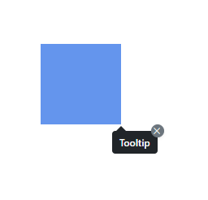
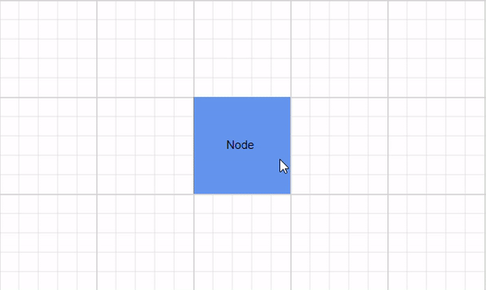

# Tooltip in Blazor Diagram Component

In a Graphical User Interface (GUI), a tooltip is a message that is displayed when the mouse is hovered over an element. The diagram provides tooltip support when dragging, resizing or rotating a node, and when the mouse hovers any diagram element.

## Default tooltip

By default, the diagram displays a tooltip that provides information about the size, position, and angle when dragging, resizing, and rotating diagram elements. The following images illustrate how the diagram displays the node information during an interaction.

| Drag | Resize | Rotate |
|------|--------|--------|
| |  |  |

## Tooltip for a specific nodes/connectors

The diagram provides support to show a tooltip when the mouse hovers over any node or connector. The tooltip can be customized for each node and connector.

The following code example illustrates how to customize the tooltip for nodes.

```cshtml
@using Syncfusion.Blazor.Diagram
<SfDiagramComponent Width="1000px" Height="500px" Nodes="@nodes" />
@code
{
    DiagramObjectCollection<Node> nodes;

    protected override void OnInitialized()
    {
        nodes = new DiagramObjectCollection<Node>();
        Node node = new Node()
        {
            ID = "node1",
            OffsetX = 250,
            OffsetY = 250,
            Width = 100,
            Height = 100,
            Style = new ShapeStyle() 
            { 
                Fill = "#6495ED", 
                StrokeColor = "white" 
            },
            Tooltip = new DiagramTooltip(){Content="NodeTooltip"},
            Constraints = NodeConstraints.Default|NodeConstraints.Tooltip,
        };
        nodes.Add(node);
    }
}
```
You can download a complete working sample from [GitHub](https://github.com/SyncfusionExamples/Blazor-Diagram-Examples/tree/master/UG-Samples/Tooltip/TooltipForSpecificNode)

  

The following code example illustrates how to customize the tooltip for connectors.

```cshtml
@using Syncfusion.Blazor.Diagram
@using Syncfusion.Blazor.Popups
<SfDiagramComponent Width="1000px" Height="500px" Connectors="connector" />
@code
{
    DiagramObjectCollection<Connector> connector;

    protected override void OnInitialized()
    {
        connector = new DiagramObjectCollection<Connector>();
        Connector connectors = new Connector()
        {
            ID = "Connector1",
            SourcePoint = new DiagramPoint() { X = 500, Y = 500 },
            TargetPoint = new DiagramPoint() { X = 600, Y = 400 },
            Tooltip = new DiagramTooltip(){Content="ConnectorTooltip"},
            Constraints =  ConnectorConstraints.Default|ConnectorConstraints.Tooltip ,
        };
        connector.Add(connectors);
    }
}
```
You can download a complete working sample from [GitHub](https://github.com/SyncfusionExamples/Blazor-Diagram-Examples/tree/master/UG-Samples/Tooltip/TooltipForSpecificConnector)

 

## How to set tooltip position for nodes/connectors

Tooltips can be attached to 12 static locations around the target. On initializing the Tooltip, set the [Position](https://help.syncfusion.com/cr/blazor/Syncfusion.Blazor.Diagram.DiagramTooltip.html#Syncfusion_Blazor_Diagram_DiagramTooltip_Position) property with any one of the following values:

* `TopLeft`
* `TopCenter`
* `TopRight`
* `BottomLeft`
* `BottomCenter`
* `BottomRight`
* `LeftTop`
* `LeftCenter`
* `LeftBottom`
* `RightTop`
* `RightCenter`
* `RightBottom`

N> By default, the Tooltip is placed at the BottomRight of the target element.

The following code example sets the tooltip position for the nodes.

```cshtml
@using Syncfusion.Blazor.Diagram
@using Syncfusion.Blazor.Popups
@using Syncfusion.Blazor.Buttons

<SfButton Content="Node Position" OnClick="@PositionChange" />
<SfDiagramComponent Width="1000px" Height="500px" Nodes="@nodes" />
@code
{
    //Define diagram's nodes collection
    DiagramObjectCollection<Node> nodes;

    protected override void OnInitialized()
    {

        //Intialize diagram's nodes collection
        nodes = new DiagramObjectCollection<Node>();
        Node node = new Node()
            {
                ID = "node1",
                OffsetX = 250,
                OffsetY = 250,
                Width = 100,
                Height = 100,
                Style = new ShapeStyle()
                {
                    Fill = "#6495ED",
                    StrokeColor = "white"
                },
                Tooltip = new DiagramTooltip() { Content = "NodeTooltip", Position = Position.TopCenter },
                Constraints = NodeConstraints.Default | NodeConstraints.Tooltip,
            };
        nodes.Add(node);
    }
    //Change position at run time.
    private void PositionChange()
    {
        nodes[0].Tooltip.Position = Position.RightCenter;
    }
}
```
You can download a complete working sample from [GitHub](https://github.com/SyncfusionExamples/Blazor-Diagram-Examples/tree/master/UG-Samples/Tooltip/TooltipPositionforNode)

The following code example sets the tooltip position for the connectors.

```cshtml
@@using Syncfusion.Blazor.Diagram
@using Syncfusion.Blazor.Popups
@using Syncfusion.Blazor.Buttons

<SfButton Content="Connector Position" OnClick="@PositionChange" />
<SfDiagramComponent Width="1000px" Height="500px" Connectors="connector" />
@code
{
    //Define diagram's connectors collection
    DiagramObjectCollection<Connector> connector;

    protected override void OnInitialized()
    {
        //Intialize diagram's connectors collection

        connector = new DiagramObjectCollection<Connector>();
        Connector connectors = new Connector()
            {
                ID = "Connector1",
                SourcePoint = new DiagramPoint() { X = 500, Y = 500 },
                TargetPoint = new DiagramPoint() { X = 600, Y = 400 },
                Tooltip = new DiagramTooltip() { Content = "ConnectorTooltip", Position = Position.TopCenter },
                Constraints = ConnectorConstraints.Default | ConnectorConstraints.Tooltip,
            };
        connector.Add(connectors);
    }
    //Change position at run time.
    private void PositionChange()
    {
        connector[0].Tooltip.Position = Position.RightCenter;
    }
}
```
You can download a complete working sample from [GitHub](https://github.com/SyncfusionExamples/Blazor-Diagram-Examples/tree/master/UG-Samples/Tooltip/TooltipPositionForConnector)

## How to set tooltip content for nodes/connectors

A text or a piece of information assigned to the Tooltip’s [Content](https://help.syncfusion.com/cr/blazor/Syncfusion.Blazor.Diagram.DiagramTooltip.html#Syncfusion_Blazor_Diagram_DiagramTooltip_Content) property will be displayed as the main content of the Tooltip for nodes or connectors.

The following code example sets the tooltip content for the nodes.

```cshtml
@using Syncfusion.Blazor.Diagram
@using Syncfusion.Blazor.Popups
@using Syncfusion.Blazor.Buttons

<SfButton Content="Node Content" OnClick="@ContentChange" />
<SfDiagramComponent Width="1000px" Height="500px" Nodes="@nodes" />
@code
{
    //Define diagram's nodes collection
    DiagramObjectCollection<Node> nodes;

    protected override void OnInitialized()
    {
        //Intialize diagram's nodes collection
        nodes = new DiagramObjectCollection<Node>();
        Node node = new Node()
            {
                ID = "node1",
                OffsetX = 250,
                OffsetY = 250,
                Width = 100,
                Height = 100,
                Style = new ShapeStyle()
                {
                    Fill = "#6495ED",
                    StrokeColor = "white"
                },
                Tooltip = new DiagramTooltip() { Content = "NodeTooltip" },
                Constraints = NodeConstraints.Default | NodeConstraints.Tooltip,
            };
        nodes.Add(node);
    }
    //Change Content at run time.
    private void ContentChange()
    {
        nodes[0].Tooltip.Content = "UpdateTooltipContent";
    }
}
```
You can download a complete working sample from [GitHub](https://github.com/SyncfusionExamples/Blazor-Diagram-Examples/tree/master/UG-Samples/Tooltip/TooltipContentForNode)

The following code example sets the tooltip content for the connectors.

```cshtml
@using Syncfusion.Blazor.Diagram
@using Syncfusion.Blazor.Popups
@using Syncfusion.Blazor.Buttons

<SfButton Content="Connector Content" OnClick="@ContentChange" />
<SfDiagramComponent Width="1000px" Height="500px" Connectors="connector" />
@code
{
    DiagramObjectCollection<Connector> connector;

    protected override void OnInitialized()
    {
        connector = new DiagramObjectCollection<Connector>();
        Connector connectors = new Connector()
            {
                ID = "Connector1",
                SourcePoint = new DiagramPoint() { X = 500, Y = 500 },
                TargetPoint = new DiagramPoint() { X = 600, Y = 400 },
                Tooltip = new DiagramTooltip() { Content = "ConnectorTooltip" },
                Constraints = ConnectorConstraints.Default | ConnectorConstraints.Tooltip,
            };
        connector.Add(connectors);
    }
    //Change Content at run time.
    private void ContentChange()
    {
        connector[0].Tooltip.Content = "UpdateTooltipContent";
    }
}
```
You can download a complete working sample from [GitHub](https://github.com/SyncfusionExamples/Blazor-Diagram-Examples/tree/master/UG-Samples/Tooltip/TooltipContentForConnector)

## How to shows/hides the tip pointer for tooltip

The [ShowTipPointer](https://help.syncfusion.com/cr/blazor/Syncfusion.Blazor.Diagram.DiagramTooltip.html#Syncfusion_Blazor_Diagram_DiagramTooltip_ShowTipPointer) property value is true if the tip pointer is visible; otherwise, false.

The following code example is used to set tooltip tip pointer for nodes.

```cshtml
@using Syncfusion.Blazor.Diagram
@using Syncfusion.Blazor.Popups
@using Syncfusion.Blazor.Buttons

<SfButton Content="Node TipPointer" OnClick="@TipPointerChange" />
<SfDiagramComponent Width="1000px" Height="500px" Nodes="@nodes" />
@code
{
    //Define diagram's nodes collection
    DiagramObjectCollection<Node> nodes;

    protected override void OnInitialized()
    {
        //Intialize diagram's nodes collection
        nodes = new DiagramObjectCollection<Node>();
        Node node = new Node()
            {
                ID = "node1",
                OffsetX = 250,
                OffsetY = 250,
                Width = 100,
                Height = 100,
                Style = new ShapeStyle()
                {
                    Fill = "#6495ED",
                    StrokeColor = "white"
                },
                //Set tooltip
                Tooltip = new DiagramTooltip() { Content = "NodeTooltip", ShowTipPointer = true },
                Constraints = NodeConstraints.Default | NodeConstraints.Tooltip,
            };
        nodes.Add(node);
    }
    //Change TipPointer at run time.
    private void TipPointerChange()
    {
        nodes[0].Tooltip.ShowTipPointer = false;
    }
}
```
You can download a complete working sample from [GitHub](https://github.com/SyncfusionExamples/Blazor-Diagram-Examples/tree/master/UG-Samples/Tooltip/TipPointerForNodeTooltip)

The following code example is used to set tooltip tip pointer for connectors.

```cshtml
@using Syncfusion.Blazor.Diagram
@using Syncfusion.Blazor.Popups
@using Syncfusion.Blazor.Buttons

<SfButton Content="Connector TipPointer" OnClick="@TipPointerChange" />
<SfDiagramComponent Width="1000px" Height="500px" Connectors="connector" />
@code
{
    //Define diagram's connectors collection
    DiagramObjectCollection<Connector> connector;

    protected override void OnInitialized()
    {
        //Intialize diagram's connectors collection
        connector = new DiagramObjectCollection<Connector>();
        Connector connectors = new Connector()
            {
                ID = "Connector1",
                SourcePoint = new DiagramPoint() { X = 500, Y = 500 },
                TargetPoint = new DiagramPoint() { X = 600, Y = 400 },
                //Set tooltip
                Tooltip = new DiagramTooltip() { Content = "ConnectorTooltip", ShowTipPointer = true },
                Constraints = ConnectorConstraints.Default | ConnectorConstraints.Tooltip,
            };
        connector.Add(connectors);
    }
    //Change the TipPointer at run time.
    private void TipPointerChange()
    {
        connector[0].Tooltip.ShowTipPointer = false;
    }
}
```
You can download a complete working sample from [GitHub](https://github.com/SyncfusionExamples/Blazor-Diagram-Examples/tree/master/UG-Samples/Tooltip/TipPointerForConnectorTooltip)

## Tooltip template content
To customize the tooltip content or create your own visualized element on the tooltip, you can use the [TooltipTemplate](https://help.syncfusion.com/cr/blazor/Syncfusion.Blazor.Diagram.DiagramTemplates.html#Syncfusion_Blazor_Diagram_DiagramTemplates_TooltipTemplate) property of `SfDiagramComponent`.

The following code example illustrates how to add the formatted template content to the tooltip for the nodes.

```cshtml
@using Syncfusion.Blazor.Diagram
@using Syncfusion.Blazor.Buttons

<SfDiagramComponent Width="1000px" Height="500px" Nodes="@nodes" >
    <DiagramTemplates>
        <TooltipTemplate>
            @{
                if (context is Node)
                {
                    <div><p>Product Name : Diagram</p><p>Element: Node</p><p>Content: Node Tooltip </p></div>
                }
            }
        </TooltipTemplate>
    </DiagramTemplates>
</SfDiagramComponent>
@code
{
    //Define diagram's nodes collection
    DiagramObjectCollection<Node> nodes;

    protected override void OnInitialized()
    {
        //Intialize diagram's nodes collection
        nodes = new DiagramObjectCollection<Node>();
        Node node = new Node()
            {
                ID = "node1",
                OffsetX = 250,
                OffsetY = 250,
                Width = 100,
                Height = 100,
                Style = new ShapeStyle()
                {
                    Fill = "#6495ED",
                    StrokeColor = "white"
                },
                Tooltip = new DiagramTooltip(),
                Constraints = NodeConstraints.Default | NodeConstraints.Tooltip,
            };
        nodes.Add(node);
    }
}
```
You can download a complete working sample from [GitHub](https://github.com/SyncfusionExamples/Blazor-Diagram-Examples/tree/master/UG-Samples/Tooltip/TooltipTemplateForNode)


The following code example illustrates how to add the formatted template content to the tooltip for the connectors.

```cshtml
@using Syncfusion.Blazor.Diagram
@using Syncfusion.Blazor.Popups
@using Syncfusion.Blazor.Buttons

<SfDiagramComponent Width="1000px" Height="500px" Connectors="connector">
    <DiagramTemplates>
        <TooltipTemplate>
            @{
                if (context is Connector)
                {
                    <div><p>Product Name : Diagram</p><p>Element: Node</p><p>Content: Node Tooltip </p></div>
                }
            }
        </TooltipTemplate>
    </DiagramTemplates>
</SfDiagramComponent>
@code
{
    //Define diagram's connectors collection
    DiagramObjectCollection<Connector> connector;

    protected override void OnInitialized()
    {
        //Intialize diagram's connectors collection

        connector = new DiagramObjectCollection<Connector>();
        Connector connectors = new Connector()
            {
                ID = "Connector1",
                SourcePoint = new DiagramPoint() { X = 500, Y = 500 },
                TargetPoint = new DiagramPoint() { X = 600, Y = 400 },
                Tooltip = new DiagramTooltip(),
                Constraints = ConnectorConstraints.Default | ConnectorConstraints.Tooltip,
            };
        connector.Add(connectors);
    }
}
```
You can download a complete working sample from [GitHub](https://github.com/SyncfusionExamples/Blazor-Diagram-Examples/tree/master/UG-Samples/Tooltip/TooltipTemplateForConnector)

>**Note:**  When the content propoerty of the tooltip is also defined with the template for either node , connector or diagram, only the  content will get rendered. The template content will get rendered only when the content property is undefined.

## Tooltip animation

To animate the tooltip, a set of specific animation effects are available, and it can be controlled by using the animation property. The [Animation](https://help.syncfusion.com/cr/blazor/Syncfusion.Blazor.Diagram.DiagramTooltip.html#Syncfusion_Blazor_Diagram_DiagramTooltip_AnimationSettings) property also allows you to set delay, duration, and various other effects of your choice.

The following code example illustrates how to set the animation to the tooltip for the nodes.

```cshtml
@using Syncfusion.Blazor.Diagram
@using Syncfusion.Blazor.Popups
@using Syncfusion.Blazor.Buttons

<SfButton Content="Node Animation" OnClick="@AnimationChange" />
<SfDiagramComponent Width="1000px" Height="500px" Nodes="@nodes" />
@code
{
    //Define diagram's nodes collection
    DiagramObjectCollection<Node> nodes;

    protected override void OnInitialized()
    {
        //Initialize the diagram's nodes collection
        nodes = new DiagramObjectCollection<Node>();
        Node node = new Node()
            {
                ID = "node1",
                OffsetX = 250,
                OffsetY = 250,
                Width = 100,
                Height = 100,
                Style = new ShapeStyle()
                {
                    Fill = "#6495ED",
                    StrokeColor = "white"
                },
                Tooltip = new DiagramTooltip()
                {
                    Content = "NodeTooltip",
                    AnimationSettings = new AnimationModel()
                    {
                        Open = new TooltipAnimationSettings() { Effect = Effect.None },
                        Close = new TooltipAnimationSettings() { Effect = Effect.None }
                    }
                },
                Constraints = NodeConstraints.Default | NodeConstraints.Tooltip,
            };
        nodes.Add(node);
    }
    //Change the Animation at run time.
    private void AnimationChange()
    {
        nodes[0].Tooltip.AnimationSettings = new AnimationModel()
            {
                Open = new TooltipAnimationSettings() { Effect = Effect.FadeZoomIn, Duration = 100 },
                Close = new TooltipAnimationSettings() { Effect = Effect.FadeZoomOut, Duration = 50 }
            };
    }
}
```
You can download a complete working sample from [GitHub](https://github.com/SyncfusionExamples/Blazor-Diagram-Examples/tree/master/UG-Samples/Tooltip/TooltipAnimationForNode)

The following code example illustrates how to set the animation to the tooltip for the connectors.

```cshtml
@using Syncfusion.Blazor.Diagram
@using Syncfusion.Blazor.Popups
@using Syncfusion.Blazor.Buttons

<SfButton Content="Connector Animation" OnClick="@AnimationChange" />
<SfDiagramComponent Width="1000px" Height="500px" Connectors="connector" />
@code
{
    //Define diagram's connectors collection
    DiagramObjectCollection<Connector> connector;

    protected override void OnInitialized()
    {
        //Initialize diagram's connectors collection
        connector = new DiagramObjectCollection<Connector>();
        Connector connectors = new Connector()
            {
                ID = "Connector1",
                SourcePoint = new DiagramPoint() { X = 500, Y = 500 },
                TargetPoint = new DiagramPoint() { X = 600, Y = 400 },
                Tooltip = new DiagramTooltip()
                {
                    Content = "ConnectorTooltip",
                    AnimationSettings = new AnimationModel()
                    {
                        Open = new TooltipAnimationSettings() { Effect = Effect.None },
                        Close = new TooltipAnimationSettings() { Effect = Effect.None }
                    }
                },
                Constraints = ConnectorConstraints.Default | ConnectorConstraints.Tooltip,
            };
        connector.Add(connectors);
    }
    //Change the Animation at run time.
    private void AnimationChange()
    {
        connector[0].Tooltip.AnimationSettings = new AnimationModel()
            {
                Open = new TooltipAnimationSettings() { Effect = Effect.ZoomIn, Duration = 500 },
                Close = new TooltipAnimationSettings() { Effect = Effect.ZoomOut, Duration = 500 }
            };
    }
}
```
You can download a complete working sample from [GitHub](https://github.com/SyncfusionExamples/Blazor-Diagram-Examples/tree/master/UG-Samples/Tooltip/TooltipAnimationForConnector)

## Tooltip Open Mode

The mode on which the Tooltip is to be opened on a page, this is hovering, focusing, or clicking on the target element, can be decided. On initializing the Tooltip, set the [OpensOn](https://help.syncfusion.com/cr/blazor/Syncfusion.Blazor.Diagram.DiagramTooltip.html#Syncfusion_Blazor_Diagram_DiagramTooltip_OpensOn) property with any one of the following values:

* `Auto`
* `Hover`
* `Custom`
* `Click`


N> By default, the Tooltip open mode is Auto.

The following code example illustrates how to set the open mode to the tooltip for the nodes.

```cshtml
@using Syncfusion.Blazor.Diagram
@using Syncfusion.Blazor.Popups
@using Syncfusion.Blazor.Buttons

<SfButton Content="Show CustomTooltip" OnClick="@show" />
<SfButton Content="Hide CustomTooltip" OnClick="@hide" />

<SfDiagramComponent @ref="@diagram" Width="1000px" Height="500px" Nodes="@nodes" />
@code
{
    //Define diagram's nodes collection
    DiagramObjectCollection<Node> nodes;
    //Reference the diagram
    SfDiagramComponent diagram;
    protected override void OnInitialized()
    {
        //Intialize diagram's nodes collection
        nodes = new DiagramObjectCollection<Node>();
        Node node = new Node()
            {
                ID = "node1",
                OffsetX = 100,
                OffsetY = 100,
                Width = 100,
                Height = 100,
                Style = new ShapeStyle()
                {
                    Fill = "#6495ED",
                    StrokeColor = "white"
                },
                Tooltip = new DiagramTooltip() { Content = "Auto", OpensOn = "Auto", Position = Position.BottomCenter },
                Constraints = NodeConstraints.Default | NodeConstraints.Tooltip,
            };
        Node node1 = new Node()
            {
                ID = "node2",
                OffsetX = 250,
                OffsetY = 100,
                Width = 100,
                Height = 100,
                Style = new ShapeStyle()
                {
                    Fill = "#6495ED",
                    StrokeColor = "white"
                },
                Tooltip = new DiagramTooltip() { Content = "Hover", OpensOn = "Hover" },
                Constraints = NodeConstraints.Default | NodeConstraints.Tooltip,
            };
        Node node2 = new Node()
            {
                ID = "node3",
                OffsetX = 400,
                OffsetY = 100,
                Width = 100,
                Height = 100,
                Style = new ShapeStyle()
                {
                    Fill = "#6495ED",
                    StrokeColor = "white"
                },
                Tooltip = new DiagramTooltip() { Content = "Custom", OpensOn = "Custom" },
                Constraints = NodeConstraints.Default | NodeConstraints.Tooltip,
            };
        Node node3 = new Node()
            {
                ID = "node4",
                OffsetX = 550,
                OffsetY = 100,
                Width = 100,
                Height = 100,
                Style = new ShapeStyle()
                {
                    Fill = "#6495ED",
                    StrokeColor = "white"
                },
                Tooltip = new DiagramTooltip() { Content = "Click", OpensOn = "Click" },
                Constraints = NodeConstraints.Default | NodeConstraints.Tooltip,
            };
        nodes.Add(node);
        nodes.Add(node1);
        nodes.Add(node2);
        nodes.Add(node3);
    }
    //Method to show tooltip
    private void show()
    {
        diagram.ShowTooltipAsync(diagram.Nodes[2] as NodeBase);
    }
    //Method to hide tooltip
    private void hide()
    {
        diagram.HideTooltipAsync(diagram.Nodes[2] as NodeBase);
    }
}
```
You can download a complete working sample from [GitHub](https://github.com/SyncfusionExamples/Blazor-Diagram-Examples/tree/master/UG-Samples/Tooltip/TooltipOpenModeForNode)

| | 

The following code example illustrates how to set the open mode to the tooltip for the connectors.

```cshtml
@using Syncfusion.Blazor.Diagram
@using Syncfusion.Blazor.Popups
@using Syncfusion.Blazor.Buttons

<SfButton Content="Show CustomTooltip" OnClick="@show" />
<SfButton Content="Hide CustomTooltip" OnClick="@hide" />
<SfDiagramComponent @ref="@diagram" Width="1000px" Height="500px" Connectors="connector" />
@code
{
    //Define diagram's connectors collection
    DiagramObjectCollection<Connector> connector;
    //Refrence the diagram
    SfDiagramComponent diagram;
    protected override void OnInitialized()
    {
        //Intialize diagram's nodes collection
        connector = new DiagramObjectCollection<Connector>();
        Connector connectors = new Connector()
            {
                ID = "Connector1",
                SourcePoint = new DiagramPoint() { X = 100, Y = 200 },
                TargetPoint = new DiagramPoint() { X = 200, Y = 100 },
                Tooltip = new DiagramTooltip() { Content = "Auto", OpensOn = "Auto" },
                Constraints = ConnectorConstraints.Default | ConnectorConstraints.Tooltip,
            };
        Connector connectors1 = new Connector()
            {
                ID = "Connector2",
                SourcePoint = new DiagramPoint() { X = 300, Y = 200 },
                TargetPoint = new DiagramPoint() { X = 400, Y = 100 },
                Tooltip = new DiagramTooltip() { Content = "Hover", OpensOn = "Hover" },
                Constraints = ConnectorConstraints.Default | ConnectorConstraints.Tooltip,
            };
        Connector connectors2 = new Connector()
            {
                ID = "Connector3",
                SourcePoint = new DiagramPoint() { X = 500, Y = 200 },
                TargetPoint = new DiagramPoint() { X = 600, Y = 100 },
                Tooltip = new DiagramTooltip() { Content = "Custom", OpensOn = "Custom" },
                Constraints = ConnectorConstraints.Default | ConnectorConstraints.Tooltip,
            };
        Connector connectors3 = new Connector()
            {
                ID = "Connector4",
                SourcePoint = new DiagramPoint() { X = 700, Y = 200 },
                TargetPoint = new DiagramPoint() { X = 800, Y = 100 },
                Tooltip = new DiagramTooltip() { Content = "Click", OpensOn = "Click" },
                Constraints = ConnectorConstraints.Default | ConnectorConstraints.Tooltip,
            };
        connector.Add(connectors);
        connector.Add(connectors1);
        connector.Add(connectors2);
        connector.Add(connectors3);
    }
    //Method to show tooltip
    private void show()
    {
        diagram.ShowTooltipAsync(diagram.Connectors[2] as NodeBase);
    }
    //Method to hide tooltip
    private void hide()
    {
        diagram.HideTooltipAsync(diagram.Connectors[2] as NodeBase);
    }
}
```
You can download a complete working sample from [GitHub](https://github.com/SyncfusionExamples/Blazor-Diagram-Examples/tree/master/UG-Samples/Tooltip/TooltipOpenModeForConnector)

## Sticky Mode

You can configure tooltips for nodes and connectors to remain visible until the close icon is pressed. This feature is known as a "sticky" tooltip. When sticky mode is enabled, a close icon appears at the top right corner of the tooltip, allowing users to manually close it.

To enable or disable this sticky mode, use the `IsSticky` property in the tooltip configuration. By default, the `IsSticky` property is set to `false`.

N> The tooltip will have an open and close state whenever the mouse hovers over different diagram elements. Only one "sticky" tooltip can be visible in the diagram at a time.

The following code example demonstrates how to set the `IsSticky` property to `true` for the node:

```cshtml
@using Syncfusion.Blazor.Diagram
@using Syncfusion.Blazor.Popups
@using Syncfusion.Blazor.Buttons
<SfDiagramComponent @ref="@diagram" Width="1000px" Height="500px" Nodes="@nodes" />
@code
{
    //Define diagram's nodes collection
    DiagramObjectCollection<Node> nodes;
    //Reference the diagram
    SfDiagramComponent diagram;
    protected override void OnInitialized()
    {
        //Intialize diagram's nodes collection
        nodes = new DiagramObjectCollection<Node>();
        Node node = new Node()
            {
                ID = "node1",
                OffsetX = 100,
                OffsetY = 100,
                Width = 100,
                Height = 100,
                Style = new ShapeStyle()
                {
                    Fill = "#6495ED",
                    StrokeColor = "white"
                },
                Tooltip = new DiagramTooltip() { Content = "Tooltip", IsSticky=true },
                Constraints = NodeConstraints.Default | NodeConstraints.Tooltip,
            };
        nodes.Add(node);
    }
}
```
You can download a complete working sample from [GitHub](https://github.com/SyncfusionExamples/Blazor-Diagram-Examples/tree/master/UG-Samples/Tooltip/)

| | 

The following code example demonstrates how to set the `IsSticky` property to `true` for the connector:

```cshtml
@using Syncfusion.Blazor.Diagram
@using Syncfusion.Blazor.Popups
@using Syncfusion.Blazor.Buttons
<SfDiagramComponent @ref="@diagram" Width="1000px" Height="500px" Connectors="connectors" />
@code
{
    //Define diagram's connectors collection
    DiagramObjectCollection<Connector> connectors;
    //Refrence the diagram
    SfDiagramComponent diagram;
    protected override void OnInitialized()
    {
        //Intialize diagram's nodes collection
        connectors = new DiagramObjectCollection<Connector>();
        Connector connector = new Connector()
            {
                ID = "Connector1",
                SourcePoint = new DiagramPoint() { X = 100, Y = 200 },
                TargetPoint = new DiagramPoint() { X = 200, Y = 100 },
                Tooltip = new DiagramTooltip() { Content = "Tooltip", IsSticky=true  },
                Constraints = ConnectorConstraints.Default | ConnectorConstraints.Tooltip,
            };
        connectors.Add(connector);
    }
}
```
You can download a complete working sample from [GitHub](https://github.com/SyncfusionExamples/Blazor-Diagram-Examples/tree/master/UG-Samples/Tooltip/)

| | 

For more information about tooltip, refer to [Tooltip](https://blazor.syncfusion.com/documentation/diagram/tool-tip)

### How to set tooltip for user handles

The Diagram component supports displaying tooltips when the mouse hovers over any [UserHandle](https://help.syncfusion.com/cr/blazor/Syncfusion.Blazor.Diagram.SelectorConstraints.html#Syncfusion_Blazor_Diagram_SelectorConstraints_UserHandle). To achieve this, you need to configure the `Tooltip` property of the `UserHandle` to include the tooltip [Content](https://help.syncfusion.com/cr/blazor/Syncfusion.Blazor.Diagram.DiagramTooltip.html#Syncfusion_Blazor_Diagram_DiagramTooltip_Content) and set its [Position](https://help.syncfusion.com/cr/blazor/Syncfusion.Blazor.Diagram.DiagramTooltip.html#Syncfusion_Blazor_Diagram_DiagramTooltip_Position) appropriately. This configuration ensures that relevant information is displayed at the correct position relative to the handle when users hover over it.

By default, tooltips are not displayed. You need to explicitly configure the tooltip settings as shown in the following example:

```cshtml
@using Syncfusion.Blazor.Diagram

<SfDiagramComponent Height="600px"
                    Nodes="@nodes"
                    SelectionSettings="@SelectedModel">
</SfDiagramComponent>

@code
{
    DiagramObjectCollection<Node> nodes = new DiagramObjectCollection<Node>();
    DiagramSelectionSettings SelectedModel = new DiagramSelectionSettings();
    DiagramObjectCollection<UserHandle> UserHandles = new DiagramObjectCollection<UserHandle>();
    protected override void OnInitialized()
    {
        UserHandle cloneHandle = new UserHandle()
        {
            Name = "clone",
            PathData = "M60.3,18H27.5c-3,0-5.5,2.4-5.5,5.5v38.2h5.5V23.5h32.7V18z M68.5,28.9h-30c-3,0-5.5,2.4-5.5,5.5v38.2c0,3,2.4,5.5,5.5,5.5h30c3,0,5.5-2.4,5.5-5.5V34.4C73.9,31.4,71.5,28.9,68.5,28.9z M68.5,72.5h-30V34.4h30V72.5z",
            Visible = true,
            Offset = 0,
            Side = Direction.Right,
            Margin = new DiagramThickness() { Top = 0, Bottom = 0, Left = 0, Right = 0 },
            Tooltip = new DiagramTooltip() { Content = "CloneNode" }
        };
        UserHandles = new DiagramObjectCollection<UserHandle>()
        {
            cloneHandle
        };
        SelectedModel.UserHandles = UserHandles;
        nodes = new DiagramObjectCollection<Node>();
        Node diagramNode = new Node()
        {
            ID = "node1",
            OffsetX = 100,
            OffsetY = 100,
            Width = 100,
            Height = 100,
            Style = new ShapeStyle() { Fill = "#6495ED", StrokeColor = "none" },
            Annotations = new DiagramObjectCollection<ShapeAnnotation>() { new ShapeAnnotation { Content = "Node" } }
        };
        nodes.Add(diagramNode);
    }
}
```
You can download a complete working sample from [GitHub](https://github.com/SyncfusionExamples/Blazor-Diagram-Examples/tree/master/UG-Samples/UserHandle/UserHandleTooltip)



### How to set sticky tooltip for user handles

You can configure tooltips for user handle to remain visible until the close icon is pressed. This feature is known as a "sticky" tooltip. When sticky mode is enabled, a close icon appears at the top right corner of the tooltip, allowing users to manually close it.

To enable or disable this sticky mode, use the `IsSticky` property in the tooltip configuration. By default, the `IsSticky` property is set to `false`.

N> The tooltip will have an open and close state whenever the mouse hovers over different diagram elements. Only one "sticky" tooltip can be visible in the diagram at a time.

The following code example demonstrates how to set the `IsSticky` property to `true` for the user handle:

```cshtml
@using Syncfusion.Blazor.Diagram

<SfDiagramComponent Height="600px"
                    Nodes="@nodes"
                    SelectionSettings="@SelectedModel">
</SfDiagramComponent>

@code
{
    DiagramObjectCollection<Node> nodes = new DiagramObjectCollection<Node>();
    DiagramSelectionSettings SelectedModel = new DiagramSelectionSettings();
    DiagramObjectCollection<UserHandle> UserHandles = new DiagramObjectCollection<UserHandle>();
    protected override void OnInitialized()
    {
        UserHandle cloneHandle = new UserHandle()
        {
            Name = "clone",
            PathData = "M60.3,18H27.5c-3,0-5.5,2.4-5.5,5.5v38.2h5.5V23.5h32.7V18z M68.5,28.9h-30c-3,0-5.5,2.4-5.5,5.5v38.2c0,3,2.4,5.5,5.5,5.5h30c3,0,5.5-2.4,5.5-5.5V34.4C73.9,31.4,71.5,28.9,68.5,28.9z M68.5,72.5h-30V34.4h30V72.5z",
            Visible = true,
            Offset = 0,
            Side = Direction.Right,
            Margin = new DiagramThickness() { Top = 0, Bottom = 0, Left = 0, Right = 0 },
            Tooltip = new DiagramTooltip() { Content = "CloneNode",IsSticky = true }
        };
        UserHandles = new DiagramObjectCollection<UserHandle>()
        {
            cloneHandle
        };
        SelectedModel.UserHandles = UserHandles;
        nodes = new DiagramObjectCollection<Node>();
        Node diagramNode = new Node()
        {
            ID = "node1",
            OffsetX = 100,
            OffsetY = 100,
            Width = 100,
            Height = 100,
            Style = new ShapeStyle() { Fill = "#6495ED", StrokeColor = "none" },
            Annotations = new DiagramObjectCollection<ShapeAnnotation>() { new ShapeAnnotation { Content = "Node" } }
        };
        nodes.Add(diagramNode);
    }
}
```
You can download a complete working sample from [GitHub](https://github.com/SyncfusionExamples/Blazor-Diagram-Examples/tree/master/UG-Samples/UserHandleIsSticky/)


## How to set tooltip for Fixed user handle

The diagram supports displaying tooltips when the mouse hovers over any [FixedUserHandle](https://help.syncfusion.com/cr/blazor/Syncfusion.Blazor.Diagram.FixedUserHandle.html). To achieve this, the tooltip property of the diagram model must be configured to contain the tooltip [Content](https://help.syncfusion.com/cr/blazor/Syncfusion.Blazor.Diagram.DiagramTooltip.html#Syncfusion_Blazor_Diagram_DiagramTooltip_Content) and to [Position](https://help.syncfusion.com/cr/blazor/Syncfusion.Blazor.Diagram.DiagramTooltip.html#Syncfusion_Blazor_Diagram_DiagramTooltip_Position) it appropriately. This ensures that when users hover over a fixed user handle, relevant information is displayed at the correct position relative to the handle. By default, tooltips are not displayed; you need to add the tooltip as shown in the following example.
```cshtml
@using Syncfusion.Blazor.Diagram

<SfDiagramComponent Height="600px" Nodes="@nodes" />

@code
{
    DiagramObjectCollection<Node> nodes = new DiagramObjectCollection<Node>();

    protected override void OnInitialized()
    {
        nodes = new DiagramObjectCollection<Node>();
        Node node1 = new Node()
        {
            OffsetX = 250,
            OffsetY = 250,
            Width = 100,
            Height = 100,
            Style = new ShapeStyle() { Fill = "#6495ED", StrokeColor = "white" },
            FixedUserHandles = new DiagramObjectCollection<NodeFixedUserHandle>()
            {
                new NodeFixedUserHandle() 
                { 
                    ID = "user1",
                    Height = 20, 
                    Width = 20, 
                    Visibility = true,
                    Padding = new DiagramThickness() { Bottom = 1, Left = 1, Right = 1, Top = 1 }, 
                    Margin = new DiagramThickness() { Right = 20 }, Offset = new DiagramPoint() { X = 0 , Y = 0 }, 
                    PathData = "M60.3,18H27.5c-3,0-5.5,2.4-5.5,5.5v38.2h5.5V23.5h32.7V18z M68.5,28.9h-30c-3,0-5.5,2.4-5.5,5.5v38.2c0,3,2.4,5.5,5.5,5.5h30c3,0,5.5-2.4,5.5-5.5V34.4C73.9,31.4,71.5,28.9,68.5,28.9z M68.5,72.5h-30V34.4h30V72.5z",
                    Tooltip = new DiagramTooltip(){Content="CloneNode", Position=Position.BottomLeft},
                },
            }
        };
        nodes.Add(node1);
    }
}
```
You can download a complete working sample from [GitHub](https://github.com/SyncfusionExamples/Blazor-Diagram-Examples/tree/master/UG-Samples/UserHandle/FixedUserHandleTooltip)


## How to set sticky tooltip for fixed user handles

With this mode set to `true`, Tooltips for fixed user handles can be made to show up on the screen as long as the close icon is pressed. In this mode, close icon is attached to the Tooltip located at the top right corner. This mode can be enabled or disabled using the `IsSticky` property in tooltip. By default, the value of the IsSticky property is set to false.

The following code example demonstrates how to set the IsSticky property to true for the fixed user handle:

```cshtml
@using Syncfusion.Blazor.Diagram

<SfDiagramComponent Height="600px" Nodes="@nodes" />

@code
{
    DiagramObjectCollection<Node> nodes = new DiagramObjectCollection<Node>();

    protected override void OnInitialized()
    {
        nodes = new DiagramObjectCollection<Node>();
        Node node1 = new Node()
        {
            OffsetX = 250,
            OffsetY = 250,
            Width = 100,
            Height = 100,
            Style = new ShapeStyle() { Fill = "#6495ED", StrokeColor = "white" },
            FixedUserHandles = new DiagramObjectCollection<NodeFixedUserHandle>()
            {
                new NodeFixedUserHandle() 
                { 
                    ID = "user1",
                    Height = 20, 
                    Width = 20, 
                    Visibility = true,
                    Padding = new DiagramThickness() { Bottom = 1, Left = 1, Right = 1, Top = 1 }, 
                    Margin = new DiagramThickness() { Right = 20 }, Offset = new DiagramPoint() { X = 0 , Y = 0 }, 
                    PathData = "M60.3,18H27.5c-3,0-5.5,2.4-5.5,5.5v38.2h5.5V23.5h32.7V18z M68.5,28.9h-30c-3,0-5.5,2.4-5.5,5.5v38.2c0,3,2.4,5.5,5.5,5.5h30c3,0,5.5-2.4,5.5-5.5V34.4C73.9,31.4,71.5,28.9,68.5,28.9z M68.5,72.5h-30V34.4h30V72.5z",
                    Tooltip = new DiagramTooltip(){Content="CloneNode", IsSticky=true},
                },
            }
        };
        nodes.Add(node1);
    }
}
```
You can download a complete working sample from [GitHub](https://github.com/SyncfusionExamples/Blazor-Diagram-Examples/tree/master/UG-Samples/UserHandle/FixedUserHandleIsSticky)


## How to set tooltip for ports

The Diagram component provides support for showing or hiding tooltips when the mouse hovers over any port. You can customize the tooltip for each port individually.

To set a tooltip for a port, you need to configure the Tooltip property of the port. This property allows you to define the tooltip [Content](https://help.syncfusion.com/cr/blazor/Syncfusion.Blazor.Diagram.DiagramTooltip.html#Syncfusion_Blazor_Diagram_DiagramTooltip_Content) and [Position](https://help.syncfusion.com/cr/blazor/Syncfusion.Blazor.Diagram.DiagramTooltip.html#Syncfusion_Blazor_Diagram_DiagramTooltip_Position) it appropriately.

By default, tooltips are not displayed. To display a tooltip, you must explicitly configure the tooltip settings for each port as shown in the following example:


```cshtml
@using Syncfusion.Blazor.Diagram
<SfDiagramComponent Width="1000px" Height="500px" Nodes="@nodes"  />
@code
{
    DiagramObjectCollection<Node> nodes;
    
    protected override void OnInitialized()
    {
        nodes = new DiagramObjectCollection<Node>();
        Node node = new Node()
        {
            ID = "node1",
            OffsetX = 250,
            OffsetY = 250,
            Width = 100,
            Height = 100,
            Style = new ShapeStyle() 
            { 
                Fill = "#6495ED", 
                StrokeColor = "white" 
            },
            Ports = new DiagramObjectCollection<PointPort>()
            {
                new PointPort(){
                    ID="Port1",
                    Style = new ShapeStyle(){ Fill = "gray" },
                    Offset = new DiagramPoint() { X = 1, Y = 0.5 },
                    Visibility = PortVisibility.Visible,
                    Tooltip = new DiagramTooltip(){ Content = "OutConnectPort"},
                    Constraints = PortConstraints.Default | PortConstraints.Draw
                } 
            }
        };
        nodes.Add(node);
        Node node2 = new Node()
        {
             ID = "node2",
             OffsetX = 450,
             OffsetY = 250,
             Width = 100,
             Height = 100,
             Style = new ShapeStyle()
             {
                 Fill = "#6495ED",
                 StrokeColor = "white"
             },
             Ports = new DiagramObjectCollection<PointPort>()
             {
                 new PointPort()
                 {
                    ID="Port2",
                    Style = new ShapeStyle(){ Fill = "gray" },
                    Offset = new DiagramPoint() { X = 0, Y = 0.5},
                    Visibility = PortVisibility.Visible,
                    Tooltip = new DiagramTooltip(){ Content = "InConnectPort"},
                    Constraints = PortConstraints.Default | PortConstraints.Draw
                 }
             }
        };
        nodes.Add(node2);  
    }
}
```
You can download a complete working sample from [GitHub](https://github.com/SyncfusionExamples/Blazor-Diagram-Examples/tree/master/UG-Samples/Ports/ActionofPorts/TooltipForSpecificPort)


## How to set sticky tooltip for ports

You can configure tooltips for ports to remain visible until the close icon is pressed. This feature is known as a "sticky" tooltip. When sticky mode is enabled, a close icon appears at the top right corner of the tooltip, allowing users to manually close it.

To enable or disable this sticky mode, use the `IsSticky` property in the tooltip configuration. By default, the `IsSticky` property is set to `false`.

N> The tooltip will have an open and close state whenever the mouse hovers over different diagram elements. Only one "sticky" tooltip can be visible in the diagram at a time.

The following code example demonstrates how to set the `IsSticky` property to `true` for the ports:

```cshtml
@using Syncfusion.Blazor.Diagram
@using Syncfusion.Blazor.Popups
@using Syncfusion.Blazor.Buttons
<SfDiagramComponent @ref="@diagram" Width="1000px" Height="500px" Nodes="@nodes" />
@code
{
    //Define diagram's nodes collection
    DiagramObjectCollection<Node> nodes;
    //Reference the diagram
    SfDiagramComponent diagram;
    protected override void OnInitialized()
    {
        //Intialize diagram's nodes collection
        nodes = new DiagramObjectCollection<Node>();
        Node node = new Node()
            {
                ID = "node1",
                OffsetX = 100,
                OffsetY = 100,
                Width = 100,
                Height = 100,
                Style = new ShapeStyle()
                {
                    Fill = "#6495ED",
                    StrokeColor = "white"
                },
                Tooltip = new DiagramTooltip() { Content = "NodeContent", IsSticky = true },
                Constraints = NodeConstraints.Default | NodeConstraints.Tooltip,
                Ports = new DiagramObjectCollection<PointPort>()
                {
                new PointPort(){
                    ID="Port1",
                    Style = new ShapeStyle(){ Fill = "gray" },
                    Offset = new DiagramPoint() { X = 1, Y = 0.5 },
                    Visibility = PortVisibility.Visible,
                    Tooltip = new DiagramTooltip(){ Content = "PortContent" , IsSticky = true},
                    Constraints = PortConstraints.Default | PortConstraints.Draw
                }
                },
            };
        nodes.Add(node);
    }
}
```
You can download a complete working sample from [GitHub](https://github.com/SyncfusionExamples/Blazor-Diagram-Examples/tree/master/UG-Samples/Tooltip/)


