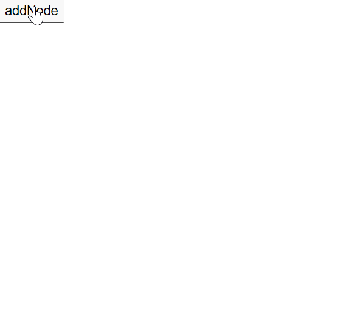
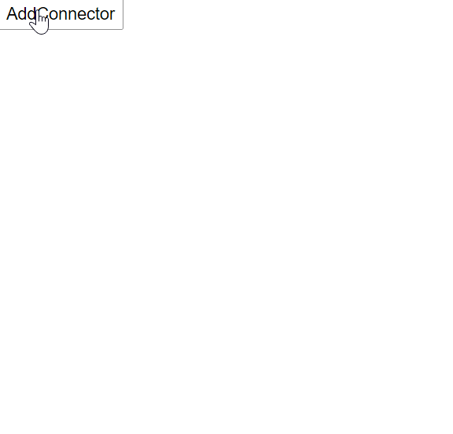
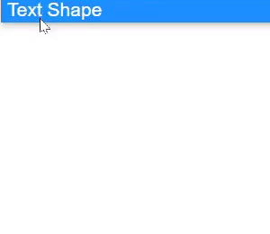

# Tools in Blazor Diagram Component

## How to Use Drawing Tools

The drawing tool allows you to draw any kind of [Node](https://help.syncfusion.com/cr/blazor/Syncfusion.Blazor.Diagram.Node.html) or [Connector](https://help.syncfusion.com/cr/blazor/Syncfusion.Blazor.Diagram.Connector.html) during runtime by clicking and dragging on the diagram page.

## How to Draw Shapes Using the Drawing Tool

To draw a [shape](https://help.syncfusion.com/cr/blazor/Syncfusion.Blazor.Diagram.Shape.html), you need to activate the drawing tool by using the [InteractionController](https://help.syncfusion.com/cr/blazor/Syncfusion.Blazor.Diagram.SfDiagramComponent.html#Syncfusion_Blazor_Diagram_SfDiagramComponent_InteractionController) property and set the shape by using the [DrawingObject](https://help.syncfusion.com/cr/blazor/Syncfusion.Blazor.Diagram.SfDiagramComponent.html#Syncfusion_Blazor_Diagram_SfDiagramComponent_DrawingObject) property. The following code example illustrates how to draw a rectangle at runtime.

```cshtml
@using Syncfusion.Blazor.Diagram
@using Syncfusion.Blazor.Buttons

<SfButton Content="addNode" OnClick="@AddNode" />
<SfDiagramComponent @ref="diagram" Nodes="@nodes" Height="600px" />

@code
{
    //Reference to diagram.
    SfDiagramComponent diagram;

    //Defines diagram's nodes collection.
    public DiagramObjectCollection<Node> nodes;

    protected override void OnInitialized()
    {
        nodes = new DiagramObjectCollection<Node>();
        Node node = new Node()
        {
            ID = "group",
            OffsetX = 200,
            OffsetY = 200,
            Width = 100,
            Height = 100,
            Annotations = new DiagramObjectCollection<ShapeAnnotation>()
            {
                new ShapeAnnotation()
                {
                    Content = "Node",
                    Style = new TextStyle()
                    {
                        Color = "white",
                    }
                }
            },
            Style = new ShapeStyle() { Fill = "#6495ED", StrokeColor = "white" }
        };
        nodes.Add(node);
    }

    private void AddNode()
    {
        //To draw an object once, activate draw once.
        diagram.InteractionController = DiagramInteractions.DrawOnce;
        //Initialize the drawing object to draw the shape.
        diagram.DrawingObject = new Node()
        {
            Shape = new BasicShape() { Type = NodeShapes.Basic, Shape = NodeBasicShapes.Rectangle },
            Style = new ShapeStyle() { Fill = "#6495ED", StrokeColor = "#6495ED" }
        };
    }
}
```
You can download a complete working sample from [GitHub](https://github.com/SyncfusionExamples/Blazor-Diagram-Examples/tree/master/UG-Samples/DrawingTools/NodeDrawTool)



## How to Draw Connector Using the Drawing Tool

To draw a [Connector](https://help.syncfusion.com/cr/blazor/Syncfusion.Blazor.Diagram.Connector.html), you need to activate the drawing tool by using the [InteractionController](https://help.syncfusion.com/cr/blazor/Syncfusion.Blazor.Diagram.SfDiagramComponent.html#Syncfusion_Blazor_Diagram_SfDiagramComponent_InteractionController) property and set the connector by using the [DrawingObject](https://help.syncfusion.com/cr/blazor/Syncfusion.Blazor.Diagram.SfDiagramComponent.html#Syncfusion_Blazor_Diagram_SfDiagramComponent_DrawingObject) property. The following code example illustrates how to draw a [StraightSegment](https://help.syncfusion.com/cr/blazor/Syncfusion.Blazor.Diagram.StraightSegment.html).

```cshtml
@using Syncfusion.Blazor.Diagram
@using Syncfusion.Blazor.Buttons


<SfButton Content="AddConnector" OnClick="@AddConnector" />
<SfDiagramComponent @ref="diagram" Nodes="@nodes" Height="600px" />

@code
{
    //Reference to diagram.
    SfDiagramComponent diagram;

    //Defines diagram's nodes collection.
    public DiagramObjectCollection<Node> nodes;

    protected override void OnInitialized()
    {
        nodes = new DiagramObjectCollection<Node>();
        Node node = new Node()
        {
            ID = "group",
            OffsetX = 200,
            OffsetY = 200,
            Width = 100,
            Height = 100,
            Annotations = new DiagramObjectCollection<ShapeAnnotation>()
            {
                new ShapeAnnotation()
                {
                    Content = "Node",
                    Style = new TextStyle()
                    {
                        Color = "white",
                    }
                }
            },
            Style = new ShapeStyle() { Fill = "#6495ED", StrokeColor = "white" }
        };
        nodes.Add(node);
    }

    private void AddConnector()
    {
        //To draw an object once, activate draw once.
        diagram.InteractionController = DiagramInteractions.DrawOnce;
        //Initialize the drawing object to draw the connectors.
        diagram.DrawingObject = new Connector()
        {
            ID = "connector1",
            Type = ConnectorSegmentType.Straight,            
        };
    }
}
```
You can download a complete working sample from [GitHub](https://github.com/SyncfusionExamples/Blazor-Diagram-Examples/tree/master/UG-Samples/DrawingTools/ConnectorDrawTool)



## How to Draw Text Node Using the Drawing Tool

The diagram allows you to create a text Node as soon as you click on the diagram page. The following code illustrates how to draw a text.

```cshtml
@using Syncfusion.Blazor.Diagram
@using Syncfusion.Blazor.Buttons


<SfButton Content="AddNode" OnClick="@AddNode" />
<SfDiagramComponent @ref="diagram" Nodes="@nodes" Height="600px" />

@code
{
    //Reference to diagram.
    SfDiagramComponent diagram;

    //Define the diagram's nodes collection.
    public DiagramObjectCollection<Node> nodes;

    protected override void OnInitialized()
    {
        nodes = new DiagramObjectCollection<Node>();
        Node node = new Node()
        {
            ID = "group",
            OffsetX = 200,
            OffsetY = 200,
            Width = 100,
            Height = 100,
            Annotations = new DiagramObjectCollection<ShapeAnnotation>()
            {
                new ShapeAnnotation()
                {
                    Content = "Node",
                    Style = new TextStyle()
                    {
                        Color = "white",
                    }
                }
            },
            Style = new ShapeStyle() { Fill = "#6495ED", StrokeColor = "white" }
        };
        nodes.Add(node);
    }

    private void AddNode()
    {
        //To draw an object once, activate draw once.
        diagram.InteractionController = DiagramInteractions.DrawOnce;
        //Initialize the drawing object to draw the shape.
        diagram.DrawingObject = new Node()
        {
            Shape = new TextShape() { Content = "Text Content" },
            Style = new TextStyle() { Fill = "#6495ED", StrokeColor = "#6495ED" }
        };
    }
}
```
You can download a complete working sample from [GitHub](https://github.com/SyncfusionExamples/Blazor-Diagram-Examples/tree/master/UG-Samples/DrawingTools/TextNodeDrawTool)



## How to Draw Polygon Using the Drawing Tool

The diagram allows you to create the [Polygon](https://help.syncfusion.com/cr/blazor/Syncfusion.Blazor.Diagram.NodeBasicShapes.html#Syncfusion_Blazor_Diagram_NodeBasicShapes_Polygon) shape by clicking and moving the mouse at runtime on the diagram page.

The following code illustrates how to draw a polygon shape.

```cshtml
@using Syncfusion.Blazor.Diagram
@using Syncfusion.Blazor.Buttons


<SfButton Content="Polygon" OnClick="@Polygon" />
<SfDiagramComponent @ref="diagram" Nodes="@nodes" Height="600px">
    <SnapSettings Constraints="SnapConstraints.None"></SnapSettings>
</SfDiagramComponent>

@code
{
    //Reference to diagram.
    SfDiagramComponent diagram;
    //Defines diagram's nodes collection.
    public DiagramObjectCollection<Node> nodes;

    protected override void OnInitialized()
    {
        nodes = new DiagramObjectCollection<Node>();
        Node node = new Node()
        {
            ID = "group",
            OffsetX = 200,
            OffsetY = 200,
            Width = 100,
            Height = 100,
            Annotations = new DiagramObjectCollection<ShapeAnnotation>()
            {
                new ShapeAnnotation()
                {
                    Content = "Node",
                    Style = new TextStyle()
                    {
                        Color = "white",
                    }
                }
            },
            Style = new ShapeStyle() { Fill = "#6495ED", StrokeColor = "white" }
        };
        nodes.Add(node);
    }

    private void Polygon()
    {
        //To draw an object once, activate draw once.
        diagram.InteractionController = DiagramInteractions.DrawOnce;
        //Initialize the drawing object to draw the polygon shape.
        diagram.DrawingObject = new Node()
        {
            ID = "polygon",
            Shape = new BasicShape()
            {
                Type = NodeShapes.Basic,
                Shape = NodeBasicShapes.Polygon,
            },
        };
    }
}
```
You can download a complete working sample from [GitHub](https://github.com/SyncfusionExamples/Blazor-Diagram-Examples/tree/master/UG-Samples/DrawingTools/PolygonShapeTool)

## How to Draw Polyline Using the Drawing Tool

The diagram allows you to create the [Polyline](https://help.syncfusion.com/cr/blazor/Syncfusion.Blazor.Diagram.ConnectorSegmentType.html#Syncfusion_Blazor_Diagram_ConnectorSegmentType_Polyline) segments with straight lines and angled vertices at the control points by clicking and moving the mouse at runtime on the diagram page.

The following code illustrates how to draw a polyline connector.

```cshtml
@using Syncfusion.Blazor.Diagram
@using Syncfusion.Blazor.Buttons


<SfButton Content="Polyline" OnClick="@Polyline" />
<SfDiagramComponent @ref="diagram" Nodes="@nodes" Height="600px">
    <SnapSettings Constraints="SnapConstraints.None"></SnapSettings>
</SfDiagramComponent>
@code
{
    //Reference to the diagram.
    SfDiagramComponent diagram;
    //Define the diagram's nodes collection.
    public DiagramObjectCollection<Node> nodes;
    protected override void OnInitialized()
    {
        nodes = new DiagramObjectCollection<Node>();
        Node node = new Node()
        {
            ID = "group",
            OffsetX = 200,
            OffsetY = 200,
            Width = 100,
            Height = 100,
            Annotations = new DiagramObjectCollection<ShapeAnnotation>()
            {
                new ShapeAnnotation()
                {
                    Content = "Node",
                    Style = new TextStyle()
                    {
                        Color = "white",
                    }
                }
            },
            Style = new ShapeStyle() { Fill = "#6495ED", StrokeColor = "white" }
        };
        nodes.Add(node);
    }
    private void Polyline()
    {
        //Draw an object once and activate the draw once.
        diagram.InteractionController = DiagramInteractions.DrawOnce;
        //Initialize the drawing object to draw the polyline connector.
        diagram.DrawingObject = new Connector()
        {
            ID = "connector1",
            Type = ConnectorSegmentType.Polyline,            
        };
    }
}
```
You can download a complete working sample from [GitHub](https://github.com/SyncfusionExamples/Blazor-Diagram-Examples/tree/master/UG-Samples/DrawingTools/PolylineDrawTool)

## How to Select Tool

There are some functionalities that can be achieved by clicking and dragging on the diagram surface. They are as follows,

* Draw selection rectangle: MultipleSelect interaction Controller
* Pan the diagram: Zoom pan
* Draw nodes/connectors: DrawOnce

As all three behaviors are completely different, you can achieve only one behavior at a time based on the interaction controller that you choose.
When more than one of these interaction controllers are applied, an interaction controller is activated based on the precedence given in the following table.

|Precedence|DiagramInteractions|Description|
|----------|-----|-----------|
|1st|[ContinuesDraw](https://help.syncfusion.com/cr/blazor/Syncfusion.Blazor.Diagram.DiagramInteractions.html#Syncfusion_Blazor_Diagram_DiagramInteractions_ContinuousDraw)|Allows you to draw the nodes or connectors continuously. Once it is activated, you cannot perform any other interaction in the diagram.|
|2nd|[DrawOnce](https://help.syncfusion.com/cr/blazor/Syncfusion.Blazor.Diagram.DiagramInteractions.html#Syncfusion_Blazor_Diagram_DiagramInteractions_DrawOnce)|Allows you to draw a single node or connector. Once you complete the DrawOnce action, SingleSelect, and MultipleSelect interaction controllers are automatically enabled.|
|3rd|[ZoomPan](https://help.syncfusion.com/cr/blazor/Syncfusion.Blazor.Diagram.DiagramInteractions.html#Syncfusion_Blazor_Diagram_DiagramInteractions_ZoomPan)|Allows you to pan the diagram. When you enable both the SingleSelect and ZoomPan interaction controllers, you can perform the basic interaction as the cursor hovers node/connector. Panning is enabled when cursor hovers the diagram.|
|4th|[MultipleSelect](https://help.syncfusion.com/cr/blazor/Syncfusion.Blazor.Diagram.DiagramInteractions.html#Syncfusion_Blazor_Diagram_DiagramInteractions_MultipleSelect)|Allows you to select multiple nodes and connectors. When you enable both the MultipleSelect and ZoomPan interaction controllers, cursor hovers the diagram. When panning is enabled, you cannot select multiple nodes.|
|5th|[SingleSelect](https://help.syncfusion.com/cr/blazor/Syncfusion.Blazor.Diagram.DiagramInteractions.html#Syncfusion_Blazor_Diagram_DiagramInteractions_SingleSelect)|Allows you to select individual nodes or connectors.|
|6th|[None](https://help.syncfusion.com/cr/blazor/Syncfusion.Blazor.Diagram.DiagramInteractions.html#Syncfusion_Blazor_Diagram_DiagramInteractions_None)|Disables all interaction controllers.|
|7th|[Default](https://help.syncfusion.com/cr/blazor/Syncfusion.Blazor.Diagram.DiagramInteractions.html#Syncfusion_Blazor_Diagram_DiagramInteractions_Default)|Allows users to select an individual as well as multiple nodes and connectors.|

Set the desired [InteractionController](https://help.syncfusion.com/cr/blazor/Syncfusion.Blazor.Diagram.SfDiagramComponent.html#Syncfusion_Blazor_Diagram_SfDiagramComponent_InteractionController) for the diagram.

The following code illustrates how to enable single interaction controller,

```cshtml
@using Syncfusion.Blazor.Diagram

<SfDiagramComponent Connectors="@connectors" Height="600px" InteractionController="@tool" />

@code
{
    //Enable the single tool.
    public DiagramInteractions tool = DiagramInteractions.DrawOnce;
    //Defines diagram's connectors collection.
    public DiagramObjectCollection<Connector> connectors = new DiagramObjectCollection<Connector>();
}
```

The following code illustrates how to enable multiple interaction controllers,

```cshtml
@using Syncfusion.Blazor.Diagram

<SfDiagramComponent Connectors="@connectors" @ref="diagram" Height="600px" InteractionController="@tool" />

@code
{
    //Reference to diagram.
    SfDiagramComponent diagram;
    //Enable the multiple tools.
    public DiagramInteractions tool = DiagramInteractions.DrawOnce | DiagramInteractions.ZoomPan;
    //Defines diagram's connectors collection.
    public DiagramObjectCollection<Connector> connectors = new DiagramObjectCollection<Connector>();
}
```

You can download a complete working sample from [GitHub](https://github.com/SyncfusionExamples/Blazor-Diagram-Examples/tree/master/UG-Samples/DrawingTools/ToolSelection).

## How to Enable Freehand Drawing

The diagram supports an innovative feature called Freehand Drawing, empowering users to effortlessly create freeform curves (splines) directly on the diagram page. With this remarkable functionality, users can unlock their imagination and showcase their creativity by effortlessly sketching anything from simple drawings to elaborate artistic creations. To utilize this feature, users can access the [DrawingObject](https://help.syncfusion.com/cr/blazor/Syncfusion.Blazor.Diagram.SfDiagramComponent.html#Syncfusion_Blazor_Diagram_SfDiagramComponent_DrawingObject) property and select the [Freehand](https://help.syncfusion.com/cr/blazor/Syncfusion.Blazor.Diagram.ConnectorSegmentType.html#Syncfusion_Blazor_Diagram_ConnectorSegmentType_Freehand) connector type, enabling them to express their ideas and concepts through fluid and natural hand-drawn lines.

The following code illustrates how to draw a freehand drawing.

```cshtml
@using Syncfusion.Blazor.Diagram
<input Type="button" value="Freehand" @onclick="Freehand" />
<SfDiagramComponent @ref="diagram" Nodes="@nodes" Height="600px">
    <SnapSettings Constraints="SnapConstraints.None"></SnapSettings>
</SfDiagramComponent>
@code
{
    //Reference to the diagram.
    SfDiagramComponent diagram;
    //Define the diagram's nodes collection.
    public DiagramObjectCollection<Node> nodes;
    protected override void OnInitialized()
    {
        nodes = new DiagramObjectCollection<Node>();
        Node node = new Node()
        {
            ID = "group",
            OffsetX = 200,
            OffsetY = 200,
            Width = 100,
            Height = 100,
            Annotations = new DiagramObjectCollection<ShapeAnnotation>()
            {
                new ShapeAnnotation()
                {
                    Content = "Node",
                    Style = new TextStyle()
                    {
                        Color = "white",
                    }
                }
            },
            Style = new ShapeStyle() { Fill = "#6495ED", StrokeColor = "white" }
        };
        nodes.Add(node);
    }
    private void Freehand()
    {
        //Draw an object once and activate the draw once.
        diagram.InteractionController = DiagramInteractions.DrawOnce;
        //Initialize the drawing object to draw the freehand connector.
        diagram.DrawingObject = new Connector()
        {
            ID = "connector1",
            Type = ConnectorSegmentType.Freehand,            
        };
    }
}
```
You can download a complete working sample from [GitHub](https://github.com/SyncfusionExamples/Blazor-Diagram-Examples/tree/master/UG-Samples/DrawingTools/FreehandDrawTool).


## See also

* [How to Zoom the Diagram Without Ctrl + Wheel and Enable Pan on Right Click Instead of Left Click in Blazor Diagram](https://support.syncfusion.com/kb/article/18992/how-to-zoom-the-diagram-without-ctrl--wheel-and-enable-pan-on-right-click-instead-of-left-click-in-blazor-diagram)
