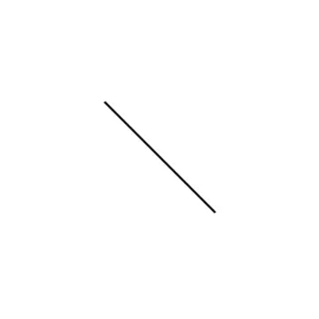
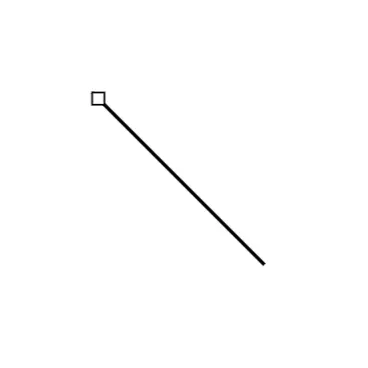
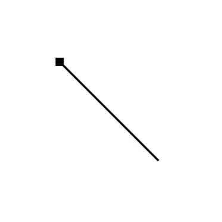
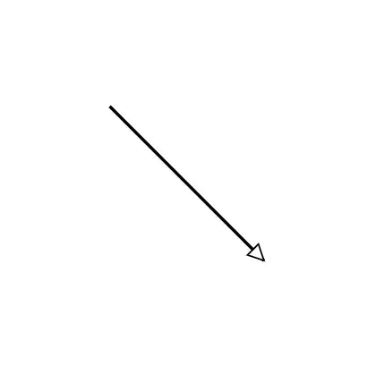
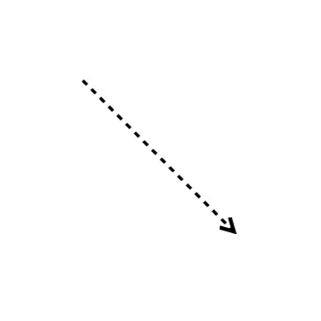
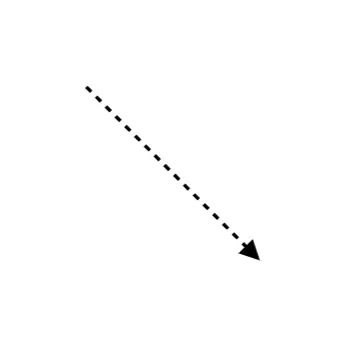
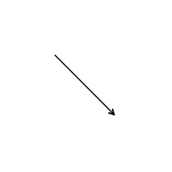
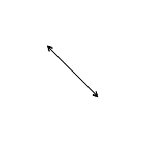
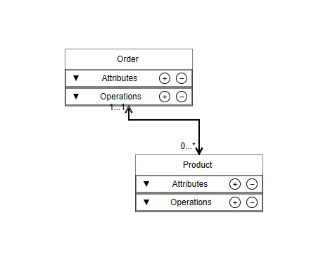

# UML Class Diagram in Blazor Diagram Component

A UML class diagram is a visual blueprint that represents classes, their properties, operations, and relationships in a single visual model. It is one of the most widely used UML diagram types because it maps closely to object-oriented programming concepts such as classes, interfaces, enumerations, inheritance, and associations.

The [SfDiagramComponent](https://help.syncfusion.com/cr/blazor/Syncfusion.Blazor.Diagram.SfDiagramComponent.html) in the Syncfusion<sup style="font-size:70%">&reg;</sup> Blazor suite supports creating and visualizing UML class diagrams. It provides classifier nodes such as classes, interfaces, and enumerations, and relationship connectors such as association, aggregation, composition, inheritance, dependency, and realization.In the Blazor Diagram component, classifier nodes are created using [UmlClassifierShape](https://help.syncfusion.com/cr/blazor/Syncfusion.Blazor.Diagram.UmlClassifierShape.html), while relationships are created using [RelationShip](https://help.syncfusion.com/cr/blazor/Syncfusion.Blazor.Diagram.RelationShip.html) connectors.

## UML Class Diagram Elements

A UML class diagram uses several core elements to represent and communicate object-oriented designs. This section introduces the fundamental elements of a UML class diagram, with detailed API configuration for each element provided in subsequent topics.

### Classifiers

A classifier represents a named type in a UML class diagram and serves as the primary building block. To create a classifier node, assign a [UmlClassifierShape](https://help.syncfusion.com/cr/blazor/Syncfusion.Blazor.Diagram.UmlClassifierShape.html) to the `Shape` property of a `Node`. Then set the `Classifier` property to one of the [ClassifierShape](https://help.syncfusion.com/cr/blazor/Syncfusion.Blazor.Diagram.ClassifierShape.html) enum values.

| Classifier | Description |
|---|---|
| **ClassifierShape.Class** | Represents an object type with attributes and operations. |
| **ClassifierShape.Interface** | Represents a contract that can define attributes and operations. |
| **ClassifierShape.Enumeration** | Represents a fixed set of named values. |

### Attributes, Operations, and Parameters

A UML class or interface node is visually divided into sections called compartments, each serving a distinct purpose:

- **Attributes** represent data members or properties of the class. For example, `- name : string`.
- **Operations** represent behaviors or methods that the class exposes. For example, `+ Move(speed : int) : void`.
- **Parameters** are the input values passed to an operation. For example, `speed : int`.
- **Visibility** defines the access level of an attribute or operation and is denoted by symbols: `+` (public), `-` (private), `#` (protected), and `~` (package).

## Create UML Classifier Nodes

This section explains how to create each supported UML classifier node type: class, interface, and enumeration.

### Create a UML Class

A UML class node renders the class name, attributes, and operations in separate compartments. To create a class node, set the `Classifier` property to **ClassifierShape.Class** and define the `Attributes` and `Methods` details using the `ClassShape` property.

The following properties can be used to configure UML class attributes and operations:

| Property | Description |
|---|---|
| `Name` | Specifies the member name. |
| `Type` | Specifies the data type of an attribute or the return type of an operation. |
| `Scope` | Specifies the visibility of the member. The default value is `UmlScope.Public`. |
| `IsSeparator` | When set to `true`, renders a horizontal divider instead of a member row. |
| `SeparatorStyle` | Defines the style applied to the separator line. |
| `Parameters` | Specifies the collection of parameters for an operation. Each parameter is represented by a `UmlTypedElement` and is displayed in the format `name : type`. |

```cshtml
@using Syncfusion.Blazor.Diagram

<SfDiagramComponent Height="600px" Nodes="@nodes">
</SfDiagramComponent>

@code {
    DiagramObjectCollection<Node> nodes = new DiagramObjectCollection<Node>();

    protected override void OnInitialized()
    {
        nodes.Add(new Node()
        {
            ID = "classNode",
            OffsetX = 250,
            OffsetY = 250,
            Shape = new UmlClassifierShape()
            {
                Classifier = ClassifierShape.Class,
                ClassShape = new UmlClass()
                {
                    Name = "Animal",
                    Attributes = new DiagramObjectCollection<UmlClassAttribute>()
                    {
                        new UmlClassAttribute() { Name = "name", Type = "string", Scope = UmlScope.Private },
                        new UmlClassAttribute() { Name = "age", Type = "int", Scope = UmlScope.Private }
                    },
                    Methods = new DiagramObjectCollection<UmlClassMethod>()
                    {
                        new UmlClassMethod() { Name = "eat", Type = "void", Scope = UmlScope.Public },
                        new UmlClassMethod()
                        {
                            Name = "move",
                            Type = "void",
                            Scope = UmlScope.Public,
                            Parameters = new DiagramObjectCollection<UmlTypedElement>()
                            {
                                new UmlTypedElement() { Name = "speed", Type = "int" }
                            }
                        }
                    }
                }
            }
        });
    }
}
```

A complete working sample can be downloaded from [GitHub](https://github.com/SyncfusionExamples/Blazor-UG-Examples/blob/master/Diagram/Server/Pages/UMLCLassDiagram/UmlClassShape.razor).



### Create a UML Interface

A UML interface node displays the **«interface»** stereotype above the interface name. It represents a contract rather than an implementation and supports defining attributes and operations. To create an interface node, set the `Classifier` property to **ClassifierShape.Interface** and define the interface details using the `InterfaceShape` property.

For details on attributes and operations properties, refer to the [UML class section](#create-a-uml-class).

```cshtml
@using Syncfusion.Blazor.Diagram

<SfDiagramComponent Height="600px" Nodes="@nodes">
</SfDiagramComponent>

@code {
    DiagramObjectCollection<Node> nodes = new DiagramObjectCollection<Node>();

    protected override void OnInitialized()
    {
        nodes.Add(new Node()
        {
            ID = "interfaceNode",
            OffsetX = 250,
            OffsetY = 250,
            Width = 200,
            Shape = new UmlClassifierShape()
            {
                Classifier = ClassifierShape.Interface,
                InterfaceShape = new UmlInterface()
                {
                    Name = "IMovable",
                    Methods = new DiagramObjectCollection<UmlClassMethod>()
                    {
                        new UmlClassMethod() { Name = "Move", Type = "void", Scope = UmlScope.Public }
                    }
                }
            }
        });
    }
}
```

A complete working sample can be downloaded from [GitHub](https://github.com/SyncfusionExamples/Blazor-UG-Examples/blob/master/Diagram/Server/Pages/UMLCLassDiagram/UmlInterfaceShape.razor).



### Create a UML Enumeration

A UML enumeration node displays the **«enumeration»** stereotype above the enumeration name, followed by a members section that lists its named constants. To create an enumeration node, set the `Classifier` property to `ClassifierShape.Enumeration` and define the enumeration details using the `EnumerationShape` property.

The following properties can be used to configure members in UML enumeration:

| Property | Description |
|---|---|
| `Name` | Specifies the literal name displayed in the members section. |
| `IsSeparator` | When set to **true**, renders a horizontal divider in the members section. |
| `SeparatorStyle` | Defines the style applied to the separator line. |

```cshtml
@using Syncfusion.Blazor.Diagram

<SfDiagramComponent Height="600px" Nodes="@nodes">
</SfDiagramComponent>

@code {
    DiagramObjectCollection<Node> nodes = new DiagramObjectCollection<Node>();

    protected override void OnInitialized()
    {
        nodes.Add(new Node()
        {
            ID = "enumNode",
            OffsetX = 250,
            OffsetY = 250,
            Width = 200,
            Shape = new UmlClassifierShape()
            {
                Classifier = ClassifierShape.Enumeration,
                EnumerationShape = new UmlEnumeration()
                {
                    Name = "Direction",
                    Members = new DiagramObjectCollection<UmlEnumerationMember>()
                    {
                        new UmlEnumerationMember() { Name = "North" },
                        new UmlEnumerationMember() { Name = "South" },
                        new UmlEnumerationMember() { IsSeparator = true },
                        new UmlEnumerationMember() { Name = "East" },
                        new UmlEnumerationMember() { Name = "West" }
                    }
                }
            }
        });
    }
}
```

A complete working sample can be downloaded from [GitHub](https://github.com/SyncfusionExamples/Blazor-UG-Examples/blob/master/Diagram/Server/Pages/UMLCLassDiagram/UmlEnumerationShape.razor).



N> The `UmlClassifierShape` automatically adjusts its height based on the number of rows in each section, eliminating the need to set an explicit `Height`. UML classifier nodes can be resized only from the right side (East resize handle). Rotation and corner resize handles are not supported.

## Customize UML Classifier Appearance

The Blazor Diagram component provides styling options for each visual element of a UML classifier node, including the classifier header, attributes, and operations.

### Customize the Classifier Header

The `HeaderStyle` property of `UmlClassifierShape` accepts a [TextStyle](https://help.syncfusion.com/cr/blazor/Syncfusion.Blazor.Diagram.TextStyle.html) object that controls the background fill, text color, font weight, and other visual properties of the classifier name header compartment.

```cshtml
@using Syncfusion.Blazor.Diagram

<SfDiagramComponent Height="600px" Nodes="@nodes">
</SfDiagramComponent>

@code {
    DiagramObjectCollection<Node> nodes = new DiagramObjectCollection<Node>();

    protected override void OnInitialized()
    {
        nodes.Add(new Node()
        {
            OffsetX = 250,
            OffsetY = 250,
            Width = 200,
            Shape = new UmlClassifierShape()
            {
                // Customize style for the header(top compartment)
                HeaderStyle = new TextStyle()
                {
                    Fill  = "#1565C0",
                    Color = "white"
                }
            }
        });
    }
}
```

### Customize Section Headers

Each compartment — **Attributes**, **Operations**, and **Members** — has a header row configurable through [UmlSectionHeaderSettings](https://help.syncfusion.com/cr/blazor/Syncfusion.Blazor.Diagram.UmlSectionHeaderSettings.html). Assign a `UmlSectionHeaderSettings` instance to `AttributeHeaderSettings`, `MethodHeaderSettings`, or `MemberHeaderSettings` on the `UmlClass`, `UmlInterface`, or `UmlEnumeration` shape to control the section label, style, action buttons, and expand or collapse behavior.

| Property | Description |
|---|---|
| `HeaderText` | Specifies the text label for the section header. |
| `Style` | Defines the visual style for the section header row. |
| `EnableAddAction` | Shows or hides the `+` button. The default value is `true`. |
| `EnableRemoveAction` | Shows or hides the `–` button. The default value is `true`. |
| `IsExpanded` | Specifies whether the section content is visible. The default value is `true`. |
| `ShowExpandCollapseIcon` | Shows or hides the expand or collapse icon. The default value is `true`. |

```cshtml
@using Syncfusion.Blazor.Diagram

<SfDiagramComponent Height="600px" Nodes="@nodes">
    <SnapSettings Constraints="SnapConstraints.None"></SnapSettings>
</SfDiagramComponent>

@code {
    DiagramObjectCollection<Node> nodes = new DiagramObjectCollection<Node>();

    protected override void OnInitialized()
    {
        nodes.Add(new Node()
        {
            ID = "customerNode",
            OffsetX = 250,
            OffsetY = 300,
            Width = 220,
            Shape = new UmlClassifierShape()
            {
                Classifier = ClassifierShape.Class,
                HeaderStyle = new TextStyle() { Fill = "#334155", Color = "#FFFFFF", Bold = true },
                ClassShape = new UmlClass()
                {
                    Name = "Customer",
                    AttributeHeaderSettings = new UmlSectionHeaderSettings()
                    {
                        HeaderText = "Properties",
                        ShowExpandCollapseIcon = false,
                        IsExpanded = true,
                        Style = new TextStyle() { Fill = "#475569", Color = "#FFFFFF", Bold = true }
                    },
                    MethodHeaderSettings = new UmlSectionHeaderSettings()
                    {
                        HeaderText = "Operations",
                        ShowExpandCollapseIcon = true,
                        EnableAddAction = true,
                        EnableRemoveAction = true,
                        IsExpanded = true,
                        Style = new TextStyle() { Fill = "#64748B", Color = "#FFFFFF", Bold = true }
                    },
                    Attributes = new DiagramObjectCollection<UmlClassAttribute>()
                    {
                        new UmlClassAttribute() { Name = "CustomerId", Type = "int", Scope = UmlScope.Public, Style = new TextStyle() { Fill = "#E2E8F0", Color = "#334155" } },
                        new UmlClassAttribute() { Name = "Email", Type = "string", Scope = UmlScope.Private, Style = new TextStyle() { Fill = "#E2E8F0", Color = "#334155" } }
                    },
                    Methods = new DiagramObjectCollection<UmlClassMethod>()
                    {
                        new UmlClassMethod() { Name = "PlaceOrder", Type = "void", Scope = UmlScope.Public, Style = new TextStyle() { Fill = "#F8FAFC", Color = "#475569" } },
                        new UmlClassMethod() { Name = "UpdateProfile", Type = "bool", Scope = UmlScope.Public, Style = new TextStyle() { Fill = "#F8FAFC", Color = "#475569" } },
                        new UmlClassMethod() { Name = "GetOrderHistory", Type = "List<Order>", Scope = UmlScope.Public, Style = new TextStyle() { Fill = "#F8FAFC", Color = "#475569" } }
                    }
                }
            }
        });
    }
}
```
A complete working sample can be downloaded from [GitHub](https://github.com/SyncfusionExamples/Blazor-UG-Examples/blob/master/Diagram/Server/Pages/UMLCLassDiagram/UmlClassHeaderProperties.razor).



### Customize Attributes, Operations, and Members

Individual attributes, operations, and enumeration members support row-level styling. Assign a [TextStyle](https://help.syncfusion.com/cr/blazor/Syncfusion.Blazor.Diagram.TextStyle.html) object to the `Style` property of any `UmlClassAttribute`, `UmlClassMethod`, or `UmlEnumerationMember` instance to control its background color and text appearance independently from other rows.

```cshtml
@using Syncfusion.Blazor.Diagram

<SfDiagramComponent Height="600px" Nodes="@nodes" />

@code {
    DiagramObjectCollection<Node> nodes = new DiagramObjectCollection<Node>();

    protected override void OnInitialized()
    {
        nodes.Add(new Node()
        {
            ID = "customerNode",
            OffsetX = 250,
            OffsetY = 300,
            Width = 220,
            Shape = new UmlClassifierShape()
            {
                Classifier = ClassifierShape.Class,
                HeaderStyle = new TextStyle() { Fill = "#334155", Color = "#FFFFFF", Bold = true },
                ClassShape = new UmlClass()
                {
                    Attributes = new DiagramObjectCollection<UmlClassAttribute>()
                    {
                        new UmlClassAttribute() 
                        { 
                            Name = "CustomerId", Type = "int", Scope = UmlScope.Public, 
                            Style = new TextStyle() { Fill = "#E2E8F0", Color = "#334155" } 
                        }
                    },
                    Methods = new DiagramObjectCollection<UmlClassMethod>()
                    {
                        new UmlClassMethod() 
                        { 
                            Name = "PlaceOrder", Type = "void", Scope = UmlScope.Public, 
                            Style = new TextStyle() { Fill = "#F8FAFC", Color = "#475569" } 
                        }
                    }
                }
            }
        });
    }
}
```

## Add or Remove UML Members at Runtime

Attributes, operations, and enumeration members in a UML classifier node can be added or removed at runtime, either programmatically or interactively through the **+** and **–** action buttons displayed in section headers.

### Add and Remove Members

To add a member programmatically:

- Add a `UmlClassAttribute` to the `Attributes` collection.
- Add a `UmlClassMethod` to the `Methods` collection.
- Add a `UmlEnumerationMember` to the `Members` collection.

When `EnableAddAction` is enabled, a **+** button appears in the corresponding section header.

To remove a member programmatically:

- Remove a `UmlClassAttribute` from the `Attributes` collection.
- Remove a `UmlClassMethod` from the `Methods` collection.
- Remove a `UmlEnumerationMember` from the `Members` collection.

When `EnableRemoveAction` is enabled, a **–** button appears in the corresponding section header.

### Collection Change Events

The [CollectionChanging](https://help.syncfusion.com/cr/blazor/Syncfusion.Blazor.Diagram.SfDiagramComponent.html#Syncfusion_Blazor_Diagram_SfDiagramComponent_CollectionChanging) event occurs before an item is added to or removed from a UML classifier collection. Use this event to validate or customize the item before the change is applied. Set `args.Cancel` to **true** to cancel the change.

The [CollectionChanged](https://help.syncfusion.com/cr/blazor/Syncfusion.Blazor.Diagram.SfDiagramComponent.html#Syncfusion_Blazor_Diagram_SfDiagramComponent_CollectionChanged) event occurs after the collection has been updated.

```cshtml
private void OnCollectionChanging(CollectionChangingEventArgs args)
{
    if (args.Element is UmlClassAttribute attribute)
    {
        attribute.Style = new TextStyle() { Fill = "#E2E8F0", Color = "#334155", Bold = true };
    }
    else if (args.Element is UmlEnumerationMember)
    {
        args.Cancel = true;
    }
}

private void OnCollectionChanged(CollectionChangedEventArgs args)
{
    if (args.Element is UmlClassAttribute attribute)
    {
        Console.WriteLine($"Collection action: {args.Action}, Attribute: {attribute.Name}");
    }
}
```

## Edit UML Classifier Text

UML classifier text can be edited inline directly on the canvas. To edit text, double-click any name, attribute, operation, member, and header compartment in a classifier node. Alternatively, select the target item and press **F2** to enter edit mode.

> Visibility symbols (`+`, `-`, `#`, `~`) cannot be modified through inline editing. Update the `Scope` property programmatically instead.

## UML Relationships

UML relationships define how classifiers are associated with, depend on, or inherit from one another. The [RelationShip](https://help.syncfusion.com/cr/blazor/Syncfusion.Blazor.Diagram.RelationShip.html) shape provides built-in support for standard UML relationship notations, including multiplicity labels and association directionality.

### Relationship Types

Set the `RelationshipShape` property to a [Relationship](https://help.syncfusion.com/cr/blazor/Syncfusion.Blazor.Diagram.Relationship.html) enumeration value to specify the relationship type. The following table describes each supported type and its visual notation.

| Relationship | Description | Example |
|---|---|---|
| `Association` | A structural relationship that connects two classifiers. |  |
| `Aggregation` | A whole-part relationship represented by a hollow diamond at the source end. |  |
| `Composition` | A strong whole-part relationship represented by a filled diamond at the source end. |  |
| `Inheritance` | Represents generalization (inheritance) with an open triangle arrowhead at the target end. |  |
| `Dependency` | Represents a dependency relationship using a dashed arrow. |  |
| `Realization` | Represents interface implementation using a dashed line with an open triangle arrowhead. |  |

```cshtml
@using Syncfusion.Blazor.Diagram

<SfDiagramComponent Height="800px" Connectors="@connectors" />

@code {
    private DiagramObjectCollection<Connector> connectors = new DiagramObjectCollection<Connector>();

    protected override void OnInitialized()
    {
        connectors.Add(new Connector()
        {
            SourcePoint = new DiagramPoint() { X = 100, Y = 100 },
            TargetPoint = new DiagramPoint() { X = 200, Y = 200 },
            Type = ConnectorSegmentType.Straight,
            Shape = new RelationShip() { RelationshipShape = Relationship.Inheritance }
        });
    }
}
```

The `AssociationType` property is only applicable when `RelationshipShape` is set to **Relationship.Association**.

| Value | Description | Example |
|---|---|---|
| `AssociationFlow.Directional` | Displays an arrow from the source to the target. |  |
| `AssociationFlow.BiDirectional` | Displays arrows in both directions. |  |

```cshtml
using Syncfusion.Blazor.Diagram

<SfDiagramComponent Height="800px" Connectors="@connectors" />

@code {
    private DiagramObjectCollection<Connector> connectors = new DiagramObjectCollection<Connector>();

    protected override void OnInitialized()
    {
        connectors.Add(new Connector()
        {
            SourcePoint = new DiagramPoint() { X = 100, Y = 100 },
            TargetPoint = new DiagramPoint() { X = 200, Y = 200 },
            Type = ConnectorSegmentType.Straight,
            Shape = new RelationShip()
            {
                RelationshipShape = Relationship.Association,
                AssociationType = AssociationFlow.BiDirectional
            }
        });
    }
}
```

### Define Relationship Multiplicity

[ClassifierMultiplicity](https://help.syncfusion.com/cr/blazor/Syncfusion.Blazor.Diagram.ClassifierMultiplicity.html) defines the multiplicity (cardinality) labels displayed at the source and target ends of a relationship connector. Use the `Multiplicity` property to specify multiplicity values for both ends of the relationship. The `LowerBounds` and `UpperBounds` property specifies the minimum and maximum number of instances. Use `"*"` to represent an unlimited number of instances.

```cshtml
@using Syncfusion.Blazor.Diagram

<SfDiagramComponent Height="600px" Connectors="@connectors" />

@code {
    DiagramObjectCollection<Connector> connectors = new DiagramObjectCollection<Connector>();

    protected override void OnInitialized()
    {
        connectors.Add(new Connector()
        {
            SourcePoint = new DiagramPoint() { X = 100, Y = 100 },
            TargetPoint = new DiagramPoint() { X = 200, Y = 200 },
            Shape = new RelationShip()
            {
                RelationshipShape = Relationship.Aggregation,
                AssociationType   = AssociationFlow.BiDirectional,
                Multiplicity = new ClassifierMultiplicity()
                {
                    Source = new MultiplicityLabel() { LowerBounds = "1", UpperBounds = "1" },
                    Target = new MultiplicityLabel() { LowerBounds = "0", UpperBounds = "*" }
                }
            }
        });
    }
}
```



## Add UML Shapes to the Symbol Palette

Add UML classifier shapes and relationship connectors to the [SfSymbolPaletteComponent](https://help.syncfusion.com/cr/blazor/Syncfusion.Blazor.Diagram.SfSymbolPaletteComponent.html) so users can drag and drop UML symbols onto the diagram canvas.

```cshtml
@using Syncfusion.Blazor.Diagram
@using Syncfusion.Blazor.Diagram.SymbolPalette

<div style="float:left">
    <SfSymbolPaletteComponent @ref="@palette" Width="320px" Height="900px" Palettes="@palettes" SymbolHeight="@symbolHeight" SymbolWidth="@symbolWidth" />
</div>
<div style="float:left">
        <SfDiagramComponent @ref="@Diagram" Height="700px" Width="600px" />
</div>
@code {
    private SfDiagramComponent Diagram;
    private SfSymbolPaletteComponent palette;
    private DiagramObjectCollection<Palette> palettes;
    double symbolHeight = 130;
    double symbolWidth = 130;
    private DiagramObjectCollection<NodeBase> umlClassNodes { get; set; }
    private DiagramObjectCollection<NodeBase> umlConnectors { get; set; }
    protected override async Task OnAfterRenderAsync(bool firstRender)
    {
        palette.Targets = new DiagramObjectCollection<SfDiagramComponent>
        {
            Diagram
        };
    }
    protected override void OnInitialized()
    {
        palettes = new DiagramObjectCollection<Palette>();
        umlClassNodes = new DiagramObjectCollection<NodeBase>()
        {
            new Node
            {
                Height = 200,
                Shape = new UmlClassifierShape()
                {
                    Classifier = ClassifierShape.Class,
                    ClassShape = new UmlClass()
                    {
                        Name = "ClassName",
                    }
                }
            },
            new Node
            {
                Height = 200,
                Shape = new UmlClassifierShape()
                {
                    Classifier = ClassifierShape.Interface,
                    InterfaceShape = new UmlInterface
                    {
                        Name = "InterfaceName",
                    }
                }
            },
            new Node
            {
                Width = 200,
                Shape = new UmlClassifierShape()
                {
                    Classifier = ClassifierShape.Enumeration,
                    EnumerationShape = new UmlEnumeration
                    {
                        Name = "EnumName",
                    }
                }
            }
        };
        umlConnectors = new DiagramObjectCollection<NodeBase>()
        {
            new Connector
            {
                SourcePoint = new DiagramPoint() { X = 110, Y = 0 }, TargetPoint = new DiagramPoint() { X = 200, Y = 110 },
                Shape = new RelationShip() { RelationshipShape = Relationship.Association }
            }
        };
        palettes = new DiagramObjectCollection<Palette>()
        {
           new Palette()
           {
               ID = "BasicShape", Symbols = umlClassNodes, Title = "UML Class Shapes"
           },
           new Palette()
           {
               ID = "ConnectorShape", Symbols = umlConnectors, Title = "UML Class Connector"
           }
        };
    }
}
```

A complete working sample can be downloaded from [GitHub](https://github.com/SyncfusionExamples/Blazor-UG-Examples/blob/master/Diagram/Server/Pages/UMLCLassDiagram/UmlClassSymlbolShapes.razor).




## See also

- [Getting Started with Syncfusion Blazor Diagram](https://blazor.syncfusion.com/documentation/diagram/getting-started)
- [SfDiagramComponent API Reference](https://help.syncfusion.com/cr/blazor/Syncfusion.Blazor.Diagram.SfDiagramComponent.html)
- [UmlClassifierShape API Reference](https://help.syncfusion.com/cr/blazor/Syncfusion.Blazor.Diagram.UmlClassifierShape.html)
- [RelationShip API Reference](https://help.syncfusion.com/cr/blazor/Syncfusion.Blazor.Diagram.RelationShip.html)
- [SfSymbolPaletteComponent API Reference](https://help.syncfusion.com/cr/blazor/Syncfusion.Blazor.Diagram.SfSymbolPaletteComponent.html)
