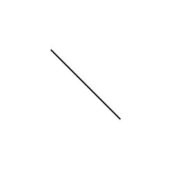
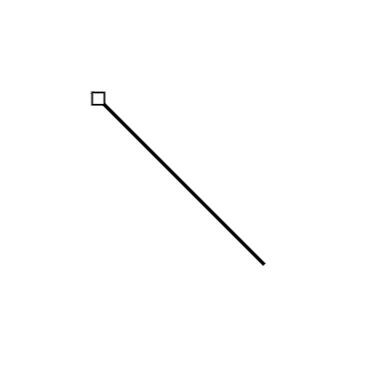
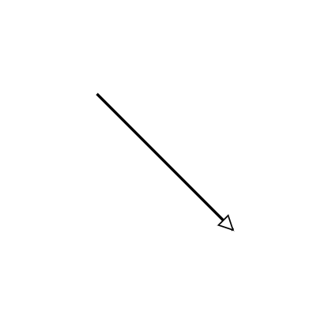

# UML Class Diagram in Blazor Diagram Component

A UML class diagram is a structural diagram that represents the static architecture of a system by depicting classes, interfaces, enumerations, and the relationships between them. The [SfDiagramComponent](https://help.syncfusion.com/cr/blazor/Syncfusion.Blazor.Diagram.SfDiagramComponent.html) in the Syncfusion<sup style="font-size:70%">&reg;</sup> Blazor suite supports the creation and visualization of UML class diagrams through the [UmlClassifierShape](https://help.syncfusion.com/cr/blazor/Syncfusion.Blazor.Diagram.UmlClassifierShape.html) class.

To render a UML classifier, assign a `UmlClassifierShape` to the [Shape](https://help.syncfusion.com/cr/blazor/Syncfusion.Blazor.Diagram.Node.html#Syncfusion_Blazor_Diagram_Node_Shape) property of a `Node`. This shape supports three classifier types - **Class**, **Interface**, and **Enumeration** - each rendered with its own set of compartments and visual conventions.

## Classifier Types

The [Classifier](https://help.syncfusion.com/cr/blazor/Syncfusion.Blazor.Diagram.UmlClassifierShape.html#Syncfusion_Blazor_Diagram_UmlClassifierShape_Classifier) property of `UmlClassifierShape` accepts a [ClassifierShape](https://help.syncfusion.com/cr/blazor/Syncfusion.Blazor.Diagram.ClassifierShape.html) enum value that determines which UML shape is rendered.

| Classifier | Description |
|---|---|
| `ClassifierShape.Class` | Renders a UML class with compartments for attributes and operations |
| `ClassifierShape.Interface` | Renders a UML interface with a `«interface»` stereotype and operations |
| `ClassifierShape.Enumeration` | Renders a UML enumeration with a `«enumeration»` stereotype and members |

## UML Class

A UML class is rendered with three compartments: the class name header, an attributes section, and a methods (operations) section.

The following code example shows how to create a UML class node.

```cshtml
@using Syncfusion.Blazor.Diagram

<SfDiagramComponent Height="600px" Nodes="@nodes">
</SfDiagramComponent>

@code {
    DiagramObjectCollection<Node> nodes = new DiagramObjectCollection<Node>();

    protected override void OnInitialized()
    {
        nodes.Add(new Node()
        {
            ID = "classNode",
            OffsetX = 250,
            OffsetY = 250,
            Shape = new UmlClassifierShape()
            {
                Classifier = ClassifierShape.Class,
                ClassShape = new UmlClass()
                {
                    Name = "Animal",
                    Attributes = new DiagramObjectCollection<UmlClassAttribute>()
                    {
                        new UmlClassAttribute() { Name = "name", Type = "string", Scope = UmlScope.Private },
                        new UmlClassAttribute() { Name = "age",  Type = "int",    Scope = UmlScope.Private }
                    },
                    Methods = new DiagramObjectCollection<UmlClassMethod>()
                    {
                        new UmlClassMethod() { Name = "eat",  Type = "void", Scope = UmlScope.Public },
                        new UmlClassMethod()
                        {
                            Name = "move",
                            Type = "void",
                            Scope = UmlScope.Public,
                            Parameters = new DiagramObjectCollection<UmlTypedElement>()
                            {
                                new UmlTypedElement() { Name = "speed", Type = "int" }
                            }
                        }
                    }
                }
            }
        });
    }
}
```

### UmlClass Properties

| Property | Type | Description |
|---|---|---|
| [Name](https://help.syncfusion.com/cr/blazor/Syncfusion.Blazor.Diagram.UmlClass.html#Syncfusion_Blazor_Diagram_UmlClass_Name) | string | The class name displayed in the header compartment. Default: `"ClassName"` |
| [Attributes](https://help.syncfusion.com/cr/blazor/Syncfusion.Blazor.Diagram.UmlClass.html#Syncfusion_Blazor_Diagram_UmlClass_Attributes) | `DiagramObjectCollection<UmlClassAttribute>` | Collection of attributes for the class |
| [Methods](https://help.syncfusion.com/cr/blazor/Syncfusion.Blazor.Diagram.UmlClass.html#Syncfusion_Blazor_Diagram_UmlClass_Methods) | `DiagramObjectCollection<UmlClassMethod>` | Collection of methods (operations) for the class |
| [AttributeHeaderSettings](https://help.syncfusion.com/cr/blazor/Syncfusion.Blazor.Diagram.UmlClass.html#Syncfusion_Blazor_Diagram_UmlClass_AttributeHeaderSettings) | `UmlSectionHeaderSettings` | Configuration for the attributes section header |
| [MethodHeaderSettings](https://help.syncfusion.com/cr/blazor/Syncfusion.Blazor.Diagram.UmlClass.html#Syncfusion_Blazor_Diagram_UmlClass_MethodHeaderSettings) | `UmlSectionHeaderSettings` | Configuration for the methods section header |
| [Style](https://help.syncfusion.com/cr/blazor/Syncfusion.Blazor.Diagram.UmlClass.html) | `TextStyle` | Text style applied to class member rows |

## Attributes

[UmlClassAttribute](https://help.syncfusion.com/cr/blazor/Syncfusion.Blazor.Diagram.UmlClassAttribute.html) represents a structural feature of a UML class. Each attribute is rendered as a row in the **Attributes** compartment, displaying its visibility symbol, name, and type (e.g., `- name : string`).

The following code example shows how to add attributes to a class.

```cshtml
@using Syncfusion.Blazor.Diagram

<SfDiagramComponent Height="600px" Nodes="@nodes">
</SfDiagramComponent>

@code {
    DiagramObjectCollection<Node> nodes = new DiagramObjectCollection<Node>();

    protected override void OnInitialized()
    {
        nodes.Add(new Node()
        {
            ID = "personNode",
            OffsetX = 250,
            OffsetY = 250,
            Width = 200,
            Shape = new UmlClassifierShape()
            {
                Classifier = ClassifierShape.Class,
                ClassShape = new UmlClass()
                {
                    Name = "Person",
                    Attributes = new DiagramObjectCollection<UmlClassAttribute>()
                    {
                        new UmlClassAttribute() { Name = "Id",   Type = "int",    Scope = UmlScope.Public },
                        new UmlClassAttribute() { Name = "Name", Type = "string", Scope = UmlScope.Private },
                        new UmlClassAttribute() { IsSeparator = true },
                        new UmlClassAttribute() { Name = "Age",  Type = "int",    Scope = UmlScope.Protected }
                    }
                }
            }
        });
    }
}
```

### UmlClassAttribute Properties

| Property | Type | Description |
|---|---|---|
| [Name](https://help.syncfusion.com/cr/blazor/Syncfusion.Blazor.Diagram.UmlClassAttribute.html) | string | The attribute name |
| [Type](https://help.syncfusion.com/cr/blazor/Syncfusion.Blazor.Diagram.UmlClassAttribute.html) | string | The data type of the attribute (e.g., `"int"`, `"string"`) |
| [Scope](https://help.syncfusion.com/cr/blazor/Syncfusion.Blazor.Diagram.UmlClassAttribute.html#Syncfusion_Blazor_Diagram_UmlClassAttribute_Scope) | `UmlScope` | Visibility of the attribute. Default: `UmlScope.Public` |
| [IsSeparator](https://help.syncfusion.com/cr/blazor/Syncfusion.Blazor.Diagram.UmlClassAttribute.html#Syncfusion_Blazor_Diagram_UmlClassAttribute_IsSeparator) | bool | When `true`, renders a horizontal divider line instead of an attribute row |
| [SeparatorStyle](https://help.syncfusion.com/cr/blazor/Syncfusion.Blazor.Diagram.UmlClassAttribute.html) | `ShapeStyle` | Style applied to the separator line |

### UmlScope Values

The `UmlScope` enum controls the visibility prefix symbol rendered next to each attribute or method.

| Value | Symbol | Description |
|---|---|---|
| `Public` | `+` | Publicly accessible |
| `Protected` | `#` | Accessible within the class and subclasses |
| `Private` | `-` | Accessible only within the class |
| `Package` | `~` | Accessible within the same package |

## Methods

[UmlClassMethod](https://help.syncfusion.com/cr/blazor/Syncfusion.Blazor.Diagram.UmlClassMethod.html) represents an operation in a UML class. Methods are displayed in the **Operations** compartment with their full signature, including visibility symbol, name, parameter list, and return type (e.g., `+ move(speed : int) : void`).

The following code example shows how to add methods with parameters to a class.

```cshtml
@using Syncfusion.Blazor.Diagram

<SfDiagramComponent Height="600px" Nodes="@nodes">
</SfDiagramComponent>

@code {
    DiagramObjectCollection<Node> nodes = new DiagramObjectCollection<Node>();

    protected override void OnInitialized()
    {
        nodes.Add(new Node()
        {
            ID = "mathNode",
            OffsetX = 250,
            OffsetY = 250,
            Width = 220,
            Shape = new UmlClassifierShape()
            {
                Classifier = ClassifierShape.Class,
                ClassShape = new UmlClass()
                {
                    Name = "Calculator",
                    Methods = new DiagramObjectCollection<UmlClassMethod>()
                    {
                        new UmlClassMethod()
                        {
                            Name = "Add",
                            Type = "int",
                            Scope = UmlScope.Public,
                            Parameters = new DiagramObjectCollection<UmlTypedElement>()
                            {
                                new UmlTypedElement() { Name = "x", Type = "int" },
                                new UmlTypedElement() { Name = "y", Type = "int" }
                            }
                        },
                        new UmlClassMethod()
                        {
                            Name = "Reset",
                            Type = "void",
                            Scope = UmlScope.Public
                        }
                    }
                }
            }
        });
    }
}
```

### UmlClassMethod Properties

| Property | Type | Description |
|---|---|---|
| [Name](https://help.syncfusion.com/cr/blazor/Syncfusion.Blazor.Diagram.UmlClassMethod.html) | string | The method name |
| [Type](https://help.syncfusion.com/cr/blazor/Syncfusion.Blazor.Diagram.UmlClassMethod.html) | string | The return type of the method |
| [Scope](https://help.syncfusion.com/cr/blazor/Syncfusion.Blazor.Diagram.UmlClassMethod.html) | `UmlScope` | Visibility of the method. Default: `UmlScope.Public` |
| [Parameters](https://help.syncfusion.com/cr/blazor/Syncfusion.Blazor.Diagram.UmlClassMethod.html#Syncfusion_Blazor_Diagram_UmlClassMethod_Parameters) | `DiagramObjectCollection<UmlTypedElement>` | Collection of method parameters |
| [IsSeparator](https://help.syncfusion.com/cr/blazor/Syncfusion.Blazor.Diagram.UmlClassMethod.html) | bool | When `true`, renders a horizontal divider in the methods compartment |

### UmlTypedElement Properties

The following properties define method parameters in `UmlTypedElement`:

| Property | Type | Description |
|---|---|---|
| [Name](https://help.syncfusion.com/cr/blazor/Syncfusion.Blazor.Diagram.UmlTypedElement.html) | string | The parameter name |
| [Type](https://help.syncfusion.com/cr/blazor/Syncfusion.Blazor.Diagram.UmlTypedElement.html) | string | The parameter data type |

## UML Interface

A UML interface is rendered with the `«interface»` stereotype above its name, followed by an operations compartment. Define an interface node using the [InterfaceShape](https://help.syncfusion.com/cr/blazor/Syncfusion.Blazor.Diagram.UmlClassifierShape.html#Syncfusion_Blazor_Diagram_UmlClassifierShape_InterfaceShape) property with a [UmlInterface](https://help.syncfusion.com/cr/blazor/Syncfusion.Blazor.Diagram.UmlInterface.html).

`UmlInterface` supports `Attributes`, `Methods`, and header configuration properties as `UmlClass`.

The following code example shows how to create a UML interface node.

```cshtml
@using Syncfusion.Blazor.Diagram

<SfDiagramComponent Height="600px" Nodes="@nodes">
</SfDiagramComponent>

@code {
    DiagramObjectCollection<Node> nodes = new DiagramObjectCollection<Node>();

    protected override void OnInitialized()
    {
        nodes.Add(new Node()
        {
            ID = "interfaceNode",
            OffsetX = 250,
            OffsetY = 250,
            Width = 200,
            Shape = new UmlClassifierShape()
            {
                Classifier = ClassifierShape.Interface,
                HeaderStyle = new TextStyle() { Fill = "#E8F4FD" },
                InterfaceShape = new UmlInterface()
                {
                    Name = "IMovable",
                    Methods = new DiagramObjectCollection<UmlClassMethod>()
                    {
                        new UmlClassMethod() { Name = "Move",  Type = "void", Scope = UmlScope.Public },
                        new UmlClassMethod() { Name = "Stop",  Type = "void", Scope = UmlScope.Public },
                        new UmlClassMethod() { Name = "GetSpeed", Type = "double", Scope = UmlScope.Public }
                    }
                }
            }
        });
    }
}
```

## UML Enumeration

A UML enumeration is rendered with the `«enumeration»` stereotype above its name and a **Members** compartment listing its literals. Define an enumeration node using the [EnumerationShape](https://help.syncfusion.com/cr/blazor/Syncfusion.Blazor.Diagram.UmlClassifierShape.html#Syncfusion_Blazor_Diagram_UmlClassifierShape_EnumerationShape) property with a [UmlEnumeration](https://help.syncfusion.com/cr/blazor/Syncfusion.Blazor.Diagram.UmlEnumeration.html).

The following code example shows how to create a UML enumeration node.

```cshtml
@using Syncfusion.Blazor.Diagram

<SfDiagramComponent Height="600px" Nodes="@nodes">
</SfDiagramComponent>

@code {
    DiagramObjectCollection<Node> nodes = new DiagramObjectCollection<Node>();

    protected override void OnInitialized()
    {
        nodes.Add(new Node()
        {
            ID = "enumNode",
            OffsetX = 250,
            OffsetY = 250,
            Width = 200,
            Shape = new UmlClassifierShape()
            {
                Classifier = ClassifierShape.Enumeration,
                EnumerationShape = new UmlEnumeration()
                {
                    Name = "Direction",
                    Members = new DiagramObjectCollection<UmlEnumerationMember>()
                    {
                        new UmlEnumerationMember() { Name = "North" },
                        new UmlEnumerationMember() { Name = "South" },
                        new UmlEnumerationMember() { Name = "East" },
                        new UmlEnumerationMember() { Name = "West" }
                    }
                }
            }
        });
    }
}
```

### UmlEnumeration Properties

| Property | Type | Description |
|---|---|---|
| [Name](https://help.syncfusion.com/cr/blazor/Syncfusion.Blazor.Diagram.UmlEnumeration.html#Syncfusion_Blazor_Diagram_UmlEnumeration_Name) | string | The enumeration name. Default: `"EnumerationName"` |
| [Members](https://help.syncfusion.com/cr/blazor/Syncfusion.Blazor.Diagram.UmlEnumeration.html#Syncfusion_Blazor_Diagram_UmlEnumeration_Members) | `DiagramObjectCollection<UmlEnumerationMember>` | Collection of enumeration literals |
| [MemberHeaderSettings](https://help.syncfusion.com/cr/blazor/Syncfusion.Blazor.Diagram.UmlEnumeration.html) | `UmlSectionHeaderSettings` | Configuration for the members section header |

### UmlEnumerationMember Properties

| Property | Type | Description |
|---|---|---|
| [Name](https://help.syncfusion.com/cr/blazor/Syncfusion.Blazor.Diagram.UmlEnumerationMember.html#Syncfusion_Blazor_Diagram_UmlEnumerationMember_Name) | string | The literal name displayed in the members compartment. Default: `"Member"` |
| [IsSeparator](https://help.syncfusion.com/cr/blazor/Syncfusion.Blazor.Diagram.UmlEnumerationMember.html) | bool | When `true`, renders a horizontal divider in the members compartment |
| [SeparatorStyle](https://help.syncfusion.com/cr/blazor/Syncfusion.Blazor.Diagram.UmlEnumerationMember.html) | `ShapeStyle` | Style applied to the separator line |

## Customizing Section Headers

Each compartment section (Attributes, Operations, Members) has a configurable header row controlled by [UmlSectionHeaderSettings](https://help.syncfusion.com/cr/blazor/Syncfusion.Blazor.Diagram.UmlSectionHeaderSettings.html). Use the `AttributeHeaderSettings`, `MethodHeaderSettings`, and `MemberHeaderSettings` properties to customize section behavior.

The following code example shows how to configure section headers.

```cshtml
@using Syncfusion.Blazor.Diagram

<SfDiagramComponent Height="600px" Nodes="@nodes">
</SfDiagramComponent>

@code {
    DiagramObjectCollection<Node> nodes = new DiagramObjectCollection<Node>();

    protected override void OnInitialized()
    {
        nodes.Add(new Node()
        {
            ID = "customerNode",
            OffsetX = 250,
            OffsetY = 300,
            Width = 220,
            Shape = new UmlClassifierShape()
            {
                Classifier = ClassifierShape.Class,
                ClassShape = new UmlClass()
                {
                    Name = "Customer",
                    AttributeHeaderSettings = new UmlSectionHeaderSettings()
                    {
                        HeaderText = "Properties",
                        ShowExpandCollapseIcon = true,
                        IsExpanded = true,
                        Style = new TextStyle() { Fill = "#FFFDE7" }
                    },
                    MethodHeaderSettings = new UmlSectionHeaderSettings()
                    {
                        HeaderText = "Operations",
                        EnableAddAction = true,
                        EnableRemoveAction = true,
                        IsExpanded = false
                    },
                    Attributes = new DiagramObjectCollection<UmlClassAttribute>()
                    {
                        new UmlClassAttribute() { Name = "CustomerId", Type = "int",    Scope = UmlScope.Public },
                        new UmlClassAttribute() { Name = "Email",      Type = "string", Scope = UmlScope.Private }
                    },
                    Methods = new DiagramObjectCollection<UmlClassMethod>()
                    {
                        new UmlClassMethod() { Name = "PlaceOrder", Type = "void", Scope = UmlScope.Public }
                    }
                }
            }
        });
    }
}
```

### UmlSectionHeaderSettings Properties

The `UmlSectionHeaderSettings` class provides the following public properties to control section header appearance and behavior:

**Add/Remove Icons**: The `EnableAddAction` and `EnableRemoveAction` properties display interactive buttons in the header. The **+** (add) button allows users to insert new rows into the compartment, while the **–** (remove) button removes selected rows. Both are enabled by default. When the add or remove icon is clicked, the `CollectionChanging` and `CollectionChanged` events are triggered on the respective collection (`Attributes`, `Methods`, or `Members`). The `args.Element` property contains the `UmlClassAttribute`, `UmlClassMethod`, or `UmlEnumerationMember` that was added or removed.

**Expand/Collapse Icon**: The `ShowExpandCollapseIcon` property displays a **▼** toggle icon in the header, allowing users to expand or collapse the section content. The `IsExpanded` property controls the initial state and reflects the current visibility of the compartment.

| Property | Type | Description |
|---|---|---|
| [HeaderText](https://help.syncfusion.com/cr/blazor/Syncfusion.Blazor.Diagram.UmlSectionHeaderSettings.html) | string | Text label for the section header (e.g., `"Attributes"`, `"Operations"`) |
| [Style](https://help.syncfusion.com/cr/blazor/Syncfusion.Blazor.Diagram.UmlSectionHeaderSettings.html) | `TextStyle` | Visual style for the header row |
| [EnableAddAction](https://help.syncfusion.com/cr/blazor/Syncfusion.Blazor.Diagram.UmlSectionHeaderSettings.html) | bool | Shows or hides the `+` (add) button in the header. Default: `true` |
| [EnableRemoveAction](https://help.syncfusion.com/cr/blazor/Syncfusion.Blazor.Diagram.UmlSectionHeaderSettings.html) | bool | Shows or hides the `–` (remove) button in the header. Default: `true` |
| [IsExpanded](https://help.syncfusion.com/cr/blazor/Syncfusion.Blazor.Diagram.UmlSectionHeaderSettings.html) | bool | Determines whether the section content is visible. Default: `true` |
| [ShowExpandCollapseIcon](https://help.syncfusion.com/cr/blazor/Syncfusion.Blazor.Diagram.UmlSectionHeaderSettings.html) | bool | Shows or hides the toggle icon. Default: `true` |

## Customizing Header Style

The [HeaderStyle](https://help.syncfusion.com/cr/blazor/Syncfusion.Blazor.Diagram.UmlClassifierShape.html#Syncfusion_Blazor_Diagram_UmlClassifierShape_HeaderStyle) property of `UmlClassifierShape` accepts a [TextStyle](https://help.syncfusion.com/cr/blazor/Syncfusion.Blazor.Diagram.TextStyle.html) to customize the appearance of the classifier's name header (the top compartment).

```cshtml
Shape = new UmlClassifierShape()
{
    Classifier = ClassifierShape.Class,
    HeaderStyle = new TextStyle()
    {
        Fill  = "#1565C0",
        Color = "white"
    },
    ClassShape = new UmlClass() { Name = "Vehicle" }
}
```

## UML Relationships

UML class diagrams express the structural connections between classifiers through relationship connectors. Use the [RelationShip](https://help.syncfusion.com/cr/blazor/Syncfusion.Blazor.Diagram.RelationShip.html) connector shape to define the type of association and its cardinality.

### Relationship Types

The [RelationshipShape](https://help.syncfusion.com/cr/blazor/Syncfusion.Blazor.Diagram.RelationShip.html#Syncfusion_Blazor_Diagram_RelationShip_RelationshipShape) property accepts a [Relationship](https://help.syncfusion.com/cr/blazor/Syncfusion.Blazor.Diagram.Relationship.html) enum value.

| Relationship | Description | Example |
|---|---|--|
| `Association` | A general navigable link between classifiers |  |
| `Aggregation` | A "has-a" relationship with a hollow diamond at the source |  |
| `Composition` | A strong "owns-a" relationship with a filled diamond at the source |  |
| `Inheritance` | An "is-a" relationship with an open triangle arrowhead at the target |  |
| `Dependency` | A dashed arrow expressing a usage dependency |  |
| `Realization` | A dashed line with an open triangle (interface implementation) |  |

The following code example shows how to create various relationship connectors.

```cshtml
@using Syncfusion.Blazor.Diagram

<SfDiagramComponent Height="600px" Nodes="@nodes" Connectors="@connectors">
</SfDiagramComponent>

@code {
    DiagramObjectCollection<Node>      nodes      = new DiagramObjectCollection<Node>();
    DiagramObjectCollection<Connector> connectors = new DiagramObjectCollection<Connector>();

    protected override void OnInitialized()
    {
        // Class: Animal
        nodes.Add(new Node()
        {
            ID = "Animal", OffsetX = 150, OffsetY = 200, Width = 180,
            Shape = new UmlClassifierShape()
            {
                Classifier = ClassifierShape.Class,
                ClassShape = new UmlClass() { Name = "Animal" }
            }
        });

        // Class: Dog
        nodes.Add(new Node()
        {
            ID = "Dog", OffsetX = 450, OffsetY = 200, Width = 180,
            Shape = new UmlClassifierShape()
            {
                Classifier = ClassifierShape.Class,
                ClassShape = new UmlClass() { Name = "Dog" }
            }
        });

        // Inheritance: Dog → Animal
        connectors.Add(new Connector()
        {
            ID = "rel1",
            SourceID = "Dog",
            TargetID = "Animal",
            Type = ConnectorSegmentType.Straight,
            Shape = new RelationShip()
            {
                RelationshipShape = Relationship.Inheritance
            }
        });
    }
}
```

### Association Directionality

When `RelationshipShape` is set to `Relationship.Association`, the [AssociationType](https://help.syncfusion.com/cr/blazor/Syncfusion.Blazor.Diagram.RelationShip.html#Syncfusion_Blazor_Diagram_RelationShip_AssociationType) property controls the arrow direction using [AssociationFlow](https://help.syncfusion.com/cr/blazor/Syncfusion.Blazor.Diagram.AssociationFlow.html).

| Value | Description |
|---|---|
| `AssociationFlow.UniDirectional` | Arrow points from source to target |
| `AssociationFlow.BiDirectional` | Arrows point in both directions |

```cshtml
Shape = new RelationShip()
{
    RelationshipShape = Relationship.Association,
    AssociationType   = AssociationFlow.BiDirectional
}
```

### Multiplicity

[ClassifierMultiplicity](https://help.syncfusion.com/cr/blazor/Syncfusion.Blazor.Diagram.ClassifierMultiplicity.html) defines the cardinality labels rendered at both ends of a relationship connector.

The following code example demonstrates applying multiplicity to a connector.

```cshtml
@using Syncfusion.Blazor.Diagram

<SfDiagramComponent Height="600px" Nodes="@nodes" Connectors="@connectors">
</SfDiagramComponent>

@code {
    DiagramObjectCollection<Node>      nodes      = new DiagramObjectCollection<Node>();
    DiagramObjectCollection<Connector> connectors = new DiagramObjectCollection<Connector>();

    protected override void OnInitialized()
    {
        nodes.Add(new Node()
        {
            ID = "Order", OffsetX = 150, OffsetY = 200, Width = 180,
            Shape = new UmlClassifierShape()
            {
                Classifier = ClassifierShape.Class,
                ClassShape = new UmlClass() { Name = "Order" }
            }
        });

        nodes.Add(new Node()
        {
            ID = "Product", OffsetX = 450, OffsetY = 200, Width = 180,
            Shape = new UmlClassifierShape()
            {
                Classifier = ClassifierShape.Class,
                ClassShape = new UmlClass() { Name = "Product" }
            }
        });

        connectors.Add(new Connector()
        {
            ID = "rel1",
            SourceID = "Order",
            TargetID = "Product",
            Type = ConnectorSegmentType.Straight,
            Shape = new RelationShip()
            {
                RelationshipShape = Relationship.Aggregation,
                AssociationType   = AssociationFlow.BiDirectional,
                Multiplicity = new ClassifierMultiplicity()
                {
                    Source = new MultiplicityLabel() { LowerBounds = "1", UpperBounds = "1" },
                    Target = new MultiplicityLabel() { LowerBounds = "0", UpperBounds = "*" }
                }
            }
        });
    }
}
```

#### RelationShip Properties

| Property | Type | Description |
|---|---|---|
| [RelationshipShape](https://help.syncfusion.com/cr/blazor/Syncfusion.Blazor.Diagram.RelationShip.html#Syncfusion_Blazor_Diagram_RelationShip_RelationshipShape) | `Relationship` | The UML relationship type. Default: `Relationship.Aggregation` |
| [AssociationType](https://help.syncfusion.com/cr/blazor/Syncfusion.Blazor.Diagram.RelationShip.html#Syncfusion_Blazor_Diagram_RelationShip_AssociationType) | `AssociationFlow?` | Directionality for associations (null by default) |
| [Multiplicity](https://help.syncfusion.com/cr/blazor/Syncfusion.Blazor.Diagram.RelationShip.html#Syncfusion_Blazor_Diagram_RelationShip_Multiplicity) | `ClassifierMultiplicity?` | Cardinality labels at both ends |

#### ClassifierMultiplicity Properties

| Property | Type | Description |
|---|---|---|
| [Source](https://help.syncfusion.com/cr/blazor/Syncfusion.Blazor.Diagram.ClassifierMultiplicity.html) | `MultiplicityLabel` | Multiplicity label at the source end |
| [Target](https://help.syncfusion.com/cr/blazor/Syncfusion.Blazor.Diagram.ClassifierMultiplicity.html) | `MultiplicityLabel` | Multiplicity label at the target end |

#### MultiplicityLabel Properties

| Property | Type | Description |
|---|---|---|
| [LowerBounds](https://help.syncfusion.com/cr/blazor/Syncfusion.Blazor.Diagram.MultiplicityLabel.html) | string | Minimum cardinality (e.g., `"0"`, `"1"`) |
| [UpperBounds](https://help.syncfusion.com/cr/blazor/Syncfusion.Blazor.Diagram.MultiplicityLabel.html) | string | Maximum cardinality (e.g., `"1"`, `"*"`) |

## Using Separators

Both `UmlClassAttribute`, `UmlClassMethod`, and `UmlEnumerationMember` support a visual separator row. Set `IsSeparator = true` on any item to render a horizontal divider line in that compartment. The separator style can be customized using the `SeparatorStyle` property.

```cshtml
Attributes = new DiagramObjectCollection<UmlClassAttribute>()
{
    new UmlClassAttribute() { Name = "PublicId", Type = "Guid", Scope = UmlScope.Public },
    new UmlClassAttribute() { IsSeparator = true, SeparatorStyle = new ShapeStyle() { StrokeColor = "#BDBDBD", StrokeWidth = 1 } },
    new UmlClassAttribute() { Name = "InternalData", Type = "byte[]", Scope = UmlScope.Private }
}
```

## Adding UML Class Shapes to Symbol Palette

UML class shapes can be added to the [Symbol Palette](https://help.syncfusion.com/cr/blazor/Syncfusion.Blazor.Diagram.SfSymbolPaletteComponent.html) for easy reuse and drag-and-drop functionality. Configure predefined UML classifiers (Class, Interface, Enumeration) with default properties and add them to a palette group.

```cshtml
@using Syncfusion.Blazor.Diagram
@using Syncfusion.Blazor.Diagram.SymbolPalette

<SfSymbolPaletteComponent Palettes="@palettes" />

@code {
    DiagramObjectCollection<Palette> palettes = new DiagramObjectCollection<Palette>();

    protected override void OnInitialized()
    {
        // Create a palette group for UML shapes
        Palette umlPalette = new Palette() { Id = "uml", Title = "UML Shapes", IsExpanded = true };

        // Add UML Class shape
        umlPalette.Symbols.Add(new Node()
        {
            ID = "umlClass",
            OffsetX = 100,
            OffsetY = 100,
            Width = 150,
            Shape = new UmlClassifierShape()
            {
                Classifier = ClassifierShape.Class,
                ClassShape = new UmlClass()
                {
                    Name = "Class",
                    Attributes = new DiagramObjectCollection<UmlClassAttribute>(),
                    Methods = new DiagramObjectCollection<UmlClassMethod>()
                }
            }
        });

        // Add UML Interface shape
        umlPalette.Symbols.Add(new Node()
        {
            ID = "umlInterface",
            OffsetX = 100,
            OffsetY = 100,
            Width = 150,
            Shape = new UmlClassifierShape()
            {
                Classifier = ClassifierShape.Interface,
                InterfaceShape = new UmlInterface()
                {
                    Name = "Interface",
                    Methods = new DiagramObjectCollection<UmlClassMethod>()
                }
            }
        });

        // Add UML Enumeration shape
        umlPalette.Symbols.Add(new Node()
        {
            ID = "umlEnum",
            OffsetX = 100,
            OffsetY = 100,
            Width = 150,
            Shape = new UmlClassifierShape()
            {
                Classifier = ClassifierShape.Enumeration,
                EnumerationShape = new UmlEnumeration()
                {
                    Name = "Enumeration",
                    Members = new DiagramObjectCollection<UmlEnumerationMember>()
                }
            }
        });

        palettes.Add(umlPalette);
    }
}
```

Users can now drag these predefined UML shapes from the Symbol Palette onto the diagram canvas, then customize them with specific class names, attributes, methods, and relationships.

> **Note:** The `UmlClassifierShape` automatically computes the node height based on the number of rows in each compartment. Setting an explicit `Height` is not required.

> **Note:** UML classifier nodes only support resizing from the right (East) and bottom (South) edges. Rotation and corner handles are disabled for all classifier types.
