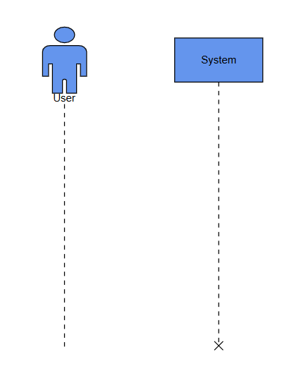
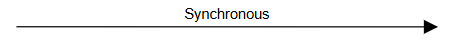
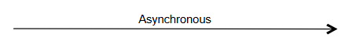
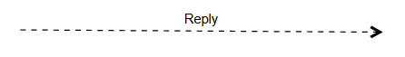
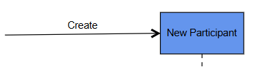
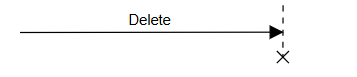
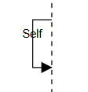
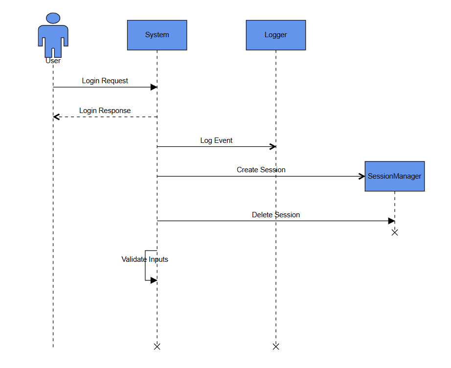
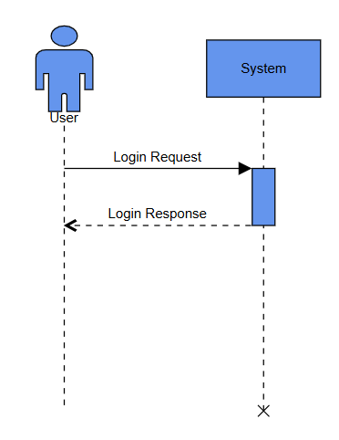
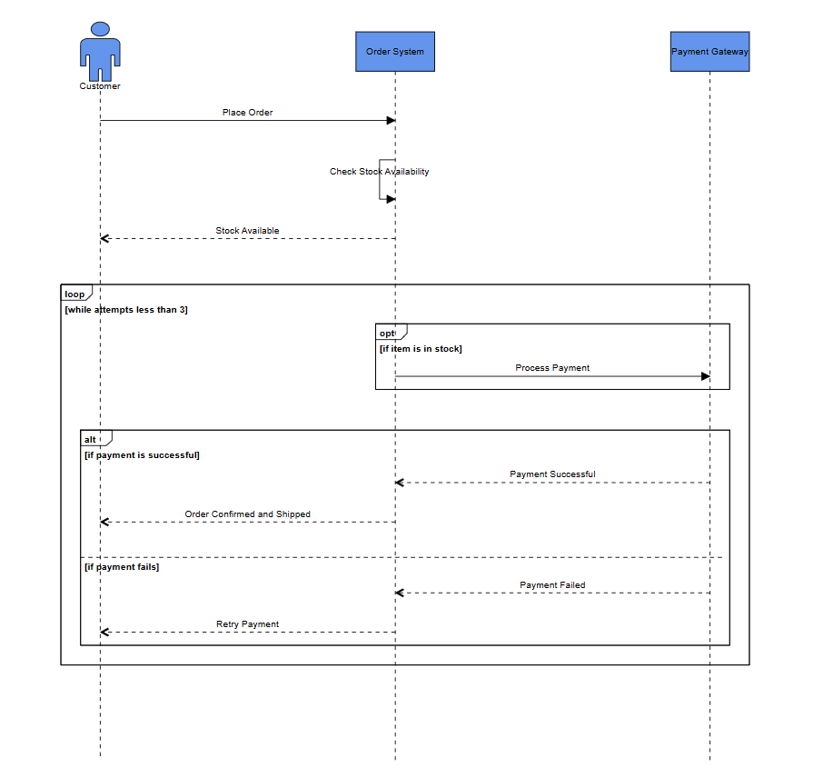

# Sequence Diagram Model in Blazor diagram component

A sequence diagram is a type of interaction diagram that visually represents how objects communicate with each other in a particular sequence over time. The [SfDiagramComponent](https://help.syncfusion.com/cr/blazor/Syncfusion.Blazor.Diagram.SfDiagramComponent.html)  in the Syncfusion<sup style="font-size:70%">&reg;</sup> Blazor suite supports the creation and visualization of UML sequence diagrams through the dedicated [UmlSequenceDiagramModel](https://help.syncfusion.com/cr/blazor/Syncfusion.Blazor.Diagram.UmlSequenceDiagramModel.html) class.

To enable this functionality, assign an instance of `UmlSequenceDiagramModel` to the `Model` property of the SfDiagramComponent. This model encapsulates all necessary elements—such as lifelines, messages, activation boxes, and fragments—required to render a complete sequence diagram.

## Sequence Diagram Elements

A sequence diagram consists of several key elements, including participants, messages, activation boxes, and fragments. Each of these components plays a crucial role in representing the flow of interaction between objects over time.

The diagram component allows to define and manage these elements through the `UmlSequenceDiagramModel`. Below is an overview of how each element can be implemented:

* [Participants](https://help.syncfusion.com/cr/blazor/Syncfusion.Blazor.Diagram.UmlSequenceDiagramModel.html#Syncfusion_Blazor_Diagram_UmlSequenceDiagramModel_Participants): Represent the lifelines (such as actors or systems) involved in the interaction.
* [Messages](https://help.syncfusion.com/cr/blazor/Syncfusion.Blazor.Diagram.UmlSequenceDiagramModel.html#Syncfusion_Blazor_Diagram_UmlSequenceDiagramModel_Messages): Indicate the communication between participants, including synchronous and asynchronous calls, returns, and self-messages.
* [Activation Boxes](https://help.syncfusion.com/cr/blazor/Syncfusion.Blazor.Diagram.UmlSequenceParticipant.html#Syncfusion_Blazor_Diagram_UmlSequenceParticipant_ActivationBoxes): Represent the time during which a participant is active or performing an operation.
* [Fragments](https://help.syncfusion.com/cr/blazor/Syncfusion.Blazor.Diagram.UmlSequenceDiagramModel.html#Syncfusion_Blazor_Diagram_UmlSequenceDiagramModel_Participants): Define conditional or parallel behavior using constructs like alt, opt, and loop.

Each of these elements can be programmatically configured and customized to suit the application's interaction flow.

### Participants

The [UmlSequenceParticipant](https://help.syncfusion.com/cr/blazor/Syncfusion.Blazor.Diagram.UmlSequenceParticipant.html) class represents the entities involved in the sequence of interactions—such as users, systems, or services. In a sequence diagram, participants are displayed at the top of the diagram, with vertical lifelines extending downward to indicate their presence throughout the interaction flow.

Each participant serves as the source or target of messages and is essential for illustrating the communication between different components in the system.

Define participants by adding instances of [UmlSequenceParticipant](https://help.syncfusion.com/cr/blazor/Syncfusion.Blazor.Diagram.UmlSequenceParticipant.html) to the [Participants](https://help.syncfusion.com/cr/blazor/Syncfusion.Blazor.Diagram.UmlSequenceDiagramModel.html#Syncfusion_Blazor_Diagram_UmlSequenceDiagramModel_Participants) collection in the [UmlSequenceDiagramModel](https://help.syncfusion.com/cr/blazor/Syncfusion.Blazor.Diagram.UmlSequenceDiagramModel.html).

The following code example explains how to create participants in sequence diagram.

```cshtml
@using Syncfusion.Blazor.Diagram

<SfDiagramComponent @ref="Diagram" Height="600px" Model="@DiagramModel">
</SfDiagramComponent>

@code {
    private SfDiagramComponent Diagram;
    private UmlSequenceDiagramModel DiagramModel;

    protected override void OnInitialized()
    {
        // Create participants
        List<UmlSequenceParticipant> participants = new List<UmlSequenceParticipant>()
        {
            new UmlSequenceParticipant()
            {
                ID = "User",
                Content = "User",
                IsActor = true
            },
            new UmlSequenceParticipant()
            {
                ID = "System",
                Content = "System",
                IsActor = false,
                ShowDestructionMarker = true
            }
        };

        // Initialize the Uml sequence diagram model
        DiagramModel = new UmlSequenceDiagramModel()
            {
                Participants = participants
            };
    }
}
```


A complete working sample can be downloaded from [GitHub](https://github.com/SyncfusionExamples/Blazor-Diagram-Examples/tree/master/UG-Samples/UMLSequenceDiagram/CreateParticipant).



#### UmlSequenceParticipant Properties

| Property | Type | Description |
|---|---|---|
| [ID](https://help.syncfusion.com/cr/blazor/Syncfusion.Blazor.Diagram.UmlSequenceParticipant.html#Syncfusion_Blazor_Diagram_UmlSequenceParticipant_ID) | string | A unique identifier for the participant |
| [Content](https://help.syncfusion.com/cr/blazor/Syncfusion.Blazor.Diagram.UmlSequenceParticipant.html#Syncfusion_Blazor_Diagram_UmlSequenceParticipant_Content]) | string | The display text for the participant |
| [IsActor](https://help.syncfusion.com/cr/blazor/Syncfusion.Blazor.Diagram.UmlSequenceParticipant.html#Syncfusion_Blazor_Diagram_UmlSequenceParticipant_IsActor) | bool | Determines if the participant is displayed as an actor (true) or object (false) |
| [ShowDestructionMarker](https://help.syncfusion.com/cr/blazor/Syncfusion.Blazor.Diagram.UmlSequenceParticipant.html#Syncfusion_Blazor_Diagram_UmlSequenceParticipant_ShowDestructionMarker) | bool | Determines if a destruction marker (X) is shown at the end of the lifeline |
| [ActivationBoxes](https://help.syncfusion.com/cr/blazor/Syncfusion.Blazor.Diagram.UmlSequenceParticipant.html#Syncfusion_Blazor_Diagram_UmlSequenceParticipant_ActivationBoxes) | IEnumerable\<UmlSequenceActivationBox\> | Collection of activation boxes for this participant |

### Messages

The [UmlSequenceMessage](https://help.syncfusion.com/cr/blazor/Syncfusion.Blazor.Diagram.UmlSequenceMessage.html) class represents communications or interactions between participants in a sequence diagram. Messages are visually displayed as arrows connecting the lifelines of two participants, indicating the direction and type of interaction.

These messages can represent various types of communication, such as:

* Synchronous messages (e.g., method calls)
* Asynchronous messages (e.g., signals or events)
* Return messages (e.g., responses or results)
* Self-messages (where a participant calls itself)

Messages are added to the [Messages](https://help.syncfusion.com/cr/blazor/Syncfusion.Blazor.Diagram.UmlSequenceDiagramModel.html#Syncfusion_Blazor_Diagram_UmlSequenceDiagramModel_Messages) collection in the [UmlSequenceDiagramModel](https://help.syncfusion.com/cr/blazor/Syncfusion.Blazor.Diagram.UmlSequenceDiagramModel.html), and can be customized to define their source, target, message type, and label.

#### Types of Messages

The [UmlSequenceMessageType](https://help.syncfusion.com/cr/blazor/Syncfusion.Blazor.Diagram.UmlSequenceMessageType.html) enum defines the following message types:

| Message Type | Description | Example |
|---|---|---|
| [Synchronous](https://help.syncfusion.com/cr/blazor/Syncfusion.Blazor.Diagram.UmlSequenceMessageType.html#Syncfusion_Blazor_Diagram_UmlSequenceMessageType_Synchronous) | The sender waits for a response |  |
| [Asynchronous](https://help.syncfusion.com/cr/blazor/Syncfusion.Blazor.Diagram.UmlSequenceMessageType.html#Syncfusion_Blazor_Diagram_UmlSequenceMessageType_Asynchronous) | The sender continues without waiting |  |
| [Reply](https://help.syncfusion.com/cr/blazor/Syncfusion.Blazor.Diagram.UmlSequenceMessageType.html#Syncfusion_Blazor_Diagram_UmlSequenceMessageType_Reply) | A response to a previous message |  |
| [Create](https://help.syncfusion.com/cr/blazor/Syncfusion.Blazor.Diagram.UmlSequenceMessageType.html#Syncfusion_Blazor_Diagram_UmlSequenceMessageType_Create) | Creates a new participant |  |
| [Delete](https://help.syncfusion.com/cr/blazor/Syncfusion.Blazor.Diagram.UmlSequenceMessageType.html#Syncfusion_Blazor_Diagram_UmlSequenceMessageType_Delete) | Terminates a participant |  |
| [Self](https://help.syncfusion.com/cr/blazor/Syncfusion.Blazor.Diagram.UmlSequenceMessageType.html#Syncfusion_Blazor_Diagram_UmlSequenceMessageType_Self) | A message from a participant to itself |  |


The following code example explains how to create messages in sequence diagram.

```cshtml
@using Syncfusion.Blazor.Diagram

<SfDiagramComponent @ref="Diagram" Height="600px" Model="@DiagramModel">
</SfDiagramComponent>

@code {
    private SfDiagramComponent Diagram;
    private UmlSequenceDiagramModel DiagramModel;

    protected override void OnInitialized()
    {
        // Create participants
        List<UmlSequenceParticipant> participants = new List<UmlSequenceParticipant>()
        {
            new UmlSequenceParticipant()
            {
                ID = "User",
                Content = "User",
                IsActor = true
            },
            new UmlSequenceParticipant()
            {
                ID = "System",
                Content = "System",
                IsActor = false,
                ShowDestructionMarker = true
            },
            new UmlSequenceParticipant()
            {
                ID = "Logger",
                Content = "Logger",
                IsActor = false,
                ShowDestructionMarker = true
            },
            new UmlSequenceParticipant()
            {
                ID = "SessionManager",
                Content = "SessionManager",
                IsActor = false
            }
        };

        // Create messages
        List<UmlSequenceMessage> messages = new List<UmlSequenceMessage>()
        {
            new UmlSequenceMessage()
            {
                ID = "MSG1",
                Content = "Login Request",
                FromParticipantID = "User",
                ToParticipantID = "System",
                MessageType = UmlSequenceMessageType.Synchronous
            },
            new UmlSequenceMessage()
            {
                ID = "MSG2",
                Content = "Login Response",
                FromParticipantID = "System",
                ToParticipantID = "User",
                MessageType = UmlSequenceMessageType.Reply
            },
            new UmlSequenceMessage()
            {
                ID = "MSG3",
                Content = "Log Event",
                FromParticipantID = "System",
                ToParticipantID = "Logger",
                MessageType = UmlSequenceMessageType.Asynchronous
            },
            new UmlSequenceMessage()
            {
                ID = "MSG4",
                Content = "Create Session",
                FromParticipantID = "System",
                ToParticipantID = "SessionManager",
                MessageType = UmlSequenceMessageType.Create
            },
            new UmlSequenceMessage()
            {
                ID = "MSG5",
                Content = "Delete Session",
                FromParticipantID = "System",
                ToParticipantID = "SessionManager",
                MessageType = UmlSequenceMessageType.Delete
            },
            new UmlSequenceMessage()
            {
                ID = "MSG6",
                Content = "Validate Inputs",
                FromParticipantID = "System",
                ToParticipantID = "System",
                MessageType = UmlSequenceMessageType.Self
            }
        };

        // Initialize Uml Sequence Diagram model
        DiagramModel = new UmlSequenceDiagramModel()
            {
                Participants = participants,
                Messages = messages
            };
    }
}

```


A complete working sample can be downloaded from [GitHub]().



#### UmlSequenceMessage Properties

| Property | Type | Description |
|---|---|---|
| [ID](https://help.syncfusion.com/cr/blazor/Syncfusion.Blazor.Diagram.UmlSequenceMessage.html#Syncfusion_Blazor_Diagram_UmlSequenceMessage_ID) | string | A unique identifier for the message |
| [Content](https://help.syncfusion.com/cr/blazor/Syncfusion.Blazor.Diagram.UmlSequenceMessage.html#Syncfusion_Blazor_Diagram_UmlSequenceMessage_Content) | string | The display text for the message |
| [FromParticipantID](https://help.syncfusion.com/cr/blazor/Syncfusion.Blazor.Diagram.UmlSequenceMessage.html#Syncfusion_Blazor_Diagram_UmlSequenceMessage_FromParticipantID) | string | ID of the participant sending the message |
| [ToParticipantID](https://help.syncfusion.com/cr/blazor/Syncfusion.Blazor.Diagram.UmlSequenceMessage.html#Syncfusion_Blazor_Diagram_UmlSequenceMessage_ToParticipantID) | string | ID of the participant receiving the message |
| [MessageType](https://help.syncfusion.com/cr/blazor/Syncfusion.Blazor.Diagram.UmlSequenceMessage.html#Syncfusion_Blazor_Diagram_UmlSequenceMessage_MessageType) | UmlSequenceMessageType | Type of the message (Synchronous, Asynchronous, Reply, Create, Delete, Self) |

### Activation Boxes

The [UmlSequenceActivationBox](https://help.syncfusion.com/cr/blazor/Syncfusion.Blazor.Diagram.UmlSequenceMessage.html#Syncfusion_Blazor_Diagram_UmlSequenceMessage_ID) class represents periods during which a participant is active—that is, when it is executing a process or handling a message. These are visually rendered as thin vertical rectangles placed on top of a participant's lifeline.

Activation boxes typically begin when a message is received and end when the processing is complete. They help illustrate the execution flow and the duration of operations within the sequence diagram.

Activation boxes can be explicitly configured by adding them to the [ActivationBoxes](https://help.syncfusion.com/cr/blazor/Syncfusion.Blazor.Diagram.UmlSequenceParticipant.html#Syncfusion_Blazor_Diagram_UmlSequenceParticipant_ActivationBoxes) collection of the [UmlSequenceParticipant](https://help.syncfusion.com/cr/blazor/Syncfusion.Blazor.Diagram.UmlSequenceParticipant.html), allowing precise control over their placement and duration.

The following code example explains how to create activation boxes in sequence diagram.

```cshtml
@using Syncfusion.Blazor.Diagram

<SfDiagramComponent @ref="Diagram" Height="600px" Model="@DiagramModel">
</SfDiagramComponent>

@code {
    private SfDiagramComponent Diagram;
    private UmlSequenceDiagramModel DiagramModel;

    protected override void OnInitialized()
    {
        // Create participants with an activation box
        List<UmlSequenceParticipant> participants = new List<UmlSequenceParticipant>()
        {
            new UmlSequenceParticipant()
            {
                ID = "User",
                Content = "User",
                IsActor = true
            },
            new UmlSequenceParticipant()
            {
                ID = "System",
                Content = "System",
                IsActor = false,
                ShowDestructionMarker = true,
                ActivationBoxes = new List<UmlSequenceActivationBox>()
                {
                    new UmlSequenceActivationBox()
                    {
                        ID = "ActivateSystem",
                        StartMessageID = "MSG1",
                        EndMessageID = "MSG2"
                    }
                }
            }
        };

        // Create messages
        List<UmlSequenceMessage> messages = new List<UmlSequenceMessage>()
        {
            new UmlSequenceMessage()
            {
                ID = "MSG1",
                Content = "Login Request",
                FromParticipantID = "User",
                ToParticipantID = "System",
                MessageType = UmlSequenceMessageType.Synchronous
            },
            new UmlSequenceMessage()
            {
                ID = "MSG2",
                Content = "Login Response",
                FromParticipantID = "System",
                ToParticipantID = "User",
                MessageType = UmlSequenceMessageType.Reply
            }
        };

        // Initialize the model
        DiagramModel = new UmlSequenceDiagramModel()
            {
                Participants = participants,
                Messages = messages
            };
    }
}
```


A complete working sample can be downloaded from [GitHub]().



#### UmlSequenceActivationBox Properties

| Property | Type | Description |
|---|---|---|
| [ID](https://help.syncfusion.com/cr/blazor/Syncfusion.Blazor.Diagram.UmlSequenceActivationBox.html#Syncfusion_Blazor_Diagram_UmlSequenceActivationBox_ID) | string | A unique identifier for the activation box |
| [StartMessageID](https://help.syncfusion.com/cr/blazor/Syncfusion.Blazor.Diagram.UmlSequenceActivationBox.html#Syncfusion_Blazor_Diagram_UmlSequenceActivationBox_StartMessageID) | string | ID of the message that initiates the activation |
| [EndMessageID](https://help.syncfusion.com/cr/blazor/Syncfusion.Blazor.Diagram.UmlSequenceActivationBox.html#Syncfusion_Blazor_Diagram_UmlSequenceActivationBox_EndMessageID) | string | ID of the message that terminates the activation |

### Fragments

The [UmlSequenceFragment](https://help.syncfusion.com/cr/blazor/Syncfusion.Blazor.Diagram.UmlSequenceFragment.html) class is used to group a set of messages based on specific conditions or interaction control structures within a sequence diagram. Fragments are displayed as rectangular enclosures that visually separate sections of the diagram, typically used to represent:

* Alternative flows (alt)
* Optional interactions (opt)
* Loops (loop)

Configure fragments by adding them to the [Fragments](https://help.syncfusion.com/cr/blazor/Syncfusion.Blazor.Diagram.UmlSequenceDiagramModel.html#Syncfusion_Blazor_Diagram_UmlSequenceDiagramModel_Fragments) collection of the [UmlSequenceDiagramModel](https://help.syncfusion.com/cr/blazor/Syncfusion.Blazor.Diagram.UmlSequenceDiagramModel.html), specifying the type of fragment, condition labels, and the associated messages or nested fragments it encompasses.

#### Types of Fragments

The [UmlSequenceFragmentType](https://help.syncfusion.com/cr/blazor/Syncfusion.Blazor.Diagram.UmlSequenceFragmentType.html) enum defines the following fragment types:

| Fragment Type  | Description  | Example  |  
|---------------|-------------|--------|  
| [Optional](https://help.syncfusion.com/cr/blazor/Syncfusion.Blazor.Diagram.UmlSequenceFragmentType.html#Syncfusion_Blazor_Diagram_UmlSequenceFragmentType_Optional)  | Represents a sequence that is executed only if a specified condition is met; otherwise, it is skipped. |  |  
| [Alternative](https://help.syncfusion.com/cr/blazor/Syncfusion.Blazor.Diagram.UmlSequenceFragmentType.html#Syncfusion_Blazor_Diagram_UmlSequenceFragmentType_Alternative) | Represents multiple conditional paths (if-else structure), where only one path executes based on the condition. |  |  
| [Loop](https://help.syncfusion.com/cr/blazor/Syncfusion.Blazor.Diagram.UmlSequenceFragmentType.html#Syncfusion_Blazor_Diagram_UmlSequenceFragmentType_Loop) | Represents a repeating sequence of interactions that continues based on a loop condition. |  |  

#### Creating Fragments

Create fragments in the sequence diagram, need to use the [UmlSequenceFragment](https://help.syncfusion.com/cr/blazor/Syncfusion.Blazor.Diagram.UmlSequenceFragment.html) to define fragments and the [UmlSequenceFragmentCondition](https://help.syncfusion.com/cr/blazor/Syncfusion.Blazor.Diagram.UmlSequenceFragmentCondition.html) to specify each condition block within those fragments.

```cshtml
@using Syncfusion.Blazor.Diagram

<SfDiagramComponent @ref="Diagram" Height="700px" Model="@DiagramModel">
</SfDiagramComponent>

@code {
    private SfDiagramComponent Diagram;
    private UmlSequenceDiagramModel DiagramModel;

    protected override void OnInitialized()
    {
        // Participants
        List<UmlSequenceParticipant> participants = new List<UmlSequenceParticipant>()
        {
            new UmlSequenceParticipant() { ID = "Customer", Content = "Customer", IsActor = true },
            new UmlSequenceParticipant() { ID = "OrderSystem", Content = "Order System", IsActor = false },
            new UmlSequenceParticipant() { ID = "PaymentGateway", Content = "Payment Gateway", IsActor = false }
        };

        // Messages
        List<UmlSequenceMessage> messages = new List<UmlSequenceMessage>()
        {
            new UmlSequenceMessage() { ID = "MSG1", Content = "Place Order", FromParticipantID = "Customer", ToParticipantID = "OrderSystem", MessageType = UmlSequenceMessageType.Synchronous },
            new UmlSequenceMessage() { ID = "MSG2", Content = "Check Stock Availability", FromParticipantID = "OrderSystem", ToParticipantID = "OrderSystem", MessageType = UmlSequenceMessageType.Synchronous },
            new UmlSequenceMessage() { ID = "MSG3", Content = "Stock Available", FromParticipantID = "OrderSystem", ToParticipantID = "Customer", MessageType = UmlSequenceMessageType.Reply },
            new UmlSequenceMessage() { ID = "MSG4", Content = "Process Payment", FromParticipantID = "OrderSystem", ToParticipantID = "PaymentGateway", MessageType = UmlSequenceMessageType.Synchronous },
            new UmlSequenceMessage() { ID = "MSG5", Content = "Payment Successful", FromParticipantID = "PaymentGateway", ToParticipantID = "OrderSystem", MessageType = UmlSequenceMessageType.Reply },
            new UmlSequenceMessage() { ID = "MSG6", Content = "Order Confirmed and Shipped", FromParticipantID = "OrderSystem", ToParticipantID = "Customer", MessageType = UmlSequenceMessageType.Reply },
            new UmlSequenceMessage() { ID = "MSG7", Content = "Payment Failed", FromParticipantID = "PaymentGateway", ToParticipantID = "OrderSystem", MessageType = UmlSequenceMessageType.Reply },
            new UmlSequenceMessage() { ID = "MSG8", Content = "Retry Payment", FromParticipantID = "OrderSystem", ToParticipantID = "Customer", MessageType = UmlSequenceMessageType.Reply }
        };

        // Fragments
        List<UmlSequenceFragment> fragments = new List<UmlSequenceFragment>()
        {
            new UmlSequenceFragment()
            {
                ID = "Frag3",
                FragmentType = UmlSequenceFragmentType.Loop,
                Conditions = new List<UmlSequenceFragmentCondition>
                {
                    new UmlSequenceFragmentCondition()
                    {
                        Content = "while attempts less than 3",
                        Fragments = new List<UmlSequenceFragment>()
                        {
                            new UmlSequenceFragment()
                            {
                                ID = "Frag1",
                                FragmentType = UmlSequenceFragmentType.Optional,
                                Conditions = new List<UmlSequenceFragmentCondition>()
                                {
                                    new UmlSequenceFragmentCondition()
                                    {
                                        Content = "if item is in stock",
                                        MessageIds = new List<string> { "MSG4" }
                                    }
                                }
                            },
                            new UmlSequenceFragment()
                            {
                                ID = "Frag2",
                                FragmentType = UmlSequenceFragmentType.Alternative,
                                Conditions = new List<UmlSequenceFragmentCondition>()
                                {
                                    new UmlSequenceFragmentCondition()
                                    {
                                        Content = "if payment is successful",
                                        MessageIds = new List<string>() { "MSG5", "MSG6" }
                                    },
                                    new UmlSequenceFragmentCondition()
                                    {
                                        Content = "if payment fails",
                                        MessageIds = new List<string>() { "MSG7", "MSG8" }
                                    }
                                }
                            }
                        }
                    }
                }
            }
        };

        // Assign model
        DiagramModel = new UmlSequenceDiagramModel()
            {
                SpaceBetweenParticipants = 300,
                Participants = participants,
                Messages = messages,
                Fragments = fragments
            };
    }
}
```


A complete working sample can be downloaded from [GitHub](https://github.com/SyncfusionExamples/Blazor-Diagram-Examples/tree/master/UG-Samples/UMLSequenceDiagram/CreateFragments).



#### UmlSequenceFragment Properties

| Property | Type | Description |
|---|---|---|
| [ID](https://help.syncfusion.com/cr/blazor/Syncfusion.Blazor.Diagram.UmlSequenceFragment.html#Syncfusion_Blazor_Diagram_UmlSequenceFragment_ID) | string | A unique identifier for the fragment |
| [FragmentType](https://help.syncfusion.com/cr/blazor/Syncfusion.Blazor.Diagram.UmlSequenceFragment.html#Syncfusion_Blazor_Diagram_UmlSequenceFragment_FragmentType) | UmlSequenceFragmentType | Type of the fragment (Optional, Loop, Alternative) |
| [Conditions](https://help.syncfusion.com/cr/blazor/Syncfusion.Blazor.Diagram.UmlSequenceFragment.html#Syncfusion_Blazor_Diagram_UmlSequenceFragment_Conditions) | List\<UmlSequenceFragmentCondition\> | Collection of conditions for the fragment |

#### UmlSequenceFragmentCondition Properties

| Property | Type | Description |
|---|---|---|
| [Content](https://help.syncfusion.com/cr/blazor/Syncfusion.Blazor.Diagram.UmlSequenceFragmentCondition.html#Syncfusion_Blazor_Diagram_UmlSequenceFragmentCondition_Content) | string | Text describing the condition or parameter |
| [MessageIds](https://help.syncfusion.com/cr/blazor/Syncfusion.Blazor.Diagram.UmlSequenceFragmentCondition.html#Syncfusion_Blazor_Diagram_UmlSequenceFragmentCondition_MessageIds) | List\<string\> | Collection of message IDs included in this condition section |
| [Fragments](https://help.syncfusion.com/cr/blazor/Syncfusion.Blazor.Diagram.UmlSequenceFragmentCondition.html#Syncfusion_Blazor_Diagram_UmlSequenceFragmentCondition_Fragments) | List\<UmlSequenceFragment\> | Collection of nested fragments (for complex structures) |

### Customizing Participant Spacing in Sequence Diagram 

The [SpaceBetweenParticipants](https://help.syncfusion.com/cr/blazor/Syncfusion.Blazor.Diagram.UmlSequenceDiagramModel.html#Syncfusion_Blazor_Diagram_UmlSequenceDiagramModel_SpaceBetweenParticipants) property of the [UmlSequenceDiagramModel](https://help.syncfusion.com/cr/blazor/Syncfusion.Blazor.Diagram.UmlSequenceDiagramModel.html) controls the horizontal spacing between participants in the sequence diagram. By default, this value is set to 100, ensuring a uniform gap between lifelines.

Customize this value to increase or decrease the spacing based on the diagram’s layout requirements or to accommodate longer participant names and message labels.

```cshtml
@using Syncfusion.Blazor.Diagram

<SfDiagramComponent @ref="Diagram" Height="600px" Model="@DiagramModel">
</SfDiagramComponent>

@code {
    private SfDiagramComponent Diagram;
    private UmlSequenceDiagramModel DiagramModel;

    protected override void OnInitialized()
    {
        // Create participants
        List<UmlSequenceParticipant> participants = new List<UmlSequenceParticipant>()
        {
            new UmlSequenceParticipant()
            {
                ID = "User",
                Content = "User",
                IsActor = true
            },
            new UmlSequenceParticipant()
            {
                ID = "System",
                Content = "System",
                IsActor = false,
                ShowDestructionMarker = true
            },
            new UmlSequenceParticipant()
            {
                ID = "Logger",
                Content = "Logger",
                IsActor = false,
                ShowDestructionMarker = true
            },
            new UmlSequenceParticipant()
            {
                ID = "SessionManager",
                Content = "SessionManager",
                IsActor = false
            }
        };

        // Create messages
        List<UmlSequenceMessage> messages = new List<UmlSequenceMessage>()
        {
            new UmlSequenceMessage()
            {
                ID = "MSG1",
                Content = "Login Request",
                FromParticipantID = "User",
                ToParticipantID = "System",
                MessageType = UmlSequenceMessageType.Synchronous
            },
            new UmlSequenceMessage()
            {
                ID = "MSG2",
                Content = "Login Response",
                FromParticipantID = "System",
                ToParticipantID = "User",
                MessageType = UmlSequenceMessageType.Reply
            },
            new UmlSequenceMessage()
            {
                ID = "MSG3",
                Content = "Log Event",
                FromParticipantID = "System",
                ToParticipantID = "Logger",
                MessageType = UmlSequenceMessageType.Asynchronous
            },
            new UmlSequenceMessage()
            {
                ID = "MSG4",
                Content = "Create Session",
                FromParticipantID = "System",
                ToParticipantID = "SessionManager",
                MessageType = UmlSequenceMessageType.Create
            },
            new UmlSequenceMessage()
            {
                ID = "MSG5",
                Content = "Delete Session",
                FromParticipantID = "System",
                ToParticipantID = "SessionManager",
                MessageType = UmlSequenceMessageType.Delete
            },
            new UmlSequenceMessage()
            {
                ID = "MSG6",
                Content = "Validate Inputs",
                FromParticipantID = "System",
                ToParticipantID = "System",
                MessageType = UmlSequenceMessageType.Self
            }
        };

        // Initialize Uml Sequence Diagram model
        DiagramModel = new UmlSequenceDiagramModel()
            {
                SpaceBetweenParticipants = 200,
                Participants = participants,
                Messages = messages
            };
    }
}

```


A complete working sample can be downloaded from [GitHub](https://github.com/SyncfusionExamples/Blazor-Diagram-Examples/tree/master/UG-Samples/UMLSequenceDiagram/SpaceBetweenParticipants).