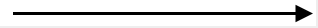
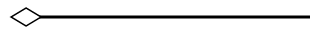
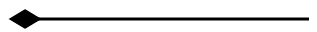
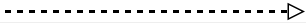
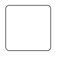
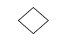
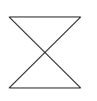
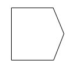

# UML Diagram Shapes

## Uml Class Diagram Shapes

Class diagram is used to represent the static view of an application. The class diagrams are widely used in the modelling of object-oriented systems because they are the only UML diagrams which can be mapped directly with object-oriented languages.
Diagram supports to generate the class diagram shapes from business logic.

The UML class diagram shapes are explained as follows.

## Class

* A class describes a set of objects that shares the same specifications of features, constraints, and semantics. To define a class object, you should define the classifier as [`Class`](https://help.syncfusion.com/cr/blazor/Syncfusion.Blazor.Diagrams.DiagramUmlClass.html).

* Also, define the [`Name`](https://help.syncfusion.com/cr/blazor/Syncfusion.Blazor.Diagrams.DiagramUmlClass.html#Syncfusion_Blazor_Diagrams_DiagramUmlClass_Name), [`Attributes`](https://help.syncfusion.com/cr/blazor/Syncfusion.Blazor.Diagrams.DiagramUmlClass.html#Syncfusion_Blazor_Diagrams_DiagramUmlClass_Attributes), and [`Methods`](https://help.syncfusion.com/cr/blazor/Syncfusion.Blazor.Diagrams.DiagramUmlClass.html#Syncfusion_Blazor_Diagrams_DiagramUmlClass_Methods) of the class using the class property of node.

* The attribute’s [`Name`](https://help.syncfusion.com/cr/blazor/Syncfusion.Blazor.Diagrams.DiagramUmlClassAttribute.html#Syncfusion_Blazor_Diagrams_DiagramUmlClassAttribute_Name), [`Type`](https://help.syncfusion.com/cr/blazor/Syncfusion.Blazor.Diagrams.DiagramUmlClassAttribute.html#Syncfusion_Blazor_Diagrams_DiagramUmlClassAttribute_Type), and [`Scope`](https://help.syncfusion.com/cr/blazor/Syncfusion.Blazor.Diagrams.DiagramUmlClassAttribute.html#Syncfusion_Blazor_Diagrams_DiagramUmlClassAttribute_Scope) properties allow you to define the name, data type, and visibility of the attribute.

* The method’s [`Name`](https://help.syncfusion.com/cr/blazor/Syncfusion.Blazor.Diagrams.DiagramUmlClassMethod.html#Syncfusion_Blazor_Diagrams_DiagramUmlClassMethod_Name), [`Parameters`](https://help.syncfusion.com/cr/blazor/Syncfusion.Blazor.Diagrams.DiagramUmlClassMethod.html#Syncfusion_Blazor_Diagrams_DiagramUmlClassMethod_Parameters), [`Type`](https://help.syncfusion.com/cr/blazor/Syncfusion.Blazor.Diagrams.DiagramUmlClassMethod.html#Syncfusion_Blazor_Diagrams_DiagramUmlClassMethod_Type), and [`Scope`](https://help.syncfusion.com/cr/blazor/Syncfusion.Blazor.Diagrams.DiagramUmlClassMethod.html#Syncfusion_Blazor_Diagrams_DiagramUmlClassMethod_Scope) properties allow you to define the name, parameter, return type, and visibility of the methods.

* The method parameters object properties allow you to define the name and type of the parameter.

* The following code example illustrates how to create a class.

```csharp
@using Syncfusion.Blazor.Diagrams
@using System.Collections.ObjectModel

@* Initializes diagram control *@
<SfDiagram Height="600px" Nodes="@NodeCollection">
</SfDiagram>

@code{
    //Defines diagram's Node collection
    public ObservableCollection<DiagramNode> NodeCollection { get; set; }

    protected override void OnInitialized()
    {
        NodeCollection = new ObservableCollection<DiagramNode>();
        DiagramNode node = new DiagramNode()
        {
            Id = "Patient",
            OffsetX = 200, OffsetY = 200,
            Shape = new DiagramShape()
            {
                Type = Syncfusion.Blazor.Diagrams.Shapes.UmlClassifier,
                Classifier = ClassifierShape.Class,
                //Define class object
                ClassShape = new DiagramUmlClass()
                {
                    Name = "Patient",
                    //Define class attributes
                    Attributes = new ObservableCollection<DiagramUmlClassAttribute>()
                    {
                        new DiagramUmlClassAttribute() { Name = "accepted", Type = "Date" }
                    },
                    //Define class methods
                    Methods = new ObservableCollection<DiagramUmlClassMethod>()
                    {
                        new DiagramUmlClassMethod()
                        {
                            Name = "getHistory", Type = "getHistory"
                        }
                    }
                }
            }
        };
        //Add node
        NodeCollection.Add(node);
    }
}
```

## Interface

* An Interface is a kind of classifier that represents a declaration of a set of coherent public features and obligations. To create an interface, define the classifier property as [`Interface`](https://help.syncfusion.com/cr/blazor/Syncfusion.Blazor.Diagrams.DiagramUmlInterface.html).

* Also, define the [`Name`](https://help.syncfusion.com/cr/blazor/Syncfusion.Blazor.Diagrams.DiagramUmlInterface.html#Syncfusion_Blazor_Diagrams_DiagramUmlInterface_Name), [`Attributes`](https://help.syncfusion.com/cr/blazor/Syncfusion.Blazor.Diagrams.DiagramUmlInterface.html#Syncfusion_Blazor_Diagrams_DiagramUmlInterface_Attributes), and [`Methods`](https://help.syncfusion.com/cr/blazor/Syncfusion.Blazor.Diagrams.DiagramUmlInterface.html#Syncfusion_Blazor_Diagrams_DiagramUmlInterface_Methods) of the interface using the interface property of the node.

* The attribute’s name, type, and scope properties allow you to define the name, data type, and visibility of the attribute.

* The method’s name, parameter, type, and scope properties allow you to define the name, parameter, return type, and visibility of the methods.

* The method parameter object properties of name and type allows you to define the name and type of the parameter.

* The following code example illustrates how to create an interface.

```csharp
@* Initializes diagram control *@
@using Syncfusion.Blazor.Diagrams
@using System.Collections.ObjectModel

<SfDiagram Height="600px" Nodes="@NodeCollection">
</SfDiagram>

@code{
    //Defines diagram's Node collection
    public ObservableCollection<DiagramNode> NodeCollection { get; set; }

    protected override void OnInitialized()
    {
        NodeCollection = new ObservableCollection<DiagramNode>();
        DiagramNode node = new DiagramNode()
        {
            Id = "Patient",
            OffsetX = 200, OffsetY = 200,
            Shape = new DiagramShape()
            {
                Type = Syncfusion.Blazor.Diagrams.Shapes.UmlClassifier,
                Classifier = ClassifierShape.Interface,
                //Define interface object
                InterfaceShape = new DiagramUmlInterface()
                {
                    Name = "Patient",
                    //Define interface attributes
                    Attributes = new ObservableCollection<DiagramUmlClassAttribute>()
                    {
                        new DiagramUmlClassAttribute() { Name = "owner", Type = "String[*]" }
                    },
                    //Define interface methods
                    Methods = new ObservableCollection<DiagramUmlClassMethod>()
                    {
                        new DiagramUmlClassMethod()
                        {
                            Name = "deposit",
                            Parameters = new ObservableCollection<DiagramMethodArguments>()
                            {
                                new DiagramMethodArguments(){Name = "amount", Type = "Dollars" }
                            }
                        }
                    }
                }
            }
        };
        //Add node
        NodeCollection.Add(node);
    }
}
```

## Enumeration

* To define an enumeration, define the classifier property of node as [`Enumeration`](https://help.syncfusion.com/cr/blazor/Syncfusion.Blazor.Diagrams.DiagramUmlEnumeration.html). Also, define the name and members of the enumeration using the enumeration property of the node.

* You can set a name for the enumeration members collection using the name property of members collection.

* The following code example illustrates how to create an enumeration.

```csharp
@using Syncfusion.Blazor.Diagrams
@using System.Collections.ObjectModel

@* Initializes diagram control *@
<SfDiagram Height="600px" Nodes="@NodeCollection">
</SfDiagram>

@code{
    //Defines diagram's Node collection
    public ObservableCollection<DiagramNode> NodeCollection { get; set; }

    protected override void OnInitialized()
    {
        NodeCollection = new ObservableCollection<DiagramNode>();
        DiagramNode node = new DiagramNode()
        {
            Id = "Patient",
            OffsetX = 200,
            OffsetY = 200,
            Shape = new DiagramShape()
            {
                Type = Syncfusion.Blazor.Diagrams.Shapes.UmlClassifier,
                Classifier = ClassifierShape.Enumeration,
                //Define enumeration object
                EnumerationShape = new DiagramUmlEnumeration()
                {
                    Name = "AccountType",
                    //set the members of enumeration
                    Members = new ObservableCollection<DiagramUmlEnumerationMember>()
                    {
                        new DiagramUmlEnumerationMember()
                        {
                            Name = "Checking Account"
                        },
                        new DiagramUmlEnumerationMember()
                        {
                             Name = "Savings Account"
                        },
                        new DiagramUmlEnumerationMember()
                        {
                             Name = "Credit Account"
                        }
                    }
                }
            }
        };
        NodeCollection.Add(node);
    }
}
```

## Connector shapes

* The connector shape property defines the role or meaning of the connector.

* The different types of connector shapes are `BPMN`, [`UmlClassifier`](https://help.syncfusion.com/cr/blazor) and [`UmlActivity`](https://help.syncfusion.com/cr/blazor) and can render these shapes by setting the connector shape type property.

* The type of flow shapes in a BPMN process are sequence, association, and message.

## Relationships

* A relationship is a general term covering the specific types of logical connections found on class diagrams.

* The list of Relationships is demonstrated as follows.

| Shape       | Image                                |
| ----------- | ------------------------------------ |
| Association |  |
| Aggregation |   |
| Composition |  |
| Inheritance |    |
| Dependency  |  |

## Association

Association is basically a set of links that connects elements of an UML model. The type of association are as follows.

    1. Directional
    2. BiDirectional

The association property allows you to define the type of association. The default value of association is [`Directional`](https://help.syncfusion.com/cr/blazor/Syncfusion.Blazor.Diagrams.BpmnAssociationFlows.html). The following code example illustrates how to create an association.

```csharp
@using Syncfusion.Blazor.Diagrams
@using System.Collections.ObjectModel

@* Initializes diagram control *@
<SfDiagram Height="600px" Connectors="@ConnectorCollection">
</SfDiagram>

@code{
    //Defines diagram's connector collection
    public ObservableCollection<DiagramConnector> ConnectorCollection { get; set; }

    protected override void OnInitialized()
    {
        ConnectorCollection = new ObservableCollection<DiagramConnector>();

        DiagramConnector connector = new DiagramConnector()
        {
            Id = "Connector1",
            Type = Segments.Straight,
            //Define connector start and end points
            SourcePoint = new ConnectorSourcePoint() { X = 100, Y= 100},
            TargetPoint = new ConnectorTargetPoint() { X   = 300, Y= 300},
            Shape = new DiagramConnectorShape()
            {
                Type = ConnectionShapes.UmlClassifier,
                Relationship = ClassifierShape.Association,
                //Define type of association
                Association = BpmnAssociationFlows.BiDirectional
            }
        };
        //Add connector
        ConnectorCollection.Add(connector);
    }
}
```

## Aggregation

Aggregation is a binary association between a property and one or more composite objects which group together a set of instances.
Aggregation is decorated with a hollow diamond. To create an aggregation shape, define the relationship as “aggregation”.

The following code example illustrates how to create an aggregation.

```csharp
@using Syncfusion.Blazor.Diagrams
@using System.Collections.ObjectModel

@* Initializes diagram control *@
<SfDiagram Height="600px" Connectors="@ConnectorCollection">
</SfDiagram>

@code{
    //Defines diagram's connector collection
    public ObservableCollection<DiagramConnector> ConnectorCollection { get; set; }

    protected override void OnInitialized()
    {
        ConnectorCollection = new ObservableCollection<DiagramConnector>();

        DiagramConnector connector = new DiagramConnector()
        {
            Id = "Connector1",
            Type = Segments.Straight,
            Shape = new DiagramConnectorShape()
            {
                Type = ConnectionShapes.UmlClassifier,
                //Set an relationship for connector
                Relationship = ClassifierShape.Aggregation
            },
            //Define connector start and end points
            SourcePoint = new ConnectorSourcePoint() { X = 100, Y = 100},
            TargetPoint = new ConnectorTargetPoint() { X = 300, Y = 300}
        };

        ConnectorCollection.Add(connector);
    }
}
```

## Composition

Composition is a “strong” form of “aggregation”. Composition is decorated with a black diamond. To create a composition shape, define the relationship property of connector as “composition”.

The following code example illustrates how to create a composition.

```csharp
@using Syncfusion.Blazor.Diagrams
@using System.Collections.ObjectModel

@* Initializes diagram control *@
<SfDiagram Height="600px" Connectors="@ConnectorCollection">
</SfDiagram>

@code{
    //Defines diagram's connector collection
    public ObservableCollection<DiagramConnector> ConnectorCollection { get; set; }

    protected override void OnInitialized()
    {
        ConnectorCollection = new ObservableCollection<DiagramConnector>();

        DiagramConnector connector = new DiagramConnector()
        {
            Id = "Connector1",
            Type = Segments.Straight,
            Shape = new DiagramConnectorShape()
            {
                Type = ConnectionShapes.UmlClassifier,
                //Set an relationship for connector
                Relationship = ClassifierShape.Composition
            },
            //Define connector start and end points
            SourcePoint = new ConnectorSourcePoint() { X = 100, Y = 100},
            TargetPoint = new ConnectorTargetPoint() { X = 300, Y = 300}
        };
        //Add connector
        ConnectorCollection.Add(connector);
    }
}
```

## Dependency

Dependency is a directed relationship, which is used to show that some UML elements needs or depends on other model elements for specifications. Dependency is shown as dashed line with opened arrow.
To create a dependency, define the relationship property of connector as “dependency”.

The following code example illustrates how to create an dependency.

```csharp
@using Syncfusion.Blazor.Diagrams
@using System.Collections.ObjectModel

@* Initializes diagram control *@
<SfDiagram Height="600px" Connectors="@ConnectorCollection">
</SfDiagram>

@code{
    //Defines diagram's connector collection
    public ObservableCollection<DiagramConnector> ConnectorCollection { get; set; }

    protected override void OnInitialized()
    {
        ConnectorCollection = new ObservableCollection<DiagramConnector>();

        DiagramConnector connector = new DiagramConnector()
        {
            Id = "Connector1",
            Type = Segments.Straight,
            Shape = new DiagramConnectorShape()
            {
                Type = ConnectionShapes.UmlClassifier,
                //Set an relationship for connector
                Relationship = ClassifierShape.Dependency
            },
            SourcePoint = new ConnectorSourcePoint() { X = 100, Y = 100},
            TargetPoint = new ConnectorTargetPoint() { X = 300, Y = 300}
        };

        ConnectorCollection.Add(connector);
    }
}
```

## Inheritance

Inheritance is also called as “generalization”. Inheritance is a binary taxonomic directed relationship between a more general classifier (super class) and a more specific classifier (subclass).
Inheritance is shown as a line with hollow triangle.

To create an inheritance, define the relationship as “inheritance”.

The following code example illustrates how to create an inheritance.

```csharp
@using Syncfusion.Blazor.Diagrams
@using System.Collections.ObjectModel

@* Initializes diagram control *@
<SfDiagram Height="600px" Connectors="@ConnectorCollection">
</SfDiagram>

@code{
    //Defines diagram's connector collection
    public ObservableCollection<DiagramConnector> ConnectorCollection { get; set; }

    protected override void OnInitialized()
    {
        ConnectorCollection = new ObservableCollection<DiagramConnector>();

        DiagramConnector connector = new DiagramConnector()
        {
            Id = "Connector1",
            Type = Segments.Straight,
            Shape = new DiagramConnectorShape()
            {
                Type = ConnectionShapes.UmlClassifier,
                //Set an relationship for connector
                Relationship = ClassifierShape.Inheritance
            },
            //Define connector start and end points
            SourcePoint = new ConnectorSourcePoint() { X = 100, Y = 100},
            TargetPoint = new ConnectorTargetPoint() { X = 300, Y = 300}
        };

        ConnectorCollection.Add(connector);
    }
}
```

## Multiplicity

Multiplicity is a definition of an inclusive interval of non-negative integers to specify the allowable number of instances of described element. The type of multiplicity are as follows.

    1. OneToOne
    2. ManyToOne
    3. OneToMany
    4. ManyToMany

* By default the multiplicity will be considered as “OneToOne”.

* The multiplicity property in UML allows you to specify large number of elements or some collection of elements.

* The shape multiplicity’s source property is used to set the source label to connector and the target property is used to set the target label to connector.

* To set an optionality or cardinality for the connector source label, use optional property.

* The `LowerBounds` and `UpperBounds` could be natural constants or constant expressions evaluated to natural (non negative) number. Upper bound could be also specified as asterisk ‘\*’ which denotes unlimited number of elements. Upper bound should be greater than or equal to the lower bound.

* The following code example illustrates how to customize the multiplicity.

```csharp
@using Syncfusion.Blazor.Diagrams
@using System.Collections.ObjectModel

<SfDiagram  Height="600px" Connectors="@ConnectorCollection">
</SfDiagram>

@code{
    //Defines diagram's connector collection
    public ObservableCollection<DiagramConnector> ConnectorCollection { get; set; }

    protected override void OnInitialized()
    {
        ConnectorCollection = new ObservableCollection<DiagramConnector>();

        DiagramConnector connector = new DiagramConnector()
        {
            Id = "Connector1",
            Type = Segments.Straight,
            Shape = new DiagramConnectorShape()
            {
                Type = ConnectionShapes.UmlClassifier,
                //Set an relationship for connector
                Relationship = ClassifierShape.Dependency,
                Multiplicity = new DiagramClassifierMultiplicity()
                {
                    //Set multiplicity type
                    Type = Multiplicity.OneToMany,
                    //Set source label to connector
                    Source = new SourceMultiplicityLabel()
                    {
                        Optional = true,
                        LowerBounds = "89",
                        UpperBounds = "67"
                    },
                    //Set target label to connector
                    Target = new TargetMultiplicityLabel()
                    {
                        Optional = true,
                        LowerBounds = "78",
                        UpperBounds = "90"
                    }
                }
            },
            //Define connector start and end points
            SourcePoint = new ConnectorSourcePoint() { X = 100, Y = 100},
            TargetPoint = new ConnectorTargetPoint() { X = 300, Y = 300}
        };

        ConnectorCollection.Add(connector);
    }
}
```

## UmlActivity diagram

Activity diagram is basically a flowchart to represent the flow from one activity to another. The activity can be described as an operation of the system.

The purpose of an activity diagram can be described as follows.

    1. Draw the activity flow of a system.

    2. Describe the sequence from one activity to another.

    3. Describe the parallel, branched, and concurrent flow of the system.

To create a UmlActivity, define type as "UmlActivity" and the list of built-in shapes as demonstrated as follows and it should be set in the "shape" property.

| Shape          | Image                                    |
| -------------- | ---------------------------------------- |
| Action         |           |
| Decision       |          |
| MergeNode      |        |
| InitialNode    |        |
| FinalNode      |       |
| ForkNode       |        |
| JoinNode       |        |
| TimeEvent      |       |
| AcceptingEvent |  |
| SendSignal     |      |
| ReceiveSignal  |   |
| StructuredNode |  |
| Note           |            |

The following code illustrates how to create a UmlActivity shapes.

```csharp
@using Syncfusion.Blazor.Diagrams
@using System.Collections.ObjectModel

@* Initializes diagram control *@
<SfDiagram Height="600px" Nodes="@NodeCollection">
</SfDiagram>

@code{
    //Defines diagram's connector collection
    public ObservableCollection<DiagramNode> NodeCollection { get; set; }

    public DiagramConstraints diagramConstraints = DiagramConstraints.Default;

    protected override void OnInitialized()
    {
        NodeCollection = new ObservableCollection<DiagramNode>();
        DiagramNode node = new DiagramNode()
        {
            Id = "UmlDiagram",
            //Set node size
            Width = 100,
            Height = 100,
            //position the node
            OffsetX = 200,
            OffsetY = 200,
            Shape = new DiagramShape()
            {
                Type = Syncfusion.Blazor.Diagrams.Shapes.UmlActivity,
                //Define UmlActivity shape
                UmlActivityShape = UmlActivityShapes.Action
            }
        };
        NodeCollection.Add(node);
    }
}
```

### UmlActivity connector

To create an UmlActivity connector, define the type as "UmlActivity" and flow as either "Exception" or "Control" or "Object".

The following code illustrates how to create a UmlActivity connector.

```csharp
@using Syncfusion.Blazor.Diagrams
@using System.Collections.ObjectModel

@* Initializes diagram control *@
<SfDiagram Height="600px" Connectors="@ConnectorCollection">
</SfDiagram>

@code{
    //Defines diagram's connector collection
    public ObservableCollection<DiagramConnector> ConnectorCollection { get; set; }

    protected override void OnInitialized()
    {
        ConnectorCollection = new ObservableCollection<DiagramConnector>();
        DiagramConnector connector = new DiagramConnector()
        {
            Id = "Connector1",
            Type = Segments.Straight,
            Shape = new DiagramConnectorShape()
            {
                Type = ConnectionShapes.UmlActivity,
                UmlActivityFlow = UmlActivityFlows.Exception
            },
            //Define connector start and end points
            SourcePoint = new ConnectorSourcePoint() { X = 100, Y= 100},
            TargetPoint = new ConnectorTargetPoint() { X   = 200, Y= 200}
        };
        ConnectorCollection.Add(connector);
    }
}
```

### Editing

You can edit the name, attributes, and methods of the class diagram shapes just double clicking, similar to editing a node annotation.

The following image illustrates how the text editor looks in an edit mode.


