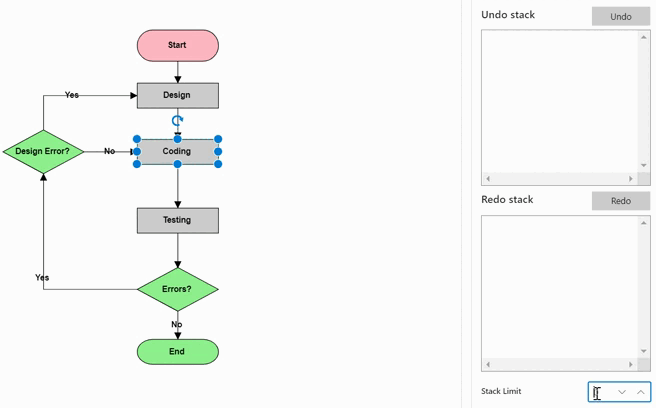

# Undo Redo support in Blazor Diagram Component

The Blazor Diagram component tracks the history of actions performed after initialization and provides support to reverse and restore those changes.

## How Undo and Redo Functions Operate in Blazor Diagram

The [Diagram](https://help.syncfusion.com/cr/blazor/Syncfusion.Blazor.Diagram.SfDiagramComponent.html) offers built-in functionality to track changes made through both user interactions and public APIs. These changes can be reverted or restored using shortcut keys or commands.

## How to Perform Undo and Redo Actions Using Shortcut Keys

Undo and redo commands can be executed through shortcut keys. Shortcut key for undo is Ctrl+Z and shortcut key for redo is Ctrl+Y.

## How to Use Public APIs for Undo and Redo

The [Undo](https://help.syncfusion.com/cr/blazor/Syncfusion.Blazor.Diagram.SfDiagramComponent.html#Syncfusion_Blazor_Diagram_SfDiagramComponent_Undo) and [Redo](https://help.syncfusion.com/cr/blazor/Syncfusion.Blazor.Diagram.SfDiagramComponent.html#Syncfusion_Blazor_Diagram_SfDiagramComponent_Redo) methods allow you to programmatically revert or restore changes. The following code example illustrates how to undo/redo the changes through code.

```cshtml
SfDiagramComponent Diagram;

// Reverts the last action performed.
diagram.Undo();

// Restores the last undone action.
diagram.Redo();
```

The [HistoryChanged](https://help.syncfusion.com/cr/blazor/Syncfusion.Blazor.Diagram.SfDiagramComponent.html#Syncfusion_Blazor_Diagram_SfDiagramComponent_HistoryChanged) event is triggered when a change in the diagram is reverted or restored.

### How to Group Multiple Changes

The History list feature enables users to revert or restore multiple changes through a single undo/redo command. This functionality is particularly useful when dealing with complex operations, such as modifying the fill color of multiple elements simultaneously.

To implement this feature, use the [StartGroupAction](https://help.syncfusion.com/cr/blazor/Syncfusion.Blazor.Diagram.SfDiagramComponent.html#Syncfusion_Blazor_Diagram_SfDiagramComponent_StartGroupAction) method to signal the diagram to begin grouping changes. Once the desired changes are made, call the [EndGroupAction](https://help.syncfusion.com/cr/blazor/Syncfusion.Blazor.Diagram.SfDiagramComponent.html#Syncfusion_Blazor_Diagram_SfDiagramComponent_EndGroupAction) method to indicate that the grouping process should stop. This approach allows for efficient management of multiple changes as a single unit in the undo/redo history.
 The following code illustrates how to undo/redo to change multiple elements at a time.

```cshtml
SfDiagramComponent diagram;

//Starts grouping the changes.
diagram.StartGroupAction();

//Ends grouping the changes.
diagram.EndGroupAction();
```

## How to Track Undo and Redo Actions Using the History Change Event

* This event can be utilized for customization purposes during interactions with diagram elements.
* When users interact with nodes or connectors, entries are added to the history list, triggering this event.

The [HistoryChangedEventArgs](https://help.syncfusion.com/cr/blazor/Syncfusion.Blazor.Diagram.HistoryChangedEventArgs.html) provides notifications about changes occurring during the undo/redo process. This allows you to track and respond to modifications in the diagram's state.

```cshtml
@using Syncfusion.Blazor.Diagram

@* Initialize Diagram *@
<SfDiagramComponent @ref="@diagram" Height="600px" HistoryChanged="@OnHistoryChange">
</SfDiagramComponent>

@code
 {
    SfDiagramComponent diagram;

    public void OnHistoryChange(HistoryChangedEventArgs args)
    {
        //Causes of history change.
        HistoryChangedAction ActionTrigger = args.ActionTrigger;
    }
}
```
A complete working sample can be downloaded from [GitHub](https://github.com/SyncfusionExamples/Blazor-Diagram-Examples/tree/master/UG-Samples/Undo-Redo/HistoryChange)

## How to Set Stack Limit

The [StackLimit](https://help.syncfusion.com/cr/blazor/Syncfusion.Blazor.Diagram.DiagramHistoryManager.html#Syncfusion_Blazor_Diagram_DiagramHistoryManager_StackLimit) property of the history manager allows to set a maximum number of history entries that can be stored in the history list. This limit helps control the memory usage and optimizes the performance of undo and redo operations by restricting the number of actions that can be undone or redone.

```cshtml
@using Syncfusion.Blazor.Diagram

@* Initialize Diagram *@

<SfDiagramComponent @ref="@diagram" Height="600px" Nodes="@nodes">
<DiagramHistoryManager StackLimit="@stackLimit"></DiagramHistoryManager>
</SfDiagramComponent>

@code
{
    SfDiagramComponent diagram;
    DiagramObjectCollection<Node> nodes = new DiagramObjectCollection<Node>();

    int stackLimit = 3;

    protected override void OnInitialized()
    {
        Node diagramNode = new Node()
        {
            ID = "node1",
            OffsetX = 300,
            OffsetY = 140,
            Width = 145,
            Height = 60,
            Style = new ShapeStyle()
            {
                Fill = "#357BD2",
                StrokeColor = "White"
            },
            Shape = new FlowShape()
            {
                Type = NodeShapes.Flow,
                Shape = NodeFlowShapes.Terminator
            }
        };
        nodes.Add(diagramNode);
    }
}
```
A complete working sample can be downloaded from [GitHub](https://github.com/SyncfusionExamples/Blazor-Diagram-Examples/tree/master/UG-Samples/Undo-Redo/StackLimit)



## Current entry
We can also get the current history entry from the [CurrentEntry](https://help.syncfusion.com/cr/blazor/Syncfusion.Blazor.Diagram.DiagramHistoryManager.html#Syncfusion_Blazor_Diagram_DiagramHistoryManager_CurrentEntry) property of the [DiagramHistoryManager](https://help.syncfusion.com/cr/blazor/Syncfusion.Blazor.Diagram.DiagramHistoryManager.html) that allows to track changes occurring during the undo or redo process.

The following code shows how to get the current entry from the diagram history:

```cshtml
@using Syncfusion.Blazor.Diagram
@using Syncfusion.Blazor.Buttons
<SfButton Content="GetCurrentEntry" OnClick="@GetCurrentEntry" />

@* Initialize Diagram *@
<SfDiagramComponent @ref="@diagram" Height="600px" Nodes="@nodes">
</SfDiagramComponent>

@code
{
    //Reference the diagram
    SfDiagramComponent diagram;

    DiagramObjectCollection<Node> nodes = new DiagramObjectCollection<Node>();

    protected override void OnInitialized()
    {
        nodes = new DiagramObjectCollection<Node>();
        // A node is created and stored in the nodes collection.
        Node node = new Node()
        {
            ID = "node1",
            // Position of the node.
            OffsetX = 250,
            OffsetY = 250,
            // Size of the node.
            Width = 100,
            Height = 100,
            Style = new ShapeStyle() { Fill = "#6495ED", StrokeColor = "white" }
        };
        // Add node.
        nodes.Add(node);
    }
    public void GetCurrentEntry()
    {
        Console.WriteLine(diagram.HistoryManager.CurrentEntry);
    }
}

```
A complete working sample can be downloaded from [GitHub](https://github.com/SyncfusionExamples/Blazor-Diagram-Examples/tree/master/UG-Samples/Undo-Redo/CurrentEntry)

## How to track custom entry

[Diagram](https://help.syncfusion.com/cr/blazor/Syncfusion.Blazor.Diagram.SfDiagramComponent.html) offers robust functionality to monitor and track modifications made to custom properties. The following example demonstrates how to effectively implement change tracking for custom property alterations, enhancing the diagram's undo-redo capabilities and providing better control over the diagram's state.

```cshtml
@using Syncfusion.Blazor.Diagram
@using Syncfusion.Blazor.Buttons

<SfButton Content="CustomEntry" OnClick="@OnCustomEntry" />

@* Initialize Diagram *@
<SfDiagramComponent @ref="@diagram" Height="600px" Nodes="@nodes">    
</SfDiagramComponent>

@code
 {
    SfDiagramComponent diagram;
    DiagramObjectCollection<Node> nodes = new DiagramObjectCollection<Node>();

    protected override void OnInitialized()
    {
        nodes = new DiagramObjectCollection<Node>();
        Dictionary<string, object> NodeInfo = new Dictionary<string, object>();
        NodeInfo.Add("nodeInfo", "Central Node");
        // A node is created and stored in the nodes collection.
        Node node = new Node()
        {
            ID = "node1",
            // Position of the node.
            OffsetX = 250,
            OffsetY = 250,
            // Size of the node.
            Width = 100,
            Height = 100,
            Style = new ShapeStyle() { Fill = "#6495ED", StrokeColor = "white" },
            AdditionalInfo = NodeInfo
        };
        // Add node.
        nodes.Add(node);
    }

    private void OnCustomEntry()
    {
        HistoryEntry entry = new HistoryEntry();
        entry.UndoObject = diagram.Nodes[0];
        diagram.AddHistoryEntry(entry);
    }
}
```
A complete working sample can be downloaded from [GitHub](https://github.com/SyncfusionExamples/Blazor-Diagram-Examples/tree/master/UG-Samples/Undo-Redo/CustomEntry)

### How to Handle History Adding Event

[HistoryAdding](https://help.syncfusion.com/cr/blazor/Syncfusion.Blazor.Diagram.DiagramHistoryManager.html#Syncfusion_Blazor_Diagram_DiagramHistoryManager_HistoryAdding) event in the [DiagramHistoryManager](https://help.syncfusion.com/cr/blazor/Syncfusion.Blazor.Diagram.DiagramHistoryManager.html) allows to control the addition of history entries. This event is triggered before a new entry is added to the history stack. It provides a history entry as an argument and expects a boolean return value indicating whether the specific entry should be added (true) or discarded (false).

```cshtml
@using Syncfusion.Blazor.Diagram

@* Initialize Diagram *@
<SfDiagramComponent @ref="@diagram" Height="600px" Nodes="@nodes">
    <DiagramHistoryManager HistoryAdding="@OnHistoryAdding"/>
</SfDiagramComponent>

@code
 {
    SfDiagramComponent diagram;
    DiagramObjectCollection<Node> nodes = new DiagramObjectCollection<Node>();

    protected override void OnInitialized()
    {
        nodes = new DiagramObjectCollection<Node>();
        // A node is created and stored in the nodes collection.
        Node node = new Node()
        {
            ID = "node1",
            // Position of the node.
            OffsetX = 250,
            OffsetY = 250,
            // Size of the node.
            Width = 100,
            Height = 100,
            Style = new ShapeStyle() { Fill = "#6495ED", StrokeColor = "white" }
        };
        // Add node.
        nodes.Add(node);
    }

    private void OnHistoryAdding(HistoryAddingEventArgs entry)
    {
        // Sets true to cancel undo/redo action.
        entry.Cancel = true;
    }
}
```
A complete working sample can be downloaded from [GitHub](https://github.com/SyncfusionExamples/Blazor-Diagram-Examples/tree/master/UG-Samples/Undo-Redo/HistoryAdding)

### How to Implement Custom Undo and Redo Logic in Blazor Diagram

The custom undo-redo process allows to store and manage actions that are not captured by the default undo-redo history list. This feature provides greater flexibility and control over the diagram's state management.

The [Undo](https://help.syncfusion.com/cr/blazor/Syncfusion.Blazor.Diagram.DiagramHistoryManager.html#Syncfusion_Blazor_Diagram_DiagramHistoryManager_Undo) method in the [DiagramHistoryManager](https://help.syncfusion.com/cr/blazor/Syncfusion.Blazor.Diagram.DiagramHistoryManager.html) is invoked when a custom entry is in the undo stage. Similarly, the [Redo](https://help.syncfusion.com/cr/blazor/Syncfusion.Blazor.Diagram.DiagramHistoryManager.html#Syncfusion_Blazor_Diagram_DiagramHistoryManager_Redo) method in the DiagramHistoryManager is triggered when a custom entry is in the redo stage. These methods enable to implement custom logic for undoing and redoing specific actions in the diagram.

```cshtml
@using Syncfusion.Blazor.Diagram
@using Syncfusion.Blazor.Buttons


<SfButton Content="CustomEntry" OnClick="@OnCustomEntry" />

<SfDiagramComponent @ref="@diagram" Height="600px" Nodes="@nodes">
    <DiagramHistoryManager StackLimit="@stackLimit" HistoryAdding="@OnHistoryAdding" Undo="@onCustomUndo" Redo="@onCustomRedo" />
</SfDiagramComponent>

@code
{
    //Reference the diagram
    SfDiagramComponent diagram;
    //Intialize diagram's nodes collection
    DiagramObjectCollection<Node> nodes = new DiagramObjectCollection<Node>();
    string EventValue = string.Empty;

    int stackLimit = 3;

    protected override void OnInitialized()
    {
        Dictionary<string, object> NodeInfo = new Dictionary<string, object>();
        NodeInfo.Add("nodeInfo", "Central Node");
        // A node is created and stored in the nodes collection.
        Node node = new Node()
            {
                ID = "node1",
                // Position of the node
                OffsetX = 250,
                OffsetY = 250,
                // Size of the node
                Width = 100,
                Height = 100,
                Style = new ShapeStyle() { Fill = "#6495ED", StrokeColor = "white" },
                AdditionalInfo = NodeInfo
            };
        // Add node
        nodes.Add(node);
    }

    private void OnCustomEntry()
    {
        HistoryEntry entry = new HistoryEntry();
        entry.UndoObject = diagram.Nodes[0];
        diagram.AddHistoryEntry(entry);
    }

    private void OnHistoryAdding(HistoryAddingEventArgs entry)
    {
        // Sets true to cancel undo/redo action.
        entry.Cancel = false;
    }

    private void onCustomUndo(HistoryEntryBase entry)
    {
        (entry.RedoObject) = entry.UndoObject.Clone() as Node;
        (entry.UndoObject as Node).AdditionalInfo[(entry.UndoObject as Node).ID] = "Start";
        EventValue += "UndoObject:" + (entry.UndoObject as Node).AdditionalInfo[(entry.UndoObject as Node).ID];
    }

    private void onCustomRedo(HistoryEntryBase entry)
    {
        EventValue += "RedoObject:" + (entry.RedoObject as Node).AdditionalInfo[(entry.RedoObject as Node).ID];
        var current = entry.UndoObject.Clone() as Node;
        (entry.UndoObject as Node).AdditionalInfo[(entry.UndoObject as Node).ID] = "Description";
        entry.RedoObject = current;
    }
}
```
A complete working sample can be downloaded from [GitHub](https://github.com/SyncfusionExamples/Blazor-Diagram-Examples/tree/master/UG-Samples/Undo-Redo/CustomUndoRedo)

## How to enable and disable undo and redo
The Blazor Diagram component provides properties to control the availability of undo and redo operations. Use the [CanUndo](https://help.syncfusion.com/cr/blazor/Syncfusion.Blazor.Diagram.DiagramHistoryManager.html#Syncfusion_Blazor_Diagram_DiagramHistoryManager_CanUndo) and [CanRedo](https://help.syncfusion.com/cr/blazor/Syncfusion.Blazor.Diagram.DiagramHistoryManager.html#Syncfusion_Blazor_Diagram_DiagramHistoryManager_CanRedo) properties of the [DiagramHistoryManager](https://help.syncfusion.com/cr/blazor/Syncfusion.Blazor.Diagram.DiagramHistoryManager.html) to enable or disable undo and redo functionality programmatically.

This feature is useful when want to temporarily restrict users from performing undo or redo operations based on certain conditions or application states.

**Key Points:**
* *CanUndo:* When set to false, prevents undo operations from being executed, even if there are entries in the undo history.
* *CanRedo:* When set to false, prevents redo operations from being executed, even if there are entries in the redo history.
* These properties affect both programmatic calls to Undo() and Redo() methods as well as keyboard shortcuts (Ctrl+Z and Ctrl+Y).
* The properties can be toggled dynamically based on your application's requirements.

@using Syncfusion.Blazor.Diagram
@using Syncfusion.Blazor.Buttons

<SfButton Content="Disable Undo/Redo" OnClick="@DisableUndoRedo" />
<SfButton Content="Enable Undo/Redo" OnClick="@EnableUndoRedo" />

@* Initialize Diagram *@
<SfDiagramComponent @ref="@diagram" Height="600px" Nodes="@nodes">
</SfDiagramComponent>

@code
{
    SfDiagramComponent diagram;
    DiagramObjectCollection<Node> nodes = new DiagramObjectCollection<Node>();

    protected override void OnInitialized()
    {
        nodes = new DiagramObjectCollection<Node>();
        // A node is created and stored in the nodes collection.
        Node node = new Node()
        {
            ID = "node1",
            // Position of the node.
            OffsetX = 250,
            OffsetY = 250,
            // Size of the node.
            Width = 100,
            Height = 100,
            Style = new ShapeStyle() { Fill = "#6495ED", StrokeColor = "white" }
        };
        // Add node.
        nodes.Add(node);
    }

    private void DisableUndoRedo()
    {
        // Disable undo and redo operations
        diagram.HistoryManager.CanUndo = false;
        diagram.HistoryManager.CanRedo = false;
    }

    private void EnableUndoRedo()
    {
        // Enable undo and redo operations
        diagram.HistoryManager.CanUndo = true;
        diagram.HistoryManager.CanRedo = true;
    }
}

A complete working sample can be downloaded from [GitHub](https://github.com/SyncfusionExamples/Blazor-Diagram-Examples/tree/master/UG-Samples/Undo-Redo/DisableUndoRedo)
